# UNSW《前端编程｜ Web Front-end Programming COMP6080 23T1》中英字幕（deepseek-R1 p56 -57-COMP6080 - Product 🍪 Before you code.zh_en -BV17RXGYuEaM_p56-

Hey， Sam yeah， as a developer， the thing I love the most is when I get to see people who are experiencing the magic of the apps that we build。

 someone who's overjoyed because we build feature and they're able to get something done in their life。

😊，And in order to really drill into that and to be able to achieve that as a front ender。

 it's really important to think about the user experience you're creating and the user interface because that is the way that people experience U app and that is the way that your app communicates itself to the outside world So in today's lecture we're gonna I know that we did a lecture last week on mobile user experience。

 but we're going to step back a bit a bit bigger picture thinking about what is user experience generally what is user interface design generally and how can we apply that before we code to make sure that we're setting up our projects for success All right so no discussion of UI and UX would be complete without thinking about what is exactly so UX is user experience UI user interface the way I like to think about it is that UX is a little bit higher level than UI So UX is about the usability of the app is about。

😊，How people， what processes they use up？Things they're going through to complete their tasks。

 like how they think about what they're trying to do。

 whether the app allows them to actually do that and who your users are and all of the research and interviews that goes along with trying to find that out user interface on the other hand is a bit more it's kind of if user experience is more in the planning side of things user interface is more in the coding side of things。

 but it's obviously not coding it's coding with pixels is visual design type of work making the graphics。

 it's doing the copywriting for all of the buttons and all of the headings the pixels。

 the shadows it's creating the brand the feeling of the application through the visual medium So that is obviously this is a very loose definition know in the real world these don't often match jobs like I know in my company we have product designers who kind of who do both of these responsibilities but then user experience is。

Of something that is a shared responsibility amongst the whole team because even planning work touches on aspects of user experience。

I think there is a real value as a front end as having an understanding of these kind of concepts so that even if you don't end up designing and painting pixels。

 you have some kind of understanding so that we can help push this along when working a team。

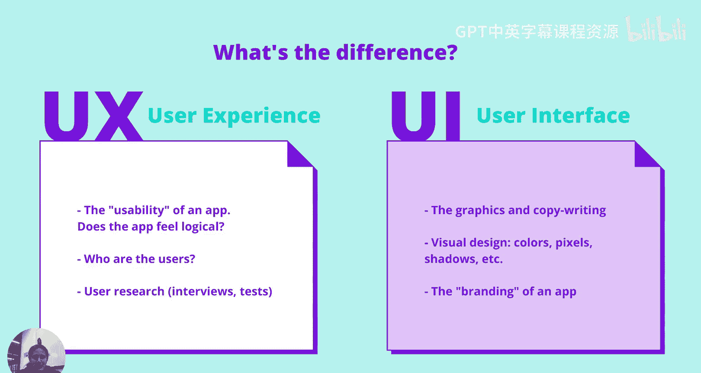

So today we're going to focus on the UIuxX work that happens before we start codinging how do we make an app idea into an app reality that then we can go and build so three things we're going to look at first we're going to look at from UX bit of basic UX about how we can look at problem from use point of view then we're to look at mockups as how we can start moving from UX UI and then we're going to look at how design systems and save us a lot of time when thinking about UI suite。

😊。

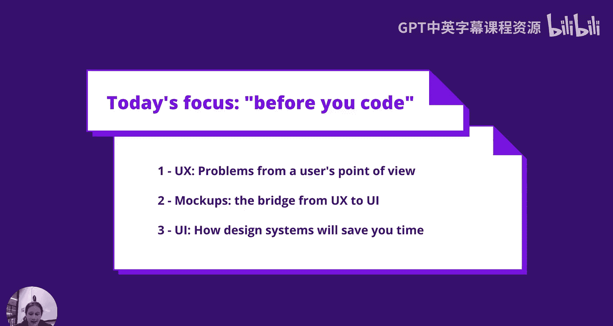

Why do we make apps， This is a very deep philosophical question I mean obviously there are lots of answers to this question you know you can make an app because that's your job。

 you can make an app because Hayden told you to and that's your assignment I don't think that's a very useful from a user experience perspective because that doesn't tell us a lot One way to look at why we make apps that does tell us a lot is to think that we make apps to help our users achieve their goals and that kind of begs two questions and I think this is a very fundamental to understanding if your app is usable and if it has good UX and there's those two questions are who are our users what are their goals So we're gonna break that down because this is the fundamental thing having an understanding of this is a really challenging thing it's not an it's not a question with a simple answer know it's something you will learn as you build more of an app as you talk to more users in your market as you build out your product as your market goals it's something that it's a simplification of reality It's that's。

The fight that we're always having which are to have the best understanding of these things that are very complex because there are billions of people using apps every day。

 but having a a good summary， a good understanding。

 a good mental model of this will help you make great prioritization decisions make great user experience and use the interface decisions and just generally ship amazing applications So first we're going dive into the who who is using your app why is this important that well I think is really important to think about who is using your app because different people will have different experience different people have used different other apps。

😊。

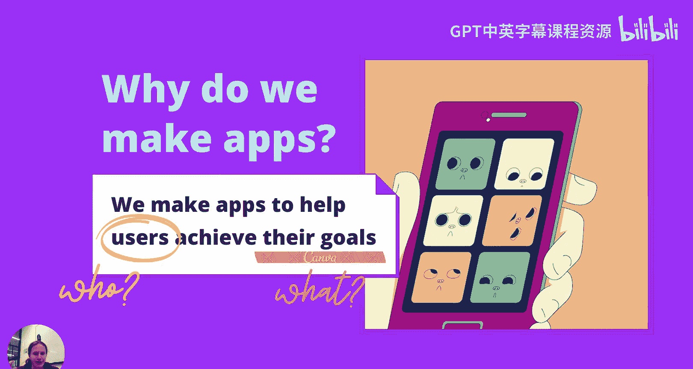

You know， when you're building a product it's really it's a matter of communication。

 it's a matter of being familiar to them so they understand you。

 but different enough so that you can actually be an amazing and achieve their goals and in order to do that effectively to decide what heels you want to die on versus what is a distraction。

 you need to understand where your users are coming from so that。

So that you can build something that's familiar where it should be and different where it shouldn't be familiar。

 So one example of this is to think about what kind of markets your users are from So for instance。

 I was in Singapore recently and I was using an app called Gr which is there it's bigger than Uber in Southeast Asia whereas Uber is much bigger I've seen FireIs markets like in the US or Australia and it was really striking Uber and grab like two very similar companies。

 but obviously very different geographical areas that they target totally different kind of homep page on the app Uber very minimal as very simple grounded whereas Gr has as much more busy。

 it's very obvious all of the features that it has。

 but it's not as immediately focused on one specific feature so obviously then these are both terrific apps from amazing teams who put a lot of thought into it。

 but theyve got to very different results because they're users that。😊。

Targeting are familiar with different things。Another example for this might be the difference between how support would work in like a government service versus a kind of social something app。

 you know， young people， if they have a younger market。

 they might need to offer more like live chat texting type features whereas old people might not be as comfortable doing that and they might prefer to you know call out the telephone type things so having an idea of who youll use like graphically really helps there。

The other way that you want to try and understand your users is how your users think。

 obviously this is hard， we're not all we can't be telepathic。

 but we can give it a bit of a shot to try and match the user's mental models and you can tease at this through interviews and research or just at a basic level just just talking to people and trying to be empathetic with the people in your market。

So a mental model is the way that users think about something， the way they think about a task。

 the way they think about how your system works， one example of mental models that I think is really interesting is the difference in different。

In graphic design software that targets different markets， how how they portray editing。

 So in Photoshop， which is much more a market that's much more educated about graphic design compared to a Canva or PowerPoint type software they talk a all about layers So you have layers。

 you can have layers within layers but everything is on a different layer whereas in a Canva I don't think layers is used at all in the user interface interface because that's not a term that our users have in their mental model。

 they just think of it as like there's a circle as a photo So it's about offering it's about catering to how most of your users are thinking if that's possible you know you've got to choose the hills you want to dial and in this case。

 teaching users the word layer isn't the most important thing so we build an application that it wasn't about layers。

 it is about individual shapes and elements and stuff。

 Another example of this is folders right So obviously folders is something that especially as things meant to Saas models and files are often stored in the database it could。

Lots of systems would support having a file in multiple folders， but from user experience effective。

 we might not want to support that because our users have a mental model of how a folder works。

 I think a folder， you know a file has to be in a folder。

 So it would be really confusing to see a file pop up in multiple folders。

 So it's about not thinking from a technical term， you know if layers or you the possibility of having files in multiple folder like that's a technical thing。

 youre throw it out the window and you've got it where possible and where its where it doesn't distract from actually finishing the user task。

 you want to match how they're thinking， which is know they think。A file can only be in one folder。

 which is all good or you know their are elements at last whatever。

 So that's about the who we talked about the who， but what about the what are their goals and why is it important to know that it's really important to think about what their goals are because it helps you make prioritization decisions obviously users can have lots of different goals but some of those goals are going be more important than others some of those goals are going to be more prevalent than others and you want to be catering towards the biggest goals I suppose in your app to help the most amount of users or the most important users depending on how you look at it And a little example of this is Canva versus Google Docs So obviously both of them have home pages and on the home pages they both list things that you can make and things that you've already made but because they're different applications targeting different with different user goals Can users are probably making Instagram posts more often Google Docs users are probably writing essays more often there's different prioritization of those features So Canva is much more oriented around creating a new thing。

often you could create an Instagram post in one sitting。

 so you wouldn't want to come back and edit the same Instagram post， whereas on Google Docs。

 you probably don't create new documents that often。

 but there's a lot of editing work that goes into writing an essay， for instance。

 so that've dedicated a lot more screen real estate towards finding things that you've made in the past with the reason dogs are part of that。

So that's the who the who and the when that's really important to happen in your head。

 I think a good way to force yourself to have that in your head is something called user stories so user stories are like these kind of sentences that go into the format as a person I want to do a task。

So that I can achieve a goal and this is kind of an alternative to writing requirement So instead of writing the application has to show all the tweets or my application has to show all the train times。

 you could say as a regular commuter I want to see the train times so that I know where to leave the office that's an example of again we're taking something that our feature language of like engineering program language around we're got to build the list of train times and they're taking that into user language and this is really popular with like agile program managers those type of things you can go read lots of greater lasting articles around how you can be agile and write user stories。

 but I think they're really helpful because they bring back this user empathy this user language throughout the whole design process and what that helps you do is that helps you think from user perspective bring in the user perspective when you're prioritizing features and ultimately think about what's most important at the end of the day which is making software that your user。

are going to use and love so yeah user stories and something you can try out in any project that you're doing。

 even like an assignment， for instance， as a way of breaking up all of the requirements of the project instead of thinking in terms of requirements think in terms of user stories to get thinking in that user mindset。

Great， so now we've had a bit of a dive into the QA of our application。

 we've scopeed out who's using it， what they're using it for。

 and we've got some core user stories around what they expect the features they expect application。😊。

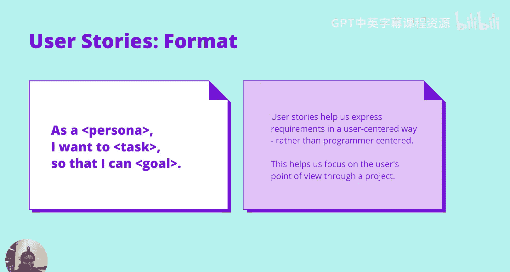

Now we're probably you know we're moving from this chaotic world of user stories and mock ups and we want to get towards user stories sorry and user experience and we want to get towards some more clarity。

 something that we can go and build because user stories aren't going to tell us exactly the features to build We need some mock ups that's really helpful so。

😊，Why are mockovs helpful， I have prepared this graphic but I explain it。

You wouldn't write an essay without a plan。Making an app without a mock up is a crime。 Yeah， there's。

 that's a， that's a bit of a name from。From back in the days。

 but I think there is some truth from that stealing video that you wouldn't go into something about a plan and for an application a mockup and mock up is often a really important part of the plan to make an application mockups are helpful because they're quicker on then quicker to do than programming and that's really helpful because it helps us get feedback more quickly on the plan。

 you can take your mockup to a mate just to see if if it's totally insane or if it's understandable。

 you can show it to people and your target demographic to see if they understand it if your if it matches their mental models。

 if it matches their past experiences， all those things we talked about with a mock up。

 a pitch is worth100 words your app when you've coded up your app。

 it'll be communicating how it works to users a mockup lets you test how well。

Map is going to be communicating how it works to users。

So it's a really helpful step in making an app， but obviously there's a wide range of mock ups so I'm going to be out paying for a specific type of mockup today that I think is really helpful for front end programmers because notice there's lots of things that we're not good at as frontend programmers。

 there's things front end programmers generally probably stronger coding than they are when you're stronger coding。

 you might not want to make pheric mockups in Figma because you might be quicker to just write the CSS。

 but I think it's really going to understand understand all the types of mockups so you know there are some types that even front enders are find usefuler do。

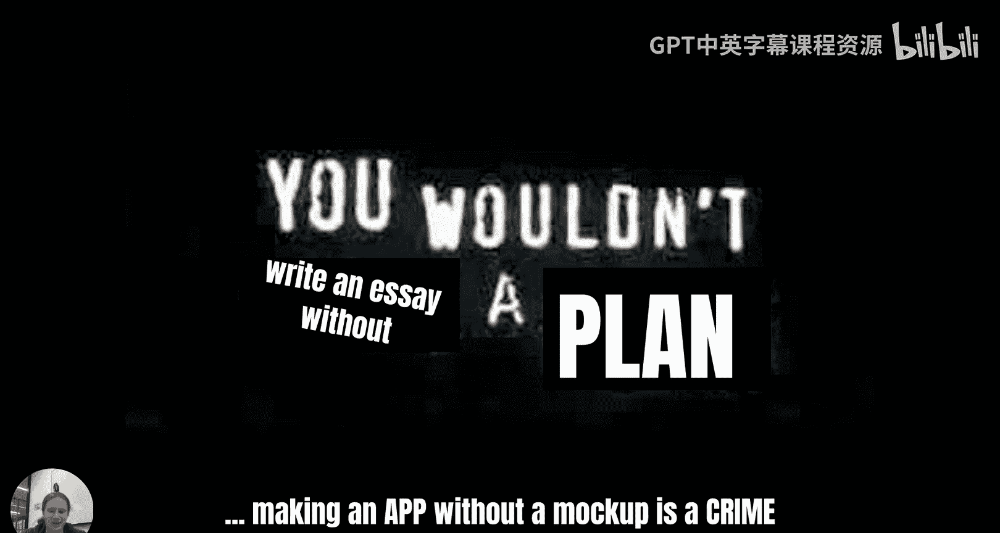

So there's obviously the scale of the mock up， how much is included in the mockup。

 so this kind of ranges from doing a mock up which just a single screen of your application or even smaller than a single screen。

 you could just do a mock up of a single component what does a tweet look like on Twitter and then moving up to what does the Twitter homepage look like and then moving up to this is it all on the left what the whole flow of using Twitter is so thinking back to a user story of like as a user I can write a tweet。

 it shows me what does the homepage look like and then it shows me what does it look like when I start typing my tweet and then it shows me when I press the send button what does it look like how the user cheese that tasks through the mockup but then if you think it's two aes in this mockup。

 we have scale on one side， which is how much stuff is covered by the mockup。

 whether it's a whole flow which is a single screen or component then we have the fidelity of the mock up on the other access so we have lowf mockups like sketches and wire frames。

😊，And we have high fi mockups and these are pixel perfect designs that you professional visual user interface designer might make in Figma Some people in argued that user stories where you're just writing text are the ultimate lowfi mockups I disagree with them because I think that a picture is worth a thousand words and mockup it just has that element of being so much more concise than use a three written text。

 but everyone to their own opinion really， so lowfi I think lowfi mockups often as a frontender if you're familiar with CSAs and HTML。

 it's often easier to go straight from a lowfi mockup to building an app than it is to go through a high-fi mockup but if you're working on a team with another designer。

 it might not actually be your responsibility to decide all the details of how we go from the lowfi mockup to the high-fi mockup so when you're working in a team with a designer they might create a highfi mockup so then you know exactly what you're going to be information。

But today we're going to focus on low flame mockups because I think that's something that is really helpful and we're going to look at some tips on how to create low flame mockups as a way to plan out your application before you built it and so that you can test your application by showing it to other people and seeing if they understand it。

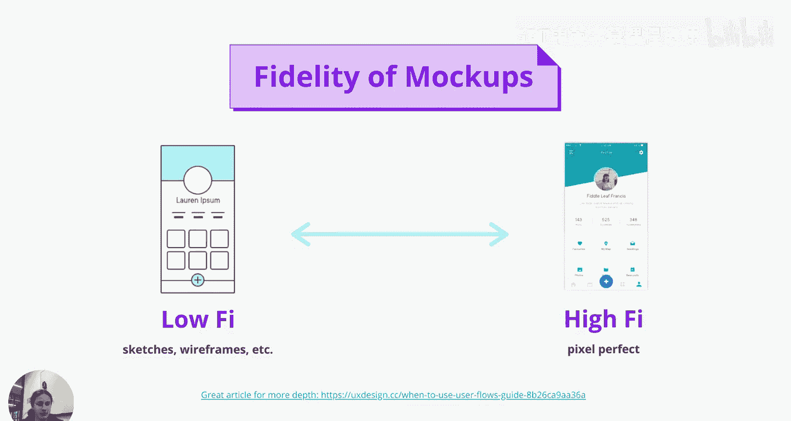

One exercise that I love in low fight mockups and I think you could do this as in your assignment in any app that you're building is crazy as so how does crazy As work three steps you get a piece of paper a piece of paper we can actually。

You folded it in half。And then you fold it in half again。And then you fold it out the other way。

 as you can see on the screen and then on each of the eight squares that you've now folded into your paper you get out like a single pencil。

 single color， nothing fancy and you just try and mock up eight ideas on how to solve your problem up to eight you don't get that's fine and then you try and do that as quickly as possible So here's some example like on the top we have someone tos try to mock up ways to select a photo and we' you put them in a list you can put them in a grid like you just getting the ideas on paper So this is kind of this is like visual brainstorming its a really effective way to do it of course you get lots of ideas out and this is really helpful when you're stuck or when you're in a group and and you need to create ideas together because it allows your barrier to putting the stuff on the page and it gets you into the thinking mindset obviously once you've done that low mock。

 you might choose one that you think is nice and you can just continue pen on paper really easy way to make a mock up just putting the key details not not putting。

effort into making sure that the buttons are perfectly rounded or that the shadows are right keeping it really low it's getting the idea across to yourself and to other people who say that you know it's a button it's an app but it's it's not overly obsessed about the details So crazy A is one way to do that that's a quite useful consultant type piece of science Another way to do it is to draw on screenshots something we love doing in Canva you know my this is actually this is actually my mock up I was very proud of it as you see I'm not a graphic designer but it gets the point across and that's what's important about a mock up I could have written someone I think we should put like a box in the templates now they see this they know that what I'm talking about。

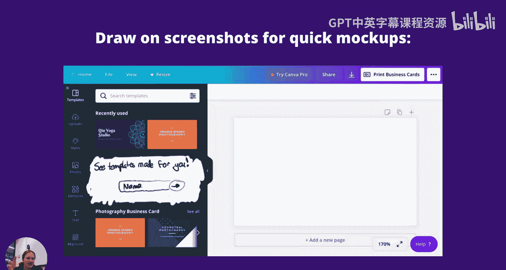

Another way can do it is if you're suggesting a change。

 which I think a lot of you guys right now are working probably working on like Greenfield new applications。

 but if you are suggesting a change， you can just start throwing screenshots together really so someone was suggesting that we should change the menu to look like the menu of the app which is on the very left to look like the white menu which is in the middle and we should have something in the background。

 so this is literally that the person here has put three screenshots together to portray what their idea is。

Screenshots rectangles just keep it really simple it's getting it communicating idea across and this is a great tool to get feedback if you tried to explain to me you know we'd be we'd be 100 words deep in exactly what's happening here but I can see the screenshot and if I was familiar with the product here which I am I know exactly what they're suggesting say mock ups are a really good。

😊，They are a really good art technique， keep it low fire， pen on paper。

Putting screenshots together in paint or Canva， you know all sorts of great applications and we can use a crazy a exercise if we really need to get the ideas of flowing so that we can get some mock ups and once you get some mockups you have a better idea。

You have a better idea of what we can do with that app later in the course in our last year lecture。

 we're going to be looking at what we can do with these kind of lockups and in a real application。

 how we can test this with users， but for now I think it's suffice to say just passingling around just trying to get people's feedback on them is a really good start to making it that more useful。

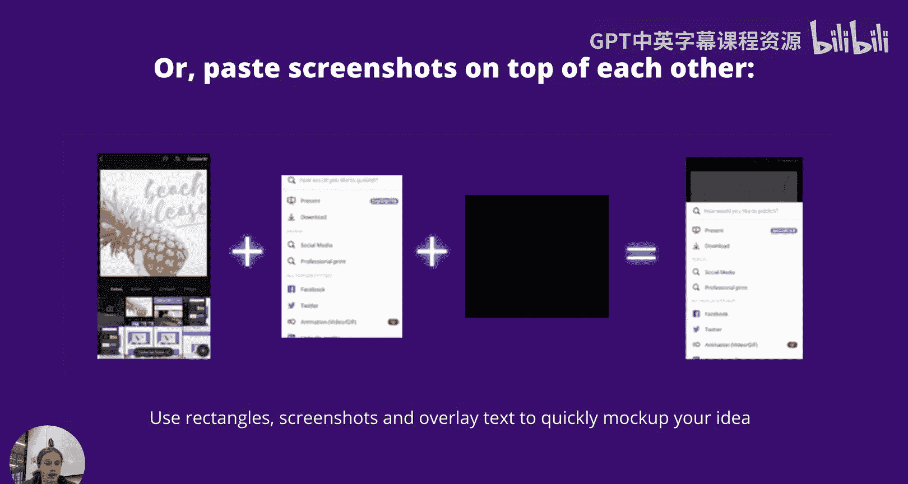

So part three today is now that you've got your mockups。

 you've got a kind of vague idea and your idea has gotten more concrete right so we started off thinking just who's it for。

 what's their user stories， what are they familiar with and then we kept that in mind we made some simple mockups of the application。

 we passed that round we got some feedback we you know pen and paper we've rough something out its pencil you know we've made a really simple mockup how do we actually get to implement that？

And when we're implementing。Now that's actually， there's so much to learn when it comes to you know making piece of perfect science。

 I'm not going to try thirt for you because I'm the wrong person Thirt20 because even like professional graphic user interface designers。

😊，And still a lot to consider for them no one's considering every button that they make from scratch。

 no one's thinking oh my god what of no one in the thing like an established applications thinking oh my God what shade of glue do I this button that's often not what people thinking because our users want consistency it's easier for users if they don't have to think every time is this button is this time and as a designer we want efficiency we don't want to have to every time go and to have to reinvent the button so。

😊，Just like programmers create guidelines， formatts， conventions。

 libraries and all kinds of things to make life easier designers have。

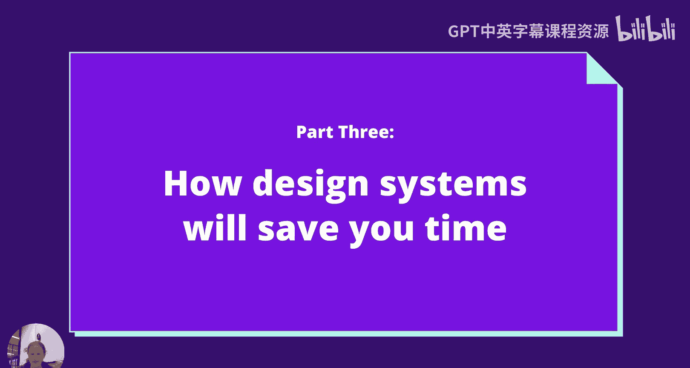

Design systems， so design systems are kind of like they're the library。

 but for designers they're like it。They're really useful there's so many examples of tons of design systems that are public out there that you can go and read I've actually included the links。

 you can click all of these or just click one actually there there's a lot there。😊。

Now you got material fluent from Microsoft， Apple's head。

You've got some smaller companies like atlasian or Shopify that have made their design systems public。

You have。And then you have internal companies design system so like Canva has an internal design system unfortunately it's not public I'd love to show it to you guys every you know every company has a design system no matter how formal it is really if it's a really small company the design system probably in the designer's head but as companies get bigger and more designs get on board they write them down so they can explain。

So that they can explain it to other designers。So what's in a design system Why is a design system going to help you Our design system often has there's lots of aspects space of design system they're a little bit different a lot of design systems have as a developer the first thing you'll see is like a library component so material has there's like a material android material for web library we're not going to look at that today that's going to be our next lecture very exciting we're going to be looking at how we implement and and use how we implement design system but for now we're going look at the bi highle stuff about what design systems have designers so design systems will also have UI components they'll have UI component files so when designers are making pixel perfect designs of high fidelity mockups they'll often use applications like sketchke a dobe H Figma maybe illustrate lots of different applications and and UI component library for designers would just be a bunch of like sketch or Figma files where they can copy paste so they can read button。

😊，But they'll have you know steps of the buttons， guidelines around how to use each component。

 those types of things， they often have general design and brand guidelines that's thinking about like what type of colors。

 fonts and spacing that the designer should use when making a user interface。

And then they'll often have content guidelines about how people should write when they're creating these interfaces。

 the tone， the grammar， all those types of things。This is really helpful because this covers a lot of questions that you might have when you're trying to create your interface you might be asking。

😊，What type of message runs but should it be done should should it be done or should it be saved design system would help guide you on that You might be thinking how much spacing should I put between things a design system will help guide you on that you might be thinking I have this problem and'm trying to think of like what are my options in terms of user interface elements that I could put there to help user achieve this goal and a design system will provide you user interface elements So let's go a deep dive I'm be I'm going be showing examples from different design systems often when when you're making application you probably want to stick to one design system because if you use different ones your application won't be consistent and it might be a bit confusing for users in the look is dead bad starters but it might be confusing for users because。

Because there'll be different patterns and different ideas in different parts of the application。

 so I would recommend you should sit to one design system when you're making an application。

 but I'll just be showing some examples from different design systems to give you guys an idea of what is in a design system and how that could help you when you're making your users。

😊，So let's look at the first from that list was UI components， here's material。O。

That's Google's design system we can see there's tons of UI components listed there you've got banners。

 bottom navigation bars buttons and you can click into any of them like so you can go take a look and inside of that or have the specs of what's the pan on the button help correct consistency there。

 but they also often have guidelines for designs because as a designer if I'm design interface face and I want to button with an icon as you can say the right I might be thinking where should the icon go does it go on the left does it go on the right does it go on the top can I put two icons in a button and those questions are answered in the design system someone else has made the decisions oftentimes those decisions are right is it put in also that like design system it's not the law it's a book of guidelines and recommendations but is it the law So sometimes you will straight from design systems。

And you'll want to create your own custom components I have an interesting story about that one competitor I think is actually a great example of。

😊，the value of design system components and consistencyencies throughout that application。

On the left here， we have a。We have it This is kind of two ways that the application has to do something on the left。

 we have component that isn't from their design system It's a custom component for this use case and it's a rotary dial or change a font as a user that feels a bit weird。

 but it's really important to realize that as a user that kind of just detracts from my task if I'm there to change the font I I'm now in stitches because it's quite funny but as well as being in stitches I might dare be confused but I've invested this mental energy in understanding what this rotary dial is instead of having mental energy left to invest in actually changing the font so on the other hand on the right if I was to use something that's more common in my design system or it is from my design system component library I career system that it might not look this cool or interesting but it lets me the user focus on the task rather than having to focus on。

😊，Understanding understanding user interface and at the end of the day users aren't using computers to understand cool novel user interface interfaces。

 they're using computers to get their job done so you know in this instance，😊。

I'm not a professional designer， but I recommend using something like on the right because it gets out of the way。

 it's more familiar and that's kind of the value that a design system provides。

 it gives you a list of those things that people find familiar and it lets you apply them in a consistent way across the product so that your users can focus on their tasks rather than focus on trying to understand you。

So as well as having UI components which are awesome。

 there's often more broad and vague guidelines as we talked about before on the left we see some color guidelines from Shopifyly so this is looking at their brand color。

 obviously colors one of the examples where you might want to tweak it。

 you might want to even even if you're using an existing design system you might to say oh I'm going to re material design。

 well these design system especially material or apples here Microsoft4。

 they encourage people to reuse their design because want Google wants all the Android apps kind of the same。

 but they often give you ways out to themement and changing colors is great one。

 but it's a good kind of crash course to start from a design system and have use that guidance from a professional designer to get some opinions and professional designers we use this guidance too content guidelines are really fun。

And they're helpful as well obviously this depends on what you're building if you're building a website that's very content heavy having a content and writing guideline is really important one great example of this is G UK which is the agency that's responsible for all the UK government's websites they have a set of terrific writing guidelines if you're looking for some good reading I'd recommend click the link and checking it out。

They have like a long list of words， they're like this is how you should use that word and words are like important to the way you interact with UK government。

😊，They're work for Medicare and stuff。It helps correct consistency and it helps them get the message they want across。

And as someone who's building that patient， it's often easy。

 it's really good to be able to pump those questions of， you know how do we write。

 what cases do we use， what's that right yourself， just pump that to a document that's written by some professionals who've done some research about exactly that question of how we design and why we design。

😊，So yeah， I suppose nows my whirlwin tour of design systems。

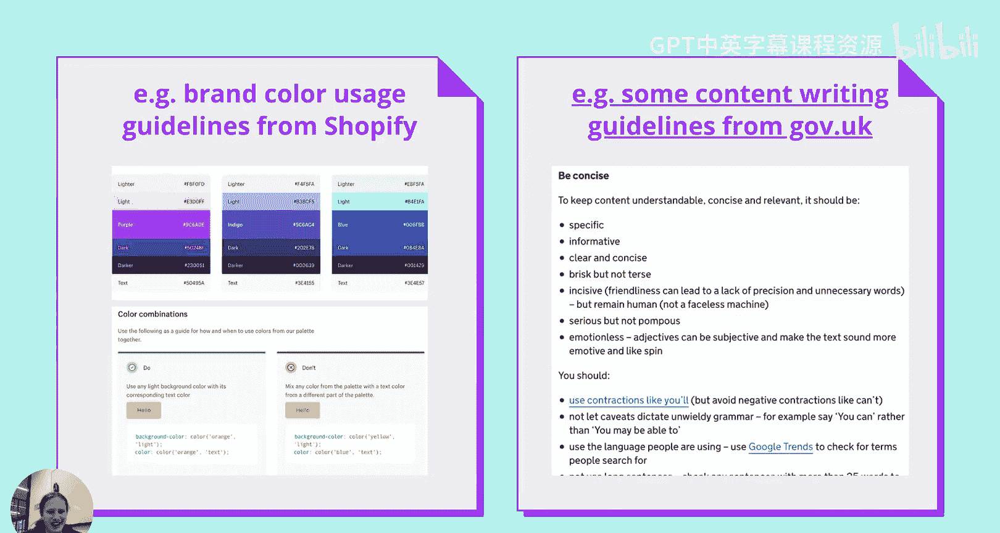

So I think in summary today， what we've done is we we've done a basic tour of UX and this is kind of in the order that I think is helpful for you guys to give it a shot UX how we frame the problem。

 thinking about who thinking about why and then the action item of considering using user stories instead instead of engineering requirements to frame your tasks two mockups lowfin mockups as a way to help you plan。

 consider using pen and paper using crazy a or just drawing on some screenshot to create these mockups really quickly and give yourself a plan before you making your application and three with user interface consider picking up a design system for your project instead of having to rein the wheel reit the button every time to start just reference the design system and that will let you create a consistent product that your users will understand that's all from me but next week we'll be doing a deep dive into design systems。

 how they get implemented technically and some tools a real worldl open source tools you can use to do that So yeah。

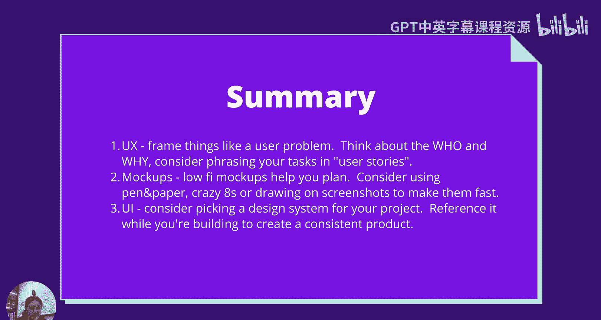

Good luck这样。