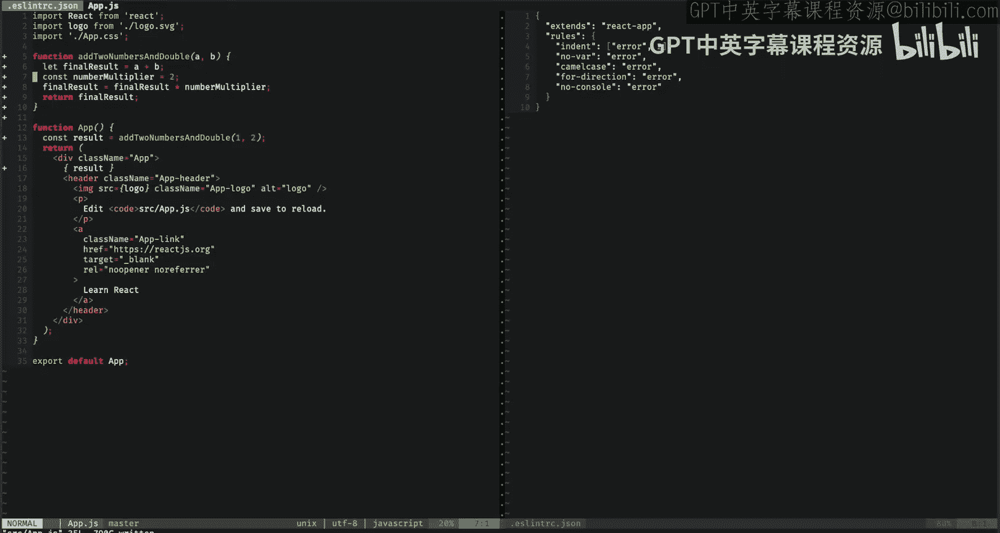

# 前端编程：第57-58讲：JavaScript代码检查（Linting） 🧹

在本节课中，我们将学习代码检查（Linting）的概念，了解它如何应用于JavaScript，并通过一些示例来演示其工作原理和实际应用。

## 概述

代码检查是一种用于发现代码中错误的方法。它属于静态代码分析的一种形式，这意味着它分析你编写的代码文本本身，而不尝试编译或运行代码。代码检查有助于避免常见错误或偏离最佳实践，通常作为防护栏，防止那些容易忽略的小错误。

## 什么是代码检查？

简单来说，代码检查是一种在代码中查找错误的方法。它是静态代码分析的一种变体。静态代码分析将你编写的代码作为输入并原地进行分析，它不尝试编译或运行你的代码，只是查看代码文本来发现常见错误。

代码检查很有用，因为它允许你避免常见错误或偏离最佳实践。它通常用作防护栏，保护你免受那些经常被忽略的小错误的影响。它能有效做到这一点是因为它速度快。检查器运行非常快，并且可以集成到你的编辑器中，以便在错误出现时立即报告。

检测常见错误和速度快这两点结合，意味着代码检查能极大地提高生产力。代码检查器在你编码时有效地引导你，让你更专注于功能，而不是你所使用的编程语言的特性。

然而，代码检查不能替代良好的测试框架。它只能发现与语言相关的错误，无法判断你想要实现什么，也无法检测运行时错误。代码检查不是强制执行良好系统设计或架构的方法，也不是让你的代码工作的灵丹妙药。它本身甚至无法检测你提供错误类型的错误，例如向函数传递数字而不是字符串。它也不是静态分析代码的唯一方法，尽管是最常见的。

## JavaScript的历史背景

在我们继续之前，让我们深入了解一些JavaScript的历史。JavaScript因其历史而有一些奇怪的行为，名声有些粗糙。JavaScript的第一个版本由Brendan Eich在大约10天内编写完成，他最初想把它带向一个完全不同的方向。多年来，JavaScript积累了许多人们可能不应该碰的功能和怪癖，早期的JavaScript代码因此常常充满错误且难以维护。

多年来，我们经历了一段JavaScript表现不佳的时期，但它是我们唯一的选择。然后在2008年，《JavaScript语言精粹》一书发布。这本书详细介绍了我们应该使用的JavaScript部分，以及我们可能应该隐藏并忘记的部分。虽然你可能在现实中遇到一些不同意见，但可以说很多现代地道的JavaScript代码都是建立在这本书的基础之上的。

那么，为什么这与代码检查相关呢？在这本书发布六年前，作者Douglas Crockford发布了JS Lint，这是第一个JavaScript代码检查器。在JavaScript中，你会发现代码检查被大量使用。在像JavaScript、Python、Ruby等动态且缺乏类型系统的语言中，这种情况很常见。原因在于没有编译器和类型系统，语言对你编写的内容不是很严格，并试图不阻碍你，但这意味着你有很大的空间犯错误。这在JavaScript中尤其常见，因为该语言有很多不好的部分。代码检查帮助我们确保只使用好的部分。

虽然JS Lint是2002年发布的第一个检查器，但ESLint现在是JavaScript行业标准的代码检查工具。

## 代码检查如何工作？

代码检查将你的代码作为输入。它被配置为具有一组规则。如果代码的某个区域违反了这些规则，检查器将检测到并报告这些情况。

代码检查规则通常分为两类：可能的错误和简单的最佳实践、风格等。它们可以用参数配置，可以设置为警告你或将其报告为错误。

当你运行检查器时，你可以将其作为命令运行，也可以设置为监视代码中的更改。这意味着当文件系统上发生更改时，它将自动检查并向你报告结果。

听起来很简单，尽管有点模糊。那么代码检查实际上是如何工作的呢？首先，检查器将代码作为原始字符串提供。它解析字符串并生成一个树状结构，我们称之为抽象语法树（AST）。这代表了程序的结构。它就像二叉搜索树，但节点不止两个。

树中的每个节点代表一个代码块，节点还包含有关代码开始和结束的行号和列号的信息。现在，代码检查配置有一个称为规则集的规则列表。每条规则都是一个函数，它接收AST（树状结构）并检查其中违反规则的模式。如果找到任何违规，它会报告它们以及它们开始和结束的位置。

## ESLint架构

这是ESLint的架构图，ESLint是最常见的JavaScript代码检查工具。在这里，你可以看到像CLI、源代码、规则、CI引擎等模块。

CLI模块是我们的用户界面，它读取我们的用户输入以决定做什么。我们有规则模块，它定义了我们的规则集。我们的源代码模块是负责解析代码并生成语法树的模块。而检查器接收源代码模块和规则模块，对树执行规则并报告发现的任何错误。

## 代码检查规则示例

ESLint中有大量可用的规则，但让我们看一些小例子。

`no-unreachable` 规则阻止你编写无法到达的代码。例如，如果你在return语句之后有代码，它会将其标记为警告或错误。

`no-unused-vars` 规则阻止你定义一个变量然后在任何地方都不使用它。

`no-use-before-define` 规则阻止你在代码中定义变量之前引用它。

最后三条规则是关于检测可能的错误。接下来的三条更多是关于最佳实践。

`indent` 规则强制代码中的一致缩进。

`no-var` 规则阻止你使用`var`关键字，强制使用ES6引入的`let`和`const`。

`no-console` 规则阻止你使用`console`上的方法。

## 如何开始使用代码检查？

幸运的是，你已经有了Create React App，它捆绑了预配置的ESLint安装。

让我们来看一下。这里你可以看到，左边是我的`App.js`文件，右边是一个名为`.eslintrc.json`的文件。这是检查器的配置文件，它位于项目的根级别。你可以看到这里我扩展了`react-app`。`react-app`是随Create React App捆绑的代码检查配置。

在左边，我已经注释了`eslint-disable`，这会禁用检查器。我现在移除它。突然，报告了一堆错误。第一个错误是一个警告，说函数已定义但从未使用。我们还有一些错误，说我们的一些变量引用未定义。此外，我们还有一个return语句没有引用正确的变量，以及其后出现的一些无法到达的代码。

首先，让我们通过将函数存储在结果中并在我们的应用程序中渲染它来引用我们的函数。这应该能消除我们函数上的错误，你可以看到在第5行，它消失了。需要注意的是，检查器可以检测错误，但有些错误它不会注意到。例如，我在这里没有引用正确的变量，检查器无法知道我想引用哪个变量，所以需要我手动修复。

我可以修复无法到达的代码错误，只需简单地将for语句移到return之前。你可以看到这里，`numberMultiplier`在其引用之后定义，所以我们需要做的就是将其向上移动。

很好，我们已经修复了代码检查错误，但我们的函数看起来仍然有点乱，仍然有一些问题。我可以做的是通过添加我自己的规则来扩展我们的代码检查配置。

这里的缩进有点奇怪，所以首先我要添加一个缩进规则。缩进规则说将缩进报告为错误，并寻找两个空格的缩进。你可以看到，当我自动保存时，它自动为我修复了缩进，现在我已经添加了那条规则。

我还可以看到一些使用`var`的地方，而我更希望使用`let`或`const`，所以我将在我们的规则中添加一个错误配置。当我自动保存时，你可以看到我顶部的`var`引用已被定义为`let`。

这看起来好一点了，但我的一些变量使用下划线而不是驼峰命名法，这不是最佳风格。所以我将在我的规则集中添加一个驼峰命名错误。有时检查器直到我重新加载文件才会报告错误，所以我现在重新加载它。

好了。你可以看到这里，所有我引用或定义使用下划线的变量的实例都被报告为错误。不幸的是，检查器无法为我们修复这个问题，因为它不知道变量名应该是什么。所以我需要手动修复。

好的，命名看起来好一点了，但实际上这个函数中有一个可能的错误与for循环有关。for循环继续的方向是错误的。但幸运的是，有一个代码检查规则可以保护我免受这种错误。通过设置`for-direction`规则报告错误，然后重新加载，你可以看到我的for循环现在报告循环中的更新子句使变量向错误方向移动。简单地将其改为递增即可修复。

在生产应用程序中，使用`console`语句也不太合适，所以我要移除它。我可以通过在我的代码检查配置中添加`no-console`规则来强制执行移除。我需要再次重新加载文件。现在你可以看到这里，有一些与意外console语句相关的错误，所以我将移除任何使用`console`的东西。现在我有了一个漂亮的函数。

你可以看到，通过向我们的检查器添加一些规则，我们能够强制执行最佳实践、良好风格并防范可能的错误。这是一个任意的例子，但这在大型代码库中带来的差异怎么强调都不为过。

最后需要注意的是，我们需要重新加载文件的原因是因为在这种情况下，检查器集成到了我们的编辑器中。如果我们更改代码检查配置，编辑器不一定会知道，直到我们重新加载文件，这会再次加载检查器。

## 总结

在本节课中，你学习了代码检查器的一般工作原理，它们如何应用于JavaScript，并且看到了ESLint如何集成到你的编辑器中以提供更好编码体验的演示。