# 前端编程：CSS框架：在React中使用CSS框架与组件库 🎨

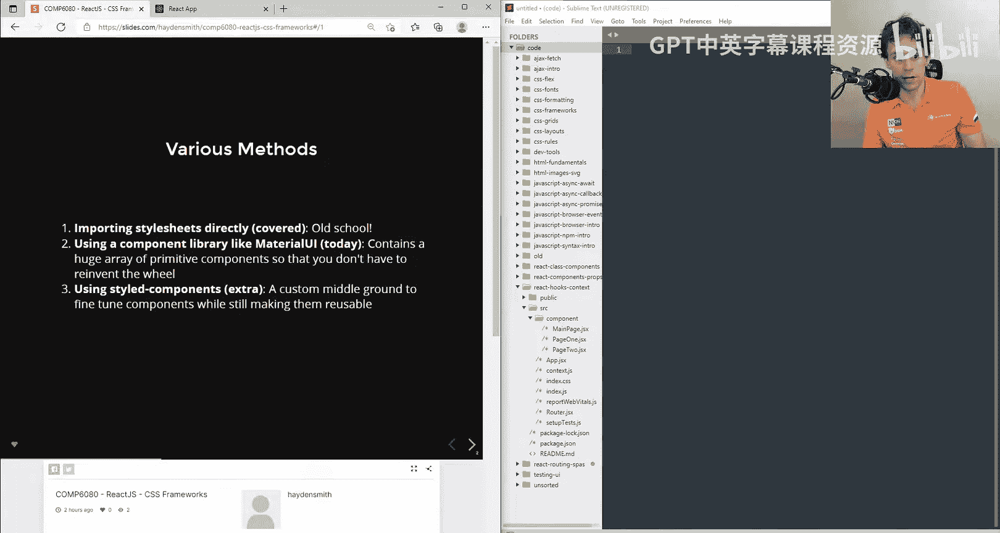

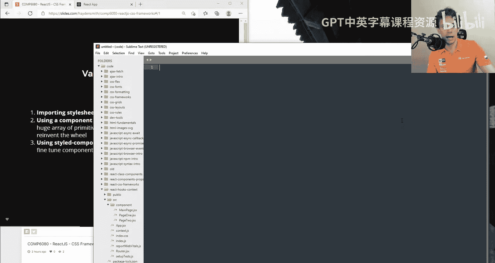

在本节课中，我们将学习如何在React应用中使用CSS框架和组件库，特别是Material UI。这是一种快速构建大规模、美观应用的有效方法。

在React中，有多种方式可以为页面添加样式并组织CSS。今天，我们主要关注一种可能最简单、最快速构建大型应用的方法。

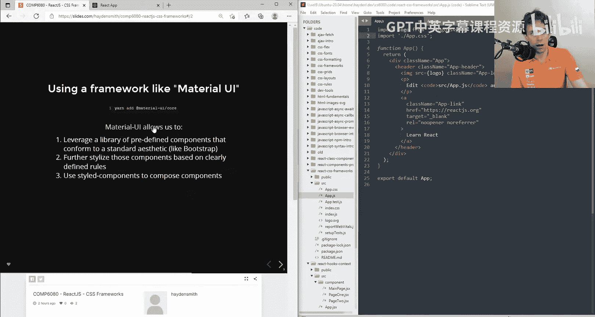

## 在React中使用CSS的方法

上一节我们提到了React中处理CSS的多种方式。本节中，我们来看看其中两种主要方法。

首先，在默认的React应用中，你会看到类似 `import './App.css'` 的语句。这是第一种方法，即直接导入样式表，我们在之前的课程中已经介绍过。

今天，我们将直接跳到第二种方法，这是一种高度抽象化、非常简便的方法：使用像Material UI这样的组件库。使用组件库意味着我们无需为按钮、表格、页眉等常见元素编写大量CSS，可以快速完成编码。

## 引入Material UI组件库

Material UI是一个为React等应用设计的库，可以轻松安装。以下是开始使用它的步骤。

1.  **安装库**：访问Material UI官网，复制并执行其提供的安装命令，从NPM安装必要的模块。
    ```bash
    npm install @mui/material @emotion/react @emotion/styled
    ```

2.  **浏览组件**：安装完成后，可以访问Material UI文档，查看其提供的众多预样式化组件，如按钮、复选框、卡片、对话框等。

## 使用Material UI组件

现在，让我们在一个简单的React页面中实际使用一个组件。

1.  **选择并复制组件**：在文档中找到你想要的组件，例如“按钮”。点击“显示源代码”，复制示例代码。
2.  **粘贴并导入**：将复制的JSX代码粘贴到你的React组件文件中。同时，确保从Material UI库中导入该组件。
    ```jsx
    import Button from '@mui/material/Button';

    function MyComponent() {
      return (
        <Button variant="contained">Hello</Button>
      );
    }
    ```
3.  **自定义组件**：现在页面上会出现一个带有Material UI样式的按钮。你可以轻松修改其文本、变体（如`contained`， `outlined`， `text`）或添加属性（如`disabled`）来改变其外观和行为。

## 组件的深入定制与主题

Material UI组件库的强大之处在于其可定制性和主题系统。

*   **修改属性**：你可以通过改变组件的属性来调整其外观，例如将按钮颜色改为`success`（绿色）或`warning`（橙色）。
*   **理解主题**：许多库都有预设的主题，其中颜色等样式通过语义化名称（如`primary`， `secondary`， `success`， `info`）定义。这有助于保持设计的一致性，并方便日后整体更换主题。

## 使用更复杂的组件

除了按钮，我们还可以使用更复杂的组件，如对话框。

1.  **复制复杂组件**：在文档中找到“对话框”组件，复制其JSX代码和相关的状态逻辑（如`useState`）。
2.  **处理导入**：确保导入所有需要的组件和React钩子。
3.  **整合与简化**：将代码粘贴到你的组件中，并根据需要清理和简化逻辑，例如将内联函数提取出来。

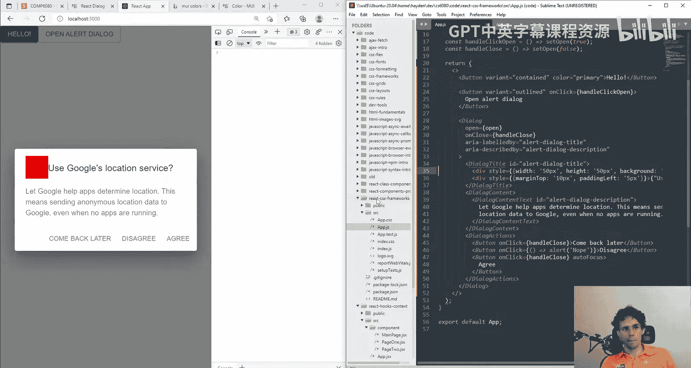

## 组件库的利弊权衡

使用组件库时，需要权衡便利性与定制自由度。

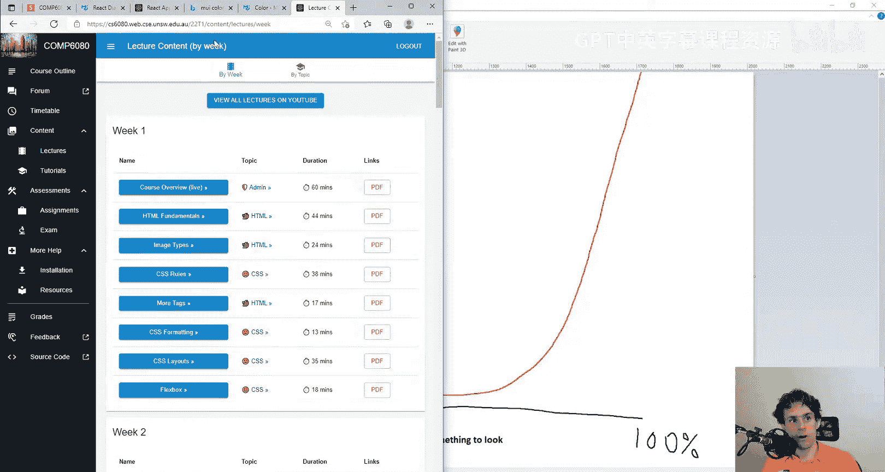

*   **快速实现**：使用组件库可以非常快速地实现约80%你期望的视觉效果，几乎不费力气。
*   **定制挑战**：当你需要实现一些特殊或精细的定制时（例如在对话框的特定位置添加一个图标或调整内边距），可能会遇到困难。你可能需要深入研究组件的内部结构或使用CSS覆盖，这有时会耗费较多时间。

这符合“80-20法则”：80%的成果可能来自20%的努力，而剩下20%的成果可能需要80%的努力。

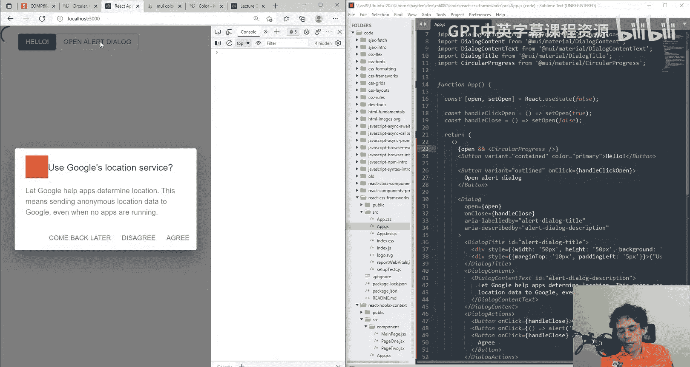

## 条件渲染与组合使用

你可以将Material UI组件与React的条件渲染等功能结合，创建动态的交互界面。

例如，可以仅在对话框打开时显示一个圆形进度条。这展示了如何快速构建功能丰富的界面。

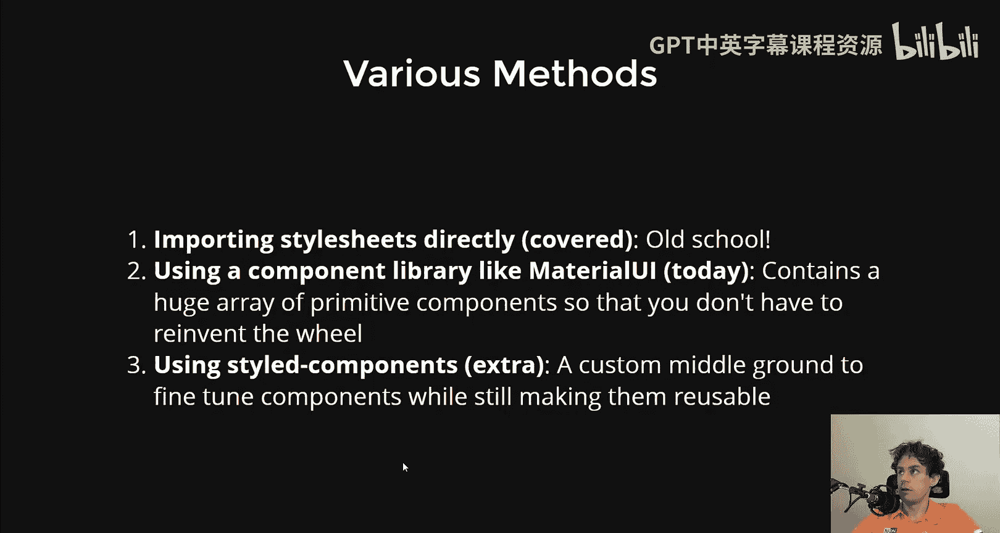

## 探索与查找资源

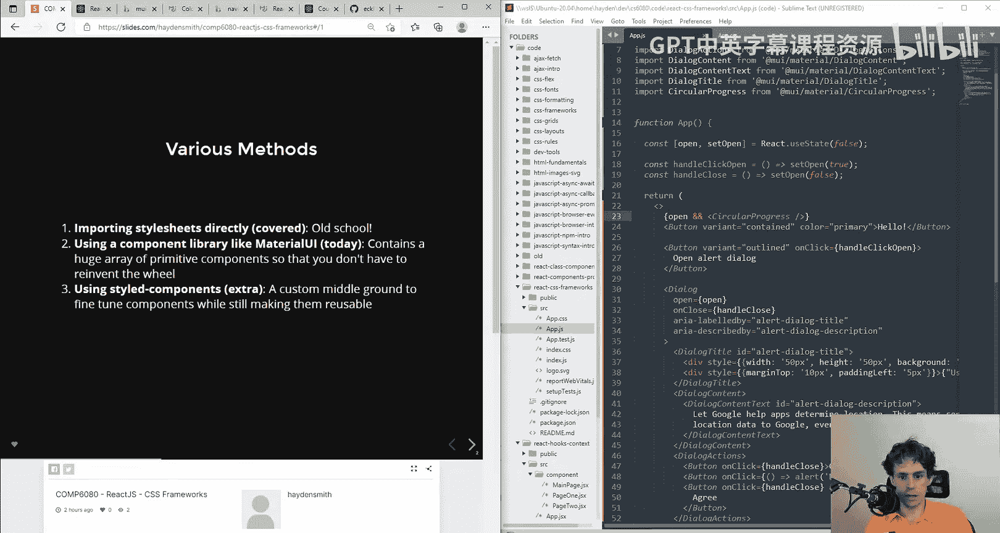

在实际开发中，你经常需要查找特定组件的用法或示例。

*   **利用搜索**：如果你在官方文档中找不到完全符合需求的示例（例如多级侧边栏导航），可以尝试在网络上搜索，如“navbar material UI”。
*   **参考现有代码**：查看使用了Material UI的现有项目（如本课程网站）的源代码，是学习组件实际用法的好方法。

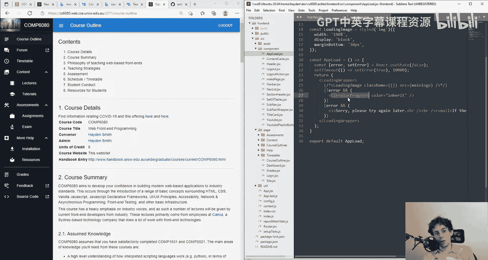

## 第三种样式方案：Styled Components

除了全局CSS和组件库，还有第三种流行的样式方案：Styled Components。

*   **什么是Styled Components**：它是一个CSS-in-JS库，允许你通过JavaScript创建具有样式的组件。
*   **在Material UI中使用**：Material UI也提供了自己的`styled`函数，功能类似。
    ```jsx
    import { styled } from '@mui/material/styles';
    import Button from '@mui/material/Button';

    const BigButton = styled(Button)({
      width: '200px',
    });

    // 使用 <BigButton>Click me</BigButton>
    ```
*   **优势**：
    *   **作用域化**：样式被限定在组件内，避免了全局CSS的污染问题。
    *   **可复用与可组合**：可以创建自定义的“原始”组件，并能基于现有组件进行样式继承和扩展，非常适合构建自己的设计系统。
    *   **动态样式**：可以方便地根据组件props应用不同的样式。

## 内联样式与SX属性

对于微小的样式调整，你可以直接使用内联`style`属性或Material UI组件的`sx`属性。

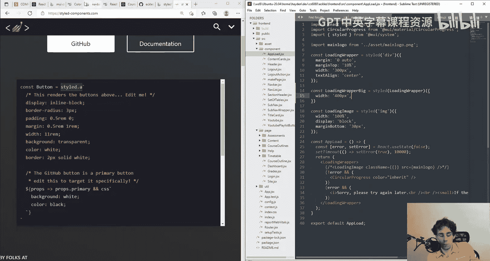

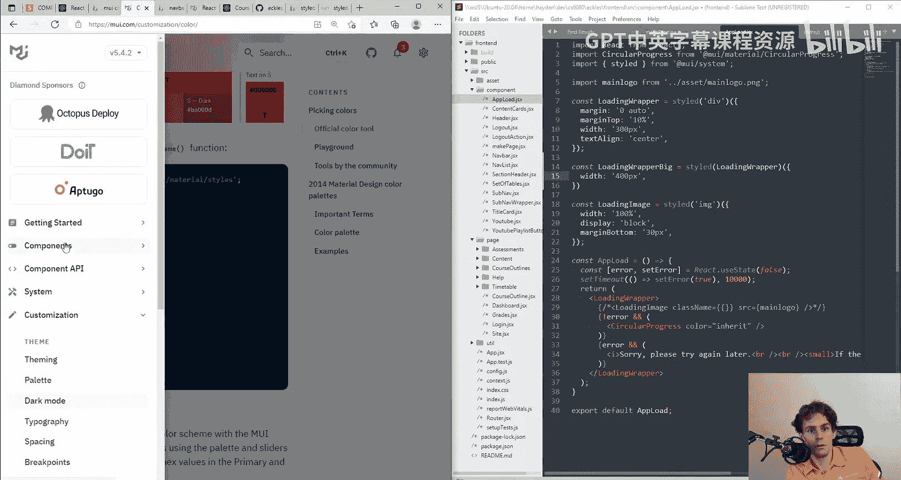

*   **`style`属性**：适用于简单的覆盖。
*   **`sx`属性**：更强大，可以访问主题（theme）中的值，进行更复杂的响应式设计。
    ```jsx
    <Button sx={{ width: 200, color: 'primary.main' }}>Styled with sx</Button>
    ```
*   **最佳实践建议**：如果样式规则超过一两条，建议使用`styled`函数创建新的组件，以保持代码的整洁和可复用性。

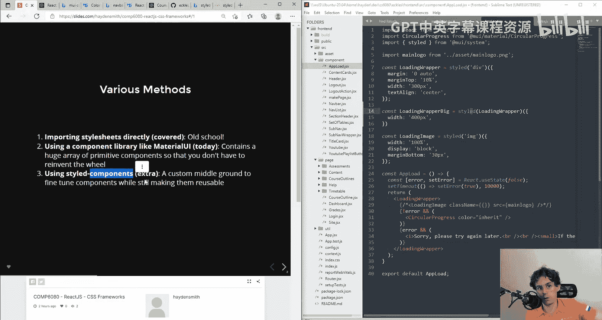

## 总结

本节课中，我们一起学习了在React应用中使用CSS框架和组件库的核心知识。

我们首先对比了直接导入CSS和使用组件库（如Material UI）两种方法。然后，我们逐步实践了如何安装Material UI、查找并使用其组件（从简单的按钮到复杂的对话框），并探讨了通过属性和主题进行定制。

我们也客观分析了组件库的优缺点，即它能极大提升开发速度，但在深度定制时可能面临挑战。接着，我们介绍了Styled Components这种CSS-in-JS方案，它提供了作用域化、可复用的样式定义方式，是介于全局CSS和全功能组件库之间的灵活选择。最后，我们提到了内联样式和`sx`属性的使用场景。

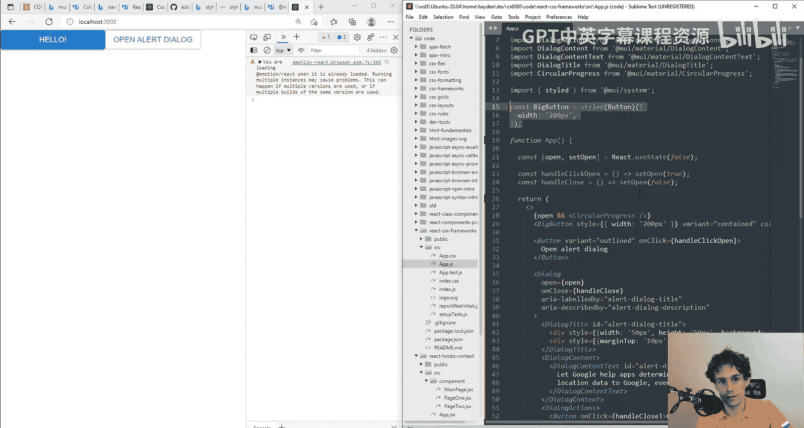

掌握这些工具和方法，将帮助你高效地构建出美观且功能完善的React用户界面。