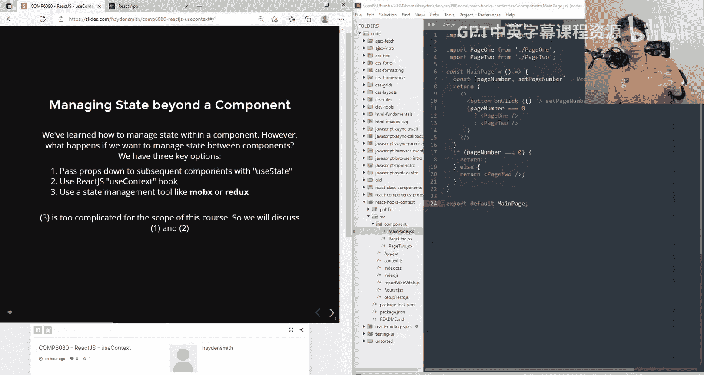
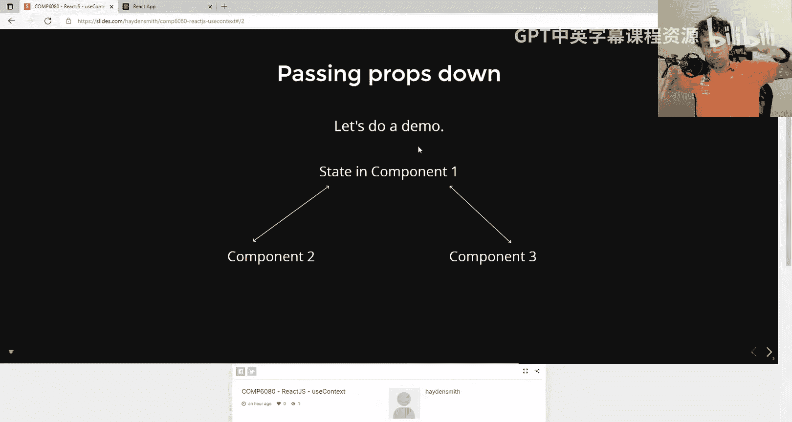
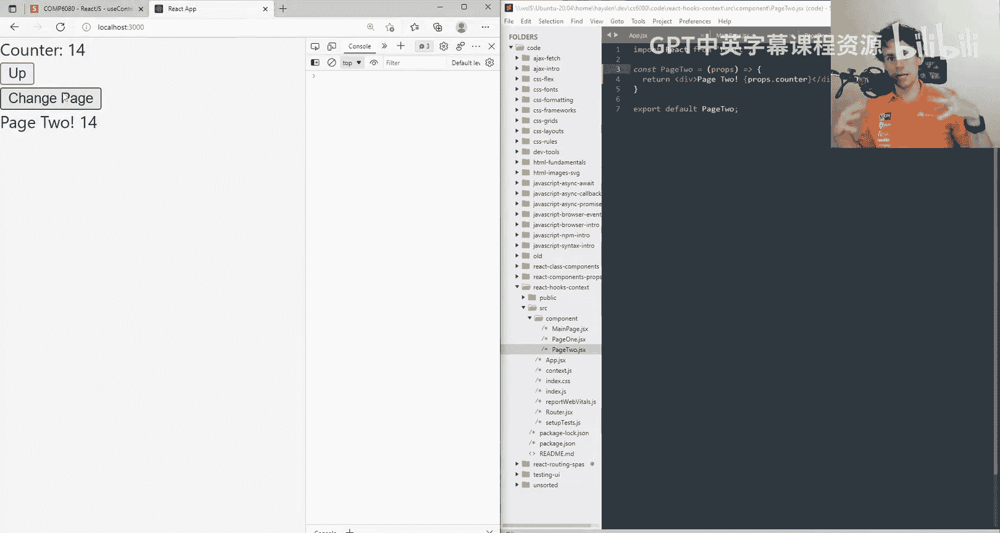
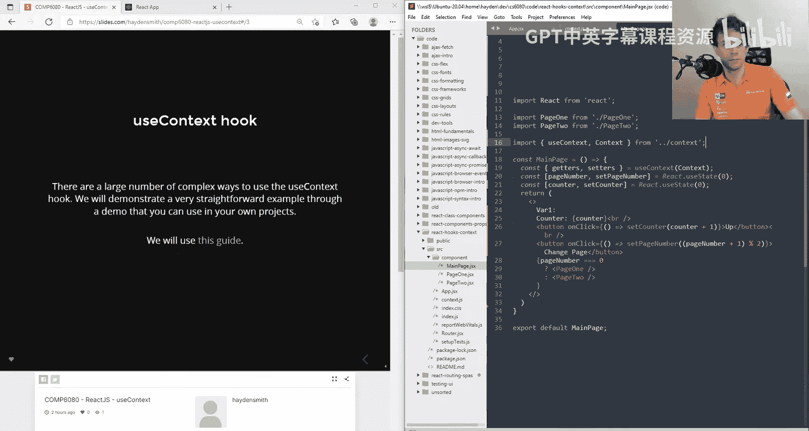
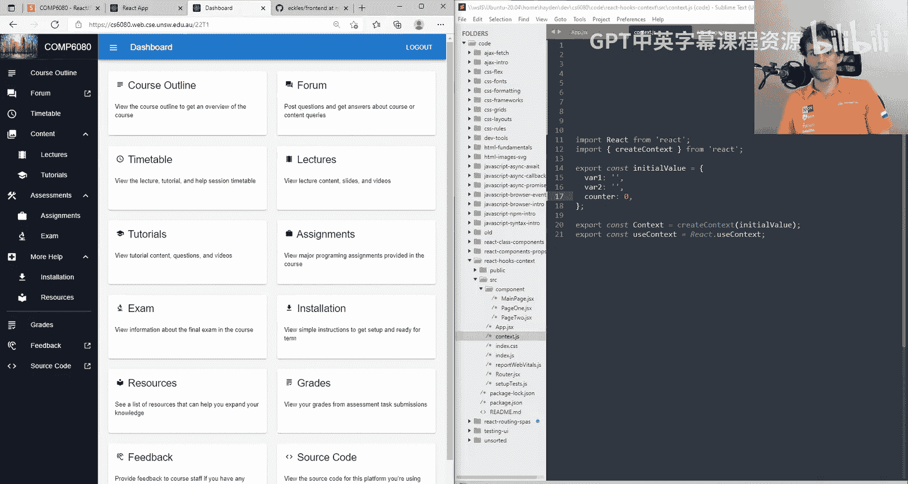

# ReactJS 教程：第 1 章：useContext Hook 💥

在本节课中，我们将要学习 React 中的 `useContext` Hook。这是一个使用频率相对较低的 Hook，但在特定场景下非常有用。它主要解决的是如何在组件之间共享状态的问题。



## 状态管理的三种方式

上一节我们介绍了 `useContext` 的基本概念，本节中我们来看看在 React 中管理跨组件状态的几种主要方法。

以下是三种常见的方式：

1.  **通过 Props 逐层传递**：这是最简单的方法，将状态作为属性（props）从父组件一层层传递给深层嵌套的子组件。
2.  **使用 React Context (`useContext`)**：这本质上是一种在 React 应用中创建“全局变量”的较为整洁的方式。
3.  **使用成熟的状态管理库**：例如 Redux 或 MobX。它们功能更强大、可扩展性更好，适合大型复杂应用，但学习曲线也更陡峭。本课程不要求掌握这些工具。

通过 Props 传递状态可以解决大部分问题，但有时你确实需要一个类似全局变量的状态管理方案，这时 `useContext` 就派上用场了。

## 通过 Props 传递状态



让我们先看一个通过 Props 传递状态的例子，以便理解 `useContext` 要解决的问题。

假设我们有一个主页面组件 `MainPage`，它管理着一个计数器状态 `counter`。我们还有两个子组件 `Page1` 和 `Page2`，它们都需要访问这个计数器。

在 `MainPage` 组件中，我们这样定义状态并传递给子组件：

```jsx
// MainPage.jsx
import React, { useState } from 'react';
import Page1 from './Page1';
import Page2 from './Page2';

function MainPage() {
  const [counter, setCounter] = useState(0);

  const handleClick = () => {
    setCounter(counter + 1);
  };

  return (
    <div>
      <button onClick={handleClick}>增加计数器</button>
      <p>当前计数: {counter}</p>
      <Page1 counter={counter} />
      <Page2 counter={counter} />
    </div>
  );
}
```

然后，在 `Page1` 和 `Page2` 组件中，通过 `props` 接收这个值：

```jsx
// Page1.jsx
function Page1(props) {
  return <div>页面 1 的计数器: {props.counter}</div>;
}
```

```jsx
// Page2.jsx
function Page2(props) {
  return <div>页面 2 的计数器: {props.counter}</div>;
}
```



这种方法在组件层级不深时工作良好。但是，如果 `Page1` 和 `Page2` 嵌套在很多层组件内部，你就需要将 `counter` 作为 props 穿过每一层，这会使代码变得冗长和难以维护。

## 使用 useContext Hook

现在，我们来看看如何使用 `useContext` Hook 来避免“props 逐层透传”的问题。其核心思想是创建一个“上下文”（Context），任何组件都可以直接从这个上下文中读取值，而无需通过中间组件传递。

以下是实现步骤：

### 1. 创建 Context

首先，创建一个独立的文件来定义 Context 及其初始值。

```jsx
// context.js
import { createContext } from 'react';

// 1. 使用 createContext 创建一个 Context 对象，并设置默认值
export const MyContext = createContext({
  getters: { counter: 0, var1: '' },
  setters: { setCounter: () => {}, setVar1: () => {} },
});
```

### 2. 提供 Context (Provider)

在应用的根组件（如 `App.jsx`）中，使用 Context 的 `Provider` 组件包裹你的应用。`Provider` 的 `value` 属性就是你要共享给所有子组件的数据。

```jsx
// App.jsx
import React, { useState } from 'react';
import { MyContext } from './context';
import MainPage from './MainPage';

function App() {
  // 2. 在顶层组件中定义你想要共享的状态
  const [counter, setCounter] = useState(0);
  const [var1, setVar1] = useState('初始值');

  // 3. 将状态和更新函数组织成一个对象，作为 Provider 的 value
  const contextValue = {
    getters: { counter, var1 },
    setters: { setCounter, setVar1 },
  };

  return (
    // 4. 用 Provider 包裹子组件，并传入 value
    <MyContext.Provider value={contextValue}>
      <MainPage />
    </MyContext.Provider>
  );
}
```



### 3. 在子组件中消费 Context (Consumer)

现在，在任何子组件（如 `Page1`, `Page2` 甚至 `MainPage` 内部）中，你都可以使用 `useContext` Hook 来获取共享的值和函数。

```jsx
// Page1.jsx
import React, { useContext } from 'react';
import { MyContext } from './context';

function Page1() {
  // 5. 使用 useContext 钩子，传入我们创建的 Context 对象
  const { getters, setters } = useContext(MyContext);

  const handleIncrement = () => {
    setters.setCounter(getters.counter + 1);
  };

  return (
    <div>
      <h2>页面 1</h2>
      <p>从 Context 获取的计数器: {getters.counter}</p>
      <p>从 Context 获取的变量1: {getters.var1}</p>
      <button onClick={handleIncrement}>在页面1增加计数</button>
    </div>
  );
}
```

`Page2` 组件可以做完全相同的事情，无需从 `MainPage` 接收任何 props。

## 核心机制图解

为了更直观地理解，下图展示了 `useContext` 的工作流程：


1.  在根组件（`App`）中，状态被创建并放入 `Context.Provider` 的 `value` 中。
2.  `Provider` 像一个“广播站”，将其 `value` 提供给所有被它包裹的子孙组件。
3.  任何子孙组件只要调用 `useContext(MyContext)`，就能直接接收到这个 `value`，实现状态的跨层级共享。

## 总结

本节课中我们一起学习了 React 的 `useContext` Hook。

*   **它解决了什么问题**：避免了在多层嵌套组件中通过 props 逐层传递状态的繁琐过程。
*   **它的本质是什么**：一种在 React 组件树内进行“全局”状态共享的机制，可以看作是更优雅的“全局变量”。
*   **如何使用它**：遵循“创建 Context → 提供 Context (`Provider`) → 消费 Context (`useContext`)”三步法。
*   **适用场景**：适用于主题、用户认证信息、语言偏好等需要被许多组件访问的全局数据。



虽然 `useContext` 加上 `useReducer` 可以构建小型应用的状态管理，但对于非常复杂的状态逻辑和大型应用，你可能仍需考虑 Redux 等专业库。不过，对于本课程的学习目标而言，掌握 `useContext` 已经足够让你应对许多常见的状态共享需求了。