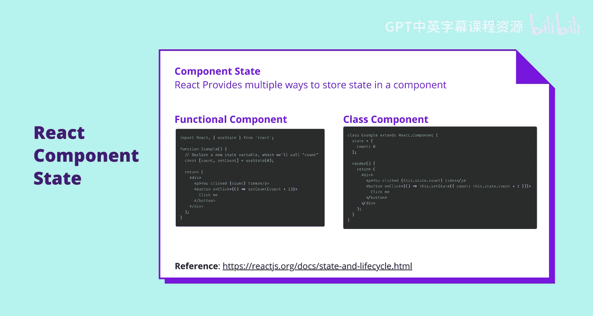
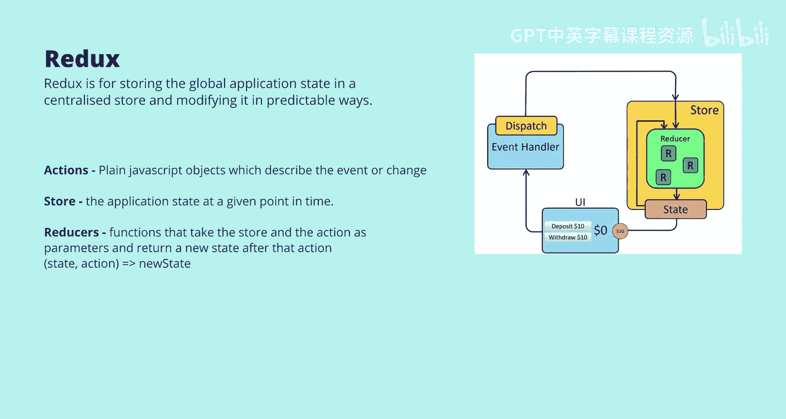
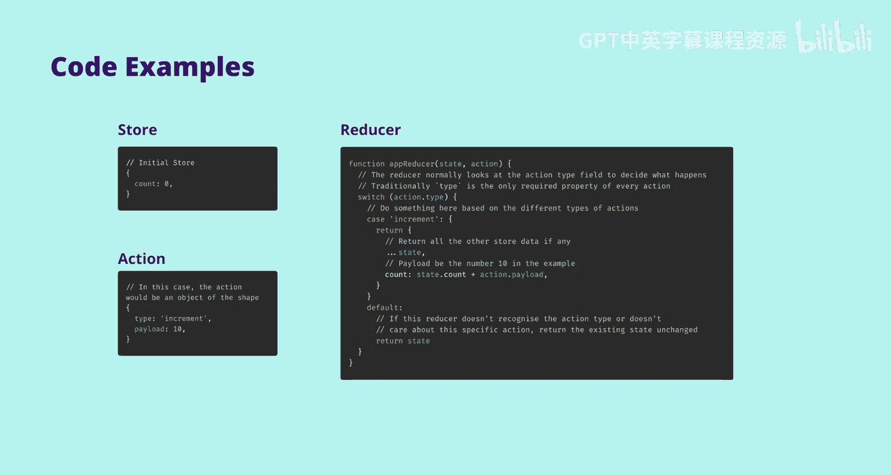
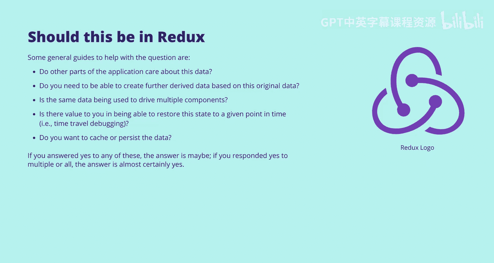

# UNSW《前端编程｜ Web Front-end Programming COMP6080 23T1》中英字幕（deepseek-R1 p61 -62-COMP6080 - ReactJS 💥 State Management.zh_en -BV17RXGYuEaM_p61-

Hi everyone， my name is Kenan and today I'll be giving you an introduction to state management and React。

We've got a lot to go through today and we'll start with some terminology and distinctions before moving on to why state management is important。

And then finally， we'll move into a more practical example。

 and then I'll be contrasting a formal state management system against using local storage。

The idea of state management。Is one of the trickier things to nail down when you're starting with web applications because as your app grows。

 state management needs， therefore there isn't a perfect solution or a one size fits all framework。

 only tradeoffs such as upfront development complexity， performance， developer autonomy。

 ongoing development cost and required system awareness are just a few aspects that need to be considered。

That said， it doesn't mean that there aren't general principles or you know good enough answers that will suit the vast majority of use cases。

 and that's what we'll focus on today。Every interactive app involves responding to events like when a user clicks a button and the sidebar closes or someone sends a message and it appears in a chat window。

As these events happen， the app is updated to reflect them。

 We say this as updating the application state。The app looks different from before。

 or it's in a new mode because of this event。Things like whether the sidebar is open or closed and the messages in a chat box are pieces of state in programming terms。

 you probably have an is sidebar open variable somewhere in your application set to true and a chat messages array with messages you've received。

At any point， the sum of this data forms the state of your application。

 which in turn determines how your application should present itself to the user。

 all those individual variables whether a store in react component state。

 local storage or some third partyy state management， store such as Redux。

 that is your application state。So what is state management。

 State management is a method by which the application is。

So what is state management State management is the method by which this application data is stored。

 distributed to the components and altered as I mentioned there is no single correct approach and each system has its own own parameters and cons。

 which we'll get into later。React provides a robust toolkit of functions and hooks to manage to stay at the component level。

 such as use state for a functional component or this dot state for a class component。

 These work great for storing component level data， for example。

 a particular item in a list the user is selected or what the user has typed into an input but not yet submitted。

 This is component level data as there shouldn't be a need for other components to be aware of it。😊。

On the other hand， data not contained in a single or small collection of components is most likely an application level state and should be managed by a more purpose builtil solution this distinction becomes far more relevant when multiple engineers。

 teams or even engineering orgs work on a single code base and it significantly reduces the overhead of working with the data。

😊。

State management makes sharing application state across unrelated components easier data such as whether the user is authenticated or their theme settings need to impact a wide range of otherwise unrelated components and therefore a definitely application level state。

😊，As of writing this， we have a few hundred front end engineers working on a single react application at Canva without proper state management。

 it would have been impossible to scale past a handful of developers。😊，Also， an important note note。

 application level state is sometimes referred to as global state as it is the global state of the application and component level state is referred to as local state。

😊，So recap。Component level or local state is contained to a component or small related group of components。

 For example， text and input that has not been submitted。

 What item in the list the user is focused on or is a dropdown open。

 Things that inconsequential to the wider application。On the other hand。

 application level state or global state is data required by multiple unrelatedlayveed components or every component。

😊，Such as。Are they logged in？The theme settings， if there is some。

What pages the user on and routing information such as that？

Here's a concrete example of how we categorize data in an application。

Let's say you had a to do application with some additional complexity。

 Each two do item have a list of tags associated with it， for example， university。

 personal and comp 6080 and a due date。In Jason， it might look something like this on the right。

What makes this application unique is that you can display multiple lists at once with different filters on each list。

 maybe one is things due in the next week， another is university while the last is come 680 specifically。

😊，What parts of this data do you think we should store in the components？

And what parts do you think are application level state？Personally。

 what I would do is start with the ones that are clearly one or the other， at least in my opinion。

In this case， I would put the list of tutors in the application state as it needs to be accessed by all the list and potentially other components such as the header。

If we allowed the users to customize the filters of each list。

 I would put the unsaaved state of these changes at the component level。

 since the overall application doesn't need to know about the state the user isn't finished editing。

😊，Still， maybe the global app application is to know that something is being edited to make sure the user saves or discards before navigating away from the page。

This example's difficulty lies in storing the state of the list themselves。

Such as the filter being applied and maybe a title， and there's no real correct way to do this。

 only trade offs。Personally。I would lean towards I would lean towards storing these in the application level state as it is not rapidly updated。

 the application needs to be aware of how many lists there are。

 and since there's a high likelihood that we'd want to persist the list and their filters across multiple page loads。

😊，This is easier to do in application level state。😊。

The counter to this would be putting in the component state。

 which would be far more straightforward but hard to maintain and expand on in the long term。

The solution to which one of these is correct for you is which trailoffs you're willing to accept。

 suppose you're a university student working on an assignment that doesn't have uncertainty in its future functionality as there simply won't be a future for this code past the submission date。

😊，Suppose you know that the data does not need to persist across page loads in that case it could make a lot of sense to put that data into the component state as the simplicity of the solution would be more beneficial。

 particularly under time pressure。Today I'll be talking about Redux。

 but there are many public state management libraries and unfortunately even more custom made internal ones。

😊，Thankfully， most are self explanatory once you know one。

 and the developers are not expected to know more than one or two。

 but rather understand the underlying concepts that can generally be applied。So what is Redux？

At its core Reduxes for storing the global application state in a centralized store and modifying it in predictable ways。

It leans heavily on functional programming paradigm， such as immutability。

And has three fundamental aspects， the stall reduces and actions。

The stall is the application state at any given point in time。

Actions are just plain JavaScriptscript objects which describe the event or change I。e。

 the user is adding 10 to account to account。Reduces a functions that take the state。

And the action as parameters。And return a new state after that action。So in summary。

 the action triggers the reduces to modify the stall and only reduces can change the store。

Here's what this would look like in code so you can see that the store initial store is simply just a count with a number in it。

 this might be an account balance or it could be any piece of data that can be stored in Jason。

The action， simply a type and a payload。And almost Sam， it's not required by Redux。

But type is almost always on every action as the distinguishing method to the reducer。

And the reducer， we simply go， what type is this？Awesome， this is an increment。

We only want to do this and everything else in the state has remained unchanged。

Since you can have multiple reduces in more complex applications， we always have this default route。

To just return the state unchanged because this reducer doesn't have to care about every single action。

One of the advantages of Redux is that the state is predictable and entirely audible as it can be edited only by the reducers。

It can also be more straightforward to debug as a developer as developer tooling records all actions on a page and therefore allows the developer to time travel by jumping to a specific point in a list of actions。

Once at this point， by recomputing the state up until this point， ignoring later actions。

 we can effectively move the application state to that point in time。😊。

Wwhich updates the entire page in practice， or at least all the page that is relying on this application level data。

 this will not change component level state， which would remain unchanged and this can cause issues while debugging as the application level state may not match the component state anymore。

One of the most common pitfalls in Redux is putting too much in the store as it's designed for global and application level state。

 not to the entire state， and this is a really delicate balance that overuse can cause performance problems。

😊，On top of this， it would a significant overhead when creating otherwise simple features。

 even if performance issues could be mitigated， some general guides to help with this question。

 do parts of the application， do multiple parts of the application need to care about this data。😊。

Do we need to be able to create thorough derived data based on the original data。

 such as earlier and we're generating multiple to do lists from a single global list of two dos？

Is this data being used to drive multiple components？

Is there value in being able to restore the state to a given point in time by time travel debugging？

Do you want to cache or persist this data？If you answer to any of these， the answer is maybe。

If you responded yes to multiple or all of them， the answer is almost certainly yes。

对。So what about local storage or putting something in the global window object？

While those are valid and straightforward solutions to the problem， However。

 they have their own trade offs， most notably with local storage。

 your persisting data across page refreshers， whether you want to or not。

 or whether it's practical to or not。 This isn't a problem if the application will only ever be run in its final form by anyone other than the developers who can simply use the developer tools to clear local storage anyway。

The problem is when the code changes and suddenly developers need to consider what would be in the local store of the end users's machine on the end user's machine already。

Let's say in version one of your application， you had a piece of HTML saved in local storage。

 maybe from someone having a draft comment posted on a blog or something similar。

Everything was okay because your application knew it was going to be HTML and would display it properly。

😊，But then later you wanted to swap to just plain text because security concerns or something。

Now the application is expecting just plain text。And if it loads HTML from local storage。

 what should it do？Well， you now have to account for that possibility or your application is going to look broken by returning a user。

Htl as a plain tax。And there's a high likelihood that most returning users aren't going to recognize HTML as what it is and just think your application is broken。

😊，Persisting data is a complex problem and creates a fair bit of complexity in the long term。

 and therefore it should only be used when necessary。

Another potential issue of local storage is it's for an entire website。

 not just a page or a particular system。For example。

 say a homepage saves a piece of data under a key， which tabs someone's in， the key of the tab。😊。

Let's call this tab ID and the counseling page has a similar mechanism。Also saving under tab ID。

 this will almost only cause them to conflict eventually。

Let's say the Ac page sets the tab ID to six， but there is only three tabs on the homepage at very least this puts the homepage into an invalid state and at worse it causes a crash。

There's obviously clever things you could do to mitigate this。

 but that requires every developer to be aware of every other key another developer on the project is using。

At the end of the day， it is possible to us for a uni assignment， it could probably work。

But for every developer to keep track of every key that has been or ever that is or ever has been set by the application。

 in my opinion， would be too difficult for even a single developer in a month long project。

 especially if there was iterative deployments to the end user。

And would be almost impossible for a small team or greater。

State management is critical for building websites that users can successfully interact with and developers can maintain in the long term。

It allows developers to create complex interactivity across their applications。

 good state management makes it viable to scale the numbers of developers while being maintainable and there's lots of resources like RedDux dedicated to state management which are used widely across tech and thoroughly battle tested。

This is an important topic and more resources are available at well across the web particularly I would recommend Redux Docs website。

 which is Redux。js。org， they have some thorough documentation and tutorials on the topic。😊。

I hope this was helpful and thanks for your attention。

