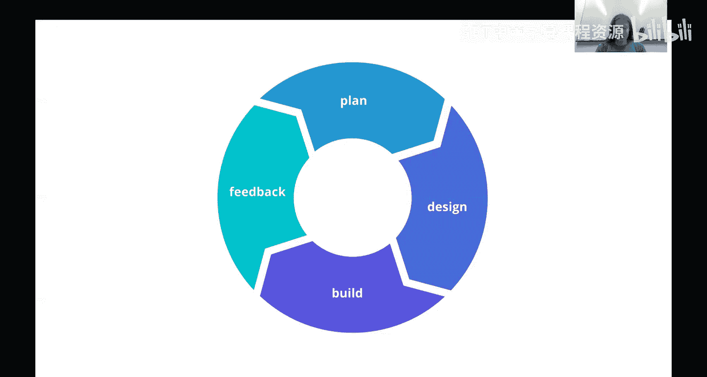
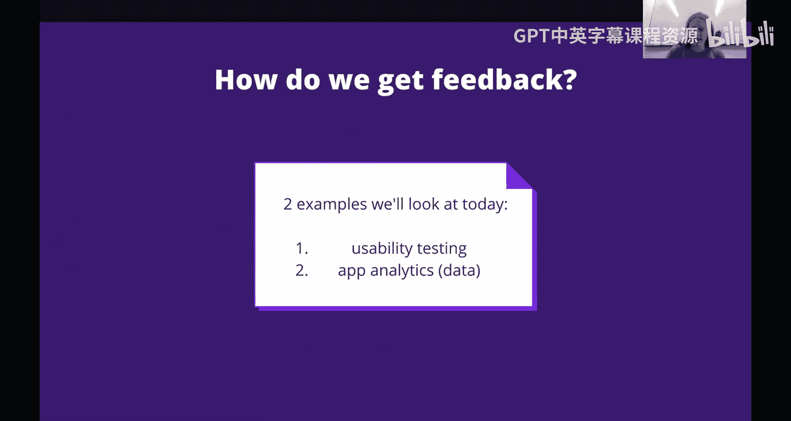
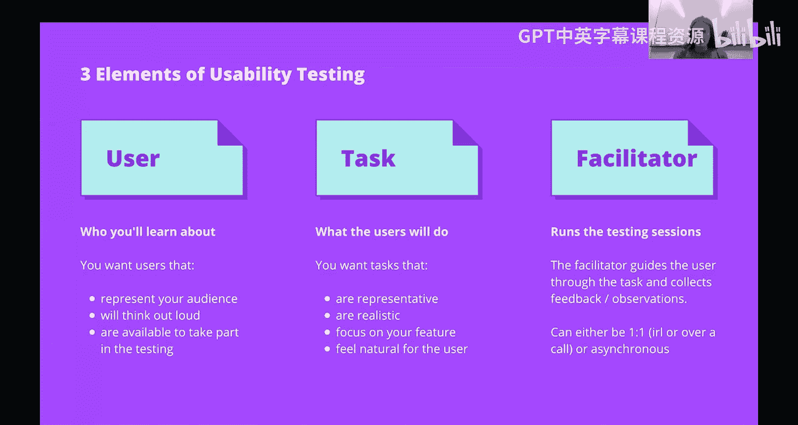
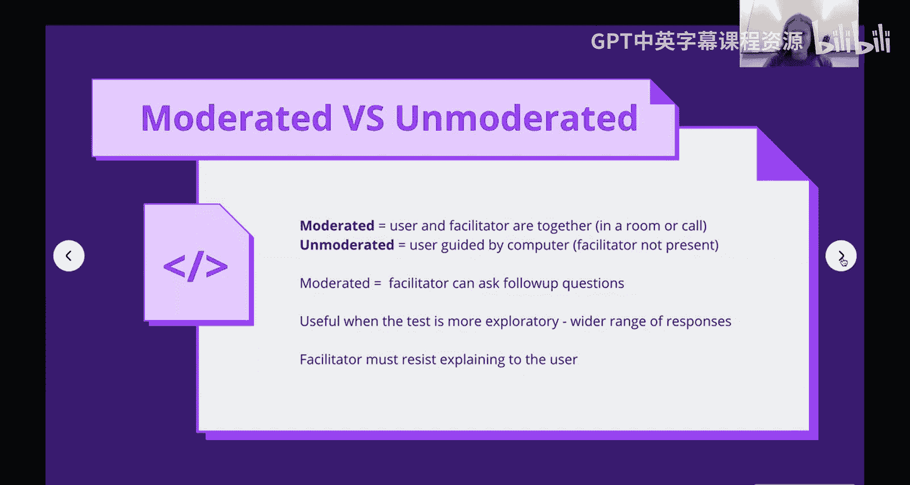
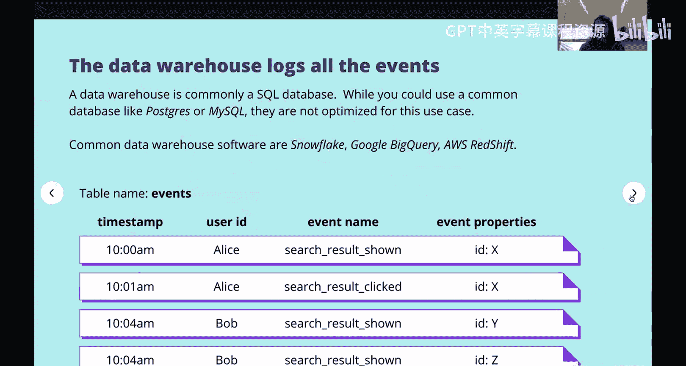
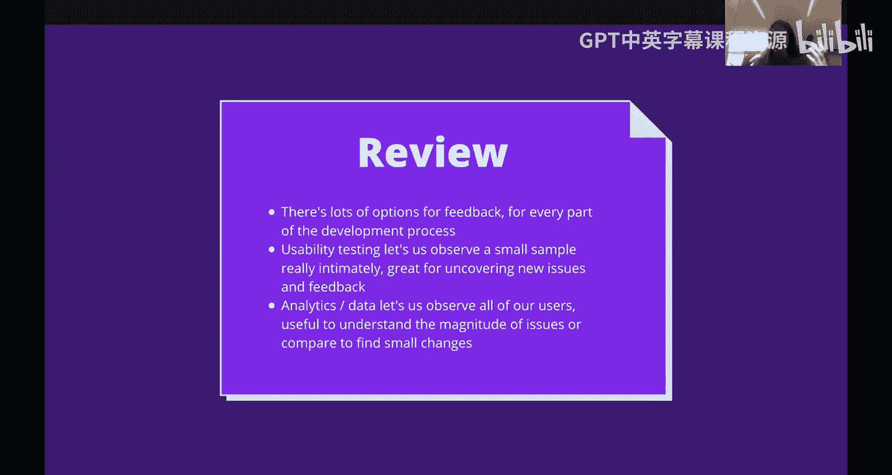

# 前端编程：第63-64讲：产品可用性测试 🍪


在本节课中，我们将要学习如何获取用户反馈，这是前端开发中至关重要的一环。我们将探讨反馈的重要性、不同类型的反馈，并深入介绍两种核心的反馈收集方法：可用性测试和应用数据分析。

## 反馈的重要性

上一节我们介绍了反馈是前端开发不可或缺的一部分。本节中我们来看看为什么反馈如此重要。

前端开发的核心是为用户构建应用。我们无法构建出优秀的应用，除非用户认为它优秀。我们无法让它变得优秀，除非我们知道用户喜欢什么。因此，反馈是前端开发中一个真正不可或缺的部分。

在大型团队中，前端开发者通常不直接负责收集反馈，这项工作可能由设计师或专门的用户体验研究员完成。然而，反馈与前端开发的目标高度一致，并且紧密相关。反馈会影响需求设定，在一个健康的组织中，它会决定你要构建什么。它让人们能基于反馈做出更好的决策，也让前端开发者能在日常编程中做出更好的决策。例如，如果你知道某个功能使用率很高，你就会更关注其错误或边界情况。此外，前端开发者也经常被要求协助收集反馈，例如构建原型、快速模拟功能以获取反馈，或者发送分析事件来跟踪按钮点击等。



## 反馈的类型

了解了反馈的重要性后，我们需要知道反馈有多种类型。根据你处于产品流程的哪个阶段以及你想了解什么，选择合适的反馈类型至关重要。

以下是反馈的几个关键维度：

*   **定性反馈 vs. 定量反馈**：定性反馈关乎感受和体验，例如用户是否觉得某个功能易于理解。定量反馈则关乎数字，例如某个功能被使用了多少次。
*   **样本范围**：有时你需要从所有用户那里获取反馈（例如关于收入的数据），有时你只需要一个小样本进行快速实验。
*   **应用要求**：有些反馈（如应用内分析）只能在应用构建完成后收集。而另一些反馈（如对原型的可用性测试）则可以在开发前进行，只需要设计草图。

## 反馈收集方法概览

基于上述不同的反馈类型，值得考虑有哪些不同的收集方法。反馈收集方法多种多样，我们无法一一涵盖，但了解各种选项有助于你根据应用开发阶段和需求选择合适的方法。

以下是一些常见的反馈收集方法，横轴表示是否需要已开发的应用，纵轴表示样本范围：



*   **开发前，大样本**：市场研究。
*   **开发前，小样本**：调查、访谈、可用性测试。
*   **发布后/开发中，小样本**：应用内可用性测试、应用内反馈提示（如评分、反馈表单）、支持工单分析、用户会话录制。
*   **发布后/开发中，大样本**：应用分析、业务指标（如收入）。

## 可用性测试 🧪

现在，让我们深入探讨第一种核心方法：可用性测试。首先，我们需要理解什么是“可用性”。

### 什么是可用性？

可用性简单来说就是应用是否“可用”。其关键要素包括：用户能否理解这个应用？用户能否在应用中完成他们的任务？用户使用应用是否高效？用户对体验是否满意？

### 什么是可用性测试？

从可用性的定义出发，可用性测试就是一种测试应用是否可用的方法。它通常包含三个主要元素：**用户**、**任务**和**协调者**。



*   **用户**：参与测试的研究对象。你需要寻找能代表目标受众的用户，并要求他们在测试过程中“出声思考”，以便了解他们的想法。
*   **任务**：你需要测试的具体活动。任务必须代表你希望应用完成的核心功能，并且对用户来说感觉自然、真实。例如，测试图形设计软件Canva时，应该要求用户设计海报，而不是寻找食谱。
*   **协调者**：运行测试会话的人。协调者引导用户完成任务，记录反馈和观察结果。协调方式可以是同步的（一对一，实时），也可以是异步的。

### 可用性测试实例：Canva Magic Resize

让我们看一个来自Canva的真实异步可用性测试例子。目标是改进“Magic Resize”功能，使其更易用。

**第一步：设计任务**
我们编写了模糊的任务场景，不提及具体界面元素，以观察用户的自然思考过程。
```plaintext
场景：你是一名使用Canva为多个社交媒体平台创建设计的营销人员。
步骤1：请选择一个模板或创建自己的模板来创建一个Instagram帖子，然后进行下一步。
步骤2：现在调整你的设计尺寸，以便在Facebook、Twitter和Pinterest上发布。
```
**第二步：招募用户**
我们通过UserTesting.com服务招募了5名用户参与测试。5是一个行业公认的合理数字，能在样本多样性和分析工作量之间取得平衡。

**第三步：分析结果**
用户录制他们的屏幕并发送回视频。我们观看录像，记录每位用户是否能成功完成每个步骤，并总结他们遇到的障碍和问题。例如，第一位用户因为没看到弹窗提示而迷失了方向。从这5名用户身上，我们可以洞察到真实用户可能遇到的困难，并据此得出结论和改进见解。

### 协调测试与非协调测试

上述例子是**非协调测试**。用户独立完成任务并录制视频，协调者事后分析。这种方法相对简单，适合测试具体的任务流程。

**协调测试**则不同，用户和协调者实时在一起（线上或线下）。协调者可以提出更多后续问题，深入挖掘用户想法。这在产品早期、功能概念比较模糊、需要探索性反馈时非常有用。但协调测试对协调者要求更高，需要克制住解释设计或帮助用户的冲动，真正做到倾听和观察。

## 应用数据分析 📊

接下来，我们转向另一种完全不同的反馈收集方法：数据分析。与通过访谈了解用户主观感受不同，数据分析通过观察用户的实际行为来回答问题。

### 数据分析 vs. 可用性测试

可用性测试让我们能深入探索，发现用户遇到的新问题和新痛点。而数据分析更适合回答我们已有的具体问题，尤其是关于“多少”而非“什么”的问题。例如，它可以告诉我们某个事件发生的频率是否超出预期，但在发现全新问题方面可能不如直接观察用户有效。

### 数据分析流程



数据分析反馈流程通常如下：
1.  **应用指示**：在前端代码中发送分析事件。
2.  **事件存储**：分析事件被存储在数据库或数据仓库中。
3.  **运行查询**：使用SQL等语言对数据库进行查询。
4.  **计算指标**：从查询结果中计算出度量指标。
5.  **分析洞察**：分析这些指标，获得洞察并产生新的应用改进想法。

在现代科技公司中，数据基础设施可能非常复杂，涉及多种数据源和平台。我们这里只关注与前端开发者最相关、最常接触的这部分：应用内分析收集。

### 常见指标与使用

在收集数据之前，需要知道我们想计算什么指标。**指标**是对原始数据的聚合计算，用于衡量某些方面。

以下是一些常见指标：
*   **计数**：页面访问次数、点击按钮的独立用户数。
*   **时长**：会话持续时间。
*   **比率**：跳出率（用户快速离开页面的百分比）、激活率（完成关键操作的用户比例，如银行应用中存入第一笔钱）。

我们可以通过比较指标来获得洞察：
*   **跨版本比较（A/B测试）**：比较应用不同版本（如红色按钮 vs. 蓝色按钮）的同一指标，看哪个版本表现更好。
*   **指标间比较**：例如，发现20%的用户点击了一个无效按钮，这可能提示按钮位置或设计有问题。

### 前端如何收集数据

作为前端开发者，我们通常通过集成分析库来与指标系统交互。例如，使用 `analytics.js` 这样的库来跟踪事件。

一个事件记录某件事情发生了。例如，在一个搜索功能中：
```javascript
// 当搜索结果展示时
analytics.track('search_result_shown', { resultId: '123' });
// 当用户点击搜索结果时
analytics.track('search_result_clicked', { resultId: '123' });
```
这些库会向数据管道中的服务器发送HTTP请求，服务器最终将事件以简单的格式（如时间戳、用户ID、事件名称、事件属性）存储到数据仓库中。

**伦理与法律考量**：在存储这些事件数据时，必须考虑伦理和法律问题。在许多国家和地区（如欧盟的GDPR），法律要求提供让用户删除其个人数据的途径。存储个人身份信息也需谨慎评估其合理性。

数据仓库通常使用针对**在线分析处理（OLAP）** 优化的数据库（如Snowflake、Google BigQuery、Amazon Redshift），它们擅长处理海量数据的高吞吐量查询，这与我们熟悉的用于低延迟事务处理（OLTP）的数据库（如PostgreSQL、MySQL）不同。

## 总结

本节课中我们一起学习了用户反馈的世界。

反馈非常令人兴奋，它有多种多样的类型和收集方法。了解这些选项，能帮助你在应用开发过程的不同阶段选择合适的反馈方式。

*   **可用性测试**允许我们深入观察一小部分用户，非常适合发现新的、未曾预料到的问题，侧重于理解“发生了什么”和“为什么”。
*   **应用数据分析**则需要在应用构建后才能进行，它让我们能够观察所有用户的行为，理解问题的规模，并通过A/B测试等方式比较细微差异以进行优化，侧重于“有多少”和“影响多大”。





掌握这些方法，将帮助你更好地理解用户，从而构建出更优秀、更受欢迎的前端应用。