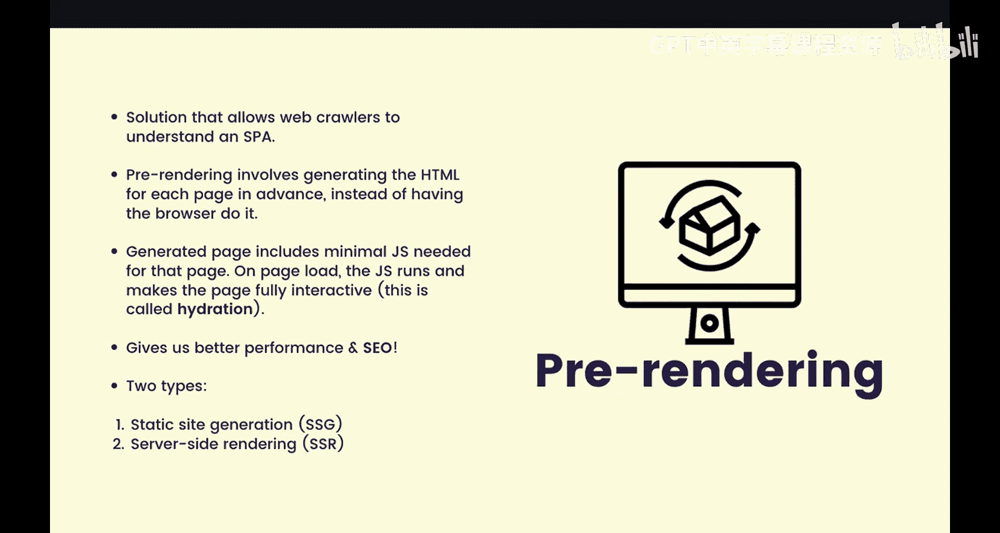
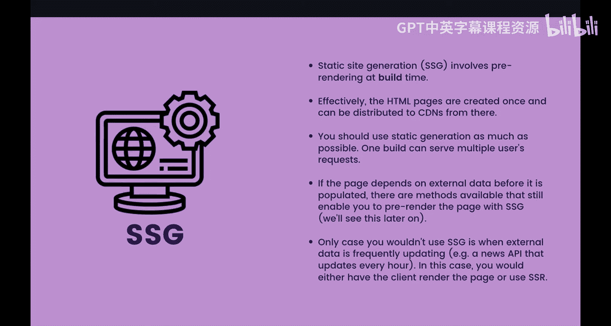
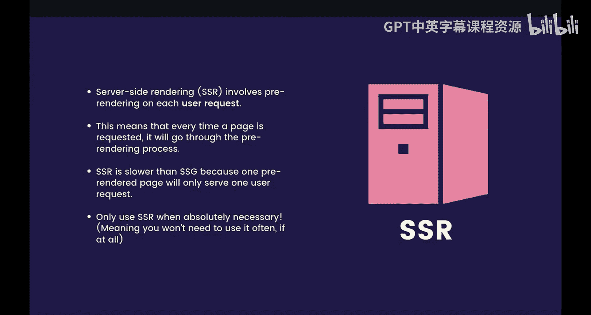
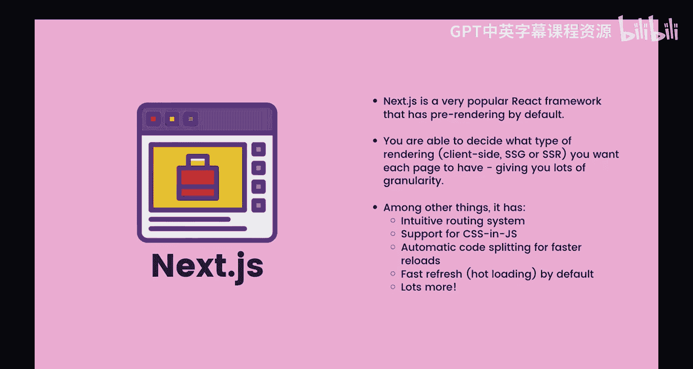
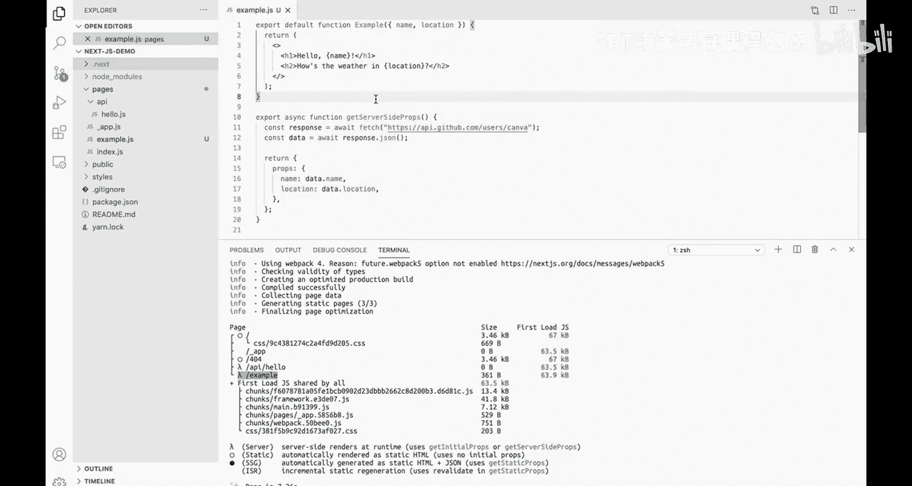

# 前端编程：第65-66讲：ReactJS 预渲染 💥


在本节课中，我们将学习单页应用（SPA）的优缺点，并深入探讨预渲染技术。预渲染是解决SPA核心问题（如SEO不佳和初始加载慢）的关键方案。我们将介绍两种主要的预渲染方法：静态站点生成和服务器端渲染，并通过Next.js框架的演示来理解其实际应用。

## 单页应用回顾

上一节我们介绍了单页应用的基本概念。本节中，我们来详细看看其优缺点。

单页应用是一种仅下载单个HTML文档的Web应用。这意味着，用户无需通过浏览器导航页面，而是使用JavaScript在不离开当前页面的情况下请求和处理响应。

例如，要导航到“关于”页面，不是点击链接让浏览器向服务器请求HTML、JavaScript和图像，而是使用JavaScript的Fetch API向“关于”路由发起请求，并仅重新渲染部分组件来显示目标页面。

### 单页应用的优点

以下是单页应用的主要优点：
*   **更快的加载后性能**：一旦HTML文档下载完成，后续的页面或转换都非常迅速。
*   **近乎即时的页面切换**：由于无需重新加载整个页面，页面间的过渡可以非常快。

### 单页应用的缺点

以下是单页应用的主要缺点：
*   **初始加载时间差**：需要下载大量JavaScript，在网络性能较慢时，用户可能一段时间内看不到任何内容。
*   **浏览器支持差异**：不同用户的浏览器环境可能支持不同版本的JavaScript，需要处理兼容性问题。
*   **搜索引擎优化差**：这对任何规模的企业都至关重要，因为大多数人通过搜索引擎获取信息。

对于单页应用，默认的HTML文档通常是空的（`<body>`中无内容），只有`<script>`标签中的JavaScript。网络爬虫无法理解将要加载的内容，也无法获取尚未被JavaScript渲染的页面信息，因此难以全面理解网站的重要细节。

## 预渲染解决方案

我们已经理解这个问题存在已久。幸运的是，现在有了解决方案。

这个解决方案称为**预渲染**，其基本思想是提前为每个页面生成HTML，而不是由客户端浏览器来完成。

每个生成的页面都包含该页面所需的最少量JavaScript。页面下载后，附带的JavaScript会运行，使页面完全可交互，这个过程称为**水合**。

预渲染有两个主要好处：
1.  更好的性能。
2.  更好的搜索引擎优化。

因为HTML页面本身已包含内容，网络爬虫更有可能理解页面内容，不会遗漏网站的重要细节。

## 预渲染的两种类型

预渲染主要有两种类型：静态生成和服务器端渲染。我们将逐一介绍。



### 静态站点生成

首先，**静态站点生成** 涉及在构建时进行预渲染。

构建时是部署流水线中的一个步骤，在此步骤中构建应用程序。实际上，HTML页面只需编译一次，之后便可分发到不同的CDN。

尽可能使用静态站点生成是最佳实践，因为只需构建HTML页面一次，之后便可服务大量用户请求。

通常，即使页面依赖外部数据，也有方法可以填充数据，因此依赖外部数据并不会禁用预渲染。

唯一不适合使用静态站点生成的情况是外部数据频繁更新时。例如，有一个每小时更新的新闻API，这种情况下，让客户端浏览器渲染或使用服务器端渲染可能更合适。



### 服务器端渲染

接下来，**服务器端渲染** 基本上意味着每次用户发出请求时都会进行预渲染。

这使得服务器端渲染比静态生成慢，因为一个预渲染的页面只服务一个用户请求。每次用户请求同一页面时，都需要重新构建新的HTML页面，因此使用服务器端渲染会产生重复工作。



由于性能较差，除非绝对必要，否则不应使用服务器端渲染进行预渲染。这意味着你可能不会经常使用它，甚至完全不用。

## Next.js 框架简介

现在，Next.js 是一个非常流行的框架，它默认启用了预渲染。Next.js 最大的优势之一是允许你为每个页面选择所需的渲染类型。



无论是客户端渲染、静态站点生成还是服务器端渲染，Next.js 都能处理，并提供了高度的灵活性和粒度控制。

此外，Next.js 还有一些非常酷的功能，包括直观的路由系统、CSS和JS支持、自动代码分割以及快速刷新（热加载）。


## 演示：在 Next.js 中实现预渲染

现在，我们将进行一个演示。如果你想了解更多信息或教程，请访问 Next.js 文档。实际上，本演示中的很多笔记都直接来自该文档，它是一个非常好的资源，特别适合刚开始使用该框架的人。

### 创建 Next.js 应用

在我们的演示中，首先使用 `create-next-app` 库创建一个 Next.js 应用。本质上，你只需要安装 yarn 或 npm，然后输入 `yarn create next-app`。

这将为你安装一些包，基本上是拥有一个功能正常的 Next.js 应用所需的最少包。我们将项目命名为 `nextjs-demo`。它会很快安装好所有包。

在 VS Code 中打开项目，可以看到左侧是应用的文件结构。`create-next-app` 提供了三个文件夹：
*   `styles`：基本上是一个CSS文件夹，你可以附加CSS文件。
*   `public`：包含所有静态文件，如图像和网站图标。
*   `pages`：任何路由都应放在 `pages` 目录中。Next.js 将自动从该页面创建路由。

例如，这里的 `index.js` 文件将是主页路由。你可以看到这是主页路由，显示的是 Next.js 的默认页面。`api` 文件夹是 `pages` 目录的一个特殊子文件夹，基本上你所有的API都可以放在这里。

### 创建示例组件

现在，让我们在 `pages` 目录中创建一个示例组件，命名为 `example.js`。

我们将做一些简单的事情：
```javascript
export default function Example() {
  return <h1>Hello World</h1>;
}
```
这是一个示例组件，它将显示“Hello World”。

### 构建应用与预渲染

如果我们停止开发服务器，并使用 `yarn build` 构建我们的应用程序，本质上这将预渲染我们所有的页面。在这个例子中，由于我们有一个示例组件，它应该构建一个包含此内容的HTML页面。

通常，构建步骤比使用开发服务器要长一些。所以在开发时，记得使用 `yarn dev` 而不是 `yarn build`。

如你所见，Next.js 基本上给出了每个页面/组件是如何渲染的概述。`example` 路由旁边的白点显示它是静态渲染的。在这种情况下，静态渲染意味着没有获取外部数据。

在 `.next` 文件夹中，如果我们进入 `server/pages/example.html` 并稍作格式化，可以在 `<body>` 的第一行看到我们的“Hello World”行。这个 `.next/server` 文件夹中的内容将被分发到不同的CDN上。

### 获取外部数据（静态生成）

现在，我们希望我们的示例组件获取某种外部数据并动态渲染。如何在 Next.js 中实现呢？

首先，我们获取一个示例API。这个API将从某个地方获取一些数据。假设我们使用 `name` 和 `location` 来显示在这个示例组件中。

为了在构建时获取外部数据，我们可以导出一个名为 `getStaticProps` 的函数：
```javascript
export async function getStaticProps() {
  const res = await fetch('https://api.example.com/data');
  const data = await res.json();

  return {
    props: {
      name: data.name,
      location: data.location
    }
  };
}
```
在这个数据结构中，我们期望返回这个对象。如果我们想将 props 传递给这个示例组件，我们需要让 `getStaticProps` 返回一个 `props` 对象。在这个对象内部的所有内容都将被传递到 `Example` 组件中。

如前所述，我们想使用 `name` 和 `location`。然后我们可以在组件中解构它们：
```javascript
export default function Example({ name, location }) {
  return (
    <h1>
      Hello {name}, how is the weather in {location}?
    </h1>
  );
}
```
现在，`getStaticProps` 函数已经将这些 props 传递给了这个组件。

如果我们现在构建，可以看到我们的示例组件已经改变了预渲染方法。因为我们现在通过API获取外部数据，Next.js 正确地假设我们需要使用不同的预渲染方法。在这种情况下，它决定使用静态生成，因为如前所述，这可能是进行预渲染的最佳方式。

### 切换到服务器端渲染

如果我们想使用服务器端渲染呢？可以看到，这个 Lambda 图标用于 `api/hello`。让我们尝试为示例组件启用服务器端渲染。

实际上，你只需要将 `getStaticProps` 替换为 `getServerSideProps` 即可启用服务器端渲染：
```javascript
export async function getServerSideProps() {
  // ... 获取数据的逻辑相同
}
```
重建后，可以看到我们的示例组件已经使用服务器端渲染作为其预渲染方法。

## 总结



本节课中，我们一起学习了单页应用的局限性，并深入探讨了预渲染作为解决方案。我们介绍了两种预渲染类型：静态站点生成和服务器端渲染，并了解了它们各自的适用场景。最后，我们通过 Next.js 框架的演示，实际看到了如何通过 `getStaticProps` 和 `getServerSideProps` 函数来实现这两种预渲染策略，从而改善应用性能和搜索引擎优化。