# UNSW《前端编程｜ Web Front-end Programming COMP6080 23T1》中英字幕（deepseek-R1 p66 -67-COMP6080 - Live 🚀 Week 9 - Demo_ ReactJS Further.zh_en -BV17RXGYuEaM_p66-

🎼。🎼Oh。🎼あ。🎼The。🎼，🎼あの。🎼，🎼，🎼Yeah。🎼，嗯。Hello。系系系。嗯。Hope everyone's well， It's nice to see。 oh。

 Mike's a little bit， a little bit loud。 Let me turn that down for you。😊，Hello， hello， test test。

 test， test， test， test， test， test， test， test。Right。It's， I know you can hear me fine。

 but like it's just maxing out on the。On the list， test test。 cool。 Okay， this looks good。 Yeah。

 the songs called die dia Docs。 It's from Super Mario 64。 It's a childhood。😊，Favorite。

It's one of the first games I ever played， I think it's a game before my time， Super Mario 64。

Came out on the Nintendo 64 in 1997 in Australia。 Apparently。

 I think I got an Nintendo 64 when I was like， it's like 192000 or something。

 It's like the first game I ever really properly played， I guess on like a console。

 It was still one of the best games ever。 So anyway， I love it。 why we。

 why are we pretty relaxed tonight because it was 18 of you。 So。😊，It's pretty easy now。

The purpose of tonight's lecture is is pretty easy。 This course has a lot of lectures in it。

 It probably has over 36 hours of lectures if you include the recommended lectures。

 there's a lot of content there's a lot for people to get through。

 So the purpose of tonight is not to go for two hours into stuff。

 It's to acknowledge that all of you kind of get it at this point。

 you want to take a little bit of a break。😊，In terms of just how getting into your work like。

 you know， it's like， yeah， I just got to go do the thing。 So it's Q And A tonight pretty much。 Now。

 there was no posts on my foreign post asked last week's notice asking if students had any questions they wanted me to run through so。

You know kind up to you what we talk about if anything so pretty much it's just up to you to post questions in the chat there are some questions where I will go through things there are other times where I'll just answer it and then other things where I'll point you to a particular tutorial question because obviously if we've done the good work explaining things you know in detail there's no point rehashing it all but I would not expect us to spend a lot of time here tonight because a lot of people probably just want to get back to their assignment which is fair enough now。

I also want to say to everyone。Big congrats for getting stuck into assignment for， I have to say。

 like， I can see it on the forums in the Gi histories like， you know。

 I don't know whether people are just inspired and motivated or whether it's a reaction from maybe the stress you felt from assignment 3 and week 6 or something。

 But it was really evident to me at the end of week 8 that so many people were just like starting assignment for。

 you could tell from the questions on the forum。 And that's really good because whilst most of you are probably not close to being finished。

 you've started the process， you know， and and I always tell people you know。

 it's not it's not the number of hours before you start it's not a number hours before the due date that matters it's the number of days before the due date because。

 you know， if you spend。10 hours a day for five days before it's due。

 you'll probably perform worse than someone who spends five hours a day，10 days before it's due。

 you know， because they've just got more days to find a problem， come back to it， et cetera。

 So congrat to everyone who'' who's gotten into it so far。 Now， again。

 please ask some questions because otherwise it's going to be extremely awkward if we wrap up in a few minutes。

 again， I'm not afraid of wrapping up if none of you have questions that I't want to waste your time。

 but I also know that some of you have things on your mind。Okay， well there's been two kind of。

 well one kind of word so far and then a question。So。

The word that someone's posted is Redux from Liam。 So this。This question about， okay。

 there's comment Redux there's been a few foreign posts on it。Basically。

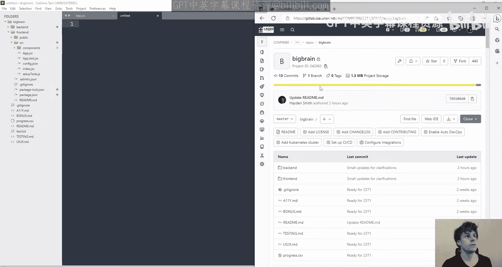

You know， let's， let's discuss for a second。When you're building a front end up。

 there's a notion of storing state， you know， and you know， state is like， okay。

 like you kind of get state because like at one end， we've got like use state which is basically。

 you know， within a component。😊，I want to store data， right。And then this is like this is like。

 you know， local call this local save。 And then down at the other end。

 we have what you might call persistent state， which is where it lives beyond the life of the page。

 which is basically realistically local storage。Cookies and a few other things right now we don't do much with cookies in the course you could but we don't cookies are the old school version of local storage like this is like you know。

 1990s kind of thing local storage I don't know when that was added to browsers。

 but it was definitely let me Google it for you I'm doing this on another screen B a local storage。

I don't know if they'll tell me maybe I can search history。嗯。

When was browser local storage introduced。It's not going to tell me very easily， but that's okay。诶。

It was introduced in the HTML 5 spec， So HTML 5 spec release。 So basically in 2008。You know。

 the international body that。How would you put it， The international body that decide on what goes on with H。

 the standard that defined the language， they came out and added it to the standard。 Now。

 at that point， it's pretty much up to the browser implementer。

 So you kind of imagine the workflow of。You know， the Htl community， if you will。

 they come out and they say， here's our new language definition for Hl。

 It's got all this extra stuff。 And then it's on the browsers， Firefox。

 Chrome Safari edge to go and implement that， you know， so they， they say， oh， well， okay。

 the Hl body has said that if people write this code about local stories that it should do this thing So then the browser。

Cos go and make it happen。 And that's how you get browser。

 That's how you get browser and consististencies and compatibility issues。

 even though there's only one standard。 So local storage came in sometime， you know。

 after 2008 and was just a much more convenient way of managing things than cookies。

 Cookies still have their place， though。虚ひ are。Sort of more secure in some ways。

 but I won't get too far into that。 However， there's a middle ground here。

 which is what you would call， I could call this one local non persistent as in it exists within a function。

 but it doesn't exist when the page is refreshed。And then what you have is what you call maybe global non persististence。

 so this is stuff that you want to have exist globally in your app kind of like local storage。

 but it isn't there when you refresh the page or close the browser or something。😊。

This is where we get into the use context lecture。Which is like the simple person's way。

 then there's like passing through props。Which， you know。

 Darren's asked a question about that we might be able to talk about。 These are kind of。

 this is like， you know， simple， hacky global state。

 I don't think use context as a super elegant way to do things， but like at scale。

 But for small things， they're great。Passing through props is like。

Super clean until it's not like it really gets into spaghetti land pretty quick。 And then under that。

 we have full， fully fledged libraries， which are things like Redux。

 as well as Moex so like the two most popular ones。

 And these are essentially what you call state management tools。😊。

Now what Liam said here is I'm using Redux toolkit and I have a quiz store reducer when I delete quiz。

 it doesn't trigger a render of my quizzes and I'm pretty sure my store setup is correct。

Okay so that question from Liam is and I apologize for this kind of answer Liam but it's a really specific question that's probably quite specific to your code I don't I don't have I haven't used Redux in like four years now so I don't have like a general advice answer for you I'd probably say that。

If you shoot me an email， I can chat to some of the tutors who've used Redux and ask them to help you out with yeah that's probably what I'd say to your question。

At work， my full time job， we used Reds when we started in 2018。And 19。

 and then we move to Moex after that。However。We moved away from。嗯。

What would you say we moved away from。HTDP API is like。You know， post put。

 get and delete and we moved over to another。As when it comes to on a whole different topic。

 when it comes to APIs， you've kind of got the main one， which is restful。

 which is post get put delete we moved over to GraphQL。Whi is a bit of a new attack。

 I'm not a massive fan of new tech in general because I think they're always a bit here and there。

 but we moved over to that and that has its own kind of client frontend state management。

 So even though we use Moex we only use Moex for a couple of things because Graphql is has a very powerful what they call like a frontend cache but again I'm not gonna get into that unless people are curious and we have nothing else to talk about。

 But yeah I can't help you immediately with the Redux question。

 send me an email I'll talk to a tutor who might be post maybe a foreign post if it's easy to write up and I'll get someone to help out with that for anyone who's casually listening and suddenly feeling like any to Google Redux I will just remind you that for this assignment we only really generally encourage people to either pass things through props or use use context or in a pinch use local stories so that's a little bit can be hacky but any stuff like that find Redux and Mobex are kind of like extension things。

 feel free。To look into them if you're super industry curious because if you kind of work anywhere with an industrial level。

Front end， they will use something like Redux on Moex for sure。You know， keep that。

 Keep that on your mind。 Darren's asked a question。

 How do I pass the token from sign into dashboard since the token function is async。

 Still can't get the right method。嗯。Well let me make some assumptions。

 let me just copy and paste Darren's question so we can all see it。

This is quite an abstract question， But Darren's question is。

 how to pass the token from sign into dashboard since the token function is async function still can't get the right method。

 Now， I'm going make some assumptions about what Darren's talking about here。

 And those assumptions are going to be that。

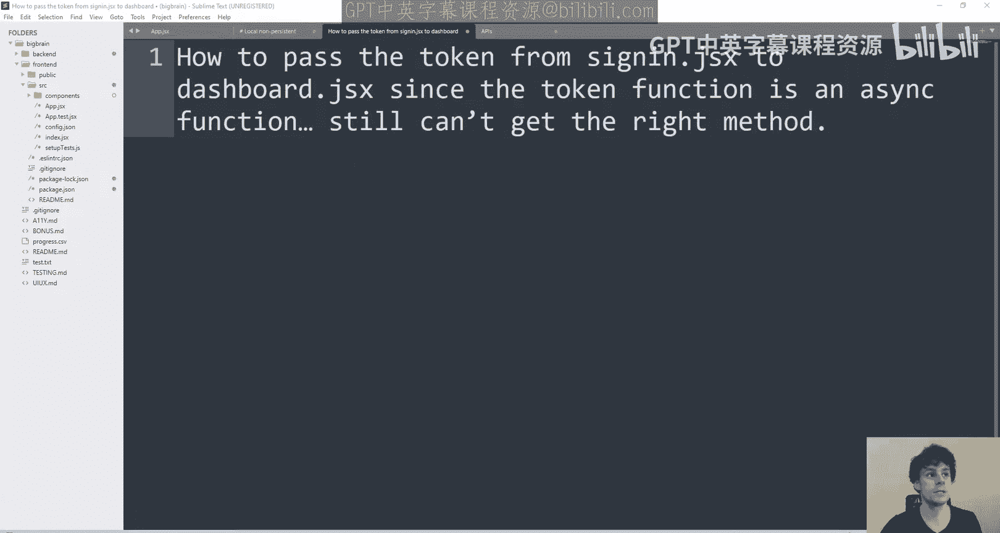

You know。There's kind of like this overarching app and then like we had last week。

Let's call this you app dotsX or something like that It might have your router in it if you use that。

 And then over here you have sign in dojsx then over here you have dashboard dossx Now not to sound annoying Darren because I know this is an annoying way to answer the question but last week when we did this in week8 we actually did something really similar where we kind of had like a dashboard section and then a sign in signup section we did some stuff with the code that you can find on Ees it's all kind of uploaded from the week8 Live lecture where we kind of did some things like。

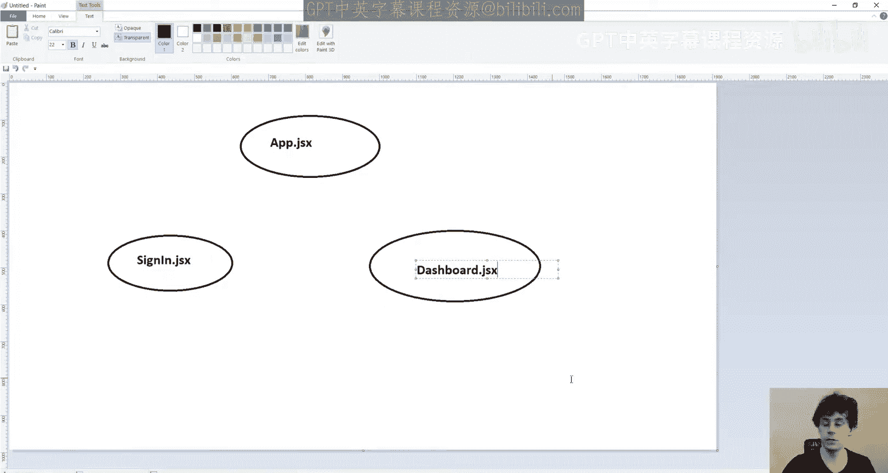

Sign in。Where。When someone tried to log in。嗯。We pass like an on success function through。嗯。

So it was like we had our main app， which basically basically like the most common thing that you'll see people do is like。

They'll store their token in either a use context or they'll store it in the very top level component like an app or JSX you know。

 Darren says even global state couldn't help I use react routed on to route the page once we get a new page the token haven't store into the local storage。

Yes， so。Generally， what I'd say is you shouldn't ever use local storage to like pass data between components I'm not in a critical way'm just explaining for other people。

 So local storage should be there to basically store data for when the page is refreshed。

 that's kind of it。 that's kind of why we stored the token here。

 Now what Darren's alluded to is that he's using react router dom and react router Dom is is a tool。

 Most of you will end up being familiar with if you haven't already because it's got the whole routing element to it and a couple of people are posted about this on the forum too maybe we could play around with that that could be something we could try and do。

 maybe we'll try and convert what we had last time to react router Dom and see how we go There's a few different ways you could do it。

I'll probably just do that because no one's asked any other questions。

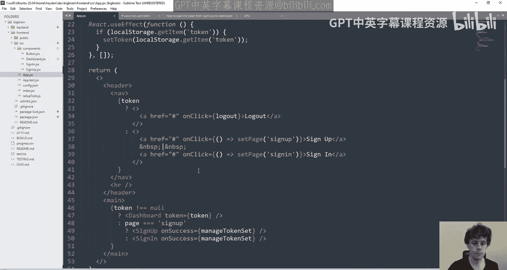

React routed on， It's a tricky， okay， so it's a tricky library， react。The standalone react。し。

Framework has a pretty crappy routing。 In fact， it has no routing。

 which is why you need this extra library。 I don't love this library。

 I work with a's a it's something called next Js。 It's something that we're considering。Moving to。

What， and if you're not really sure what I'm talking about here， again。

 a lot of this lecture is gonna be orthogonal stuff。 So don't take this as like core theory。

 It's a bit more of a fun discussion today， but basically， you can kind of think of like。

 react as like a core。

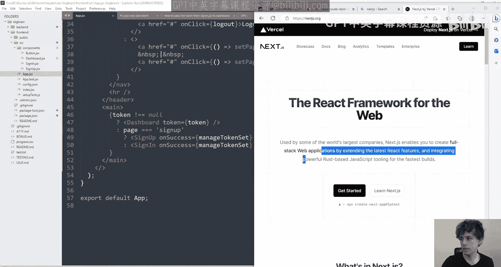

You know， just like Uni or something， its a bit dramatic， but maybe that example will be okay。

And then there's kind of like the sub frameworks of react so over here you have like next JS which is basically 90% core react plus a few extra things and then over here you might have what you know like create reactor。

And create reactactive app is what we're using in the course。

 and it's what's been used for a long time。 There's been a general transition lately to next year。

 some of you might have。I've seen it next Js has much better routing that's what I work with more day to day it's not something you need to worry about for the project there's definitely some downsides to it there's some things that are a little harder but in general that's the direction that we see a lot of people going but we're using create reactact app at the moment if you're not sure I'm talking about what I'm saying is like if you go and say set up react JS and you go to like the react JS website what they've done recently is if you go to like。

It's like installation。Try react， add reactor website。I don't know。Instalall。It's going get me， Yeah。

 getting started， you're actually same page， isn't it？m。Try react。 Maybe that's it。No。

Creed and new react up。They're really making it annoying for me。

 but there's somewhere like react JS install NPpm， basically like when you install react。

 you don't really， maybe it's here。I'm really wasting some time now。How to start it。 Yeah。

 so you'll actually see that if you go to the react dev website。

 they actually encourage you to use Next J to set it up now。

 I don't have create reactact depth anymore。Sos anyway， that was a bit of a babble， but basically。

 I was just explaining that react routed on something you're probably going see less of because as people move push people on to the next J stack。

 which has its own inbuilt routing， which is。little bit。It's just different， but I think it's better。

UAnyway， reactor routed Dom went through a really massive change between V5 and V6 and this is really important to note and I probably mentioned in the prere because V5 is like wildly different。

😊，That's why you kind of see a lot of this like you know。

 I'm on V5 something like that now I'm going to go steal some examples。We're going to go use these。啊。

The actuallyctor out of Do these six examples。There's just a lot going on here。

 so tutorial or guide to using react router。Most of react route stuff you just go and copy the code。

 there's code we have in the tutorials， there's kind of code everywhere for this it all pretty much starts so by installing the damn thing。

 which is pretty easy to do because just waiting for my terminal to load there we go So if I go to devb。

Is the S680 big brain？Just be brave。Yep， and I go in front end and then I go。

 I can look my package up JO， and I can see that there's nothing there。

 So I go MPm install react router dom。 Now， I don't have to specify the version because I'm pretty sure that it will pick the right version for me。

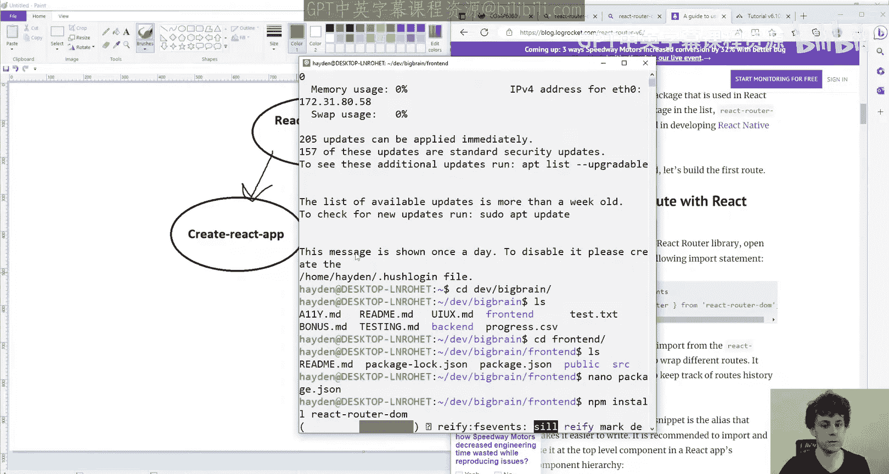

Cool， so now what this has done is if I go to my package do J so and you'll see that reactor outeromome is here and version 6 is here。

 that's good so the dependency has been installed and now all I'll have to do is actually go and you know bring it to life。

😊。

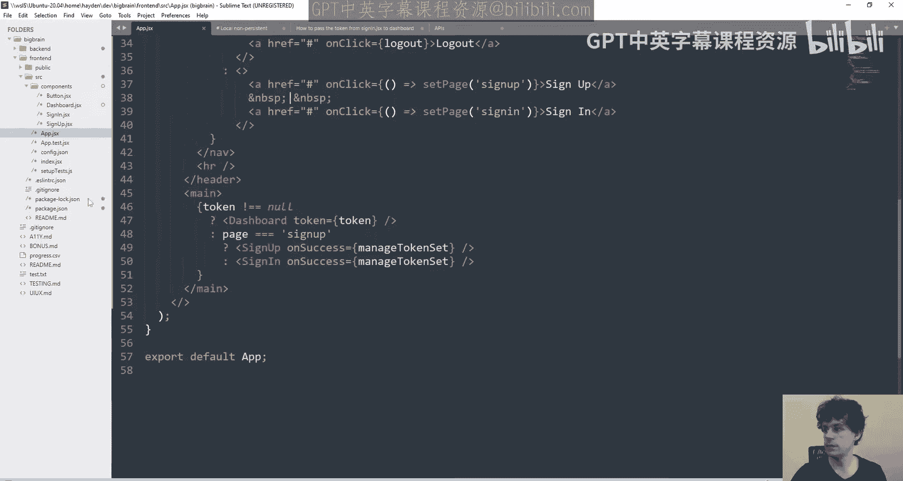

I can bring it to life by copying this particular piece of code here。

 but I also need the the imports。 So first thing to do is probably to grab that import。 Now。

 usually what you'll see people do is one of two things， either they'll， they'll。

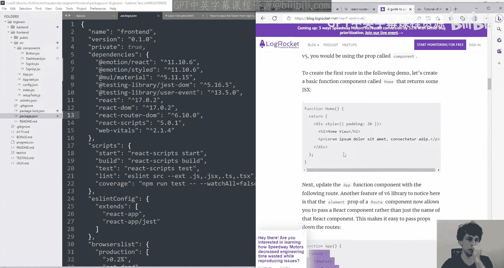

到， usually。Like it kind of depends。There's like this interesting question of where should you put your router code？

嗯。One way that might be most。Accessible for a lot of people is if I just go and put it like at the very top of my app do jsx。

 we can try this。 you can do it different ways。 But let's assume by the way。

 when I do my when I do my imports， I like to put all the library imports at the top and then my local imports underneath。

 but you can see here I've imported router and routes。 Now if I go to the sample code。

 you can see here that router is like this outer layer and then routes is like the one inside and then route is inside So maybe we need to import route too。

 But if I come down here， I now have to go well， I've got a router and that router。

 okay cool I got routes。

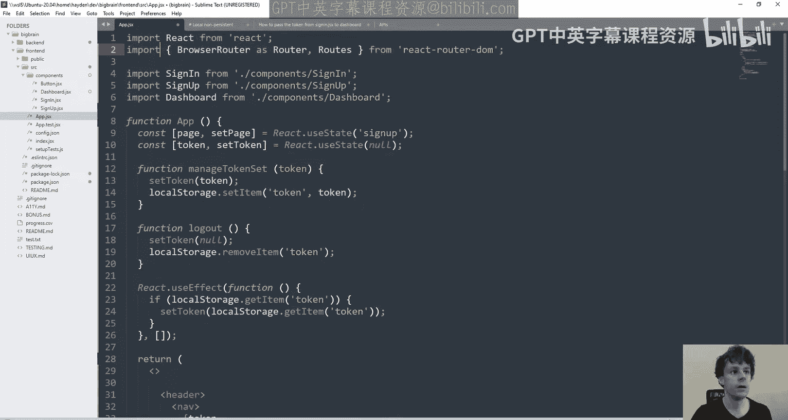

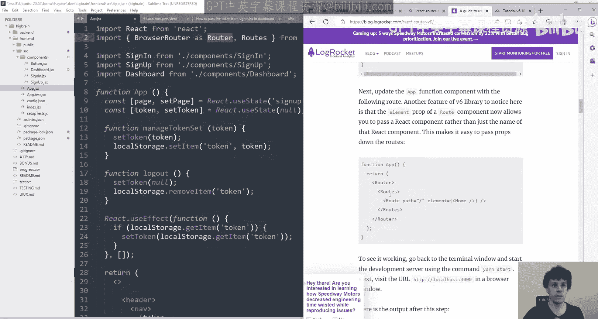

It's quite verbo， isn't it？And I got router。 and then inside that。

 I have a route and it says path equals， sure， path equals slash element equals。

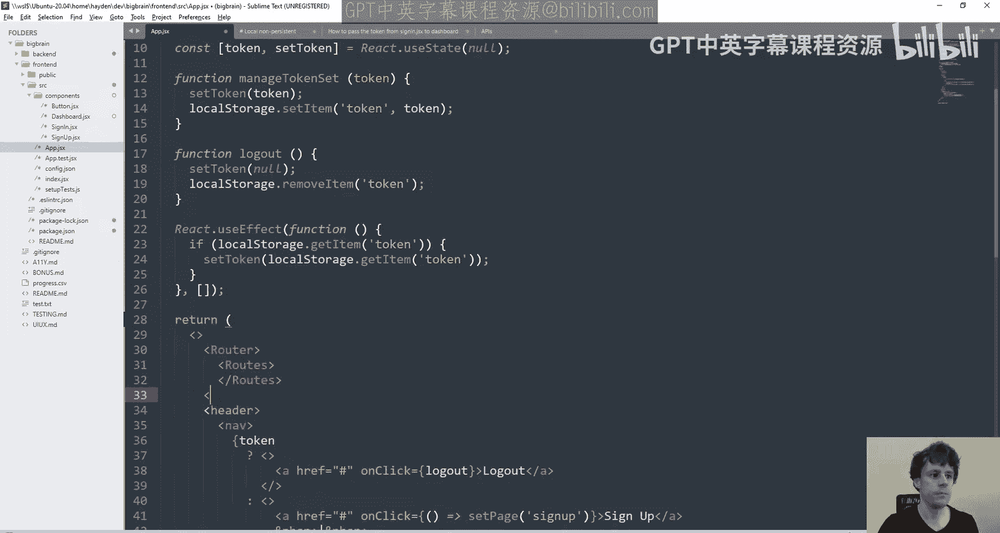

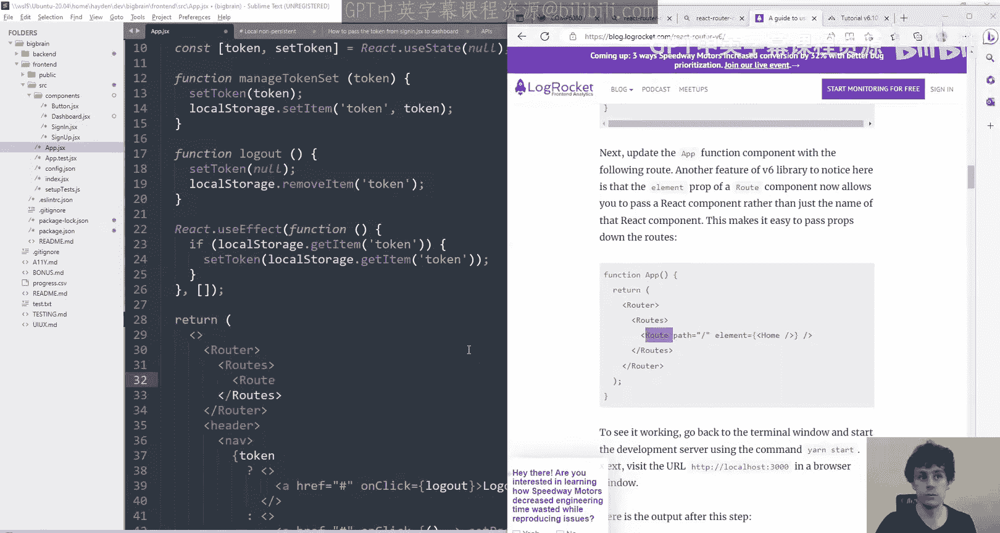

Something which in this case is a home component。Now you normally would have this import。😡。

Import from another file。 But just for simplicity here， I'm just gonna create like a。

Home component here that's just gonna return high。 All it is is a react component。

 whether you import it all defined in the same file。 It's just。

 you're just passing a react component there。 Now， I'm going to go comment out what we had last week just to get this example sorted。

 We will use that code because we do need that code。

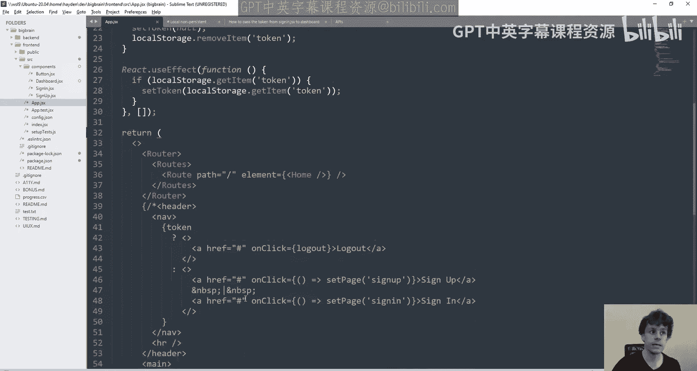

But we will start with that and now I will go and going into front end。

 I kind need to don't need to run the back end， not at the moment， but might as well run it。

MPm start。Yep， so my backs now running， and then I'll go run my front end too。And it should be fine。

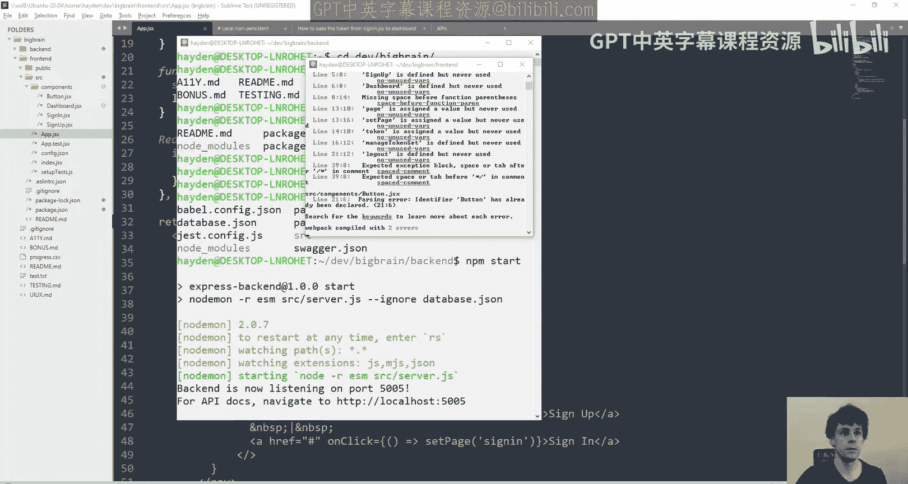

It's going to give me some error by the looks of things。Y， okay。

 module failed button has already been declared。 Oh。

 we must have screwed something up at the end of last week。 It's a bit silly obvious us。

 What lines that in button dot JS X， I probably cause I。Function。 Oh， yeah。

 that was just an alternative one， wasn't it。Okay。Nope， compiled with errors。All right。Well。

 that's not good。 But on the most recent spec update， I actually。

 I actually added a line here that's like， if you want to remove that these errors here。

 you can actually just go to your package dot Json and in front of the。Start if you just paste that。

 it's from the spec。 you can go find it in the spec， and then you restart your。Front end。U。

You will find that， it。Oh， it doesn't work。 That's weird。It's working for a lot of people。

Not sure why that is Very strange。Maybe we can。Just run it on the terminal directly， I'm not sure。

There were definitely people who were having。There were lots。 it's really weird。

 There were people who， oh， okay， it's working fine now。I don't know。 I don't know。

 I'll go run on the， run it on the the terminal like that before you run it。

 It's basically a shell variable。 So if you just like， paste it onto the terminal， everything。

 if you run NPpM start within that shell， it will disable it。 I'm not sure why it doesn't work。

When you put it in the package。 JO， I'll have a look at that after。

 but you know it's very easy you can turn it off one of a bunch of ways。嗯。Okay。

 so I've got the high easy。😊，This is good。 So I've got my router now。 my router is behaving。

 It's got that。 And we can， you know， we can test it out because。😊。

We'll make another component called sample。Which is just going to say by and sample here will just be on route slash sample。

So， you know， we can get， we can get comfortable with。Now it's doing it again。Okay。So mysterious。🤢，嗯。

Okay， but if I go a flash sample。

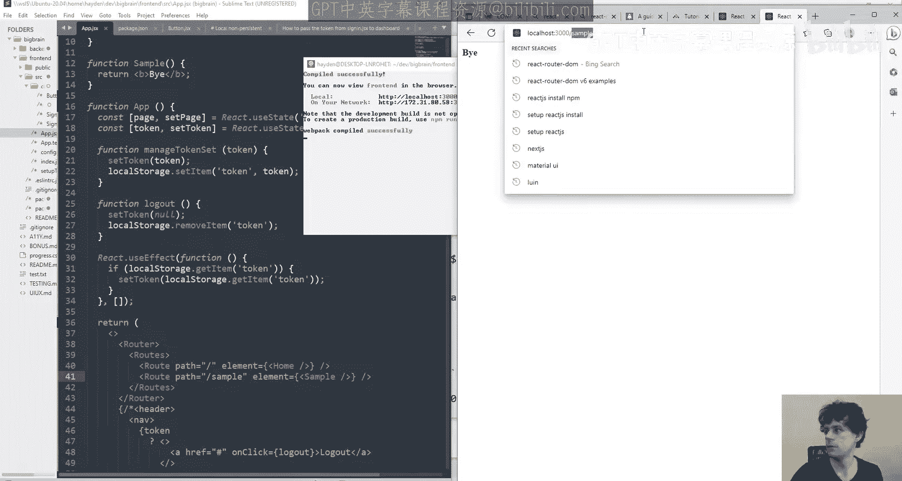

嗯嗯。Seems to do it the first time， but then not after the first load。That's all right。

 I'll try just for this lecture， just to brutalize things。I'm just going to go end。

Turnned a lot of stuff off。And see if it works。

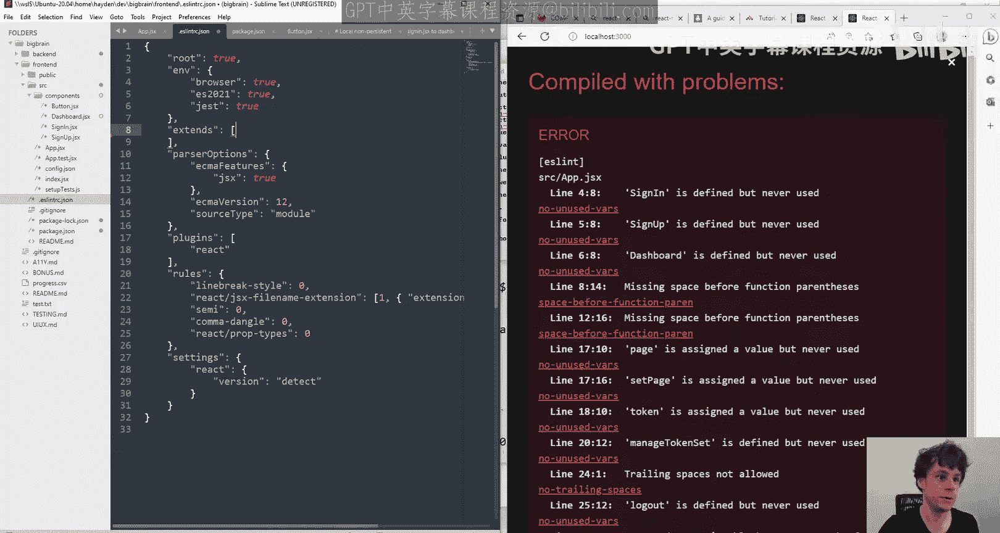

I don't。 I don't normally turn it off this way。 It's just I'm not sure why this isn't working， so。

Let me just try and quickly get this working for you。Okay。

 that that seems to work just removing those three lines from Yes thentasi。 So that there's problems。

 we normally don't have this problem。 It's kind of annoying because you know。

 packages get upgraded and then defaults get upgraded and it changes term to term。

 you don't really know what to look for。 So appreciate people's resilience in this topic。

 So I've got my you know my main page and my sample page right and you can come along and be like。

 well， okay， well， what do we know know we have a sign up page and we know we have a what was the other ones it was like sign up and it was。

😊，Sign in and then we have out kind of like。Dashboard， if you will。嗯。

And we know these because we have these components here， like this sign up。On success。

 So I go sign up， I'll just paste that in here。 and then this component。

 So the router is basically just a really convenient way to say， well。

 I'll just you figure out all the the inter page stuff。

 I'll just say to you this particular URL goes to this particular component And now that's all apparently fine except samples not working but that makes senseca I got rid of the sample URLs。

 So I've got this high up here。Right， which is this， you know， path of。The slash home， but we don't。

Wantna just like。Sit at slash home， we'd really like to navigate somewhere。So well， then you have。

So this is kind of funny because it's like， all right， well， let's go back to our use effect。

 I use effect said that on page load once we try and get a token。 and if the token is there。Then we。

Set the token into sorry if the token is there then we set the token into that global variable。

 but then we think， oh， well， if the token's not there we kind of want to send people away to the other page Now we kind of did that previously by this conditional here where like whether the token exists or not react router dom push。

Push route。 So if you're using reactor route dom， the way to kind of move between things。

 you can't just kind of set the state。 So you need to go and find probably something like there's kind of two ways to do it。

 It's like you can either。You can either use the redirect this this two things。 One is the redirect。

啊。Component， which is a little bit weird。 I think the redirect components is weird。

 It's kind of like you're like， if true， then return， redirect to equals sign up like that。

This one can be a little bit funny， this works well when you kind of know everything on start so like what I mean is if we come back to say this page and I try and load it you'll see that what will happen is as the functional component runs。

 it hits the if true and then it returns that which。😊，It's just， I just don't like this pattern。

 it's like you return that which then redirects you， I press save。

And it says it's not there because yes， I haven't included it， which makes a lot of sense。

 It's part of ratoton if I include redirect。Oh no， is it but is it react rather。

 sometimes they change the names they might be thinking about。嗯。V5， not Sir。How do I include it。Bs。

 oh custom wrapper。 Oh， it's navigate。 Oh God， Yeah， that's， that's why I saw that before。

 Is it navigate， too， Is that what it is。What is it complaining about。Not too sure。

This is why I don't like the Docs update。 I haven't tried to do this in reactor out of V6 before。

Let's look it up there。 React router， Dom basics， navigate。Here we go look at the docs as always。

 okay， import navigate， so we've done that correct。 how have they used it。

 navigate to equals dashboard， replace equals true。啊。Let's add this。 I think I aren't。

 I'm not sure I 100 per cent understand what's going on here， but we'll try it out。No。Not sure。

 let's look at the arrows navigate may only be used in the context of a router component。Yes。

 this is a pretty common error that students post on the farm about basically it's like。

Everything that happens with react router has to exist within the router component。

 That's a common reason why people put it as like the parent element of the entire application as in so here I kind of conscious like if I return this like so react will kind of either see if true return that otherwise return all of this whereas what I'd actually need to do which is kind of annoying is be like if true then return you know。

This。Otherwise。You know， return this whole route themema Bob we have here。

Which is just kind of we it as far as I'm concerned， right， It's like。It's just a little bit like。

 and that probably works。 No， nothing was returned from render。 It's all right。

So what's happened here？Okay， so now now my app's not working because what I've tried to do here is basically this will just redirect forever because when I'm。

Because the app's the main component right so every time the functional component tries to rerender。

 it tries to resend you the exact same page my point is that's one way you can navigate The other way you can navigate is react crowder Do history push。

Pretty sure this is the case。嗯。Okay， yeah， they have the use navigate hook。

 I've seen a bunch of people posting about this on the forum。

 So Use navigate hook is like here you can put use navigate like that and then inside your functional component。

 you write constant navigate equals use navigate like this and now anywhere inside your functional component you can go and put like a navigate to like slash sign up here。

 This one I think it's a lot more intuitive for students because it's like doing that whole return thing is a bit weird。

 So I definitely recommend where you you can you might want to look at that。

 there's certainly some instances where the component return thing is useful， but like in this case。

 you can start to pull together the the logic pretty clearly by saying if I'm if there is no token。

Like on this use effect， it's like if so if someone's on the dash。

 if someone's not on sign and I'll sign up。And there is no token， right？So I care no token。

 Basically， if I get to that else， then。Someone's not signed in because there's no token。

 I want to navigate them to the sign in page。However。

 how do I tell whether they have a token on it well I mean I already know that。

 but the question is if I put this right here， what will happen is that it will always send everyone to sign in even if they're on like the sign up page。

 which is kind of annoying kind of makes the app a bit awkward that's assuming that it。😊。

What's the problem， Use navigate may be used only in the context or a router component。Yeah。

This is kind of annoying。That's why I don't like all this router stuff because then it's really weird because you' like what do you mean it's like。

 well， all of this stuff here is trying to happen outside of that router component。😊，Well。

 how do we get around that？ Well， another common way that you'll see people deal with things， right。

 is that they'll create like a。You know， they'll create like another file in source and they might call it。

Ra dot JSx。And what wrapper is is basically this entire function。Like bear with me for a second。

 it's like raper will be all of this except for the router。Commands like that。Right。

 and then app dot ASX， it only really will have one job now， which is to basically be the router。

Like that and all that's going to do is just be router and then include。Rrap up like that。Which。

 you know， seems a little bit pointless， but that's all right。 And let's just。What we're doing。

 So now I kind of function app like that。 Yep， and then I'll say import。

Rrappper from Rapper and then wrappper itself will， you know， we'll call this rapper。

Because now everything inside my entire app is going to exist within that router call right。

 because app includes wrappper and then everything in here。 Do you know what I mean。

 because just inside this function， all of this is happening before there's something returned。

 whereas like if I， if I put all it in a wrapper component and then I， you know， wrap that in like a。

You know， this app do S X that's got the router and everything's in the router。

 William Chen just joined and said， sorry I'm late。 I just got my mark back from 3，1，2。

 and I believe that's our goes for memory I got remember。

 and I'm in a state of depression at the savage feedback。 sorry about the savage feedback。

 That's not very nice， You know， if you ever get savage feedback。

 Just remember every student gets their opportunity for savage feedback at the end of the course。

 they call that my experience。 not really don't don't be rude， but you know。

 I'm sorry if someone said something awful to you。 That's not very nice。Yeah， that sucks。So。

Now we have this sign up page， but the interesting thing here is like I'll put a console log and I'll say no token just so we can really pay attention to it。

But you see the token actually still exists because it's there from local storage last time。😊。

Which is interesting， so if I went to say delete it from literally last week。

 if I went to say local storage here and I went and deleted token。Like that。

 And then we refresh the page。It says no token， and you'll see it redirecting me to sign in。

 If I go to the main URL， it redirects me to sign it。 If I go to sign up， it redirects me to sign in。

 Now， what we probably want to do here is not redirect everyone to sign up because otherwise what happens is on the sign in page。

 right。Then。嗯。Like and and then so then there's an interesting question here。

 which is a lot of people might do something like this。

 They might say a H F equals sign up and the text will say not yet the user sign up now pretty common thing you'll see in websites like that。

 But when you click that， it's actually doing a full refresh to take you to sign up to sign to sign up。

 you can see that because the page does this refresh。

 And if you look at the little fab icon at the top， you'll see that that flash it。

 you know rotates for a second。 So when we actually move people between URLs with reactor route a Dom。

😊，We want to use link。I believe。Link is a， it's kind of like an a tag and you can include it really easily。

 you just go， you know， import link from react routedodon。And link is honestly just like a。

 except instead of a， you write link and instead of a Tra， you write two。That's it。

Except now what happens is it's not technically a hyperlink to a new web page。

 It's actually just trying to change the URL。 So this is kind of what turns it from like redirecting and reloading the entire app to like a single page app it's like bouncing around it's really beautiful in that way。

 how it's all structured。 but the problem is because how what I've got an app do in Ra Jsx now because this is always sending everyone to sign in if they're logged out。

 it means the sign up page if I try and load it， it sends me back to sign in。😊，Now。

 what's interesting。Is that if I click on sign up it works， but if I refresh sign up。

 it sends me back there。 Now this makes sense because the use effect that's navigating people that only happens on the first load。

Right。And this is also really interesting。Because what it means is that you might actually want to change or come back to changing how that works in a sec。

 let's first actually solve it， which is that I want to say here。

 I only want to navigate people if they're not in sign in or sign up。So now I say react route。当嗯。

Poop， okay。Passseite。Ah， that's going to take me to the main page， isn't it？嗯。What is it location？

I it's location。 There's a location。 Yeah， there's another hook。 so many hooks。 What's a hook。

 It's a mystery。 There's another hook called use location。

 So use navigate is about sending you between pages。

 Use location is a part of reactor out at on that helps you understand metadata about the current page you're on。

 So by adding location here， what I can do is I can actually start adding an if statement。

 which is like， if location dot path name。😊，Equals sign up。Or location dot path name。 Or， you know。

 you could kind of do this the， the fun way， which I think would be like。Sign up or sign in。Yeah。

 if that includes location dot path name， that's， that's an easy way to check on multiple things。

 Basically， I've got an array of items。 ABCD is what I'm looking for one of those items。

 That's what I'm saying there。 So I'm saying if sign up or sign in is included in that。

 then we don't want to redirect。 But so we'll put， you know。点啊。The negative。Condition there。

 and then we say redirect now。 So it's like if there's no token， if there's a token set。

 then we set token， but if there's not a token set。Then we navigate people to sign in and stuff。

So this should work now。 So' on sign in， were go to sign up now。 I refresh this page works fine。

 but if I then go back to sign in。😊，And I enter the details and I completely forget the details we had last time。

嗯。诶比 ok。A B， sign in。That should work。 I signed in。 I don't know。 We can check local storage。 Here。

 there's tokens there。 That's really interesting。 Why didn't that work。

 So now we go have a look at sign in。 Okay， so sign in on success， something happens。😊。

Doted up token。Now that still seems to work there because it got added to local storage。But。

Last time the way we went from the login page back to the dashboard was that here we had that little conditional that's like if token。

 then go to this page。 So this is now where， for instance。

 we actually would need to go to our login page and we need to use， you know。

 the navigate hook here as well。 So basically， you know like when when someone signs in after we've out of the token。

 then we want to go say navigate them to， you know， the dashboard。

And then we go do the exact same thing for。Sign up。So sign up， we do the same thing。

 I'll include this nice little。 This is a nice little link here。 We can say。Already a user。

 alreadyready a user signed in now。Send them to sign in。You got the point。

 So now when someone actually signs up， they get navigated to the main dashboard。

 So we'll try this out So sign in A B， sign in。 Co。

 what you'll also notice is that if someone lands on the sign in page。

 but they've already got a token， what do we want to do Well， like here， it's like。

 this is when they're signed in。Yep， and this one's not signed in where we can do the same kind of thing and say。

 well actually if they land on the sign up or the sign in page。

 then we're actually going to navigate them to the dashboard so that's kind of how we can protect like the logged in logged out stuff。

Oh， cool。 There's my high。But my high here was just that。

But I actually want to use that for my dashboard。 So maybe I'll just put that there Now。

 dashboard list games， show create game， A， create a new game。 B， create a new game。 Co， you know。

 so it seems to work so far。 we've also successfully。

 And I think there was a student who I might have sent on a bit of a rabbit hole on the forum。

 I'm sorry for that person。 But you can actually， the good thing about this is you can actually pass these things through your components。

 too。 So， and I think even to。😊，To Darren's question。

 that's kind of the answer about how to pass the token from log into to dashboard。

 It's not so much that you pass it from login to dashboard is that the token exists at the top and the tokens passed everywhere and anyone that needs to change the token gets。

The the mutator function as well， the like set token or something。

 And therefore it's all kind of passed up and down。 I hope that makes sense。

 Darren if it doesn't let me know in the chat because we can keep going deeper on that。 But yeah。

 there's， there's the routes。'， that's pretty straightforward。

 You can do more interesting things with reactor route on where you put routes in routes and use the outlet。

 If you want to do that， Go look that up。 It's quite it's quite interesting。

 Like we can actually see that if we go to like。😊，The E site。 So if we go to like。

 say this is the the course website， this is like this website here， right， If we go to like source。

 for instance， and we go to router。Yeah， so you can see this site's kind of set up where it's like you have log in。

 log out。The site page。 But how this works is like the site page is is things that are nested inside of it kind of all exist within it。

 So what I mean by that is that。Anyone who's on the dashboard loads the dashboard component。

 but that dashboard component is wrapped in the site component。 and anyone who's looking at。

 you know， timetable lectures page sees is it sees the timetable lectures component that's wrapped in the timetable based component。

 that' is wrapped in the site component， you know， So that's one major change they mean to react out at dom 6。

 which is where you can basically say， and you can see this because like look at this page timetable base。

 right， So the timetable lectures page is wrapped in the component timetable base。 So if I go to。😊，就。

Timetable lectures。Which is this file here， it returns a whole bunch of stuff like a table container and a table header that's like weak so you know we could do that we go to lectures and it says。

Week。What are we looking at here？timetable， thank you。

Timetable lectures he' got week and then day and then time and all this kind of stuff。

 And if I go to like timetable tutorials， it's the same kind of thing。

Except all of this exists within timetable base and timetable base is literally just a component wrapping something else if you would and this is the only thing I'd say if you'd like to wrap routes within routes。

 you need to do something that I'll demonstrate to you pretty quickly here。Let's imagine。

 for a second， that。Everything here exists like we call this dashboard。 right。

 We'll go back to what we were calling it before。 So that means for this to work。

 this has to be called dashboard。Yep， but we also then need to wrap everything inside this like outer route。

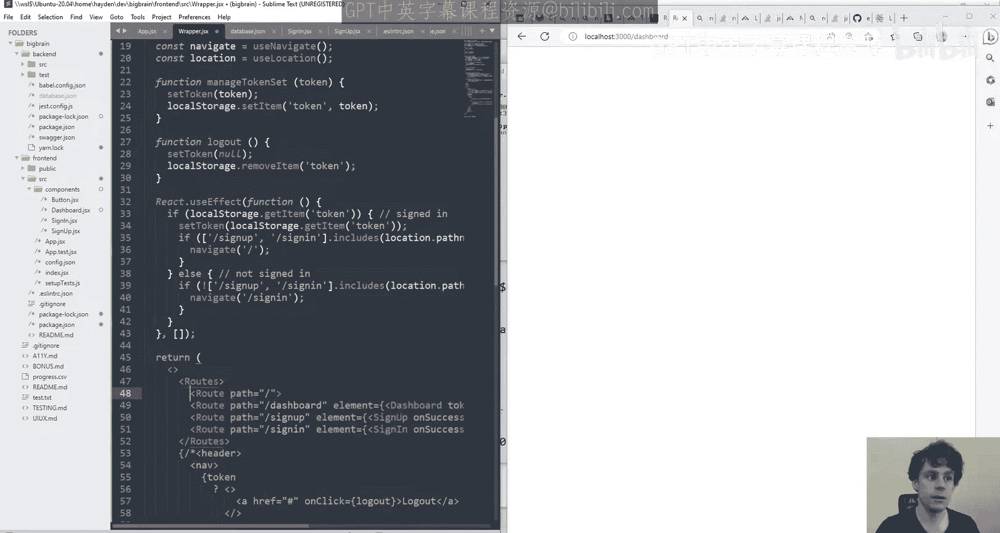

Right so you can wrap routes within routes。Now this won't work because every route needs an element and let's imagine for a second that this element's just going to be like we'll call this site that's kind of what it did with echoes。

And we can go define site up here。 We don't need those anymore。 Call this site。

 And all site's gonna do is it's just going to return， say。You know。

 empty tags and then really importantly outlet。Outlet is a component within the reactor Outaddonme library。

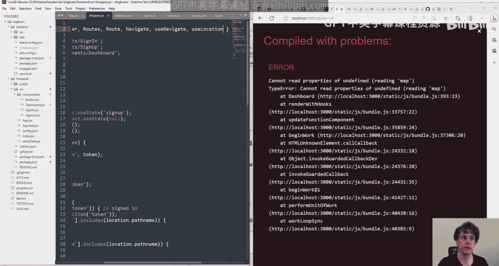

嗯。Why is that not working？😔，Do I need to put brackets somewhere？

I can never remember when parentheses are meant to exist。

Over feeling that might be a problem with the dashboard， let's try the sign up page。Okay。

 I think what， I think what。The problem here is that we're always trying to redirect people to slash。

 but it doesn't exist。So if we always try and redirect people to dashboard。You haven't signed it。

 I'm not too sure what the。What's that error。 Always look at the console。Figure this out together。

Cannot read properties map dashboard on line 41。佢企。I don't know。Is complaining about the use effect。

 if I get rid of that doesn't work。Nope， still unhappy。Dashboard on line 41。

 It really just doesn't care about the line of code。 I'm not really sure what's gone on here。U。

What if I get rid of everything but。And then we just try and load up slash。That seems to work。

But if we just have the sign in page。Is trying to send us back to the dashboard。 Okay， well。

 let's get rid of， I'm just debugging here。 part of why I'm doing this and why I like doing this in lectures is I kind of just sit show you。

 It's like， well， I'm just working through it。 Okay， so the sign in page works Great。

 Let's make sure the sign up page works。 sign up page works。 Okay， if I include the dashboard page。

 and I try and navigate there。 It sends me to sign up， sign in perfect。 So I go A B， sign in。😊。

Now it all breaks。 I also see that my sign in sign up page is sending me to slash or is actually wanted to send me a dashboard once I sign in like this。

So it should send me to dashboard。 The dashboard still doesn't like me very much。 Well。

 the problem there is probably something to do with the content on dashboard。 So how do I。

 how do I debug this， Well， I will simply go and replace all this content with return B test。

 And if this works， Okay， so I know the problems in my dashboard component， right， easy。

Now I start to dig a little bit deeper， and I wasn't even looking at the right file before dashboard on line 41。

 So now what it's saying is that as we try and iterate over quizzes。

 it cannot read from properties of undefined。What that implies is the quizzes is probably undefined。

 So if I consol log that and you scroll up， you'll see that it's undefined here。

 You can actually see here that it used to be an empty array and then it was undefined。

 What this usually implies。In this particular case is that you have set quizzes to be an empty array。

 but then someone has called set quizzes and set it to be undefined unintentionally。

 So I'm going to go look for where this is called。 And as you can see。

 the only place it's called is in dashboard。 and it's called in dashboard When we get a response from our fetch to get all the quizzes。

 Okay， so what am I going to do now， I'm going to console log data。

 I'm going to go see what data that API calls returning。 I'll refresh my page， all。

 I can see the invalid token。 Okay， so the tokens invalid。😊，Have I logged in right now。

 Well I'll quickly check。 Okay， there's still a token there。 So clearly。

 I've broken something and like how this is being passed through。 So tokens not right。

 tokens being passed into dashboards。 So I'll go back to my wrappper。

where I'm passing in token like that and then I'm like， I wonder why that is。

 so maybe I'll console log token。That seems okay。So why is this going wrong？You know。Any ideas？

 I have an idea。I actually don't。 I don't use this stuff every day。

 and I don't go into this much depth with it， typically when I'm teaching。But， I have an idea。

It's pretty easy to check if I'm right to any ideas from people。Whilst I asked that question。

 William asked the question which was how do I protect the routes？Well。

What I did by there's a bunch of ways you can protect the routes。

 you can either like put some conditionals in， but I don't， I don't love that approach。

 The other thing you can do is simply to have this at the top here and be like。

 if someone tries to load those pages and hasn't logged in， you just send them away from it。

 You don't have to get into the mentality of like。You know。

 no one should ever be able to even start loading that page because a page on the front end。

 you don't have to protect it like there's never anything sensitive on the front end because all the jas there all the codes on the back end。

 So your server protects you because your server won't return the information to someone who's not signed in so you don't need to prevent anyone from ever trying to get on the sign in page for half a second。

 you're just trying to prevent them from kind of like staying there so to speak。

 so if someone goes to sign in， we will very quickly figure out whether they've signed in or not here you know I've seen some people do some interesting things too。

 which I'll just show you again whilst I'm waiting for someone to tell me what they think is wrong here。

 actually I might try and fix it I think the problem this nested route I've done and I can test if I'm right because I could be wrong by just removing it。

嗯。Nope。That's good。Well， then I'm kind of confused because I'm like， well。

 dashboard took in a token and it looks like that token was fine， right？😊，Well， it's initially null。

 which is very interesting。Which makes sense。Right， because。

What that means is that when we load the dashboard。

It's initially null and you can check that because our fetchual quizzes happens within a use effect。

 And if I just console log token here， you'll probably see that it's null because， you know。

 the wrapper loads straight away and it immediately tries to mount and render the dashboard。

 but then the wrapper kind of does that use effect where like half a second later。

 it changes the token， but。Dashboard doesn't care because dashboard is already on its way。

 So you'll see now when I refresh this， the sad faces null。 So we have the token O and the rapper。

 So my theory was wrong， right， That's fine。 but it's not being passed in here correctly。 Well。

 how can we get around that。 Well， there's a couple of ways you could do it。

One thing I would say is that whilst the dashboard。

 like loading the dashboard when you aren't logged in is pretty useless。

 So we could actually tie this answer into what I was going to show you all anyway。

 which was that a lot of students have been experimenting with loading states call it like global load。

So basically when the page loads， like when the page first loads。

 it's loading until you've read from local storage and confirmed what's going on。You know。

 so for instance， you say that by default， things are loading so then。If。

Yourre loading simply return a page that's like loading dot dot dot。

 You can make this as colorful as you want。 But if you aren't loading。

 then it continues down and does the rest。 So now it's loading by default because we set it to be true。

 but we never unset it to be true。Which makes sense。嗯。How do we set， Well。

 how do we turn it off or we turn it off once we have confirmed that， you know。

 we've checked the token。 So like if we set token， then we set， you know， global load to or。

 you know， set global load to be false。that or you know， we set it there。

You could do this in a bunch of places， you could do it at the end here or something like that。

 that should should work。Yeah， so suddenly that works now because we basically didn't mount the dashboard。

 Do， you know what I mean， So it's like the page loads。

 the token is null because that's how it starts。 Obviously， local storage is an async。

 You don't really need to use use effect for the token。

 I'm just trying to like maybe paint a picture here， but。So I hope I'm making sense。

 I feel like I'm moving really fast tonight on stuff。

 but this is kind of assuming people are played around with react a bit。

 So hopefully you're following。 if you haven't， if you haven't started for this。

 it' probably very confusing， but。😊，So。Yeah， okay， so tokens now to start。We set loading to be true。

 whilst loading' is true we just render loading。t dot dot。Once we've confirmed。

 we've got what we want and we've set the token or not set the token。

We then set global load to false， which triggers a state refresh。

 which then allows this part to load down here。 super easy。I hate saying that。

 So I hate saying if I say that just punch me like super， it's like， it's not super easy。

 It's like it's。The steps make sense， even if it's complicated。 That's usually what I mean。

 It's like it， it follows a logical flow。 None of this stuff is particularly easy。

But then the next question is like， oh， we've got this header here。

 What are we going to do with the header。 Well， this is one of the great things about wrapping route because now I've got this site component up here that all these other subcomp all these other sub routes use so I can just come along and just like grab it。

 I'll just go and grab something like this header。😊，嗯。So I'll go to my site component。

 fact that I might just grab all of it， and I'll show you the benefit of react router is I go grab all of that。

 and I just kind of start pasting it in here like that。 And like we had before。😊。

exceptcept this is kind of a bit tricky。So I'll comment that out for a second。

 and I'll just put nav here for fun。 But you'll notice if I put outlet here in mainine。

This is the exact same effect because site is like the wrapper route。

 so all the other sub routes here kind of they're populated within that outlet component outlet's kind of like a placeholder。

That is loaded for people， which which is good。 And we got nav there。 So now we can， you know。

 do what we've done previously， which is， you know， we can say constant now constant。

Location equals use。Location， which we already imported。And then here we say， well， if location dot。

 well， we've already got the the freakingum。The stuff here， basically， you know， if， if。

 if you're either on the sign up page or the sign in page。Then we want to load。 well。

 I'll do this the other way。 If you're not on the sign up or sign in page。

 then we just want to load the log out button。 and if you。Wait， if you are on those pages， oh。

 that's that's not really how it works， is itca if you're on sign up or sign oh， it is， it's fine。

I think yeah， let's just press save and see what happens。Get rid of that other comment。Yeah。

 logout is defined。 Oh， where's my function for log out。 Okay， and then this is kind of annoying。

 She's like， oh my log out functions in my other component because normally you'd put this site in another file。

 right？ Maybe I'll go put another file just for， for consistency's sake。

So I'll create a file here called side do JSX。Like that， right， export default site。

 Then I have to import a few things to because like。Just closing some files。Theres it wrapper。

 wrapper， Yeah， I need to import these two things。So you know， I've got my site。

 I don't need all the router and routes and stuff。 I just need to use location。And outlet， yeah so。

And then I need to， you know， import it so much stuff， isn't there sometimes？

Site like this blogouts still not defined。 And that's because I like， oh。

 I need to copy and paste that function out of my wrappper and into my site like this。It's like， oh。

 okay， but set token is now a function that does nothing。

 This page is rendering because jascript will kind of just ignores functions that aren't defined sometimes。

 but how do we call the set token where we do what we've done previously。

 which is just that we pass things in。 So I could， you know， I could just pass in set token。

Into my site。If I wanted to like this， and then I could just include it as a propx。

And this should work。 Get rid of the snap text。冇去。Nope， didn't work or did it refresh the page。

 It did work。 I just never sent anyone somewhere。 So now I also need my trustee use navigate。Right。

 so again， do the exact same thing。 We've got navigate and use navigate。 And at the end here。

 what am I going to do。 Well， once someone logs out， I'm going to navigate them to the sign in page。

干吗？Try again A B， sign in， log out， sign in log out， Ve。All this code is going to get uploaded again。

 so like don't stress， I'll just put it up， just check， you know。

 it'll all be up there in the week nine stuff。But yeah， I mean， that kind of answers， I mean。

 I hope that answers Darren's original question too， how do we pass the token between stuff。

 I think I've done that pretty thoroughly today。Coming up on seven o'clock。

Please share some other questions。 I'm not going to take a five10 minute break to come back and not have any questions。

 So what I'll say is that let's all take 60 seconds nowll give you all 60 seconds to just if you have any questions。

Post them right now， then we can assess whether we should just go for another five minutes or whether we should。

嗯。You know。就。Take a break and go into lots more questions。 Hopefully， this is good。

 This has been good。 Thank you for those kinds of initial questions。

 I think this has been exceptionally useful to kind of go and react router more and。

 and not just because of the router library， which is a bit thick。 It's also。😊。

It also has a lot of side elements to it， you know， like playing with components。

 passing things through。Cool again， if you have any questions。

 post them in the next 30 seconds because I'll just assume in 30 seconds。

 if there's no more questions， then that's it。 So don't， don't hold your question for five minutes。

 We're kind of locking it off。 just so we can help everyone plan their night。 in the meantime。

 I'll answer instance question。 What sort of things would be worth including in the Ui U file。 Okay。

 that's a good question。 So basically what I'd say is every single time。

 like when you're making your app。 You're gonna do pretty basic things just so that it functions like use bootstrap libraries or something like that。

 or material Ui it's just gonna look like this。 But then occasionally you're gonna come up with something。

 you'd be like know， it's actually gonna make like。

What I'd say is that your apps are on this kind of spectrum from awful。To usable， to nice。Right and。

You know， awful to usable if I go back to the spec and we go down to the criteria。You know。

 your app kind of needs to be usable。😡，Which is pretty easy， like， you know。A lot of。

 a lot of these apps you， you know， like， okay， maybe yeah。I'm rambling。

You're going to do basic things to make your app usable。 like have nice fonts and stuff like that。

 Then you're sometimes gonna say， I want to make it nice。

 Maybe you're gonna to put an image somewhere。 So let's take a look at the Ees website。 For instance。

 I'll tell you some of the things that I think would count as like。啊。The U I UX， the extra things。

 right， So， for instance， here， I decided that all of the navigation elements would have icons to be more visually appealing。

 I decided that anything that would link you away from the website。Would have a little。

External button here to it。 So when someone clicked on forum and it wasn't taking you within echoes。

 I'd do that。 So it was clear。I'd have some minimized stuff which wasn't， you know。

 it's not necessary。 I could have just had those in a list so that you know people can you know minimize things on a small screen we added this so that you know。

I mean， yeah that， you know， it's like mobile responsive。 We've got this little icon。

 This image here is not necessary either。 It's like。

 what are all the things that your app is still very usable。But you added it in。

 even though it wasn't necessary because you wanted the experience to be better， you know。That's。

 that's kind of one of the main things。 so just dot points that'd be fine。

MYX says can you show some example for the testing？Again， I hate to be difficult in this one。

 It's like， we've gone and got these tutorial questions。 And， you know。

 I think they go into some good depth。 There's like the lecture on testing there's a tutorial questions on testing as a prerecorded。

 there's a solutions。 if you're just looking for an example of testing。

 I'd honestly just point you there because all we'd probably be doing is just pulling up one of those examples and stepping through it too。

 So if there's kind of nothing colorful to talk about。 I just say go look， go look at that。

 Obviously， we can always talk about it next Monday to once people have some more pointed questions because I assume right now。

 anyone who has questions about testing hasn't really spent any time on it。

 So what I'd say is like if you have questions about testing best to。Get into testing by next Monday。

 which is two days before it's due。 Most， most people do testing like 48 hours before it's due。 Like。

 I'd love to pretend that's not the case， but it's the last thing people care about。

 It's just kind of how it works。William says what is player ID used for and what is the best way to incorporate that Oh that's a good question。

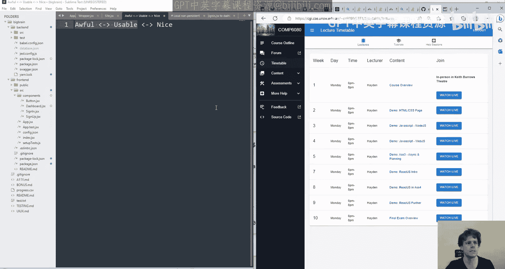

I haven't really。嗯。Sorry， I mean， I don't know what you mean by what is player ID like？Obviously。

 when you go and join the game as a player。🤢，You know， you play and it returns your player ID。

You use that player I。 Your player I is essentially like your token for a logged in user for for a player。

 And you might be thinking， oh my God， that's not very secure。 It's like who cares It caooot， right。

 Like， you're not trying to protect like what are the odds that someone can randomly guess the right player And what damage are theyre gonna do。

 Join your game and win。 So that's why it's really simple。

 So the player Is for the user are just a token。William says I made the player join last night and generates a player did correct。

 Do I put that into the URL for one a user plays the game。

 I think it's fair to assume that when you're playing the Kahoot game that。😊。

The player will not close the the window， but you could store that player Id in local storage or you could push it to the URL。

 for sure。 I think that would be a fair case for like a little bonus mark or something。 you know。

 like that's something that we don't ask you for because you're kind of like， well。

 if they if their computer crashes or they accidentally close the window and they reopen it。

 the state somehow persisted either in the browser history through the URL or in local storage。

 right， So that's fair。That's how you could use it。

 I don't think we make you do use it like we don't make you use it other than to you kinda need it just to like pass into get right that's like from a coding perspective。

 you need it to call the get methods Williams says， boy if you have multiple players。

 won't local storage override it， I get what you're asking， but again， like go play a hoot。

 it's like no one's using the same computer right you're all playing on your phones， laptops。

 whatever So it's not gonna conflict storing it because people are on different devices basically。

Is the short answer。 I mean， yeah， I mean， maybe it's a theoretical case of two people playing on one machine。

 but like。I you know， you know what I mean， it's like that's kind of beyond the realm of reasonable because it's not how the app's really designed。

I hope that answers your question。😊，嗯。But yeah， in terms of the player。

 how it's used is just to pass into the get methods。

So that just and the put method so that the server knows who you are， basically。

 that's the only thing it's actually used for。Otherwise。

 otherwise if you want to use it for other stuff， feel free to。Sotly fine。Cool。Okay， well。

I'm going to assume that's it because I kind of gave you all a few minutes warning。O， okay。

 last question from William。Also a question on get the status for a quiz session I told somebody in the forums today that an admin goes to the advanced page while players are in the play game mode。

I assume that's part of the two pot question。嗯。So to re say that。

Get the status for quiz session so there's a。This one here so a particular quiz a quiz is a bunch of questions and then when you create a session it's like creating an instance of that game and then you can call to get the status of that instance of the game William says I told somebody in the forums today that an admin goes to an advance page while players are in the play game mode I mean。

😊，Yes， just like again， a lot of this stuff。 likes。

 there's been a ton of questions on the forum that people can answer if they just go play Kaooot a lot of the time。

 It's like whilst players are playing， and admin can just like click next question and stuff。

 you know。Whilst they're playing， so I'm not too sure what your question is William sorry。

 but that's that's it's it's all modelled off Kaooot like literally this assignment was me playing Kaooot and thinking what would all the APIs be needed to create a very simple version of this interaction？

Oh， sorry， William。 my apologies。 if， if that， if I've confused you。

 let's follow that one up on the forum。 apologies if I've been difficult there， but yeah。

Just because I know that and again， I've mentioned this before every minute I lecture is about。

 let's say 500 people watch it。 That's like9 hours of human life。

 So I'm very conscious not to kind of just sit here spinning wheels for a while。

 So given that the questions are died out， let's wrap up here。

 We can follow up anything else on the farm。 Thank you so much to everyone who's come tonight night。

嗯。You know， Darren Liam。Sophia Ashha。vinincent。Smill the names William。Iam Jo said Liam anyway。

 thank you all keep at it。 I think everyone's doing incredibly send you a notice on Friday happy Easter Monday for those who've tuned in if anything。

 let me know。'm always around on the forum。 I know a bunch of people are having some not the funest email conversations right now doing our best to support you。

😊，You know， it's。Not the funest， but we， we do our best。 I know you do too。

 So let's just keep chatting。 And thank you everyone。 Have a good night。

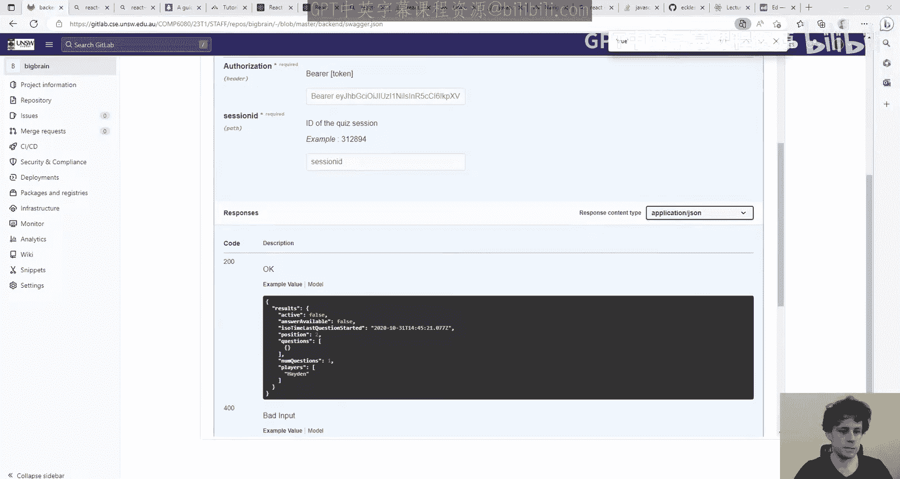