# UNSW《前端编程｜ Web Front-end Programming COMP6080 23T1》中英字幕（deepseek-R1 p67 -68-COMP6080 - Testing 🦔 Overview.zh_en -BV17RXGYuEaM_p67-

Hi everyone， My name is Hayden， I am here to present a lecture that was written by Dennis Torave from Canber。

 and it's the first of a minimum three part piece on testing。

 This first lecture is very introductory， very theoretical and broad。

 and we won't be doing any demos and it will cover a lot of ground that students who are comfortable with testing already will be very comfortable with this content。

 First part testing theory。 then there's a second lecture on work。Working with unit tests。

Like unit test， black box tests， and then there's a third lecture that's focused on working with integration tests UI tests。

 so let's get started on this first one here。So what exactly is testing。

 what types of testing are there and which of those are automated， right。

 They're kind of like the key questions that we're tackling。

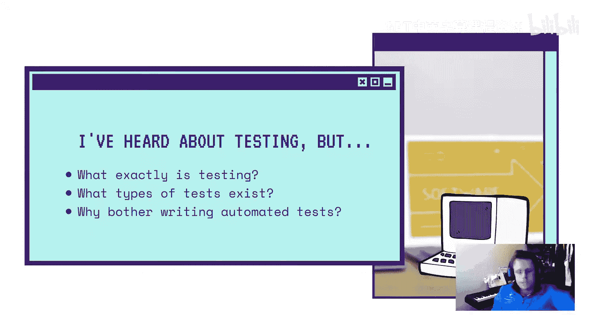

So firstly， testing is the process of validating that the software is not broken。

 there are lots of kinds of testing there's really heavily automated testing there's manual testing where you click stuff。

 but they're all about validating that the software isn't broken。

 It's not about validating that it works because remember testing is the search for bugs。

 not the confirmation of the absence of bugs for that you need to go into some other crazy depths。

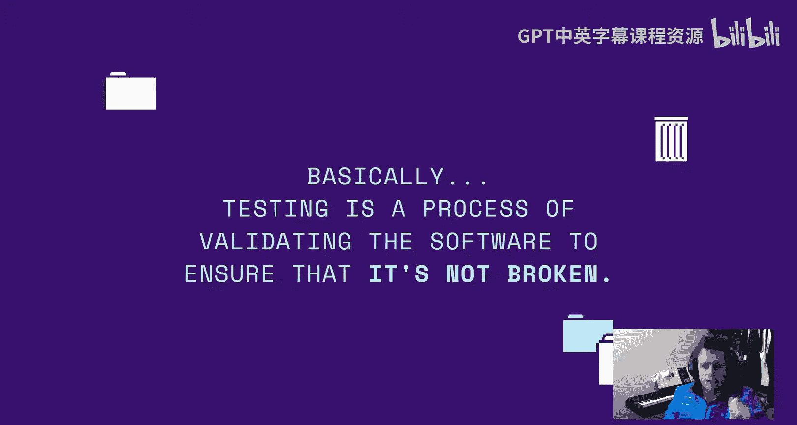

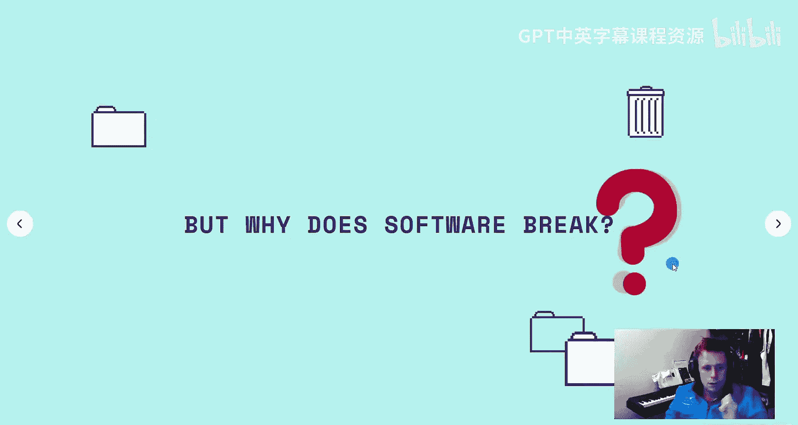

So first question， why does software break？Pretty much is's due to complexity right you can write a two line piece of code and you can manually permanently verify that it works because it's just so straightforward。

 but as software grows and grows and grows， it getslinely more complex because there's more parts they're more interconnected and more in more interconnected in complex ways。

So a big part of writing this more complex software is fundamentally a series of hacks， right。

 Like if you write perfect software， absolutely perfect software where you follow every design pattern。

 things are usually usually gonna be okay， but。The more you write software。

 the more you want to take shortcuts and do things that aren't necessarily perfect。

 A good example of that is the use context lecture， right。

 Like use context kind of undermines a fairly straightforward design pattern of things being reusable and clearly defined in some kind of。

Tree structure， but we need to do these things as a necessity of software development。

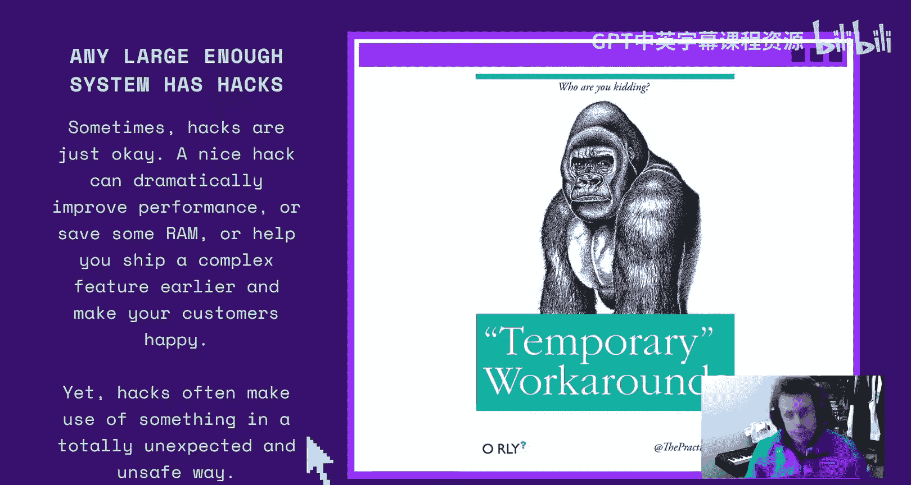

Dennis has a bunch of funny pictures in the slides that I'm not gonna comment on。

 but I think they're funny。

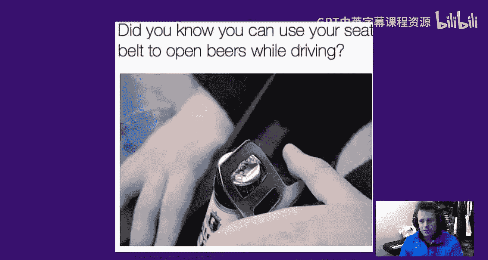

So the big problem is that we write software and we can't just say to a computer。 hi。

 here is what my software does。 make sure it works， right。

 because computers are kind of stupid in a lot of ways。

 and we need to instruct them not only how to make our code work。

 but how to make how to test that that code is working for us as well。

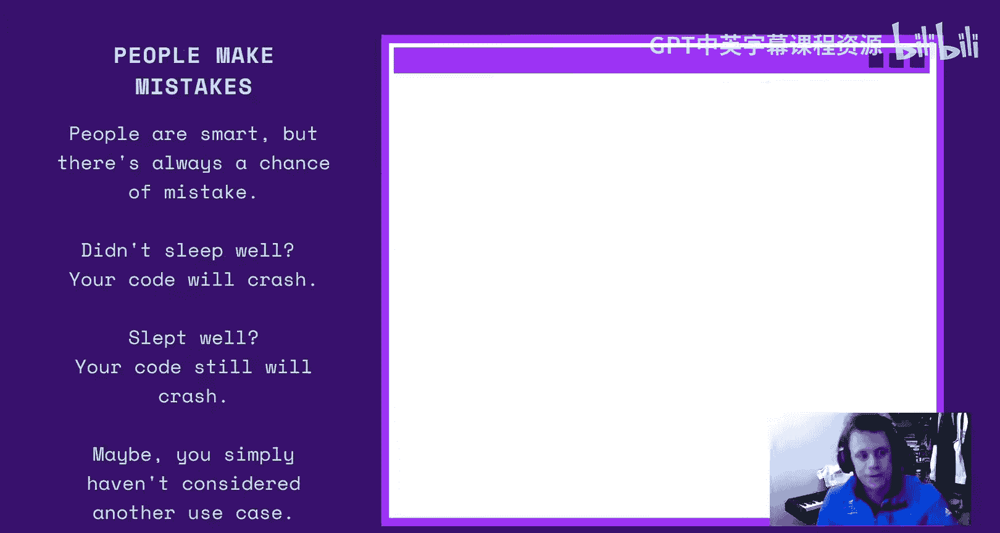

People do make mistakes， if people didn't make mistakes， software would always be perfect。

 and in that way， testing is really a lot of the time of process in trying to uncover the the flability of people。

Because people make mistakes when they write software， they forget things， they misunderstand things。

 they don't take into account other people's work。 They make poor assumptions。

There's some interesting。 You can go and Google and have it。

 There's a QR code there you can go and have a look at some crazy cases of software really causing some damage。

 Dennis has a lot of good slides here that I think are easier to read。

 but I'm gonna be skipping over a couple。So。We need to make sure that our software at both a high level and a low level behaves how we expect it to and making sure that it behaves this way is this process that we refer to as testing。

Testing really does involve a lot of work。Dennis refers to it as being a systematic and deliberate activity。

And that's absolutely true。 And in。There's lots of different types of software development。

 but in some situations with software development， people spend substantially more time writing tests than they do writing actual code。

 I remember there's a lot of cases where people work on really low level systems。

 such as in aviation and automobile development where the actual functioning of something is very straightforward。

But。The the testing is extremely extensive in comparison。

 and that varies across all different industries and different needs， but in general。

 testing is something that you can't just like do at the end。

 usually have to actively invest time into it。 and companies have to actively invest resources in it。

 That's not something you can do at 4，30 for 5 PMm。 you know， cut off。So。Buggs are inevitable。

 We write code knowing that。 Our main focus when we write code is not to avoid bugs altogether like we do our best。

 but we need to write code， test software， and then even more importantly， fix issues quickly。

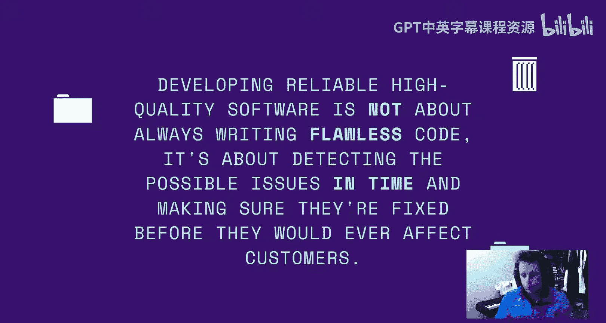

They'll often talk about， you know， keeping the build green or not breaking the build because to write this reliable software。

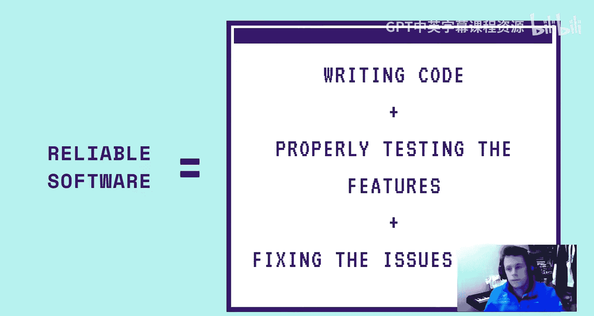

Like it's going to break sometimes you need to actually get that code back in stable， ready to go。嗯。

When we're talking about testing， we're often going to be talking about test cases and test scenarios。

 there's a few different methodologies of testing that you can research yourself。

 there's like test driven development or behavior driven development。

 which some of them focus on unitizing things of it。

 some of them focus on describing user behaviors right a little bit like how you have more sterile requirements than you have user driven things like user stories。

A test case is usually a part of a test scenario， which is an action that checks for a specific outcome。

 So a test case is often the most unitized thing you can get to。 It's like， do this。

 check if it's that。You know， you have a button。 load it。 check if it's green， something like that。

 The example Dennis has got here is when I've entered my username and password。

 the submit button gets enabled。 Very， very simple stuff。

 You probably can't break test cases down too much。A test scenario， though。

 is a set of functionality or features to verify。 it's often a little bit more high level。

 Sometimes it can begin to describe a story such as logging in with the username and password works。

 and this may be made up of a series of smaller test cases like the one we just mentioned here。

 where we say that when I've entered my username and password， the submit button gets enabled。

 This may form part of a broader test scenario。U。These things can parcel fail。And yes， yes， yes。

The point of these couple of slides of that。Testing is also really helpful because sometimes it can actually help tell the story of what we're doing It can actually form part of the user requirements generally。

 So it's kind of funny like that because if you test really well。

 you can actually understand the user journey really well。 And similarly。

 if you understand the user journey really well you can test very well because you know what to test。

 So this kind of testing and requirements， product development data tie very heavily hand in hand and you've probably done it yourself。

 you've probably written software And then as you've tested it， you said， oh wow。

 there's actually a lot there's a lot more varied ways that someone could interact with this than I previously expected。

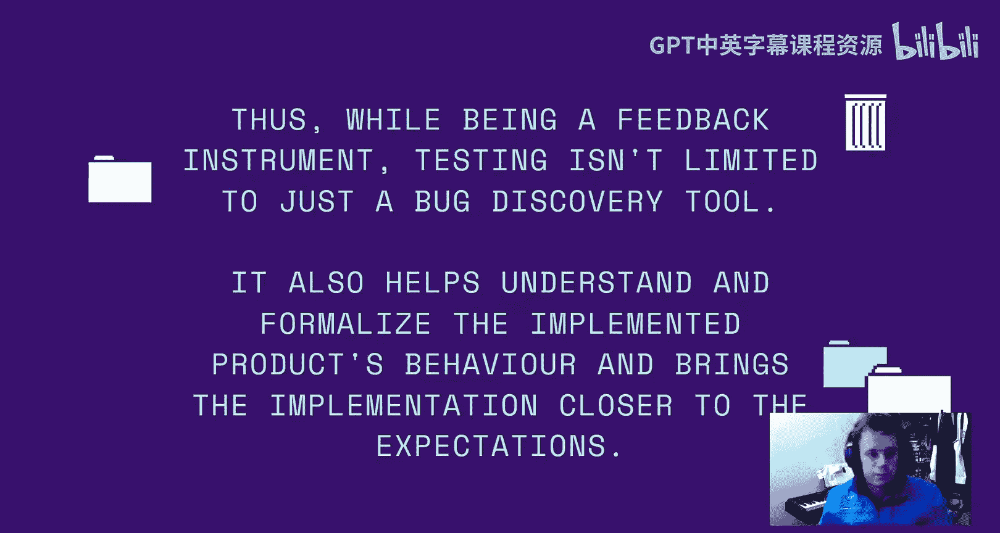

So how do we test， this's a big question right like that's what we're getting to not for this theory stuff。

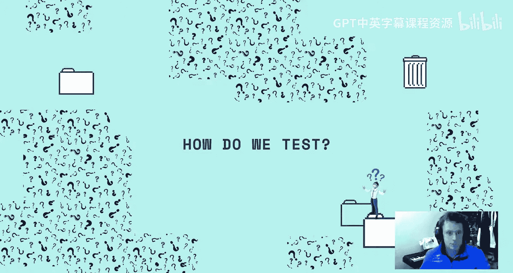

嗯。bunchunch of different ways。 The first way， which I'm sure many of you are familiar with is when you're testing。

 right， And it's how you probably have been testing your assignments so far。

 You get the software running somewhere。 Maybe it's in your web browser or somewhere else。

 And you just start clicking things and you run through your own scenarios， right。

 You might start on a page and then log in and click the next thing。

And you will kind of just maybe yourself like， tick things off。

 You probably haven't taken a that far。 but that's something you might do。

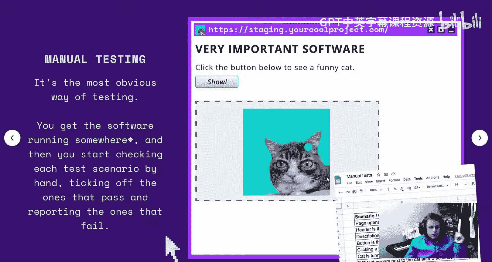

When you do manual testing， even though it's a terrible way to test it's still used generally even in larger scales。

 because it can often be used as the very last human sanity check。

 and most manual testing will happen on what they call release candidate code。

 which is essentially like the code as it's ready to be released。Right。

 so if it passes the manual test， that exact same piece of code would be pushed into production。

And typically， this manual testing sometimes referred to as user acceptance testing。Will happen。

On production like environments that are kind of isolated in copies of it。

 sometimes they'll call these staging or test servers。

 depending on the organization that dealing with it。

Manual testing is really convenient and requires virtually no infrastructure setup up。

 but it doesn't really give you very many guarantees。

 it doesn't really verify that your software works。

 what it does do is it gives you a general sense that your software kind of works or isn't fundamentally broken。

And you know this from manually testing yourself， right， you do it and you're like， it does。

 it's not， it's not。You know， et， it's fine。There might be all these little things I' missing。

 but it's not fundamentally broken。 The problem with manual testing now is when software gets really。

 really big and complex， how could you possibly test it。For simple applications， it's test manually。

 for simple applications， it's fine because the surface area is quite low。 but even if you look at。

You know building an Instagram like application， there's so many different use cases of adding things to the feed and people commenting and liking to manually test all of that would be so many different permutations of scenarios that you just wouldn't feasibly be able to do it manually。

 and that brings us to the key point about manual testing。

 which is that it does not scale manual testing does not scale， it works for simple applications。

 but as things get bigger， it's just not feasible。So we need to automate it。

At different kind of levels。The two main types of testing that we're going to be talking about are unit testing and integration testing。

 and these are two big parts of automating tests。 The first type unit testing is when you try and write tests for isolated component。

 typicallyy， if you think about react or on another declarative framework for an actual component itself like a functional component。

 Uni tests aren't interested in the purpose of the product or the behavior of users。

 their testing that an itemized component does its job because components tend to have very straightforward purposes。

 If you have a button component， it needs to maybe have a style。

 it maybe needs to have a behavior when it's clicked。That's really about it。

So we're not interested in big picture at all。Unit testing is pretty straightforward。

It's very easy to reproduce， right， because you're working with small components。

 You don't need to think about how it all ties in together。Soir。

The other thing about unit tests is that。They can be more stable sometimes because if you write a button component。

 even if the behavior of your application changes or where you want that button to go changes。

 that's more at a higher level， the functionality of your button fundamentally is still the same。

 right， Because if the specification of that component remains the same。

 particularly for a core component， then your unit test will still be particularly useful。

It's also a way of kind of building from the bottom up。 So bottom up。

 So unit testing does scale very well because as you get more and more complex components。

 you can just keep adding tests as you go。 And the main thing about unit tests that's very good is that they run very fast because they're not having to mock complex interactions or broader behaviors they just like test this test this test this test this test this maybe you have 10000 components is just test test test test test。

 Sometimes it might take seconds within a minute。 You can often do them on developers laptops。

 you don't need dedicated resources or runners or other kinds of servers and quite often for large organizations。

 they'll actually be running these unit tests on nearly every commit or as part of puller request or merge request as they get merged in。

 So that's how you can make sure that your code isn't drifting into a bad state or what's referred to here as regression regression is kind of like a movement backwards。

 So unit tests can help us discover these regressions quickly and make sure that they're fixed up。

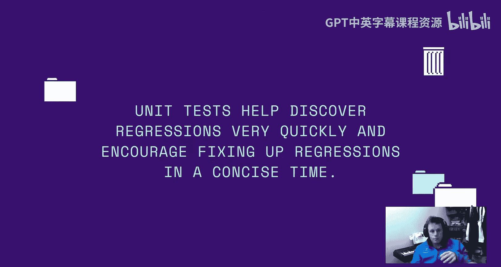

Quickly as well， because you don't want the regressionggression to kind of happen slowly until it's out of control。

 Writing unit test can be really boring because often you're like， here is a button。

 The button has this color。 The button does this clickie thing like it seems nearly benign。

What you're doing or pointless， but it's a skill that you really have to get comfortable with。

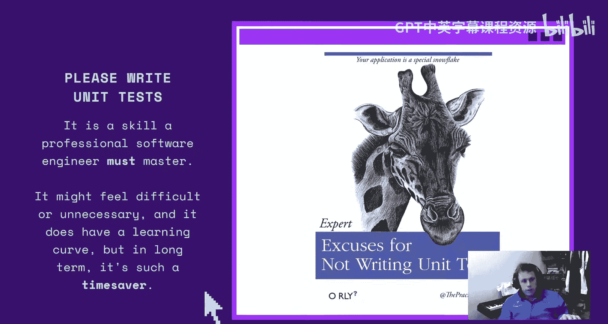

Writing good tests isn't just。Isn't just like， I'll just make any component and test it。

 A key part of testing is actually then designing the right components because if you have components that are too interdependent on others or they can't be decoupled enough。

 then it can make unit testing really difficult。 and it means that when there's code changes。

 you have to be rewriting unit tests as much as you can。

 So software design plays a big part in thinking about both components and the unit tests。嗯。Yep。

So one of the two lectures that will be after this will be the writing of unit tests。

 and another one will be what we're about to talk about next。

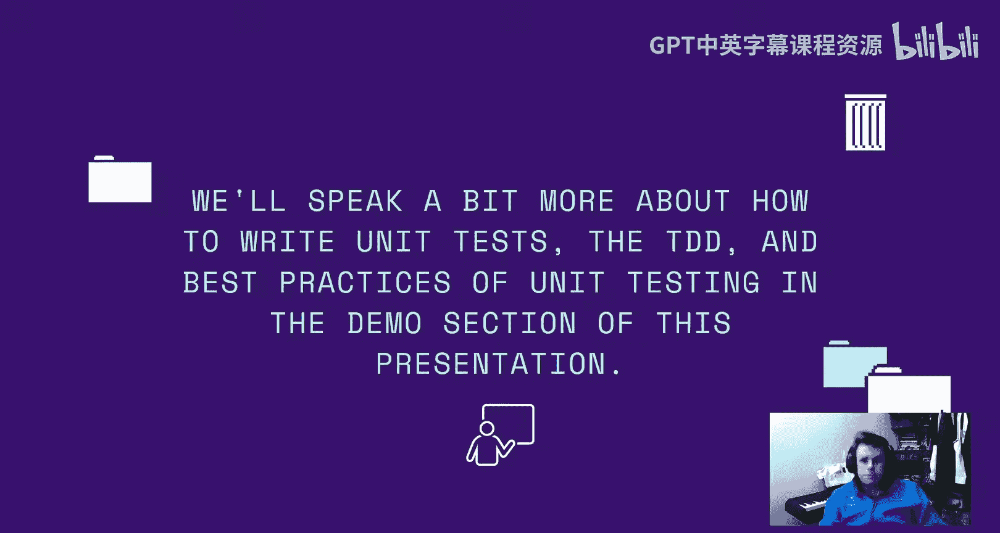

Which is integration testing。 So integration。 So unit testing helps check every component separately。

 right， the sum of the part， like it's， it's all the little parts， not the sum of it。

 how it all ties together。 But it doesn't guarantee the correctness of the application。

It says that your application， which may be working or not working。

 is made up of a series of components that all of those in isolation。Are working。

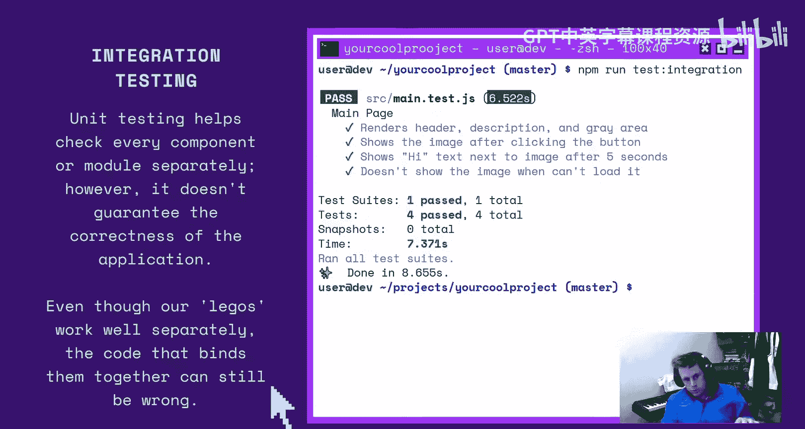

Sir。Integration tests look at a higher。 Os see。They look things at a much higher level。

 typically closer to user interactions。你。So that's good because that's what matters， right。

 It doesn't matter if all your individual components work。 What matters is that it all ties together。

 The downside of integration tests， though。They tend to be more heavy and time consuming than unit tests。

 because。To test how a series of components all work together。

You tend to have to spool up entire environments。You tend to have to create。You know。

 whether it's mock doms or real doms， it requires more resources can be slower to run。 therefore。

 it might need more custom installation。 so it's generally a bit more of a burdensome。

 even though it gets you more meaningful results。嗯。But it's necessary because if you didn't do that。

 if you didn't have these kinds of integration testings， then we run into situations。

 I think this sounds quite funny。 This is an example of two door handles that have been unit tested very effectively。

 but haven't actually been tested， how they come together right because as a door handle。

 your job might be， I need to make sure that when I'm in this angle。

 I'm locked and when I'm in another angle I'm opened。

 But from an integration test point of view and a higher level test point of view。

 The idea might be when I open one of the doors， I can get outside。And in this case。

 you're failing that test。 So I hope that gives a bit of a visual demonstration of the two。Yep。

When you do integration testing， particularly with front end。

You tend to actually be essentially interacting with a real website。

Right now that can be when I say real website。 it's like a a full series of components all connected together。

 General， I can take place in one of two ways。 One is using a real dom where you actually sppo up an entire web browser。

 maybe like a background version of Chrome or a real version of Chrome or even a deployed version of your product to a server。

 or the other ways to use a fake or programmatic dom， like Js Dom， which is a library。

 And that's kind of like a more low key way of doing it under the hood。

 can be a bit easier to get up and work with。😊，So real doms provide the most accurate result。

 just like manual testing because they're like the real thing。

 They're the closest you can get to the real thing without actually having the real thing。

 but they tend to be heavier。 They tend to be slower。

 and they also might be harder to set up in terms of the environments necessary。

 Fake doms tend to be lighter。And therefore， tests can be faster to run as well。But with fake domes。

 you're always going to miss out on some subtle things that a real dom might have。

Maybe some latency issues or maybe some edge cases of how user a click behavior works。

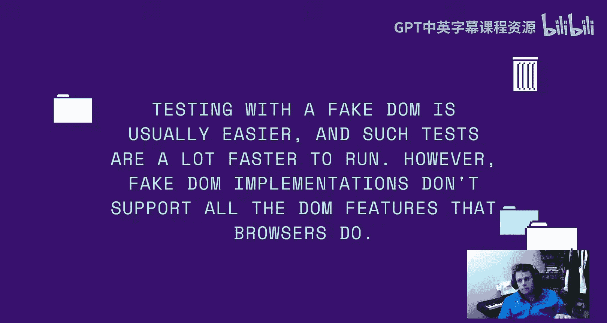

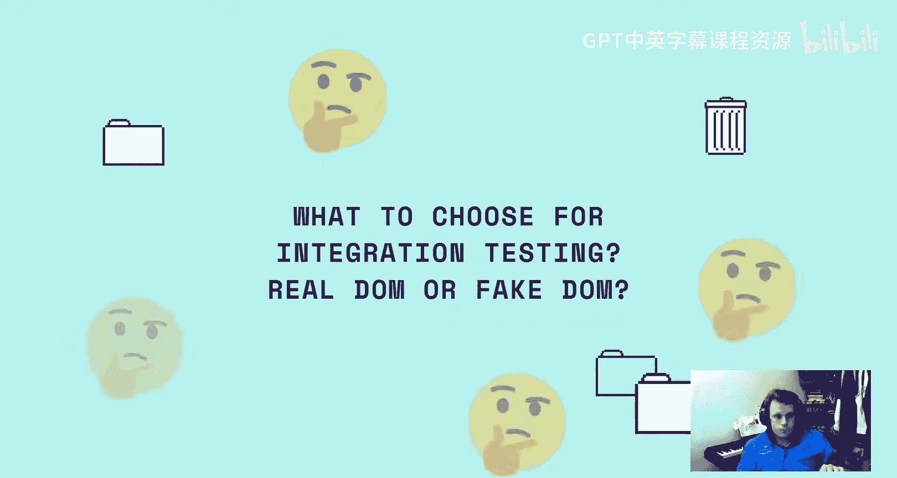

So should you use a real Dom or a fake dom， That's a great question。

 depends depends on the guarantees you want right， in many cases a fake dom will be totally fine。

 you won't need to use like a real Dom， maybe you know real Dom might be deploying to a website and then running a test server that tests on that kind of a complex setup。

But the good thing about a fake do is you don't need really a web browser。

 You just need no Js in a testing library。 So you can actually do a full integration test as if it mocks a real website and does some integration testing。

Essentially just on command line without having to spool up all these different things。So usually。

 a fake dom is going to be fine。 We'll be talking about some of these tools to do this Dom testing in the integration test lecture。

 where we'll also be talking about U I testing。 Now， U I testing is a particular part。

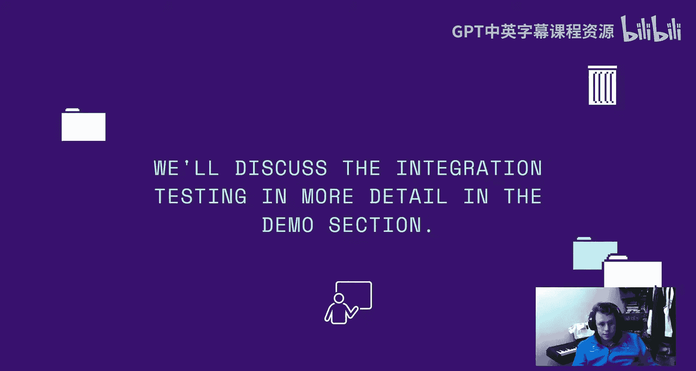

Of integration testing。 It's a subset of it。 integration testing is making sure that components work together。

 and in some ways， integration testing might not even be to do with like the user interface as much。

 know maybe you have a component that's made up of other components that all do some logic。

 but they're not really full of buttons and inputs。

 whereas UI testing is a specific part of integration testing that's actually trying to mimic the fact that a user seear page they interact with it through the keyboard on the mouse or the touchscreen and they expect some kind of visual results or other kinds of dom related actions。

 So it's really about interaction and UI testing is it's an type of integration testing where you are essentially trying to programmatically fake these interaction and certain behaviors to happen。

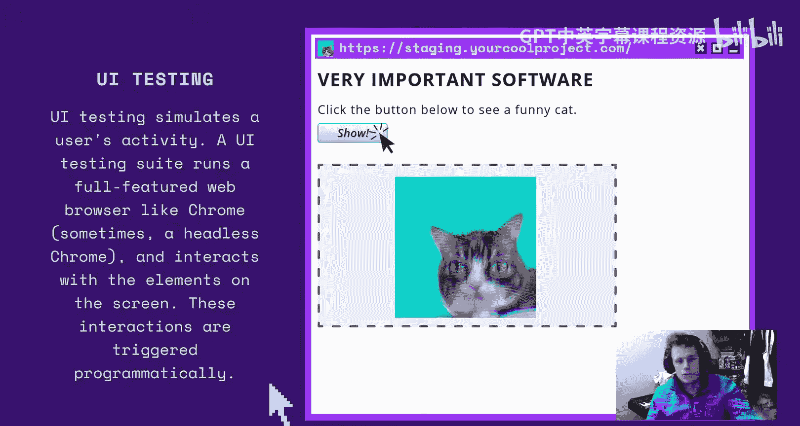

So UI testing is about running real user flows in a real web browser so it tends to be in the real dom side。

 and it's a lot like manual testing， in fact， it's trying to achieve the same thing manual testing is where a real user kind of interacts with it except we're going to do it in an automated way。

They're probably the most valuable test to write。 But as part of that。

 they are the most difficult and the hardest to maintain because they are covering a very broad spectrum of sub components。

 It means that as the individual parts that make up this big test change。

 you need to keep maintaining and refactoring your test to stay up to date with it。

 So are very challenging to maintain。So with the UI test。

 you actually have to find an element on the page by it's like selector somehow and then trigger an event on the element。

 then you wait for the UI to update， and then you have to check certain properties to make sure what update it is what you expect。

Lots of different moving pieces。 The tools we're going to talk about to do this testing are tools like Cypress and selenium。

 They help make U I testing really easy。 That's in another lecture。No matter how easy they are。

 though， they are still much harder than doing things like unit testing。They said before UI testing。

 even though it's really difficult， is absolutely key because nothing。

 nothing represents a user's interaction like it like that door handle Gif you saw before or these ones here。

 you know you have a working latch you have a working door that slides。

 but it is not achieving the purpose because UI tests tend to reflect real humans and how real humans use stuff and fundamentally the majority of products you're building for people。

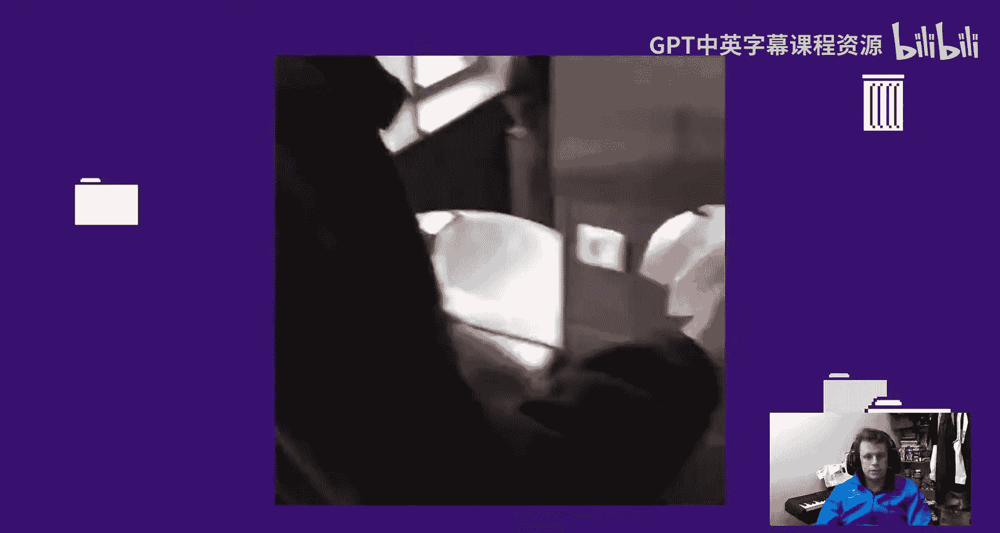

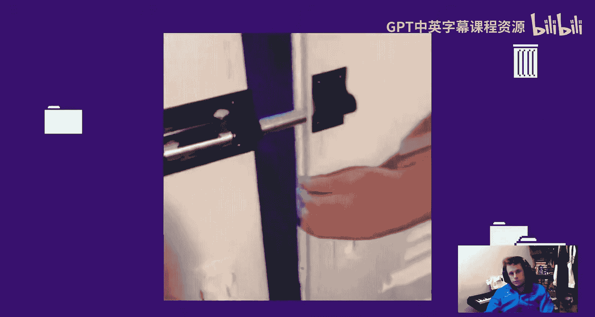

So we're going to be talking about UI testing other stuff in another lecture here is a really simple pyramid just to give you a sense of it unit tests at the bottom。

 you have the bulk of those integration tests， there's less of them and they're figuring out all those unit tests work together and then UI tests as a part of integration testing thats really focus on interacting with the DoM as if you're an actual user。

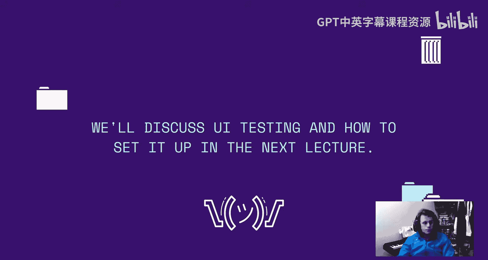

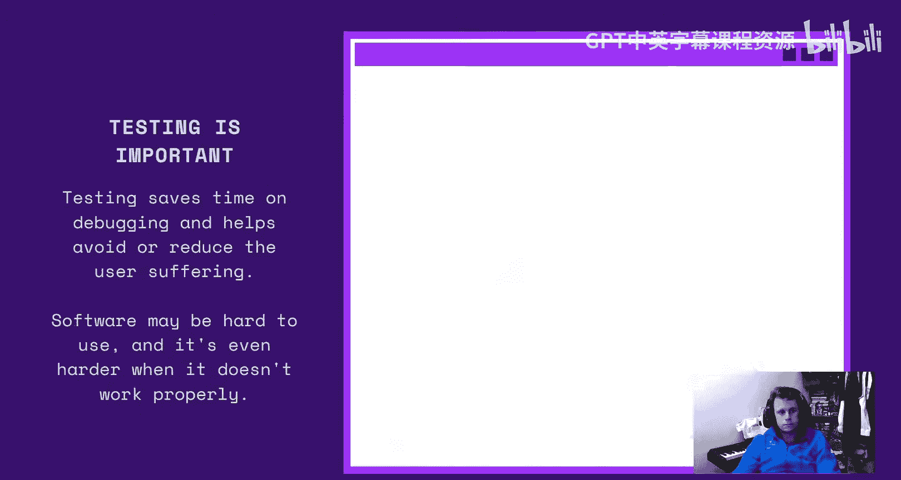

So that's it。 this slide isn't too relevant， there'll be another lecture where we go through a series of we look at a unit test and how to write unit test with react components。

