# 前端编程：第6章：浏览器自动化与UI测试 🦔

在本节课中，我们将学习关于浏览器自动化与UI测试的核心概念。我们将探讨自动化测试的重要性、不同类型的测试方法，并深入了解如何使用Selenium和Cypress等工具进行UI和集成测试。课程最后，我们将通过一个实际的Cypress演示来巩固所学知识。

---

## 测试的重要性

测试是防止软件缺陷的最终保障。它让我们能更好地理解代码，并在进行修改时避免出现“回归”现象——即新引入的代码导致原有功能出错。此外，测试实践本身就能提高代码库的质量。

从个人角度出发，我对测试持教条态度：如果任何非平凡的代码没有附带测试，那么我更倾向于认为这段代码是“侥幸运行”而非开发者有意为之。这意味着世界上有很多软件是靠运气工作的。

我们花了很多时间告诉你测试对你的代码为何重要，但可能较少提及它对你的生活为何重要。原因很简单：你们中的大多数人可能都有志于进入IT相关领域，无论是作为程序员、项目经理还是业务分析师。你很可能会以某种方式参与软件开发。

如果你在工作中不写测试，软件突然崩溃，那么你就是那个需要修复它的人。软件不会只在朝九晚五的工作时间内出问题，有时它会在午夜崩溃，或者在你约会时、与朋友外出时崩溃。根据你所在的行业、公司和问题的严重性，你可能需要立即修复它。因此，测试不仅是防止代码崩溃的护栏，也是你职业生涯的护栏。它让你能保持良好的工作灵活性和工作与生活的平衡，这一点至关重要。

---

## 黑盒测试与白盒测试

在之前的课程中，你已经学习了黑盒测试与白盒测试。让我们再回顾一下。

黑盒测试是一种测试形式，你的测试不了解应用程序是如何实现的。你的主要目标是测试行为和呈现给用户的体验。

白盒测试则是测试程序的结构。主要目标是测试可能的代码路径、可能不会对用户显现的边缘情况以及一般的程序结构。在白盒测试中，测试确实了解应用程序的实现方式。

两者都很重要，各有其用武之地，但今天我们主要关注黑盒测试。

那么，我们如何在浏览器中对应用程序进行黑盒测试呢？

从我们对黑盒测试的了解开始。在黑盒测试中，我们不知道应用程序中的代码是如何运行的，我们根据代码的输出来进行测试。幸运的是，在浏览器中，代码输出的是更多的代码——它输出DOM。因此，如果我们想在浏览器中进行黑盒测试，我们将直接针对DOM的输出进行测试。

---

## 集成测试与UI测试

现在，让我们回顾一下集成测试。你可能已经知道，但让我们刷新一下记忆。

集成测试是一种测试应用程序不同组件之间边界的方法。与单元测试（可能孤立地测试一个类或函数）不同，我们真正关心的是各个单元之间的交互。

广义上讲，集成测试不像单元测试那样廉价。它们运行速度更慢，需要更多时间来设置和编写，并且更容易出错。但这种昂贵性被其有效性所抵消。一个集成测试可以覆盖20个代码单元，因此在检测故障方面要有效得多，尤其是那些最终影响到用户的故障。

UI测试是集成测试的一种。UI测试是集成测试套件的重要组成部分，在浏览器中尤其重要。它是一种针对DOM进行测试的黑盒测试形式。UI测试通常涉及在隔离环境中模拟用户可能进行的操作，例如模拟打字、点击事件等。它们在捕捉用户最可能注意到的问题方面非常有效。UI测试可以手动完成，但也可以自动化。

---

## 何时编写集成或UI测试？

考虑到集成测试编写成本高昂，最常见的策略是从用户最常走的路径开始。我们通常称之为“快乐路径”。一个例子是你网站上的注册流程。我们可以根据如果出现问题的影响以及受测试影响的组件用户数量来做出评估。

集成测试很昂贵。因此，将时间花在编写覆盖用户不受影响或我们不太关心的领域的昂贵测试上，是对我们时间的低效利用。在这些情况下，单元测试可能足以覆盖我们的需求。

因此，我们通常从为核心流程编写覆盖“快乐路径”的测试开始。“快乐路径”是用户一切顺利时走过的路径，而“核心流程”是你的用户预期与你的应用程序交互的主要方式。例如，谷歌的核心流程是执行搜索。如果你的核心流程的“快乐路径”不工作，那么你的软件就坏了。想象一下，如果谷歌的搜索功能一直出问题，还会有人用它吗？在工作环境中，这种类型的故障通常具有最高的严重性，你可能最终需要加班来修复它。

---

## 自动化UI测试：Selenium与WebDriver

我已经决定要测试核心流程的“快乐路径”。如何编写一个自动化UI测试来覆盖这一点呢？答案在于我们模拟浏览器的能力。

在之前的课程中，我们概述了你可以使用假DOM模拟浏览器，也可以连接到浏览器的真实实例。在本讲座中，我们将针对真实的浏览器和真实的DOM进行测试。

这可能会让你感到惊讶，但所有主流浏览器都可以被自动化。你可以使用代码模拟你能想到的任何用户事件。有多种框架可以实现这一点，但今天我们先从Selenium开始。

Selenium是一个允许你自动化浏览器的项目。其核心是一个称为WebDriver的规范。WebDriver是一个最初由Selenium创建和实现的接口，它允许浏览器提供一组通用的API，供编程语言用于自动化浏览器。WebDriver过去只是Selenium的东西，但现在它已成为所有浏览器采用的标准。你可以合理地预期，任何符合W3C标准的浏览器都会提供一个使用WebDriver的接口供你自动化。

那么它是如何工作的呢？在调用层面，WebDriver通过一个驱动程序软件与浏览器通信。想象一下你购买打印机时，它会在你的电脑上安装一个驱动程序。没有那个驱动程序，你的电脑就不知道如何使用打印机。WebDriver完全一样，只不过对象是浏览器而不是打印机。因此，有一个驱动程序位于你的浏览器和代码之间，充当两者之间的代理。你的代码通过驱动程序向浏览器发送信息并接收返回的信息。

驱动程序通常是特定于浏览器的，例如Chrome有ChromeDriver，Firefox有GeckoDriver等。还有一个重要的注意事项：驱动程序必须始终运行在与它通信的浏览器所在的同一台机器上，但你的代码可以在同一台机器上运行，也可以远程在另一台机器上运行。

这展示了我所说的内容。一端是我们的代码，另一端是Firefox。GeckoDriver位于中间，来回传递信息。因此，代码可能会发送一个点击按钮的指令。驱动程序将接收该指令并将其传输到Firefox的原生API。然后Firefox将执行该操作并通过驱动程序将结果发送回来。Chrome的工作方式相同，但正如你所见，区别在于驱动程序：中间是ChromeDriver而不是GeckoDriver。

这是我之前提到的注意事项的一个例子。虽然你的驱动程序必须始终位于你正在自动化的浏览器所在的同一台机器上，但你的代码实际上可以远程执行。这意味着代码将通过网络向驱动程序发送指令，并通过网络接收返回的信息。

为什么要有这个功能？一个原因是，针对本地机器的集成测试容易出现很多配置问题。如果你的本地机器配置错误，可能会在测试中产生误报。远程执行环境更容易控制，可以使其更符合真实的用户环境。

---

## 定位器：与DOM交互的工具

WebDriver让你可以自动化浏览器，但它对测试一无所知。测试框架可以运行和执行WebDriver代码来执行UI测试。测试框架可能会包装代码，允许你在测试框架的范围内执行操作并针对浏览器验证结果。

一旦我们有了驱动程序，我们要做的第一件事就是调用`driver.get`并等待。这是等待浏览器加载函数参数中的URL，在本例中是Google.com。然后我们调用`driver.findElement`，在函数参数中，我们寻找一个具有名称属性为“q”的元素。我们等待该调用返回，然后向它发送一些按键。同样，对于每个实例，我们在这里使用`await`，因为我们调用的是驱动程序，它是一个外部代码片段，因此本质上是一个异步操作。

最后，在我们最后一次调用`driver.waitUntilElementLocated`时，我们使用`by.css`放入一个CSS选择器。在Selenium术语中，我们称之为“定位器”，它是我们能够对浏览器进行操作的基础。定位器允许我们在DOM中导航和遍历。我们总是针对DOM进行测试，因此我们需要一种方法来验证和与定位到的元素进行交互。定位器就像一个工具包，让我们能够做到这一点。

一个成功的定位器将始终返回一个可以与之交互的元素，好消息是我们有许多不同的定位器可用于不同的情况。

我们有用于CSS ID和CSS类名的定位器。我们还有一个用于标签上`name`属性的定位器，以及仅用于通用HTML标签名的定位器。我们还有一些用于链接文本和部分链接文本的便捷定位器，这使我们能够轻松找到页面中的链接。我们还有一个用于称为XPath的定位器。

XPath是一个非常强大的定位器，我想稍微详细地介绍一下。在我们拥有的众多便捷定位器中，比如CSS ID、类名和名称，如果它们都不够用，我们可以使用XPath。XPath是一种非常强大的语法，允许我们定义通过XML文件的路径。HTML与XML有足够的共同点，我们可以使用它。

这里我包含了一个XPath查询示例。它的作用是找到一个ID属性为“login-form”的`form`元素，然后从中提取第一个`input`元素，即该`form`的第一个类型为`input`的子元素。因此，你可以看到XPath非常强大。它允许我们定义通过DOM的复杂遍历。也就是说，我们拥有的其他定位器通常足以满足我们的用例，我们并不经常使用XPath。

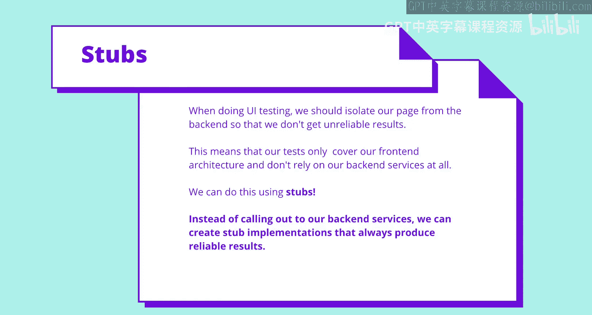

---

## 不稳定的测试及其成因

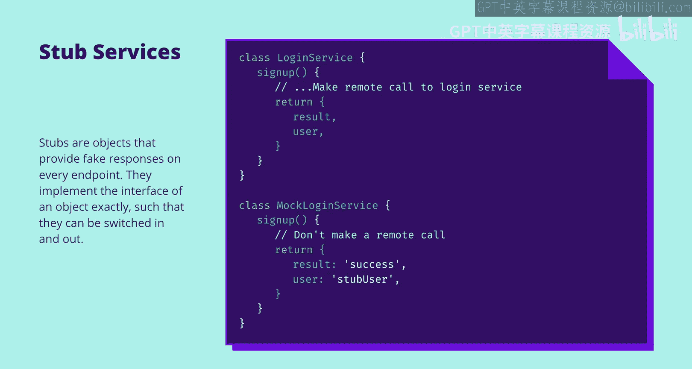

随着XPath的结束，我们现在将停止讨论Selenium，开始讨论不稳定的测试。但在那之前，如果你需要休息，需要暂停视频，伸展一下腿脚，现在是个好时机，因为下一部分与Selenium的关系稍小一些。

让我们谈谈不稳定性。如果一个测试有时成功有时失败，那么它就是“不稳定”的。出于某种原因，这在UI和集成测试中很常见。为什么？

当我们编写测试时，重要的是它们具有一个关键属性：确定性。给定相同的输入，确定性测试将始终输出相同的结果。编写确定性的UI测试可能相当困难，因为UI暴露于大量异步行为和基于时间的行为等。但非确定性的测试不是一个好选择。在本节中，我将讨论导致测试不稳定的原因以及我们可以考虑解决这个问题的方法。

我们今天要讨论的第一个不稳定性原因是，UI通常与我们无法控制的其他组件（我们的后端）进行交互。我们的许多用户流程将涉及通过网络与某种后端服务器通信。因此，如果后端服务器产生我们不期望的结果，我们的测试可能会不稳定；或者如果它花费的时间比预期长，测试也可能不稳定。

确定性测试的一个关键属性是可靠的输入，但我们这里有一个问题：我们依赖于我们无法访问或控制的其他组件。我们无法锁定它们，它们提供给我们的输入从根本上说是不可靠的。你可能会说，后端的错误或没有收到我们期望的结果是件好事。但请考虑，那些后端会有它们自己的测试。对我们页面的测试应该只测试我们的页面控制的内容。因此，如果后端出现错误并破坏了我们的测试，那并不是一件好事。

我们可以使用称为“存根”的东西来解决这个问题。其思想是，在我们的测试环境中，我们不调用远程后端服务，而是创建后端服务的存根实现，这些实现将100%产生可靠的结果。存根是一个实现另一个对象接口的对象。然而，该实现返回一个虚假的响应。其思想是，存根可以与真实对象互换而不会造成中断。

这里我们有一个模拟或假的登录服务。真正的登录服务进行远程调用，但假的登录服务不这样做，只提供模拟信息。通过使用存根，我们可以确保测试环境中的后端服务始终返回相同的结果，为我们的测试提供确定性的输入。

另一个需要注意的是，你可以看到测试如何普遍促进良好的代码。存根的存在意味着我们需要将远程代码封装在某种类或函数中。我们今天没有时间详细讨论，但我只想提一下“依赖注入”这个词。

所以我们有了这个存根服务，它不再针对我们的真实后端进行测试。但你会说，等等，集成测试不是应该测试我们应用程序组件之间的边界吗？最重要的边界难道不是前端和后端之间的边界吗？如果那个边界失败了，其他一切都会崩溃。你说得对。但首先，确保我们的前端组件之间良好地交互更为重要。端到端测试是我们可能用来测试前端和后端之间边界的一种测试形式，它有一套自己的最佳实践。

下一个导致测试不稳定的原因是随机性或熵。例如，一个随机数生成器在不同的测试运行中产生不同的结果。你可能认为这不太可能，但考虑一下Java中的日期模块，它是基于时间的。如果你的应用程序基于日期和时间进行计算（这非常常见），而你的测试试图验证这些计算，你可能无意中创建了一个不稳定的测试。我们可以再次通过使用适当的存根，或者只是更小心地编写处理这些情况的测试来解决这个问题。

为了强调这种情况比你想象的更常见，我遇到过一些情况，测试在一天中的特定时间（例如上午10点）会失败。下一个导致不稳定的主要原因是性能。UI测试在浏览器中进行，这意味着影响浏览器的条件会影响测试的可靠性。你的浏览器可能受到CPU处理能力、内存分配或带宽的限制。例如，在你的手机上渲染页面可能比在你的定制游戏PC上花费更长时间，这确实会影响我们的测试。

考虑这个图表。顶部是我们的浏览器，它正在过渡到不同的UI状态。底部是我们的测试用例。在每个阶段，我们执行一个操作，然后验证浏览器的状态。我在每个浏览器过渡和每个测试用例之间放了一秒钟，所以测试用例和浏览器彼此一致。在这种情况下，浏览器不受节流、内存问题或慢速连接的影响，因此测试通过。

在这里你可以看到，浏览器到达第二个UI状态（带有星星）花费了更长时间。不是一秒钟，而是1.5秒。这可能是由于CPU节流造成的。测试用例仍然在一秒后运行，但浏览器状态还没有达到需要的位置，因此测试失败。这是否意味着我们的功能有问题？不，当然不是。代码仍然是正确的，但浏览器的性能导致测试对我们不稳定。

那么你可能会问，为什么我们不能等到浏览器渲染出星星后再验证它呢？嗯，我们正在进行黑盒测试，所以我们真的不知道要等待什么。不幸的是，对我们来说，浏览器性能问题更难解决。它们可能有多种原因和多种解决方案。

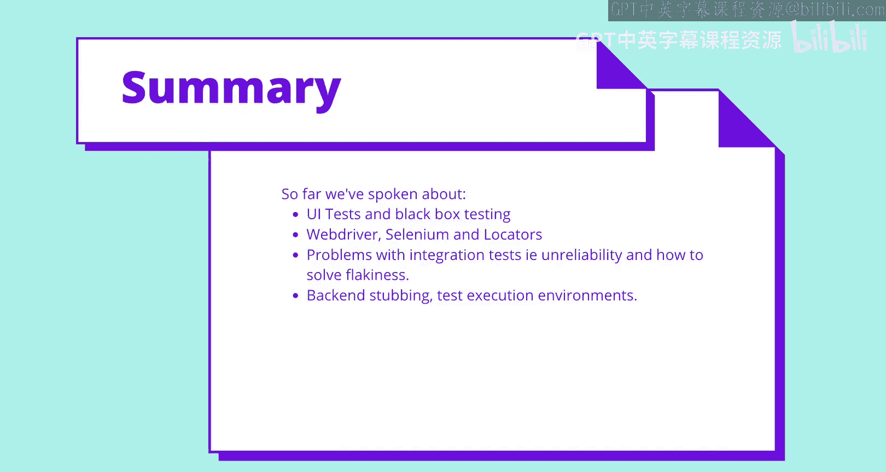

这里有一些我们可以调整的常见杠杆来改善我们的性能问题。第一个是超时。Selenium中的每个测试步骤都可以提供一个超时阈值，超过该阈值测试将失败。这为我们提供了一些时间来等待浏览器跟上。如果一个测试步骤持续失败，你可以增加该测试步骤的超时时间，为渲染发生提供更多时间。不过要小心，如果你对每个测试步骤都这样做，突然之间你可能有一个需要30分钟的测试。最好只在绝对需要时才使用超时。

我们还可以查看执行测试的环境。如果它们没有正确的资源或处于不一致的状态怎么办？例如，你可能在一台性能很差的机器上运行测试。如今的浏览器很昂贵，它们占用大量CPU和内存，所以请确保你的执行环境能够承受。

最后，另一个导致不稳定的原因不幸的是位于代码和浏览器之间的驱动程序本身。Safari就是一个很好的例子。Safari有一个相当不一致且不可靠的驱动程序，即使你的代码正确，也经常导致测试失败。最后，忽略“重试”这个简单的解决方案是不对的。这听起来很蠢，但有时最蠢的解决方案就是为你解决问题的方案。

---

## 实践：使用Cypress进行UI测试

到目前为止，我们已经讨论了UI测试和黑盒测试，了解了Selenium和WebDriver，讨论了集成测试的不稳定性，并谈到了通过性能、后端存根等方式解决它的方法。现在我们将继续进行一些实际示例。再次提醒，如果你想休息一下，现在是个好时机。

今天在我们的实践部分，我们将使用一个框架为我之前编写的示例应用程序编写一些自动化UI测试。我们今天将使用的框架叫做Cypress。它旨在使自动化UI测试更容易，通常用于端到端测试，但也可用于集成测试。

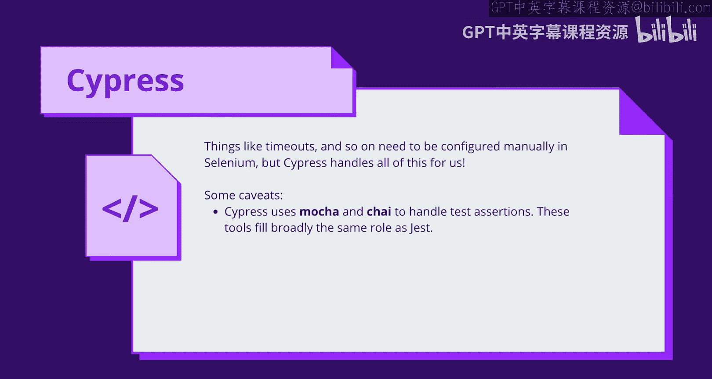

现在，Cypress不是一个基于Selenium的框架，但不要因此认为过去的10分钟是浪费时间。那么，为什么花所有时间教授Selenium的架构，而示例却不使用它呢？Cypress仅限于JavaScript实现，而Selenium是语言无关的。这使得Selenium非常常用。但不幸的是，由于驱动程序等原因，它更难配置。不过，我们讨论的广泛原则将始终适用。你总是需要使用某种定位器。你总是需要编写确定性测试。你总是会有一个执行环境，无论是本地的还是远程的。你总是会面临浏览器性能问题。所以相信我，你最终会在某个时候接触到Selenium。

幸运的是，我们不需要在Cypress的理论或架构上花费太多时间，因为Cypress真的很容易上手。它由两部分组成：一个测试运行应用程序和一个用于查看测试的仪表板。它为你做了很多设置工作。它为你处理超时。它截取屏幕截图。最重要的是，它真的很容易配置。也就是说，也有一些缺点。Cypress仅支持使用JavaScript创建测试用例，并且在撰写本文时，它不提供对Safari或Internet Explorer等浏览器的支持。因此，Selenium可能更难设置，但它要灵活得多。现在，正如我之前提到的，像超时这样可以帮助减少不稳定性的东西，通常在Selenium中需要手动配置，但Cypress为我们自动处理了所有这些。

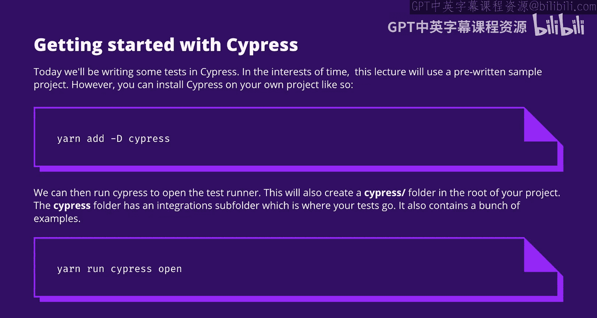

最后一个注意事项：你可能在之前的课程中见过或学过Jest这个框架，它用于我们的单元测试。Cypress不支持Jest。不幸的是，它支持一个叫做Mocha和Chai的库。它们基本上和Jest做同样的事情，但它们比Jest早了好几年。

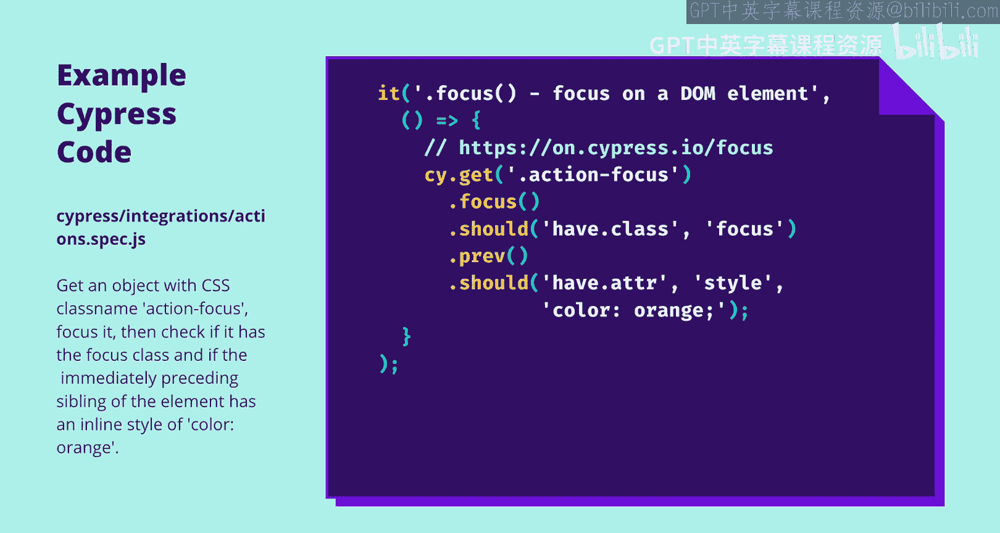

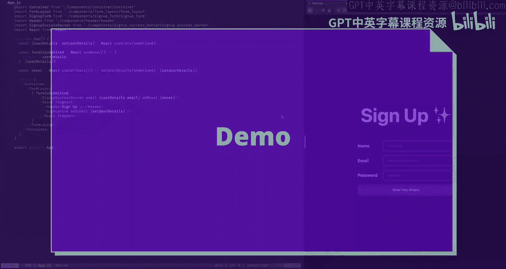

---

## Cypress演示：编写一个注册流程测试

让我们开始吧。今天我们将用Cypress编写一些测试。为了节省时间，我预先编写了一个应用程序，它将在Gitlab上提供。不过，你可以使用`yarn add cypress --dev`命令轻松地将Cypress安装到你自己的项目中。然后我们可以运行Cypress来打开测试运行器和仪表板。第一次运行此命令时，它将配置Cypress并在项目的根级别创建一个`cypress`文件夹。执行此操作的命令是`yarn run cypress open`。当你运行此命令时，还会看到一个浏览器窗口弹出，那就是你的仪表板。

当你首次配置Cypress时，`integrations`文件夹内有许多示例。这个特定的示例获取一个CSS类名为`action-focus`的对象，然后尝试聚焦它。如果聚焦了，它将尝试查找类名并验证该类名是`focused`。然后，它将查找该元素紧邻的前一个兄弟元素，并检查其内联样式是否为`orange`。Cypress附带的示例文件夹充满了非常有用的示例测试，应该能帮助你入门。

好的，演示时间到了。

我这里有一个示例应用程序，它只是一个简单的注册流程。它接收姓名、电子邮件和密码。当我提交时，会播放一个很酷的动画。闪烁的只是一个图标。实际上，那里有一个返回按钮，可以带你回到注册表单，你可以看到它要求你检查你的电子邮件。

关于示例应用程序的一个注意事项：这里没有后端服务交互。你可以看到在我的`package.json`中，我已经安装了Cypress。我还安装了`styled-components`，你可能还记得我们在CSS-in-JS讲座中提到过它。还有一个叫做`framer-motion`的库，我们没有讨论过，但它处理快速简单的动画。

在应用程序的顶层，我们有两个容器组件，我们还在一个钩子中设置了一些用户详细信息。有一个变量存储表单是否已提交，还有一个重置回调将我们的用户详细信息设置回空。你可以看到，根据表单是否提交，我们要么显示一个横幅，要么显示一个标题和一个注册表单。

示例应用程序有一个`components`文件夹和一个`hooks`文件夹。在`components`文件夹内，我们有许多仅用于展示的组件，比如我们的布局、容器。其中大多数只是普通的样式化组件。例如，按钮映射到你在注册表单中看到的按钮。你可以看到我们的根容器只是一个样式化的`main`组件，它是一个flex布局。我们的标题也只是一个样式化的`H1`标签，只是为了格式化得好看一些。但大部分逻辑存在于我们的注册表单组件中。

这是注册表单组件。你可以看到它保存着一些映射到我们表单的状态片段。我们有姓名、电子邮件、密码各一个。我们还使用了一些钩子进行空值验证和电子邮件验证，我稍后会介绍。在所有这些过程中，我们还有一个计算出的`readyToSubmit`函数，它只是检查我们所有的表单详细信息是否都已正确填写。如果是，那么在提交处理程序中，我们调用`onSubmit`回调函数，它是一个属性。你可以看到，因为我们使用表单，所以我们必须阻止表单的默认事件。有更好的方法来解决这个问题，但由于这是一个示例应用程序，我们只想要一些快速而粗糙的东西。所以我们用包含姓名、电子邮件和密码的对象调用`onSubmit`。这是在我们的表单中调用的回调函数。

表单本身只是一个简单的表单，中间有一个布局组件和三个文本输入组件，这些样式化组件与我展示的标题或容器相同。这里的按钮在未准备好提交时被禁用，如果准备好提交，则显示提交文本，否则会提示你输入详细信息。请记住，每个文本输入也有一个名称属性，我们有姓名、电子邮件和密码。

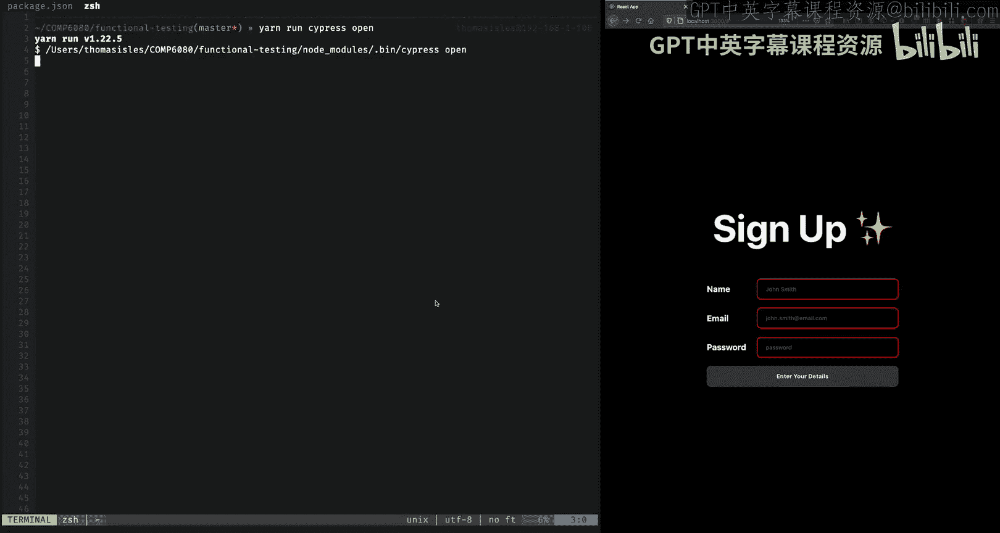

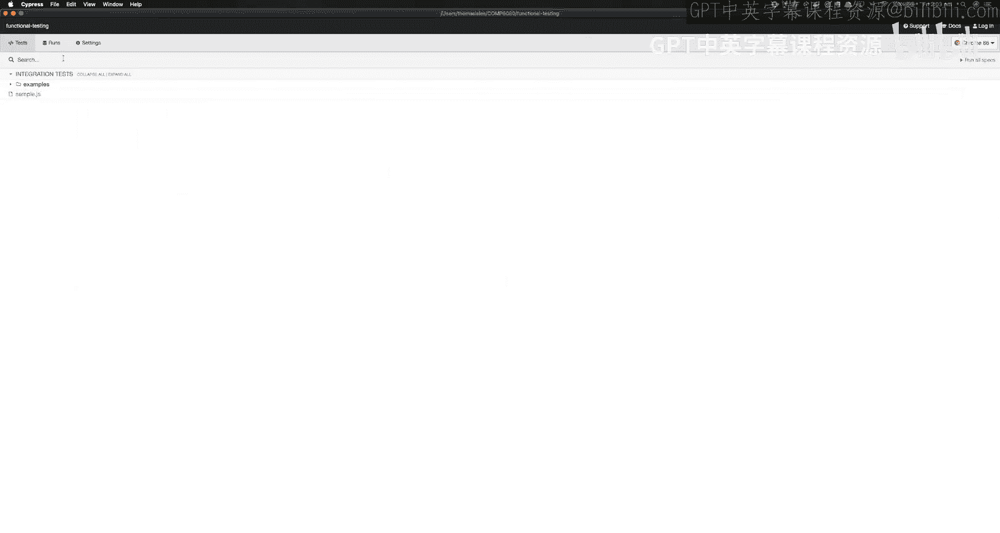

在我们的钩子中，我们的空值验证钩子只是我们自己编写的一个钩子，它所做的就是检查字符串是否不为null、undefined或空。电子邮件验证是一个电子邮件正则表达式测试，它只是检查字符串是否具有与电子邮件相同的格式。不要太在意正则表达式，它看起来很复杂，我从Stack Overflow上得到的。你可以看到，除非你把它变成电子邮件格式，否则它是无效的。

让我们打开Cypress。

好的，我已经运行了Cypress，虽然花了一些时间，但它确实打开了。你可以看到这里有一个JS文件列表，这些文件对应着测试。

回到代码，当你第一次运行`cypress open`时，会创建一个`cypress.json`文件用于配置。目前它是空的，因为我们还没有配置Cypress，我们只是依赖默认设置。还会创建一个`cypress`文件夹。里面有四个子文件夹，但我们关心的是`integration`。现在，如果我打开它，里面有一个`examples`子文件夹，没有其他东西。这是你存储测试的地方，你可以看到Cypress很贴心地添加了一个示例测试列表，可以帮助你入门。

接下来我要做的是在Cypress的`integration`文件夹内创建一个子文件夹。我将其命名为`my-tests`。在里面，我将创建我的第一个测试文件。我犯了个错误。好了，这就是我们将要编写测试的测试文件。

我们要做的第一件事是创建一个`context`。这有点像Jest中的`describe`，就像是你需要编写的所有测试的父包装器。然后我们将插入一个`beforeEach`钩子。这将在每个测试之前运行代码，你可以看到我们在这里调用`cy.visit`。`cy`是Cypress API的包装器，我们说要访问`localhost:3000`，这是我们本地React应用程序运行的地方。我现在要写一个测试，它将是一个成功的注册测试。这是我们的核心流程，我们正在测试“快乐路径”。

首先，我要定义一些常量。这些是我想输入到注册表单中的值。现在我有了这些值，可以开始编写测试了。`cy.get`函数允许我传入一个定位器，类似于我在Selenium中使用的定位器，但在这里我说我想要一个名称等于字符串“name”的输入。所以这应该找到我的名称文本输入，即具有名称“name”的文本输入。

进入我的文本输入组件或我的注册表单，首先，你可以看到我的文本输入组件有一个名称“name”。所以它应该获取这个输入。它们以这种方式链接在一起。文本输入组件接受一个`inputName`作为属性，但它只是将其传递给一个样式化的输入组件，所以我们知道当它输出到DOM时，它将是一个`input`标签。

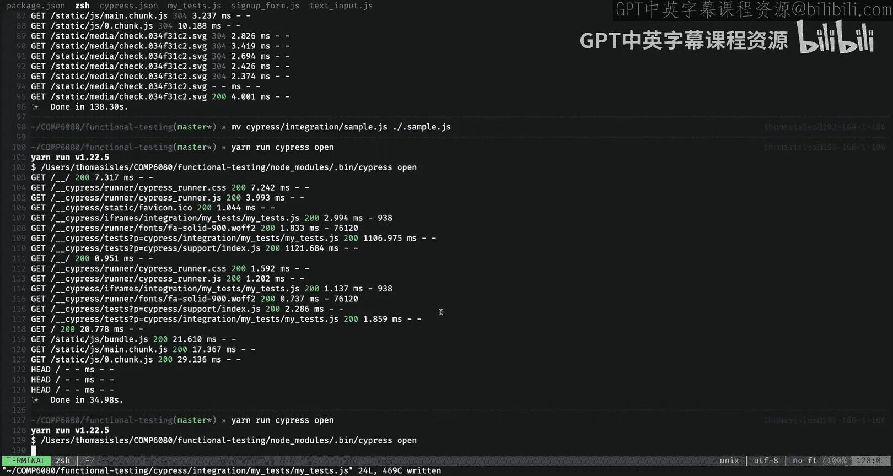

我要做的第一件事是聚焦这个标签。现在我可以开始输入了。所以我需要做的就是输入我的姓名变量。我可以为接下来的两个输入标签做同样的事情，它的功能完全相同。在这个例子中，我打算将电子邮件变量输入到我的电子邮件输入中，名称属性为“email”，我也会为我的密码做同样的事情。

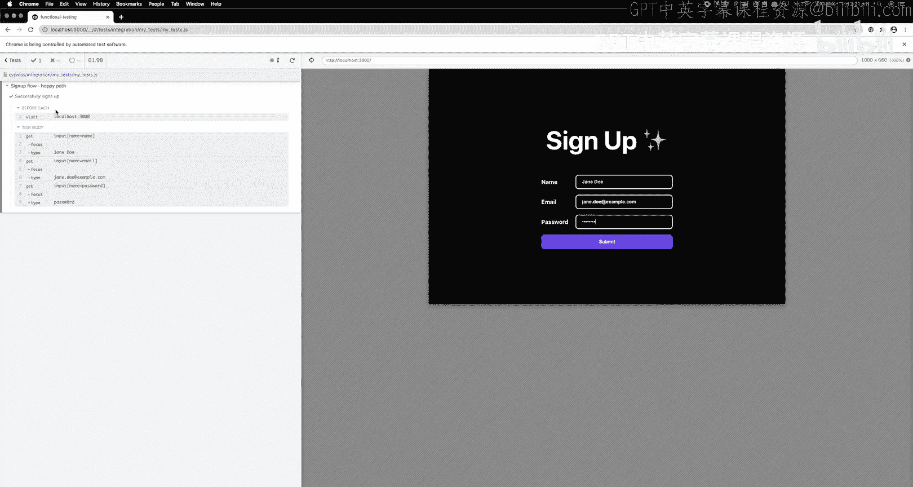

现在完成了，让我们再次运行Cypress测试运行器，尝试运行我们的测试，看看会发生什么。

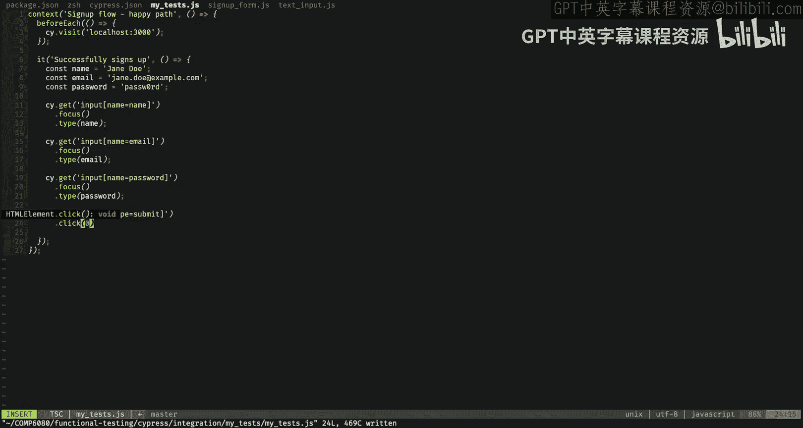

所以我们等待它加载。好了。所以我们这里有一个`examples`文件夹，我们还有一个`my-tests`文件夹，我打开了它，里面有一个`my-test.js`文件。如果我点击它，它将运行测试。你可以看到速度有多快，但你可以看到它已经按照我们的要求输入了Jane Doe姓名、Jane Doe电子邮件和密码。

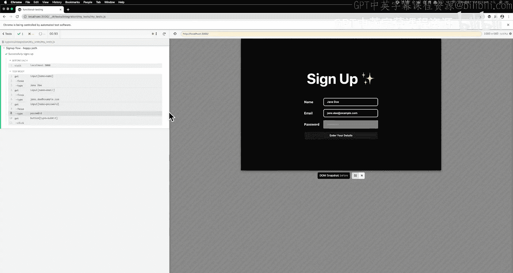

让我们扩展我们的测试。首先，我们将通过获取一个类型为“submit”的按钮来扩展它。然后我们将在其上模拟一个点击事件。

好的，让我们测试一下这个。我可以点击这里运行所有测试，你可以看到按钮被点击了，并按计划显示了注册成功横幅。不过，除了在屏幕上看到它之外，我们并没有真正的方法来验证成功是否正确，这在技术上是一项手动任务。我们不想监督我们的集成测试，所以我们需要做的是验证表单是否成功提交。

在这里，我有我的注册成功横幅组件，你可以看到有一堆样式化组件。有一个`div`的包装器，还有我们的标题文本，就在中间那里，它有一个`data-test-target`属性，叫做`caption-text`。在代码中，它写着“check your email”并输入我们的电子邮件。所以我们在这里使用了一个`data-test-target`属性。这是一种能够快速定位DOM中元素的方法。通过传入一个仅用于测试的自定义属性，我们通常不推荐这样做。如果你能使用CSS类名会更好，但我们使用的是样式化组件，它为我们处理CSS类名。使用`data-test-target`的风险在于，你的应用程序编码方式的细节会泄露在DOM中，因此`data-test-target`将对用户可见，所以如果可能的话，不建议这样做。

所以我在这里做的是，检查任何具有属性`data-test-target`为`caption-text`的标签。我期望里面的文本包含我的电子邮件字段。所以这将执行，它会在我的标题中找到，并检查文本中是否包含电子邮件。

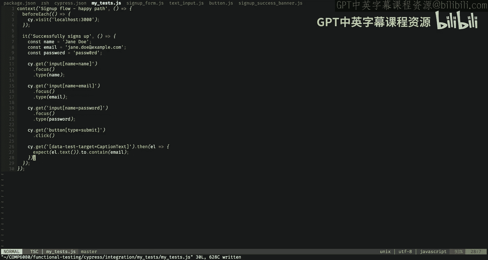

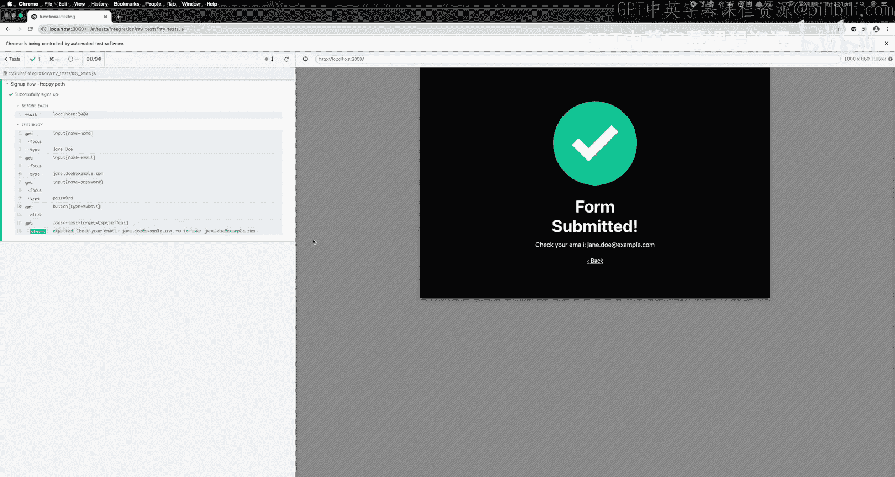

如果我运行测试，你可以看到断言通过了，因为电子邮件包含在那个文本字段中。所以我们有一个成功的测试。

在我们结束之前，我只想重申一下在这里使用`data-test-target`的理由。`data-test-target`是一个自定义属性，在这里用于让我们能够非常容易地获取文本。但一般来说，这不是一个好主意，因为它向用户暴露了你测试的某些方面，这通常不是你真正想做的。通常你可以使用其他属性，比如如果你想获取链接，你可以使用`href`、类名，ID是一个非常好的选择。但是因为我们使用的是样式化组件，我们实际上并不控制这些，因为这是我们不知道的实现细节，所以在这个例子中我们使用了`data-test-target`。但一般来说，你应该有其他可以使用的属性。

无论如何，演示到此结束。在其中，我们为示例应用程序的“快乐路径”创建了一个成功的自动化UI测试，所有代码都在GitHub上，如果你需要查看的话。

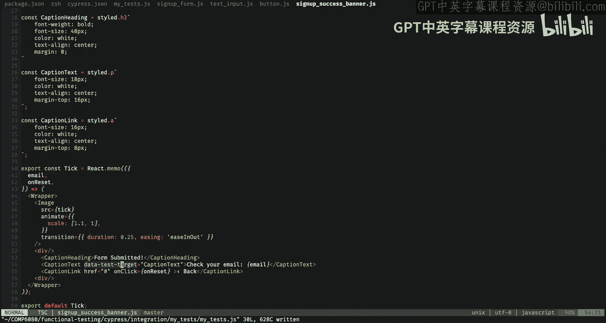

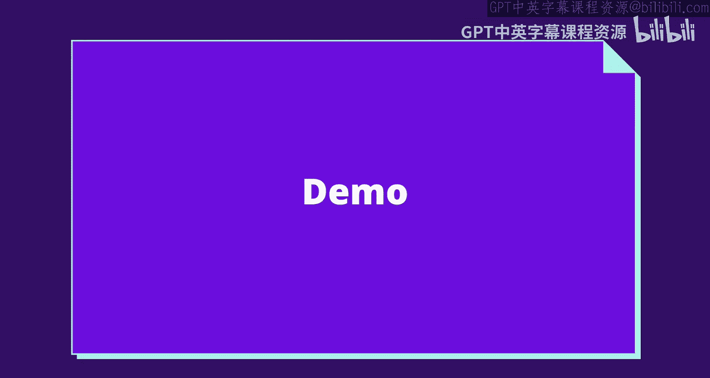

---

## 行为驱动开发简介

在我离开之前，还有一件事我们需要涵盖，那就是关于“行为驱动开发”的一点说明。你会在各处看到它，如果不谈论它，谈论集成测试会感觉不完整。BDD是一种开发方法，旨在鼓励开发人员、测试人员和业务人员形式化对应用程序工作方式的共同理解，并且它有自己的语言。我们有“场景”这个概念，然后你概述一个预先存在的条件，比如“Given”，以及之后你可以用“And”指定的一组条件。“When”条件是动作开始发生时，“Then”应该是验证。所以你有这样的概念：设置一个上下文，说明当某事发生时，那么另一件事应该发生。它通常用作编写自动端到端集成测试的接口，以一种业务人员可以理解的方式。这是你可能会遇到的东西，它在像Robot Framework这样的框架中相当流行，该框架使用这种语法来定义自动化测试，尽管从广义上讲，开发人员仍然需要编写将这些测试粘合在一起的代码，所以从这个角度来看，它在实现“业务人员将开始编写自动化测试”这一理念方面有些失败。开发人员仍然在做这件事。你可能会发现自己也在做，但这是一个很好的注意事项，你可能会在讲座中看到它。

---

## 总结

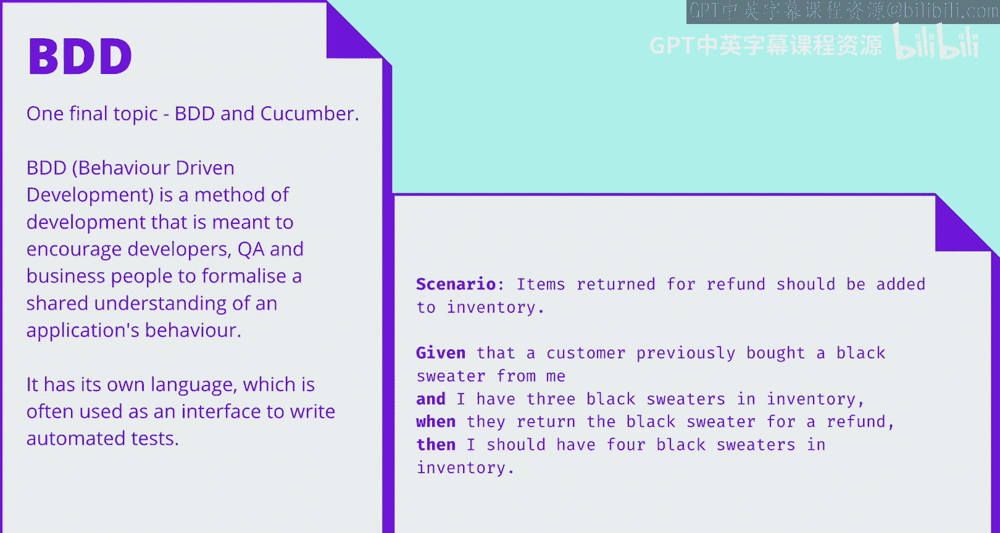

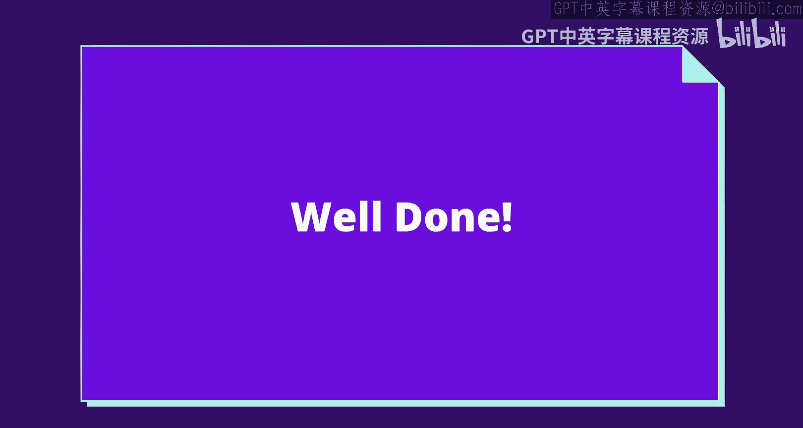

本节课中，我们一起学习了浏览器自动化与UI测试的核心知识。我们从测试的重要性开始，区分了黑盒测试与白盒测试，并深入探讨了集成测试与UI测试的概念。我们了解了如何使用Selenium和WebDriver进行浏览器自动化，认识了各种定位器，并讨论了导致测试不稳定的常见原因及其解决方案。最后，我们通过一个实际的Cypress演示，动手编写了一个自动化UI测试，覆盖了示例应用程序注册流程的“快乐路径”。希望这些知识能帮助你在未来的开发工作中编写更可靠、更健壮的测试。