# UNSW《前端编程｜ Web Front-end Programming COMP6080 23T1》中英字幕（deepseek-R1 p71 -72-COMP6080 - Live 🚀 Week 10 - Exam.zh_en -BV17RXGYuEaM_p71-

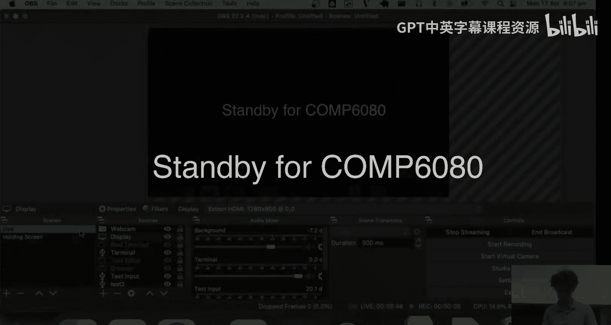

Test test。 Ho。 Oh my god。Okay。Hi。18 people。 congratulations for surviving。Is anyone。

 is this anyone's first inper lecture for the term。Yeah， your first one。Good job， congrats。

You've come at the right time。 It's where things get really fun， so。😊，No， seriously。 Thank you。 I。

 I see familiar faces。 I know I don't know names everywhere， but like I， I， I see faces。

 one of the problems with teaching is that I actually know a lot of your names because。You know。

 a bunches of you email me or if you've ever emailed me or post on the forum。

 I've like seen your name and would recognize your name。 And then I see all your faces， too。

 And it's really upsetting because students come up to me and they're like， you know， I'm so and so。

 And I'm like you're two different people to me that are like completely unrelated。

 And I have to like， join that together。You know， like， there's a girl in the course called Chelsea。

And Chelsea's emailed me like a bunch of times。 And I have no idea what Chelsea looks like。

 And Chelsea would come up to me and be like， hi， and I'll be like， hi， who are you。 And like， oh。

 I'm Chelsea。 I'm like， oh， yeah， that's exciting。 So if that ever happens， you know。😊。

Thank you for your patience with me。Today is a really easy lecture， because it's short。 frankly。

 we don't have a ton to talk about where usually these lectures are like。

45 minutes depends on the kinds of questions people have。

 It's particularly relevant to postgrad students because this will probably be your first time doing an exam with me for people who are undergrads and have done like 1。

5，3，1 with me， it'll be pretty similar because I generally run my exams in like the same rules about so。

Realistically， like half to two thirds of what I talk about will be like refresher content to you and not new content or anything like that。

 How many people do we have in the live stream， Let me see。15， amazing。Well。

 first question I have though before we get started。Why you all here。

 Have you finished to assignment 4， or are you like not started or。Are you taking a break？

Already at uni， who's， who's who's doing it right now。Yeah。

 a couple people who plan to not be doing in the lecture and is now doing him in the lecture。Yeah。

Some， no doubt。 Well， there's， there's tons of people who obviously are still working on it。

 And then what I said in the notice last week， like。

 I'd like to congratulate students for getting on top of it。

 It really felt like people really sunk their teeth into this one much more so than normal。

 like assignment 3， the lurk for work things people seemed to start at roughly about the same time。

 I expect。 But I got like completely crushed by questions in week。😊。

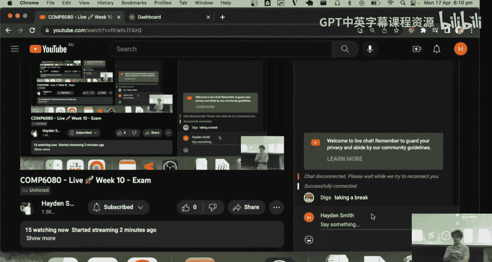

7even or whatever it was。Yeah， week 7， when we released the assessment。

 people were just like on the forum asking questions， trying to get set up。

 So if you're someone who's been working on this since that week 7 week weekend， congratulations。

 I think that's an extreme display of educational discipline。 But also。

 I hope it's been helpful for you Who's had who's had a fun time with assessment for。😊，The react one。

Okay， he's had a bad time。We're going need some middle grounds here。Yeah。

 give me some other adjectives。Post in the chat， people online too。Intolerable， all tolerable。Okay。😊。

I never realised how tolerable and intolerable are both pretty negative and different degrees。

 Tolerable is much better than intolerable， though。 So， okay， digestible， tolerable。 That's good。

 sorry。狼。Does it feel longer than look for work。Really， so you found that assessment 3。

 it was like that。 And this one took you a long time。 That's super interesting。

 because I find most students don't have that experience。😊，But did you work alone for assessment 3。

Okay， maybe that， maybe that helped as well。 This， so what has and I'm。

 I'll be finish with the Q And A soon。 What's been the， the， is it the challenging part。

Doing the work。 or is it like figuring out like how to do something Like， I wna get the， you know。

 the path name。 and I don't know how to find it。まか。So they got distracted a lot。

 doing little tidbits。Yeah。Yeah。That's quite interestingcause like， that makes sense mentally，cause。

 you know， with， with assessment 3， you've just got nothing to work with。需要。Yeah， sure。 that'。

 that's fair。 Has anyone else found that that kind of jumped to react a little bit like。

Mind melting with all the states and the refreshes and stuff。Has anyone who's found。

 and I know none of you are gonna put your hand up， but I'll try As owner who's found it。

 found it like completely crushing at the start， but then kind of started to get the hang of it and is like。

 this isn't too bad。anyoneone who's still crushed by it？

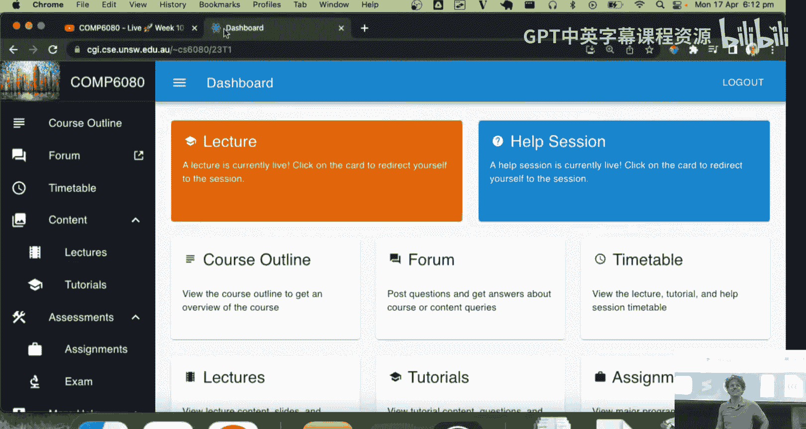

Okay。Lots of confusing heads。

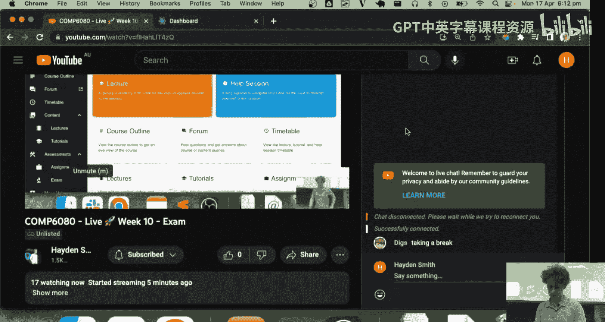

Okay， well， let's get in， let's get into the juicy bit， so。Tonight's about the exam now。

I am going to jump straight to the second section here。 Maybe I。

 I'll come back to this top section about requirements to sit the exam。

 And let's kind of just talk about this， so。Your exam is， it's a three hour exam，9 to 12 Sydney time。

 second of May。 So， you know， a few weeks away， right， I guess， two weeks， two weeks and two days。

2 weeks in Monday， two weeks in one day away。 if， most of you are in Sydney now， which is great。

 If you're overseas， which I don't think any of you are currently overseas from what I can tell in the audience。

 then you can email me and we， we can arrange a different time for you sit the exam。 in particular。

 we always have some students in China or India are really common ones。 But these days， honestly。

 that's not happening as much anymore。 So that's not as big an issue。

 If you do have equitable learning。😊，I can't remember what the S stands for an E， L， S。

 Etable learning， something。 You have some equitable learning adjustments for things like， you know。

 some。If anyone ist， actually， it is a good point。 I should really point this out to people because some students don't know about it。

 But like you andW have special consideration， which some of you know is the thing you apply for when something bad happens like you get sick or you get Covid。

 Then they have another one called E L S or equitable learning something。

 I don't remember the acronym off the top of my head。

 But it's basically the unit that helps make long termm adjustments to your studies。

 So things like if you have disabilities or maybe you know。

 you've got some ongoing mental health issues or you know， you've broken your hand is a good example。

 like you know， hands broken for like more than a week。

 they help essentially coordinate you with like a letter that gets you kind of think of it like ongoing special consideration。

I know because some some people email me and they're like， I've had this issue for months now。

 And I'm like， oh， you should really get some support through the uni because they can do that for you。

 But if you're one of those people because there's usually like a dozen or two in the course。

 And I don't really pay attention to who they are or what the name is。

 because I'm not interested in your personal details other than just to give you extensions。

 We do do some arrangements with your exam time because a lot of those people get extra time in the exam。

 And you get emailed about that， maybe like a week before your exam。

 So just keep an eye out for that。 But it's a three hour exam， it is in the morning。

 which sucks because people under 25 don't like to wake up early， who prefers afternoon exams。

Who prefers morning exams。Interesting， interesting， more like half of you。 That's good。There's。

 there's hope for the future。 Why do you prefer morning exams。 What's your name at the back again。

Doy。Get it done early。 Darcy's got shit to do。Good， so。Yeah， true。 So yeah， that's actually。

 that's true。 probably， probably the more。 there's probably a high proportion of people who wake up early in the lecture here in the evening lecture。

 So it's a morning exam。 I'm sorry about that。 I don't get to choose that。

 I know some people don't like that。 but at least it's not in person。

 A number of you probably haven't had to sit the terrors of arrive at 8。

15 AM on campus for an in person exam。 So that's at least helpful。There may be extra exam time。

 as you know， because we， if anyone's read the notices。

 we're giving away an extra minute in the exam for every my experience percentage that you fill out above 45%。

 I will remind you all of that well， after assessment4 is due。

 I try not to remind students to fill out my experience in the 48 hours before an assessment due。

 becauseuse it's usually when they're in their grumpest moods。 So usually。😊。

You so means that you hard get really angry responses， but you can fill it out。 be honest。

 But it's just kind of a funny thing。 So you get an nexttro。 if we get like 70% of people fill it in。

 then you'll get3 hours and 25 minutes。😊，In your exam， right？Think last time we had。

 it was something in the like 20s。 I think we had like 69% of people fill it in。 So that was like。

24 minutes or something like that。 I can't remember exactly。 But whos around that area。

 if we got 100% of people fill it in， which will never happen。

 because you'd think everyone would just fill it in to get more time。

 But you underestimate how much some people don't give a flying。

Then like 100% would be an extra 55 minutes， an extra hour in the exam。

 So if you really care about yourself， best to tap one of your student friends on the the shoulder and just say。

 fill this in， please， we love the feedback。 It helps helps us learn。

 helps me understand how things are going between terms as well。 So I appreciate it。

 Don't be scared to be honest in either direction。 the only thing I would encourage you all to do if you haven't filled it in yet is please。

😊，Be specific and focus on how you feel。 It's not really useful when someone says， like。You know。

This topic should be in the course。 I'm like， great， thanks for your opinion。 But if you're like。

 like this topic wasn't taught。 and I struggled with assessment for because， you know what I mean。

 like tell me your story， Like， tell me how it affected you because that I can learn something from。

 And then also be specific again， I always tell people the worst thing that I hate in my experience when a student says something like the assessments are too hard。

I'm not， I don't。 Im not gonna do anything with that。 Like， what， what am I gonna， Oh， like， I。

 I'm just gonna cut random stuff out of it。 It's like， tell me how it was hard。You know。

 the assessments were too hard。 you know， assessment 3 promises made no sense to me。

 And I got completely lost。 or assessment 4， it was so hard to get started because react was so confusing。

 And I felt like I didn't know what code to write。 Like， tell me more about it。

 because that's like actionable for me。 So we can help the future generations。😔。

I'm not doing very well with staying on the topic here。 but three hour exam。Longer。

 if you fill in my experience， the exam itself was only worth 20% of the course。

 I got on the exam bandwagon earlier reducing exams way down， which is very exciting for all of you。

 You will know if you pass the course before the exam。 I mentioned that last week。

 because I will ask your tutors to mark your assessment for quickly。

 So your assessment for you on Wednesday。 I will ask them to mark it。😊，By the Sunday。Like in a。

 in a week and a half， if that makes sense。 So it's week 10 this week。

 I'll ask them to it Mark by the end of week 11 Sunday。 They're busy， too。But Sunday is fine。

 And that gives you like 30，36 hours to ruminate about how you feel about the exam。

 But it's only 20% of the course。So。Most， most students are pretty relaxed about it because they go in。

 And like it's pretty easy to score like if you've done like if you've done the assessments and you didn't cheat or like make your team member do it for you。

 then you'll be fine in the exam。 Like it's pretty easy to score like at least 30%。 you know。

 so it it's usually for students not something that distinguishes their future in the course。

 It's usually something that helps figure out kind of what final grade they end up in the course。

 you will notice in the pages here that there's a lot of references to assignment 3。

 That's actually a typo I've just noticed because remember in this course。

 we change all the assignment numbers。 So that should say assignment for。

 I've clearly missed that one when I was preparing the course。 So it's all about assignment for。

 The exam is gonna be really similar to assignment for in that it's gonna be hello。

 it's gonna be based on react。 So it's kind of like take assignment for， Minify it。

 So the scope of it's much， much smaller。And then cut down the marking criteria。

 So assignment 4 is this like big caooot thing you're building where you got all these things about testing and code quality and linting and mobile mobile responsiveness。

 blah， blah， blah The exam criteria is really simple。 It's just 80% milestones or feature sets right。

 It's just that。 It's like， go make the U I do that。 You get a mark for that。

 And the other 20% is mobile responsiveness。So， again， the background of philosophy here is that。

Sorry for babbling。I don't love exams。 I don't think that working under a time condition is that useful。

 but there is some value to it because you also can't be someone that needs three days to solve a problem。

 So there's some value in putting you under time conditions。

 I don't think time conditions with closed book is very reasonable。

 You should always have the Internet accessible。It is normal that you'll end up in a job where someone wants you to do something before lunch。

 you know。But they're not gonna be like， they're not gonna like pull out the ethernet cable or disconnect the wfi and then be like。

 do this before lunch， so。It's reasonable that you have that open book。 And then also， similarly。

 if you're in a situation in life where someone says to you， I want you to do this before lunch。

 They're usually not gonna ask you to do a great job of it。You know， it's gonna be messy。

 So because of that， we don't link your code。 No tutors will ever look at your code for code quality。

 We still will run plagiarism detection on your code。 And again。

 we do find students every assessment。 There are students who've gotten 0 for cheating。

In this course right now。 And this will be the same for the exam。

 So don't just suddenly decide on the exam you're gonna to cheat。But yeah。

 so 20% from mobile responsiveness。 that's all visual。 That's not code。 So we。Expect your。

 we basically like check that your， your what you produce has like all the features。

 And then we just resize it and check it again。 That's what we do。 So pretty easy。

 the marking criteria。The main differences with assessment 4 are that it's much less work。

 It's not assessed than what I just referenced。 U， R， U X not assessed either。

 We don't care how ugly it is as long as it like text chis。Ticks the boxes， checks the boxes。

 whatever。 and it will not have a back end。Because that's a huge added layer of complexity， Right。

 So there's no API。 There's no fetching。 There's pretty much no promises。 I can't。

I there's like there's sometimes a tiny bit of fetching， but it's not like reading docs and stuff。

 It's often like really， really simple。 And you'll see that in the sample exam。

 You are also allowed to use your code from the other assessments in the exam or in the case of assignment or your group' code。

 So you can use your code or something that you and your pay wrote。 This is a good hint for all too。

 because with the final exam， you'll actually be given a repo， just like， you know。

 you have your big brain repo， with like a little create react app that has nothing in it。

 You'll be given that for the final exam and you'll be given it like I don't have an exact time。

 I'll give it to you。 But I'll probably give it to you like。😊，24 hours beforehand or something。

 you know。It'll be empty。 You won't know what to do。 You won't have the spec。

 but you'll have like the reacting there。 So you can easily go and like clone that。

 You can do your NP PMM or yarn install。 You can go and like install any libraries you think you might need。

 You can't really do a ton to prep。 But you can kind of shed 5 or 10 minutes off the exam by just doing that in advance。

 right。Cause I know some people， like， they start the exam。 like exam time starts。

 and then like NP PM install。 and then they're like。They're like， oh， no。There he goes 10。

 who Who NPm install like takes like 5 minutes to run。 So anyone got like a really crappy network or。

Rest in peace。Cool。

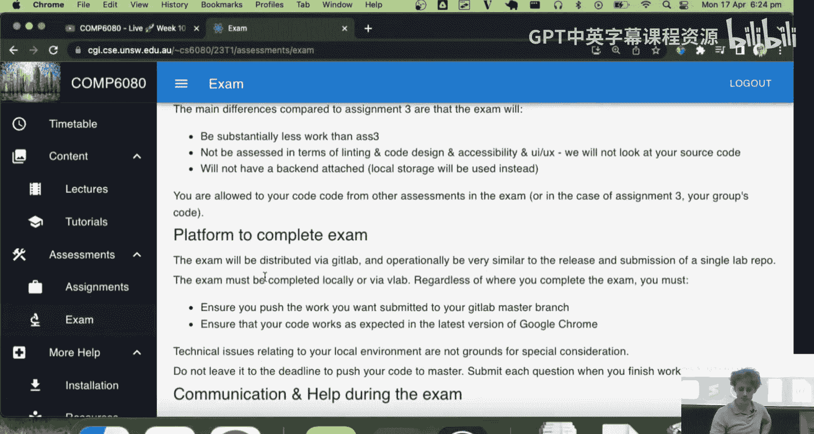

Questions。Roy says， is there gonna be any testing and theory related questions， No， no theory。

 no theory at all。

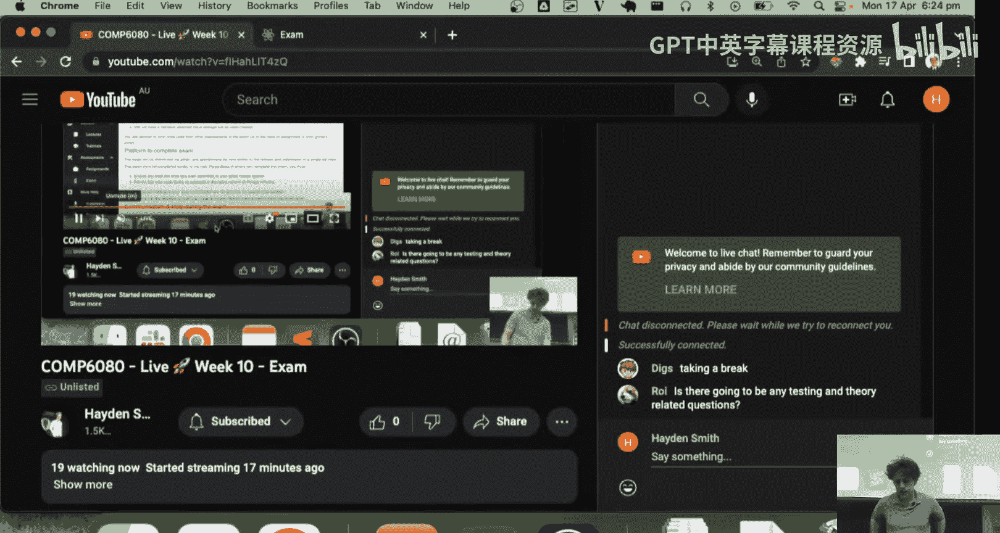

Hard to teach theory in a course like this because we， we cover so many things。

 It's hard to get too academic。 It's very practical。 And in terms of the testing stuff， No。

 there's nothing on testing in the final exam either。 in terms of completing the final exam。

 it's done exactly like assignment for the summary here It's like it's on Gitla， you clone it。

 you push it， masters the submission。 we do that for simplicity。 So if you've done assignment for。

 you know how to do the exam。 It's just one of them is done in three hours。

 The other ones done in three weeks。 ensure you push your code ensure you test on Google Chrome technical issues related to your local environment are not grounds for special consideration。

 I should probably change this sentence after doing it a few terms。I should say。

 technical issues that are not。The result of sudden extenuating circumstances out of your control。

A knock grounds for special consideration。 And what I mean by that。

 And this is probably a good time to jump to the top here is that like special consideration in the exam is there when there is something that you couldn't predict。

 basically。😊，So like， and this is where we get back to the fit to sit policy。 Fun fact。

 This was actually a policy written by a staff member in C， SE that the university liked so much。

 They just applied it to the university。Here， things you， things you learn that don't matter。

So what this says， we know this is like， if you sit the exam， you're saying it's fit to do it。

 So it's like。Ha anyone watch enough American stuff We you ever heard the term preexisting condition in relation to American health or hass anyone ever heard that phrase。

Someone put their hand up。 just like one person。The little hand， someone lied to me。

Don't don't even care enough to lie to me， so。It's like。

 if you go into the exam with a problem that happened before the exam， you can't claim it。

 So it's like。You know， let's say on the， the Monday before the exam。

 you have a really bad migraine or a stomach problems。

 And you go to the doctor and the doctor like writes you a note that says you're sick on a Monday。

 You can't sit the exam and then halfway through the exam。 say， I've had these stomach problems。

 I have to stop。 I want to sit us up。Because you knew about it， right， You know。

 you're unwell before the exam。 In the case you're unwell before the exam。

 you don't sit the exam and you apply for special consideration。

 and you set a supplementary exam later。You know， so like if you're not like 9 AM。

 if you're not well， you don't do it。You skip it， you sit this up， you email me， you。

 you apply for special consideration。 If you're well enough to do it， you sit it and finish it。

 However， if halfway through the exam， something horrible happens like。I don't know。You， your。

 your cat has an asthma attack。 I don't know what things could happen to you。 or like。

 you get really sick Sit cramps from like food you ate that was off or something。 That's all okay。

 I know you're sitting there being like， well。Hows he ever gonna know that I was having this problem before 9 AM。

 It's like， well， I don't。 But like you can roll that dice with the university if you'd like。

 But that's the rules。 So they won't， they won't grant you things that you knew beforehand。

 Basically， if you're not well， don't sit the exam。 If you're well enough， do sit the exam。

 If something does happen during your exam， emailmail me。

 It's the only time you should email me during the exam。 Everything else is on the forum。

 Don't email me during the exam unless it's to stop the exam because of some issue。

 I will not be monitoring my email for anything other than foreign posts or that。Yes。

 which leads me to a common thing， which happens now at home， which is Internet。

 So if you have Internet issues， here's the usual advice。 It's like。

Don't sit the exam and then halfway through be like， my internet's really slow。Okay。

 if you have bad Internet， there's a couple things you could do。 One is that you could。Fix it。

By moving to another room。You you go crazy and start doing things like put aium foil around your router。

Or know Google top 10 things to improve my Internet。 you've probably done that already， though。

 So it's like go to another room in the house。 if your internet's down or something。

 like here's a good example。 Like on last Monday， I woke up and 8，30 My Internet。

 My NBN was down for like 24 hours， which was annoying。

 that's an example of something that you basically apply for if that happened in the middle of exam。

 you apply for special consideration。 if you do have issues with your Internet。

 This is really important or other things like people have been like my power went out My water has been shut off。

 there's been a water main burst outside on my street。

 My internet disconnected in every one of those cases。

 they're gonna ask you for some kind of evidence I dont mean you taken a photo of your computer the like Internet signal gone。

 I mean， like you take a screenshot of like like the NBn website where it tells you whether it's an outage or electricity you email A or your electricity with and they usually send you a reply saying yes。

Confirm there was an outage in that area at that time。 That's all the evidence you need。

 But that's a good reason why you shouldn't like， treat it lightly， too。 And that's what I mean。

 Like， if you're like halfway through the exam， oh， my。Internet slow。

Which is basically for some students， a co word for like。

 I didn't realize how much I'm struggling with this course。

 I really need to sit the supplementary exam and study for another month。 If you're in that boat。

 it's just really hard to provide evidence。 So if you think there's an actual problem like that。

 like your internet is slowgo， try and solve it before the exam。Yeah， so during your exam。

 everything's on the forum。 You have access to the Internet for everything I always describe to students。

 You should treat the final exam like。You can use the entirety the Internet。

 but everyone on the planet is dead。So you can't post stack over for questions。

And get someone to respond to you The， This is a somewhat。Difficult rule that's gonna， like。

 you're gonna see this change quite a bit in the next couple years because of like。

Canone guess what I'm going to say？下季飞。😊，Chat E 7 or some something。You know。

 that's gonna become problematic。I always get asked。 Can I use chat GT。 Yeah， I guess。 I mean， like。

 I can't stop you。What it says is you better be sure as hell that someone else doesn't plug the same question。

 get the same code out of chat G， because we will find that。 So if you。

 if you get unique code out of chat G that no one else has， then yeah， you can probably like。

Slew through and solve the problem。 But I don't know how I don't know how lucky you'll get because chat G is probably a good generalist。

 Like you could probably be like， hey， chatep， I've never used it for this stuff。

 but I've seen people， you could probably say hey G。

 can you make me a basic react with react route a Do and three tabs or something like that。

 I'm sure could do that or maybe but you're not gonna solve really complicated problems So I have this big brain activity that this stupid lecture is given me。

 And there's like there's like a section where I have to have an advance button。

 but I don't know how it works because I haven't read the docs yet they're not gonna solve that problem for you。

 So I think you're mostly okay， but it's like use the Internet to the full advantage。

 if you do use chat G。 and you don't get picked up on plagiarism。

 I'd love to hear about it after the fact。 I promise I won't tell anyone。

 I'm actually curious how it goes。 though I personally wouldn't waste time with it you here learn So you might as well learn。

But don't seek help。 Don't talk to people。 You'd be amazed how many people dob each other in every time。

 Like every time there's always one student who just like sends me a screenshot of a group chat and is like。

They were talking about the exam。You know， if I was your friend， I think they're awful。

 but I find it hilarious as someone who gets to do something with it。 Don't trust anyone。 Sincerely。

 they not， there's also students every term。 It happens all the time。

 They're like two hours into the exam。 And their friends like， calls them up。 and they're like。

 I can't do it。 And then they're like， oh buddy。😊，I'll send you the code。Just don't。

 don't make it look too similar。If they're struggling to finish the exam。

 they're not gonna be a genius and change your code very much。 You're both gonna get in trouble。

 So there's always a student who gets a really bad mark because they share their code with someone。

 And that sucks because they're trying to be a nice person。 But， you know， if。

 if you're trying to be a nice person。 You are rolling the dice for both yourself and them as well。

 So just be careful。 Also please remember， it's 20%。 Most of you are past the course。 don't。

 don't do stupid stuff just to like boost your mark。 and probably get found。😊，Yeah。Blah， blah， blah。

 So posting on the forum during the exam， typicallyy。

 it's gonna be me and another tutor monitoring the forum。 It's probably gonna be like myself。

 Jason and Gordon， because Jason and Gordon just seemed to be answering forum questions。

 who's had one of their problems in life solved by Jason or Gordon。That's good。 That's good。

They're much better forum answerers than me。 If anyone notices I try and answer forum questions in as few words as possible。

 which sometimes is not very helpful， but they're super great。 So to basically be me， them。

 me and those who probably it depends who just answering your questions during the exam。

 If you ask a question about the spec。 and we think that the specs clear enough。

 we will respond with a fairly standard response。 That is we feel that we've given you all the information that you'd need to answer this。

 What that means is that basically。If you don't understand it。It's like sounds awful。

 but it's like we should try harder to understand it。 It's like， you know。We don't often say that。

 particularly in this course， cause we think it's like。Fair enough that， you know。

 some things are confusing。 But otherwise， you'll just get help。 Obviously。

 it's really important that you ask good questions， too。

 because how we answer forum questions on the exam is basically like a big queue。

 So if you post a question， and then it takes us 8 minutes to reply。

 and then you take 5 minutes to reply， your reply is gonna come in like after everything that's happened in that 13 minutes。

So the worst thing you can do is post a question， and you get a reply 8 minutes later from Jason。

 That's like。Sorry， what do you mean or like， can you share a screenshot of that or like。Sorry。

 what particular part are you referring to。 So it's like， be specific。 That'll help you。

 It'll actually save you time。 taking that extra just 30 seconds to clarify will make your life easier。

嗯。You will be emailed during the exam too， blah，lah，lah blah， blah。 Sub。 there's no submit command。

 It's just master， troubleshooting。嗯。That stuff's all pretty standard。

 getting to the Mvo preparation。Sir。Here's my favorite thing about practical courses。

You've already studied for the exam。Because you've been doing the assignments。

There is no real study material。 In fact， it's really useful that you submit assignment for approximately 13 days before you set the final exam。

Which means that you're fresh going into that exam。 How should you prepare for it。

Because it's react based。I'd probably just suggest that you go to tutorials。And you go， well。

 you thought by topic might be easy。And you just go to react J S。

 and maybe you just familiarize yourself with some of these different activities。

 particularly the compulsory ones， because there's nothing in the exam that's very hard。

 The exam is very easy， easy， like in terms of concepts。嗯。So anything that says compulsory， you know。

 time out， use effect， U I router example， S with state 2，0，4，8， you know。

 just a lot of these Titk toe。You don't have to do it if you feel like you know it。

 because some like a lot of you will look at these activities now in the tutorialtorism and be like。

 I know exactly how to do that because you've done the assessment for， which is bunch bunch bigger。

 But that's a good place to revise。 I don't think you need to revise。😊。

There's gonna be no forced use of promises in the exam。

 So if you're comfortable with asy or weight and fetch and stuff， youd know everything you need to。

 there's gonna be nothing very complicated about async。 So again， like。

 if you know how to make a fetch request with a weight async， capture the results thrown  error like。

You're good to go。诶。Nothing about vanilla Javascript is necessary at all。 That being said。

 I guess one thing that might be necessary would be like the。Forms or the。

Events or the local storage part of it。 But again， this is just from assignment 4， right， Like。

 you know， with react， you still deal with events and you still deal with local storage。

 So it's all just assignment 4 stuff。 And then C， S S， again。

 I don't think I'd spend much time on it because if you've done assignment 1，2，3 and 4 by this point。

 you kind of get C， S S， Like， who knows how to put a margin somewhere to make the block go over there。

 right， Like all of you， I hope。Yeah， yeah。 So like， you're good。 You're good。 You're ready to go。

 So because the final examiner will have a look， we'll have a look at it now。😊。

There's a sample exam paper， which I'm Is gonna ask me to log into Gitlab。こ。Okay。

 now what's the rule， Take the live students back off hold。

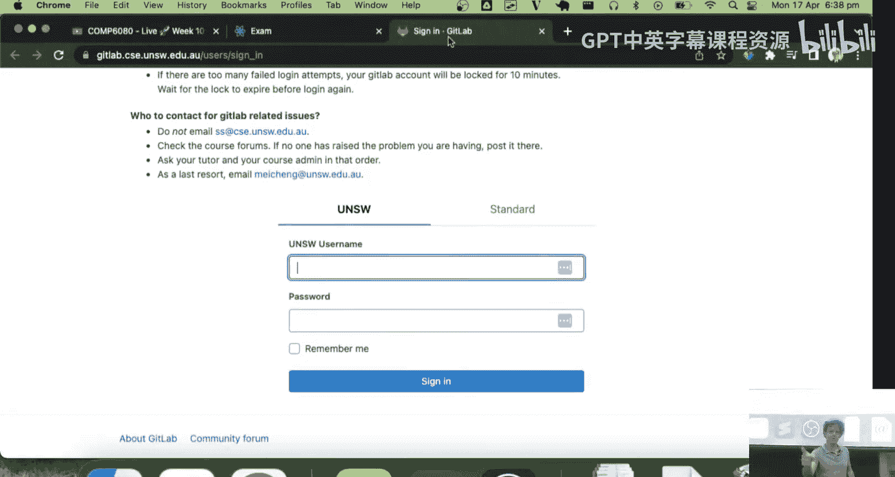

See you soon。

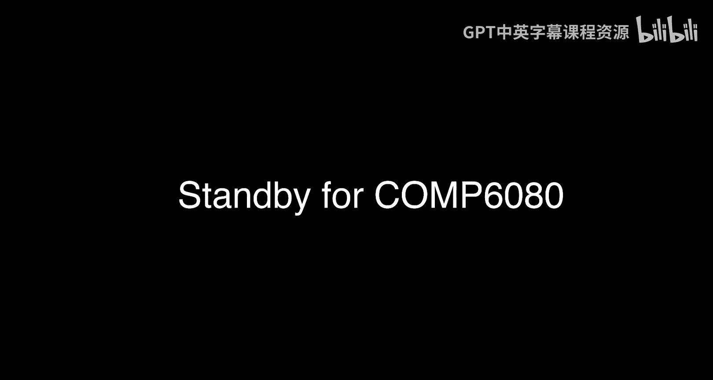

Who was here that time？ We just like， forgot about him。 That was a funny day。2。

That was so depressing。 Yeah， depressing is to get home and then just sit down at your desk and like。

 rerecord a lecture。Tell you。A lot of things I'd rather。 So this is the sample exam。

 Your final exam will look exactly like this。Just realized it didn't even turn the recording off。

 doesn't matter。It would look exactly like this。 It would just have like， you know。

 a different name and stuff。We will have a read me and typically not even any images。

 but it's just a readme file。With your exam， you go and complete the exam in a repo that I'll roll out probably tonight。

 because it should be really easy to do。 but it's basically in。60，80。There's like 23 T 1。

 And then students， right， and then。You know， a lot of errands Here go。 Let's go to。Alexander。

There'll be another repo that you see here that'll say。Exam dash sample。

Which is basically going be like an assignment 4 stub。 It'll appear there。

 And it's just gonna have an empty react up in it。When the day before your final exam。

 you'll get a second repo that just says exam。 So you'll get two，1 for your sample exam。

1 for your final exam。 But your exam sample will come out tonight。The spec is in one repo here。

 Do not clone this。 You can't edit this。 It's just to look at。

Your exam sample spec that is given to every one of you is where you do your work。 right。

 So spec over here， your work over there。 We separate that， I don't need to explain。

 no one probably cares why， but we separate it for reasons。And yes， that's， that's really it。

Please don't try and clone this Every term。 there's a student who posted on the forum。 They said。

 I've cloned the exam spec repo， and I can't push to it。I'm like， I know， because we told you not to。

 And they're like， what and then。Anyway。This is it。 It's really simple。

 It's like go and yarn install yarn start。Or NPM doesn't matter yarn or NPM。

 I've kind of been trending away from yarn a little。 So NPM's like the O G dependency manager。

 and then yarn came along to solve some problems， which is why。

 And then a few big people jumped on it， which is why you see like react， react out used a bunch。

 And then NM kind of solved some of their problems。 So there's kind of been like。

Less an aggressive shift over towards yarn。 So， and I think because NM， like， you kind of need to。

MPM's everywhere。 So you kind of need to learn it。 That's why we try and maybe talk about it more than ya。

 But eithers fine。 And then all the exam is， is this is an example。

 You have this feature section where we， we outline we're like。

 we want your web app to have a header and footer。 And this this is the description of how the header and footer should be。

 like all of that。😊，Right， it's really broken up quite specifically。And I do this。

 so you don't stress， right。 So you have。Clarity like I， I just have to do that exact thing。

 And this is important because for your tutors， when they mark it。

 they will go through it and just like tick， tick， tick， tick， tick， tick， cross， cross， tick。

 right like that。 So it's super， super clear。 It also gives you an opportunity to decide whether something's worth it for you or not。

 There's very little gray area when marking this assignment。😊，嗯。Yeah， so you can be like， oh。

 all screens should have a footer bar that has a height to 50 pixels。

 has a width that spans the full width of the viewport。 It's not fixed。To the bottom of the viewport。

 But it's instead fixed to the bottom of the document page。 So， you know， as the page scrolls。

 it doesn't hoverbble。 It's not like a fixed element。 has a background of that。 Okay。

 that's two and a half marks。 great， I'll go do that。 That'll take me like 5 or6 minutes。 You know。

 and you just， that's the exam。 That's all it is， really。Then， so。

 and the exam typically has the same。Structure， which is。

 there's like an overview where we tell you how to do like the， the meta elements of the page。

 There's a dashboard， which is like the landing page， which。

 and then there's three games and all the exams I run have the same structure。

 Why do we do three games。 We could do like 10 games and do like mini games that are really easy。

 like。😊，Click the red button。 That's the game。 But little games don't work well because it's really hard to tell if students cheatca when you only ask them to write 10 lines of code。

 a lot of students write similar lines of code。 But we don't want to have one big game because we realistically know that。

And you've all started exams before。 you know， when you sit in the exam。

 There's just that one question。 And you just have no idea what's going on。

 You like that is confusing。 I don't know how to do it。 I don't know how to approach it。

 So because of that， we have three games because we assume that just one of them or half of them or something is gonna freak you out。

But we also like to record a video of the game。

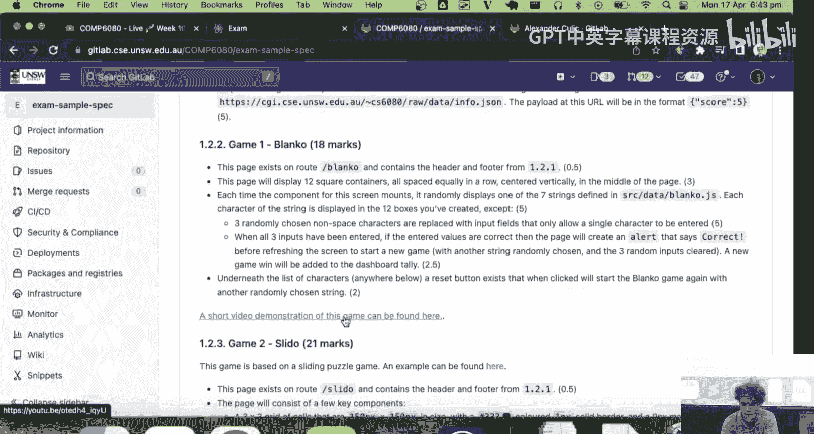

So we do this for you so that if you're really not sure what is going on。

 then you can actually just like， see it in action。

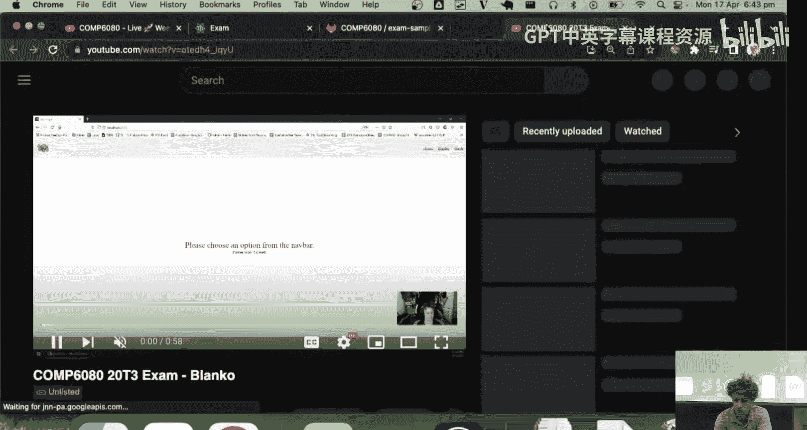

Which is helpful， right， becauseuse who gets， who gets fatigued by too much text when they're stressed。

Yeah。This isn't going to answer all the questions， but it'll give you a gist of like the the gist of how it should behave。

 And we do that for all the questions， too。For some things where we ask you to implement a game you might not be familiar with。

 we also link you to like an example。 So， for instance。

 Sdo just one of my favorite exam questions I've ever written。Was just a reenactment of this thing。

Which。You remember this， you know this thing。 is it going to work。You know what you got to like。

By the way。Yeah， they'll played that。Most of the 6080 exams me thinking about what's a fun little question that's probably not extremely difficult。

 right？ Obviously， students weren't asked to animate this。 You know， they were just asked to like。

 make a grid。 and then you tap one thing。 and it like just moves around。

So this is like the kind of question we ask。 And there's just like three of them。

 And there's none of the styling or the prettiness to it。 So that was an example。This one is a shta。

 which was funny。And then the last one was like a really crappy version of Tetriris。

 I don't think we gave a video of that one。 But this was this was， I think， the first exam we ran。

 So it's just recycled as a sample exam。 Now， what's important about this is that you can。

 I think it still works。 CC sometimes update their systems and break my sample exam。

 But maybe this time okay， So this is an actual student implementation of the sample exam。

 where there's like a landing screen。 And then the first one was you have to fill in the gaps。

 which was like。😊，Hawaii pizza。Okay， apparentlypparently， cups didn't work。 See what， I mean。

 they're really simple games。 Like correct。 lot。 You know what I mean， like quite， they're not。

 they're not very sharp。 I guess you'd say another question。 What do you think this one is。Yeahay。

 what do you think say。Yeah， okay。 I guess there's I need to。I wrote those words， so that's weird。

Then， there was solder。Which was fun。Does anyone ever play these games like me。

 And you get about 30 seconds into it and you realize how dumb you are。Yeah， you do that。Youre like。

 yeah， I， I， I， I'll just stop。 you like， no， I have no idea what I'm doing。 So there was that one。

 And then you click solve and it jumped or you click reset and it did that。 And then there was Tetro。

 which was just。Actually， I don't even think the student finished this one。

 So I don't have an implementation of it to show you。 But like we just took us， we。

 we wanted to take a student's exampleca it's like it's quite indicative of， of the effort put in。

 But this is。😊，That's it。 That's， that's， that was the exam。 Now， most students。

Like 90% of students didn't start。 Thats a bit dramatic。

 Maybe like3/ quarters of students didn't start the third game。Right。

Probably half the students got somewhere between， like。

A third through the second game and like nearly and and just finish the second game kind of thing。

 But you should not be too stressed。 We don't expect you to finish all the games。

 I gave you this spiel at the start of the course about how front ends hard， because。

If you finished it， you've gotten the marks。Right， so there's just this inherent nature that。The。

 the students who are more comfortable with it， who've done more practice will get more done in the time。

 That's， you demonstrate it because the efficacy of your work is higher。

 So don't go in stressing out。 It's pretty normal to not be able to smash through it。

 And you can play around with the example exam and get get a sense of it。

 I don't have numbers for you， but I usually scale the exam pretty heavily。

 The only case I don't as if the assessment marks are really high。

 but that doesn't really happen much。And typically， I try and align them to assessment marks， too。

 So like， let's say you're a student and you score a raw mark of， you know。

8 out of 20 is like a pretty average exam mark， maybe 7 or 8 out of 20， like percent。 like。

 I don't know what the out of 100 would be。 But 7 or 8 out of 20， we might scale that to like。

 you know， like 12 or something like that。You know， I don't， again， I don't have the numbers， but we。

 it depends on the cohort。 Some students do better assessments worse of the exam。

 but we're trying to line these things up。 We prefer the harder exam because it gives a better spread。

Standard things。 So just don't go in being like， this is too hard。 Like， if we made it harder。

 we'd scale you more。 If we made it easier， we'd scale you less。

 You'll end up in about the same spot。 We want to make sure that all students can get at least 30% through the exam。

 which you all can。 And also the exams are pretty like cookie cutter。

 So if you have your exam sample on hand hint。For the final exam， like。

 you'll be able to shed about 15 minutes off your time easily。 Nothing is quite identical。

 but you'll definitely be able to reuse the macro elements of it。

It also gives you a hint that you should get comfortable with this kind of dev。 You notice。

 you notice a common thread about these games is they're all。

 they're all like little state based interaction games。Right。

 so you should get comfortable with like click events， keyboard events。

 You should get comfortable with storing state2 D arrays， data structures。 You know， that's why。

 like， if you really want to play around what are always really great things to practice for the exam of these three。

😊，But also， the tick ta toe and the 2，0，4，8 in the tutorials， because they give you that。

That real strong engagement with this， like state based application。嗯。Digs having PT T， SD。

Hopefully not from me。😔，Be sad。Roy says for styling， can we import。In C S S framework。

Like material UI。Like， you can。 but I just don't know why you would。There's no mos for it， you know？

Like， maybe。I， I just would， yes， you can， H00%。 you can。 You can install any libraries you want。

 I wouldn't。 I would strongly encourage you not to。

ca if you're installing libraries beyond reactor out of dom， generally。

 you're getting distracted with something that's not gonna give you marks。

A good example like using a material U I button or a material U I form is gonna give you no marks。

 And all it's gonna do is add another layer of like。Something that might not compile。 You know。

 you got the import wrong or you forgot a props of the button or a wrapper， you know， it just。

 it adds that little bit of complexity because you can just use outright H T L buttons。

 That's totally fine。 you just use like the button tag。 the input tag doesn't matter。

 raw H T L everywhere。 Sts everywhere。 We're not gonna look at the source code。

 So it doesn't really matter。嗯。Yeah。What's it。That's the exam。 So go do the sample exam。

 Sometimestime submit assignment for， take a break， practice the sample exam。

 If you have other courses， I probably would， I really would strongly recommend that you maybe focus on them because you'll probably find this exam。

In a relative sense， easier because you've done the study。嗯。Like， you know， the stuff。 I would just。

 I would probably suggest that a typical student turn go turn around maybe on that Saturday before the Tuesday。

 So the exams on Tuesday in like two weeks， Go turn around on that Saturday， a few days before。

Go do a sample exam。 Go do a couple of those react to questions。

 It'll get you back in that like use state， use effect component headspace。

 And you'll just kind of be ready to go on the， on the Tuesday。 So's what I'd say。

 That's probably my best advice， but。That's all we have on the exam。

Do people have any follow up questions about it here or。Things in general。Now's a good time to ask。

No， not at all。You can make it You can put everything in one component。Yeah。Again， I don't。

 I don't feel it's fair to ask you to work quickly and cleanly。

 I don't think that's a reasonable ask of students， so。Any other questions。 we're done for tonight。

 It's a pretty short lecture。 So it's just here asking questions。Yeah。Yes。Yeah， yeah。 Yeah。 like。

 unless it's specified， like again。I know you gotta think like a tutor when you mark this。

 Like a tutor is gonna look at your stuff and say， okay， like， and let's do that really quickly。

 So like Bco， the page exists on route Blanco and contains the header and footer。 Blanco。 Okay。

 the header and footer is still there。 T。 The page will display 12。😊，Square characters。

Containers all spaced equally in a row， centered vertically in the middle of the page。

 So even the language is kind of vague so that like， you know。

 we're just testing that students can center it。 Yeah， each time the component for the screen mounts。

 it randomly displays one of the seven strings defined in this file。

 I've kind of moved away from adding these kinds of files to the the exam reap。

 I think you just confuse the students。Normally I'll just like give you the the strings in a piece of text or something。

 Each character of the string is displayed in the 12 boxes you' created， except。So okay。

 so that 5 there is like。That's a little marks for that。

3 randomly chosen non space characters are replaced with input fields that only allow a single character to be entered。

 Okay， so 3。Great， tick tick tick， tick tick。 when all three inputs have been entered。

 If the entered values are correct， then the page will display alert that says correct before refreshing to give a new game。

 So I type in。😊，What's this。嗯，啊。What。😮，Cross。ofFrogs， larger frogs。2。Okay。I'm a psychopath。 So， yeah。

 says correct。 Again， that's like tick tick tick underneath the list of characters。

 a reset button exists that Wayne clicked will start the Bca game again with another randomly chosen string。

 So for example， we don't specify where that goes。 So like it could be in the bottom right or something。

 And the tutors have to give you the mark because you've done what we asked you to。

 So that's just there because the student was clearly doing that。 And like most of you。

 they were like needs to be center aligned。 Otherwise， it's gonna look like crap。 know。

 So they just like center align it。 And probably everything in that box is centre line。

 So to your question， that's that's how our market。 and it's meant to be like touch like that。

 So don't stress， you know， I would say again。😊，Most students struggle on the dynamic。

 Like students struggle in one or two things in the exam。 They either struggle because they。

Don't know enough random knowledge， Like they don't know， like background and margins and padding。

 And， you know， they get kind of lost in all the little tidbits。

 But that's only students who maybe didn't try very hard in the assessments。

 If you're one of those students。You should go back and finish your assignment， honestly。

 or do something， go learn more。 But for most of you who've done the work。

Usually get caught up on a a dynamic， like a behavior。

 like the random number nature of this or the refreshing or how to display it。

 identify when you're getting lost。In a black hole and move on。 a lot of these questions。

 you can still get marks without ticking every box， right， like someone here could have。You know。

Done this。 And like not even randomized it or put the input there。 And they could still easily get。

 you know， a whole bunch of the marks。 like they could get 。5。 and then another three marks。

 And then this is a bit vague here。 But it's like。Okay， it displays the seven strings every time。

 That's like immediately like a third of the marks in the reset button at the bottom。

 That's probably like another mark， like without doing the hard part， so。

Be very cut through it with yourself。Any other questions， I see if you。

 you people have got their like bags ready to go。嗯。Yeah。Oh， no。Maybe I'm scared to look。

 We have a lot of tutors on there tonight。 We， we bolstered them up pretty hard。😰，嗯。I think。Wake 10。

 Monday。Yeah， you got like7 people there。 That's wild， so。Yeah， hopefully they're okay， but you know。

 you all seem pretty calm。😊，Hopefully， that's a good thing。 Any other questions。

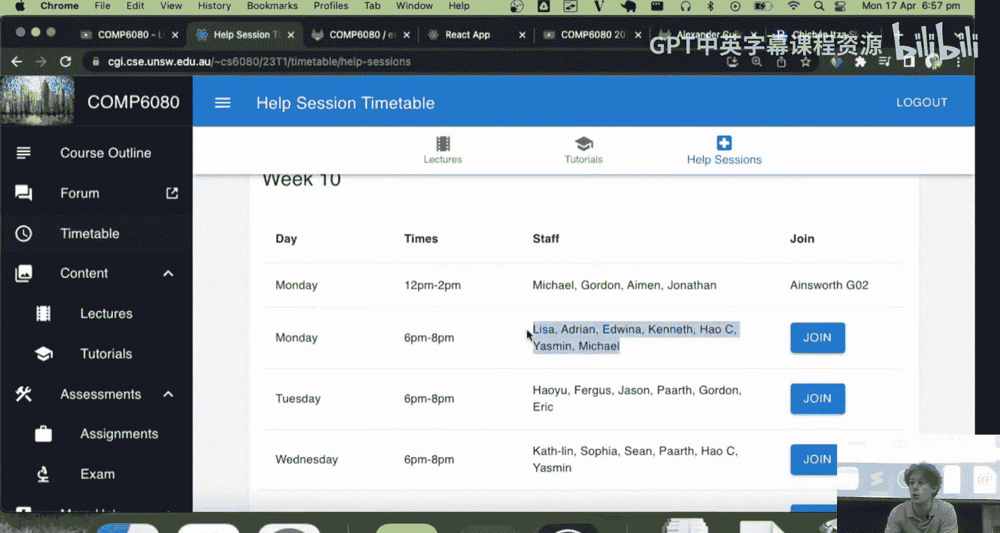

Good luck Fishing it。 If you haven't finished， like， good luck。Hope you enjoyed it。 Hope you had fun。

 Hope you get a bit of a break after all of that。 Otherwise， thank you。 And have a good evening。😊。

And post on the forum if you' did anything， because we're always around。Sorry。Thank you。

 I'll see you all around whenever I see you around。

