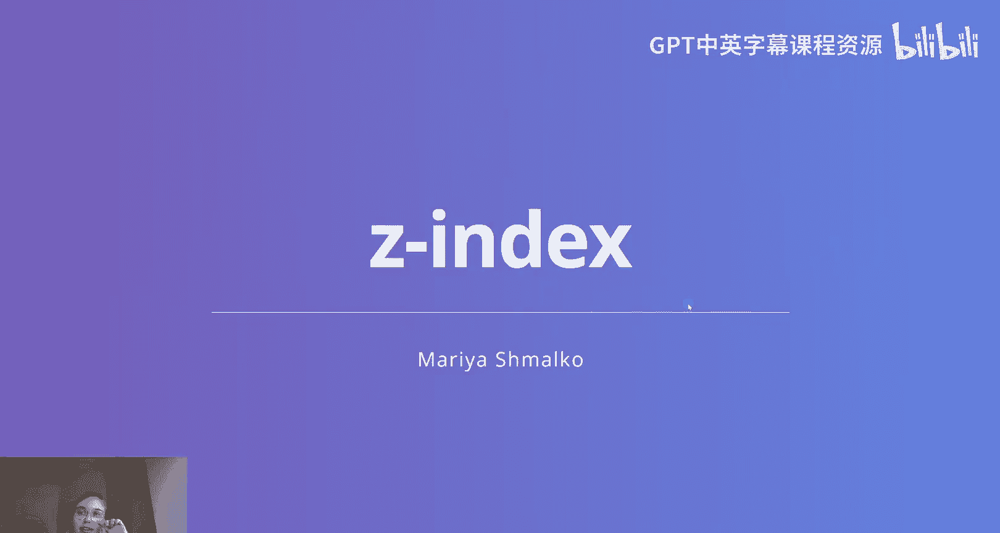
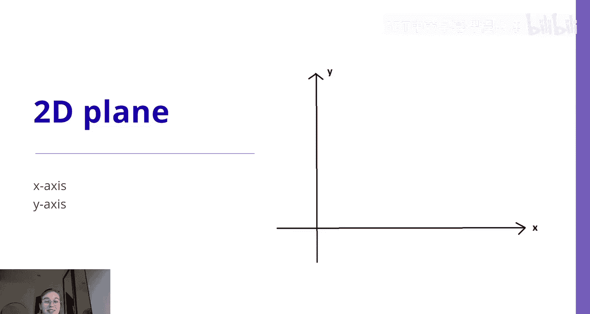
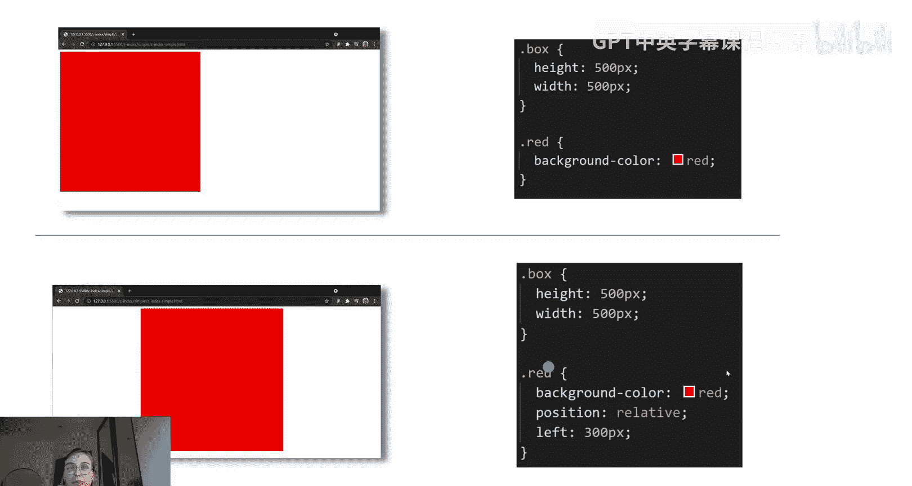
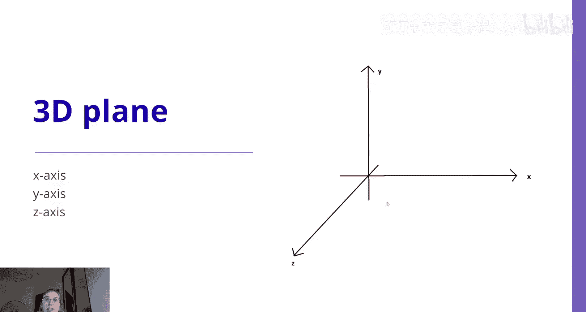
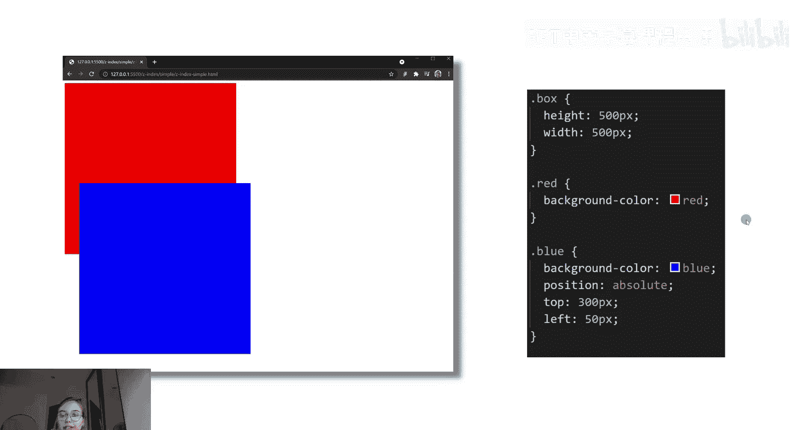
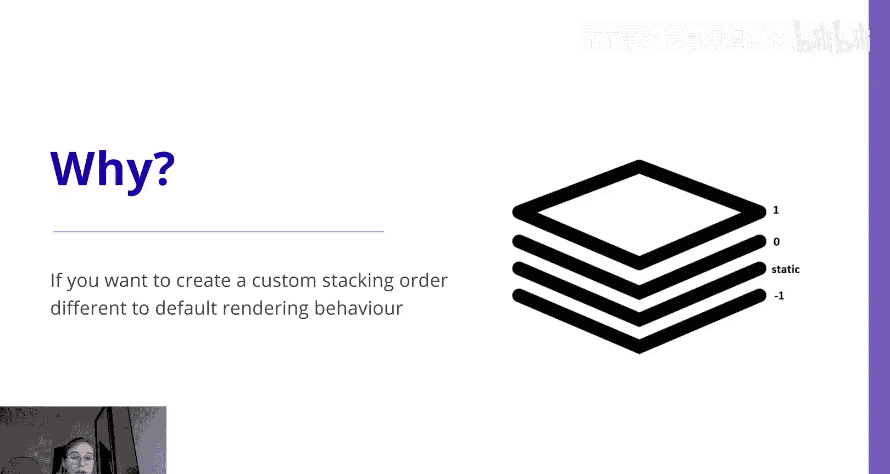
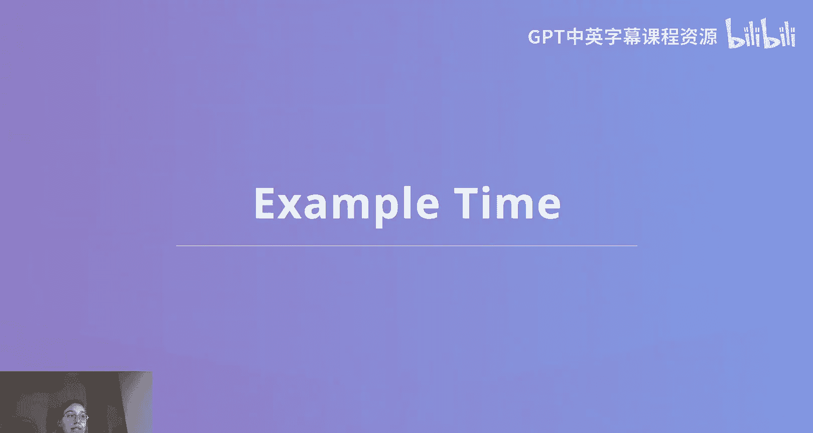
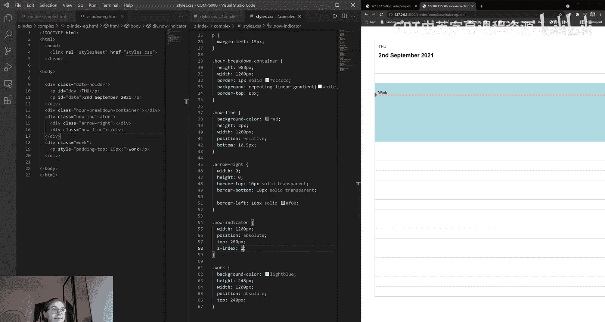

# 前端编程：CSS：z-index 深度解析 🎨



在本节课中，我们将要学习 CSS 的 `z-index` 属性。这个属性允许我们控制网页元素在垂直方向上的堆叠顺序，就像在三维空间中调整元素的“前后”位置一样。理解 `z-index` 对于创建复杂的布局和层叠效果至关重要。





---

## 从二维到三维：理解网页的层叠上下文



上一节我们介绍了如何使用 `position`、`top`、`left` 等属性在二维平面上定位元素。例如，通过设置 `position: relative;` 和 `left: 300px;`，我们可以将一个 500x500 像素的红色方框在 X 轴上移动 300 像素。

```css
.box {
  width: 500px;
  height: 500px;
  background-color: red;
  position: relative;
  left: 300px;
}
```



然而，网页实际上更像一个三维空间，存在一个第三轴——Z 轴。我们可以使用 `z-index` 属性来改变元素的 Z 轴值，从而控制其在网页上的垂直位置。

默认情况下，所有元素都是静态定位的（`position: static`），它们会被渲染在同一个层级上。但是，如果将元素的 `position` 值从默认的 `static` 改为 `absolute`、`relative` 或 `sticky`，就会改变元素被渲染的层级。

---

## z-index 的核心概念

`z-index` 是一个 CSS 属性，用于调整**已定位元素**（即 `position` 值不为 `static` 的元素）被渲染的垂直层级。这一点非常重要，因为 `z-index` 对静态定位的元素无效。

*   **更高的 `z-index` 值**：意味着元素看起来更靠近网页的浏览者，即处于顶层。
*   **更低的 `z-index` 值**：意味着元素会被推向后方。

你可以把 `z-index` 想象成 Microsoft Word、PowerPoint 或 Canva 中的“置于顶层”或“置于底层”功能。

在过去，`z-index` 更常被用于模态框、弹出窗口和对话框等需要出现在内容上方以便用户交互的元素。如今，它的使用频率有所降低，但在许多现有代码库中仍然很常见。了解其基础知识对于前端工作非常有帮助。

---





## 为什么建议谨慎使用 z-index

我通常建议尽可能避免使用 `z-index`。原因在于，如果页面上有很多元素都设置了 `z-index`，你很容易陷入一个循环：为了提高一个元素的层级而增加其 `z-index` 值，然后不得不去提高其他相关元素的 `z-index` 值，因为 `z-index` 的效果是相对于页面上的其他元素而言的。

理想的做法是，只在网页的一两个元素上使用 `z-index`，然后利用浏览器和 HTML 提供的默认渲染顺序来组织页面上的其他元素。

以下是关于层级顺序的要点：
*   静态定位的元素（`position: static`）位于一个默认的基础层。
*   已定位且未设置 `z-index` 的元素（或 `z-index: auto`）位于 `0` 层。
*   可以设置正的 `z-index` 值（如 `1`, `2`, `1000`）来创建更高的层。
*   也可以设置负的 `z-index` 值（如 `-1`, `-10`），这些元素会渲染在静态层的下方。

---

## 一个简单的 z-index 示例

为了更好地理解，我们来看一个包含四个 `<div>` 方框的简单例子。

假设我们有四个不同颜色的方框：红、蓝、橙、紫。它们最初都是静态定位的，按照 HTML 顺序堆叠。

**目标**：我们希望紫色方框（box4）位于红色方框（box1）之上。

首先，我们可以通过给紫色方框设置 `position: absolute` 和 `top: 50px` 来实现。这是因为红、蓝、橙三个方框是静态定位的，而紫色方框不是，因此它被渲染在了比其他三个方框更高的层级（第 0 层）上。

接下来，如果我们给蓝、橙、紫三个方框都设置 `position: absolute`，它们会全部移动到第 0 层。由于它们处于同一位置，并且按照 HTML 顺序渲染（蓝 -> 橙 -> 紫），所以紫色方框会盖住蓝色和橙色方框。

**新目标**：现在我们希望蓝色方框位于橙色和紫色方框之上。

这时就需要 `z-index` 出场了。由于它们都在第 0 层，我们可以：
1.  给蓝色方框设置 `z-index: 1`（大于 0），它会出现在顶层。
2.  给橙色方框设置 `z-index: 2`，它会出现在蓝色方框（`z-index: 1`）和紫色方框（`z-index: 0`）之上。
3.  给紫色方框设置 `z-index: 3`，它又回到了最顶层。

现在，我们有了静态层（红色），以及 `z-index` 为 1、2、3 的层，它们按照预期相互堆叠。

**重要提醒**：如果我们尝试给静态定位的红色方框设置 `z-index: 4`，它不会生效，也不会出现在其他方框之上。`z-index` 只对已定位元素有效。

我们还可以使用负值，例如将所有方框的 `z-index` 设为 `-1`，它们就会渲染在静态默认层的下方。如果将紫色方框的 `z-index` 设为 `-10`，它会被推到最底层。

---

## 实战案例：模拟 Google 日历

现在，我们来看一个更复杂的真实案例：模拟 Google 日历的界面。

我们的页面包含：
1.  一个日期显示框（静态定位）。
2.  一个“小时 breakdown 容器”，用线条表示一天中的各个小时（静态定位）。
3.  一个“当前时间指示器”，包含一个红色三角形和一条向右延伸的线，用于指示当前时间。
4.  一个“工作事件”框，代表日历上的一个事件。

**目标**：
*   将“工作事件”框和“当前时间指示器”移动到“小时 breakdown 容器”之上。
*   确保“当前时间指示器”的线在“工作事件”框之上。

**实现步骤**：
1.  首先，我们给“工作事件”框添加 `position: absolute` 和 `top: 240px`。由于它变成了已定位元素（第 0 层），它会自动出现在静态定位的“小时 breakdown 容器”之上。
2.  接着，调整“当前时间指示器”内部线条的位置，使其与三角形对齐。我们可以使用 `position: relative` 和 `bottom: 10.5px` 进行微调。
3.  然后，给“当前时间指示器”容器本身添加 `position: absolute` 和 `top: 280px`，将其移动到“工作事件”框的大致区域。但由于 HTML 顺序，“当前时间指示器”默认会位于“工作事件”框之下。
4.  最后，为了解决层叠问题，我们给“当前时间指示器”设置 `z-index: 1`。这样，它就会渲染在“工作事件”框（未设置 `z-index`，位于第 0 层）之上。

这个案例展示了 `z-index` 的一个典型应用场景：当你需要在现有 UI 之上绘制线条、图标或某个独立容器，并且该元素不会引发复杂的层叠链时，使用 `z-index` 将其提升一个层级是合理的做法。正如之前强调的，我们应该避免为多个元素设置 `z-index` 以防止层叠混乱，在这个例子中，我们只对“当前时间指示器”这一个元素使用了 `z-index`。

---

## 总结

本节课中我们一起学习了 CSS `z-index` 属性。我们了解到：
*   `z-index` 用于控制**已定位元素**（`position` 不为 `static`）的垂直堆叠顺序。
*   数值越大，元素越靠近用户（顶层）；数值越小（包括负值），元素越靠后。
*   应谨慎使用 `z-index`，尽量避免创建复杂的层叠上下文，优先利用浏览器的默认渲染顺序。
*   在需要将单个独立元素（如指示线、图标）置于顶层时，`z-index` 是一个有效的工具。



希望本教程能帮助你清晰地理解 `z-index` 的工作原理和应用场景。