# 前端编程：第3章：React组件与属性 🧩

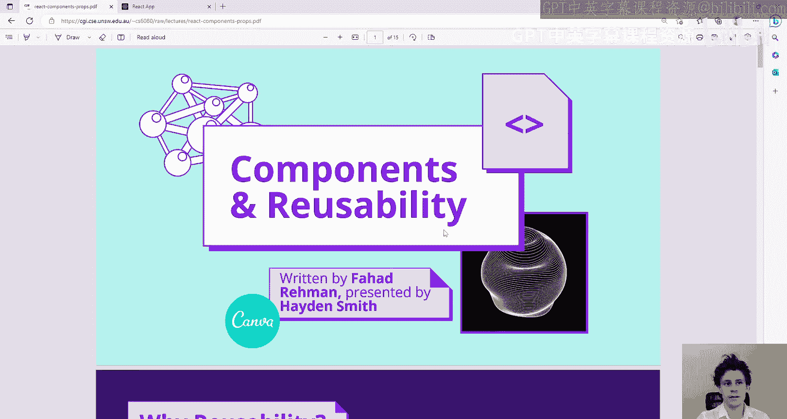

在本节课中，我们将要学习React中一个核心概念：**组件**与**属性**。我们将探讨如何通过创建可复用的UI组件来减少代码重复，提高开发效率，并保持应用的一致性。

## 概述

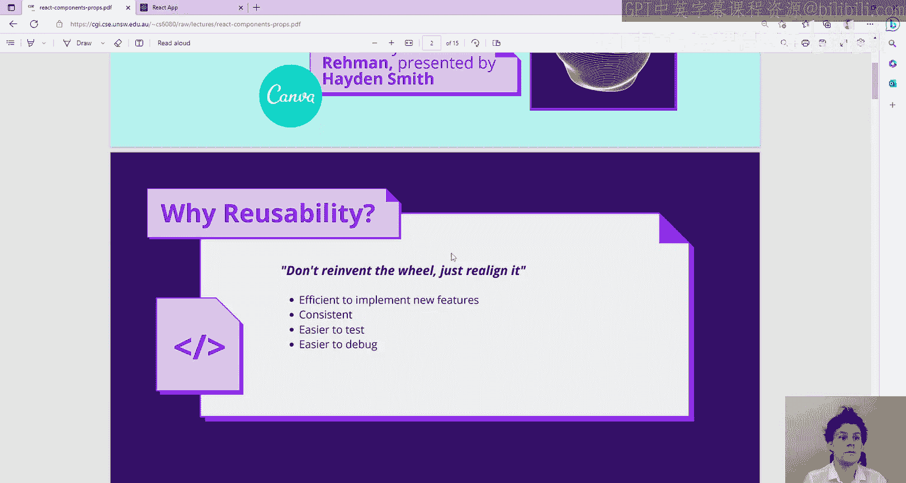

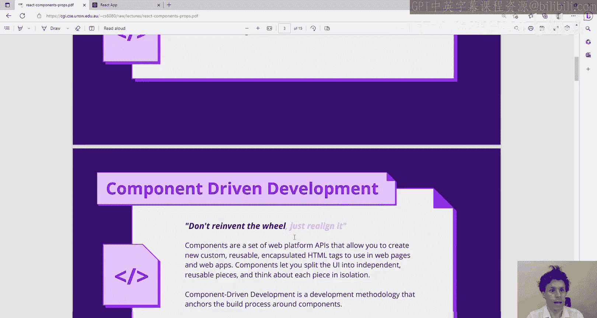

组件化开发是现代前端框架的核心思想。它允许我们将用户界面拆分成独立、可复用的代码片段。本节课将介绍如何创建React组件，以及如何使用属性来定制组件的行为和外观。

## 为什么需要可复用性？

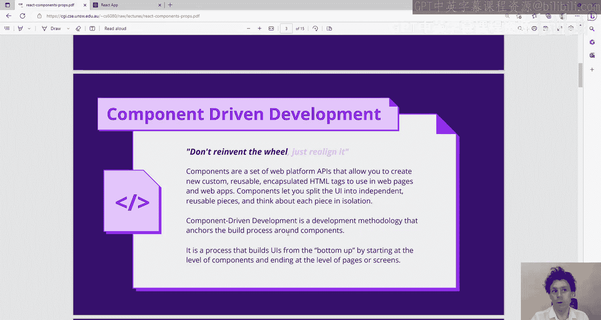

可复用性是一个基础概念，其核心在于避免重复造轮子。这有多个好处：
*   **提高效率**：重用已编写的代码可以节省开发时间。
*   **保证一致性**：拥有单一数据源意味着修改一处，所有使用该组件的地方都会同步更新。
*   **便于测试和调试**：同样因为单一数据源，问题更容易定位和修复。

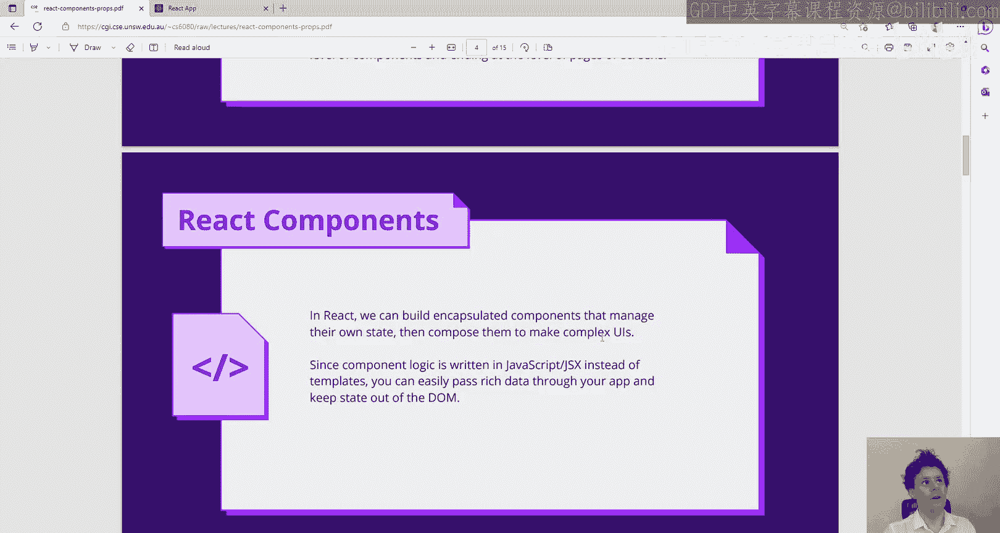

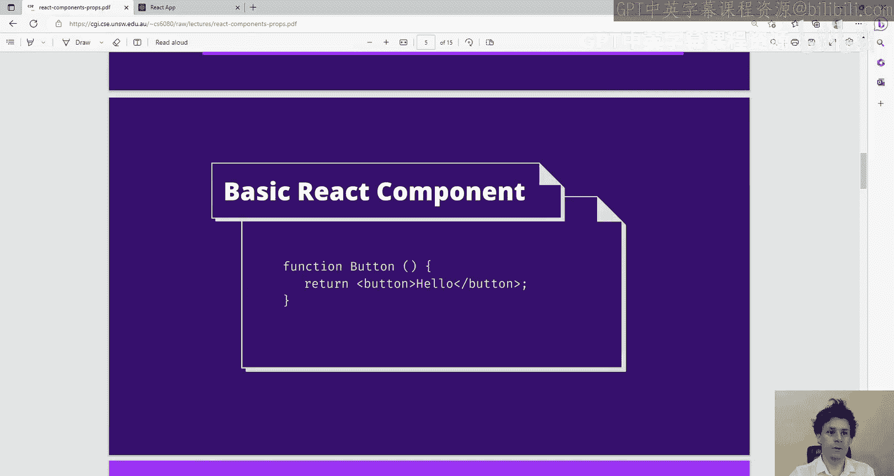

我们的目标是，将这些可复用性原则应用到前端代码中，特别是在React中，以减少重复。

## 什么是组件化开发？

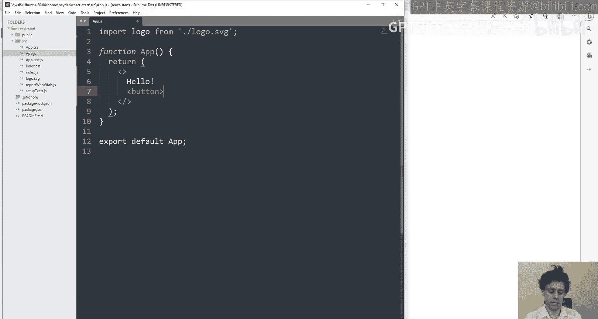

组件化开发，有时也称为组合模式，是一种将UI封装成独立“盒子”以便重用的方法。这与编程中提取公共值到变量，或提取公共逻辑到函数的思想一脉相承。在React中，我们将对UI组件做同样的事情。

React天生为组件化而设计，因此我们可以用最少的设置和已经熟悉的JavaScript/JSX语法来获得这种能力。它允许我们复用视觉元素和背后的逻辑。

## 创建基础React组件

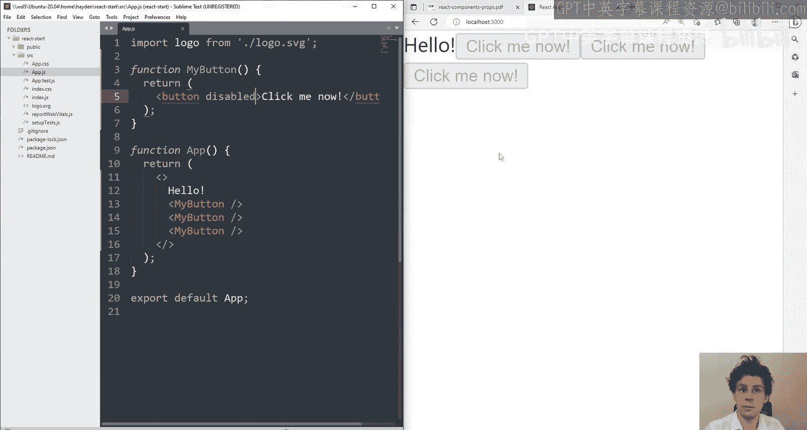

上一节我们介绍了组件化的理念，本节中我们来看看如何创建一个基础的React组件。

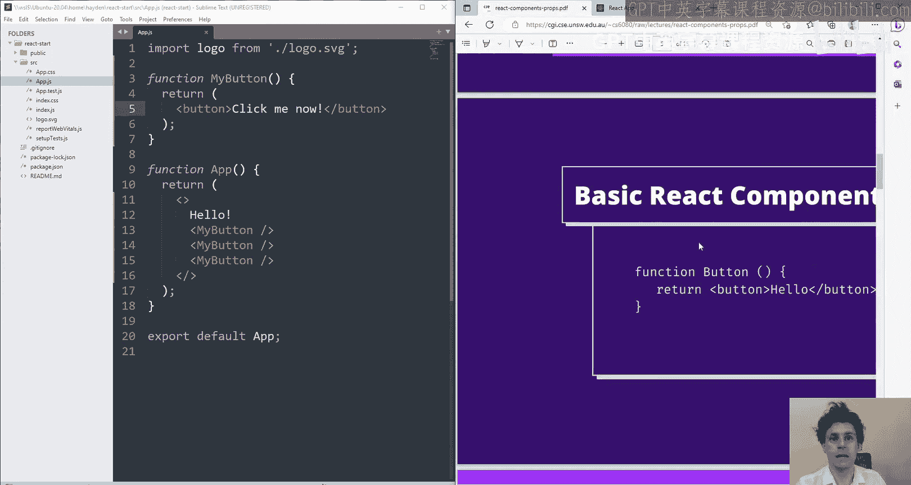

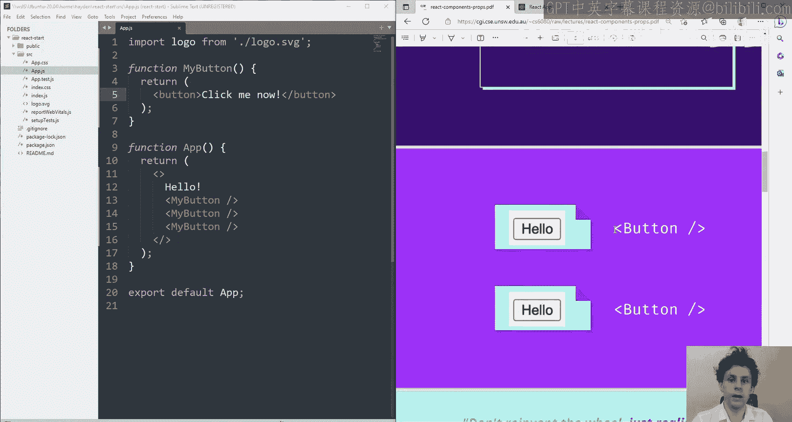

一个React组件本质上是一个返回JSX（类似HTML的语法）的JavaScript函数。即使是整个应用的主页，在React中也是一个组件（通常是`App.js`）。

假设我们有一个简单的按钮：

```jsx
<button>Click me</button>
```

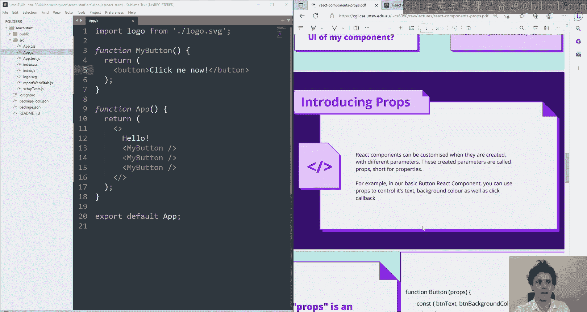

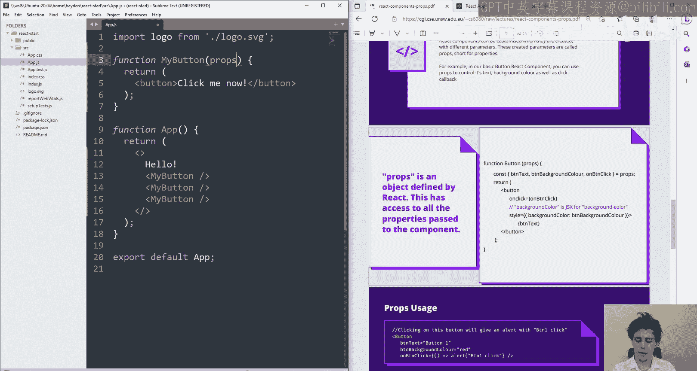

我们可以将这个按钮提取成一个独立的组件。首先，在同一个文件中创建一个函数：

```jsx
function MyButton() {
  return (
    <button>Click me</button>
  );
}
```

然后，在`App`组件中，我们可以像使用HTML标签一样使用`<MyButton />`：

```jsx
function App() {
  return (
    <div>
      <MyButton />
      <MyButton />
    </div>
  );
}
```

现在，我们就拥有了一个可复用的`MyButton`组件。更新组件内部的代码，所有使用它的地方都会自动更新。这非常有用，例如，如果想禁用所有按钮，只需在一个地方修改即可。

## 使用属性定制组件

虽然提取组件很好，但组件的内容和样式并不总是一成不变。例如，按钮可能需要显示不同的文本，或处于禁用状态。为了解决这个问题，React引入了**属性**。

属性允许我们在创建组件时传入不同的参数来定制它，其概念类似于函数的参数。

在React中，每个组件函数接收一个名为`props`的参数，它是一个包含了所有传入属性的对象。传递属性的方式类似于HTML属性：

```jsx
<MyButton text="Hayden" width="50" />
```

在`MyButton`组件内部，我们可以通过`props`对象来访问这些值：

```jsx
function MyButton(props) {
  return (
    <button style={{ width: props.width }}>
      {props.text}
    </button>
  );
}
```

现在，我们可以通过传入不同的`text`和`width`属性值来创建具有不同文本和宽度的按钮，同时保持了组件的可复用性。

### 属性的解构与`children`

为了使代码更简洁，我们通常使用解构语法直接从`props`中提取属性：

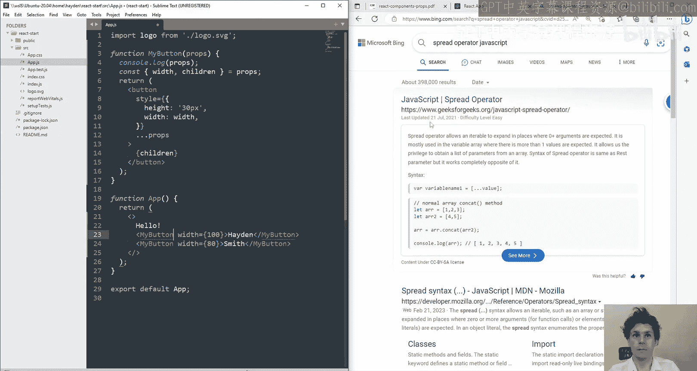

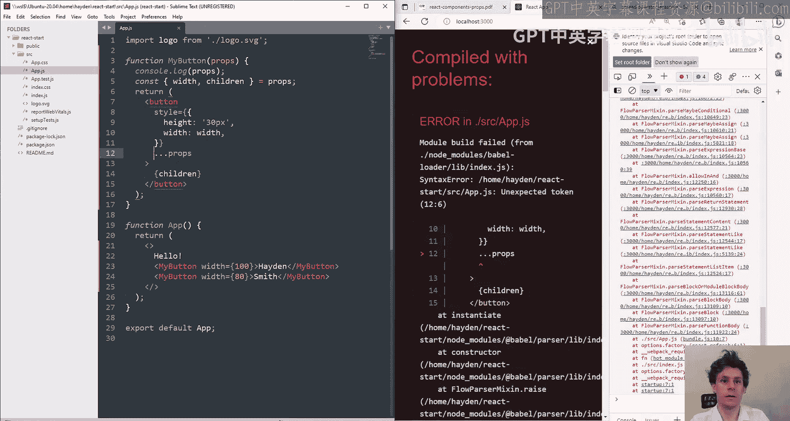

```jsx
function MyButton({ text, width }) {
  return (
    <button style={{ width: width }}>
      {text}
    </button>
  );
}
```

另一种常见的传递内容的方式是使用`children`。当像使用双标签HTML元素一样使用组件时，标签之间的内容会被传递给`props.children`。

```jsx
<MyButton>Hayden Smith</MyButton>
```

```jsx
function MyButton({ children, width }) {
  return (
    <button style={{ width: width }}>
      {children}
    </button>
  );
}
```

### 传递属性与展开运算符

有时，我们希望创建一个“包装”组件，它能将接收到的所有属性直接传递给底层的HTML元素。这时可以使用展开运算符`...`：

```jsx
function MyButton(props) {
  return (
    <button {...props}>
      {props.children}
    </button>
  );
}
```

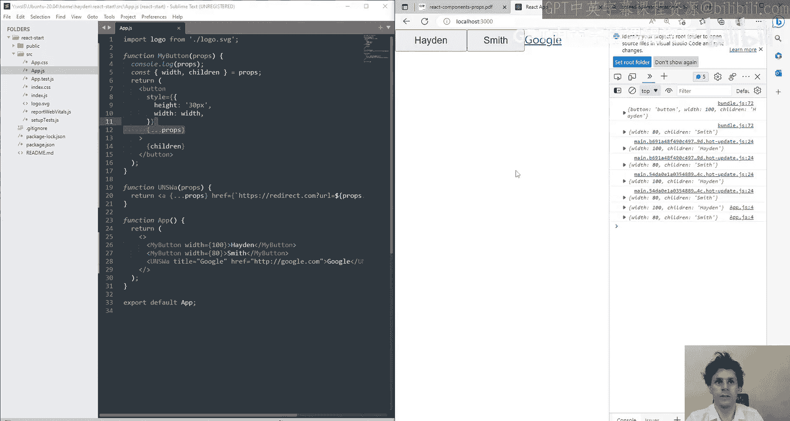

这样，使用`<MyButton disabled onClick={handleClick}>Click</MyButton>`时，`disabled`和`onClick`属性会自动添加到内部的`<button>`元素上。这种方法常用于创建基础组件的简单包装。

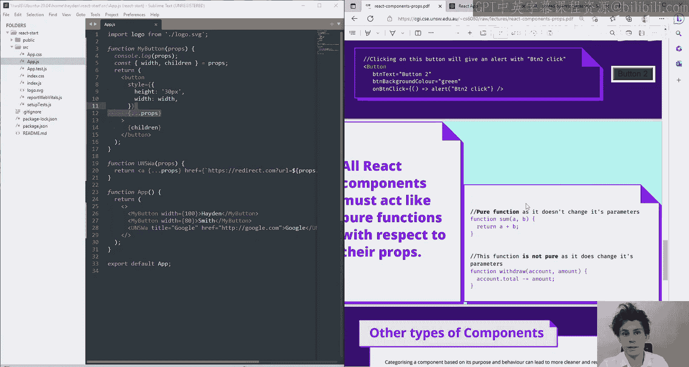

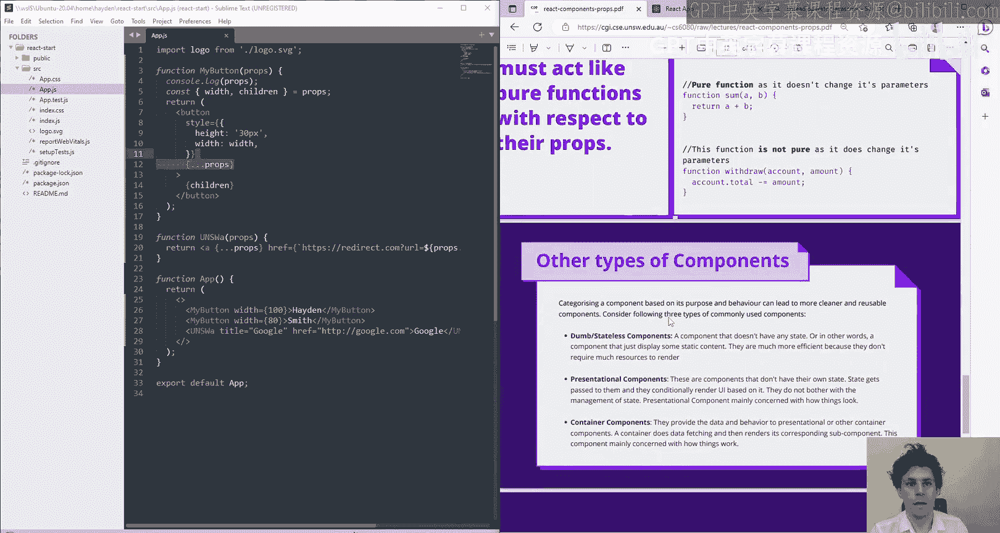

## 组件的类型与最佳实践

根据功能和复杂度，组件可以分为几种类型，但这并非严格的分类，而是帮助我们理解组件的不同用途：

1.  **无状态/展示型组件**：不接收`props`或仅用于静态展示，例如一个固定的图标组件。
2.  **展示型组件**：接收`props`来动态决定其内容和样式，这是我们目前主要讨论的类型。
3.  **容器/包装型组件**：通常用于封装逻辑、提供上下文或包装其他组件，例如我们上面提到的使用展开运算符的按钮包装器。

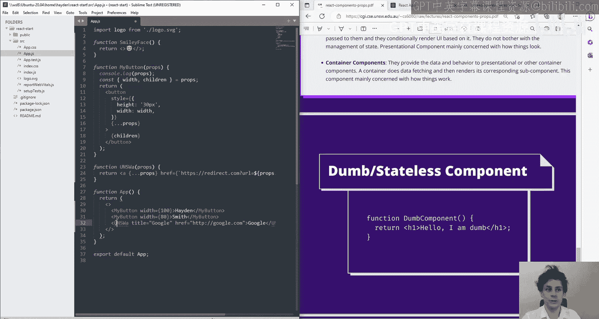

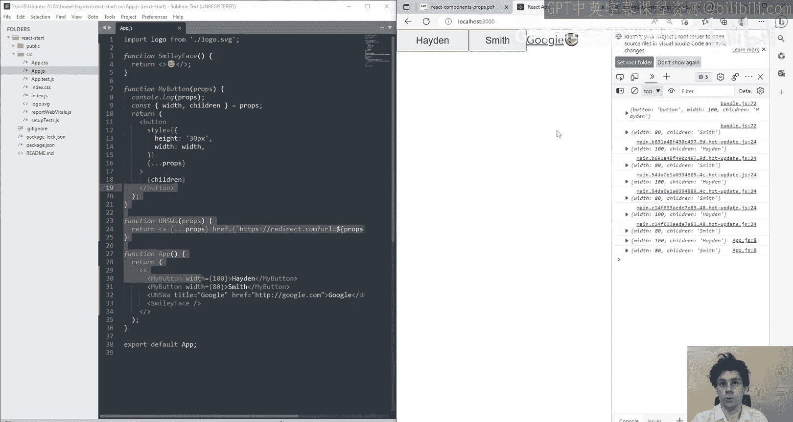

一个重要的最佳实践是：**将组件视为纯函数**。这意味着组件不应修改其输入参数（`props`），也不应产生副作用（如直接修改DOM或发起网络请求），对于给定的输入，应始终返回相同的输出。这使组件更可预测、易于测试。

## 组件的文件组织

随着项目变大，将每个组件放在单独的文件中是良好的实践。通常我们会创建一个`components`文件夹来存放所有组件。

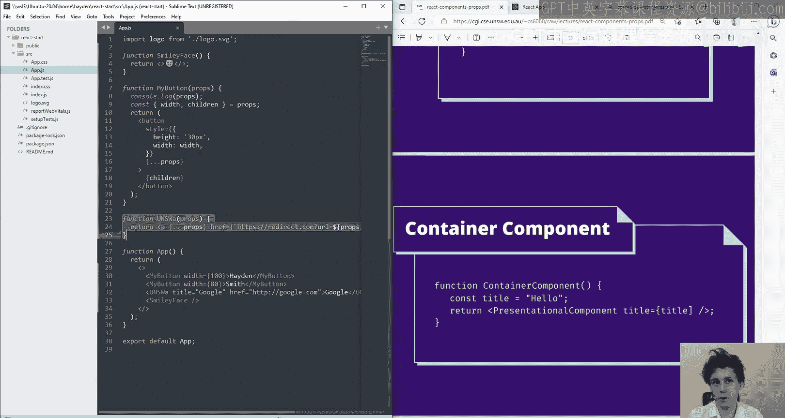

例如，将`MyButton`组件移动到`components/MyButton.js`：

```jsx
// components/MyButton.js
export default function MyButton({ children, width }) {
  return (
    <button style={{ width: width }}>
      {children}
    </button>
  );
}
```

然后在主文件中导入并使用：

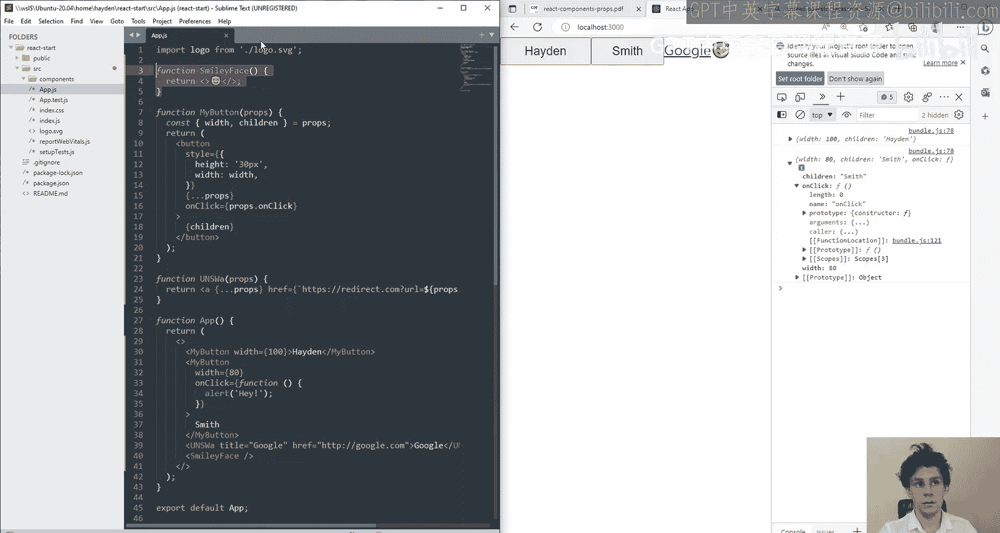

```jsx
// App.js
import MyButton from './components/MyButton';

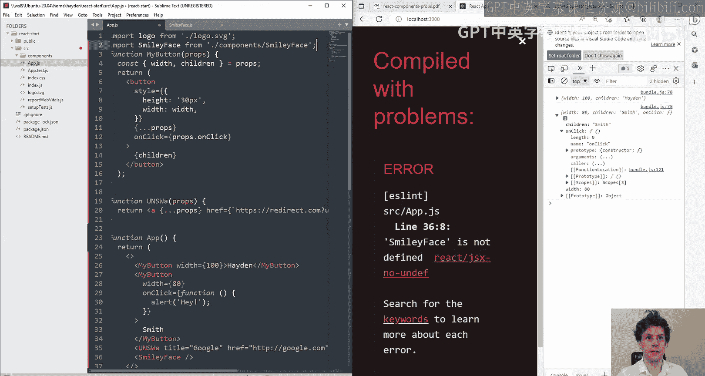

function App() {
  return (
    <div>
      <MyButton width="100">Button 1</MyButton>
    </div>
  );
}
```

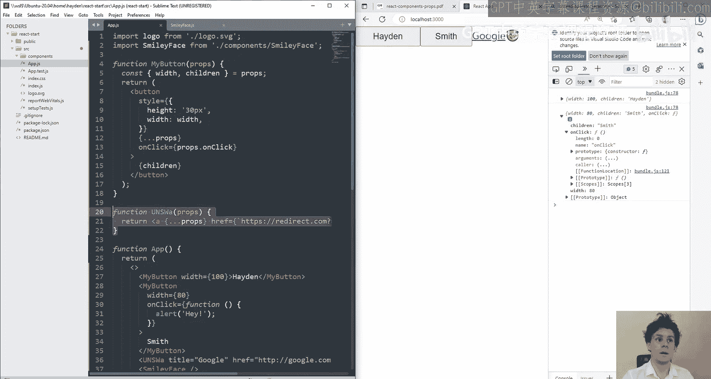

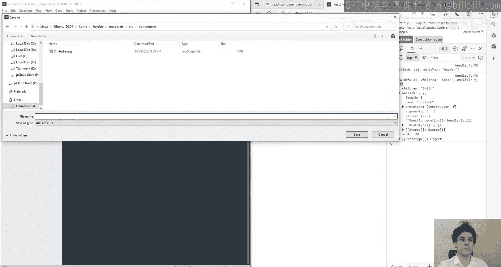

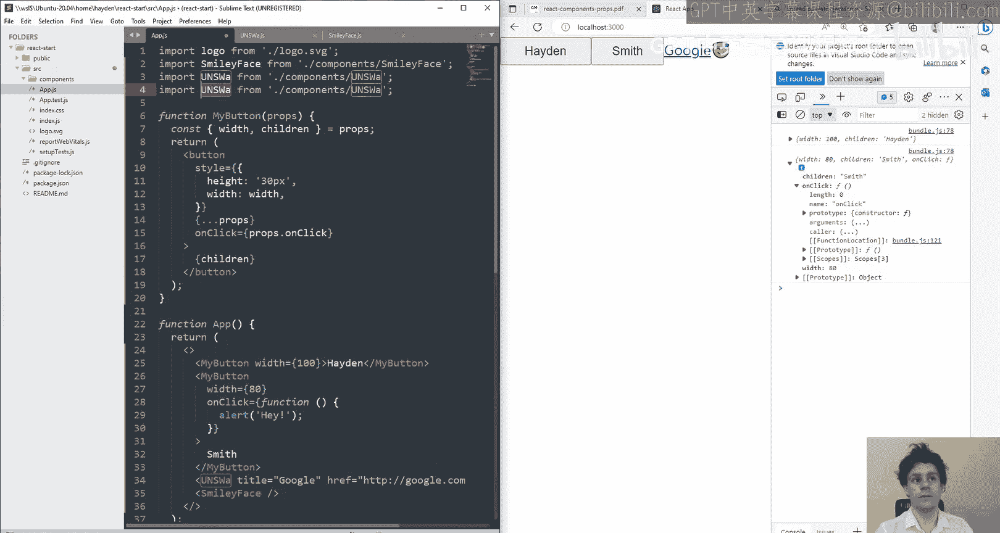

组件之间也可以嵌套使用，一个组件可以导入并渲染另一个组件，从而构建出复杂的UI树。

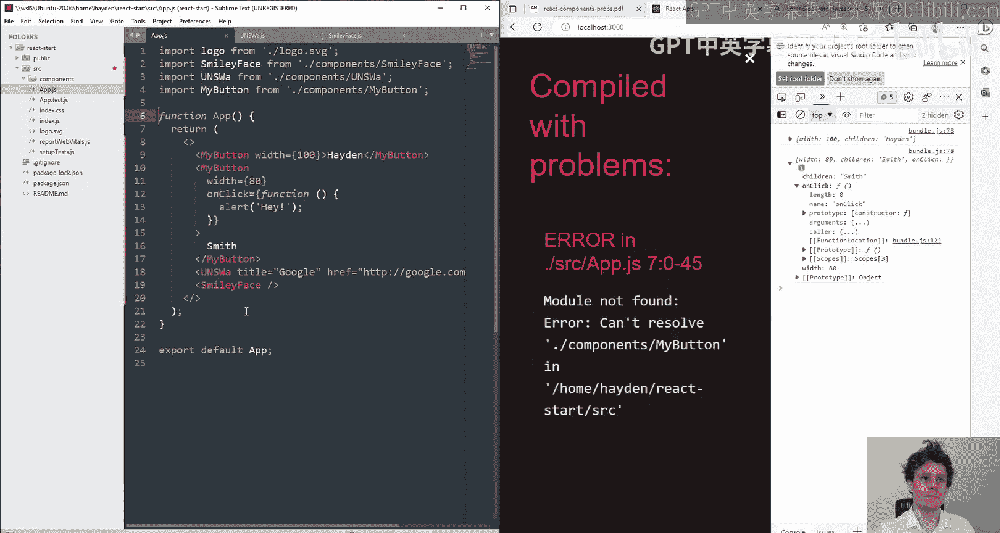

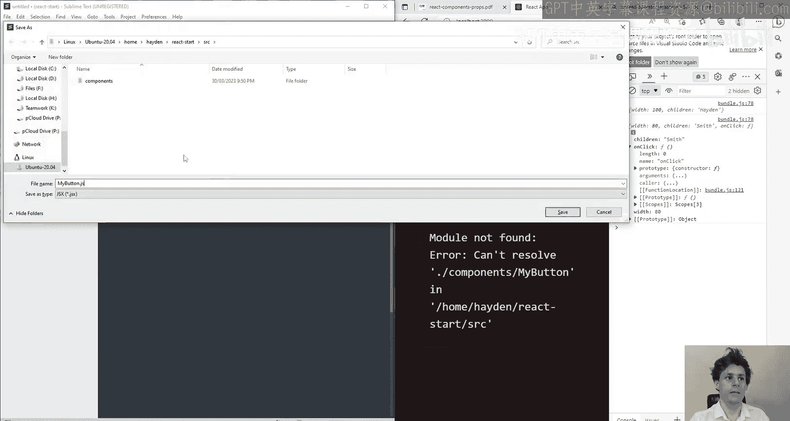

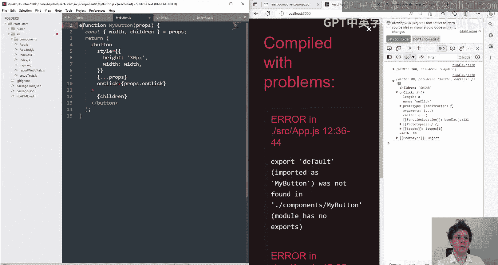

## 总结

本节课中我们一起学习了React组件与属性的核心知识。我们了解到：
*   组件是构建React应用的基石，是可复用的UI代码片段。
*   通过**属性**，我们可以向组件传递数据，实现组件的定制化。
*   使用**解构**和**`children`**可以让组件代码更清晰。
*   遵循**纯函数**原则和良好的**文件组织**习惯，能使项目更易于维护。

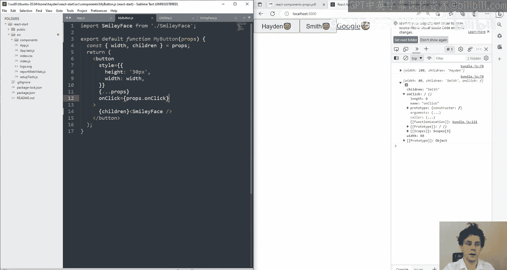

组件化开发让前端代码变得模块化、可复用且高效，是React强大功能的关键所在。