# 022：JavaScript 生态系统 🐻

在本节课中，我们将要学习 JavaScript 的生态系统。JavaScript 不仅仅是一门编程语言，它还是一个多层次的、应用广泛的技术集合。理解其不同组成部分（如语言标准、引擎和运行时环境）之间的区别与联系，对于掌握前端开发至关重要。

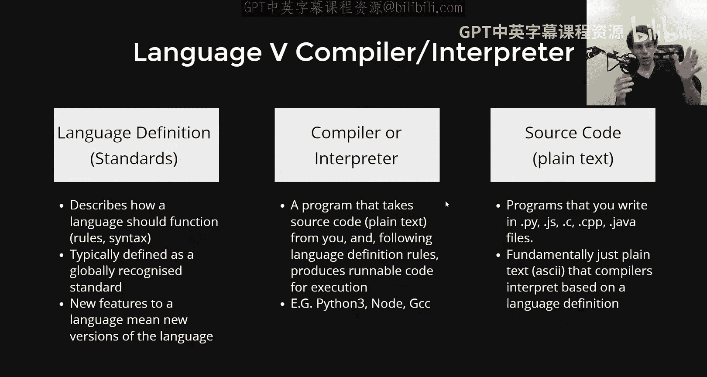

## 什么是 JavaScript？

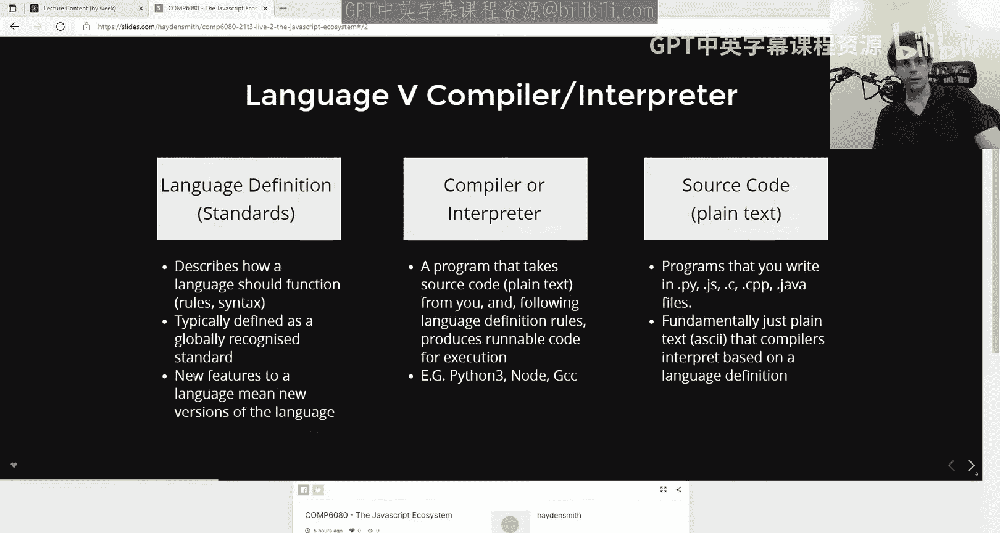

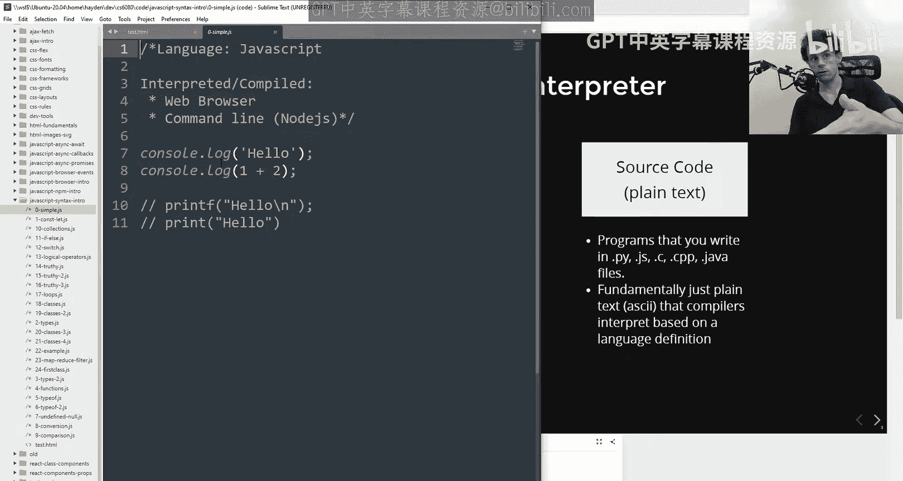

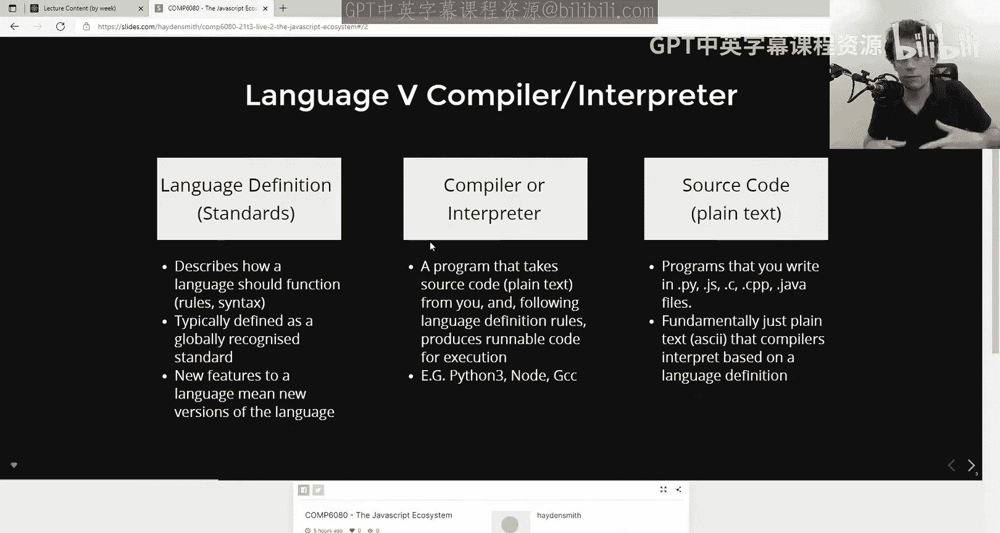

JavaScript 是一门编程语言。但它的运行方式与我们熟悉的其他语言（如 Python 或 C）有所不同。我们可以在网页浏览器中运行 JavaScript，也可以在命令行中使用 Node.js 运行它。这引出了几个问题：网页浏览器是编译器吗？Node.js 是什么？React 和 JavaScript 是同一个东西吗？为了解答这些疑问，我们需要退一步，看看运行 JavaScript 时到底发生了什么。

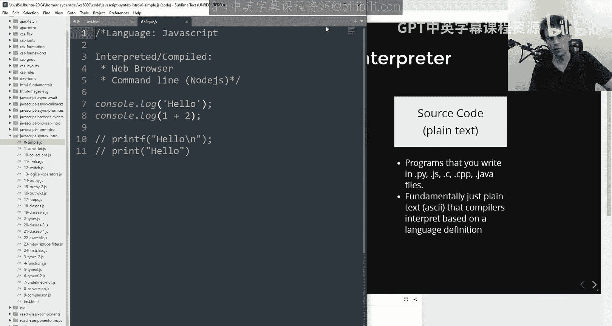

## 语言定义与源代码

当我们编写一段简单的 JavaScript 代码时，例如：
```javascript
console.log(“Hello World”);
```
这段文本就是**源代码**。它只是一系列遵循特定规则的 ASCII 字符。

源代码如何变成计算机上可运行的程序？这涉及到**语言定义**和**编译器/解释器**。

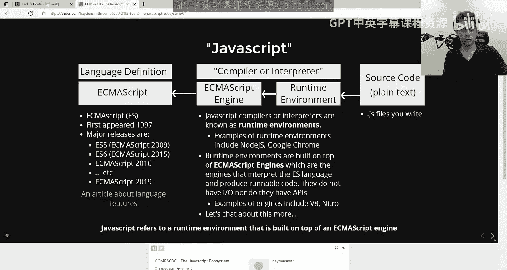

*   **语言定义**：本质上是一套规则手册，规定了哪些语法是有效的，哪些是无效的。例如，ECMAScript 就是 JavaScript 的语言标准。
*   **编译器/解释器**：是读取源代码、根据语言规则将其转换为可执行代码的程序。例如 Python 解释器、GCC（C 编译器）、Node.js 和网页浏览器中的 JavaScript 引擎。

上一节我们介绍了源代码和语言的基本概念，本节中我们来看看 JavaScript 的具体语言标准。

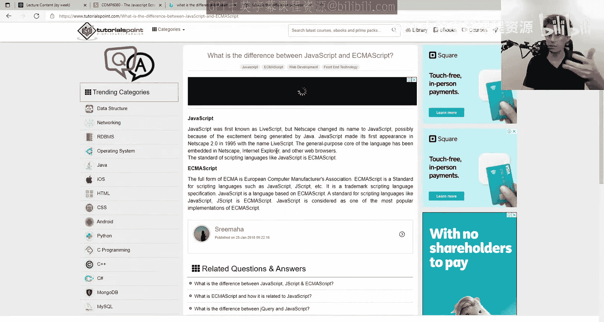

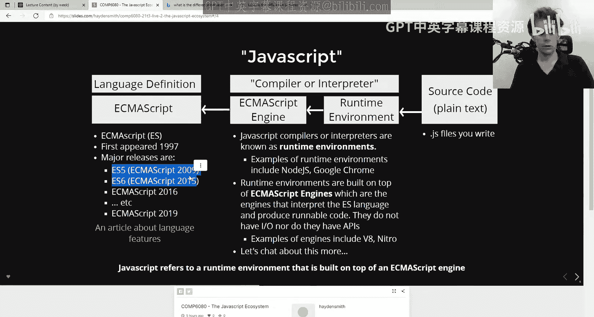

## ECMAScript：JavaScript 的语言标准

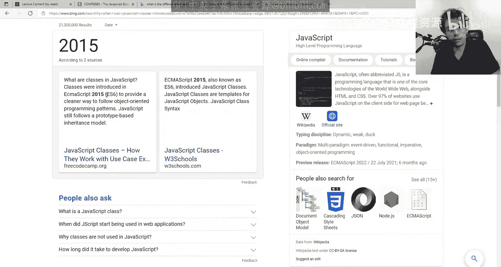

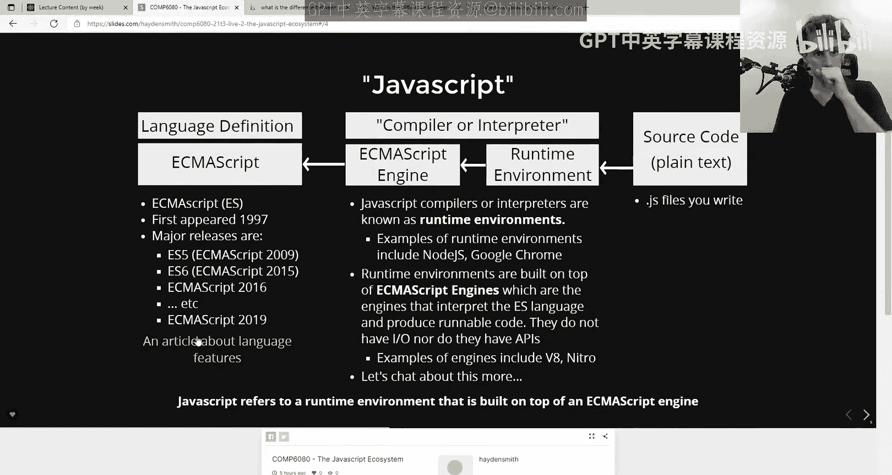

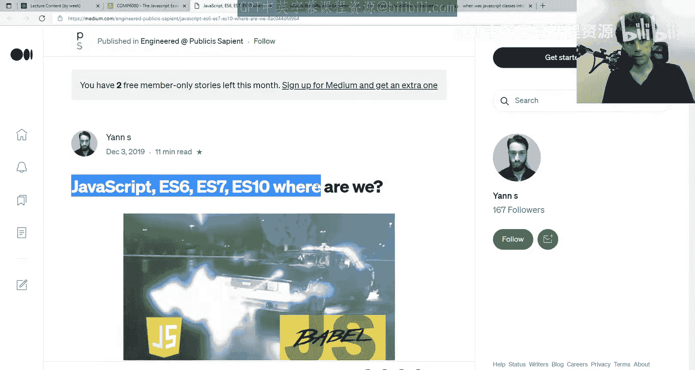

我们通常所说的 JavaScript，其正式名称是 **ECMAScript**，常缩写为 **ES**。你可以将 JavaScript 视为 ECMAScript 标准的一种实现。对于入门学习，我们可以认为两者是相同的。

ECMAScript 标准会不断更新，发布新的版本。了解这些版本很重要，因为它们引入了新的语言特性。

以下是几个关键的 ECMAScript 版本：
*   **ES5 (ECMAScript 2009)**：一个广泛支持且稳定的版本。
*   **ES6 (ECMAScript 2015)**：一个重大的更新，引入了`class`（类）、`let`/`const`、箭头函数等许多现代特性。
*   **ES2016, ES2017...**：ES6 之后，标准开始按年份命名，每年都会有增量更新。

例如，JavaScript 中的 `class` 关键字就是在 ES6 中引入的。在之前的课程中，我们学习的大多数语法都属于较旧的 ES 版本，只有类算是较新的特性。

理解了语言标准后，我们来看看这些标准是如何被“执行”的。

## 引擎与运行时环境

将 ECMAScript 代码变成实际行动的，是 **ECMAScript 引擎** 和 **运行时环境**。

*   **ECMAScript 引擎**：核心部件，负责理解和执行 JavaScript 代码。它处理`if`语句、函数调用、变量运算等基础逻辑。最著名的引擎是 Google 的 **V8**（用于 Chrome 和 Node.js）。
*   **运行时环境**：建立在引擎之上的一个层，提供了与特定平台交互的能力（API 或输入/输出层）。它决定了 JavaScript 能“做什么”。

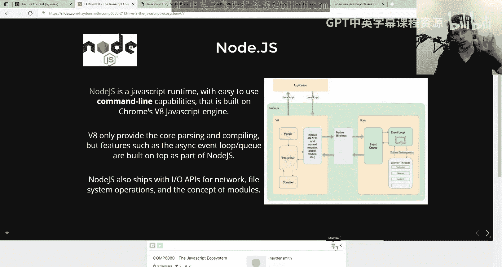

**关键区别**：引擎负责“如何计算”，运行时环境负责“能接触到什么”。

最常见的两种运行时环境是：
1.  **网页浏览器**（如 Chrome、Safari）：提供了操作网页（DOM）、获取窗口大小、发起网络请求等 API。
2.  **Node.js**：提供了操作文件系统、运行命令行工具、创建服务器等 API。

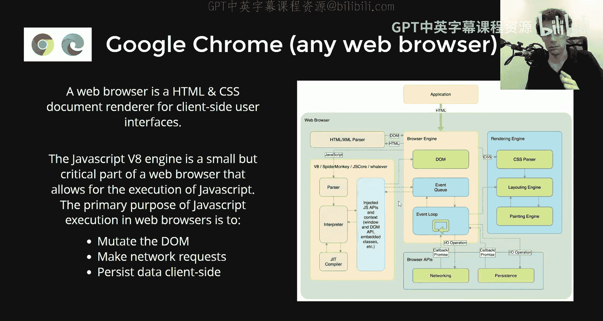

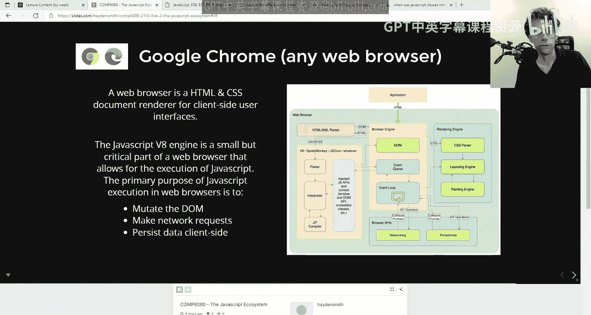

同一个 V8 引擎，可以分别用于 Chrome 浏览器和 Node.js 运行时，但它们提供的 API 完全不同。

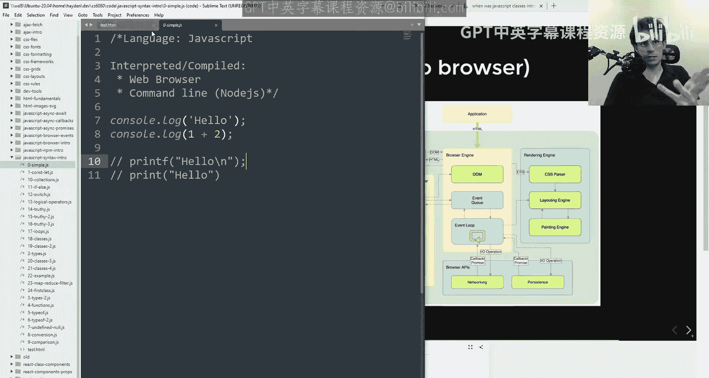

## 环境差异示例

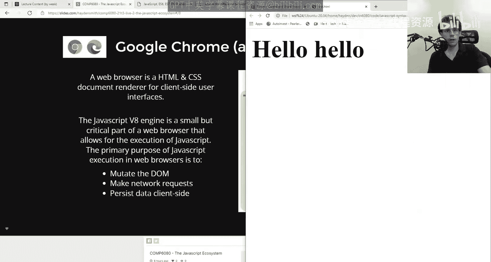

为了更直观地理解引擎和运行时环境的区别，让我们看两个具体的代码示例。

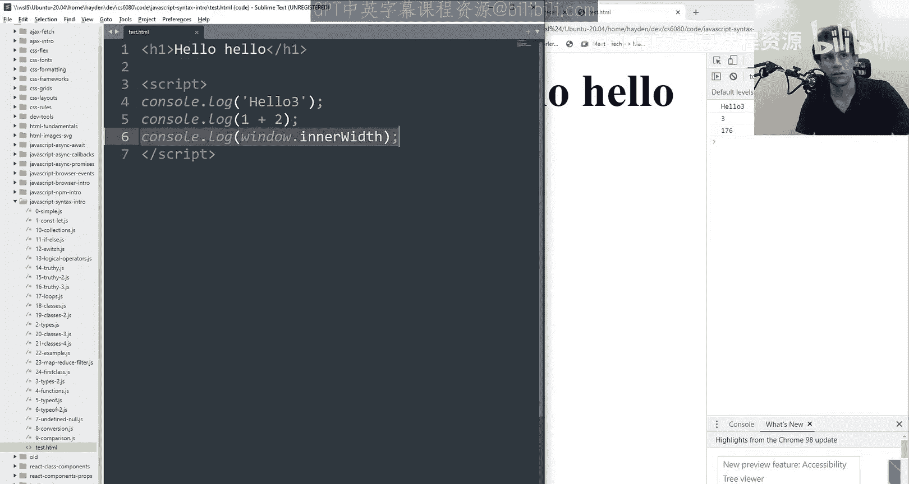

以下代码展示了浏览器运行时环境特有的 API（`window`对象）：
```javascript
// 这段代码只能在浏览器中运行
console.log(window.innerWidth); // 打印浏览器窗口的宽度
```
如果你在 Node.js 中运行上述代码，会得到 `ReferenceError: window is not defined` 的错误，因为 `window` 对象是浏览器环境提供的，不是 JavaScript 语言或 V8 引擎的一部分。

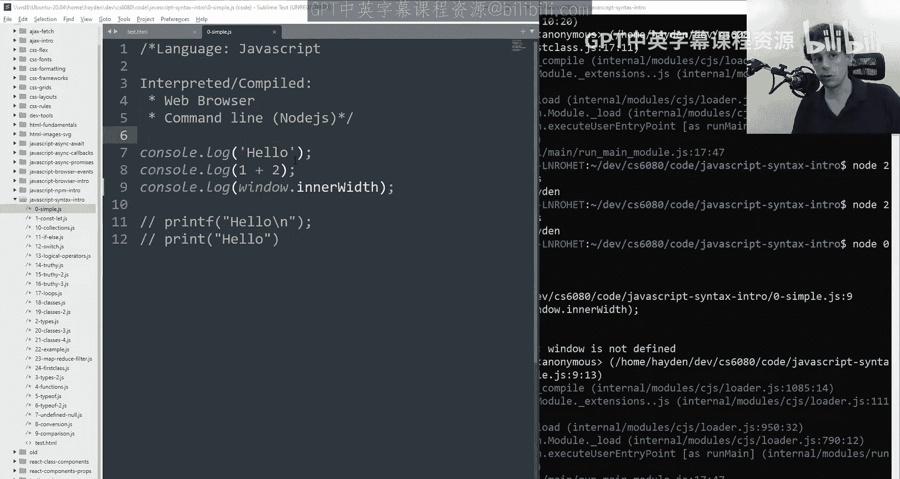

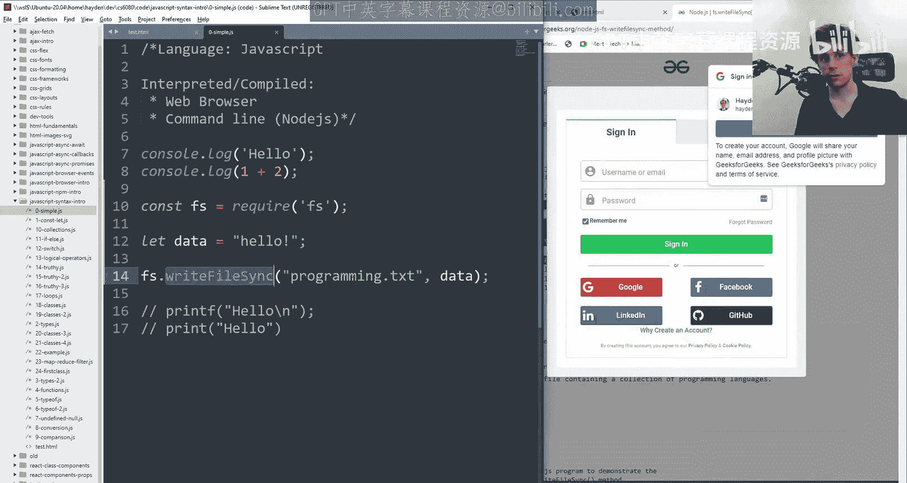

相反，以下代码展示了 Node.js 运行时环境特有的 API（文件系统模块）：
```javascript
// 这段代码只能在 Node.js 中运行
const fs = require(‘fs’); // ‘require’ 是 Node.js 的模块引入语法
fs.writeFileSync(‘hello.txt’, ‘Hello World’);
```
如果你在浏览器中运行上述代码，会得到 `ReferenceError: require is not defined` 的错误，因为 `require` 和 `fs` 模块是 Node.js 环境提供的。

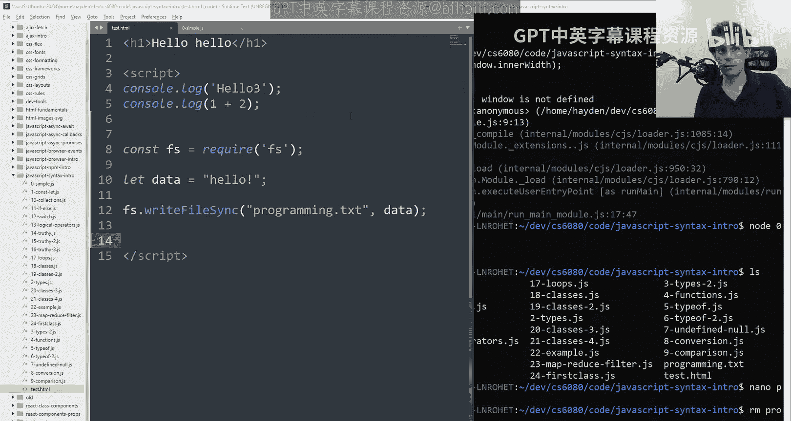

当然，也有一些功能在两个环境中都能实现，但实现方式可能不同，例如发起网络请求（在浏览器中用 `fetch`，在 Node.js 中可以用 `http` 模块）。这些功能同样是运行时环境提供的 API，而非语言核心。

## 总结

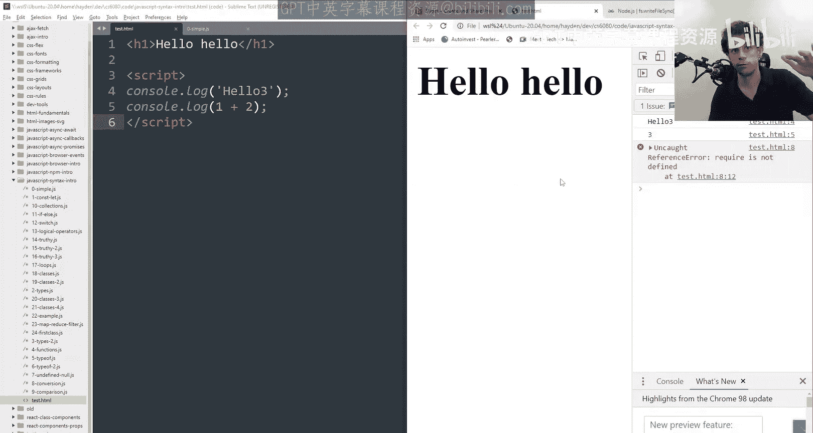

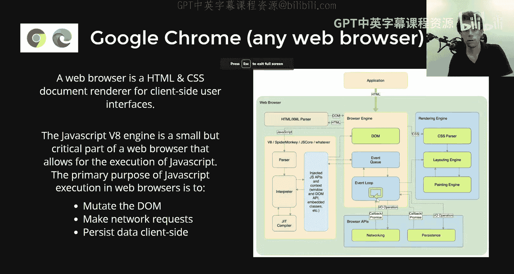

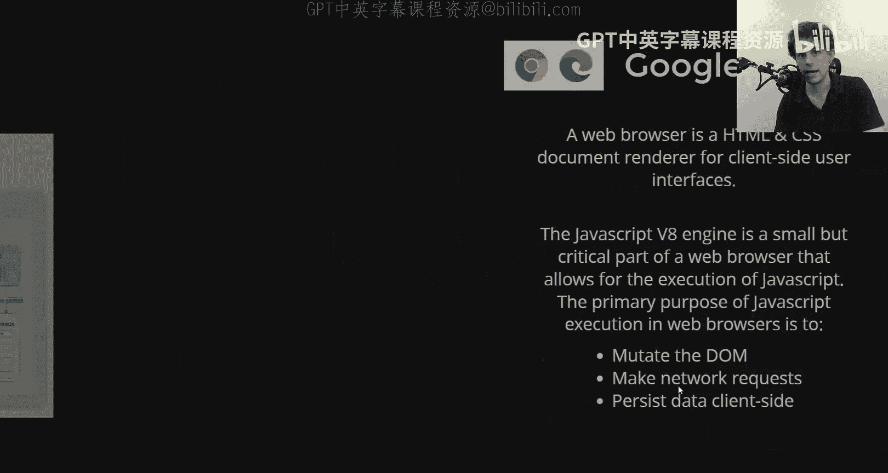

本节课中我们一起学习了 JavaScript 生态系统的核心组成部分：
1.  **ECMAScript** 是 JavaScript 的语言标准，有不同的版本（如 ES5、ES6）。
2.  **ECMAScript 引擎**（如 V8）是执行 JavaScript 代码的核心。
3.  **运行时环境**（如浏览器和 Node.js）建立在引擎之上，提供了特定的 API，使得 JavaScript 能在不同场景下发挥作用（操作网页或操作服务器/文件）。


理解这三者的关系，能帮助你明白为何同一段 JavaScript 代码在不同环境下可能有不同的表现和能力，这是成为合格 JavaScript 开发者的重要一步。在接下来的课程中，你将分别深入学习浏览器中的 JavaScript 和 Node.js 环境。