# 027：DOM 操作入门 🧩

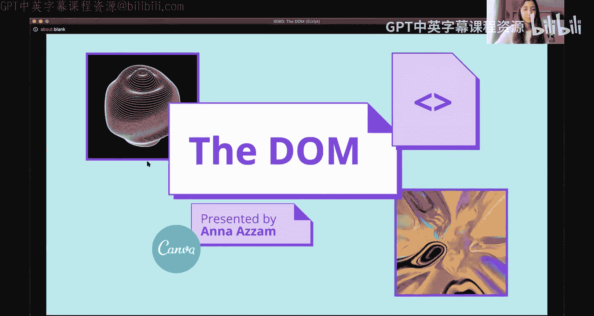

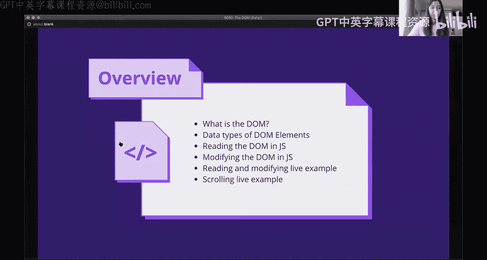

在本节课中，我们将学习文档对象模型（DOM）。我们将了解 DOM 是什么，探索它允许我们在 JavaScript 中做什么，并通过一些实时编码示例来实践。

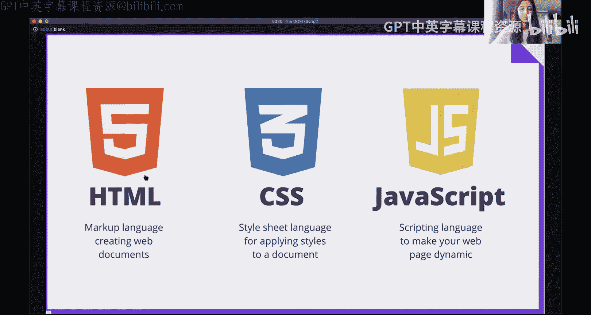

## 网页构成回顾

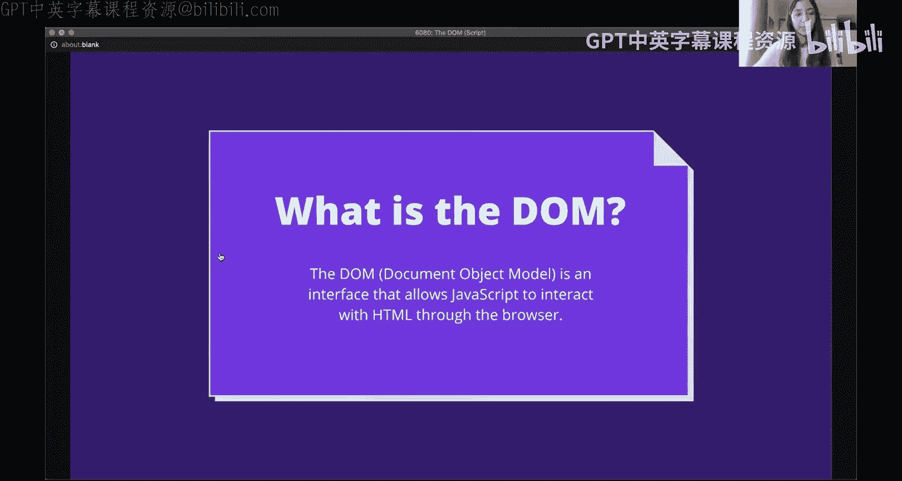

几乎所有网页都由 HTML、CSS 和 JavaScript 构成。
*   **HTML** 用于定义页面的标记和结构。
*   **CSS** 用于为文档中的元素应用样式。
*   **JavaScript** 可用于动态修改页面内容。

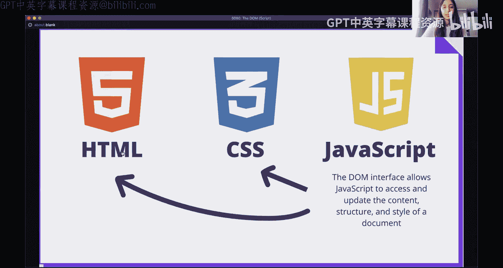

## 什么是 DOM？

DOM 代表文档对象模型。它是一个接口，允许 JavaScript 通过浏览器与 HTML 进行交互。你可以将 DOM 视为网页的一种表示形式。浏览器接收你编写的 HTML，解析它，然后将其转换为 DOM。

回顾上面的图表，DOM 就像一个接口，允许 JavaScript 访问和更新网页的内容，例如内容、结构和样式。

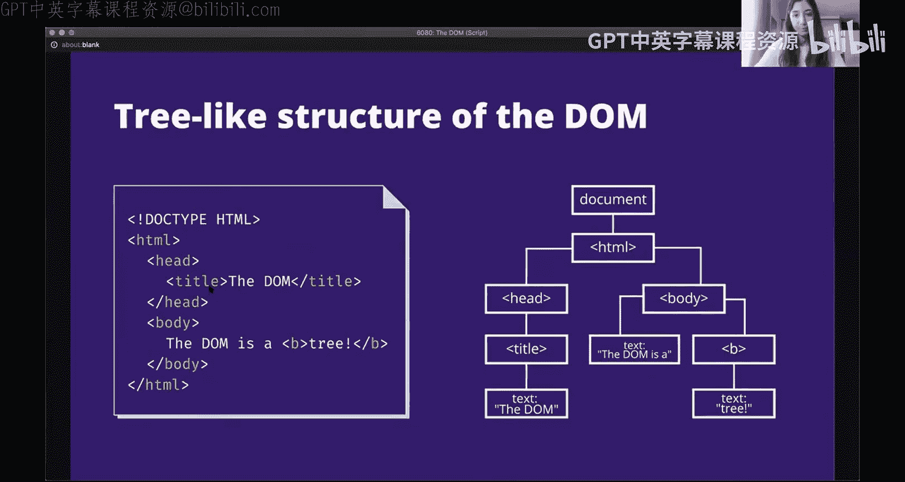

## DOM 的树状结构

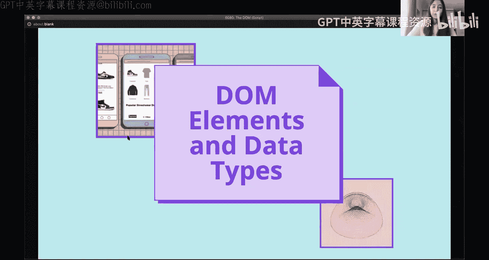

DOM 的一个特点是它具有树状结构。在 HTML 中，标签可以拥有子标签，形成树状结构。DOM 也是如此。

以下是一个基本 HTML 及其对应 DOM 的示例：

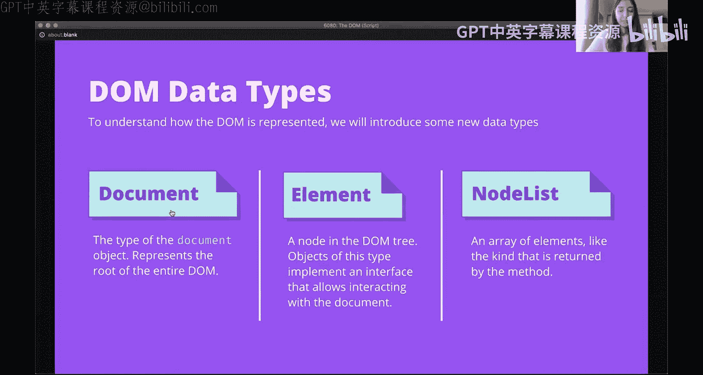

```html
<html>
  <head>
    <title>My Page</title>
  </head>
  <body>
    Hello
    <b>World</b>
  </body>
</html>
```

DOM 树的根节点称为 **`document`**。`document` 是客户端 JavaScript 中一个预定义的对象，代表整个 DOM 的根。

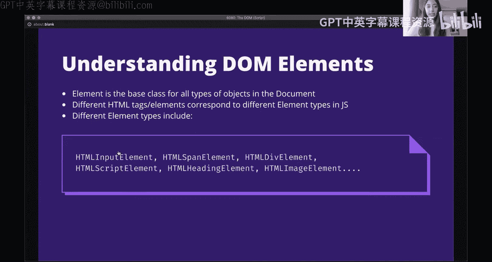

HTML 中最外层的 `<html>` 标签是 DOM 树的第一个子节点。`<body>` 标签有两个子节点：一些文本和一个 `<b>` 标签，这在 DOM 树中表示为两个子节点。

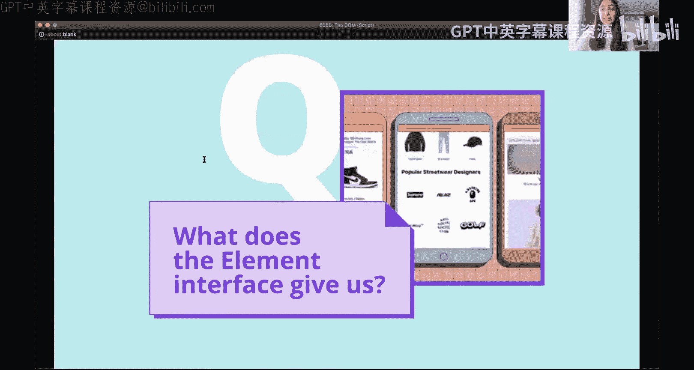

## DOM 数据类型

上一节提到了 `document` 对象。`document` 对象是整个 DOM 树的根，其类型就是 `Document`。

接下来是 `Element` 类型。`Element` 是 DOM 树中所有节点的类型。这个接口可用于操作页面上的元素并获取其信息。

最后是 `NodeList` 类型。它是一个类似数组的元素结构，由 `querySelectorAll` 等方法返回，我们稍后会看到。

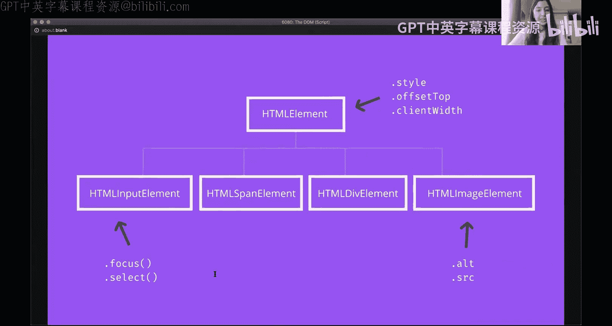

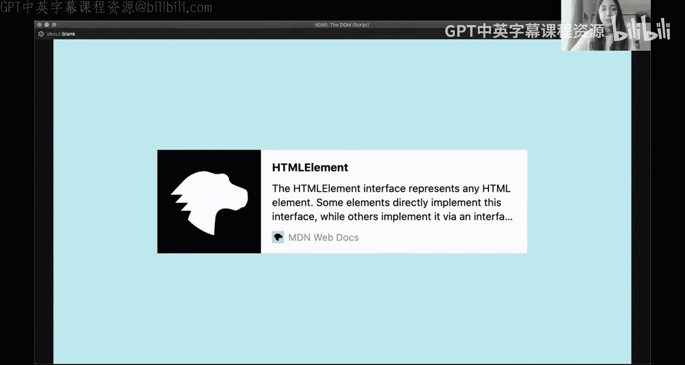

## 深入了解 Element 类型

`Element` 是 DOM 中所有元素的类型。例如，页面上的一个 `<div>` 在 DOM 中就是一个 `Element`。

但 JavaScript 会根据我们拥有的 HTML 元素类型，提供更具体的类型。例如：
*   一个 `<div>` 将是 `HTMLDivElement`。
*   一个 `<input>` 标签将是 `HTMLInputElement`。

有数十种这样的特定元素类型。基本上，`Element` 是所有 DOM 对象类型的基类，而像 `HTMLElement` 这样的类型是其子类型。它们拥有 `Element` 的所有属性和方法，并根据元素类型增加了一些额外功能。

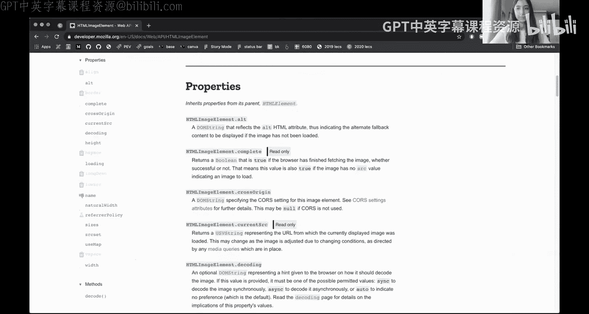

## Element 接口的功能

`Element` 接口具有许多属性和方法，我们可以使用它们来读写 DOM。

我们可以读取元素的大小、位置、颜色或其中的文本。我们也可以写入内容，例如更改样式，甚至添加和移除元素。

以下是 `Element` 的一些属性示例：
*   **`style`**：用于访问或修改内联样式，覆盖 CSS。
*   **`offsetLeft`** 和 **`offsetTop`**：获取元素的位置。
*   **`clientWidth`** 和 **`clientHeight`**：获取元素的大小。

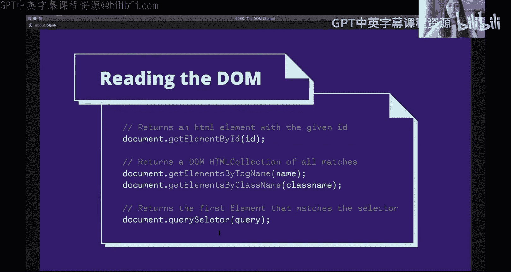

如前所述，不同的 HTML 标签类型在 DOM 中有不同的类型，它们添加了额外的属性和方法。例如：
*   `HTMLImageElement` 拥有 `alt` 属性（存储图像的替代文本）和 `src` 属性（图像的来源）。
*   `HTMLInputElement` 拥有 `focus()` 方法（聚焦文本框）和 `select()` 方法（选择输入框中的所有文本并聚焦）。

## 参考 MDN 文档

MDN 文档是查找不同类型信息的非常有用的资源。例如，`HTMLElement` 的页面列出了它从 `Element` 继承的所有属性，以及它自己添加的许多其他属性，如 `draggable`、`hidden`、`offsetHeight` 等。它还列出了事件处理程序和一些方法，如 `blur()`、`click()` 和 `focus()`。

在侧边栏中，你可以看到 `HTMLElement` 的所有子类型，它们代表了所有不同的 HTML 标签。

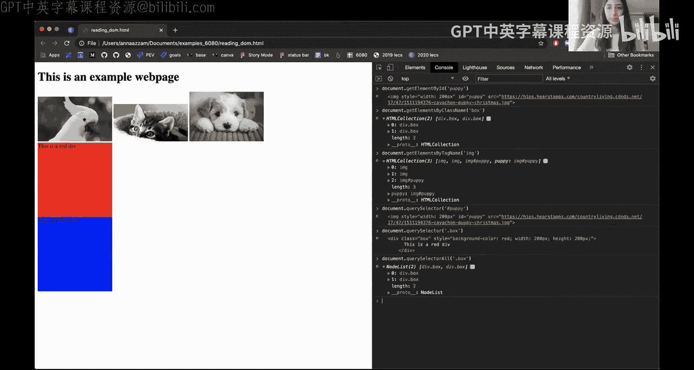

## 如何获取 DOM 元素

我们已经看到如何在 JavaScript 中读取和操作 DOM 元素，但如何实际获取这些元素呢？

有几种方法可以检索 DOM 元素。本质上，当你知道元素的 ID、类名或标签类型时，可以使用这些信息来检索它们。

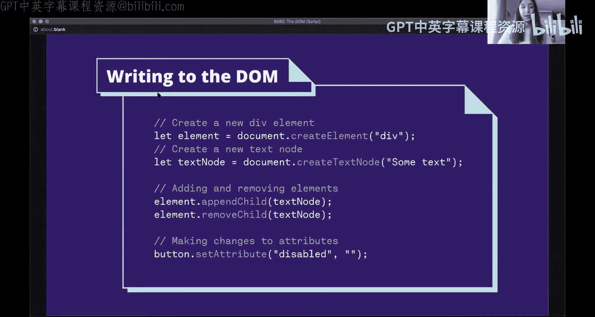

以下是几种方法：
*   **`document.getElementById(id)`**：使用元素的 ID 属性。返回单个节点，因为 ID 在 HTML 中是唯一的。
*   **`document.getElementsByTagName(tagName)`**：接受标签名（如 `'div'` 或 `'img'`），返回文档中所有具有该标签名的元素。
*   **`document.getElementsByClassName(className)`**：与 `getElementById` 类似，但返回所有匹配的元素，因为类名不是唯一的。
*   **`document.querySelector(selector)`**：返回与提供的选择器查询字符串匹配的第一个元素。
*   **`document.querySelectorAll(selector)`**：返回与提供的选择器查询字符串匹配的所有元素。

选择器字符串的写法与 CSS 选择器相同：
*   按 ID 查询：使用 `#`，例如 `#myId`。
*   按类名查询：使用 `.`，例如 `.myClass`。
*   按标签名查询：直接使用标签名，例如 `div`。

## 如何写入 DOM

上一节我们学习了如何读取 DOM，现在来看看如何写入 DOM。

第一种方法是 **`document.createElement(tagName)`**。它用于创建一个元素作为变量，但不会将其插入到 DOM 中。它只创建元素，并接受标签名作为参数。例如：`document.createElement('div')`。

我们也可以用类似的方式创建文本节点：**`document.createTextNode(string)`**。

我们还有将节点添加到 DOM 中的方法。如果你有一个元素，可以使用 **`element.appendChild(newNode)`** 来添加新元素作为其子节点。

我们还可以设置元素的属性。例如，如果有一个按钮，可以在 JavaScript 中轻松设置属性，如添加 `disabled` 属性或 `id` 属性。

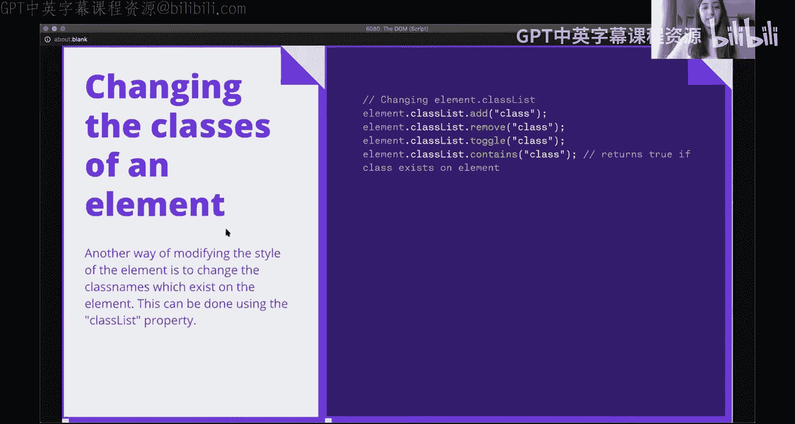

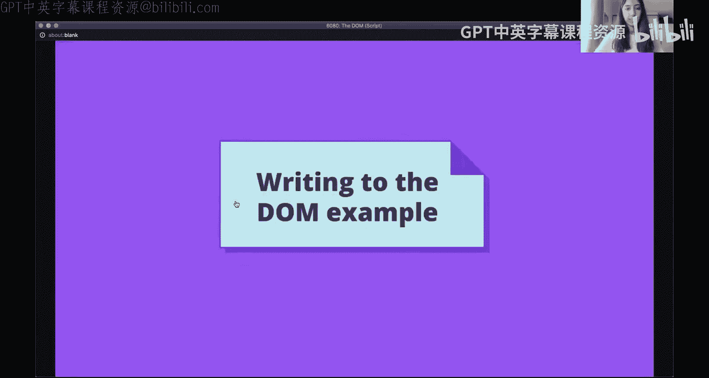

## 修改元素样式

除了向 DOM 添加新元素和修改其属性外，我们还可以更改元素的样式，类似于动态更改 CSS 样式。

我们通过元素的 **`style`** 属性来实现。这个 `style` 属性对应于 HTML 元素的 `style` 属性。通过 `element.style` 后跟任何 CSS 属性名，可以访问或修改该样式。

例如：
*   `element.style.left = '50px';` 将 `left` 样式属性设置为 50 像素。
*   要递增 `left` 值，可以先获取当前值，进行计算，然后重新设置。
*   `element.style.backgroundColor = 'red';` 将背景颜色改为红色。注意，在 JavaScript 中，CSS 属性名使用驼峰命名法（如 `backgroundColor`），而不是连字符（如 `background-color`）。

需要注意的是，`element.style.left` 只有在通过内联样式或脚本设置了 `left` 属性时才会存在。如果 `left` 值仅设置在 CSS 中，尝试检索 `element.style.left` 将无效。

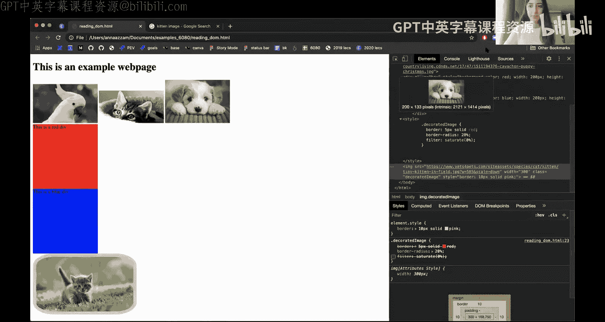

要获取元素的实际样式（即使不是通过内联样式或脚本设置的），可以使用 **`window.getComputedStyle(element)`**。然后，可以使用返回的计算样式对象的 `getPropertyValue` 方法来检索任何样式属性的值。

另一种修改样式的方法是更改元素上存在的类名，这可以通过 **`classList`** 属性来完成。例如：
*   `element.classList.add('className')`：添加一个类。
*   `element.classList.remove('className')`：移除一个类。
*   `element.classList.toggle('className')`：切换一个类（如果存在则移除，不存在则添加）。
*   `element.classList.contains('className')`：检查元素是否包含某个类。

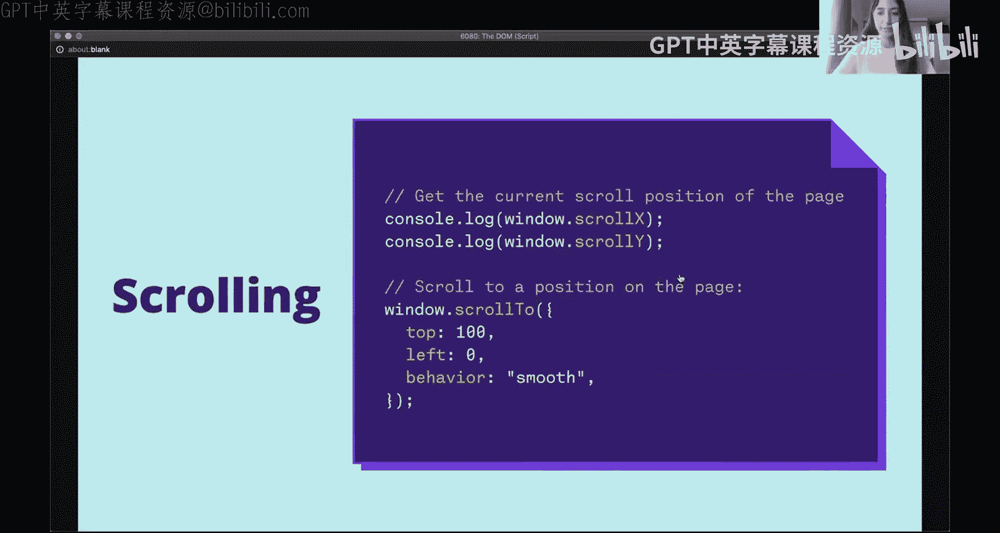

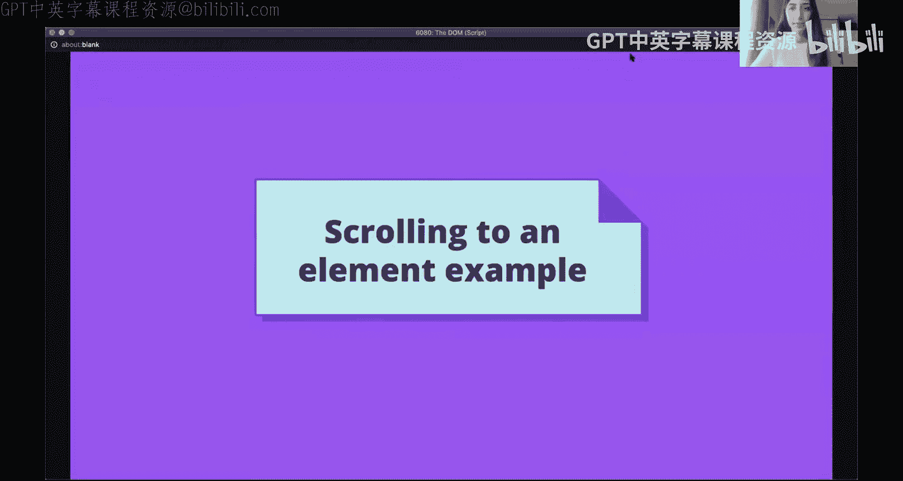

## 滚动页面

在 JavaScript 中，我们还能做的一件很酷的事情是手动将页面滚动到特定位置。

`window` 对象提供了 **`scrollX`** 和 **`scrollY`**，它们告诉我们页面的当前滚动位置。

此外，它还提供了 **`scrollTo()`** 方法。这个方法接受一个 `top` 位置、一个 `left` 位置和一个 `behavior` 参数（如 `'smooth'` 或 `'auto'`），允许我们通过 JavaScript 滚动到页面上的某个位置。

例如，要滚动到一个元素，可以先使用 `getBoundingClientRect()` 方法获取该元素的位置信息，然后调用 `window.scrollTo()`。

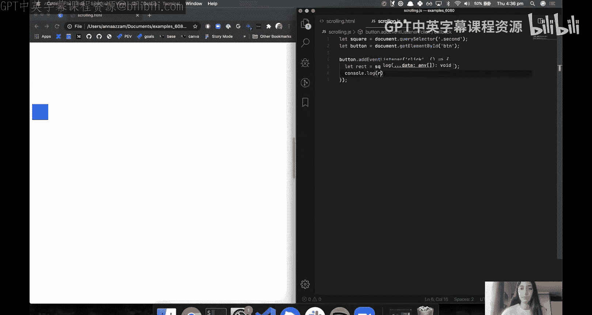

`getBoundingClientRect()` 返回一个 `DOMRect` 对象，它提供了元素的大小和位置信息，例如 `top` 值表示元素顶部距离当前视口顶部的像素距离。

将 `scrollTo` 的 `behavior` 参数设置为 `'smooth'` 可以实现平滑滚动动画。

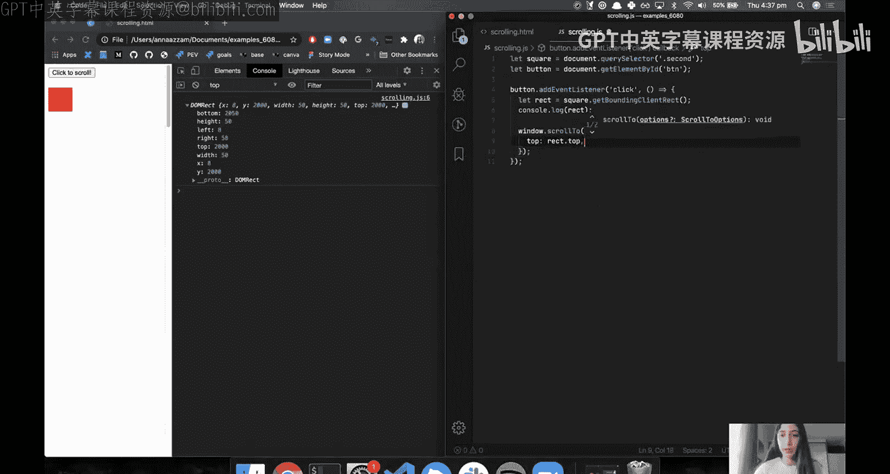

## 总结

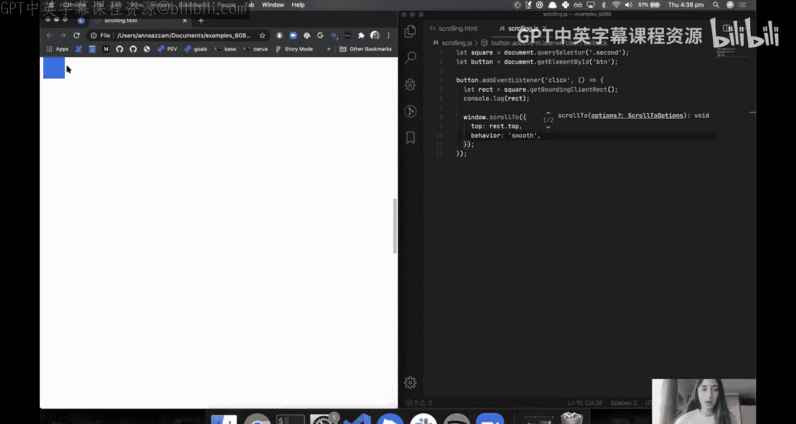

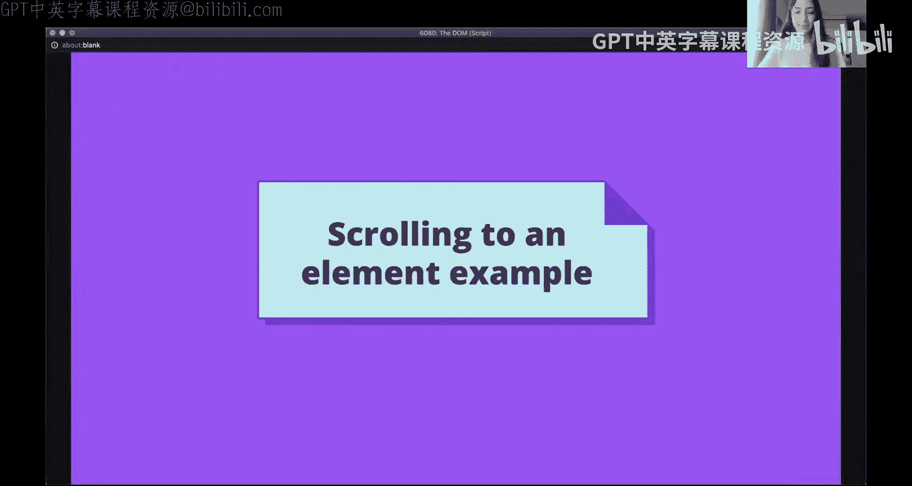

在本节课中，我们一起学习了文档对象模型（DOM）。我们了解了 DOM 是网页的编程接口，允许 JavaScript 动态访问和更新内容、结构和样式。我们探讨了 DOM 的树状结构、关键数据类型（如 `Document`、`Element` 和 `NodeList`），并学习了如何使用各种方法（如 `getElementById`、`querySelector`）来读取 DOM 元素。我们还实践了如何创建新元素、修改元素属性和样式，以及如何将它们添加到 DOM 中。最后，我们了解了如何使用 `scrollTo` 方法控制页面滚动。掌握这些基础知识是进行动态网页交互和构建丰富用户体验的关键。