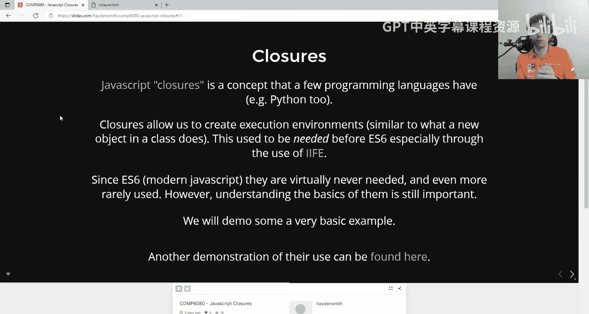
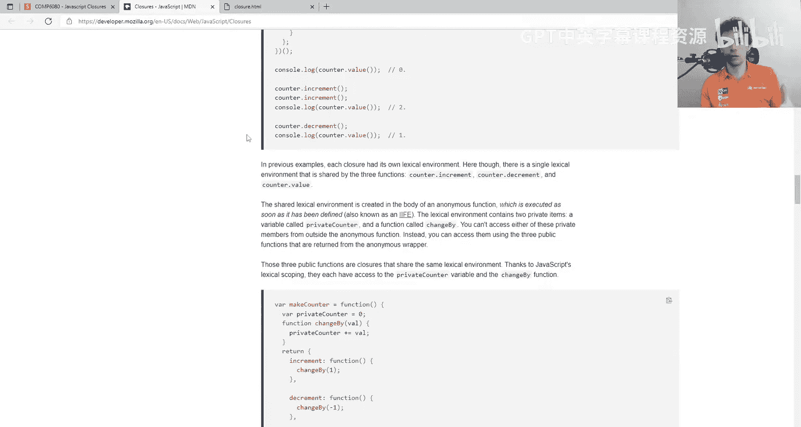
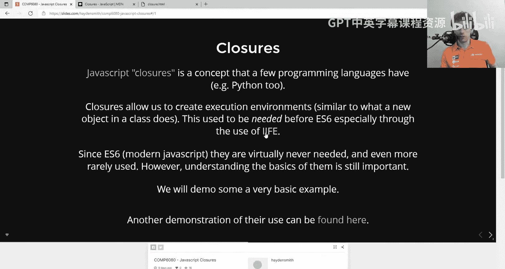
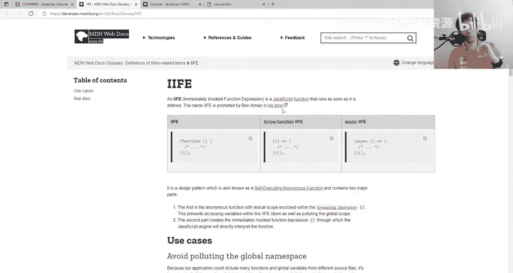
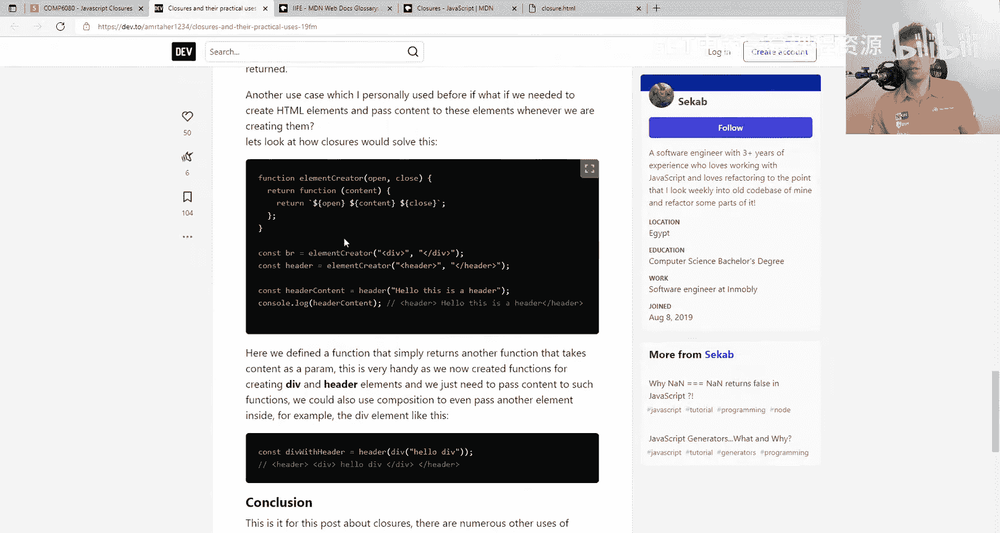
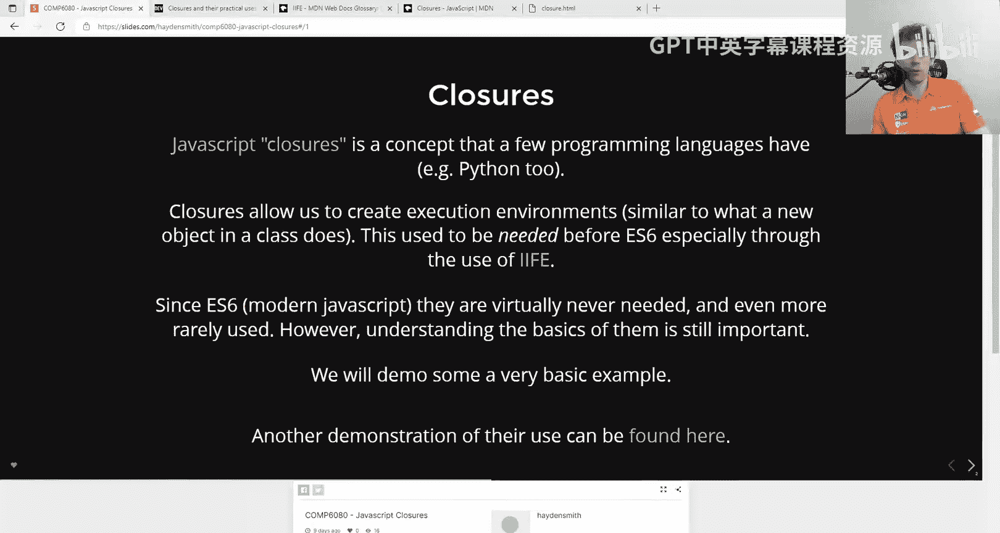
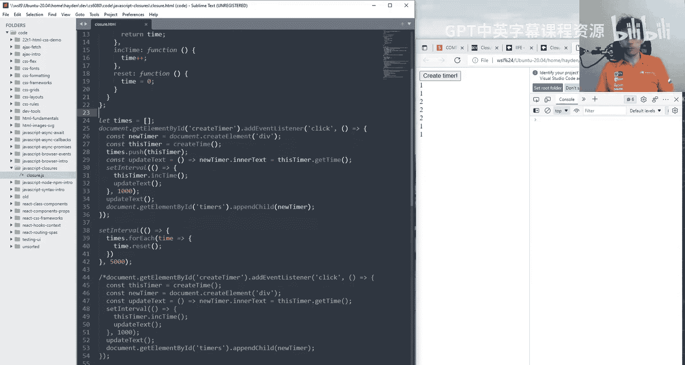

# 029：JavaScript 闭包 🐻

在本节课中，我们将要学习 JavaScript 中的一个核心概念：闭包。我们将通过一个创建动态计时器的例子，来理解闭包是什么、它如何工作，以及它在现代 JavaScript 开发中的角色。





## 概述

闭包是 JavaScript 中一个独特且强大的特性。简单来说，闭包是一个函数与其周围状态（词法环境）的组合。它允许内部函数访问其外部函数的作用域，即使外部函数已经执行完毕。这使得我们可以创建具有私有状态的函数，其行为类似于轻量级的对象或类。

## 什么是闭包？






闭包是 JavaScript 中一个你可能听说过的概念。本质上，它是少数编程语言才拥有的特性，JavaScript 和 Python 是其中的例子，而像 C 语言等许多其他语言则没有。





闭包允许我们创建执行环境，这与你在对象和类中看到的情况非常相似。如果你以前使用过面向对象的语言，你会知道你可以定义一个模板（类），然后当你创建该类的实例时，你就是在创建它自己的一个小型执行环境，或者你可以称之为闭包。

因此，当你听到“闭包”这个词时，它本质上就是一个执行环境。MDN 上有大量关于闭包的详细信息，如果你感兴趣，我推荐你去阅读。它非常全面且理论化。

## 闭包的历史背景与现代应用

这里提到的许多内容如今已不再那么关键。这是因为在 ES6（ECMAScript 6）之前，很多地方都需要使用闭包，特别是由于 JavaScript 过去的作用域规则。

一个非常常见的例子是立即调用函数表达式（IIFE）。这在互联网上可能会看到。在 `let` 和 `const` 这类术语出现之前，IIFE 被大量使用，以帮助解决一些问题。如果你想了解更多，可以去阅读关于闭包和 IIFE 的资料。

但如今，自从 ES6 以来，很多情况下实际上并不太需要闭包。你可以向初学者介绍 JavaScript，然后去构建东西，并且你可能从 Python 或你自己的编程直觉中对闭包有一种直观的感觉，但现在你并不需要过多地思考它。这就是为什么它在课程中不是一个大问题的原因。

你可以去阅读更多关于它的例子。这里链接了一篇去年的文章，名为《闭包的实际用途》，它以更轻松有趣的方式介绍了它。它给出了一个关于如何用它创建动态 HTML 生成器的例子。

但再次强调，大部分内容如果你不读，也不会有什么坏处。我们今天要做的只是一个非常快速的演示，本质上是为了突出闭包是什么以及它的一个使用示例。

## 实践：创建一个计时器应用

上一节我们介绍了闭包的基本概念和历史背景，本节中我们来看看一个具体的例子。我们将创建一个简单的网页，其中有一个按钮，每次点击都会生成一个新的独立计时器。

首先，我们有一个非常简单的 HTML 页面。我们将使用一点 DOM 操作，因为这比较简单。

以下是初始的 HTML 结构：
```html
<!DOCTYPE html>
<html>
<head>
    <title>Closure Demo</title>
</head>
<body>
    <div id="timers"></div>
    <button id="createTimer">Create Timer</button>
    <script src="script.js"></script>
</body>
</html>
```

现在，我们想要在这个网页上创建一个按钮。每次点击该按钮时，我们想要创建一个新的小区域来启动一个计时器。想象一下，这是一个我们可以点击任意次数的按钮，每次点击都会弹出一个新的计时器作为 DOM 元素。

首先，我要创建一个按钮，上面写着“创建计时器”。我们将给这个按钮一个 ID，以便可以为其添加事件监听器。

```javascript
// 获取按钮并添加点击事件
const createTimerButton = document.getElementById('createTimer');
createTimerButton.addEventListener('click', function() {
    console.log('clicked');
});
```

现在，当我点击它时，我们在控制台得到“clicked”。接下来，我希望每次点击时，都出现一个新的小盒子，里面有一个开始计时的计时器，并且每秒计数一次。所以我们需要使用 `setInterval`。

我们创建一个名为 `timers` 的 div 来存放这些计时器元素。

```javascript
const timersContainer = document.getElementById('timers');
let time = 0; // 计时器计数器

createTimerButton.addEventListener('click', function() {
    // 创建新的 DOM 元素
    const newTimer = document.createElement('div');
    newTimer.innerText = time;

    // 添加到容器中
    timersContainer.appendChild(newTimer);

    // 设置一个每秒更新时间的间隔
    setInterval(function() {
        time++;
        newTimer.innerText = time;
    }, 1000);
});
```

现在，我点击“创建计时器”，它创建了一个计时器 1, 2... 它在向上计数。但问题是，如果我想创建更多计时器会怎样？因为你会发现，如果我再次点击，它们都使用同一个 `time` 变量。并且时间在疯狂增加，因为现在有多个间隔都在递增同一个计时器。

## 使用数组管理多个计时器

为了解决多个计时器共享同一个计数器的问题，我们可以尝试使用一个数组来分别存储每个计时器的值。

以下是使用数组的解决方案：
```javascript
const timersContainer = document.getElementById('timers');
let times = []; // 用于存储每个计时器的时间

createTimerButton.addEventListener('click', function() {
    // 为新的计时器在数组中添加一个初始值 0
    times.push(0);
    const currentIndex = times.length - 1;

    // 创建新的 DOM 元素
    const newTimer = document.createElement('div');
    newTimer.innerText = times[currentIndex];

    // 添加到容器中
    timersContainer.appendChild(newTimer);

    // 设置一个每秒更新特定计时器时间的间隔
    setInterval(function() {
        times[currentIndex]++;
        newTimer.innerText = times[currentIndex];
    }, 1000);
});
```

现在，我可以创建许多计时器，它们看起来都是独立的。这段代码完全没问题，你不需要闭包来解决这个问题。但请注意，这些计时器实际上都是操作同一个 `times` 数组的一堆事件监听器和 `setInterval`。

## 引入闭包：创建独立的执行环境

上一节我们使用数组管理了多个计时器的状态，本节中我们来看看如何使用闭包来创建真正独立的执行环境，从而摆脱对共享数组的依赖。

闭包的一个简单例子是创建一个函数，它返回另一个函数，并且内部函数可以访问外部函数的变量。

```javascript
function createTimer() {
    let time = 0; // 局部作用域变量

    // 返回一个对象，包含两个方法
    return {
        getTime: function() {
            return time;
        },
        incrementTime: function() {
            time++;
        }
    };
}
```

现在，当我点击按钮时，我可以这样做：

```javascript
createTimerButton.addEventListener('click', function() {
    // 创建一个新的闭包（独立的计时器环境）
    const thisTimer = createTimer();

    // 创建新的 DOM 元素
    const newTimer = document.createElement('div');
    newTimer.innerText = thisTimer.getTime(); // 初始时间为 0

    // 添加到容器中
    timersContainer.appendChild(newTimer);

    // 设置一个每秒更新时间的间隔
    setInterval(function() {
        thisTimer.incrementTime(); // 增加这个特定计时器的时间
        newTimer.innerText = thisTimer.getTime(); // 更新显示
    }, 1000);
});
```

现在，每次点击“创建计时器”时，`createTimer` 函数都会创建一个独立的闭包，即一个独立的执行环境。每个环境都有自己的 `time` 变量和操作它的方法。这样，我们就不再需要共享的 `times` 数组，代码也更容易阅读，因为我们不需要处理索引。

## 结合两种方法：灵活性与控制力

闭包和数组方法各有优劣。闭包提供了清晰的封装和独立性，而数组方法则便于集中管理和批量操作。实际上，我们可以将两者结合起来，以获得两者的优点。

例如，我们可以将每个创建的闭包存储在一个数组中，这样既保持了每个计时器的独立性，又能在需要时对所有计时器进行统一操作（如重置所有计时器）。

```javascript
const timersContainer = document.getElementById('timers');
const timerClosures = []; // 存储所有闭包实例

createTimerButton.addEventListener('click', function() {
    // 创建新的闭包
    const newClosure = createTimer();
    timerClosures.push(newClosure); // 保存起来以便管理

    // 创建并显示计时器
    const newTimer = document.createElement('div');
    newTimer.innerText = newClosure.getTime();
    timersContainer.appendChild(newTimer);

    setInterval(function() {
        newClosure.incrementTime();
        newTimer.innerText = newClosure.getTime();
    }, 1000);
});

// 例如：每5秒重置所有计时器
setInterval(function() {
    for (let closure of timerClosures) {
        // 假设我们在 createTimer 里也添加了一个 reset 方法
        // closure.reset();
    }
}, 5000);
```

## 总结

本节课中我们一起学习了 JavaScript 的闭包。我们了解到：

1.  **闭包的本质**：它是一个函数以及其周围词法环境的组合，使得内部函数可以“记住”并访问外部函数的作用域。
2.  **闭包的用途**：它可以用来创建具有私有状态的函数，模拟类似于类的行为，管理独立的作用域。
3.  **实践对比**：我们通过构建一个多计时器应用，对比了使用全局变量、数组和闭包三种不同的状态管理方式。
4.  **现代开发中的角色**：在 ES6 引入了 `let`/`const` 和正式的 `class` 语法后，显式使用闭包模式（如 IIFE）的需求减少了，但理解闭包对于深入理解 JavaScript 的执行机制、作用域链以及许多高级模式（如函数工厂、模块模式）仍然至关重要。



闭包是 JavaScript 中无处不在的概念。它不仅仅是一种技术，更是一种思维方式，帮助你更好地组织代码、管理状态和设计架构。希望本节课能帮助你揭开闭包的神秘面纱，并在未来的编程实践中有效地运用它。