# 042：UI设计原则与实战优化 🎨

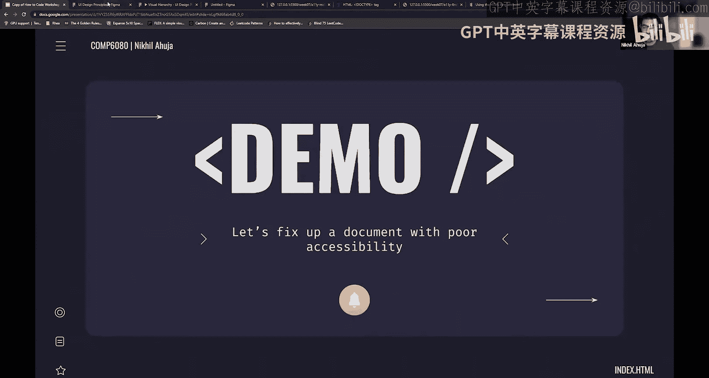

在本节课中，我们将学习构成良好用户界面的核心设计原则。我们将探讨如何通过视觉层次、色彩、对齐和分组等技巧，让界面不仅看起来美观，而且清晰易用。课程最后，我们将通过一个实战案例，应用这些原则来优化一个存在问题的界面。

---

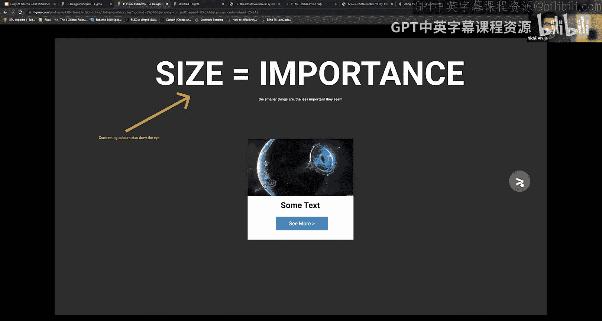

## 视觉层次：引导用户的视线

上一节我们介绍了UI设计的重要性，本节中我们来看看如何通过视觉层次来组织信息。视觉层次的核心是让用户能够快速识别页面上最重要的元素。

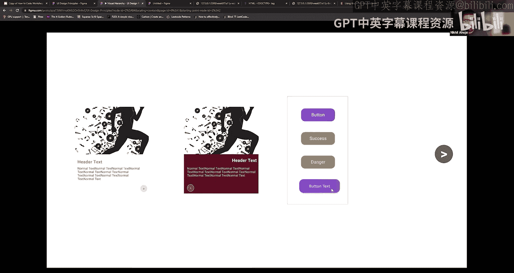

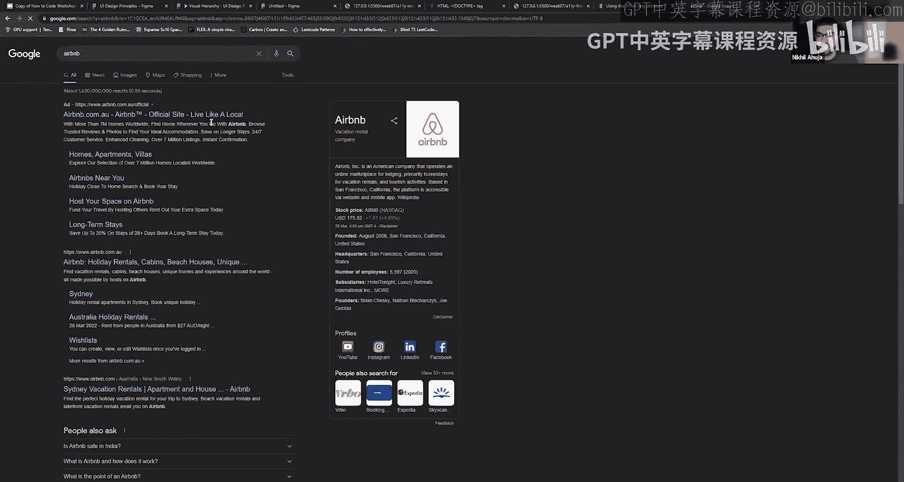

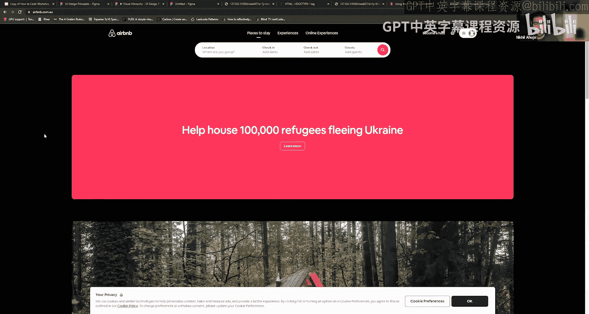

以下是构建视觉层次的几个关键原则：

1.  **尺寸等于重要性**：元素越大，在画面中就越占主导地位，用户就越容易注意到它，也显得越重要。公式可以表示为：`视觉重要性 ∝ 元素尺寸`。
2.  **使用对比色**：使用易于区分的颜色。如果你想强调某个元素，就使用能从周围颜色中“跳出来”的对比色。
3.  **利用对齐**：你可以通过对齐或不对齐的方式来强调或突出某些内容。例如，当鼠标悬停在按钮上时让按钮上浮，就是一种利用对齐变化的强调方式。
4.  **邻近性原则**：被组合在一起或彼此靠近的物体看起来是相关的。例如，卡片内的所有元素都被视为属于同一内容单元。

---

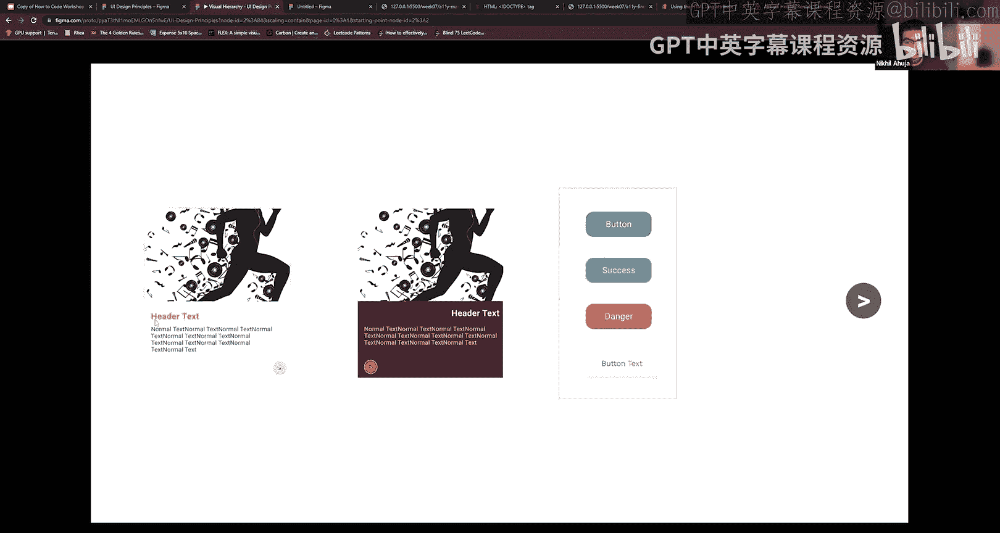

## 设计原则实例分析

现在，让我们看看这些原则在实际组件中的应用。以下是几个遵循了上述原则的卡片和按钮设计示例。

*   在卡片设计中，标题文字更大、更粗且颜色与正文不同，这清晰地标识了它们的区别。
*   我们使用了对比色和阴影（当悬停时）来强调卡片。
*   按钮设计上，成功操作按钮倾向于使用绿色，危险操作按钮使用红色，这是一种普遍的颜色含义共识。
*   一个受Airbnb启发的按钮使用了渐变色彩，使文字更具层次感和吸引力。

---

## 实战：分析YouTube主页

基于我们刚刚学到的原则，让我们分析YouTube主页的设计。

*   **尺寸与重要性**：最重要的部分是视频缩略图，因为图像容易吸引眼球。视频标题也使用了加粗字体，与其他信息区分开。
*   **色彩对比**：登录按钮使用了页面上几乎唯一的蓝色，使其非常突出。
*   **负空间运用**：页面留有大量空白，使内容区域更聚焦。
*   **一致性**：页面保持了统一的字体方案和极简的色彩搭配（黑、白、红，以及少量的蓝），避免因使用过多颜色而使用户感到超载或难以专注。

---

## 实战演练：优化一个“糟糕”的界面

理论需要实践来巩固。现在，让我们一起来优化一个存在问题的界面。我们将使用Figma这个原型设计工具进行快速修改。Figma允许你在编写代码前先绘制和构思界面，对学生非常友好。

首先，我们列出原始界面存在的问题：

*   提交时间戳的字体大小和粗细与实验标题相同，暗示了同等的重要性，但实际上提交时间并不那么重要。
*   顶部导航栏中，“成绩”标签的激活状态颜色与未激活标签（如“表格”、“讲义”）的颜色对比不够明显。
*   按钮内的字体过小。
*   内容区域的对齐和负空间使用不当，导致视觉上不协调，信息获取效率低。

现在，让我们开始逐步优化：

1.  **调整视觉层次**：将提交时间戳的字体改小、改为常规粗细，降低其视觉重要性。
2.  **增强状态对比**：修改导航栏激活状态的指示方式，例如使用更明显的颜色或添加下划线，使其与未激活状态清晰区分。
3.  **优化布局与对齐**：将卡片内的元素（如标题、分数、按钮）在水平轴上左对齐，消除不必要的巨大空白区域，使信息更紧凑、易读。
4.  **区分按钮功能**：让功能不同的按钮在视觉上有所区别。例如，将一个按钮设计为深色背景配浅色文字，另一个设计为浅色背景配深色文字和边框。
5.  **简化色彩**：减少不必要的颜色使用，保持色彩方案的一致性。例如，将一些无特殊意义的颜色改为更中性的黑色或灰色。

经过这些调整，界面的清晰度和美观度得到了显著提升。

---

## 核心概念延伸：模式可供性与识别优于回忆

除了视觉层次，还有两个重要的UI设计概念：

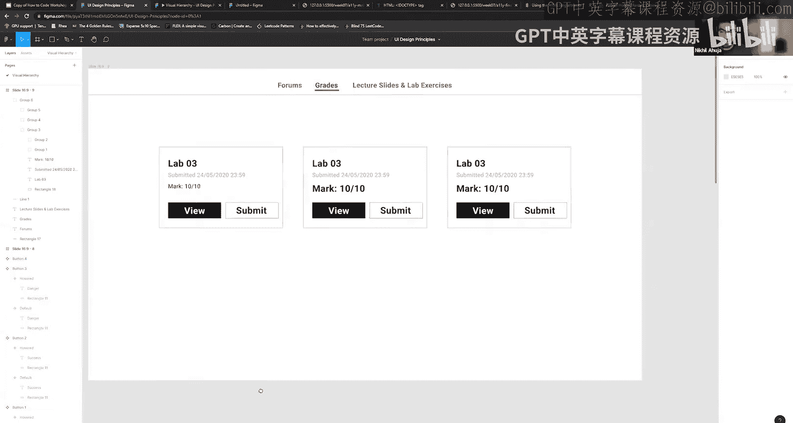

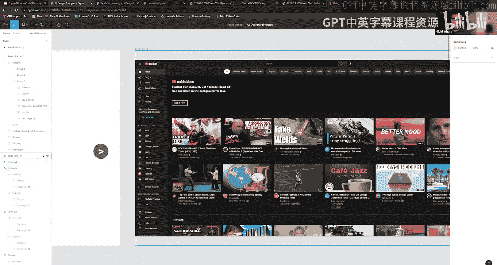

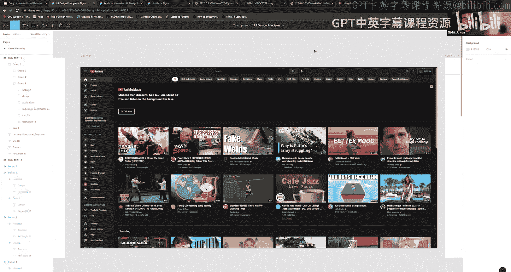

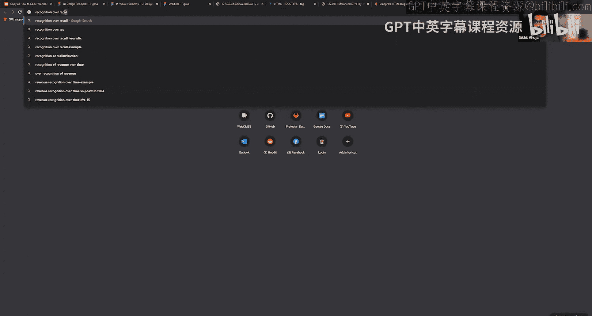

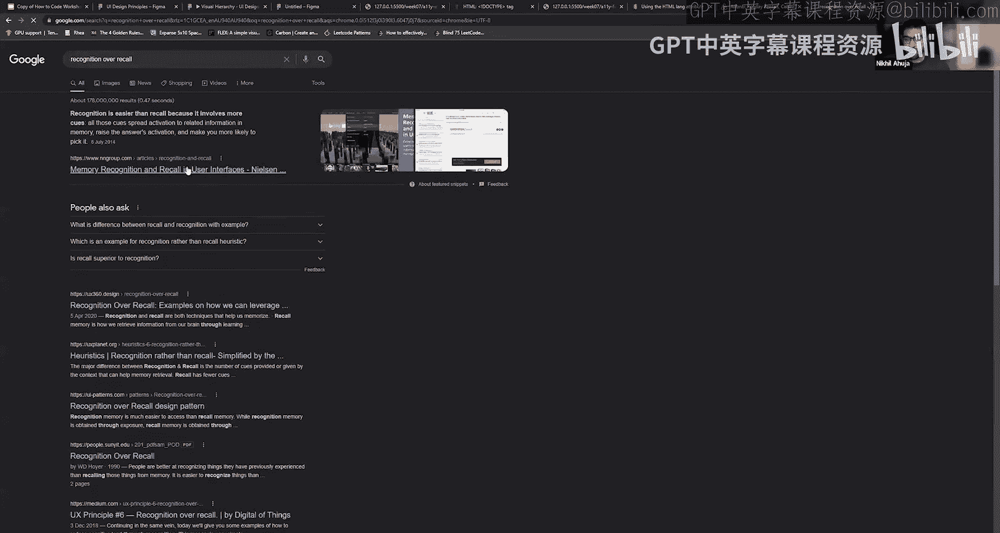

*   **模式可供性**：用户喜欢他们熟悉的东西。这就是为什么菜单常放在右上角，以及“汉堡包菜单”图标被广泛使用的原因。使用熟悉的模式（如标签页、主页图标、用户图标）可以降低用户的学习成本。
*   **识别优于回忆**：让用户识别一个元素比让他们回忆该元素的功能要容易得多。一个典型的用户图标，即使没有文字，用户也能立刻明白它的作用。在设计时应尽量利用识别，而非强迫用户记忆。

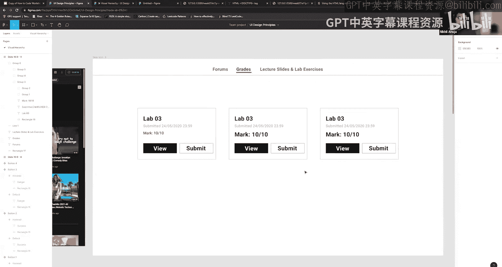

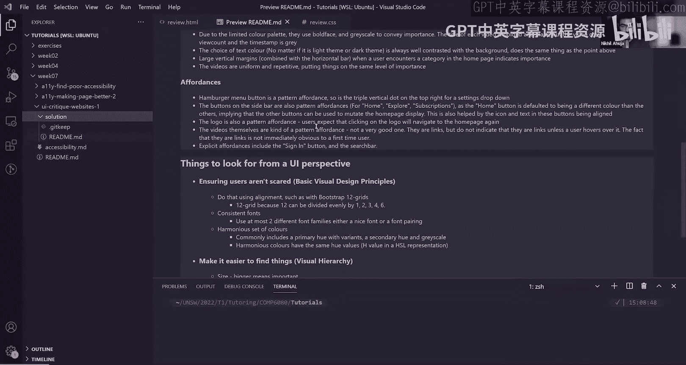

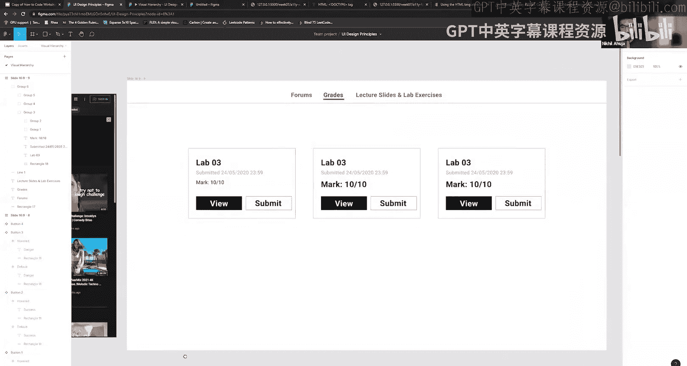

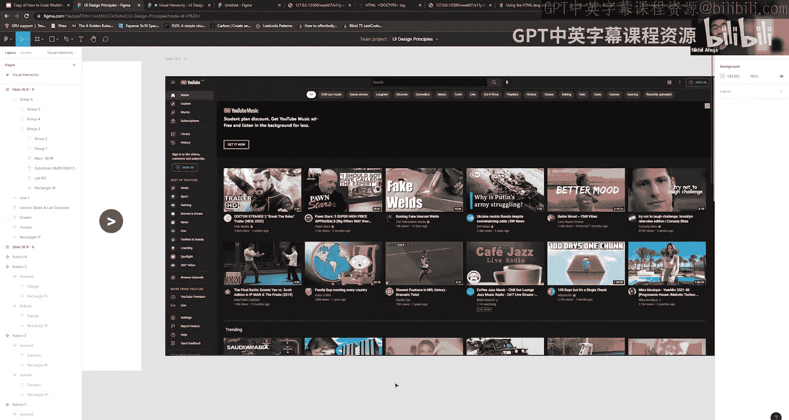

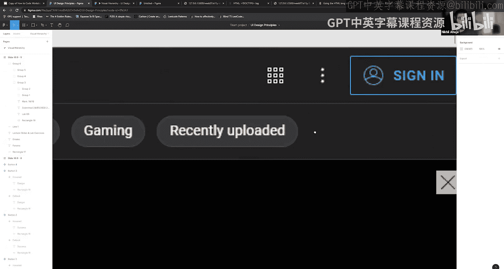

---

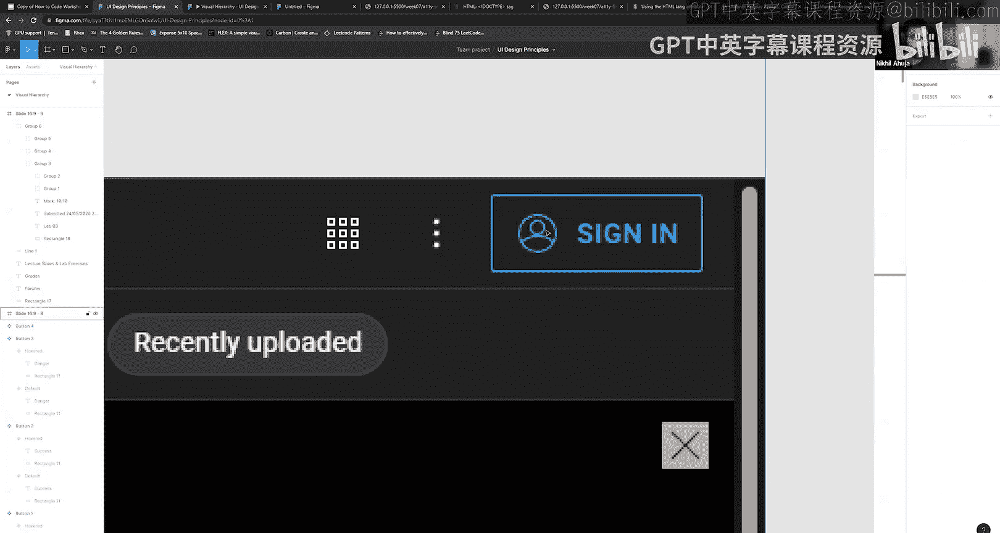

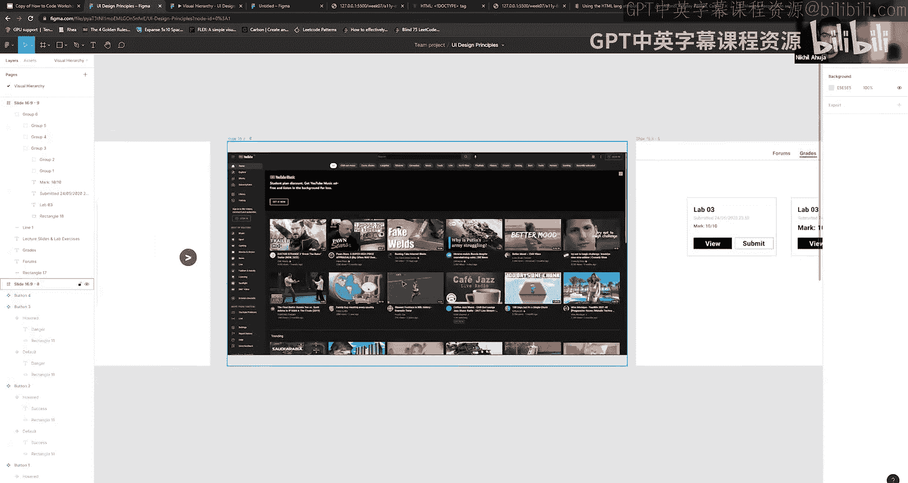

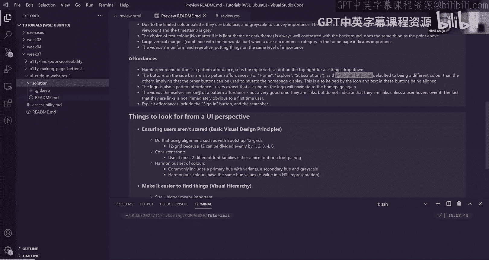

本节课中我们一起学习了UI设计的核心原则，包括通过尺寸、色彩、对齐和分组建立视觉层次，以及模式可供性和识别优于回忆的重要性。我们通过分析YouTube主页和动手优化一个案例，实践了这些原则的应用。记住，设计是一个迭代和实验的过程，不断尝试和调整才能创造出既美观又实用的用户界面。