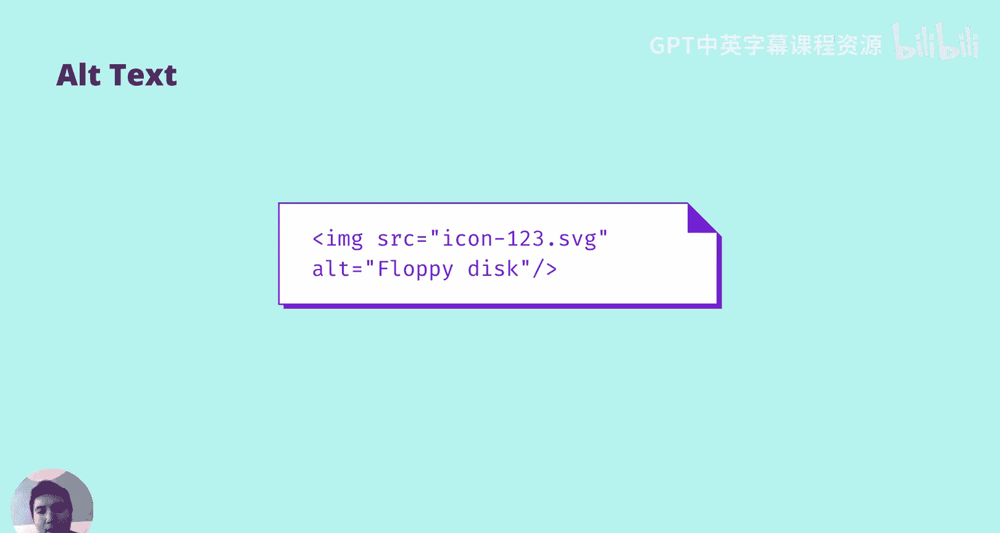
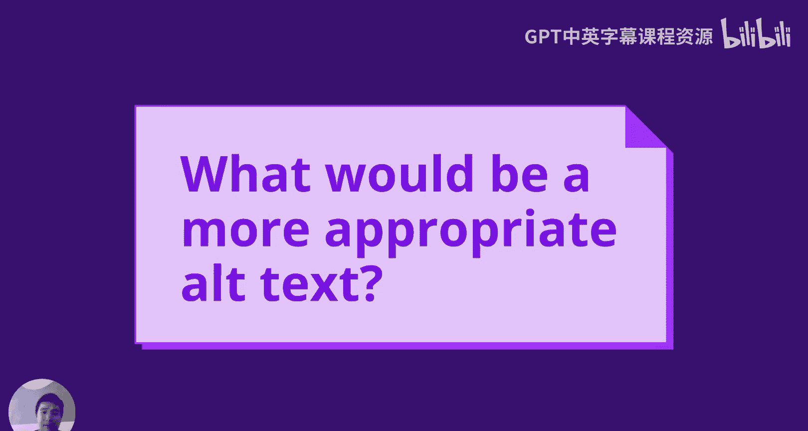
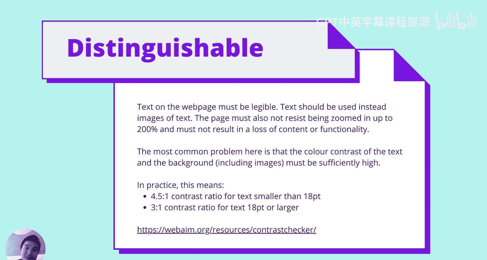
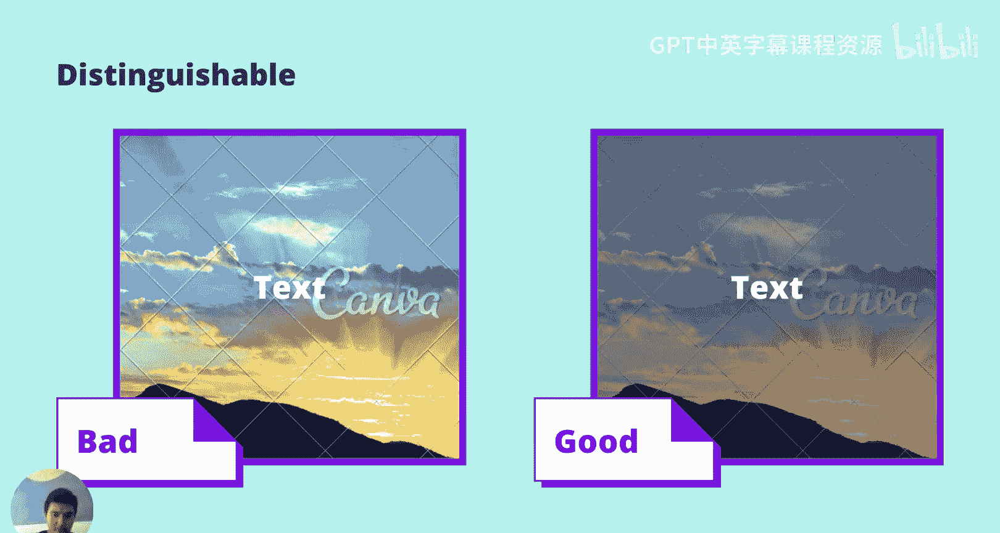
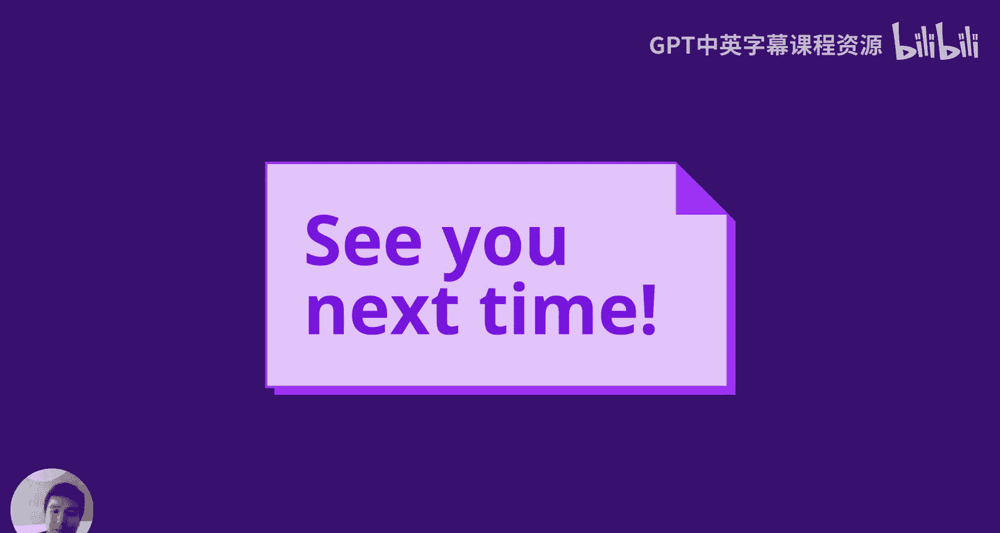

# 043：可感知性 🥕

在本节课中，我们将学习无障碍访问（Accessibility）的基础知识，特别是其四大原则中的“可感知性”。我们将了解为什么需要为所有用户提供可感知的内容，并学习如何通过提供文本替代方案和确保内容可区分性来实现这一目标。

---

大家好，我是Mike，我将为大家带来一个关于无障碍访问的四部分系列讲座。无障碍访问已成为业界日益关注的重要议题，我们期望所有前端工程师将其视为与代码可读性、性能和可测试性同等重要的首要任务。它应该被当作一等公民来对待。

那么，我想首先提出的问题是：什么是无障碍访问？我们为什么要关心它？本质上，每个人对生活方式都有不同的偏好，而无障碍访问就是关于如何适应所有人。并非每个人都会以你习惯的相同方式浏览网页。在使用台式机或笔记本电脑时，并非每个人都会使用鼠标。有些人可能只喜欢使用键盘，也并非每个人都会看屏幕。有些人可能希望使用盲文点显器来感知内容，或者他们可能希望使用一种称为屏幕阅读器的技术。这种技术会读取屏幕内容并将其呈现给用户，用户也可以与这些元素进行交互。这并非专门针对残障人士，而是关于不同的偏好。如果你希望构建一个对所有人都通用的网络，我们就必须满足所有这些不同的需求。

你可能会问，这听起来是个很大的命题，人们体验网络的方式确实有很多种。主要的国际标准被称为**Web内容无障碍指南**。Web内容无障碍指南是一个通用标准，它编纂了一系列可测试、可衡量的声明，称为“成功标准”。这些指南适用于包括移动应用在内的所有网络技术，并且是全球法律标准的基础。本课程将仅涵盖WCAG 2.0，但它已经更新并扩展为更高级的2.1版本。你可以查看链接，内容相当详细，本课程将对其进行解读。

WCAG有三个级别。A级是最低标准，它专门围绕某些可能对特定用户群体构成障碍的标准而设计。AA级是大多数公司力求达到的标准。AAA级则专门针对那些以残障人士为目标用户的网站。因此，我们将主要涵盖AA级，并在相关时提及AAA级。

WCAG有四大原则，这也将是我们四节课的主题，每个主题一讲。它们分别是：可感知、可操作、可理解和稳健。我们将逐一解读，首先从“可感知性”开始。

---

## 可感知性

为了使所有内容都可感知，组件必须以用户能够感知的方式呈现给用户。这是一个相当宽泛的声明。它包含几个不同的组成部分，其中最重要的部分之一是**非文本内容**。

所有呈现给用户的非文本内容都应有一个服务于同等目的的文本替代方案。文本替代方案是实现信息可访问性的主要方式，因为它们可以通过任何感官模态（例如视觉、听觉或触觉）来呈现，以满足用户的需求。提供文本替代方案允许信息通过各种用户代理以多种方式呈现。例如，如果你觉得阅读内容很困难，你可能更希望有一个语音助手为你朗读；或者如果你看不见但更喜欢通过触觉感知内容，那么你可能希望将其转换为盲文上下文。而这一切，只有在有文本存在的情况下才能实现。

所有非文本内容包括但不限于图像、图标、视频、音频和图表。我们将从一个图像示例开始，并以此展开。

以这张图片为例，如果不看它，这张图片是无法被感知的。这为屏幕阅读器用户甚至只是低带宽用户带来了糟糕的用户体验。应该提供替代文本来改善这种情况。即使图像的源文件包含了它是什么，也不足以描述这种体验。

以下是优化替代文本的三个步骤：
1.  描述图像。
2.  根据上下文进行调整。
3.  标记装饰性图像。

我们需要的是一个能最好地描述图像内容的句子或短语，而不是一两个词，这一点非常重要。

例如，我们可以这样描述：“一个晴朗的日子里，回望城市的沙滩景观。”这是一个非常好的替代文本，因为它捕捉了我们在这里看到的内容。这很好，但它并不总是最有用的替代文本。你并不总是希望在上传图像或拥有图像时就确定替代文本，你需要使其**匹配上下文**。

如果它用在一篇关于悉尼旅游的文章中，也许更好的替代文本是：“悉尼世界著名的邦迪海滩，一个晴朗的下午。”这样做捕捉了它的位置，这在关于悉尼旅游的文章中特别有用，但在其他上下文（例如位置不明显时）可能就不那么合适了。你希望尽可能匹配看到图像的体验。

如果它只是用作装饰性的、无意义的横幅（例如，重复出现多次），那么**空字符串**是首选。这与没有替代文本不同，因为这将明确告诉任何试图捕捉此体验的软件：不用担心这张图片，这是一个装饰性的、无意义的横幅。

让我们再看一个例子。这里我们有一个软盘图标。我们并不真正知道它的用途。

请思考一下，什么会是更合适的替代文本。本质上，这取决于上下文。如果它是一系列图标列表中的一个，“软盘”可能是正确的。如果它是一个保存图标，你希望做的不是说“这是一个软盘”，而是说“这是一个保存图标”，或者直接说“保存”。如果你试图描述一个操作，最好将标签放在按钮上，并说明这是一个装饰性图像。我们将在未来的讲座中更详细地阐述按钮的标签要求。

作为练习，请思考一个简单的折线图。想想什么有意义的脚注信息对用户来说是相关的、你想要传达的。这里给你一个提示：理解一系列坐标会非常困难。相反，请思考折线图的趋势方向，想想你试图向用户传达什么信息或消息。

---

上一节我们介绍了非文本内容的文本替代方案。接下来，我们来看看可感知性的另一个重要部分：**可区分性**。

我们已经介绍了非文本内容。对于存在的文本，还有另一个要求：它必须是**清晰易读的**。

应使用文本而非文本图像。这相当直接，如果是文本图像，很多软件将无法真正理解其中的内容。页面还必须允许被放大到200%，并且不能导致内容或功能的丢失。许多无障碍目标的一个共同主题是：不要抗拒浏览器所做的事情，因为只要你不抗拒很多事情，浏览器在很大程度上能很好地处理无障碍访问。

可区分性中最常见、最重要的问题是文本与背景（包括图像）的**颜色对比度**。该对比度必须足够高。在实践中，这意味着：
*   对于小于18磅的文本，对比度比率应为 **4.5:1**。
*   对于18磅或更大的文本，对比度比率应为 **3:1**。

这个链接会带你到一个对比度检查器，你可以测试各种不同的颜色。

让我们看这个例子。这里，图像上有文字，在某种程度上，很难阅读。文字位于图像中视觉上相当强烈的部分。顺便说一下，当你比较文本和图像时，你通常希望选择图像中最差的部分，并根据对比度指南进行测试。在右侧，我们有文字和变暗的图像。在这里，阅读文字要容易得多。

并非每个人都希望调暗他们的图像，所以这需要一些设计或创意。你可以改变图像的对比度，可以调暗图像，可以改变文字颜色，也可以在文字周围添加一个框。你可能在电影字幕中看到过，文字通常带有轮廓，这同样有效。指南相当灵活，只要有一些方法能在背景上看到文字即可。

---

## 总结

本节课中，我们一起学习了无障碍访问的第一个原则：**可感知性**。这意味着内容必须能够被用户感知和区分。这既适用于文本内容，也适用于非文本内容。我们学习了如何为图像等非文本内容提供有意义的文本替代方案，以及如何通过确保足够的颜色对比度来使文本内容清晰易读。记住，构建一个对所有人都可访问的网络，始于确保每个人都能感知到其中的信息。

下次见。