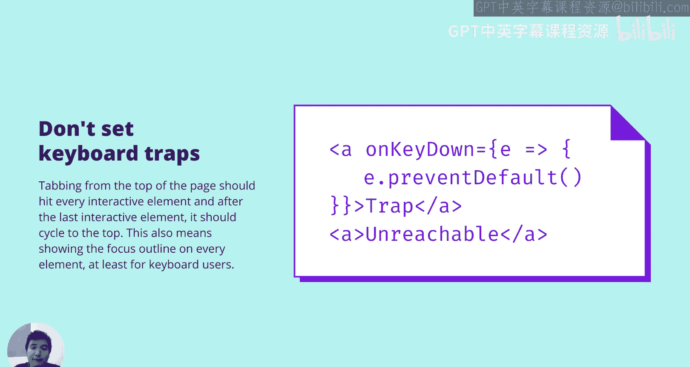
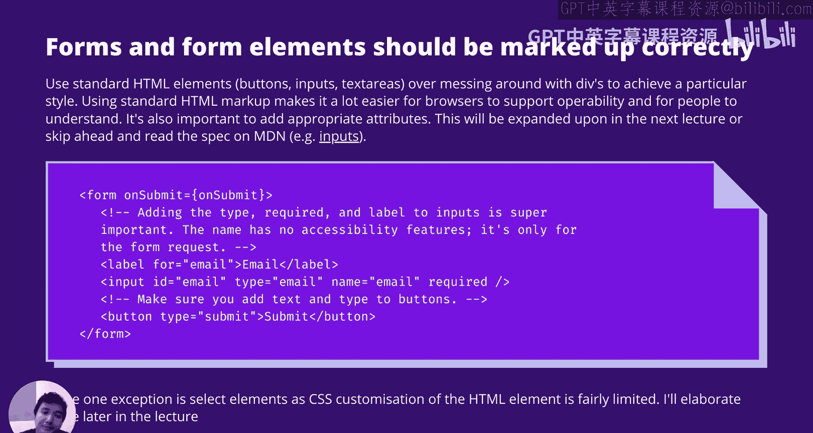
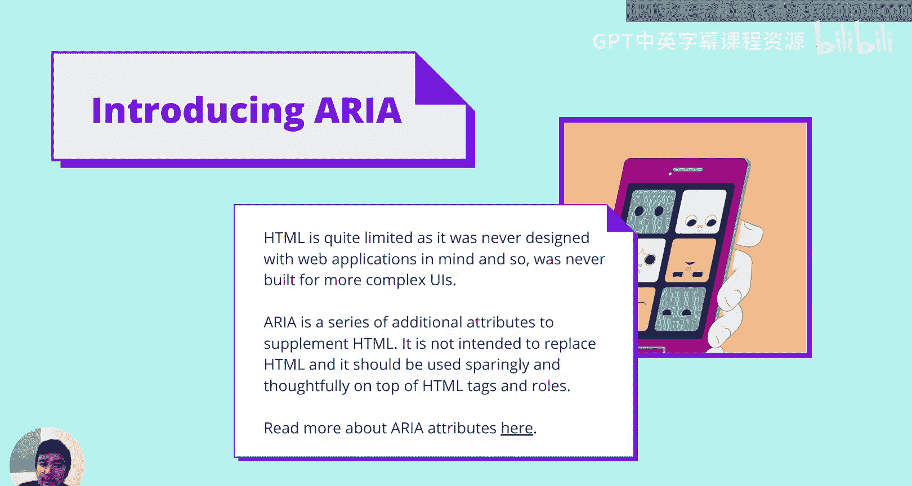
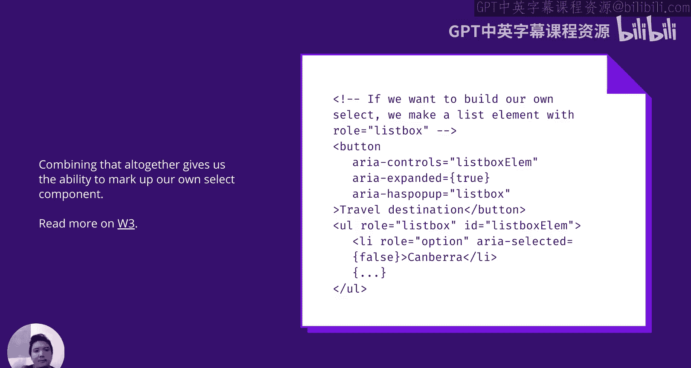
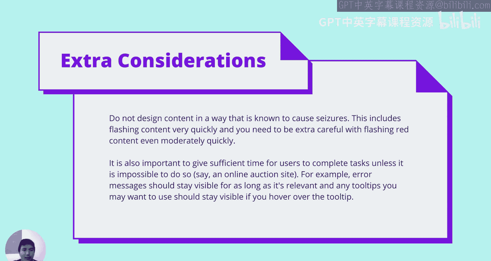
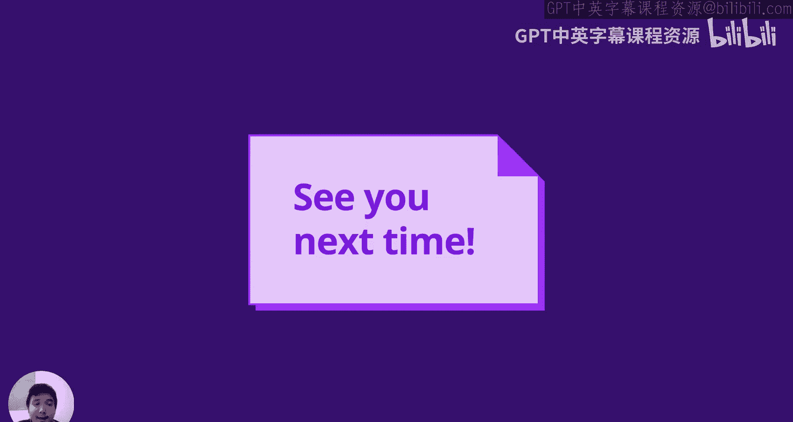

# 044：可操作性 🎮

在本节课中，我们将学习网页可访问性的第二个核心原则：可操作性。可操作性意味着网页的组件和导航必须对所有用户都是可操作的，无论他们使用何种交互方式。

## 什么是可操作性？🤔

可操作性是指网页的组件和导航必须可以被操作。界面不能要求用户执行他们无法完成的交互。

并非所有与网页交互的用户都偏好使用鼠标或触摸设备。因此，确保所有页面交互都支持键盘操作至关重要。

## 键盘导航基础 ⌨️



许多键盘导航功能是浏览器默认提供的，只要你不覆盖它们即可。以下是主要的键盘导航方式：

*   **方向键、空格键、Page Up/Down**：用于在页面上滚动。
*   **Tab 和 Shift+Tab**：用于在可交互元素（如表单输入框、按钮、链接）之间跳转。
*   **Enter 和方向键**：用于激活或与当前聚焦的元素交互。

具体到元素，这意味着：

*   **按钮** 需要支持点击、触摸点击，以及 **Enter** 和 **空格键** 的激活。
*   **链接** 需要支持点击、触摸点击，以及 **Enter** 键的激活。
*   **下拉选择框** 需要支持方向键来改变选中项，并支持 **Enter** 键确认选择。

正如之前所说，许多功能是默认提供的。关键是要确保你不覆盖浏览器的默认行为，并且在实现任何自定义组件时，也要实现相应的键盘支持。

## 避免键盘陷阱 🚫



最重要的原则之一是不要设置键盘陷阱。

如果你从页面顶部开始按 `Tab` 键，应该能依次访问到每一个可交互元素。在访问完最后一个元素后，焦点应该循环回到页面顶部。这意味着至少要为键盘用户显示每个元素的焦点轮廓线。

以下是一个需要警惕的例子：

```javascript
element.addEventListener(‘keydown‘, (e) => {
    if (e.key === ‘Tab‘) {
        e.preventDefault(); // 这会阻止Tab键的默认行为，导致键盘陷阱
    }
});
```

这段代码的意图可能是为了实现某种特定的用户体验，但它无意中使键盘用户无法使用 `Tab` 键离开该元素。在开发时，如果你在为视觉用户设计特定交互，必须同时考虑键盘用户的体验。

## 使用正确的HTML元素 📝

使用标准的HTML元素通常能获得更好的可操作性和浏览器支持。

表单和表单元素应使用正确的标记。通常，使用标准的HTML元素（如 `<button>`、`<input>`、`<textarea>`）比使用 `<div>` 来模拟更好。

使用标准HTML标记不仅让浏览器更容易支持可操作性，也让人更容易理解。有时你可能确实需要使用 `<div>` 来自定义样式，但这将需要花费更多时间来手动添加所有必要的键盘事件处理和ARIA属性。

例如，原生的 `<button>` 样式可能不美观，但覆盖它的样式通常比为 `<div>` 重新实现所有功能更容易。

为元素添加适当的属性也很重要，这将在下一讲中详细展开。

以下是一个表单元素的例子：

```html
<form onsubmit=“handleSubmit(event)“>
    <label for=“name“>姓名：</label>
    <input type=“text“ id=“name“ name=“name“>
    <button type=“submit“>提交</button>
</form>
```

注意，这里的按钮没有 `onclick` 函数，而是表单有一个 `onsubmit` 函数。这样做的好处是，当用户聚焦在输入框内时（无论是在手机设备上还是使用屏幕阅读器），他们可以直接提交表单，这对许多不习惯使用鼠标或触摸操作的用户非常友好。



业内一个普遍接受的例外是 `<select>` 元素。与按钮、输入框等不同，`<select>` 元素的CSS自定义能力非常有限。因此，直接使用 `<select>` 元素比用 `<div>` 模拟并手动添加所有键盘和标记支持要简单得多。

## 使用语义化HTML结构 🏗️

使用标题、区域、侧边栏和页脚等语义化标签对可操作性至关重要。

对于视觉用户，页面的版块和分类一目了然。但对于无法看到屏幕的用户，我们需要通过语义化标记来提供相同的信息结构，以在视觉用户和依赖标记、音频或触觉反馈的用户之间创造尽可能对等的体验。

*   **`<header>`**：表示页面顶部区域。屏幕阅读器用户可能希望跳过这部分常见内容。
*   **`<nav>`**：表示导航。如果有多个导航区域，需要使用 `aria-label` 等属性为它们添加标签，说明其作用。
*   **`<main>`** 和 **`<section>`**：表示页面的主要内容和各个部分。确保结构层次正确（例如，不要在 `<section>` 内嵌套 `<main>`）。`<aside>`（侧边栏）可以放在 `<main>` 之前，关键是拥有正确的标记。
*   **`<footer>`**：表示页脚。

## 跳过链接 ⏭️

对于重复出现的内容（如主导航），使用“跳过链接”让用户能够绕过它。

跳过链接是一种行业实践，对屏幕阅读器用户非常有用。它本质上是一段默认不可见、只有在获得焦点时才显示的文本或链接。注意，不能使用 `display: none` 或 `visibility: hidden` 来隐藏它，因为这会将其从Tab键顺序中移除。正确的做法是使用CSS将其视觉上移出屏幕，但在获得焦点时使其可见。

```html
<a href=“#main-content“ class=“skip-link“>跳转到主要内容</a>
...
<main id=“main-content“>
    <!-- 页面主要内容 -->
</main>
```

```css
.skip-link {
    position: absolute;
    top: -40px;
    left: 0;
    background: #000;
    color: white;
    padding: 8px;
}
.skip-link:focus {
    top: 0;
}
```

跳过链接的常见用途包括：
1.  跳过轮播图等可能造成键盘陷阱的复杂组件。
2.  跳过页眉，直接跳转到 `<main>` 主要内容区域。
通常，在页面底部也提供一个“返回顶部”的链接，以支持完整的键盘导航循环。

## 引入ARIA 🛠️

HTML的能力是有限的，它最初并非为复杂的Web应用程序而设计。为了弥补这一点，WAI-ARIA（无障碍富互联网应用）应运而生。

ARIA是一系列补充HTML属性的规范，**并非旨在取代HTML**。它应该谨慎且有意识地与HTML标签和角色结合使用，以适应现代Web应用程序的复杂交互。

以下是几个关键的ARIA用例：

**1. 为纯图标按钮添加标签**
```html
<button aria-label=“显示菜单“>
    
</button>
```
`aria-label` 为屏幕阅读器提供了按钮功能的描述，而不会影响视觉呈现。

**2. 为自定义组件添加状态**
对于没有原生HTML对应的自定义组件（如开关），可以使用ARIA状态属性。
```html
<button role=“switch“ aria-checked=“false“ onclick=“toggleCookies(this)“>
    接受Cookie
</button>
```
```javascript
function toggleCookies(button) {
    const isChecked = button.getAttribute(‘aria-checked‘) === ‘true‘;
    button.setAttribute(‘aria-checked‘, !isChecked);
    // 同时更新UI状态
}
```
`aria-checked` 属性应与UI的视觉状态同步。

**3. 定义模态对话框**
ARIA可以标记模态对话框，但实际的交互锁定仍需JavaScript实现。
```html
<div role=“alertdialog“ aria-modal=“true“ aria-labelledby=“dialog-title“>
    <h2 id=“dialog-title“>需要登录</h2>
    <p>请登录以执行此操作。</p>
    <button onclick=“closeDialog()“>关闭</button>
</div>
```
`role=“alertdialog“` 和 `aria-modal=“true“` 告诉辅助技术这是一个需要立即注意的模态层。开发者仍需用JS阻止背景内容的交互。

**4. 定义元素间控制关系**
`aria-controls` 属性可以指明一个元素控制着另一个元素。
```html
<button aria-controls=“expanded-menu“ aria-expanded=“false“ onclick=“toggleMenu()“>显示菜单</button>
<ul id=“expanded-menu“ role=“menu“ hidden>
    <li role=“menuitem“><a href=“#“>项目一</a></li>
</ul>
```
这指明了按钮控制着ID为 `expanded-menu` 的菜单。`aria-expanded` 表示菜单的展开/收起状态。

**5. 使用 `aria-haspopup`**
这个属性指示元素在激活时会弹出什么类型的内容。
```html
<button aria-haspopup=“menu“>选项</button>
<button aria-haspopup=“dialog“>登录</button>
```
常见值有 `“menu“`、`“listbox“`（类似下拉选择）、`“dialog“`。

## 构建自定义选择组件 🧩

结合以上ARIA属性，我们可以标记一个自定义的选择组件：
```html
<!-- 触发按钮 -->
<button aria-controls=“custom-listbox“ aria-expanded=“false“ aria-haspopup=“listbox“>
    选择一项
</button>



<!-- 下拉列表 -->
<ul id=“custom-listbox“
    role=“listbox“
    aria-label=“自定义选项“
    hidden>
    <li role=“option“ aria-selected=“false“ tabindex=“-1“>选项 A</li>
    <li role=“option“ aria-selected=“true“ tabindex=“0“>选项 B</li>
    <li role=“option“ aria-selected=“false“ tabindex=“-1“>选项 C</li>
</ul>
```
请注意，你仍然需要使用JavaScript来处理键盘交互（例如，用方向键选择选项，用 `Enter` 确认，用 `Escape` 关闭列表，并管理焦点在按钮和列表之间的移动）。

## 额外注意事项 ⚠️

最后，还有一些重要的通用注意事项：

1.  **避免引发癫痫的内容**：不要设计已知会引发癫痫发作的内容，这包括快速闪烁的内容，尤其是红色内容。请遵循相关规范并运用常识。
2.  **提供充足的操作时间**：除非绝对必要（如在线拍卖），否则应为用户提供足够的时间来完成任务。错误信息应在相关期间保持可见。工具提示在鼠标悬停于其上时也应保持可见，而不仅仅是悬停在触发元素上时。

## 总结 📚

本节课我们一起学习了可操作性的核心原则。关键要点是：**不要轻易覆盖浏览器的默认可访问行为**。如果必须实现自定义交互组件，则需要仔细添加键盘事件处理和ARIA属性。ARIA是一个强大的工具，可以很好地补充HTML，帮助我们构建对所有人都可操作的现代Web界面。





下次见！👋