# 049：在React中集成CSS 🎨

在本节课中，我们将学习如何将CSS集成到React应用中，以创建美观的用户界面。我们将从基础的内联样式开始，逐步介绍使用CSS类名的方法，并探讨全局CSS引入带来的挑战。

---

## 概述

React不仅是一个构建用户界面的框架，更应致力于构建**优秀**的用户界面。为了实现这一点，我们需要为其添加样式。幸运的是，我们可以像在普通HTML中一样，在React中使用CSS。

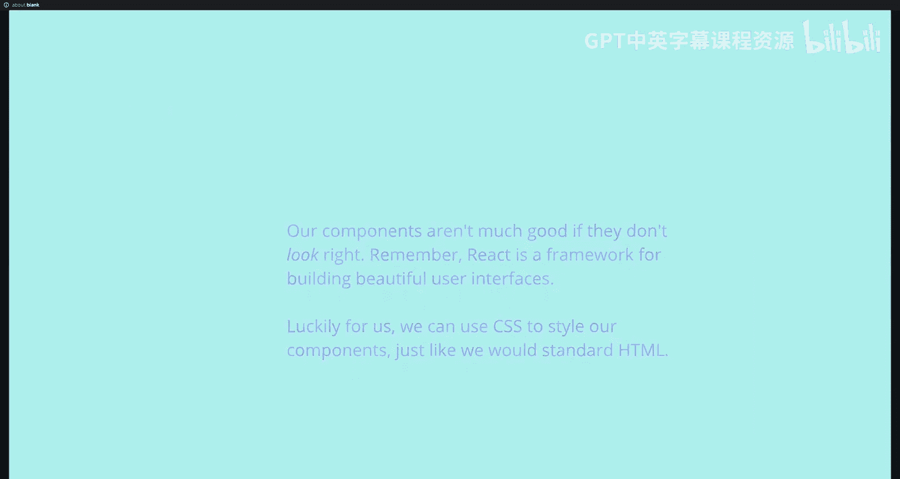

上一节我们介绍了React的基础，本节中我们来看看如何为React组件添加样式。

---

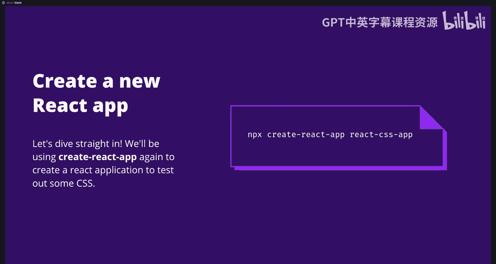

## 创建新的React应用

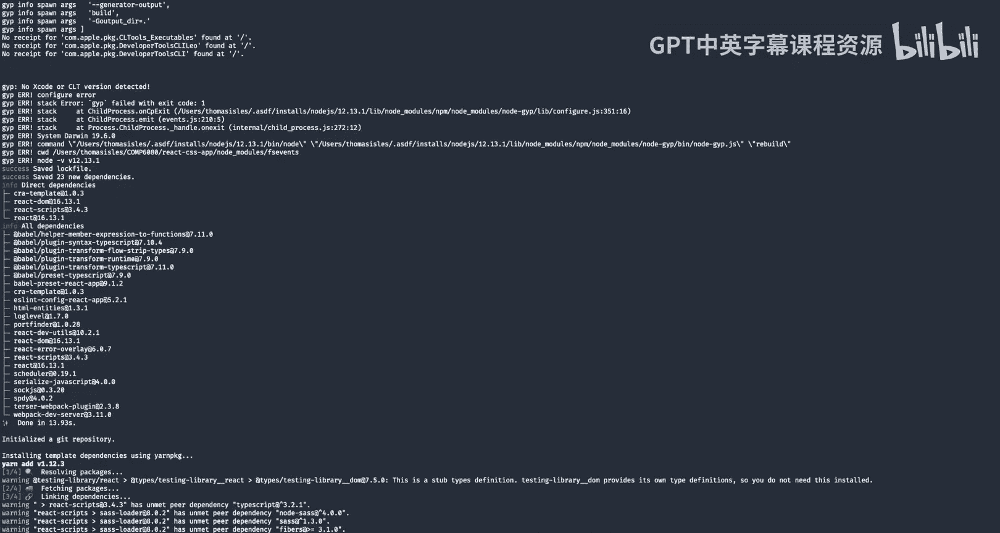

我们将首先创建一个新的React应用来实践CSS。

在终端中运行以下命令：

```bash
npx create-react-app my-css-app
```

创建完成后，在编辑器中打开项目。

---

## 内联样式

就像在HTML中一样，我们可以向JSX元素传递一个`style`属性来应用CSS样式。在JSX中，`style`属性接受一个普通的JavaScript对象，其中键是CSS属性，值是对应的CSS值。

需要注意的是，任何带有连字符的CSS属性名在JSX中都需要转换为驼峰命名法。

以下是一个定义样式对象并将其应用于元素的示例：

```javascript
const myStyle = {
  color: 'red'
};

function App() {
  return <div style={myStyle}>Hello World</div>;
}
```

实际上，我们无需单独定义样式变量，可以直接在行内定义对象。这种技术被称为**内联样式**。

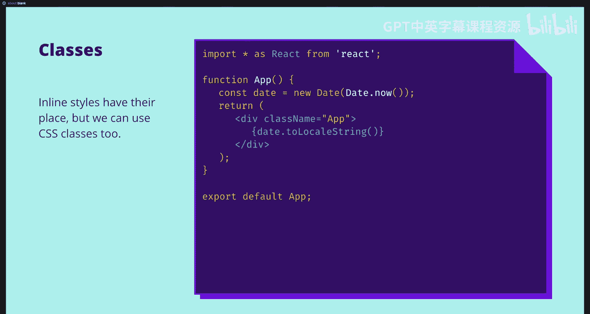

```javascript
function App() {
  return <div style={{ color: 'red' }}>Hello World</div>;
}
```

内联样式有其用武之地，但它也存在与在HTML中定义样式相同的局限性：在大型代码库中难以追踪样式，并且难以将相同样式一次性应用于多个JSX元素。

---

## 使用CSS类名

幸运的是，我们可以在JSX中使用CSS类，就像在HTML中一样。

在JSX中，我们使用`className`属性来替代HTML的`class`属性。它接受一个字符串，用于指定类名。

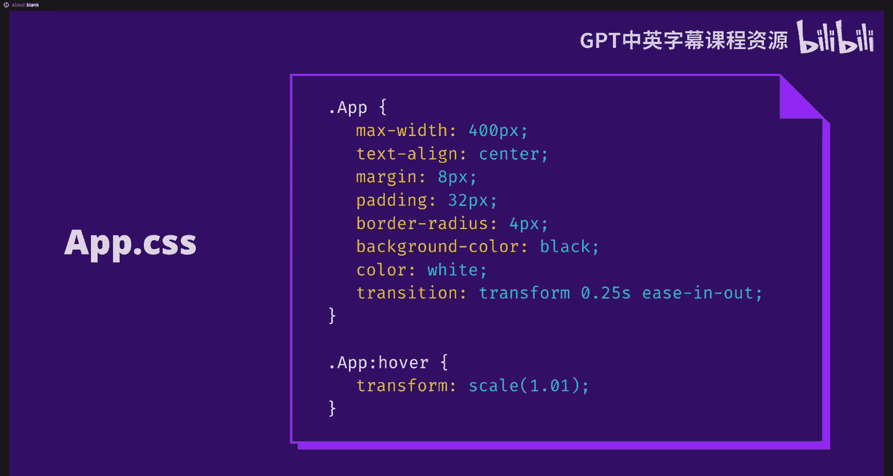

```javascript
function App() {
  return <div className="my-app">Hello World</div>;
}
```

现在我们可以使用类名，让我们的应用看起来独一无二。

在你的应用文件夹中，你会看到一个`App.css`文件。我们可以在这里定义`.my-app`类的样式。

以下是`App.css`文件的一个示例：

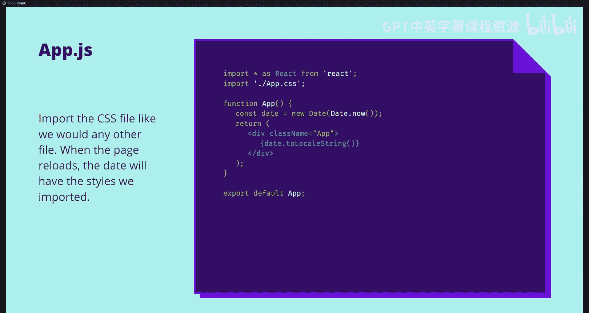

```css
.my-app {
  max-width: 600px;
  text-align: center;
  padding: 20px;
  margin: 0 auto;
  border-radius: 10px;
  color: white;
  background-color: black;
}

.my-app:hover {
  transform: scale(1.05);
}
```

---

## 导入CSS文件

我们已经编写了CSS文件，并为标签指定了类名。但为了将两者关联起来，我们需要导入CSS文件，这样JSX才能找到我们提供的类。

我们可以像导入其他文件一样导入CSS文件。当页面重新加载时，`App.js`文件将加载CSS文件中的类，日期文本将附加上正确的样式。

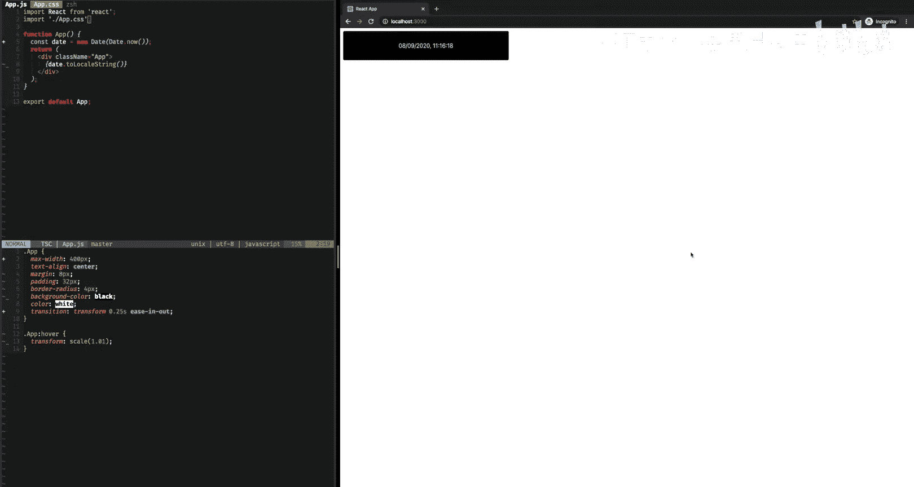

```javascript
import './App.css';

function App() {
  return <div className="my-app">Hello World</div>;
}
```

通过这种方式创建样式非常容易。

---

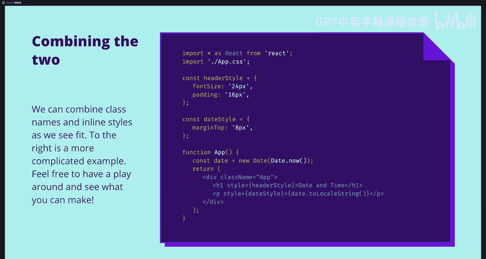

## 混合使用类名和内联样式

我们可以根据需要混合使用内联样式和类名，没有任何限制。

以下是一个更高级的示例，展示了如何混合使用：

```javascript
import './App.css';

function App() {
  return (
    <div className="my-app">
      <h1 style={{ fontSize: '2em' }}>Welcome</h1>
      <p style={{ marginTop: '20px' }}>This is a paragraph with inline styles.</p>
    </div>
  );
}
```

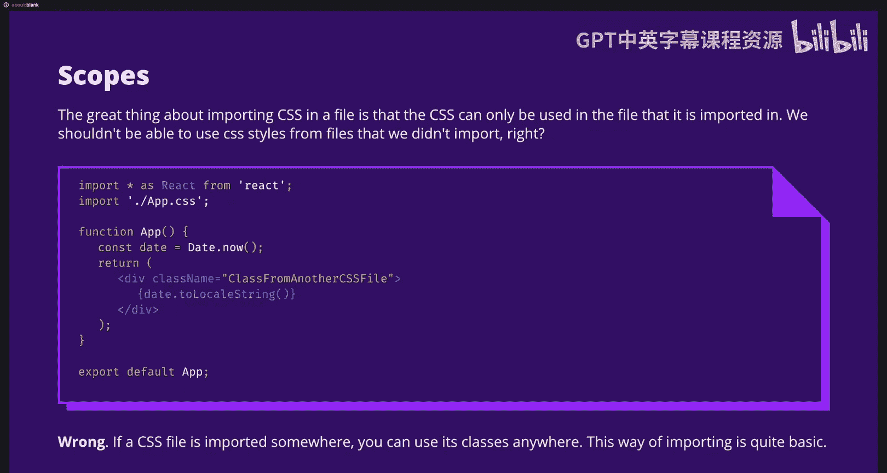

请注意，在内联样式中，像`font-size`和`margin-top`这样的属性已转换为驼峰命名法（`fontSize`, `marginTop`）。

---

## 全局CSS的挑战

如果编程的一切都这么简单就好了。当我们在一个文件中导入CSS时，你可能会认为我们不能在另一个文件中使用相同的CSS。毕竟，我们只在一个文件中导入了它。如果这是真的，那就太好了，因为这意味着我们不再需要担心不同CSS文件之间类名重叠的问题。

不幸的是，事实并非如此。当我们导入一个CSS文件时，该CSS中的类在所有其他文件中都可用。

这可能会让人有些困惑，让我来解释一下。

假设我们有两个组件：`App` 和 `OtherComponent`。

*   `App.js` 导入了 `App.css`，其中定义了 `.my-app` 类。
*   `OtherComponent.js` 导入了 `OtherComponent.css`，它也定义了一个 `.my-app` 类。

即使我们没有在`App`中渲染`OtherComponent`，仅仅导入`OtherComponent.js`就可能导致两个`.my-app`类的样式发生冲突和覆盖。具体哪个样式生效取决于文件导入的顺序，这会导致不一致的行为。

这表明，以这种方式导入CSS虽然有用，但像一把钝器，存在许多我们想要解决的问题和不一致性。

---

## 解决方案展望

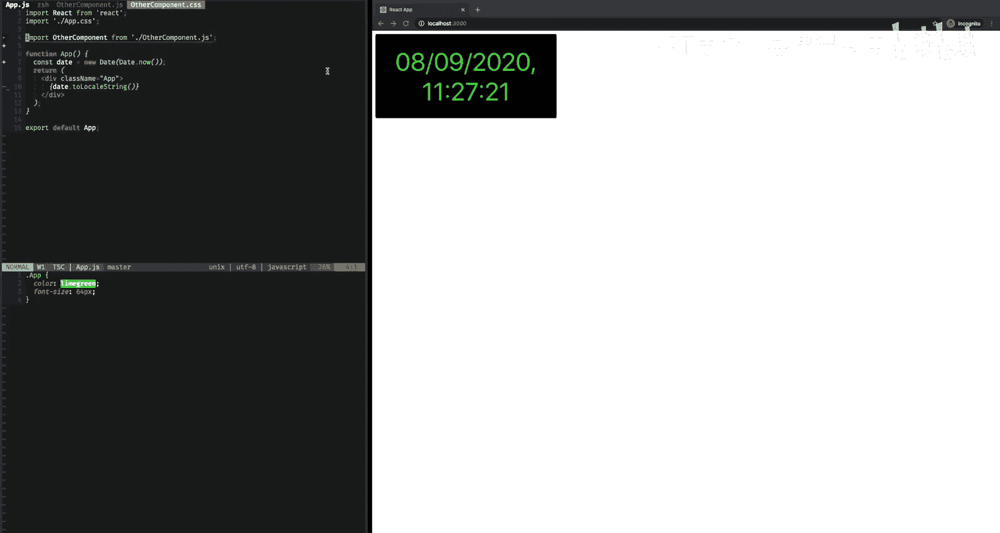

为了使我们的组件真正隔离，我们需要确保在导入CSS文件时，其类仅在我们导入的文件中使用，而不会与其他组件混淆。

好消息是，有许多方法可以实现这一点，例如**CSS Modules**或**CSS-in-JS**。在后续的课程中，我们将涵盖这些高级的CSS方法。

---

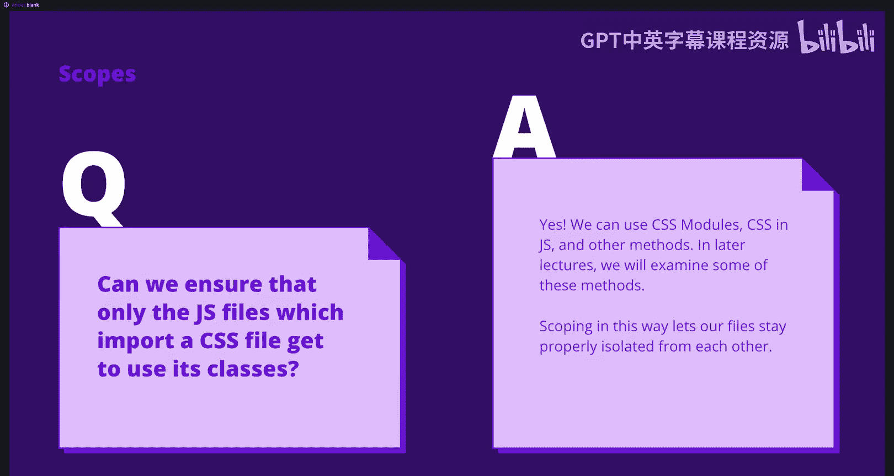

## 总结

本节课中我们一起学习了在React中集成CSS的基础知识。我们介绍了如何使用内联样式和CSS类名为组件添加样式，并演示了如何导入CSS文件。同时，我们也了解了全局CSS引入可能带来的样式冲突问题，并简要提及了后续将学习的更先进的样式隔离方案（如CSS Modules）。现在，你已经能够为你的React组件添加样式了，我们期待看到你的创意作品。

---


**下节课预告**：在接下来的课程中，我们将探讨React中一些高级的CSS方法，学习它们如何帮助我们提升组件的样式管理水平。