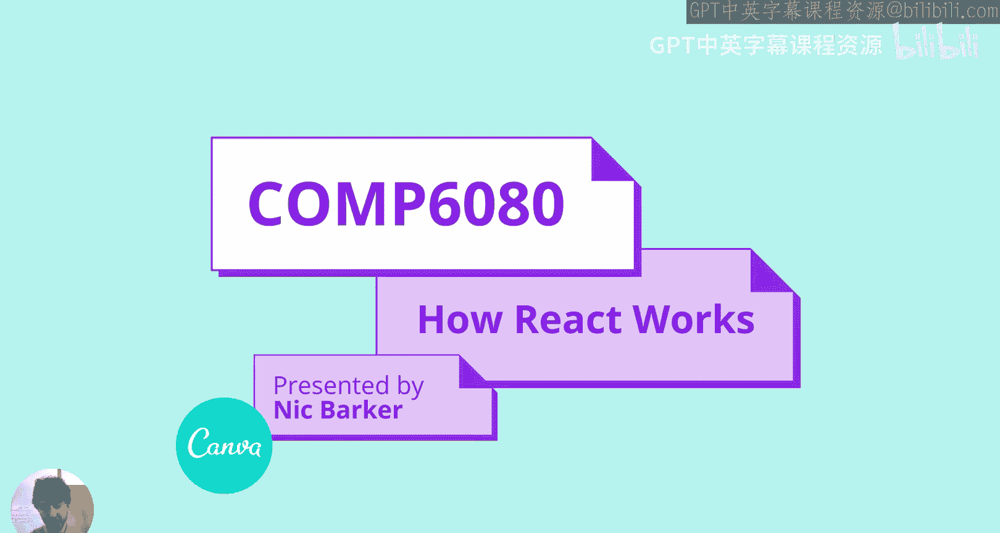
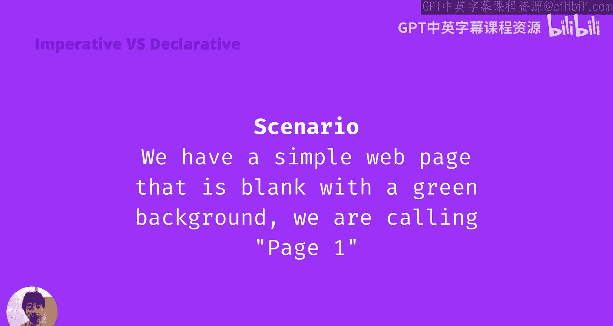
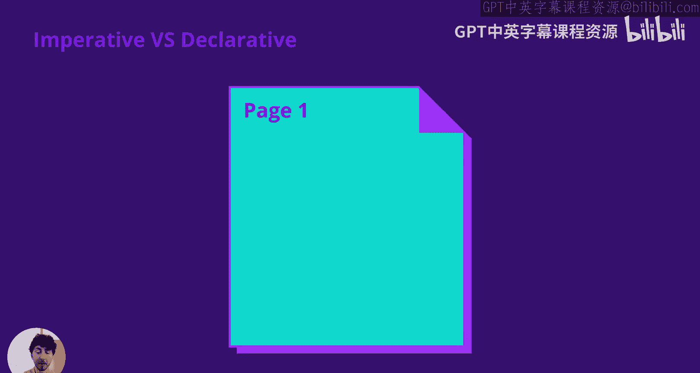
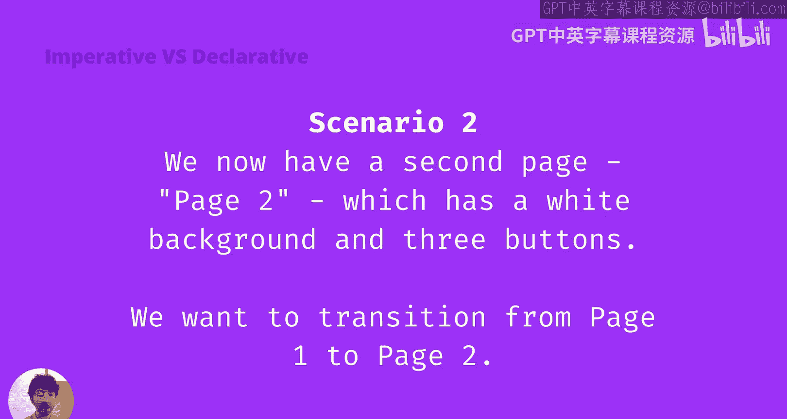
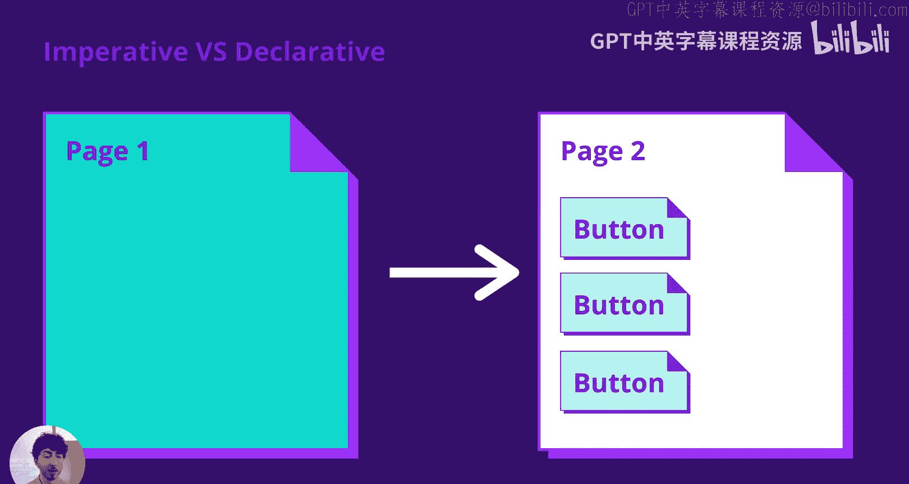
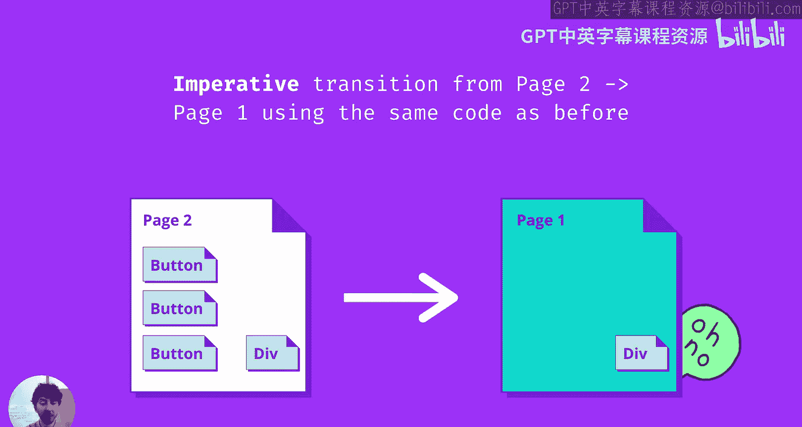
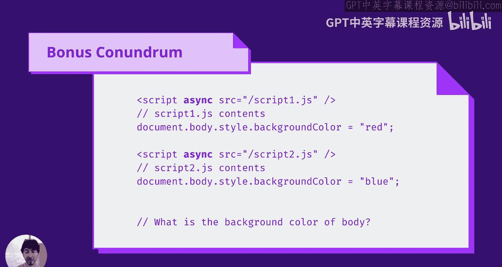
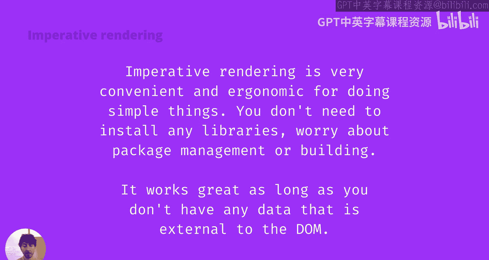
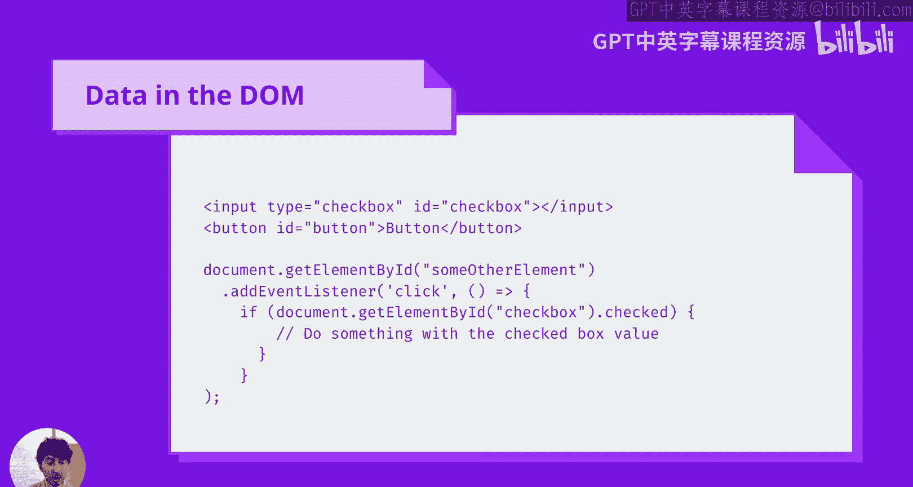
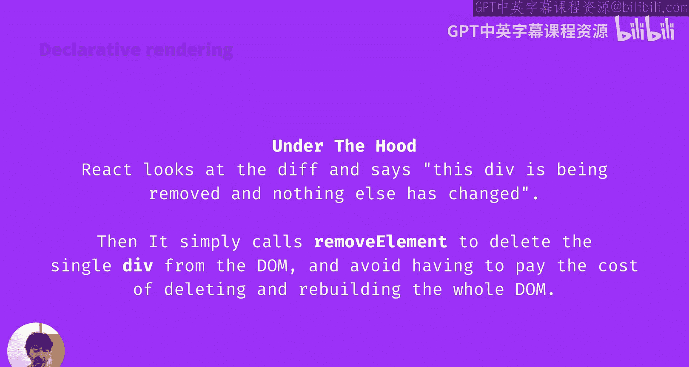

# 050：React如何工作 💥



在本节课中，我们将学习React是什么，它试图解决什么问题，以及它如何通过声明式渲染和虚拟DOM等核心概念来解决这些问题。

---

## React是什么？

React本质上是一个用于构建用户界面的JavaScript库。它在大约七年前以可识别的形式发布，这在JavaScript框架领域已经是非常长的时间了。它源自Facebook的一个内部项目，此后一直由Facebook开源和维护。

React在2013年带来的主要思想与它现在使用的思想相同，即**声明式渲染**和**组件**。本节课我们将主要关注声明式渲染，组件将在本学期的后续课程中介绍。

---

## 声明式渲染 vs. 命令式渲染

声明式渲染直接与命令式渲染形成对比，就像声明式编程与命令式编程形成对比一样。

在命令式编程中，我们告诉计算机需要按顺序执行的确切步骤，以达到特定的结果。我们指定过程，但并不断言执行所有这些步骤后会发生什么。

声明式编程则相反。我们给计算机期望的最终状态，并说：“我不关心你如何到达那里，我只希望你最终能达到那个状态。”

一个有趣的思考方式是在烘焙蛋糕的背景下。命令式编程就像使用一本没有照片的食谱书，只有一系列指令，例如用几个鸡蛋、多少面粉。你假设正确执行这些指令后，最终会得到一个蛋糕。声明式编程则更像是找到一张你喜欢的蛋糕照片，然后把照片交给厨师，说：“我不在乎你怎么做这个蛋糕，用什么步骤，我只想要一个最终看起来像这样的蛋糕。”





为了对比命令式和声明式编程，让我们看一个非常简单的Web场景。

---

## 一个简单的Web场景

我们有一个空白页面，背景为绿色，我们称之为页面一。

### 命令式方法

命令式方法要求我们按顺序执行确切的步骤，以从A点到达B点。在这种情况下，这很简单。我们只需要操作`document.body.style`对象，修改`backgroundColor`属性并将其设置为绿色。

```javascript
document.body.style.backgroundColor = 'green';
```

在命令式方法中，我们指定的是过程，而不是结果。我们并没有告诉浏览器：“执行此操作后，背景颜色必须是绿色。”我们只是说“改变这个变量”，并假设我们会达到目标。

### 声明式方法



声明式方法则是声明期望的UI，并让React来找出如何实现它。



```jsx
function App() {
  return <body style={{ backgroundColor: 'green' }} />;
}
```

在声明式方法中，我们指定想要的结果，但并不关心实现它的过程。

这看起来似乎需要更多代码才能达到相同的结果，特别是考虑到我们还需要包含React库本身及其浏览器兼容性库（大约109KB的JavaScript）。如果结果相同，为什么还要使用这种声明式方法呢？

让我们来看一个稍微复杂一点的场景。

---

## 更复杂的场景：状态转换

假设我们现在有两个页面：页面一（绿色背景）和页面二（白色背景，有三个按钮）。

我们想要从页面一转换到页面二。假设我们从页面一的状态开始，然后想移动到页面二的状态。

### 命令式方法

命令式方法是执行从页面一到页面二的确切步骤。

```javascript
// 转换到页面二
document.body.style.backgroundColor = 'white';
const button1 = document.createElement('button');
const button2 = document.createElement('button');
const button3 = document.createElement('button');
document.body.appendChild(button1);
document.body.appendChild(button2);
document.body.appendChild(button3);
```

### 声明式方法

声明式方法则是声明我们的期望状态，并让React通过在我们的功能组件中使用`if`语句来找出如何进行更改。

```jsx
function App({ pageType }) {
  if (pageType === 1) {
    return <body style={{ backgroundColor: 'green' }} />;
  } else {
    return (
      <body style={{ backgroundColor: 'white' }}>
        <button />
        <button />
        <button />
      </body>
    );
  }
}
```

这看起来仍然是更多代码，但我们已经忘记了我们刚刚构建的这个UI系统的一个主要部分。

我们当前的UI实际上是一个**状态机**。如果我们把页面看作状态，我们必须记住，在一个状态机中，存在组合数量的可能状态转换。仅看我们这里可能的状态转换，实际上有六个：从空页面到页面一、从空页面到页面二、从页面一到页面二、从页面二回到页面一，以及我们不必担心的两个状态（页面一和页面二都回到空页面，因为我们不太可能希望将网站擦除回白屏）。但我们仍然需要处理首次状态转换。

让我们看看我之前演示的反向示例：从页面二（带有三个按钮的白色页面）转换回页面一（带有绿色背景的空白页面）。

### 命令式方法（反向转换）

命令式方法变得复杂得多。

```javascript
// 假设我们之前创建了按钮并存储了引用
let button1, button2, button3;

// 转换到页面二（同上）
document.body.style.backgroundColor = 'white';
button1 = document.createElement('button');
button2 = document.createElement('button');
button3 = document.createElement('button');
document.body.appendChild(button1);
document.body.appendChild(button2);
document.body.appendChild(button3);

// 从页面二转换回页面一
if (button1) document.body.removeChild(button1);
if (button2) document.body.removeChild(button2);
if (button3) document.body.removeChild(button3);
button1 = button2 = button3 = null;
document.body.style.backgroundColor = 'green';
```

### 声明式方法（反向转换）

如果你仔细观察，你会发现这段代码实际上和之前完全一样。这就是声明式渲染带来的主要好处。

```jsx
function App({ pageType }) {
  if (pageType === 1) {
    return <body style={{ backgroundColor: 'green' }} />;
  } else {
    return (
      <body style={{ backgroundColor: 'white' }}>
        <button />
        <button />
        <button />
      </body>
    );
  }
}
```



因为我们只是声明状态，并让React找出如何进行更改，所以我们的声明式代码，根据定义，为我们处理了所有的状态转换。随着我们的应用程序变得越来越复杂，这是一个巨大的好处。

---

## 声明式UI解决的问题

### 1. 状态转换的复杂性



一般来说，随着Web应用程序变得越来越复杂，我们最终会有更多的可能状态，因此这些状态之间可能的转换数量会非常迅速地膨胀。即使只是在页面的高层次概念上，如果我们有50个页面，并且只从一个页面转换到另一个页面，那至少是2450种可能的转换，我们需要处理它们的边界情况。

当我们使用像React这样的声明式框架时，我们只需要描述这50个状态的完整输出UI，React将为我们管理所有的转换。因此，它为我们必须处理的所有可能边界情况的复杂性设定了一个上限。

### 2. 未跟踪的UI变更



声明式UI旨在解决的第二个问题是未跟踪的UI变更问题。随着团队规模的扩大，这种情况变得更加可能。

例如，假设我们组织中的另一个团队说：“哦，如果能在页面二的右下角添加一个额外的div，显示‘请接受cookies’之类的消息，那该多好啊。”他们认为这只是一个消息，不具交互性，足够简单，不需要告诉构建页面二的团队。

但你可以看到，如果我们重用从页面二到页面一的相同命令式转换代码（执行确切的指令集来更改背景颜色并删除三个按钮），我们会错过删除那个新的div。现在我们就有了一个所谓的“未跟踪的UI变更”：在页面一上有一个div，除了用户显然能在浏览器中看到它之外，没有人知道它的存在。当你拥有非常复杂的状态转换，并且没有使用一个能确保UI最终一致的框架时，你最终会遇到类似这样的情况。

另一个有趣的例子：假设我们有两个异步加载的脚本标签。第一个将背景颜色设置为红色，第二个尝试将背景颜色设置为蓝色。问题是，body的颜色是什么？答案是：我不知道。这取决于实际情况，因为这两个脚本之间没有同步，它们可能在任何时间加载，一个在另一个之前或之后，这取决于网络条件、服务器负载、你机器上的CPU等。在这种情况下，我们最终可能会有多个命令式脚本试图同时修改DOM，而不知道期望的最终状态应该是什么。

---

## 何时使用声明式框架？



命令式渲染并不全是坏事。我们使用了很长时间的命令式渲染，Web从90年代初一直到2010年代初声明式框架开始出现时都很活跃。对于做简单的事情来说，它非常方便和符合人体工程学。你不需要任何额外的库，不需要将代码转译来构建JSX，也不需要担心包管理。

我认为，当你决定是否需要使用声明式框架来做UI时，可以遵循的一般规则是：**你是否有任何数据是独立于DOM存在的？**

让我解释一下这是什么意思。

假设我们有一个表单，其中有一个复选框，指示表单是否应该被提交（例如，一个条款和条件表单）。我们有一个复选框写着“我接受条款和条件”，然后是一个允许我们提交表单的按钮。

在这种情况下，DOM中有一个带有ID的复选框，还有一个可以提交表单的按钮。当我们点击按钮时，我们将直接查看HTML中的复选框元素，查看UI中的复选框元素，并根据其`checked`属性来确定它是否被选中。

这意味着，因为我们在点击另一个按钮时进行检查，并且使用UI作为真相来源，所以我们有一个相当好的保证，我们的UI将与我们的数据保持一致，我们不会意外地允许用户在复选框未选中的情况下点击提交按钮。

但是，一旦你有了仅存储在JavaScript中的数据，情况就不同了。例如，你向服务器发出请求，得到一个项目数组（比如一个待办事项列表），并且你想渲染这个待办事项列表。

现在你有了两个不同的状态机：你的JavaScript代码（JavaScript中的项目数组）和DOM中的元素（待办事项列表中的div或按钮）。你试图让这两个状态机保持同步。如果你从JavaScript的待办事项列表数组中删除一个项目，你必须确保记得也从DOM中删除相应的项目。重新排序、添加新元素、更改元素内容也是如此。

你最终会陷入这样一种情况：随着数据变得越来越复杂，你需要处理的边界情况呈指数级增长。因此，我们需要一个解决方案来帮助我们解决这个问题，而声明式渲染很好地解决了我们的问题，因为它意味着我们可以使用JavaScript中的数据作为我们的真相来源，并且我们的UI将始终保持一致。

---

## React如何实现声明式渲染？

你可能在想：“哦，这太棒了，React为我们提供了这种UI魔法，但这听起来很复杂，听起来像是一个黑盒子。”实际上并非如此。我们可以使用非常基本的逻辑来构建我们自己非常简单的React版本。如果你愿意尝试，你实际上可以在业余时间自己动手做。

### 第一步：确保契约

第一步，也是迄今为止最重要的一步，是**我们需要一种方法来确保声明式渲染提供的契约**。声明式渲染保证，如果你说UI应该看起来像这样，那么它就会看起来像这样。如果我们的功能组件返回三个按钮，而React只在屏幕上放了两个按钮，那就全完了，我们无法再信任React。

那么，我们如何履行这个契约呢？让我们尝试想一个非常愚蠢、天真的方法，我们能想到的最简单的方法。

一个想法是：**我们每次有任何变化时，都擦除整个DOM，将整个页面还原为白屏，然后重新渲染整个界面**。例如，当复选框从未选中变为选中时，我们实际上删除整个界面，然后用复选框处于正确状态的方式重新渲染整个界面。

从抽象的角度思考，如果我们总是从头开始，我们就不需要考虑任何状态转换，对吗？如果我们擦除整个页面，你可以看到，右下角那个错误的div现在会因为页面被删除而被清除，然后我们可以使用相同的代码干净地转换回页面一。

### 问题：性能开销

如果这真的有效，那React的意义何在？为什么我们不能只写一个函数来删除整个DOM，然后就完事了呢？问题是，**每次有小的变化时，删除和重新渲染整个UI在计算上过于昂贵**。如果你有10,000个元素，仅仅检查一个复选框就导致你重新渲染、删除整个UI并不得不重新渲染那10,000个元素，这代价太大了。

有趣的是，理解为什么删除整个DOM并重新渲染它在计算上如此昂贵。我认为，使HTML和CSS如此出色的原因之一是布局引擎，如Flexbox和CSS Grid，一旦你掌握了它们，使用起来就是一种乐趣。我们可以使用它们非常容易地制作能够灵活扩展到不同设备尺寸、不同方向、布局的应用程序。

但我们必须为这种能力和灵活性付出的代价是，通常当我们删除一个元素时，因为我们的布局是程序化的，不是绝对的，这意味着它们需要重新计算。例如，我们有三个并排的按钮，它们都应该等宽，它们开始时是33%的宽度。然后如果我们删除中间的那个，预计第一个和第三个按钮将扩展到50%的宽度。当我们需要对数万个节点进行这种计算时，它会变得非常、非常昂贵。

### 解决方案：虚拟DOM

所以，我们现在知道如何履行声明式渲染的契约，但我们只需要让“删除整个DOM”的方法更高效。

一个想法是：**我们想办法只删除和重新创建我们真正需要删除和重新创建的部分**。

诀窍在于：在修改DOM的过程中，我们实际上并不关心布局，对吗？我们想让浏览器在我们完成所有更改后，再计算如何更新布局。

既然布局重新计算是昂贵的部分，我们最终做的是：**我们在JavaScript中保留整个HTML树的虚拟副本**。我们只对我们的虚拟树进行更改：删除元素、移动元素。然后我们比较之前的树和新的树，找出这两棵树之间到底发生了什么变化。然后，我们可以使用这些精确的变化对实际的DOM进行一组非常小的更改，从而最小化我们需要为重新布局付出的代价。

这种技术通常被称为**虚拟DOM**。它不仅仅被React使用，许多其他声明式框架也使用它。

虚拟DOM良好工作的关键在于，我们能够廉价地进行**diff**（即找出差异），比较之前的状态和新的状态。我们之所以能够廉价地做到这一点，是因为在重新创建新树时，我们不需要为所有元素重新布局付费。

例如，看一个之前未跟踪UI变更的例子（那个悬停的div）。我们可以看到，我们从拥有三个按钮和一个div的状态，转换到只拥有三个按钮的状态。在右侧，我们用灰色表示我们根本不需要更改那些元素，用红色表示我们需要删除那个div。

在这种特定情况下，React不需要支付删除外部容器或任何三个按钮的成本，因为它可以看到，在状态1和状态2之间，除了右下角的那个div之外，其他所有东西都是相同的。

在底层，React基本上会获取UI之前的样子和现在在廉价虚拟DOM中的样子的快照。它比较它们，然后说：“这个div是唯一被移除的东西，其他都没有改变。”然后，在内部，它只是调用`removeElement`来从DOM中删除一个div，就像我们在命令式方法中做的那样，从而避免了删除和重建整个DOM的成本。

---

## 总结

在本节课中，我们一起学习了：

1.  **React是什么**：一个用于构建用户界面的JavaScript库，核心思想是声明式渲染和组件。
2.  **声明式渲染与命令式渲染的区别**：声明式关注“最终状态是什么”，命令式关注“如何达到最终状态”。
3.  **声明式UI的优势**：
    *   自动处理复杂的状态转换，为应用程序的复杂性设定上限。
    *   防止未跟踪的UI变更，确保UI与数据源（通常是JavaScript状态）保持一致。
4.  **何时考虑使用声明式框架（如React）**：当你的应用程序状态（数据）独立于DOM存在，并且你需要保持两者同步时。
5.  **React的核心机制：虚拟DOM**：React通过在JavaScript中维护一个UI的虚拟表示（虚拟DOM），并智能地比较状态变化前后的差异（diffing），然后只将必要的最小更改应用到真实DOM上。这避免了昂贵的全量DOM操作和布局重计算，从而高效地实现了声明式渲染的契约。



通过理解这些基本原理，你可以更好地理解React的工作方式，并更有效地使用它来构建复杂且可维护的用户界面。