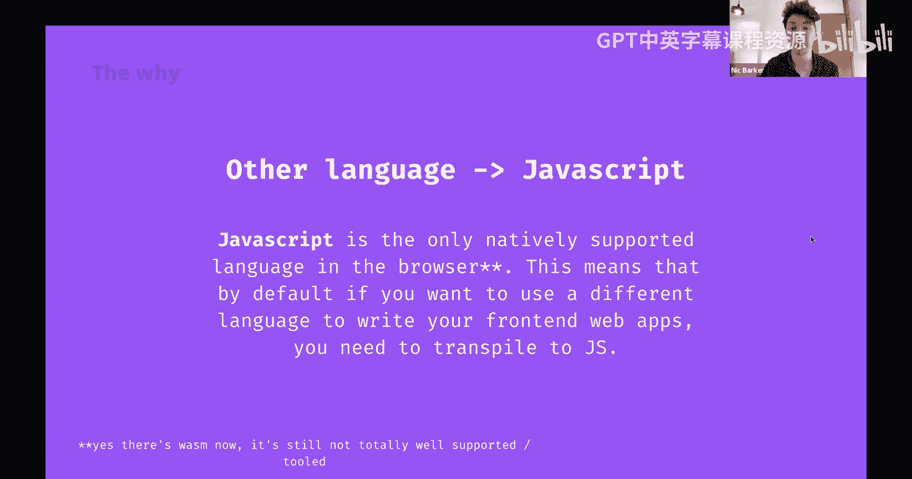
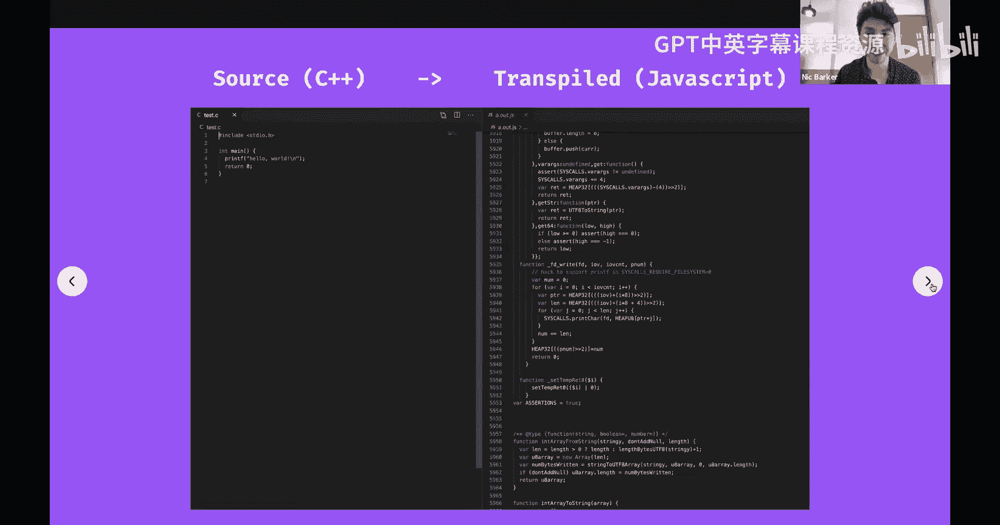
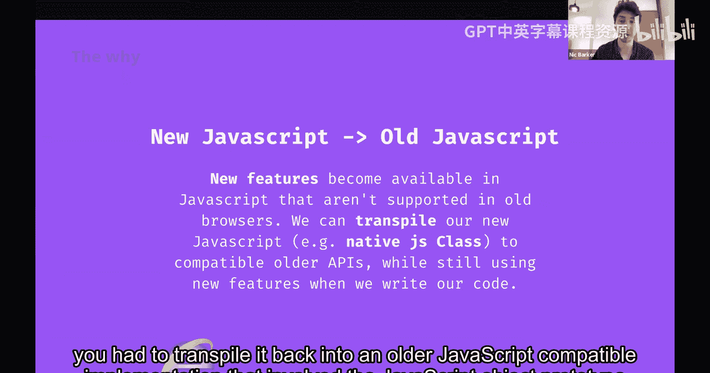
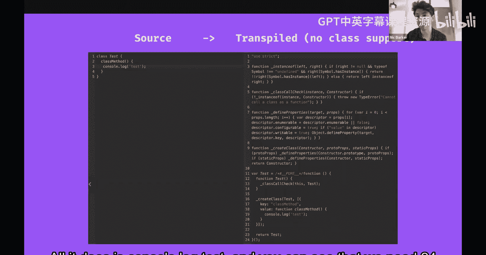
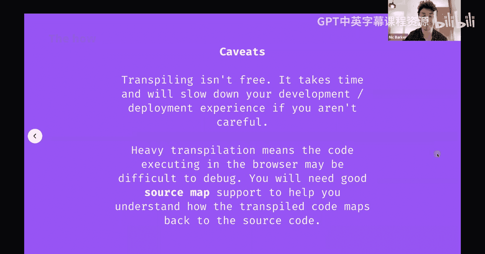

# 051：JavaScript 与 NodeJS 转译 🐸


## 概述

在本节课中，我们将要学习 **转译** 的概念。转译是前端开发中一个至关重要的过程，它允许我们使用现代或不同的编程语言编写代码，并将其转换为浏览器能够理解和执行的 JavaScript 代码。我们将探讨转译的定义、常见用例、工作原理以及它带来的利弊。

---

## 什么是转译？🤔

上一节我们介绍了课程主题，本节中我们来看看转译的具体定义。

**转译** 是 **转换** 和 **编译** 两个词的结合。编译是将源代码（如 C++）转换为机器码的过程，以便计算机直接执行。相比之下，转译是将一种源代码转换为另一种源代码的过程。转译的输出通常仍然需要被编译或解释才能最终执行。



一个直接的例子是：
*   **编译**：使用编译器将 C++ 代码转换为机器码（可执行文件）。
*   **转译**：将 C++ 代码转换为功能等效的 JavaScript 代码。

---



## 为什么需要转译？🔧

理解了转译的基本概念后，我们来看看它在实际开发中的主要应用场景。以下是转译的几个关键用例：

### 1. 将其他语言转换为 JavaScript

由于历史上 JavaScript 是浏览器原生支持的唯一语言，如果你想用其他语言（如 C++）编写程序并在浏览器中运行，就必须将其转译为 JavaScript。这在将大型遗留代码库迁移到 Web 平台时非常常见。



例如，使用 **Emscripten** 库可以将 C++ 代码转译为 JavaScript。为了模拟 C++ 的接口和行为，转译后的代码通常包含大量包装和模拟代码，即使是一个简单的“Hello World”程序也可能生成上万行 JavaScript 代码。



### 2. 将新 JavaScript 转换为旧 JavaScript

随着 JavaScript 语言的发展，新特性和 API 不断加入。但用户可能使用各种旧版浏览器访问网站。为了保持兼容性，我们可以用新语法编写代码，然后将其转译为旧版浏览器能理解的 JavaScript。

例如，在原生 `class` 语法不被广泛支持时，转译工具（如 **Babel**）会将 `class` 转换为使用原型和构造函数的老式写法。

**代码示例：**
```javascript
// 转译前 (ES6+)
class Test {
  method() {
    console.log('test');
  }
}

// 转译后 (ES5)
var Test = (function () {
  function Test() {}
  Test.prototype.method = function () {
    console.log('test');
  };
  return Test;
})();
```

### 3. 将 JavaScript 变体/超集转换为 JavaScript

一些语言在 JavaScript 基础上进行了扩展，以解决其某些不足，但它们本身无法在浏览器中直接运行。

*   **TypeScript**：为 JavaScript 添加了静态类型检查。转译过程会剥离类型注解，生成纯 JavaScript。
    ```typescript
    // TypeScript 源码（带类型注解）
    function greet(name: string): string {
      return `Hello, ${name}`;
    }
    // 转译为 JavaScript
    function greet(name) {
      return `Hello, ${name}`;
    }
    ```
*   **CoffeeScript**：提供更简洁的语法（现已不太流行）。

### 4. 代码压缩与混淆

这是转译在前端优化和安全方面的应用。

*   **压缩**：目的是减少需要下载的代码体积，以加快网页加载速度。过程包括：
    *   删除空白字符和注释。
    *   缩短变量和函数名。
    *   进行更高级的优化（如删除死代码）。
*   **混淆**：目的是增加代码被反向工程的难度，保护知识产权。过程与压缩类似，但更侧重于让代码难以阅读和理解。

**Google Closure Compiler** 在高级模式下是压缩和优化的极致体现。它能深度分析代码，删除未使用的部分，甚至内联函数，最终输出执行结果相同但体积最小化的代码。

---

## 转译是如何工作的？⚙️

了解了各种用例后，我们来看看转译通常如何集成到开发流程中。

在现代前端开发中，我们使用构建工具（如 **Webpack**、Rollup、Vite）来管理转译流程。开发人员编写的源代码通常不能直接运行，需要经过一个“构建”步骤。

这个构建管道由一系列插件或加载器组成，每个负责一项特定的转译任务（例如，用 Babel 转译 JS，用 Sass 编译器处理 CSS）。通过配置这些工具，我们可以将 TypeScript、JSX、现代 JavaScript 语法等，一步步转换为浏览器兼容的、优化过的最终代码。

---

## 转译的代价 💡

虽然转译非常强大，但它并非没有成本。在结束之前，我们需要了解其潜在缺点：

1.  **构建速度**：对于大型项目，转译（尤其是 TypeScript 编译）可能非常耗时。复杂的构建管道会拖慢开发迭代速度。
2.  **调试难度**：经过重度压缩和转译后，浏览器中运行的代码与源代码截然不同。当发生错误时，错误堆栈指向的是转译后的代码，难以定位原始问题。
3.  **需要源映射**：为了解决调试问题，需要生成和维护 **源映射** 文件。源映射能将压缩代码中的行号映射回原始源代码，但这要求所有调试和错误监控工具都支持源映射。

---

## 总结

本节课中我们一起学习了 **转译** 在前端开发中的核心作用。我们了解到，转译是将源代码转换为另一种源代码的过程，它使得我们能够使用现代语言特性、确保浏览器兼容性、优化代码性能并保护代码逻辑。

关键要点包括：
*   转译不同于编译，其输出仍是源代码。
*   主要应用包括：语言转换、版本降级、处理 JavaScript 超集以及代码压缩混淆。
*   转译通过 **Webpack** 等构建工具及其插件生态系统在开发流程中自动完成。
*   转译会带来构建耗时和调试复杂化等代价，需要通过源映射等技术来缓解。



希望本讲能帮助你理解，当你在项目中运行 `npm run build` 时，背后有多少“转译”魔法正在发生。