# 054：ReactJS useEffect Hook 💥

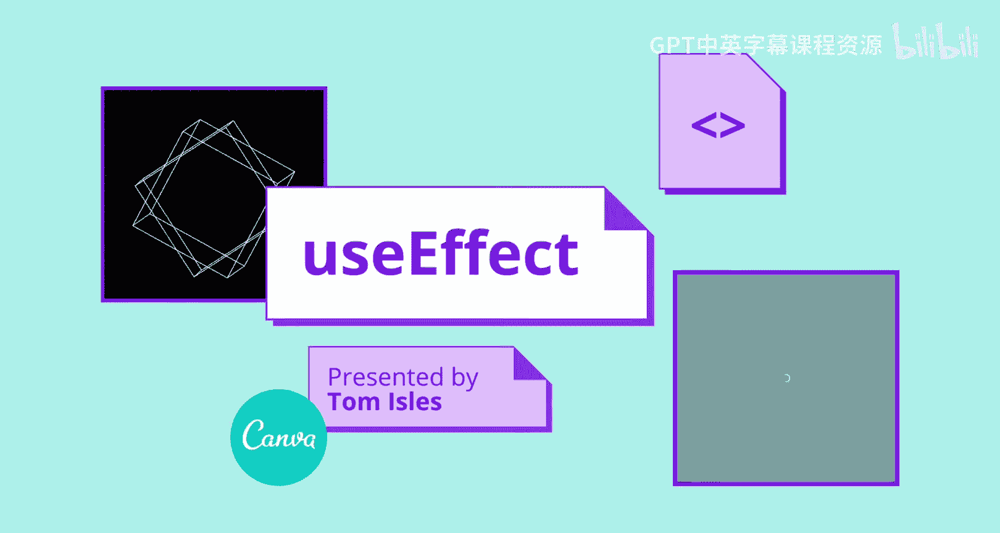

在本节课中，我们将学习React中一个强大但有时令人困惑的钩子：`useEffect`。我们将通过构建一个秒表应用来理解它的工作原理、语法以及如何避免常见的陷阱。

---

## 概述

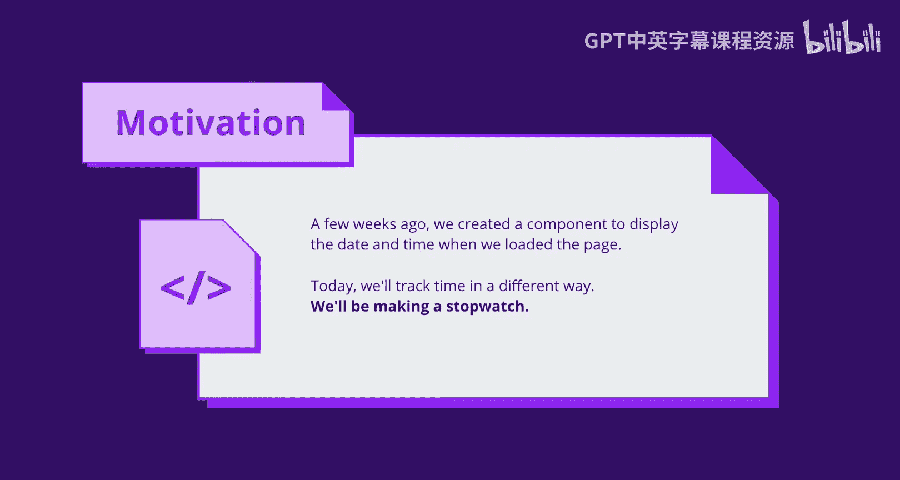

`useEffect` 是React的核心钩子之一，它允许我们在函数组件中执行副作用操作。副作用是指那些与组件渲染结果没有直接关系的操作，例如数据获取、订阅或手动修改DOM。本节课我们将通过一个秒表应用的逐步构建，来掌握 `useEffect` 的用法。


---

## 从基础应用开始

几周前，我们创建了一个基础的React应用，它在页面加载时显示本地格式的日期和时间。这个程序本身并不十分实用。今天，我们将更新它。在本节课结束时，我们将创建一个秒表应用，可以计算自页面加载以来经过的分钟和秒数。

理论上，我们已经拥有了所需的一切。我们有组件，也有允许我们在定时器上运行代码的 `setInterval` 函数。所以这应该相当简单。让我们进行第一次尝试。

---

## 第一次尝试：定义外部变量

以下是一个示例应用，目前还没有数据。让我们尝试在函数组件外部定义一个定时器和一个重置函数，然后添加一些JSX。

```javascript
let seconds = 0;
let intervalId;

function reset() {
  seconds = 0;
}

intervalId = setInterval(() => {
  seconds++;
}, 1000);
```

我在这里设置了一个每秒运行一次的定时器，它会使秒数加一。我还定义了一个重置函数，将秒数设回0。现在，我有了逻辑，只需要显示它。所以我在一个 `div` 中渲染秒数，并添加一个重置按钮。

但是，秒数显示在这里，却没有任何变化。秒数没有增加，我也不确定重置按钮是否起作用，因为秒数已经是0了。

---

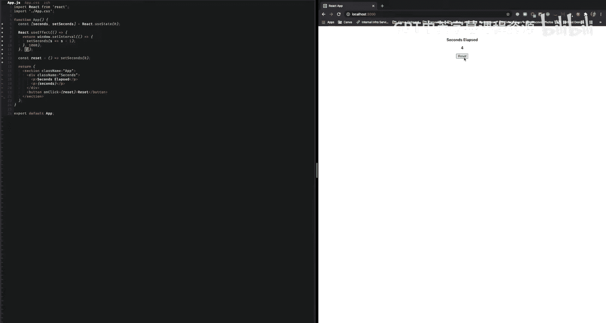

## 第二次尝试：使用 `useState` 钩子

我们可以尝试使用 `useState` 钩子来存储秒数，这在前面的课程中你应该已经熟悉了。

```javascript
import { useState } from 'react';

function App() {
  const [seconds, setSeconds] = useState(0);

  const intervalId = setInterval(() => {
    setSeconds(seconds + 1);
  }, 1000);

  function reset() {
    setSeconds(0);
  }

  return (
    <div>
      <div>Seconds elapsed: {seconds}</div>
      <button onClick={reset}>Reset</button>
    </div>
  );
}
```

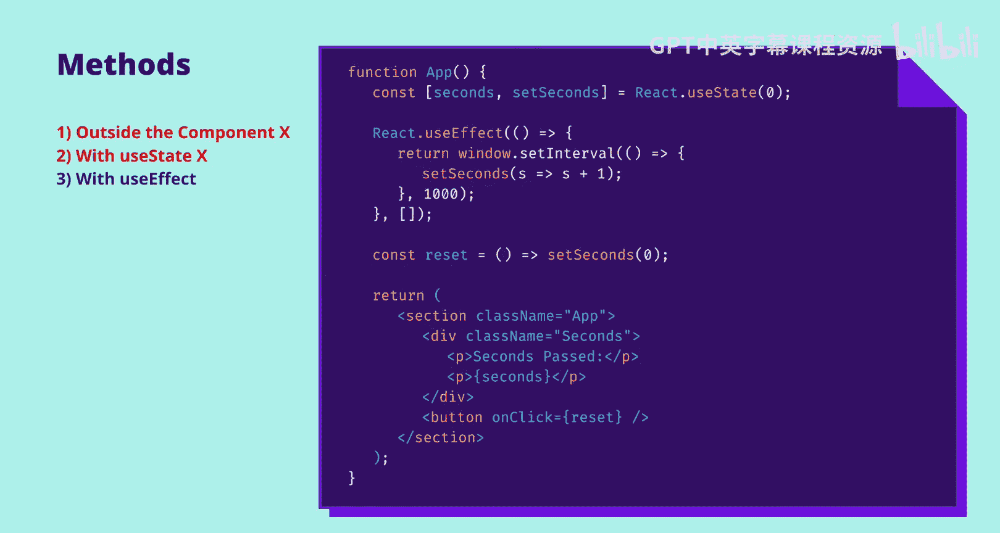

现在秒数在流逝，很好。我可以重置。但是看看秒数发生了什么变化：我点击重置的次数越多，数字增长得越快。简单解释一下，这里发生的情况是，每次我重置时，`setInterval` 调用都会被再次执行，这意味着它试图每秒多次增加秒数。

---

## 解决方案：使用 `useEffect` 钩子

让我们尝试使用 `useEffect` 调用。在这个方法中，我们实际上将 `setInterval` 放在了 `useEffect` 函数内部。

```javascript
import { useState, useEffect } from 'react';

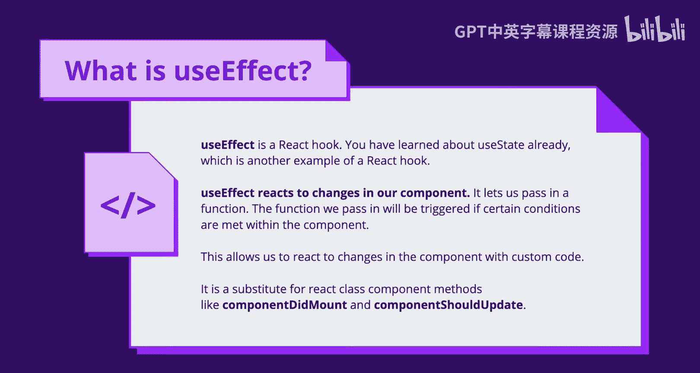

function App() {
  const [seconds, setSeconds] = useState(0);

  useEffect(() => {
    const intervalId = setInterval(() => {
      setSeconds(prevSeconds => prevSeconds + 1);
    }, 1000);

    return () => clearInterval(intervalId);
  }, []);

  function reset() {
    setSeconds(0);
  }

  return (
    <div>
      <div>Seconds elapsed: {seconds}</div>
      <button onClick={reset}>Reset</button>
    </div>
  );
}
```

秒数在流逝，到目前为止看起来不错。让我们试试重置按钮，仍然正常。

---

## 理解 `useEffect` 的作用

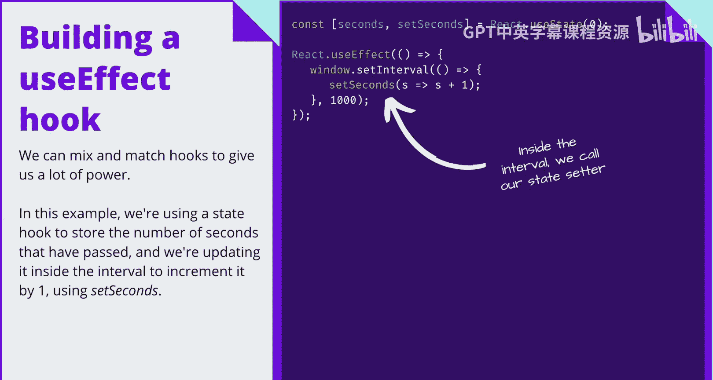

我刚刚尝试了一系列方法，但效果都不太好。在函数组件外部定义计数器意味着React实际上无法看到何时有东西被增加。使用 `useState` 钩子稍好一些，但也好不了多少。它完美地增加了秒数，但当我点击重置时，它重新定义了定时器，导致非常混乱。当我放弃那种方法并使用 `useEffect` 钩子时，一切都完美运行了。


很明显 `useEffect` 很有用，但我们还不理解为什么或它是如何工作的。它到底是什么？

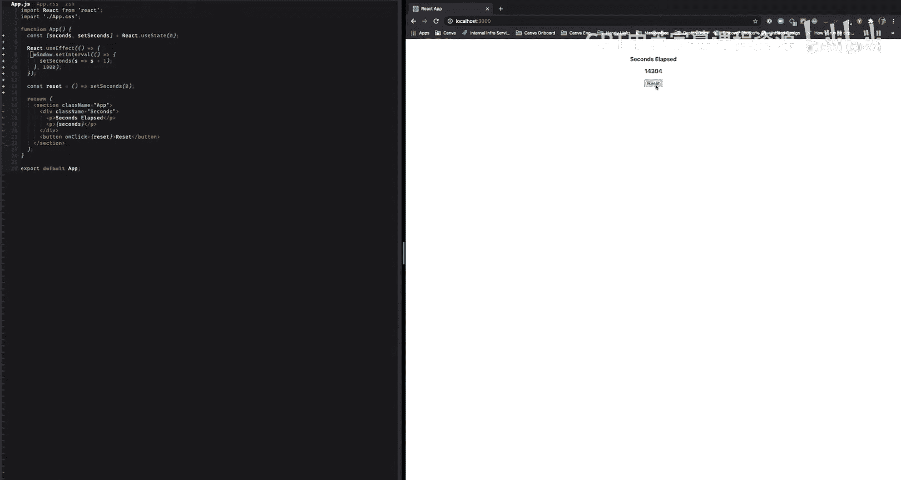

`useEffect` 是一个React钩子。你已经使用了 `useState`，与 `useEffect` 配对，这两个钩子是基础性的。没有它们，你基本上无法做任何有意义的事情。简而言之，`useEffect` 允许我们传入自定义代码，这些代码将在组件中的特定条件下被触发。它使我们能够运行任何我们想要的逻辑，并确保它在组件生命周期的正确时间被触发。

因此，`useEffect` 是一个非常强大的钩子。但代价是语法有点令人困惑，并且有很多边缘情况需要处理。

---

## `useEffect` 语法详解

因为语法如此，我们将逐步构建对它的理解。在幻灯片的右侧，你可以看到一个 `useEffect` 声明。

`useEffect` 是一个函数，它接受一个或两个参数。`useEffect` 的第一个参数是你希望被触发的函数。在这个例子中，我们设置了一个定时器，使其大约每秒运行一次。

钩子非常强大，因为你可以将它们组合在一起。所以在这个例子中，我们使用一个状态钩子来存储经过的秒数，然后在定时器内部，我们使用 `setSeconds` 回调函数将其增加一。

---

## 依赖数组的作用

让我们看看使用我们半成品的钩子会发生什么。

我相当确定时间不会过得那么快。所以很明显，我们仍然缺少一些东西。

这就是 `useEffect` 的第二个参数发挥作用的地方。我们称这个参数为**依赖数组**。在这个数组中，我们提供了一系列props或状态对象的列表。

我之前提到过，有一组条件将决定你提供给 `useEffect` 的函数是否运行。因此，如果你的依赖数组中定义的任何引用以任何方式发生变化，那么 `useEffect` 内部的函数将被触发。如果组件渲染了，但数组中的props和状态没有改变，那么函数就不会触发。

如果你不提供依赖数组，那么该函数将在组件每次渲染后运行。这通常是不希望的。它可能导致无限循环、性能问题，并且其使用场景非常有限。

你可以看到我这里提供了一个空数组。这意味着该效果将在组件首次渲染时运行，但之后永远不会再运行，因为它不依赖于任何props或状态。

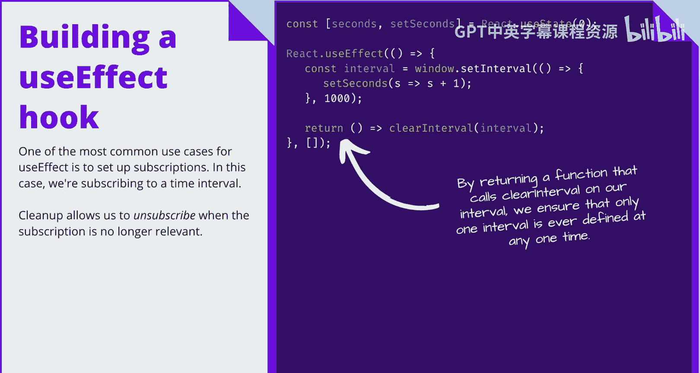

区分空数组和根本没有参数非常重要。没有参数意味着没有依赖数组，但空数组意味着它不依赖于任何东西。

---

## 清理函数

至此，我们有了一个可用的 `useEffect` 函数。它调用 `setInterval` 来设置每秒增加秒数。然而，如果组件从树中被移除或不再渲染，会发生什么？定时器还会运行吗？答案是会的，定时器会一直运行，因为它绑定到了window对象上。

我们需要一种方法来确保当组件不在树上或被移除时，可以清理这个定时器。这就是**清理函数**的作用。

`useEffect` 允许我们返回一个回调函数，我们称之为清理函数。在这个例子中，我们用它来清除之前设置的定时器。

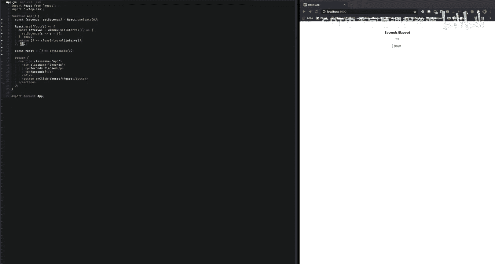

清理函数在两种情况下被触发：当组件从树中被移除时，以及在 `useEffect` 下一次运行之前立即触发。

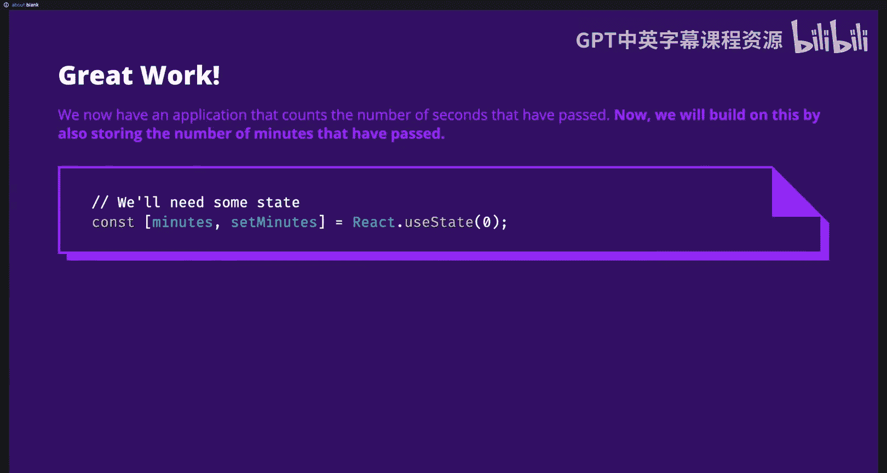

`useEffect` 最常见的用例之一是设置订阅。在这个例子中，我们订阅了一个时间间隔。清理函数允许我们在订阅不再相关时取消订阅。

---

## 完整的秒表示例

刚才的内容信息量很大。所以让我们看看之前的 `useEffect` 调用。

你可以看到这里我定义了一个 `useEffect` 函数。第一个参数是一个函数，第二个是一个空数组，这意味着该函数只会在组件首次渲染后触发。

在函数内部，我们设置了一个定时器，每秒增加我们的存储值。我们还返回了一个清理函数，用于清除之前定义的定时器。每当组件从树中被移除，或者效果函数再次运行时（由于我们添加了空的依赖数组，它不会再次运行），清理函数都会运行。

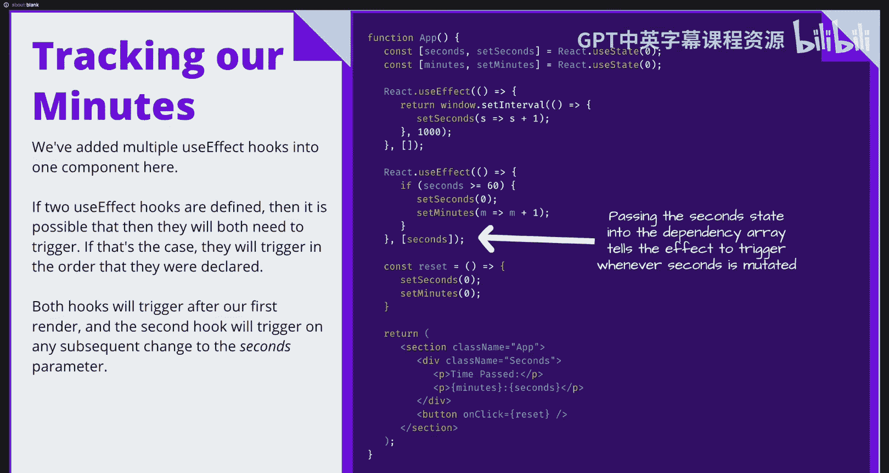

所有这些都意味着，定时器在组件渲染时被设置，在组件消失时被清除。

---

## 扩展应用：添加分钟计数

好的，现在我们有了一个计算经过秒数的应用。我们可以在此基础上扩展，同时存储经过的分钟数。为此，我们将使用一个 `useState` 钩子来存储我们的分钟数。

你可以看到这里我做了一些更改：我们使用了两个 `useState` 钩子。重置调用将分钟数设置为0，并且我们同时渲染分钟和秒数。我们仍然需要使用 `useEffect` 钩子。所以我们在当前的 `useEffect` 钩子下面添加它。

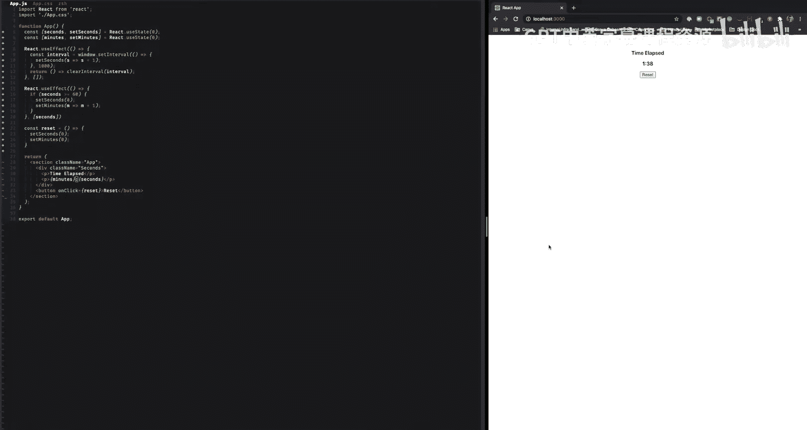

我们所做的是传入一个函数，规定如果我们有超过60秒，就将秒数重置为0，并将分钟数增加一。

你可以看到，我们的依赖数组中实际上有东西：`seconds`。每次 `seconds` 发生变化时，这个效果都会被触发。这意味着当定时器每秒被调用时，它会增加 `seconds` 变量，这将自动触发下一个效果。

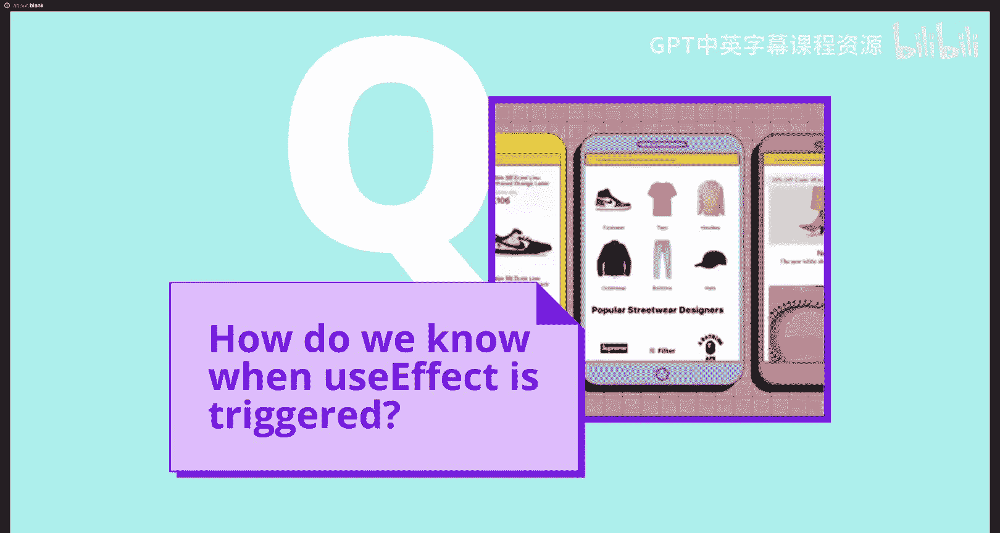

如果你定义了多个同时运行的效果，它们被声明的顺序也是它们被触发的顺序。

---

## 最终代码演示

让我们看看。首先，我在一个 `useState` 钩子中存储我的分钟数。然后我更新重置回调函数，将分钟数和秒数都设置为0。现在，我的效果钩子：当秒数达到60时重置秒数并增加分钟数。我们还需要确保效果钩子在正确的时间被触发，所以我们添加了依赖数组并把 `seconds` 放进去。我们现在知道，每当 `seconds` 改变时，该效果就会触发。

现在你可以看到秒数在流逝。当我们达到一分钟时，分钟数应该增加。

---

## 总结

就这样，我们成功地创建了一个秒表。如果你愿意，我们将任何其他细节留作你在家完成的练习。同时，我们将更深入地探讨 `useEffect` 是如何工作的以及它是如何被触发的。

首先，让我们回顾一下React组件中何时会发生渲染。如果一个React组件的props发生变化、其内部状态发生变化，或者树中它上面的组件被重新渲染，那么它就会重新渲染。

如果其数组中的某个依赖项发生突变，或者如果你没有提供数组，那么在每次渲染之后，`useEffect` 的回调函数都会被调用。函数本身总是在渲染之后直接调用。

人们批评 `useEffect` 不必要地复杂，但它实际上非常重要，因为它有助于保持我们的函数纯粹。我的意思是，给定相同的props和状态，组件应该总是返回相同的JSX。如果我们没有这一点，那就意味着我们有像副作用这样的东西，这使得保持代码正确和可维护变得非常困难。使用 `useEffect` 允许我们将自定义代码沙盒化。

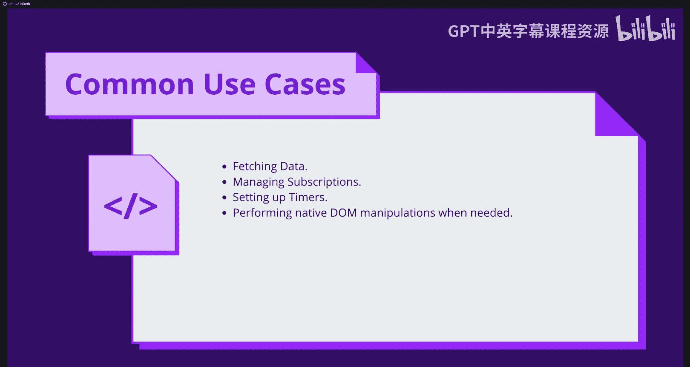

我们也将其称为**确定性**，这也是我们所有状态都需要被React跟踪的相同原因。如果它需要跟踪组件外部的变量，那么我们永远无法真正保证我们的函数组件是确定性的或纯粹的，因为这些变量在它们外部，并且可能随时改变。这就是为什么我们使用 `useState` 在React循环内部存储变量，以便它们可以被跟踪。同样，`useEffect` 也是如此，但它不是存储状态，而是允许我们沙盒化和执行自定义代码。

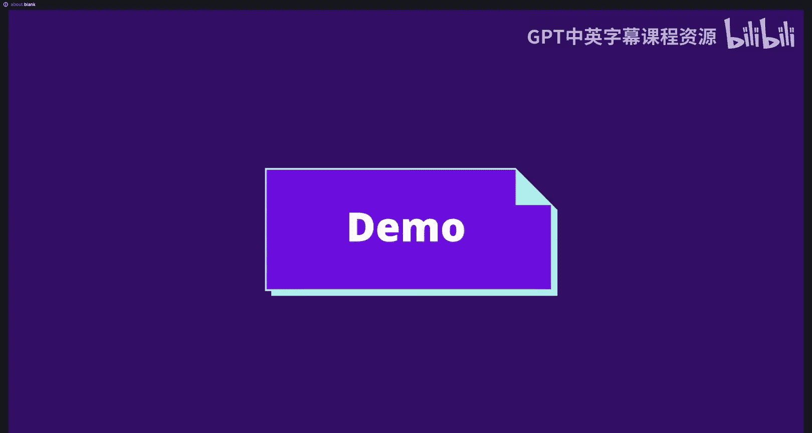

这允许我们做很多事情。我们可以从远程源获取数据，这是 `useEffect` 非常常见的用例；管理订阅；像我们用秒表那样设置定时器；以及在需要时执行原生DOM操作。

---

## 其他用例：获取数据

让我们看看从远程源获取数据。

好的，我在网上找到了一个免费的API，可以给你提供关于猫的随机事实。我喜欢猫，所以这对我来说是个胜利。我将加载状态和猫的事实存储在不同的 `useState` 钩子中。

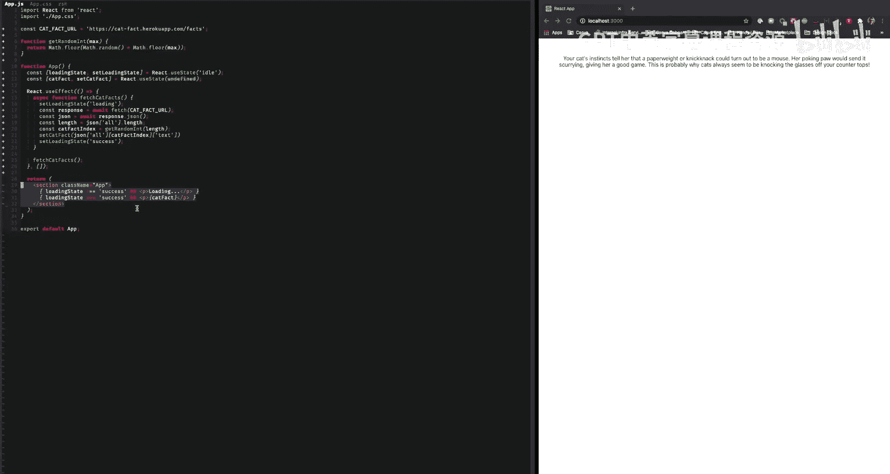

`useEffect` 是一个异步函数。它做的第一件事是将我们的加载状态设置为“加载中”。然后执行获取逻辑。我们获取数据，获取JSON，获取猫事实的数量，并从中提取一个随机的猫事实。最后，我们设置猫事实并将加载状态设置为“成功”。现在，如果我刷新，你可以看到每次都会得到一个随机的猫事实。

还要注意在JSX中，我实际上根据加载状态渲染不同的内容。这是React中一个非常常见的模式。

---

## 注意事项和边缘情况

在结束之前，我只想提醒你一些关于 `useEffect` 可能会让你出错的边缘情况。

当你在 `useEffect` 中定义依赖数组时，ESLint会自动添加你使用的任何状态或prop，而你对此没有太多发言权。这意味着我们需要小心在效果中读取什么状态。

在第一个例子中，从技术上讲，我正在读取 `seconds` 变量，所以它会被添加到依赖数组中。但我也在效果中设置它。所以如果我在效果中设置 `seconds`，而它也是我依赖项的一部分，那么效果将在无限循环中反复触发自己。这就是为什么我向 `setSeconds` 传递一个函数。

此外，永远记住效果函数只在渲染之后被调用。所以你的组件第一次渲染时，不会有任何效果被触发。如果你期望你的函数在组件渲染之前被调用，这可能会让你措手不及。`useLayoutEffect` 是解决这个问题的方案。它是与 `useEffect` 相同的钩子，但它在渲染之前触发。但请注意，在可能的情况下，不建议使用 `useLayoutEffect`，你应该使用 `useEffect` 工具。

---

## 课程总结

在本节课中，我们一起学习了React的 `useEffect` 钩子。我们从构建一个简单的秒表应用开始，逐步理解了其核心语法：一个包含副作用逻辑的回调函数和一个可选的依赖数组。我们探讨了依赖数组如何控制副作用的执行时机，以及清理函数如何帮助我们管理资源（如定时器和订阅），避免内存泄漏。最后，我们还了解了 `useEffect` 在数据获取等常见场景中的应用，并提醒了一些需要注意的边缘情况。


`useEffect` 是管理React组件副作用的关键工具，熟练掌握它将使你能够构建更健壮、更高效的Web应用。