# 058：React Router Dom 入门指南 🧭


在本节课中，我们将学习如何使用 React Router Dom 库来构建具有多个“页面”的 React 单页应用。我们将解决如何将组件与特定URL关联、如何在不刷新页面的情况下进行导航，以及如何捕获动态URL参数。

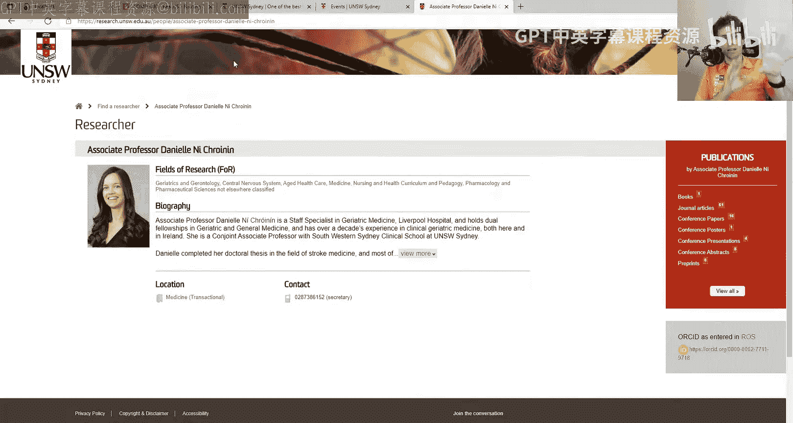

## 概述

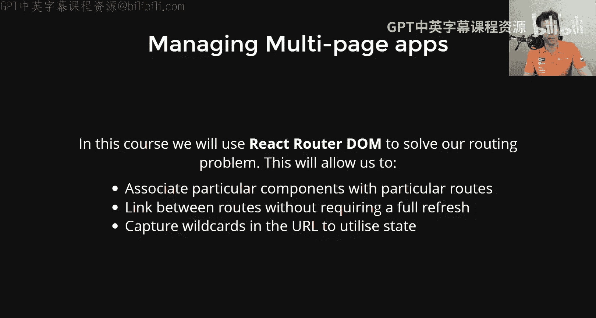


传统的多页网站在点击链接时会刷新整个页面。React 单页应用的目标是提供无缝的导航体验，只更新页面中需要变化的部分。React Router Dom 是实现这一目标的流行库。

## 安装与基础设置

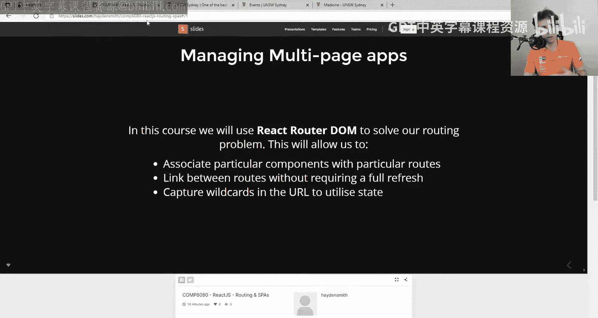

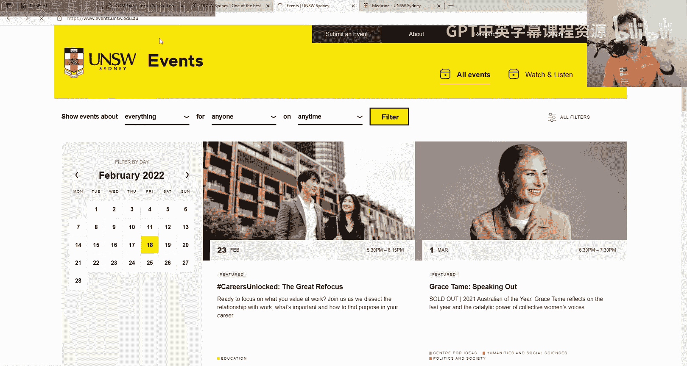

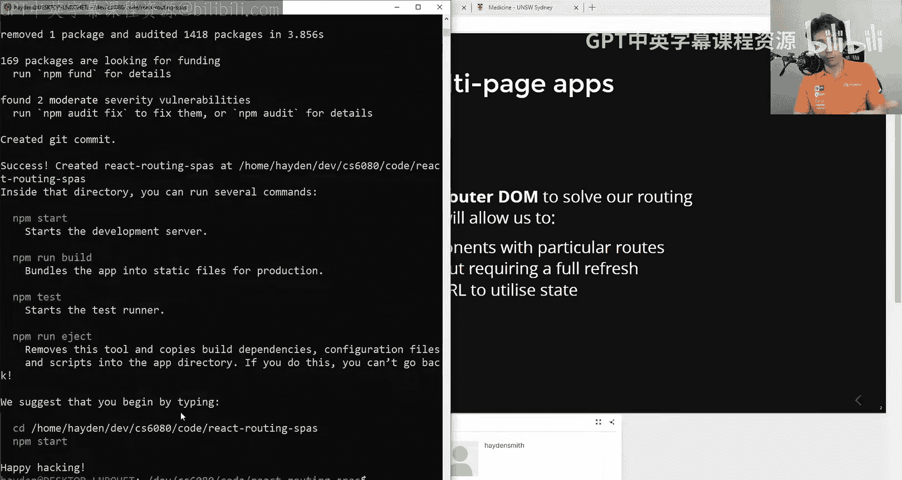

首先，我们需要创建一个新的 React 应用并安装 React Router Dom 库。

以下是安装命令：
```bash
npm install react-router-dom
```

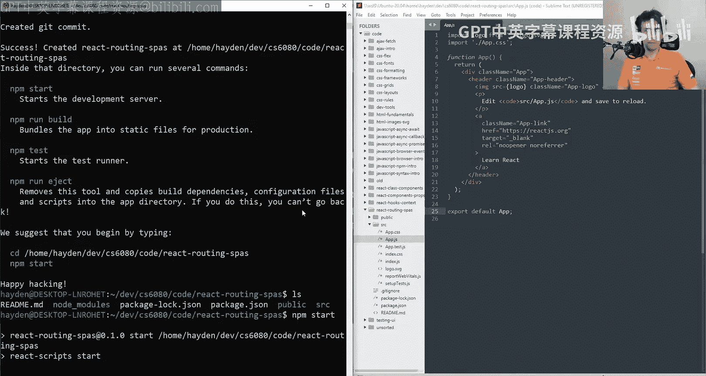

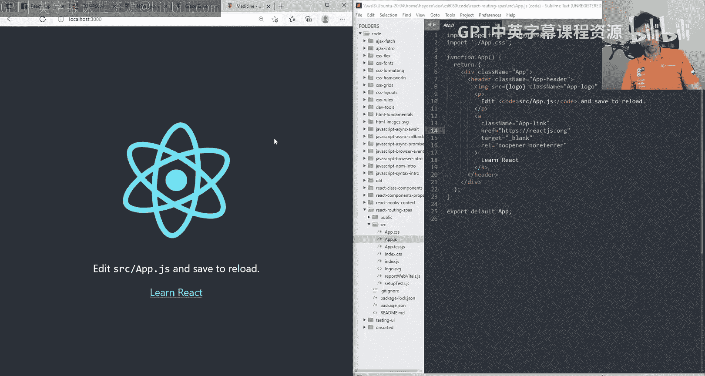

请注意，本教程基于 React Router Dom v6 版本，它与 v5 版本有较大差异。

## 关联组件与路由

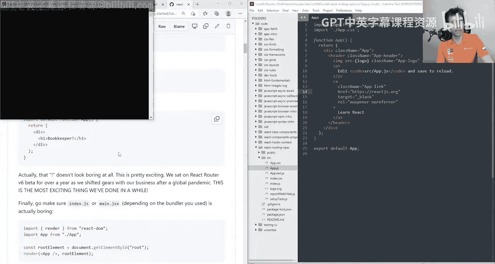

上一节我们安装了库，本节中我们来看看如何将不同的 React 组件映射到不同的 URL 路径上。

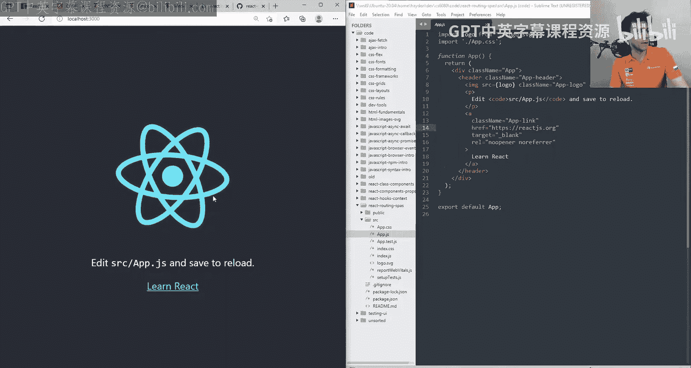

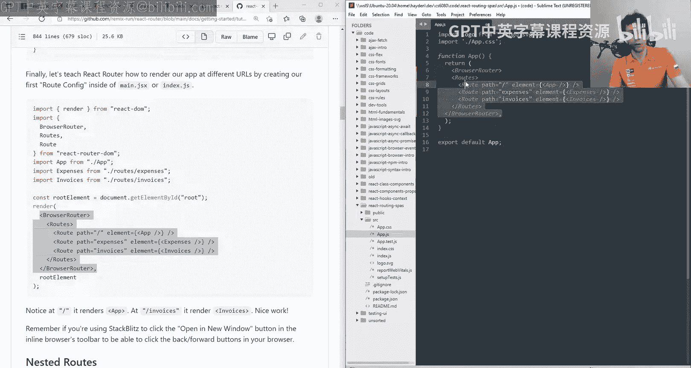

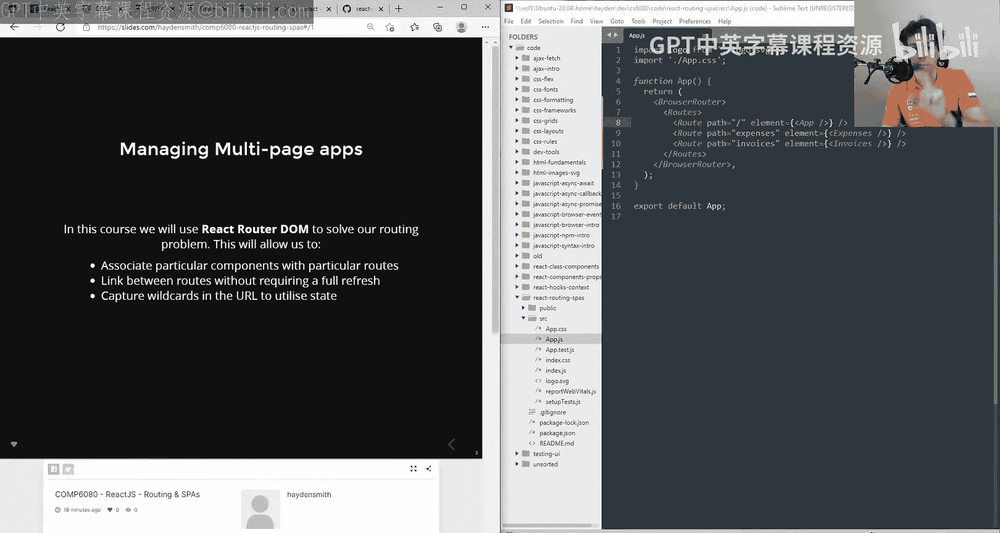

核心概念是使用 `BrowserRouter`、`Routes` 和 `Route` 组件。`BrowserRouter` 是路由的容器，`Routes` 定义了路由规则，`Route` 将路径映射到具体的组件。

以下是基础的路由结构代码：
```jsx
import { BrowserRouter, Routes, Route } from 'react-router-dom';

function App() {
  return (
    <BrowserRouter>
      <Routes>
        <Route path="/" element={<Home />} />
        <Route path="/about" element={<About />} />
        <Route path="/profile" element={<Profile />} />
      </Routes>
    </BrowserRouter>
  );
}
```

在上面的代码中，我们定义了三个简单的组件：`Home`、`About` 和 `Profile`。当用户访问根路径 `/` 时，会渲染 `Home` 组件；访问 `/about` 时，渲染 `About` 组件，依此类推。

## 创建导航链接

我们已经将组件与路由关联起来，现在需要一种方式让用户在不同“页面”间跳转。如果使用传统的 `<a>` 标签，会导致页面完全刷新，这不是我们想要的。

React Router Dom 提供了 `Link` 组件来解决这个问题。`Link` 组件在内部处理导航，只更新必要的部分，而不会导致整个页面重新加载。

以下是创建导航栏的步骤：

首先，我们创建一个 `Nav` 组件。**重要**：所有使用 React Router Dom 组件（如 `Link`）的代码，必须位于 `BrowserRouter` 组件内部。

```jsx
import { Link } from 'react-router-dom';

function Nav() {
  return (
    <nav>
      <Link to="/">Home</Link>
      &nbsp;&nbsp;|&nbsp;&nbsp;
      <Link to="/about">About</Link>
      &nbsp;&nbsp;|&nbsp;&nbsp;
      <Link to="/profile">Profile</Link>
    </nav>
  );
}
```

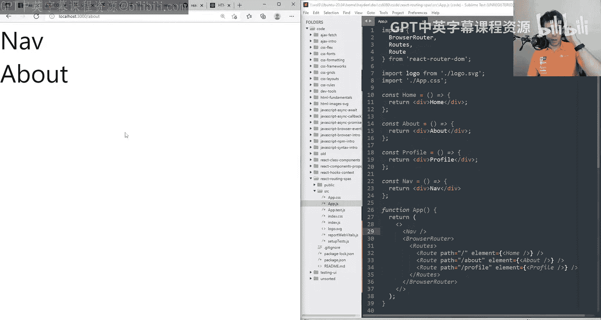

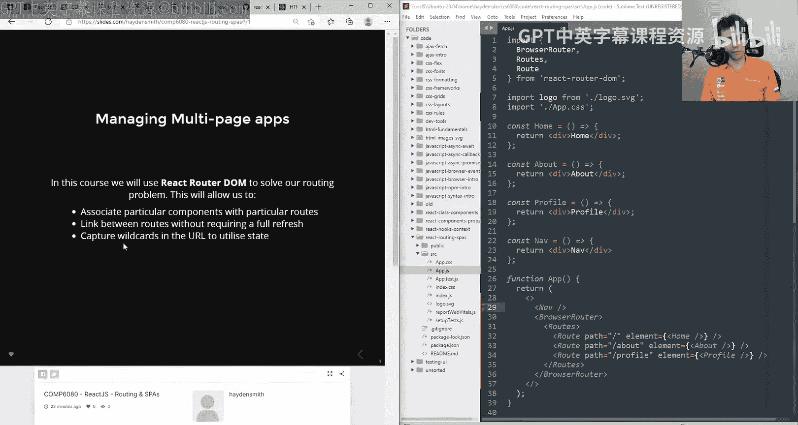

然后，我们将 `Nav` 组件放入 `App` 组件中，确保它在 `BrowserRouter` 内部，但在 `Routes` 外部，这样它就会在所有页面上显示。

```jsx
function App() {
  return (
    <BrowserRouter>
      <Nav />
      <Routes>
        {/* ... 路由定义 ... */}
      </Routes>
    </BrowserRouter>
  );
}
```

现在，点击这些链接可以在不同组件间无缝切换，浏览器不会完全刷新。

## 捕获动态路由参数

在实际应用中，我们经常需要根据URL中的信息动态渲染内容，例如用户资料页 `/profile/hayden`。我们不可能为每个用户都创建一个单独的组件文件。

React Router Dom 允许我们在路径中使用“通配符”（或参数）来匹配动态URL。

我们可以这样定义路由：
```jsx
<Route path="/profile/:name" element={<Profile />} />
```
这里的 `:name` 就是一个参数占位符，可以匹配 `/profile/hayden`、`/profile/emily` 等路径。

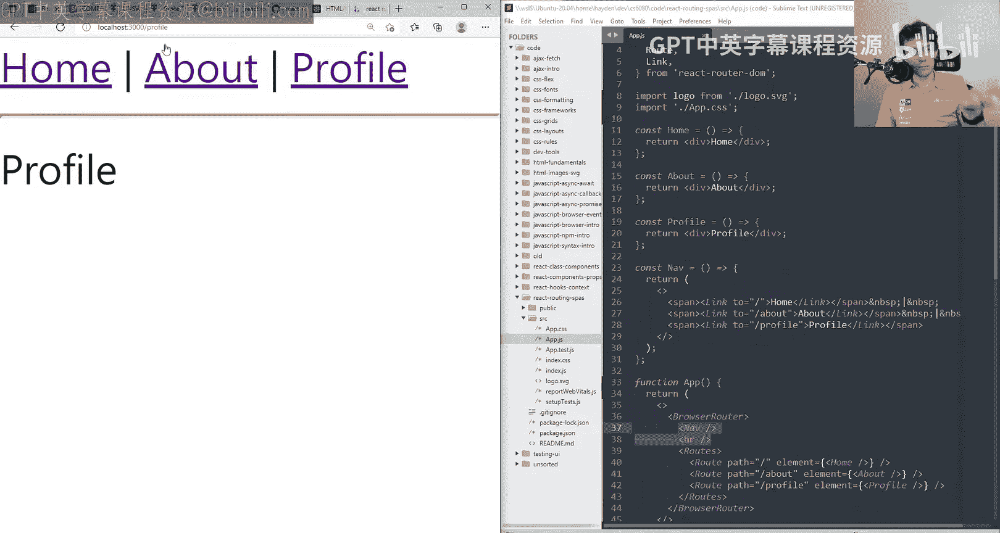

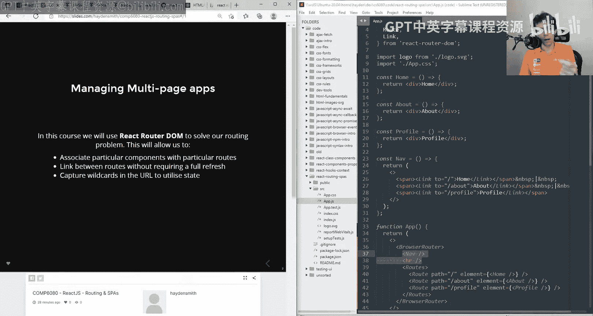

接下来，在 `Profile` 组件内部，我们需要获取这个 `name` 参数的值。这需要使用 `useParams` 钩子。

以下是 `Profile` 组件的示例代码：
```jsx
import { useParams } from 'react-router-dom';

function Profile() {
  const params = useParams();
  const name = params.name; // 获取URL中的 :name 部分

  if (!name) {
    return <p>请输入一个名字。</p>;
  }

  return <h1>个人资料：{name}</h1>;
}
```
`useParams()` 返回一个对象，其键值对对应于路由定义中的参数（例如 `{ name: ‘hayden’ }`）。这样，我们就可以根据不同的URL动态显示内容。

## 编程式导航

有时我们需要在代码中触发导航，例如表单提交后。虽然可以使用 `window.location.href`，但这会导致页面刷新。

React Router Dom 提供了 `useNavigate` 钩子来实现不刷新的编程式导航。

以下是一个带有输入框和按钮的组件示例，点击按钮后导航到对应的个人资料页：
```jsx
import { useState } from ‘react’;
import { useNavigate } from ‘react-router-dom’;

function NameInput() {
  const [inputName, setInputName] = useState(‘’);
  const navigate = useNavigate(); // 获取导航函数

  const handleGo = () => {
    // 使用 navigate 函数进行导航，不会刷新页面
    navigate(`/profile/${inputName}`);
  };

  return (
    <div>
      <input
        value={inputName}
        onChange={(e) => setInputName(e.target.value)}
      />
      <button onClick={handleGo}>前往</button>
    </div>
  );
}
```

## 嵌套路由

React Router Dom v6 支持嵌套路由，这有助于组织具有共同布局或父级路径的页面。

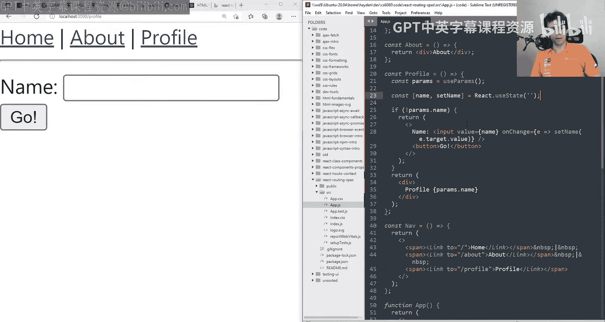

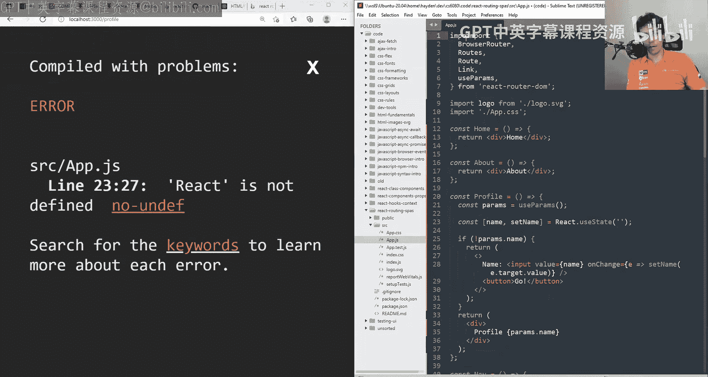

例如，假设我们有 `/about`、`/about/team` 和 `/about/history` 这几个页面。我们可以这样组织路由：

```jsx
<Routes>
  <Route path=“/about” element={<About />}>
    <Route path=“team” element={<AboutTeam />} />
    <Route path=“history” element={<AboutHistory />} />
  </Route>
</Routes>
```

在父路由组件 `About` 中，我们需要使用 `<Outlet />` 组件来指定子路由组件渲染的位置。

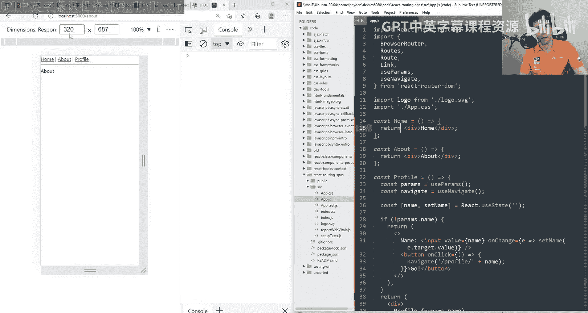

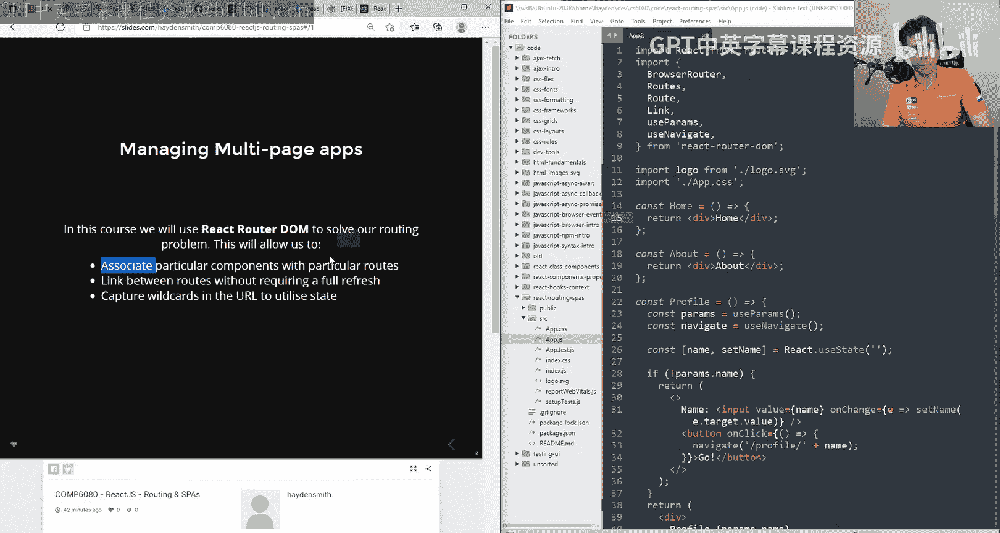

```jsx
import { Outlet } from ‘react-router-dom’;

function About() {
  return (
    <div>
      <h1>关于我们</h1>
      {/* 子路由组件将在这里渲染 */}
      <Outlet />
    </div>
  );
}
```
当访问 `/about/team` 时，`About` 组件和 `AboutTeam` 组件会一起渲染，`AboutTeam` 的内容会出现在 `<Outlet />` 的位置。

## 总结

本节课中我们一起学习了 React Router Dom 的核心功能。

我们首先学习了如何**将特定组件关联到 URL 路由**，使用 `BrowserRouter`、`Routes` 和 `Route` 组件搭建应用骨架。

接着，我们探索了如何使用 `Link` 组件在路由间**进行无缝导航，避免页面完全刷新**，从而提升用户体验。

然后，我们解决了**如何捕获动态 URL 参数**的问题，通过 `:parameter` 语法定义通配符路径，并使用 `useParams` 钩子在组件中获取这些参数值，以实现动态内容渲染。

此外，我们还介绍了如何使用 `useNavigate` 钩子进行**编程式导航**，以及在 v6 版本中如何利用嵌套路由和 `<Outlet />` 组件来**组织复杂的页面结构**。

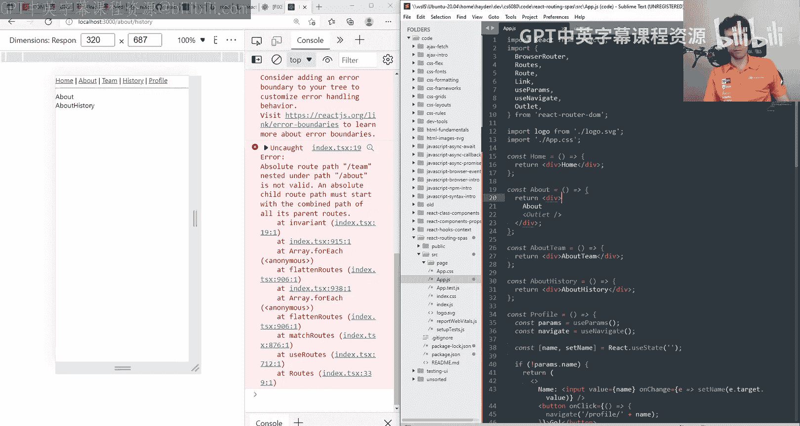

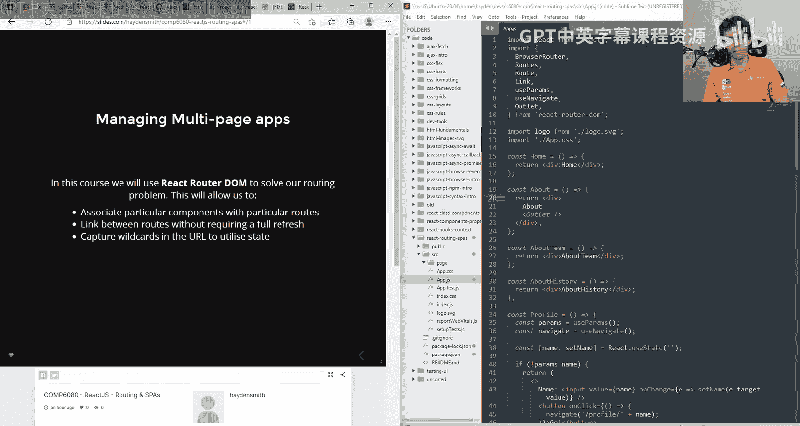

通过掌握这些概念，你现在可以构建具有多个“视图”、支持动态参数且导航流畅的现代 React 单页应用了。