# 062：ReactJS 类组件 💥

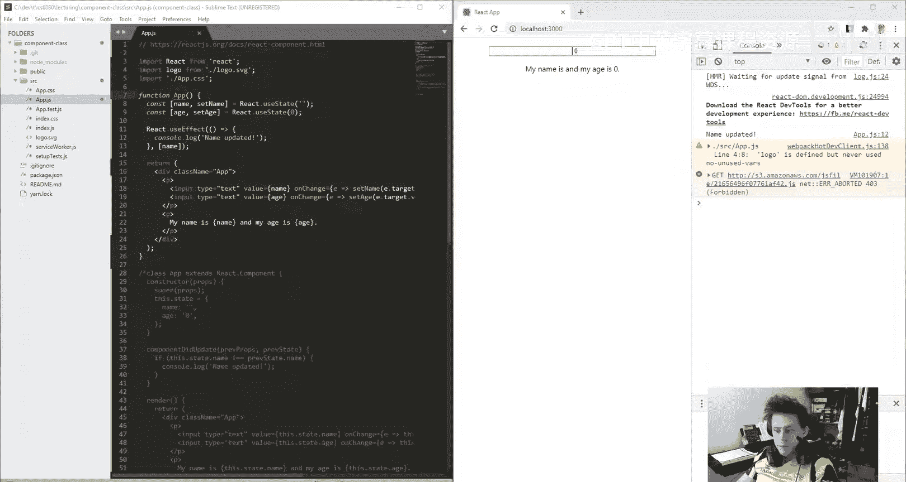

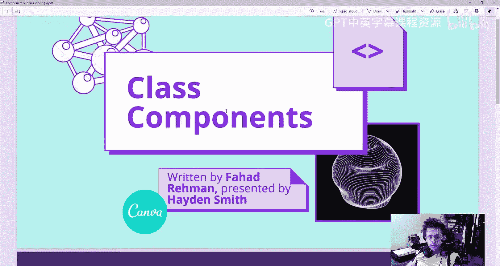

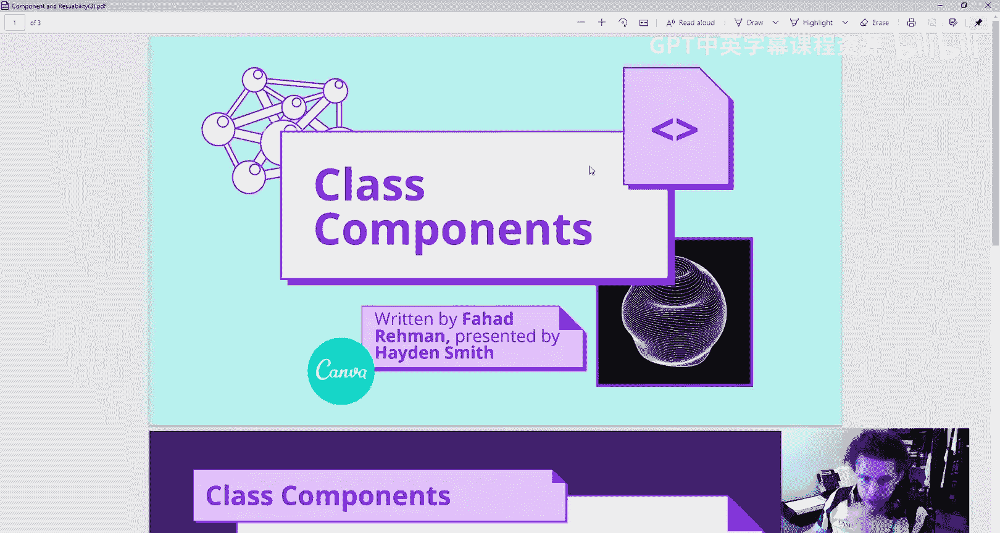

在本节课中，我们将学习 React 中的类组件。虽然现代 React 开发主要使用函数式组件，但理解类组件对于阅读遗留代码和网络资源仍然至关重要。我们将通过对比函数式组件和类组件，来理解它们的基本结构和核心概念。

## 概述

React 提供了两种创建组件的方式：**类组件**和**函数式组件**。函数式组件是现代 React 开发的主流，因其简洁性而广受欢迎。然而，互联网上仍存在大量使用类组件的旧项目和教程。本节课的目标是帮助你理解类组件的语法和逻辑，以便你能读懂并转换它们。

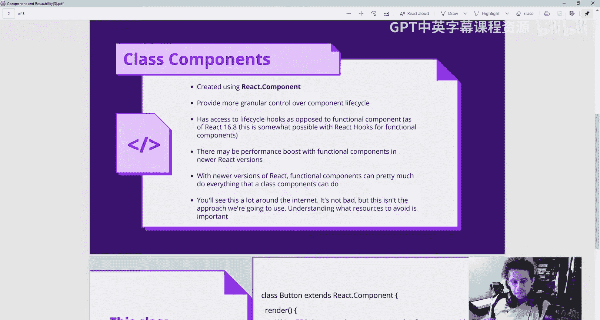

## 函数式组件回顾

在深入类组件之前，我们先快速回顾一下函数式组件。以下是一个简单的函数式组件示例：

```jsx
function App() {
  const [name, setName] = useState('');
  const [age, setAge] = useState(0);

  useEffect(() => {
    console.log('Name updated:', name);
  }, [name]);

  return (
    <div>
      <input value={name} onChange={(e) => setName(e.target.value)} />
      <input value={age} onChange={(e) => setAge(e.target.value)} />
      <p>Name: {name}, Age: {age}</p>
    </div>
  );
}
```

这个组件管理两个状态（`name` 和 `age`），并使用 `useEffect` 钩子在 `name` 变化时执行副作用。它返回要渲染的 JSX。

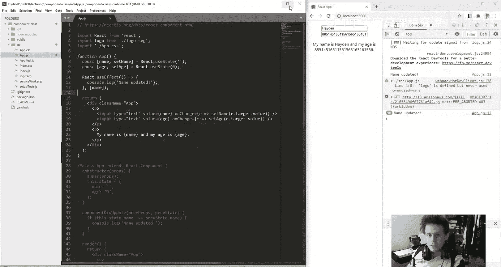

## 类组件基础

现在，我们来看看如何用类组件实现相同的功能。类组件使用 ES6 的 `class` 语法，并继承自 `React.Component`。

```jsx
class App extends React.Component {
  constructor(props) {
    super(props);
    this.state = {
      name: '',
      age: 0
    };
  }

  componentDidUpdate(prevProps, prevState) {
    if (prevState.name !== this.state.name) {
      console.log('Name updated:', this.state.name);
    }
  }

  render() {
    return (
      <div>
        <input
          value={this.state.name}
          onChange={(e) => this.setState({ ...this.state, name: e.target.value })}
        />
        <input
          value={this.state.age}
          onChange={(e) => this.setState({ ...this.state, age: e.target.value })}
        />
        <p>Name: {this.state.name}, Age: {this.state.age}</p>
      </div>
    );
  }
}
```

## 核心概念对比

上一节我们介绍了类组件的基本结构，本节我们来详细对比几个核心概念。

### 1. 组件定义

*   **函数式组件**：是一个 JavaScript 函数。
    ```jsx
    function App() { ... }
    ```
*   **类组件**：是一个继承自 `React.Component` 的 ES6 类。
    ```jsx
    class App extends React.Component { ... }
    ```

### 2. 状态管理

*   **函数式组件**：使用 `useState` 钩子。每个状态变量都有独立的设置函数。
    ```jsx
    const [name, setName] = useState('');
    const [age, setAge] = useState(0);
    ```
*   **类组件**：在 `constructor` 中初始化一个名为 `state` 的对象。使用 `this.setState` 方法来更新整个状态对象。
    ```jsx
    constructor(props) {
      super(props);
      this.state = { name: '', age: 0 };
    }
    // 更新状态
    this.setState({ ...this.state, name: newName });
    ```

### 3. 生命周期与副作用

*   **函数式组件**：使用 `useEffect` 钩子来执行副作用，并可以指定依赖项。
    ```jsx
    useEffect(() => { console.log(name); }, [name]);
    ```
*   **类组件**：使用特定的生命周期方法，如 `componentDidUpdate`。需要手动比较前后状态。
    ```jsx
    componentDidUpdate(prevProps, prevState) {
      if (prevState.name !== this.state.name) {
        console.log('Name updated:', this.state.name);
      }
    }
    ```

### 4. 渲染内容

*   **函数式组件**：直接返回 JSX。
    ```jsx
    return <div>...</div>;
    ```
*   **类组件**：在 `render` 方法中返回 JSX。
    ```jsx
    render() {
      return <div>...</div>;
    }
    ```

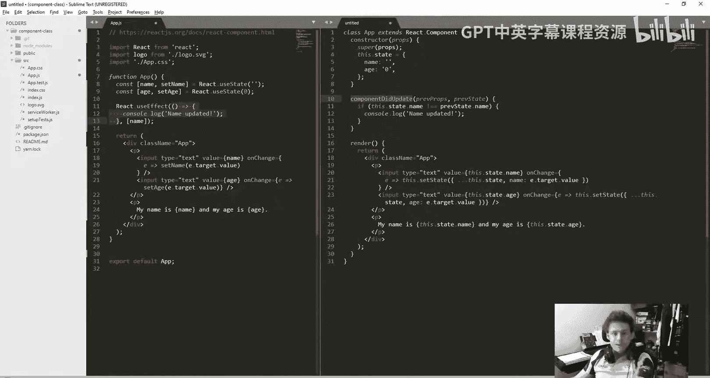

### 5. 访问状态与属性

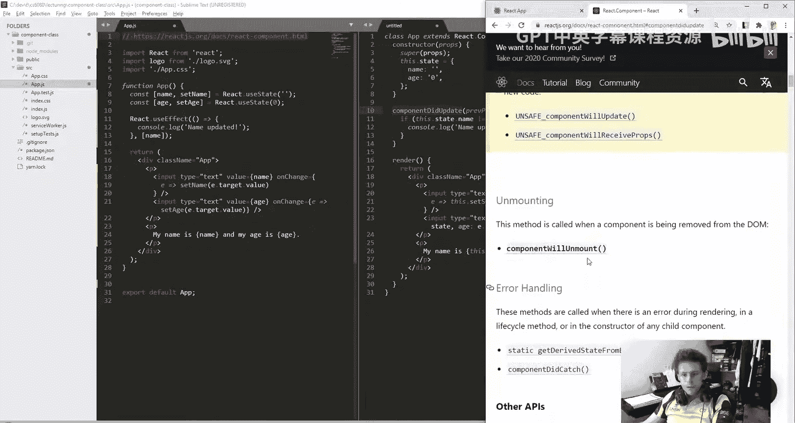

*   **函数式组件**：直接使用状态变量名。
    ```jsx
    <p>{name}</p>
    ```
*   **类组件**：通过 `this.state` 和 `this.props` 访问。
    ```jsx
    <p>{this.state.name}</p>
    ```

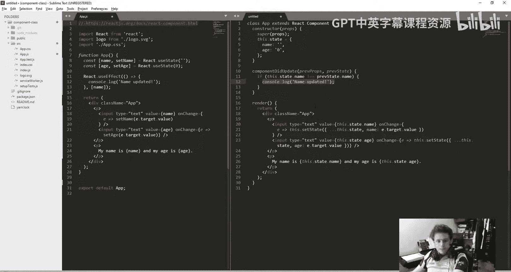

## 为什么类组件不再流行？

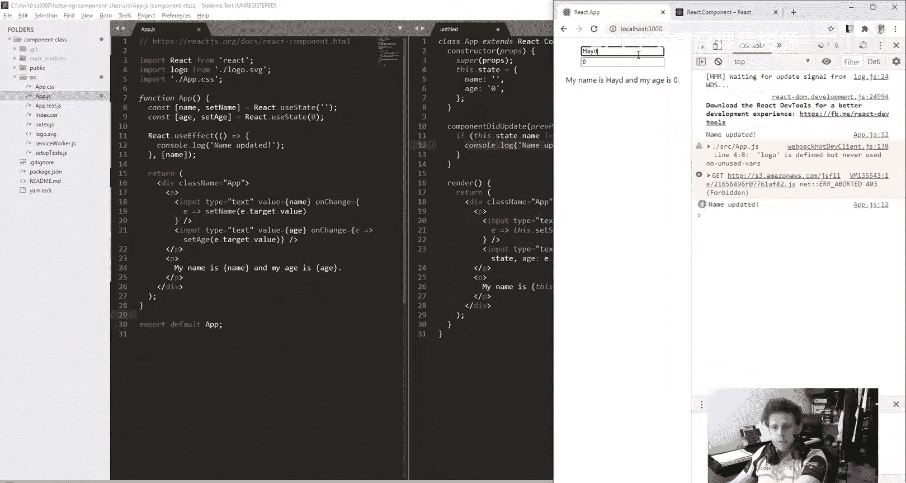

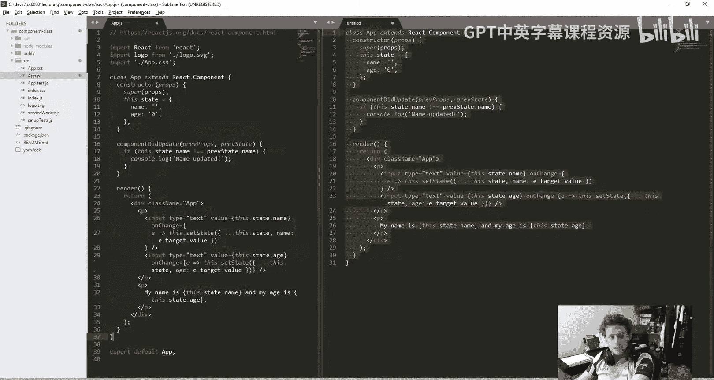

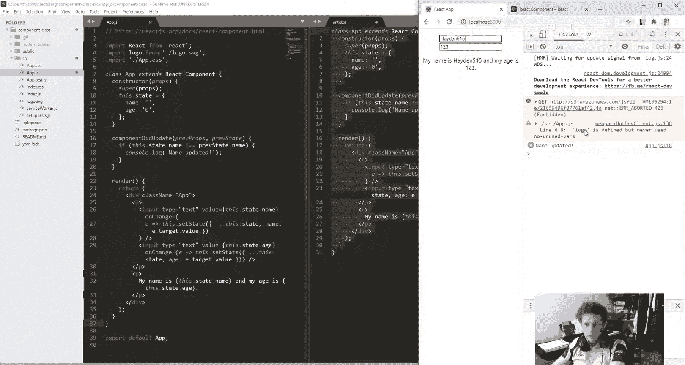

通过以上对比，我们可以看出类组件的主要缺点：
1.  **代码冗长**：需要更多的样板代码（如 `constructor`, `render`, `super(props)`）。
2.  **逻辑复杂**：状态管理集中在单个对象中，更新时需要处理整个对象（使用扩展运算符 `...`），容易出错。
3.  **生命周期方法繁琐**：副作用逻辑分散在不同的方法中（如 `componentDidMount`, `componentDidUpdate`, `componentWillUnmount`），不如 `useEffect` 集中和清晰。
4.  **`this` 绑定问题**：在事件处理程序中需要小心处理 `this` 的指向，通常需要在构造函数中绑定或使用箭头函数。

函数式组件配合 Hooks API，提供了更简洁、更模块化且更易于理解和测试的代码结构。

## 总结

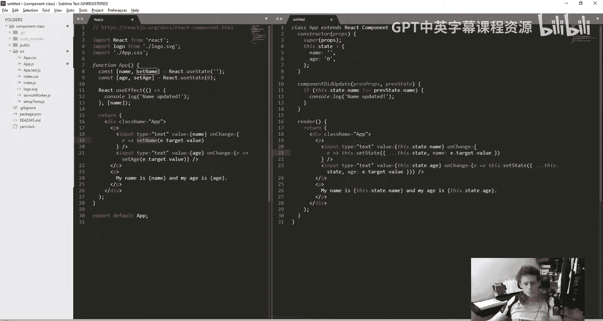

本节课中，我们一起学习了 React 的类组件。我们通过一个具体的例子，对比了函数式组件和类组件在定义、状态管理、副作用处理和渲染方面的不同。虽然类组件正在逐渐被函数式组件取代，但理解它们对于维护旧代码和阅读广泛的网络资源仍然非常重要。现在，当你遇到一个类组件时，你应该能够理解其结构，并知道如何将其转换为更现代、更简洁的函数式组件。核心要点是：**两者功能等价，只是语法和代码组织方式不同**。