# 064：组件库与Figma 🍪

在本节课中，我们将学习组件库的概念，了解设计师如何使用Figma等工具构建组件库，并探讨作为前端工程师如何实现自己的组件库。我们还将介绍一个强大的工具——Storybook，它能帮助我们高效地开发和测试组件。

## 什么是组件库？🧩

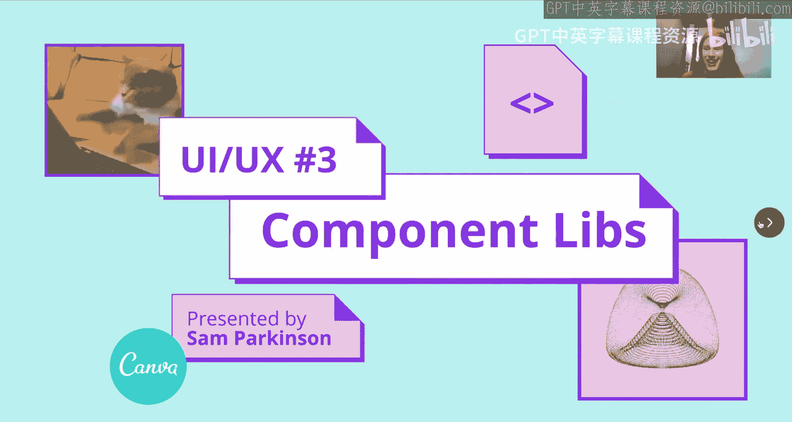

上一节我们介绍了设计系统，本节中我们来看看其日常实践的核心——组件库。正如建筑工人需要维护工具一样，前端工程师也需要创建自己的工具来完成工作，这意味着我们需要创建可以在整个应用程序中复用的共享UI组件，即组件库。

组件是用户界面中可以组合在一起以构建应用程序的小片段。例如，警报框、按钮、滑块、徽章和卡片都是组件。在日常生活中，你与无数组件进行交互。

我们通常不希望每次构建新页面时都从头开始重新制作一个按钮，因此我们使用组件库。组件库允许我们在一个地方定义按钮的外观，然后在整个应用程序中重复使用它。

需要特别注意的是，组件库不仅仅是开发者需要考虑的事情。重用和创建一致性的理念对用户界面设计至关重要。一个优秀的用户界面不会让用户感到困惑。你不希望用户在每个屏幕上都猜测“这是按钮吗？”，而是希望在整个用户界面中保持一致性。

因此，设计师也经常拥有组件库。对设计师而言，组件库是他们可以重复使用的图形元素集合。例如，在Canva设计一个新应用程序的模型时，我不必重新设计按钮的外观，只需从我的库中抓取一个按钮，放入应用程序中即可开始使用。

对于前端工程师来说，组件库是代码片段。如果我需要一个按钮，我可以从UI库导入一个按钮组件，例如一个React组件，然后直接使用它，而无需考虑样式问题。

## 设计师如何理解组件库？🎨

为了真正理解组件库，我们需要退一步，了解用户界面设计师如何创建他们的设计，以及组件在这个过程中扮演的角色。

如果我们查看流行的用户界面设计应用程序，如Sketch、Figma或Adobe XD，会发现它们与我们熟悉的应用程序（如用于编辑栅格图像的Photoshop和用于编辑矢量图像的Illustrator）不同。用户体验和用户界面设计通常使用矢量图像，它们由路径而非像素组成，这使得设计可以调整大小。

然而，用户界面设计师使用的应用程序通常与标准的矢量应用程序（如Adobe Illustrator或Inkscape）不同。这些标准应用程序非常适合绘制精美的漩涡路径和为杂志创建插图。但作为用户界面设计师，你通常不需要漩涡状的卡片。用户界面设计通常是直线、文本和一些示例图像。

因此，存在一类不同的应用程序，它们同样是矢量工具，但具有专门为创建用户界面而定制的功能。这些功能通常以样式和组件的形式出现。今天我们将快速了解这两者。我将使用Figma的术语，不同的工具可能有不同的叫法（例如，Figma中的组件在Sketch中被称为符号），但概念是相同的。

在Figma中，有样式的概念。样式类似于变量。你可以有一个颜色样式，在共享库中定义，例如“这是Canva蓝色”、“这是Google蓝色”等，然后在整个设计中重复使用这些颜色，而无需到处记住十六进制代码。这有点像编程中的变量。

此外，还有组件的概念。在React术语中，组件是HTML元素的集合，并带有一些创建它们的代码条件。在Figma术语中，组件非常相似，它们是图形元素的集合（虽然没有代码）。但就像React中按钮因为由相同代码生成而相互关联一样，在Figma中，如果你创建一个组件，那么每次复制、粘贴或复制该组件时，所有实例都保持链接在一起。

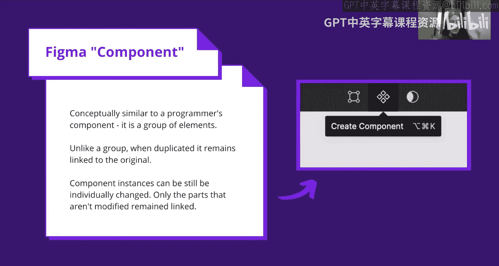

这意味着如果你编辑组件的原始版本，该组件的所有实例都会更新你所做的更改。这使你能够创建一致性，同时也为设计师提供了灵活性。例如，在设计一个复杂应用程序时，我可能不想先设计按钮，或者在设计完成后，客户可能说“我喜欢它，但我不喜欢阴影的厚度”。我不希望必须单独回去更改每个实例，而是希望能够切换设计基础组件和应用程序，并让所有内容流畅地更新。

为了举例说明，我将使用Figma进行一个快速演示。

## Figma组件演示 📐

演示场景：我正在为一个类似LinkedIn的求职网站设计一个移动应用程序。这个移动应用程序的一个重要组件将是我可以点击的列表项。

首先，我在Figma中草绘这个组件。我画一个矩形，使用网站上的样式。例如，我选择预设的“单色白色”样式，而不是冒险使用错误的白色阴影。然后我添加阴影和边框半径。

接下来，我添加一些文本，同样使用样式。我添加一个大标题和一个中等标题，例如职位名称和职位地点。这样，我就有了一个希望在应用程序中使用的组件。

目前，这只是一个组。如果我复制这个组，会得到另一个组，我可以拖动和编辑它，但这两个组之间没有关联。这不是一个组件。

但是，如果我首先点击“创建组件”按钮，它会变成紫色，表示它是一个组件。然后我可以复制这个组件，并在我的模型中使用它。例如，我设置一个包含许多职位的职位页面模型。

现在，如果我去修改原始组件（例如，调整徽标圆圈的大小），我们会看到所有组件实例都更新了。这就是我所说的“链接”。我可以在左侧的原始组件中移动它，右侧的所有实例都会更新。这非常有用。

组件的另一个很酷的功能是它们允许一定程度的灵活性。在这个职位列表中，我可能想展示不同的职位。例如，一个可能是Canva的职位，另一个可能是其他公司的职位。我可以编辑组件的某些部分（如职位名称），但如果我更改了原始组件的其他部分（例如，决定让标题更突出），那些未被覆盖的属性（如职位名称的颜色）仍然会更新。

设计师使用的另一种技术是显示/隐藏。例如，在我的组件中可能有一个“新”徽章。我可以在实例中显示或隐藏这个徽章。这样，我以后可以编辑“新”徽章（例如，让它更大），所有带有该徽章的实例都会更新，而不会影响那些隐藏了徽章的实例。

这就是组件。它们让我作为用户界面设计师能够在开始使用某些东西之后进行更改，这为我的设计过程提供了更多自由，让我可以更灵活地在设计小部分和整体应用之间来回切换，从而更快地设计应用程序，因为我不必一次性把所有组件的设计都做对且永不更改。这更加灵活，也使我作为设计师更有效率，能创建更一致的用户界面。

这也意味着，任何为你设计用户界面的人可能也在以组件的方式思考。作为设计师，你需要做出决定：例如，“新”按钮应该是一个独立的组件吗？什么太大而不能成为一个组件？职位标题的单个文本可能太小而不能成为组件，因为重用它的意义不大。那么，什么是正确的抽象级别？

这在很多方面实际上与开发者创建组件库时需要做的决策非常相似。你需要决定什么是一个组件，什么只是一些不需要放入库中、不值得在多个地方重用、只需在需要时复制粘贴的用户界面。

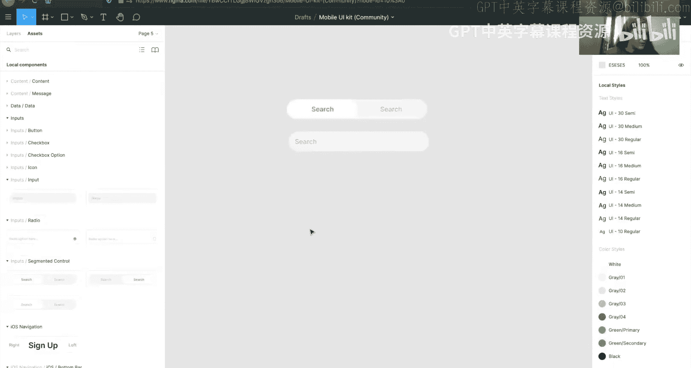

这个故事的寓意是：你的设计师正在经历类似的事情。因此，你可以参考他们的做法来获得灵感。

## 开源组件库示例 📚

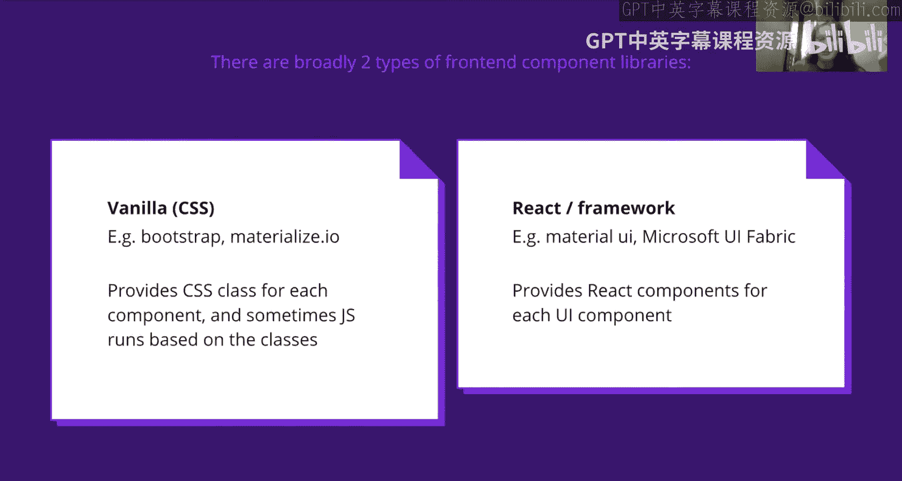

为了举例说明，我想分享一个内置在Figma中的组件库示例。这里有一个漂亮的组件库，展示了组件可能包含的内容。我们看到有不同的输入框、不同的按钮、不同的复选框、不同的加载内容等。这非常有帮助，因为这意味着如果我想为某些东西创建新设计，只需拖放搜索框、拖放其他组件，非常简单。这使我作为设计师的生活更轻松。

以同样的方式思考，我们希望通过拖放组件来创建组件库，使我们作为前端工程师的生活更轻松。

## 如何实现组件库？⚙️

既然我们知道有一些组件，并且想要重用它们，那么作为前端工程师，我们该如何做呢？

我认为实现组件库主要有两种策略。第一种是CSS策略，第二种是使用你当前框架（如React）的策略。

在CSS策略中，例如Bootstrap或Materialize，会提供一个共享的CSS文件或库CSS文件，这些文件提供类名，我们可以使用这些类名来创建组件。例如，我们知道会实现一个 `.button` 类、`.alert` 类、`.slider` 类等。

在使用React或框架的策略中，它会为我们提供可以导入的React组件，用于每个UI组件。

## 两种方法的优缺点 ⚖️

让我们看看每种方法的一些优缺点。

**纯CSS组件库（如Bootstrap）**：
*   **优点**：超级易于使用，非常简单。你只需要添加适当的类名。它还可以跨非React页面使用，例如静态HTML营销页面，只需导入相同的CSS文件即可保持一致性。
*   **缺点**：
    1.  并非所有功能都能用纯CSS实现。例如，点击时弹出的菜单通常无法用CSS实现，需要一些JavaScript。这些库通常也提供一些JavaScript，但这可能与React对DOM的修改产生冲突，增加了复杂性。
    2.  缺乏类型安全或错误提示。如果你拼错了类名，唯一能注意到的方式是视觉上，它不会抛出错误。如果使用TypeScript，也无法从中获得类型错误。
    3.  可访问性差。如果你想为元素添加额外的属性（如用于可访问性或功能的`role`属性），必须手动添加。
    4.  封装性差。很难定义允许人们轻松编辑样式的API。因为CSS本质上是全局的，人们可以随意添加更多CSS来覆盖样式，这很容易变得混乱。

**React组件库（如Material-UI）**：
*   **优点**：
    1.  可以精确定义API。例如，你可以规定自定义警报组件的唯一方式是通过传递一个`severity`属性。这使得使用和后续升级都更容易。
    2.  每个组件都定义了自己的API，这使得类型更安全。
    3.  每个组件几乎总是返回一个DOM节点，这使得封装性更好。
    4.  你可以使用任何你想要的样式方法，如styled-components、CSS-in-JS或纯CSS文件。

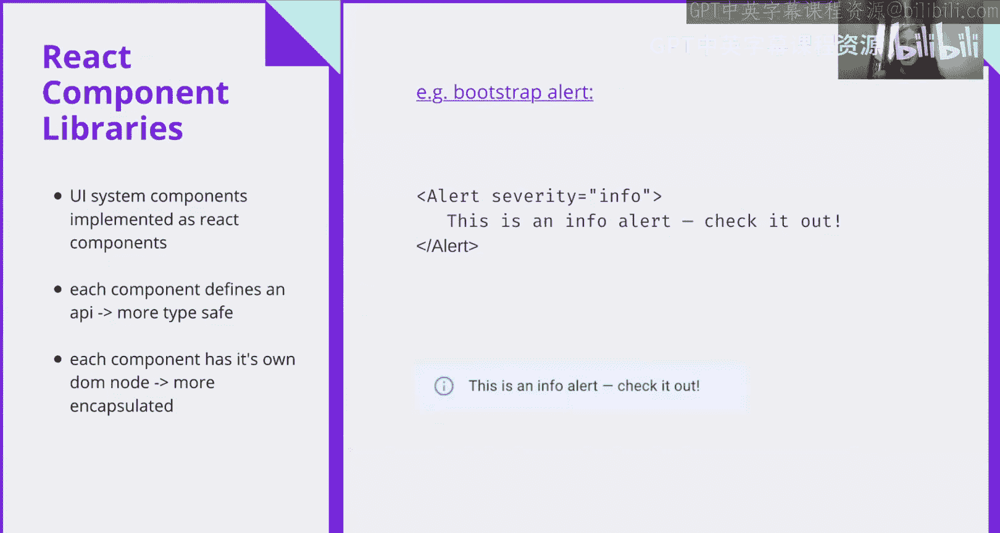

因此，人们通常选择通过导出React文件来创建组件库，而不是共享一个CSS文件。

## 组件演示页面的重要性 🖼️

当你查看开源组件库（如Material-UI for React或Bootstrap）时，会发现它们都有很棒的演示页面。这些页面通常展示了每个组件的所有状态示例。

这对于使用组件库的人来说非常好，因为你可以看到人们构建了哪些组件。同时，对于组件库的开发者来说也非常好，因为你可以快速看到组件的每个版本。当你进行更改时，可以看到它如何更新每个状态，这让你在进行更改时更有信心，有助于防止错误。

通常，你希望在进行更改时充满信心，避免引入bug。当你能看到按钮的所有不同状态（左侧带图标的、右侧带图标的）时，你就可以充满信心地进行更改。

## 使用Storybook进行高效开发 🛠️

作为今天课程的第三部分，我们将看看如何创建像这样出色的演示页面，让我们能够充满信心地进行更改，并更快地开发。

如果我正在应用程序中开发一个按钮，可能需要等到开发完应用程序的其他部分，直到我有地方查看它。另一方面，如果我有一个像这样的酷炫演示页面，我就不需要等待，可以直接开始开发所有按钮，然后在应用程序更完善后再使用它们。

这在大型应用程序中非常重要。想象一下，你正在开发一个日期选择器，而选择日期的唯一方式是在设置屏幕中深入三层菜单。每次你重新加载页面以查看日期选择器的更改时，如果只能通过应用程序访问它，就意味着你每次都必须导航三层菜单。这是一个糟糕的开发体验，如果你不能快速看到变化，效率就不会高。

因此，拥有一个包含所有组件的优秀演示页面的第三个原因是：它允许你独立开发组件，而不必在主应用程序内部开发。

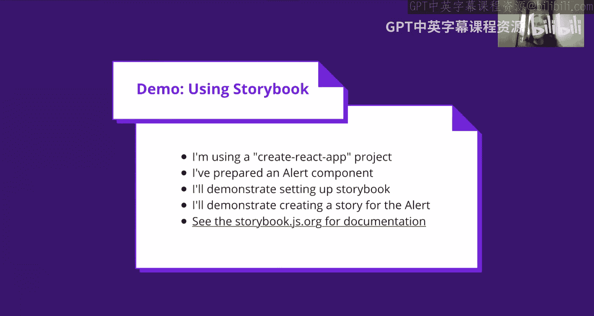

那么，我们如何实现这一点呢？答案是使用Storybook。它拥有我们谈到的所有优点：我们可以在组件所属的应用程序之前构建组件；我们可以并排查看组件的所有状态；我们可以在不导航到应用程序其他部分的情况下重新加载和预览它们。

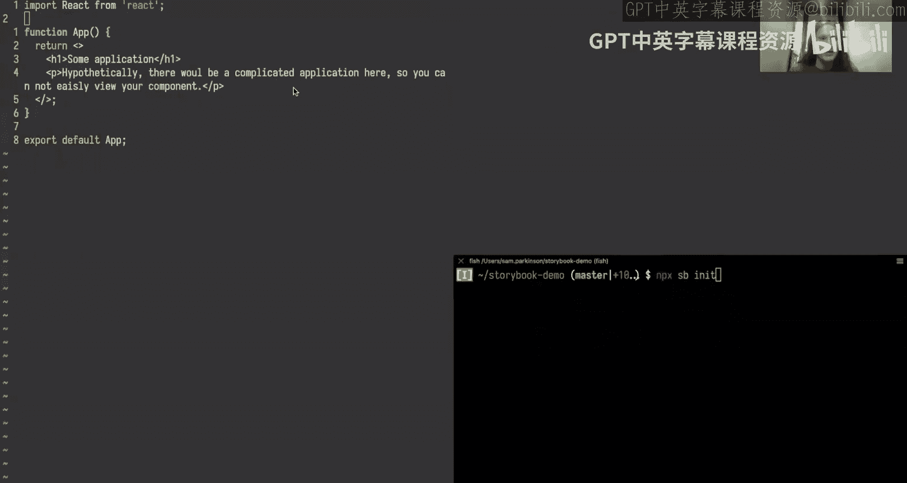

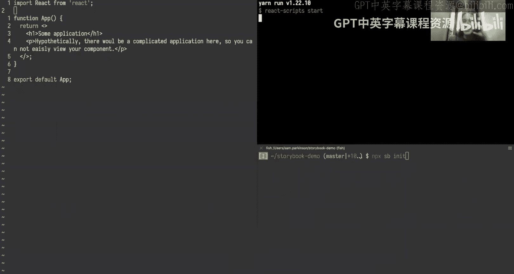

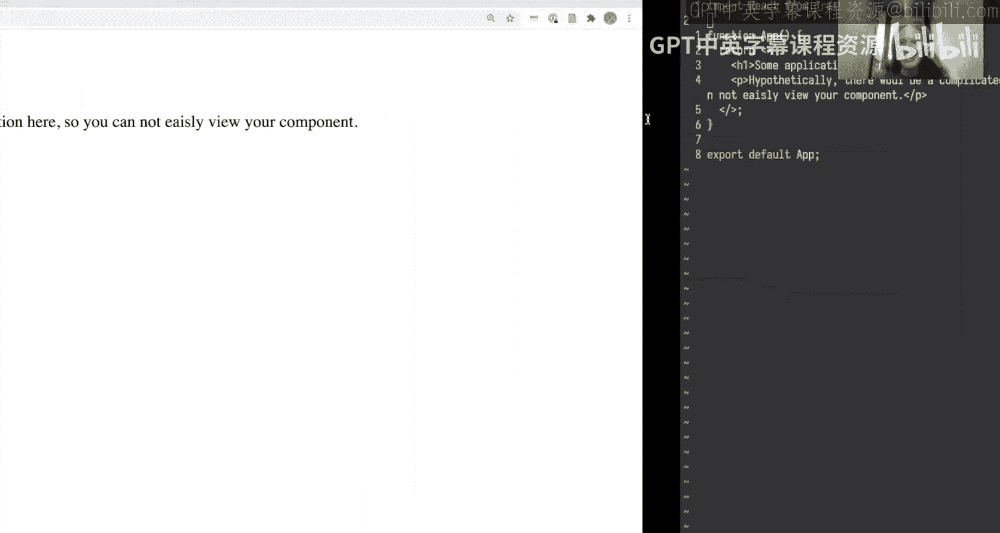

Storybook的工作方式是：它是你应用程序的一个独立入口点。你拥有单一的代码库和所有组件文件。在顶层，我们有正常的入口点（例如，运行 `yarn run start` 或 `yarn run build` 来构建你的应用程序）。同时，我们有一个不同的入口点（例如，运行 `yarn run storybook`），它使用相同的代码但构建不同的文件集，即构建你的组件库演示页面。

显然，你将正常的入口点部署给用户（例如，访问Canva.com看到的是Canva应用程序），而不会将你的Storybook演示页面部署给用户。它只保留在代码库中，供开发和内部使用。

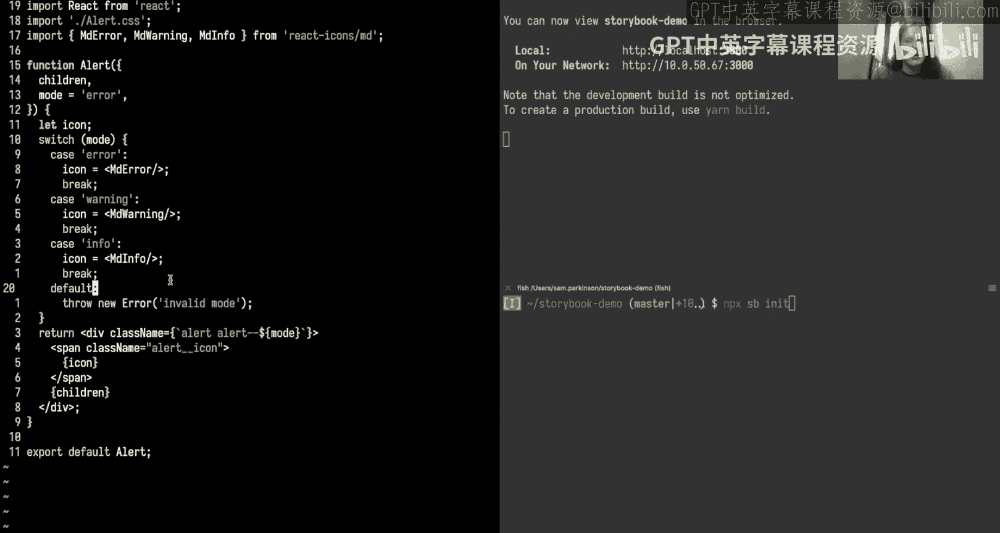

## Storybook 演示 🎬

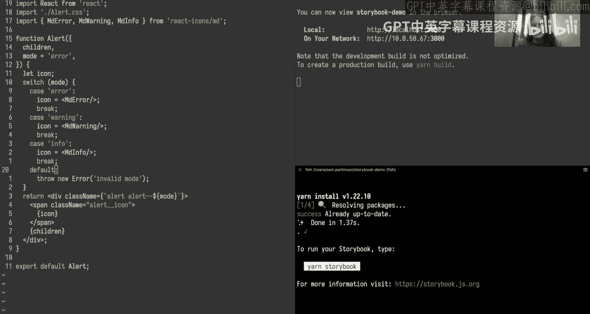

我将跳入一个使用Create React App准备的快速演示。它有一个简单的警报组件。我将演示如何在CRA中设置Storybook，并为该警报创建一个Story，展示它的样子以及它将如何帮助我未来的开发。

在这个演示中，如果我运行 `yarn run start`，它会启动我的正常应用程序。这是我的正常位置，我看不到正在开发的组件，因为（假设）它在我应用程序中三层菜单深的地方，或者实际上我还没有编写应用程序的其他部分。

我有一个警报组件，它接收一个`children`属性作为内容，以及一个`mode`属性，该属性通过类名定义样式，并且我们根据`mode`切换来添加图标。

现在，我们将使用Storybook。按照文档，我们使用 `npx storybook init` 来初始化Storybook。然后运行 `yarn run storybook` 来启动开发服务器。

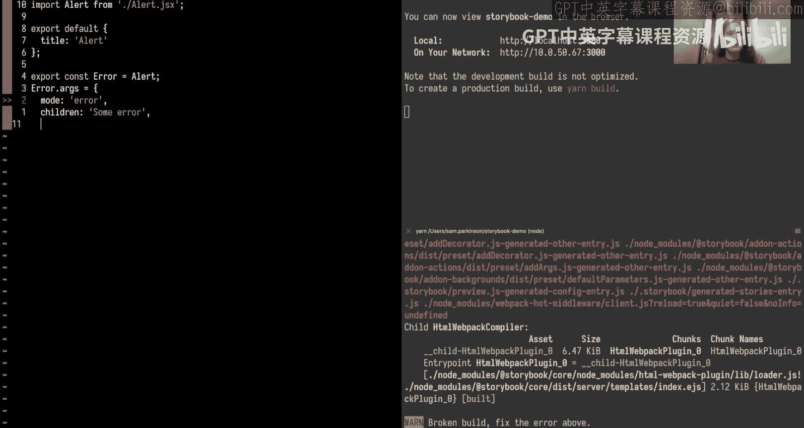

Storybook添加了一个 `stories` 文件夹。我们为我们的警报故事创建一个新文件：`Alert.stories.jsx`。我们导入警报组件，并导出故事。

我们设置故事的标题，然后导出具体的故事，例如“Error”。我们设置组件的参数：`mode` 设置为 “error”，`children` 设置为一些文本。

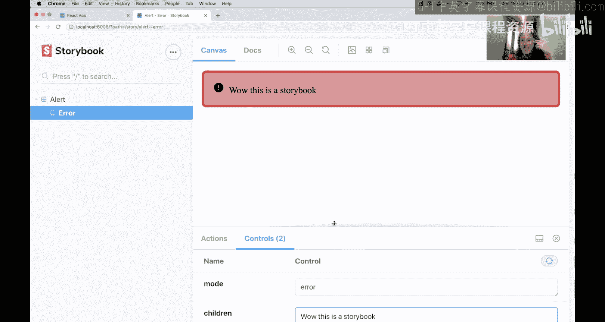

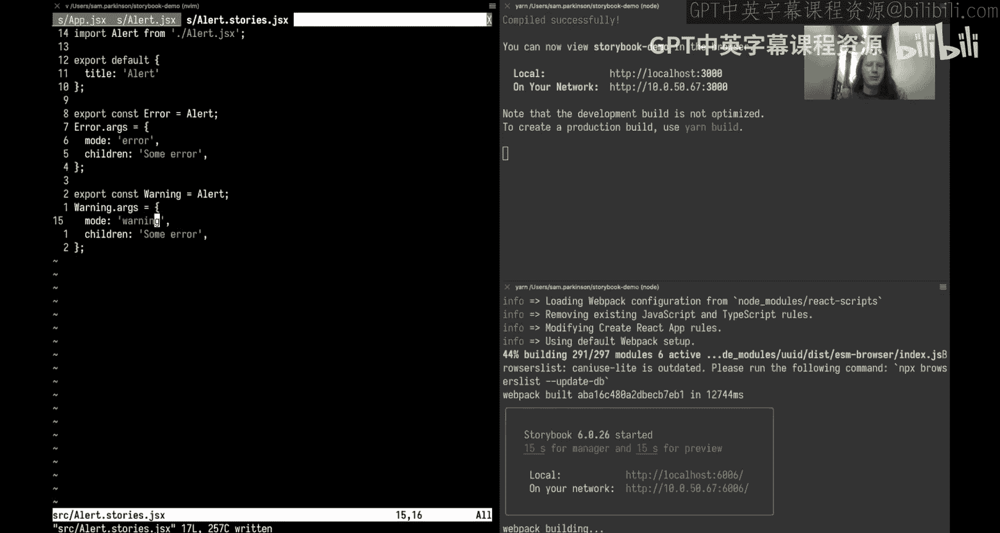

现在，当我们加载Storybook时，可以看到警报组件。我们还有控件可以更改传递给它的属性。这太棒了。这意味着作为组件开发者，我可以轻松测试组件，而无需通过主应用程序导航。

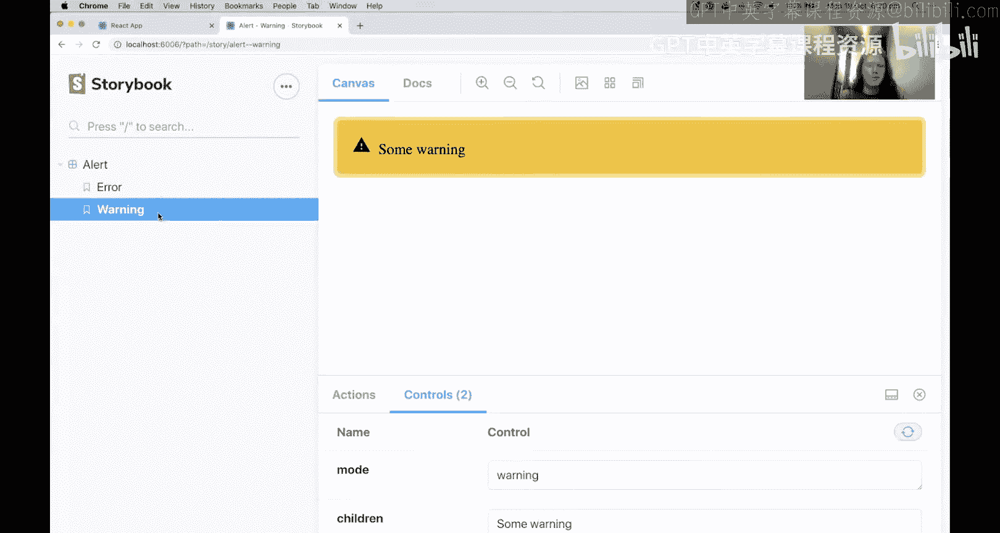

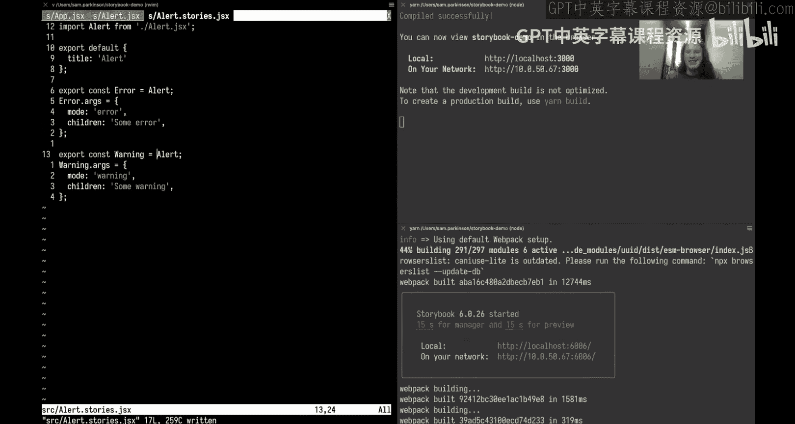

我们可以添加更多示例，如“Warning”故事。通过使用Storybook的模式（如 `bind({})` 创建函数副本），我们可以确保每个故事都是独立的。

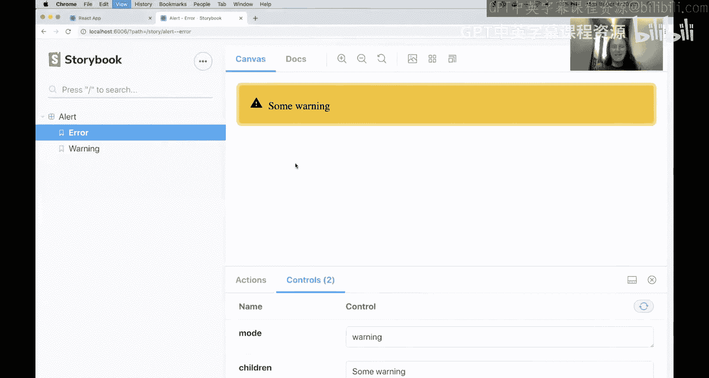

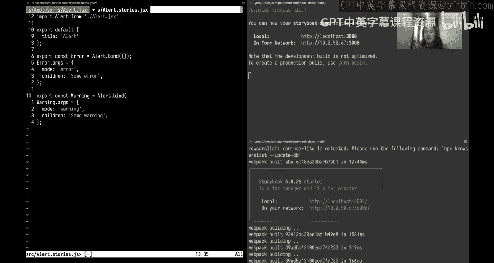

这样，当我想进行更改时（例如，决定不再需要图标），我可以快速返回Storybook，并查看我组件所有不同版本的示例。这使我无需通过整个应用程序就能快速看到更改。

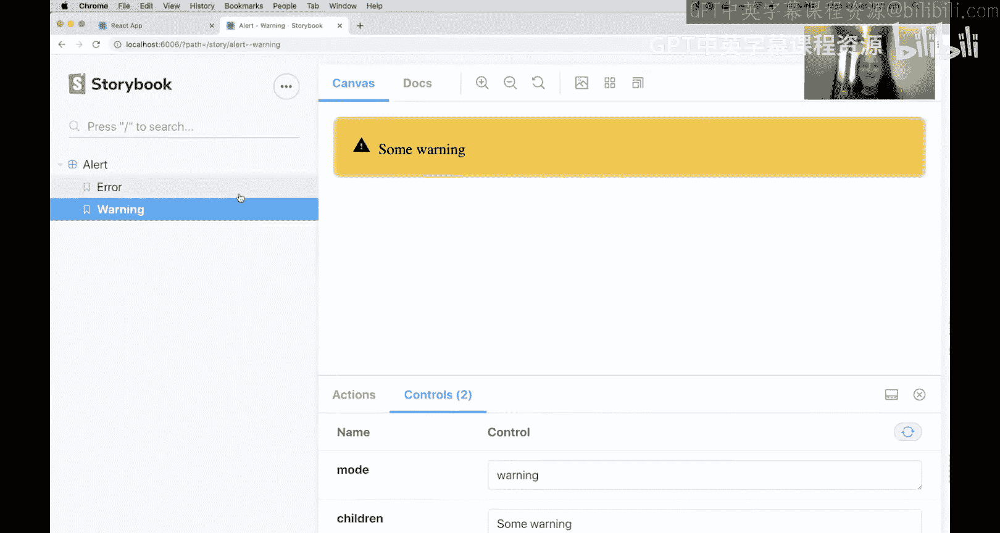

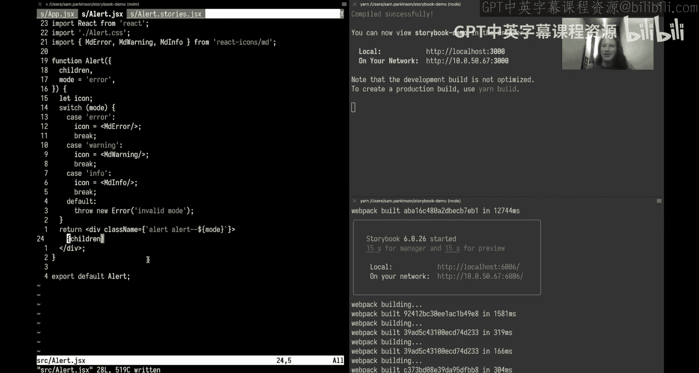

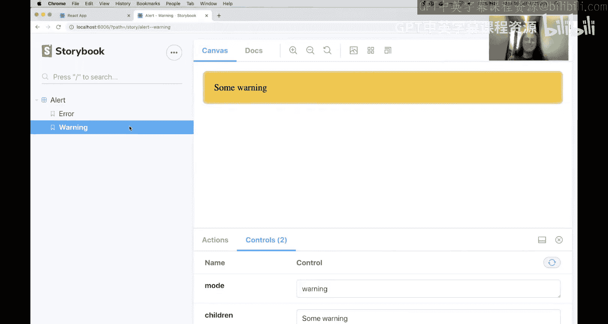

## 视觉回归测试 👁️

我想强调Storybook的一个很酷的扩展功能：它可以用于视觉回归测试。对于更复杂的组件或页面，视觉回归测试基本上会在每次更改时为每个Storybook项目截图。

就像运行测试一样，它可以在提交时、拉取请求时或本地运行时进行。视觉回归测试套件将遍历所有Storybook，截图并与上次版本的截图进行差异比较。这对于检测意外的更改非常有用。你还可以在多个浏览器上运行它，查看某些东西在不应改变时是否看起来不同。这是创建Storybook或演示页面的另一个重要原因。

## 总结 📝

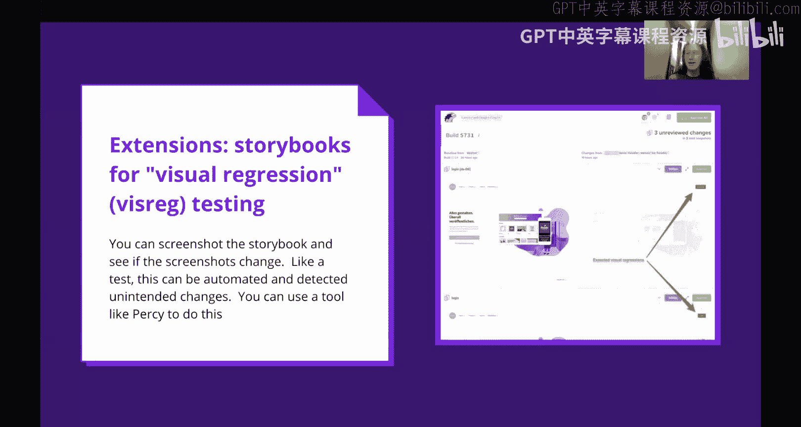

本节课中，我们一起学习了UI组件库。我们首先了解了Figma等用户界面软件如何通过出色的工具支持你创建用户界面和组件库。接着，我们探讨了实现组件库的两种方式：基于CSS的方法和基于React的方法，两者各有优缺点，但通常你会希望创建React组件。最后，我们介绍了Storybook，它是一个创建优秀演示页面的工具，让你无需围绕整个应用程序开发就能开发组件库，这种流畅性最终让你更有效率，更快地完成更多工作。