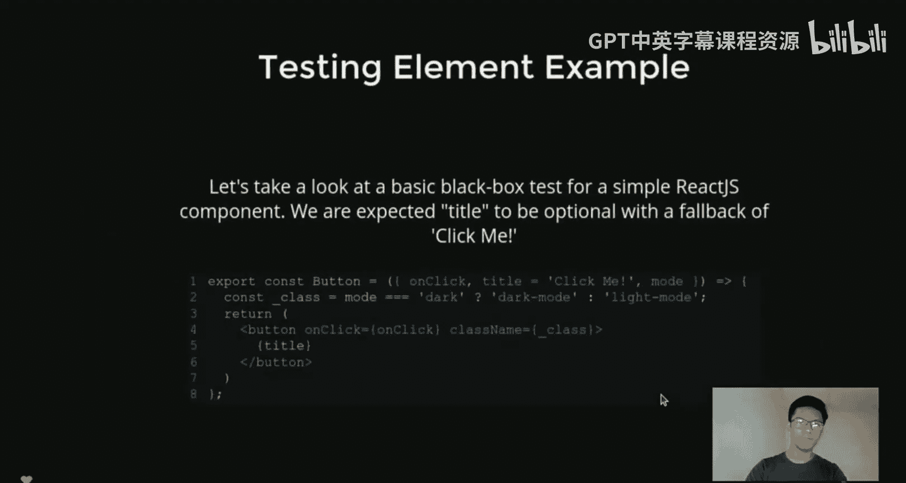
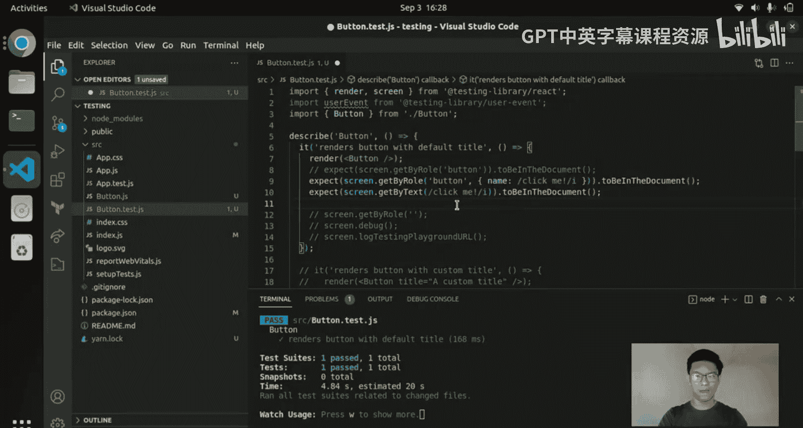
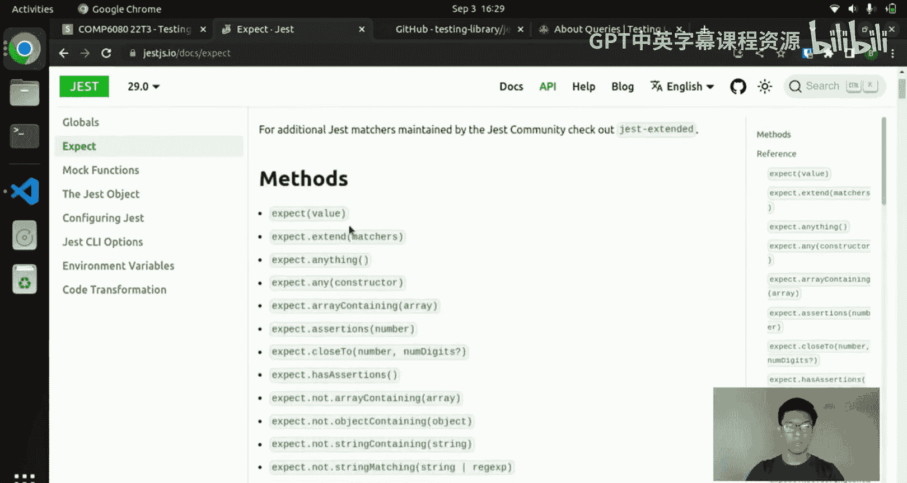
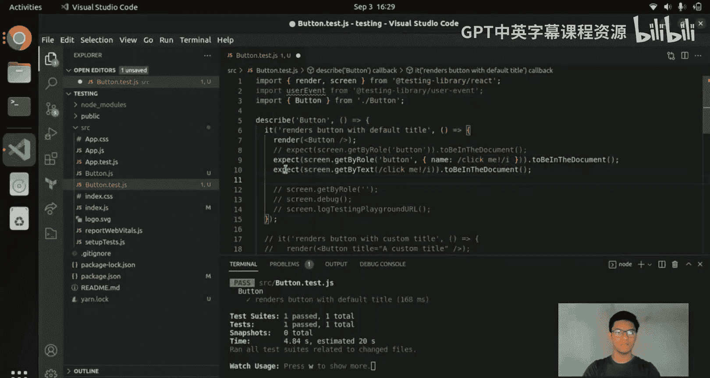
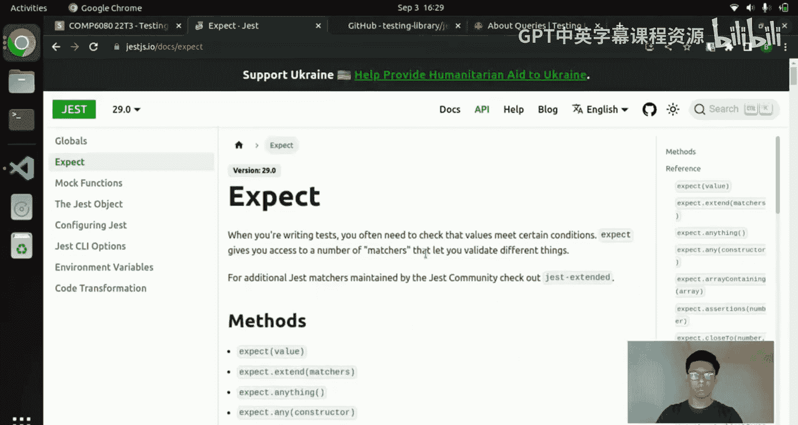
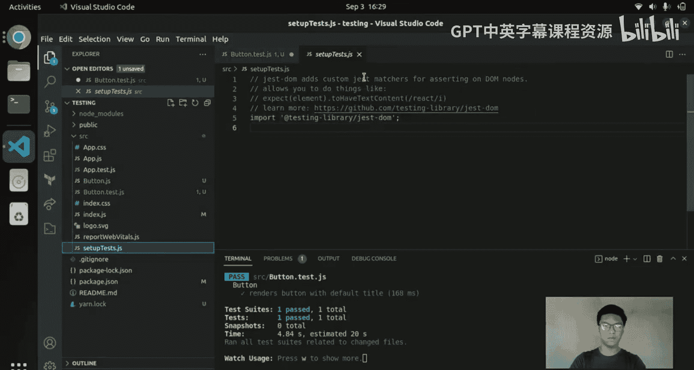
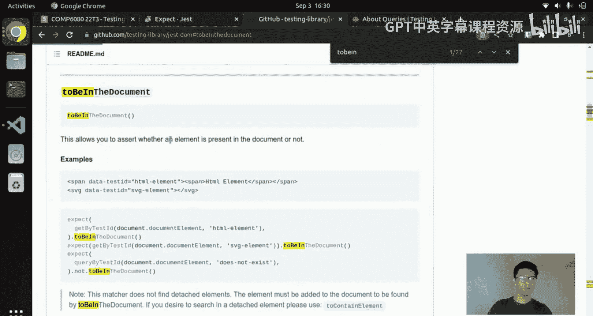
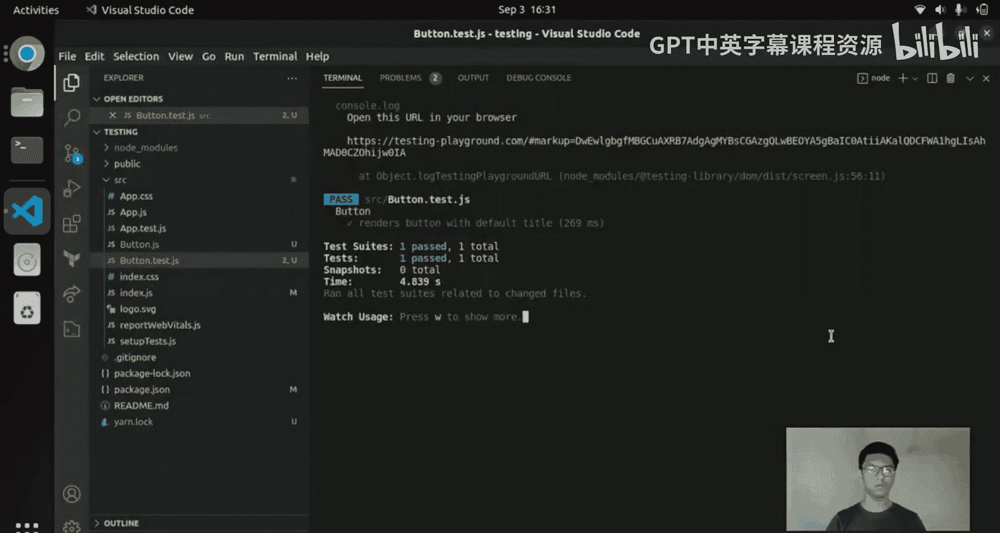
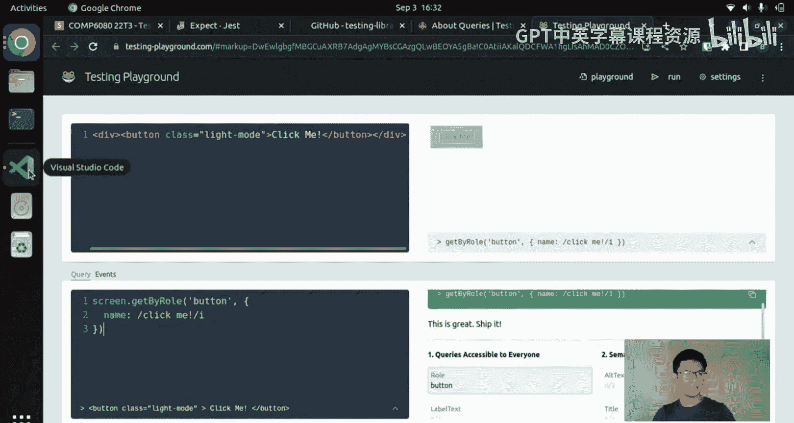
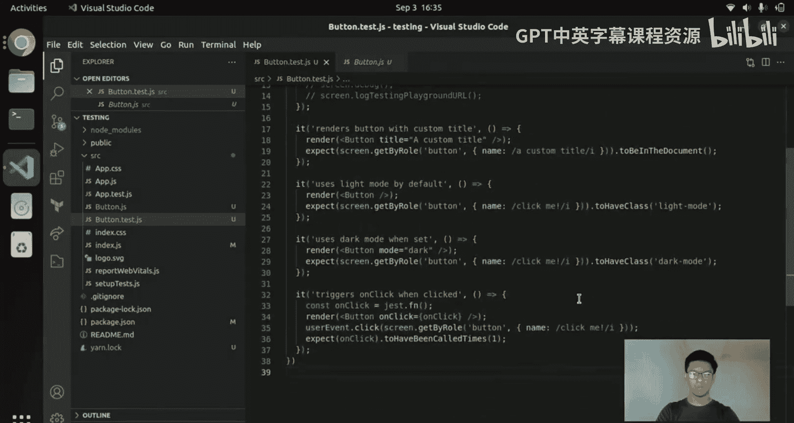

# 068：React组件测试 🧪

在本节课中，我们将学习如何在React中进行单元测试和组件测试。组件测试是指独立测试每个组件，确保它们按预期工作，而不考虑它们在更广泛应用中的集成情况。

## 概述



我们将使用两个主要的测试库：**Jest**（通用的JavaScript测试框架）和**React Testing Library**（专门用于测试React组件的框架）。如果你使用Create React App，这两个库已经默认安装，无需额外配置。

## 组件测试示例

让我们通过一个具体的例子来理解如何测试React组件。假设我们有一个按钮组件，它接收三个属性：`onClick`（一个函数）、`title`（默认值）和`mode`。如果`mode`是“dark”，则应用深色模式类；否则应用浅色模式类。组件最终渲染一个带有相应类名和标题的按钮。

### 编写基础测试

上一节我们介绍了测试的基本概念，本节中我们来看看如何为这个按钮组件编写具体的测试用例。

以下是编写基础测试的步骤：

1.  **导入必要的库和组件**：首先，我们需要导入React Testing Library的`render`和`screen`方法，以及要测试的按钮组件。
2.  **使用`describe`和`it`组织测试**：`describe`用于将相关的测试分组，`it`（或`test`）用于定义单个测试用例。
3.  **渲染组件**：使用`render`函数在测试环境中渲染按钮组件。
4.  **查询DOM元素**：使用`screen.getByRole`或`screen.getByText`等方法查询渲染出的按钮元素。
5.  **进行断言**：使用Jest的`expect`函数来断言元素是否存在于文档中。

```javascript
import { render, screen } from '@testing-library/react';
import Button from './Button';

describe('Button', () => {
  it('renders button with default title', () => {
    render(<Button />);
    const buttonElement = screen.getByRole('button', { name: /click me/i });
    expect(buttonElement).toBeInTheDocument();
  });
});
```

运行测试的命令是`yarn test`或`npm test`。Create React App会运行所有以`.test.js`结尾的文件中的测试。

### 使用不同的查询方法

在查询DOM元素时，有多种方法可供选择。React Testing Library的文档提供了一个优先级指南。

以下是推荐的查询方法优先级：



*   **`getByRole`**：最高优先级。用于查询具有可访问性角色（如`button`、`heading`）的元素。这有助于确保你的组件是可访问的。
*   **`getByLabelText`**：适用于表单标签关联的输入元素。
*   **`getByPlaceholderText`**：适用于输入框的占位符文本。
*   **`getByText`**：适用于查找包含特定文本的元素，如段落(`<p>`)。

对于按钮、标题等元素，优先使用`getByRole`。对于纯文本段落，可以使用`getByText`。

### 有用的调试工具



在编写测试时，如果查询失败，可以利用一些工具进行调试。





以下是几个有用的调试技巧：



*   **`screen.debug()`**：打印出当前渲染的完整DOM结构，方便你查看有哪些元素。
*   **无效角色提示**：如果你向`getByRole`传递了一个无效的角色（如空字符串），测试失败时会打印出组件中所有可用的角色列表，这能指导你使用正确的角色。
*   **Testing Playground**：调用`screen.logTestingPlaygroundURL()`会生成一个链接。打开这个链接（testing-playground.com），你可以看到渲染的HTML和UI，并点击元素来获取React Testing Library推荐的查询代码。



## 编写更全面的测试用例

我们已经学会了如何测试组件的默认渲染。接下来，让我们为组件的不同属性和交互行为添加更多测试。

### 测试自定义属性

我们可以测试组件在接收不同属性时的行为。

以下是测试自定义标题和模式的示例：



```javascript
it('renders button with custom title', () => {
  render(<Button title="Custom Text" />);
  const buttonElement = screen.getByRole('button', { name: /custom text/i });
  expect(buttonElement).toBeInTheDocument();
});

it('has light mode class by default', () => {
  render(<Button />);
  const buttonElement = screen.getByRole('button');
  expect(buttonElement).toHaveClass('light-mode');
});

it('has dark mode class when mode prop is "dark"', () => {
  render(<Button mode="dark" />);
  const buttonElement = screen.getByRole('button');
  expect(buttonElement).toHaveClass('dark-mode');
});
```



`toHaveClass`断言来自`jest-dom`库，它扩展了Jest的断言能力，用于检查DOM元素的类名。

### 测试交互行为（如点击事件）

最后，我们来测试组件的交互功能，例如按钮的点击事件。

以下是测试点击事件的步骤：

1.  **创建模拟函数**：使用`jest.fn()`创建一个模拟函数。这个函数本身不执行任何操作，但会记录它被调用的次数和传入的参数。
2.  **渲染组件并传入模拟函数**：将模拟函数作为`onClick`属性传递给按钮组件。
3.  **模拟用户事件**：使用`user-event`库来模拟用户的点击操作。
4.  **断言函数被调用**：断言模拟函数被调用了一次。

```javascript
import userEvent from '@testing-library/user-event';

it('calls onClick handler when clicked', () => {
  const handleClick = jest.fn(); // 创建模拟函数
  render(<Button onClick={handleClick} />);
  const buttonElement = screen.getByRole('button');
  userEvent.click(buttonElement); // 模拟点击
  expect(handleClick).toHaveBeenCalledTimes(1); // 断言函数被调用一次
});
```

## 总结



本节课中我们一起学习了React组件测试的基础知识。我们介绍了如何使用Jest和React Testing Library，学习了如何编写测试用例来验证组件的渲染、属性应用以及用户交互行为。关键步骤包括：使用`render`渲染组件，使用`screen.getByRole`等优先级高的方法查询元素，使用`expect`进行断言，以及利用`jest.fn()`和`userEvent`来测试函数调用和用户交互。掌握这些技能将帮助你构建更健壮、可维护的React应用。