# UNSW《高级C++编程｜Advanced C++ Programming COMP6771 21T2》中英字幕（claude-3.7-s - P11：-11-COMP6771 21T2 - 4.2 - Exceptions.zh_en - GPT中英字幕课程资源 - BV1NGQcYLEiV

Good evening， hi everyone。Welcome to the second half week4。Today。

 we're going to be talking about exceptions， which doesn't actually have a massive impact on your assignment。

 I guess that does a little bit of an impact。 And even more importantly。

 I think there's there's just a certain level of this theory being quite critical to understanding C+。

 we'll see how we go for timing tonight。 There's a very real chance that we actually don't need all of our time。

 So but you know， we can， we can play that by yeah， which is super exciting。

 I hope everyone's good and happy and well。😊，You know。It's not not rainy like it was a few days ago。

 so that's always a plus。嗯。So today， we are going through exceptions now。

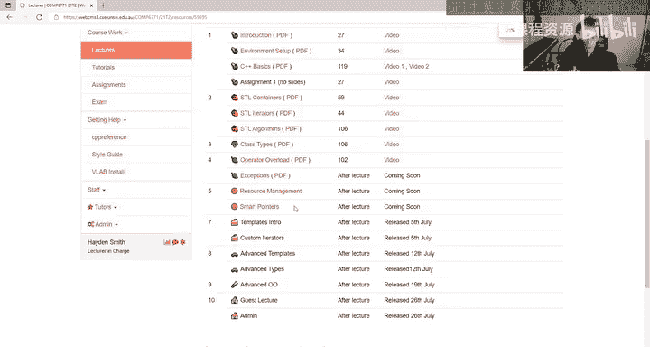

I know that a handful of people。Well， probably most people have dealt with exceptions directly or indirectly。

 most programming languages that aren't。Like most commonly used programming languages。

 imperative languages that aren't see have some notion of exceptions in them。

C is one of the big ones that doesn't。 But C plus plus like Java， like Python， like。PHP， Javascript。

 C， sharp， Java， they all have， might said Java twice。 they all have exceptions。

 so it's a fairly standard language feature。And。Pson says that I made you swap to edgedge。

 I have to say just using edge for lectures， it's not a bad browser。

 I kind of dig it seems really quick。 So oh Microsoft's probably having to battle all those years of。

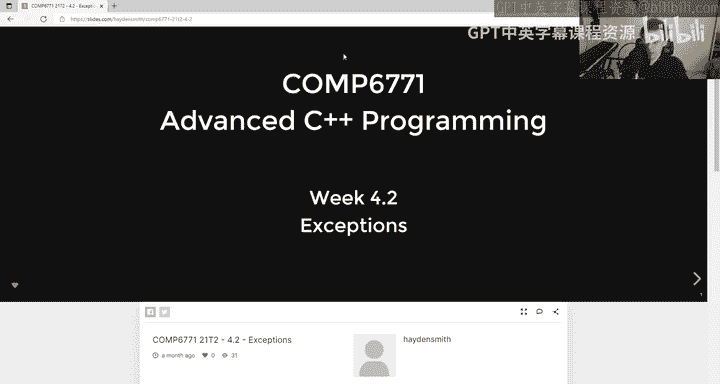

Bad。About association。What we're talking about today is we're talking about。嗯。Exceptions， obviously。

 throwing， re throwinging， no except， all the little details of exceptions。

 But why we're learning about exceptions is that sometimes our programs have to deal with unexpected runtime errors and handle them grace。

Gracefully。So exceptions are all about runtime， right， Like if you could totally rule out。

All runtime errors， Excepts would have no purpose。 There would be nothing to worry about when the program runs。

 because there would be no anomalies。 There would be nothing that goes wrong or unexpected errors。

 So exceptions are dealing with unexpected errors。Now。

 if we start with a simple example and this is a very sea style example whereby we're dealing with errors kind of defensively or through negative ones and stuff。

 and I'm just going to pull this up。

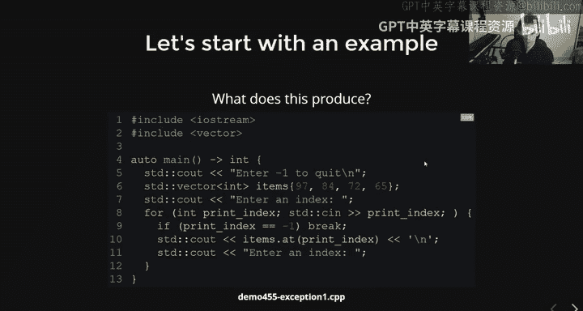

Here。In our lecture cards。There's a simple example we have in the code。

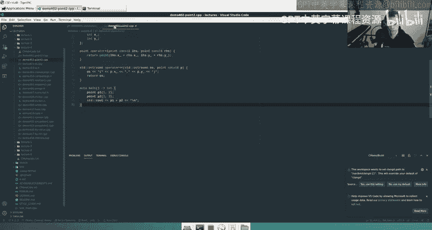

What is it。4，5，5， perfect。And。

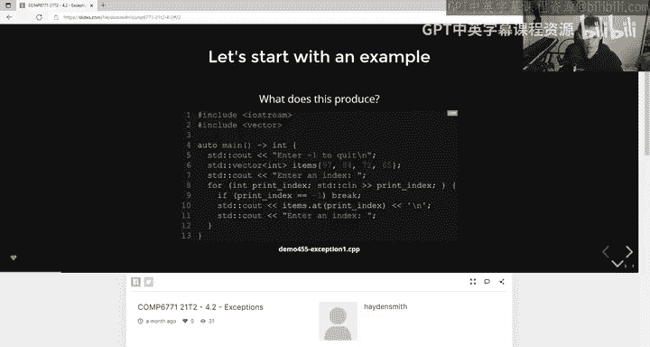

Yes， there's just a little bit of cl formats made this slightly cleaner， but basically here。

 think of it， it's got a main function。 We print out enter minus-1 to quit。

 we then create a vector with four zeros in it。 We ask the user we'd tell the user to enter an index and then in a full loop here。

We define a print index。We don't initialize it， that's fine because we're going to initialize it immediately after。

And then we essentially enter the fall loop while this condition is true。

 There's no need for an increment。 There's no need for like a third part of the while loop because the act of reading through standard C N will slowly gobble up the buffer until it's gone。

 So we're essentially saying。This is the initializer。 And then this is the condition to keep going。

 So standard C N reading in， like reading from standard C N into a variable print index。

 We did some of this in my tube today。 If you want to go watch that。

 So we're reading from standard C N into a number。 And if， if you do successfully read it in。

 then standard C N returns。Something that is。Truthy， I believe。So。We do that every loop。

 and then after that， we check is the number we read in I。e。 the print index。

Is that equal to negative one， And if it is equal to negative one， where then we do a break。

 we exit the loop。 And if it's not equal to negative one， Iee successfully read。From standard C。

 then we print out。Item the vector at the index so。Basically， we take the index。

 we have to cast it to a size type because here we originally made it as just a standard int。

 and then we simply get that particular index from the array。Okay， so。You know， this mostly works。

Try and build this。Oops。What in the hell？2。No kit selected。Great， okay build45。

Not having a good day today。Okay， stop。All right。Let's try and make this happen。

So we're going to see make build。Why is that trying to build everything。Did I do something strange。

Sorry， bear with me here while I。Make mistakes with a slow， slow V lab tonight。Build。

Buildilld target， sorry， okay。Dirp and the target is 455， but it's not appearing。So weird。

 let me just close V S code。a bit of a strange moment today。Great。Okay。Build target。I'm sorry。

 everyone。 I'm just trying to figure out what in God's name it's so grumpy about。 No we not。Yeah。

 okay。 I remember reading this on the farm。 How strange。How strange。I going to pause the recording。

Alright， well， that pause was worth 10 seconds。 Okay， so anyway， that was strange。

 reloading the windows seem to deal with that， fine。So I've got this exception file。

 I've just built it when I want to run it。Demo 455。

 let me get rid of these silly little pop ups here。And to negative one to quit。 Okay。

 so I'm going enter an index。 that index might be like 2，0，3，0，0， it 0， etc。 Then I type in。

Negative one。 And we quit the program。 and then here。I can。Just update these。

 and I probably should have updated these at the start。

 We can kind of see the behavior that happens here。 So I do index 0， index 1，2，3。

 But what happens when I do index 4 is the program crashes and it crashes because I try to get something from the vector for an index that isn't valid now。

What's happening here is that the vector is actually throwing an exception。

You can see this and what it prints out， it says terminating with uncort exception of type standard out of range of vector。

The vector。Is crapping its pants。It's getting mad， it's essentially screaming at the top of its lungs that something's gone wrong and it's waiting for someone to help it out。

So this program works fine until we'd have to deal with an unexpected circumstance。

 Ae and unexpected input， so again these are all things that can't be known at compile time。

 typically it depends on something to do with the network， the system， the operating system。

 the input， a lot of inputs。What we can do though in C++ is when some libraries we use throw exceptions。

Which means that they essentially create an exception object and say。

 there's an exception here and they complain about it。 We can handle them。

 So the normal way of handling things in a C like program is to essentially either crash the program if it's fatal。

 that that's not a very good behaviour or。You have some kind of return value。

 So if you think about some standard C style functions。When things go wrong with C style functions。

 you just return negative 1 or you return false or something like this。

 Often it's done through the return value because C has no other mechanism。

 C plus plus does have a mechanism， though， which is these exceptions and。

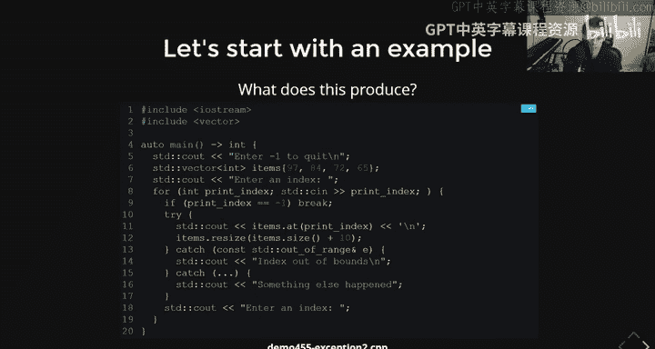

What you'll notice is in this first program， it just crashed the program when there was a problem。

 But if I go to the second one here。This is very much a similar program， slightly different numbers。

But。What you see here。I can get rid of this resize， for now。What you see here is that。嗯。

I am now catching this exception。 So essentially， if the vector。When I call the function。

 throws an exception， makes a complaint， says that something's wrong。

 What this is telling the the compiler to bake into the executable is。

If you see something like this throne， then I want you to execute this body of code So now when I go and build and compile this one。

It says you know enter negative 1 to quit， I enter 0， I get that number 2，1，3， and then if I enter 5。

 it says index out of bounds。So a way to think about exceptions is， you know， at a conceptual level。

 they're not too dissimilar from。If E do this。一人。Or like if no error。

 And you'll see that the way we're handling them we're wrapping in them in this tried catch block。

This block is pretty similar for lots of different languages， sometimes different names， but。

Try says do something。And if there's an error， catch it。

 So the way that the program flows it goes to every single line of this try。

 And if an exception is thrown at any point in the try。

Then the trier jumps immediately to the series of catches。And at checks。

 was this the thing that was thrown。Was this the problem that happened。

 And if that was the problem that happened， we do something。

 And then if this one was the problem that happened， we do something else。And then at the end of it。

 we， we keep going。So the way the way kind of C++ is designed is， like other languages， try， catch。

 and then you gracefully handle it。 So the whole point of exceptions is to gracefully handle problems because it's better than crashing it or other kinds of things。

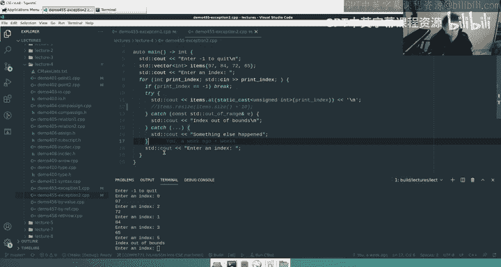

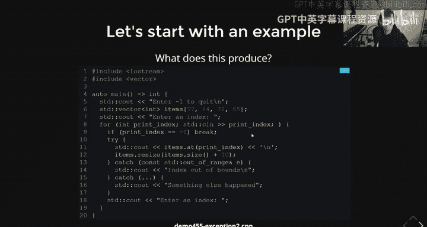

So。That's like a lot of these lectures， I like to start with a very high level example that kind of captures everything we're doing so that you can at least see how it all fits in。

嗯。But。Let's actually get back into the basics of what these exceptions even are so exceptions are for exceptional circumstances。

 that means when something goes not to plan and it happens during what we call runtime anomalies so an anomaly is something out of the ordinary。

So normally you have like a standard straightforward flow you expect your program to follow but。

What happens。During your program something strange happens， maybe someone inputted an invalid number。

 maybe you didn't get to allocate that memory， maybe the file doesn't exist like in the word letter assignment So C++ has this runtime mechanism for exception handling and what happens is C++ detects a runtime error and it raises an exception or a particular class throws an exception raises an exception throws and raises the same thing here and one of the most fundamental ideas to understanding an exception is that often exceptions are handled by unrelated pieces of code。

And what that means is that。It's kind of like jumping around because normally when you're programming with these kinds of sequential imperative languages。

 everything just follows like a quite straightforward flow even if you have loops and branches and other stuff you can still put your pen on the top of the page and follow it around。

 even if it's all wgly and wggly but exceptions kind of break that rule because the way they work is they say。

 okay， if there's an exception， stop everything you're doing and immediately start going up through the stack frame to find something to handle。

So in an exception thrown in C plus plus everything stops， everything stops。

 and it just keeps going back through all of the functions that it was called。

 you know from this function up to this function， all the way back up to your main function。

All the way back up， hoping for someone to handle it。

 looking for someone to catch it and do something graceful with it。

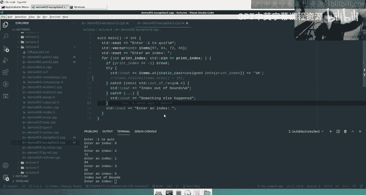

In C plus plus there are a whole bunch of exception objects that can be thrown。

 So all exceptions in C plus plus are objects too， you know， insert objects。

 strings or objects we've spent the last week or so talking about classes and objects。

 but all exceptions in C plus plus are objects， too。

And the most basic type we have for exceptions is the standard exception。Class。

 so this is like the broadest exception。 So think about this as like the mother of all error messages。

 the broadest error message。 And then we have a series of like inherited types or like subtypes of that。

 So， you know， with with exception。We have a logic error and a runtime error and a logic error has like an out of range and an invalid argument and a length error。

 And these are all inherited off each other。 So if I go look this up in。

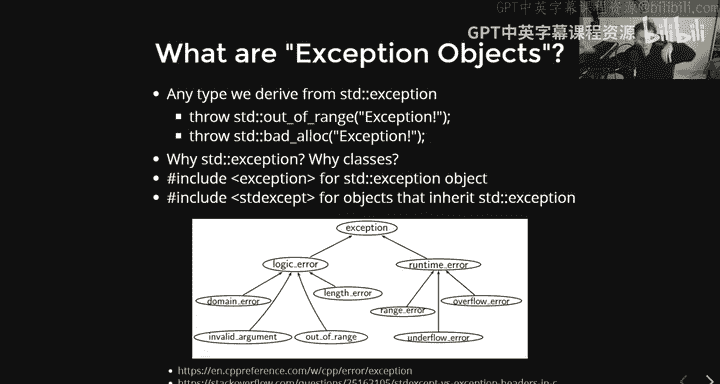

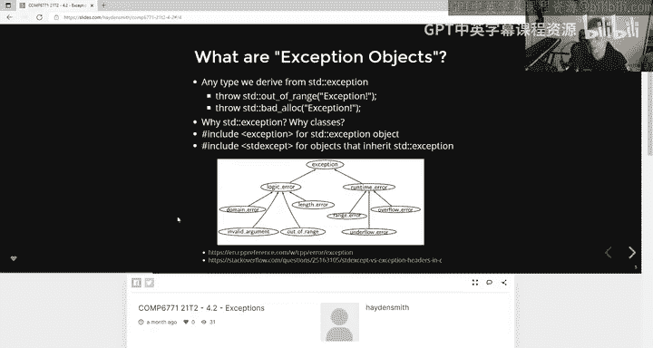

CPP reference。Out of range， you can see that this particular class here is。Inherited from logica。

 which is inherited from exception。So these are all subtypes of each other。

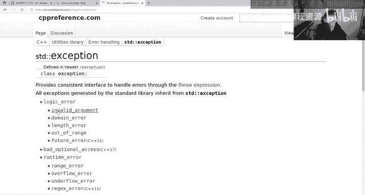

You can go read more about that on those links。In terms of the exception code structure。

 exceptions treated like L values， we'll talk more about what L values are next week and then type conversion also sometimes exist which we will also try and talk about。

 I think we have some examples， why do we have our type conversion examples？😊。

I'll show you what that means in a sec。嗯。But essentially what this means is that if an exception is thrown that is a nonconte exception。

 it's happy to cast it to a cont and I know you're probably sitting there thinking all right。

 this isn't making a ton of sense to me so I could actually show you something slightly different here where let's just modify our program for a second let's make our own exception really quickly。

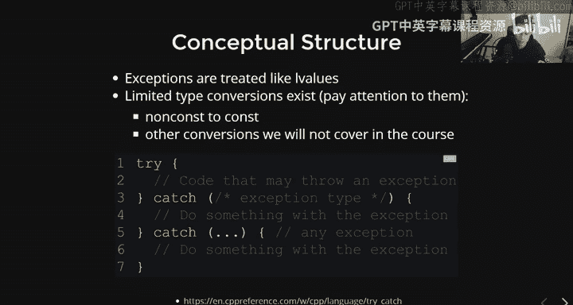

Okay， so I'm gonna say here if。

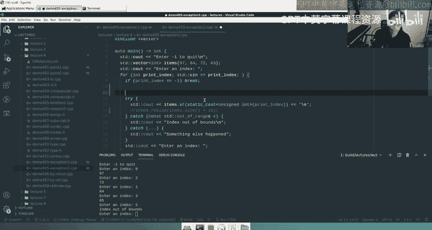

Print index is less than 0。Or print index is greater than 3，ca there's four elements。

 Or here I could say items dot。Lengths。Greater or equal to。Then do I want to throw an exception。

So I want to do this just before I actually try and read from it。

Except the exception I want to throw throw well。I could throw an exception that's in the standard library。

 So， for instance， this out of range exception that we have here。

 Let's throw that one because that one seems very relevant。 and it's a standard exception。

 which is good。So I could say throw standard out of range like this。

usually would have to give it some kind of。嗯。They don't have an example there。

 but sometimes you have to give it like a little message， sorry。Edge does this thing。

 I should really figure out how to turn it off I like it。嗯。Like tabs， how do I do tabs。New tab page。

 Anyway， someone knows how to stop it when an alt tab it changes tabs， which really。Messes with me。

 but。We want to throw this exception。 Now， this is defined in standard except。

 So standard accept is a C plus plus library with all of the standard exceptions in it。

 so I can just include that， and then we can try and do this now。 So if the index is not valid here。

 and in fact， I might use the subscripts syntax here because now I'm doing the checks myself。

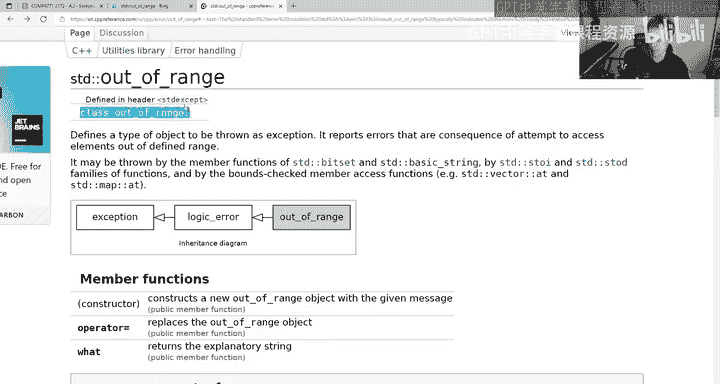

So I'll just do something like this。Let's try and see if this one compiles。Okay。

No member Laman length is its size， but that wasn't the main problem。

 The problem here was that it says no matching constructor for initialization of standard out of range。

Does anyone know what I'm doing wrong here？We're going to try and put a message in。Out of bounds。Y。

 no， sorry， it's not a。Right。Oh， it's getting angry about the bracket， I see。Okay。

 so basically a lot of exceptions won't be created without any kind of string or information associated with it。

 This is no exception Ha ha here。 and then we're dealing with one last arrow which is saying that like comparison of imagess of different signs。

 it like。I mean， an easy way to get around this is like we could just try and use a instead of doing it into。

 we could probably just say standard size type。S type。I think that's okay。I'm not sure if it。

 is it size T or size type。 I always forget these ones。嗯。Now。

 I'm just messing around with too many things。Think it's size to。No， that's right。 Sorry。

 I'm messing this one up。 The， So the， the reason I was like， why do we have that。

 that in there as a negative one。 So this is part of the reason why kind of your。

C style approach isn't really good here because like， we have this index， which is an an int。

 And we're using negative one because we only want to read in positive integers， right。嗯。But。

So that's why the casting happens。 The other way we could get around this snap here is by potentially saying。

 okay， well let's just create some random index that's like 99999， but that's also super ugly。

It's like a terrible thing it's like， you know， if you enter like five nines。

 we'll quit the program for you， but at least this should work for us。Yep。

 so now if were go and run this one。We entered index 0，1，2，3，4。 it says index out of bounds。

So what's actually happening here is that this is being thrown。Okay。When you throw an exception。

 So throw an exception， think about the steps here。 This this is an object。 It's a class。

 All exceptions are classes。 This object is being constructed here。 Then it is being thrown。

 When you throw an exception， what the program does is it halts any further execution。

 So normally this program is going。This line。To this line， to this line， et ce。

 but it completely stops here。It doesn't execute any。And then it tries to immediately。

 it looks that it checks to see if it's in a try catchch block。And if it is。Itam。

Checks if any of the catches match。And if it's not in a tricach block。

 it ends the function and it goes back upper a level to the function that called it。

And this is the most important part， and if it keeps going up through all of the functions。

Every time。嗯。Yeah， it's never really true， I don't know I had that there probably back when it was signed。

If it was like， yeah， if it goes through all the functions all the way up to the top and if it gets to the main function and no one catches it。

Then it calls standard Terinate。Okay， so like。That's why in our previous example here。

 back in this one， the program just totally ended。 The reason the program totally ended was because the exception was thrown。

 It was thrown by the vector at method。

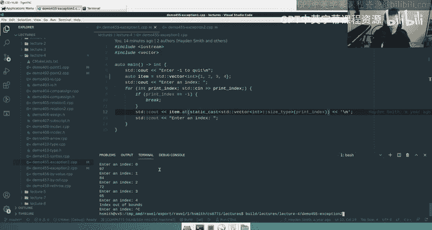

But。No one caught it， so it was thrown here。Inside the at function。

It came out of that function into our main function。

 and then we didn't handle it in our main function， So it terminated the program。

 and it says us here terminating the program because there was an exception thrownr that was uncot。

 noncached it。 And this was the type of it。 So that is actually extremely self explanatory。

So in this case here， when I throw this exception， it does the same things。

 it looks to see if it's in a tri block if it is， it goes and checks the catches and if no one can catch it。

It goes back up to the next level。 So if I didn't catch it here properly， like。

 let's say I had a catch here that was for like a different type， like a like a logic error。

Then the program will still crash。Oop， sorry， wrong program。It'll still crash when I 10 to4。Oh。

 causeuse logic here oops see， this is how inheritance works。

Logic error is the super type of out of range。 I meant to use runtime error， sorry。

So I meant to try and catch a run time error。Which is a totally different error。

So if I do four is as it aborted， so the exception was thrown。

 it was in a tri block so went through the catches， couldn't find anything。

 then it bubbled up to the next level。And then the main function just terminated after it couldn't find anything in the main function just terminated。

 Now， in reality， often， you know， you're not always putting throws in the same try block quite often what's happening is you're wrapping a try around a piece of code that you didn't write that you think might throw an exception such as the vectors at dot at function。

 which you know might throw an exception。 So you put a try around it just to check。Now。

You would have seen before I had this code here。So what this code here does。

Is that these three dots are essentially a way of saying catch all。So in this case， it's saying。

 if there's an error that's not an out of range error， I want you to catch it。

 I want you to catch absolutely everything。Okay， absolutely everything。 So this。

 this essentially prevents it from ever terminating because it means that if it's not。

 if it doesn't succeed normally。Or if it throws an out of range error or an error that's a subtype of out of range。

 which there is none， sorry。嗯。Then， oh， sorry， if it throws it out of range。

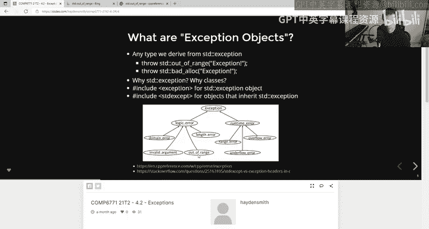

Then I will catch it。And I will print this。 And then if it throws something else。

 I will just say something else happen。 Now， what other types of things can there be。

 I left this note in the slides here。Which is for resize。Which is a standard vector function。And。

You can see what resize does is it resizes a container too。Contain count elements。嗯。Now。

What are the conditions where it would fail？I'm pretty sure if it's above the capacity。

Which I think is what I'm trying to do here。 So we did this previously where if you construct a vector with four elements。

 then the size will be four。But if you try and resize it。To item size plus 10。

 I think it won't have the capacity for them， so it should throw a different error。4。

Index out of bounds up 3。Okay。So now， this one's going fine。 What's a vector。

 like what's another trying to think， what's a vector thing that might fail。

 I guess if we tried to resize it to something absurd。Right， let's try and resize it to this。

 see if it runs out of memory or something。3。哦，那。This one didn't even throw any。

 this one did throw an exception。 What happened to you。So this one actually crashed the program。

So this address sanitizer， this happens because of all the CMake stuff we have baked into your program。

 if you just took this file here and you just tried to compile it directly，Right。

 if you just tried to compile that directly and then run it， you will see that it will fail。

A little bit clearer， so I' mean in this one here， I'm sure the message is baked into it quietly。

 I can't really see it。It looks like the address sanitized it just。Fig it out for me。嗯。

But so that's why we like these little c make things。 I'm sure this is running some kind of。

it's running the address sanitizer。 Yeah， it is in debug mode like that's essentially why right So when we're building with VS code and Cm。

 it's in debug mode。 So it's adding in all these other symbols to it and the address sanitizer and probably I can't remember if it's running Valel grind or not。

 but you know that's how the debugger works anyway。

 But if we run it directly you see it actually prints out that something else happened。

 So what happened here was an exception was thrown on this line here。

Not 100% sure what exception was thrown。Probably tells us。It doesn't tell us。嗯。

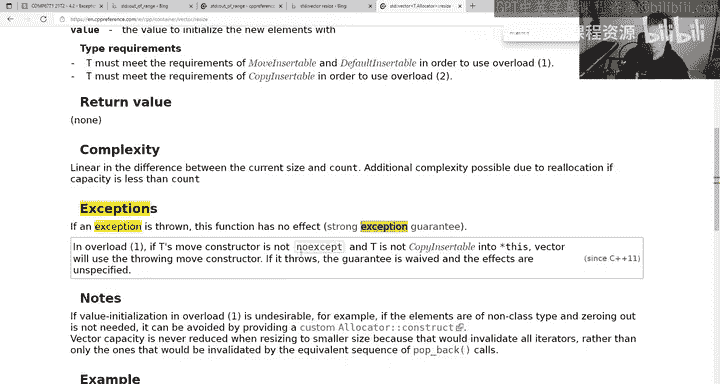

It's probably an out of memory or something like that。Plus。Yeah。

 so the exception thrown by the resize function。Because it's in the try block。

 we try and check if we can catch it。 Can we catch it as a out of range error， No。

 can we catch it as in anything， Yes， if this was another type of catch。

 if if this couch had a type in it that was not compatible with whatever items that resize is throwing。

Then it would also like fail to be caught and then it will bubble up to the next level。

 so you have to think about exceptions as these series of levels you know and when there's a problem it just like floats up。

 floats up waiting for someone to deal with it。To look after it。Now if we go back to the slides here。

 the slide we kind of got on attentionent on was this one here where we said that limited type conversions exist for exceptions now we're going to talk about some of these type conversions。

 but the most basic one is a noncont to a con and what we mean by that is that。

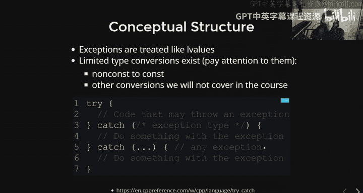

This standard out of range exception， remember all exceptions are just objects of class types。

This is actually a non constant exception。 I'm pretty sure I've honestly actually never tried to do this。

But I'm pretty sure you could just construct it， like。

This you could just say auto OOR equals that and then throw OR。Becauseuse in C++。

 you can basically throw anything。So like here， if I， oops， sorry， let's rerun it。嗯。🤢，If I do four。

 it says index out of bounds， So this is actually this is actually throwing here。

 so you have to just imagine that this is an object of a class type defined somewhere in in the library and。

😊，呃。Yeah， we're just throwing that object。But what you'll notice here is we're catching the cont version of that object。

So what actually happens with C+ plus is that if you throw a non con version。Of an exception。

It will happily catch a constant version of it。 It's happy to do this like non constant a constant conversion。

 So you'll see here if I make this a con now。😊，This will also work。

 but let's see what happens when I make this one non con。And I run it。4 index out of bounds。

 So this one was still caught。Shes super interesting。Oh， there we go。

 That's  causeuse I did the resize。Mm。😊，I'm surprised this one's still caught， actually。

Maybe the compiler does something here for us that I'm not familiar with。

Because this is a constant object that shouldn't get caught。Now。

I know this should be a con over here in general， any time you catch and。

 I'm not sure why that was that's working， but in general， any time you catch an exception。

 it should always be a a reference to constant type。 Now we'll talk about the reference。

 This is part of the lecture， but we'll talk about that after。But it always。

 it always should be consed Why constantsts performant。 You're not going to edit the exception。

 Like why would you edit the exception That's so strange， So it should always be const。

 You don't want the exception to be mutable。 But the point is some limited type conversions do happen。

There are some inheritance type conversions we already saw that when we looked at throwing an out of range and trying to catch a logic error。

So there is some kind of polymorphism stuff happening here when it comes to the exceptions of being caught。

And you can also catch multiple exceptions。 so you can actually have many catch blocks as many as you want。

I think one really important thing to note though， is that for any try block。

 you only ever enter one catch block。So if you have like four catches。

 you can't enter all four somehow， you just like enter one。So once you enter one of them。

 it'll never check the other exceptions。 So if you have something here like this where you say I'm going to catch out of bounds and then I'm going to catch logic error。

 even though both of these are candidates for the catch。

 both of these are compatible with the type that's thrown。 it would match on the first one。

 It would successfully catch there and then it would never look at any of the other catches。

 so it only looks at the first catch。Is Coch everything good in practice？I don't think so。

If you really want to catch every possible thing that can happen。

You should go and figure out all the possible things that should happen and write them down， I think。

From。Sure， there are some times where you might want to use it。

 but generally don't use it just because you couldn't be bothered to figure out what might be thrown。

So that makes sense so like。Particularly if I。It's like hard to say like if your function should never throw an exception under any circumstances should always like it should not allow an exception to bubble up to the next level and your function is calling a series of functions that have some very undefined behavior then。

I very just， you know， vague broad behaviour。 Then maybe it's useful as a complete stop gap。

 But again， it it's never there to avoid having to understand。嗯。What happens。Dvanche says。

 why do you need outer bounds in curly braces， wouldn't line 18， I might have changed line 18。

Still there， I guess。I'm not too sure what you mean， why do you need outer bounds in curly braces？

Do you mean like。Here。Oh， so it's like when I'm pretty sure the constructor of an exception requires some kind of message。

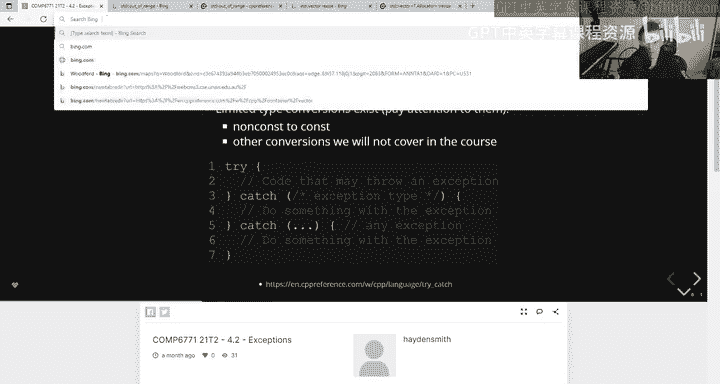

Some information about it， essentially， so。If you try and throw a standard exception。嗯。Where is it。

Yeah， I don't know。 I was trying to look for random example， but generally speaking， all。

 all messages， all exception messages are attached。

 have some kind of message associated with themca then you know， there's gonna be some context。

 some circumstance relevant information。

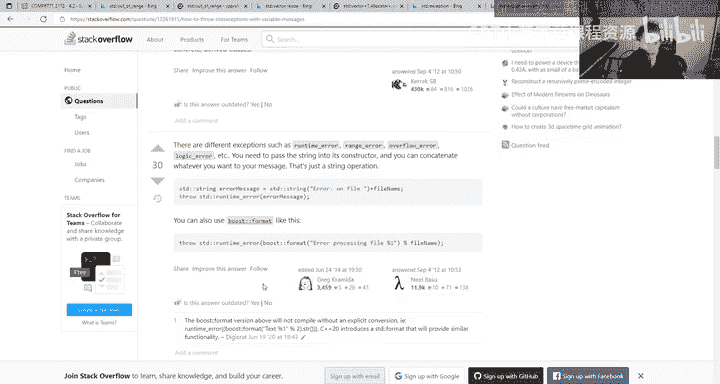

So。In C++， you can throw any object。Any object， I could throw a standard string。

I could throw a standard string heller like this。That's totally doable。

I have a feeling that I won't get this to compile， though。Oh， no， okay， we're lucky。This works。

 this does a thing， it's just it caused something else happen here because it doesn't match this type and it doesn't match that type。

P Ison says so usually would you do something like standard C E dot message Yeah exactly。

 so that's a great point。 That's something I glossed over here。

 So because every exception has some information attached to it。

 you can actually print out that information。 So here I could say E dot I think it's message I'm going to take your word on that one。

But yeah， so for instance， if an exceptions thrown like an out of range and you want to catch it and give the user some information about it。

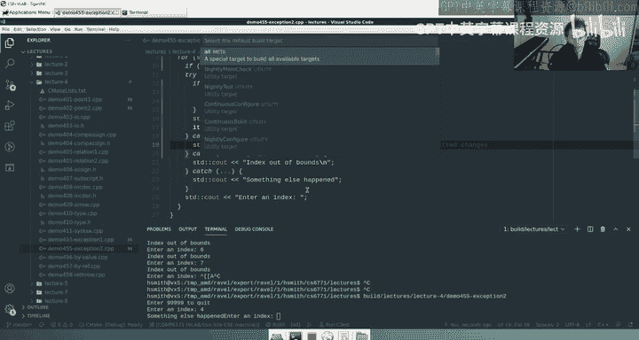

Isn't it darkt water or something。Can't remember。What is it， Standard exception。

Let's go go grab the one here。Someone will tell me before oh'll dot what？Yep， okay。

 so it's it's dot wt and dot wt will give you like the whatever text information was attached to it。

 So here when I run this one now and do four， it says out of bound。

You could throw it in and catch an in。 That' would be weird， but you can definitely do it。

And if I get rid of my silly little custom exception check here， and I just stick to using items。@。

I just scared it to the three size。And we really run it。 Now I'm printing out the watch。From the。

The exception that I'm catching， so It。 app might throw an out of range exception and I'm going to print out the message that it gives me。

嗯。And now when I run this。Po。It says vector。Is that what I wanted， did I do that wrong？Nope。

It just says vector。The explanatory string。Okay。Interesting。

 I'm sure there's like different ones for different。

 I'm not sure why they just populate that with vector。Got says， I guess it's not。

All too helpful to throw stuff that are not exception since you can't assign a message。 Yeah。

 exactly。 So exception objects in C plus plus are literally just classes of a certain type that have a certain standard。

 So the reason they all inherit standard exception is because then they all have a standard interface。

 So standard exception implements the it overloads the equal operator， and it has the w function。

 which returns a string。Yeah， chata。A。So。That's why everything inherits it because you could throw other things。

 you could throw a book， you could throw a point。 you could throw a person。But why would you do that。

 It's really weird。 Like people aren't used to catching these non exception types。

 And if you make your own exception， you would typically inherit an exception type。

 You might inherit standard exception out of range， You could inherit any。

 But as long as there are a subtype of exception， you should be good。 Pson says。

 would you ever not throw an exception。Not that I can think of。 I've never come across that scenario。

 You'd pretty much always throw an exception。 And if you don't have an exception that you feel。

Adequately satisfies your situation。 Make another one， but it should be a subtype of it。

 So you can see here， here's a bunch of exceptions。 The ones on the slide are just some of them。

 But you can see we've got red X era。Format error。Bad cost。Yeah， whole bunch of things here。

 future error。The future error。Thrown on failure by the functions in the thread library that deal with asynchronous execution of shared states。

可。Sounds hard。Anyway， that's the gist of it。

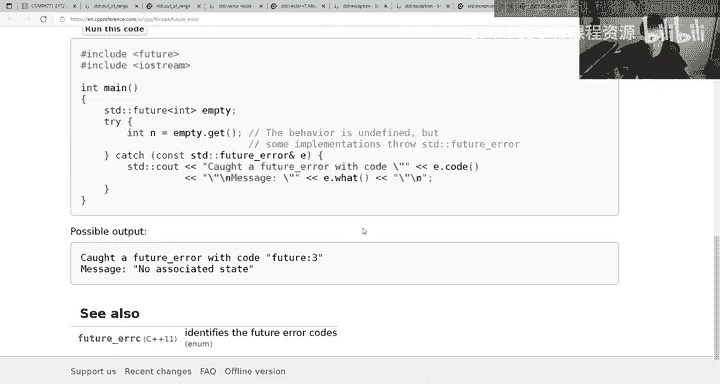

I think that's most of the key things here。This is a great opportunity to。😊，Explain the。

The difference between dot at and the subscript。 So he said previously that like dot at and subscript do the same thing。

 They're both like get an element at a given index。 But the dot at is actually the same logic。

 but it's wrapped in an exception。 So it does the bounce checking with a simple if statement。

 And if the if statement fails， it throws an exception。

And you'll see this here when I run this and I do normal indexes， it's totally fine。

 but when I do a different index。 Well in this case， the address sanitizer is like， hey。

 what are you doing because it's I keep buffer overflow it can tell I've done that。

 but if you are say building this on release mode where it optimizes out all the debug information and all the like sanity checking。

And I build this one here and I'm sure all of you know about release mode from assignment 1 and I run this again。

 and I go 223， whatever then I do four。 I am in the undefin behavior territory where things are really scary because this program is still running validly and this is again the worst kind of thing that can happen is that your program doesn't crash and we were just accessing a whole bunch of memory that we were allowed to but wasn't meaningful until I accessed a piece of memory so big that the actual operating system itself said and then gave me a Se fault。

We like exceptions。they do add a bit of performance hit though。

 right that's why C doesn't have exceptions because it is slower。

The other thing that's bad about exceptions is it does break the linear flow of the code and what I mean by that is that。

Here， if I have a standard C， that's like。I love being printed a lot。Like that。

You'll notice here that if I go and build this one。And I run this one， and I do one，2。

 It's always being printed outright， But you'll notice when I do a four here as in something that's out of bounds well。

This one I'll still print it。 I forgot to change the other part of the code。

 So this is undefined behavior。 We're accessing an invalid index。

 But if I change this items index to items dot at。That's what I meant to do before。 I'm sorry。

And I go one， two， three， and then I go four。You see what happens is that when the exceptions thrown here。

 the program stops on this particular operation。 So this operation of trying to。

Get the value at that index。 It stopped there。 It didn't execute the new line。

 It didn't execute this line。 It stopped everything and went straight。

 It like stopped that entire tribe block， and it went straight to the catches。

And that's one of the most important things。 If you aren't already familiar with this from other courses。

 the most important things to really get your head around when it comes to exceptions are that it's one of the few things in imperative programming that。

Is non nonlinear。Is basically go to statements under the hood。 I'm pretty sure。 Or if you know。

 if you're， if you're a hardware person， it's like interrupts，'s， it's a way of jumping。

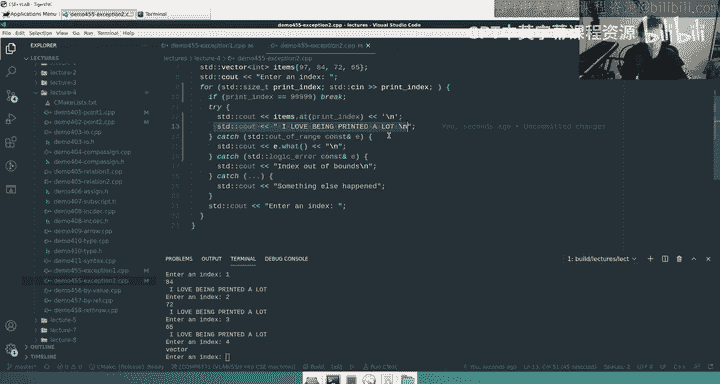

And that's kind of why we go back to the notes。We define exceptions as。Where is it。Yes。

Exceptions of throne。They're raised， and then another unrelated part of code captures the exception。

So it breaks that kind of linear flow。嗯。So people in the chat are talking about control C。嗯。And yeah。

 I know control C is not an exception。 It's， it's， it's a signal to， it's like a。

It's like an operating system signal to the program that I'd like you to stop， please。

 though I believe that， as people have said。Some languages like Python will sometimes pick up on that signal and throw an exception。

 which is interesting because you can actually write code that like might pick up on that signal and handle it like an exception。

 as opposed to just crashing， though I don't have much expertise in that area in the slightest， so。

Not sure。Okay， so we've kind of talked about this a little bit。

 We've talked about the conceptual structure of exceptions。

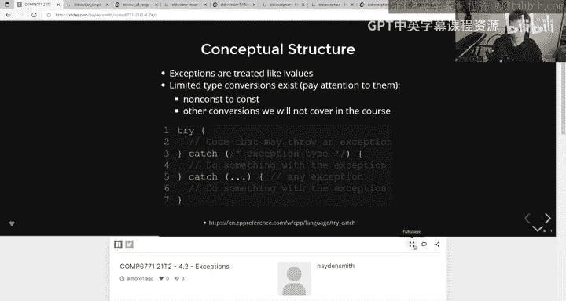

Now we have the multiple catch options which we've also talked about。

 I know this these lectures might feel backwards， but I kind of prefer just to show you and then you know let's explain the key things of it。

 And I want you to remember again with this that this does not mean that multiple catches happen One catch happens per trica block。

So multiple catches mean multiple options for a single catch， potentially no catches。

 but up to one catch。Now。One of the biggest and most important parts of dealing with exceptions is catching it the right way。

 Now we've already talked about when you catch exceptions you want them to be consed。

But what we haven't talked about is。Whether they should be a reference or not。

So there are three fundamental ways that you can catch exceptions。 They are essentially。

Catch them by value。Right， catch them by pointer。嗯嗯。No， no， no。 And catch them by reference。

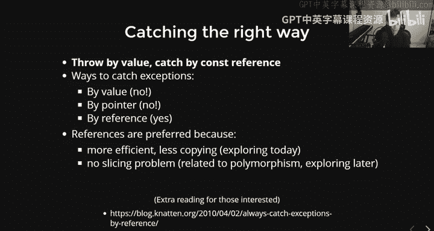

Okay， so。What that means is that in a piece of code like we have here。

These are all caught by reference。If I get rid of the reference。It's catch by value。That makes sense。

You know， comes out of range。 C plus plus will copy the entire exception object in just like any other object。

 It'll call the。You know， it'll do it。 It'll have a copy constructor that'll copy it in for us。

 But then it's like catch by pointer。 Well， this one's kind of tricky because。

Some except you could throw a pointer and catch it。

 I'm not even going to demonstrate that to you because it's kind of chaos。

 but nothing is really stopping you from like catching a pointer or something。

 Just we would never do that。 So we never want to catch by pointer。

 We never want to catch by value and we always want to catch by reference。 Now。

 the reason we want to catch by reference should be pretty obvious to you。

 It's that when you catch things by reference。嗯。Deyi。A quicker。Because you're not copying things。

 What if an exception object has like a message in it that's like 100 bytes。

 That's like 100 bytes you're copying。 you know， that's like a non negligible amount of bytes that's some serious cycles for some computers to do So we always like to catch by reference。

 The other thing about references， which is really interesting and we will talk about this。

 I think in week 9 is there's this thing called the slicing problem where're essentially it's to do with polymorphism。

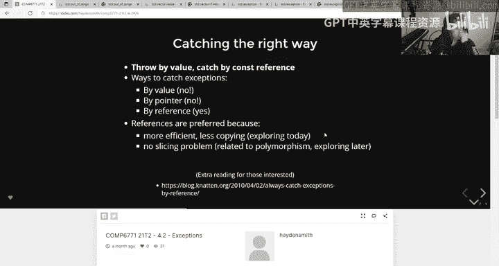

And。If you catch by value， there's some instances where。Essentially， your tie might get cut off。

Early， it's kind of hard to explain that you could lose data。 essentially， if。

 if you catch by value due to how inheritance works， you might actually。

Lose information about the exception。 You can click on that link。 It's a blog I found。

 which I thought explained it well as to why you should always catch by reference。

 But we always want to catch by reference。 But let's actually。

 let's actually play that out in reality， maybe before we do that because we kinda have just a couple of things here。

 maybe let's take an early break。H。And then we can talk about the rest of catching by reference。

 We'll probably finish early。 So anyway， let's take a five minute break。

 and then we'll keep going with this。

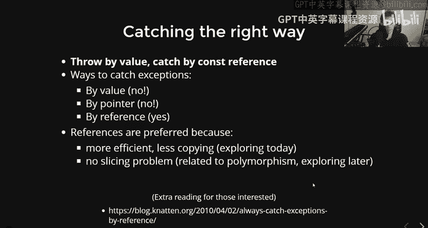

Cool， sounds good。So what we're looking at at the moment is catching by reference。

 So we've already talked about cons is the right way to catch it because you can cast， not cast。

 but you know， you can。Promote non con things to cons。 and we get the general just to by reference。

 you know。Faster， no random problem that Hayden says we'll learn about later。

 But let's first have a look just to really demonstrate it about what happens if you were to try and。

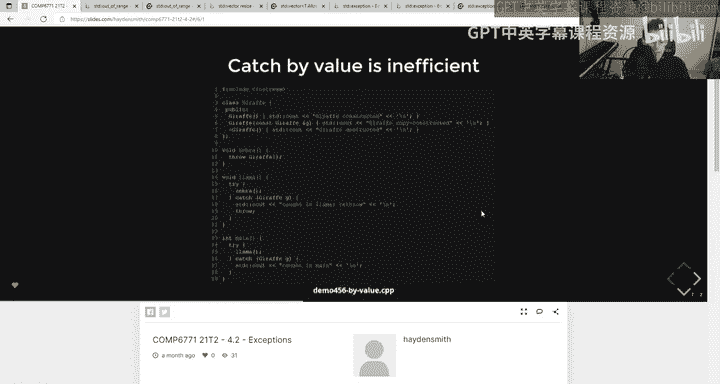

Catch by value。 So this is a bit of a strange。Little thing， but。

Let's try and follow the flow in this program， because is kind of interesting。

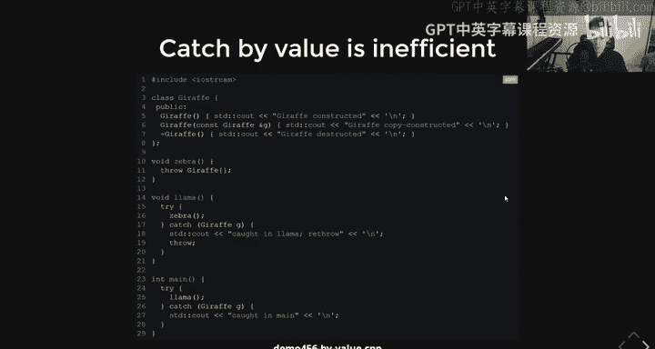

In fact， I feel like this is one of those ones that。Doesn't。

I've had to put some voids in here to make it compile， but we've got this class。Coldderra。

 and when we constructed it， Prince draft constructed， when we destruct it a Prince draft destructed。

 and when we copy construct it。It prints giraffe copy constructed。Okay， so。And it does， yeah。

 it does actually copy constructed so。This is just an example of。呃。

U printing out to all the kind of the key things that are happening so when you actually look at the flow of this program we start the program。

😊，In a tri block we try and call Lama。If Lama throws an exception。

 we're happy to catch giraffe and then print court in main。 So if we catch the girae in main。

 then we print court in Ma。 When we call Lama， though。

 what happens is we call a function that itself has a tri statement。Calledzebra。

 and we're expecting this zebra function called might throw an exception。

 so we're ready to catch a giraffe object。And then we'd print court n Lama， re throw。

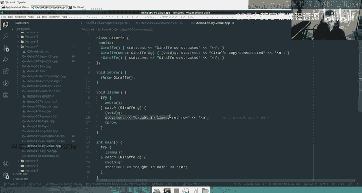

Where's the re throw thing， Did I just。Did I delete some slides。Oh。

I just got them the wrong way around。So sorry。 we'll talk about that in a sec。 So essentially here。

 you'll see that there's this little line of code on line 19 that says throw。

 So one thing that we didn't really touch on in the earlier example is that you can rethrow an exception after it's been caught。

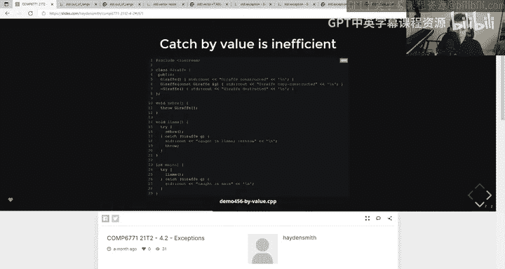

But just to be clear， this doesn't send it along to the next catch statements。

 This immediately bubbles it out。 So if you call the throw within a catch。

 what it does is it takes the exception that's been caught。

 and it immediately rethrows it up upper level in the stack frame， if you will。

 So what's happening here is， if we catch a giraffe inside the Lama function where saying caught in Lama re throw。

 So that means take， if you just write throw by itself， you could write， throw something else。 right。

 But like throw by itself or just throw the exception that's been caught。

 And we call the zebra function and all the zebra function does， is it throws a giraffe object。

 So on line 11 here。The girae object is constructed and thrownron。

 so this is essentially just a function that throws an exception， and then we catch it in Lama。

So this is because we hold zebra here。 We catch it here。 We print cord and lama rething。 we throw it。

 which immediately sends it out of the function upper level to the main。

Which is where we called Lama。 And then we catch the giraffe there， and we do something with it。

 So this is an example of us catching exceptions on two occasions here。

 So we've caught it inside Lama， and we've caught it inside of。

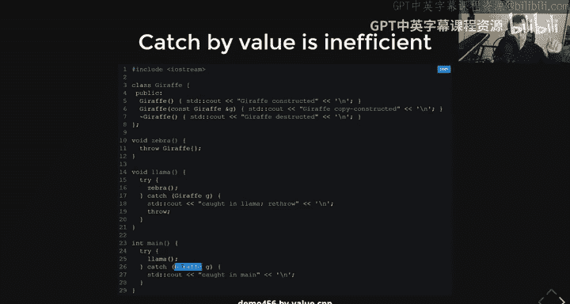

The main function。 Now， have a look at this 1。 I try and run it。 So if I take this program。

And I try and build this。We get draft constructed， draft copy constructed， called in Lama rerow like。

I'm not going to be able to show you that， but let's let's look at this， right。

 So first thing that happens is we we call main zebra， which call main， which calls Lama。

 which calls zebra。 So when we first create the giraffe exception。

 this exception is constructed here。It gets thrown and then it gets caught here in Lama。

 but because we're catching by value， it's actually copy constructed。Because。

It's not being passed by reference。 so when that that exception over here gets caught inside the catch over here。

 it has to get copy constructed， so we call the copy constructor。

 then it gets caught in Lama re throw so we throw it up again， but before we throw it up。

The exception that we created inside the scope of this tricach block has to be destroyed。

 So we actually have to destroy that giraffe。And then when it gets caught inside the main function。

 we have to copy construct it again。Say court in Maine。Destructed at the end of that tricatch。

 And then the original giraffe gets destructed after that。So it's a lot of messing about。😡。

That's the point。 Now， the the next example I this one here catch by reference。

 I won't even show it to you because you can fix it easily。

 Now watch what happens when we make these all cont references。

 So just the reference would be enough， but we're going do cont references because that's what we want you to do。

If I run this one again。And now I run it。 You see that we're doing a lot less work。 Now。

 you already know this， but I think it's a good demonstration here about object lifetimes construction。

 destruction because you can see it's like giraffe constructed， court in Lama。

 court in Ma giraffe destructed， which is kind of the flow you'd expect。

 you'd expect the the exception to be created when it's thrown。Pass up until it's not used anymore。

 and then destruct it at the end of that。

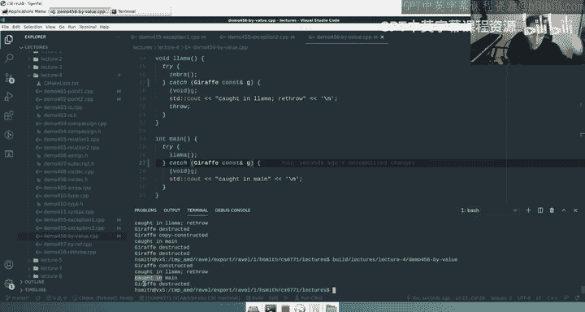

So。That is why we。

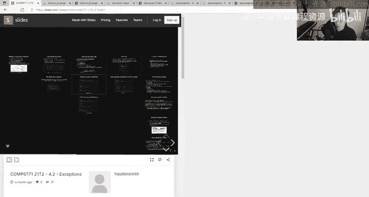

That is why we like to catch by reference， because if we catch by reference like here。

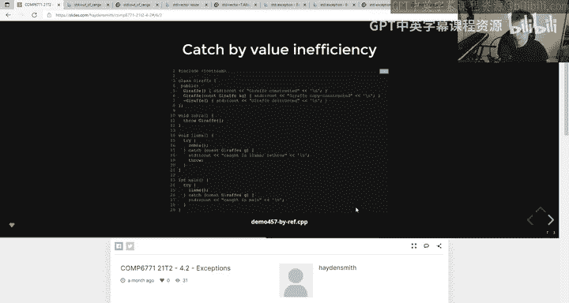

Then。Where， you know， having less memory be wasted， essentially。I talked about rerow already。

If for some reason like， so sometimes you might want to re throwrow an exception。

The cases of rethrowing an exception are usually when you want to do something with it or you want to print something or anything like that。

 But you also want it to bubble up for someone else to deal with。 as in you're like， okay。

 maybe I want to like one of the best examples of this is a logger。 So if you write a logging class。

For something， you might want to catch an exception。

 Lo something about it and then throw it up because your job isn't。 You haven't handled it， right。

 Like if you're just logging it， you haven't solved the problem。

 You've just taken some information from it。 So sometimes it's pretty normal to re throwrow exceptions。

That can kind of happen sometimes。 But the point I， I was。

Making before is this doesn't send it to other catches， this sends it immediately out a layer。

So in this case here。If I have a try catch block like this。And I throw a tea。

 and then I catch a tea by reference。 And then I throw it again。

 What happens is that original exception that I've caught gets rethrown as if it was never caught to the layer above。

 And then this trica here catches it。

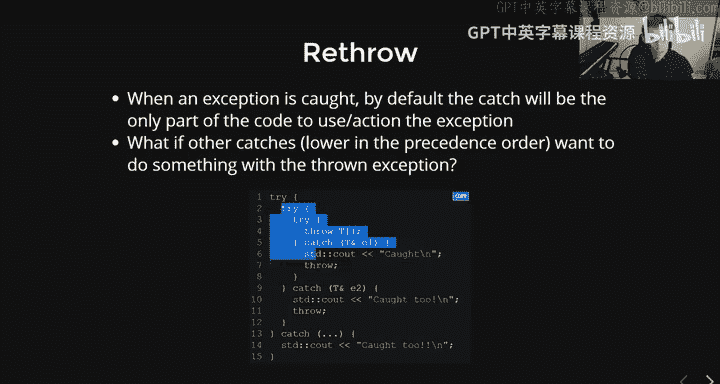

Now another question that gets asked sometimes is what happens if I don't have my exception in a try catch block。

 what happens if we call zebra？Like the outside of the tri catch。Causezebra。

 the function simply throws an exception。 So let's try this one now。嗯。

What do you notice about this well。What line disappeared caught in Lama。

 This makes a lot of sense because what happened is we we called it here。 it got thrown。

 but because it wasn't in the tri block， it didn't get caught。

 So only things in the tri block are the things that are getting caught。

 The way I like to think about try is like when you say try， you're essentially saying， okay。

 I want you to watch this part of the code， because I think this part of the code might throw an exception。

 And if it does， this is how we're going catch it。But in this case， because we weren't watching it。

This tri block had no effect。 and， but it did have an effect here。In the main function。

 because we called Lama inside the tribe block。 So even though we called Lama。

 Lama called zebra zebra through somethingming， that thing thrown。 It bubbled up to。

 it bubbled up to Lama and then it bubbled up to Maine。 But because we were watching it in Maine。

 we caught it。 And then we dealt with it。 as if I take this here now。Do that。

 and then I build it again。What happens here， we never caught the exception program terminates because exceptions that aren't caught before it hits the top of the program cause standard terminate。

And it says unquote exception of type giraffe。

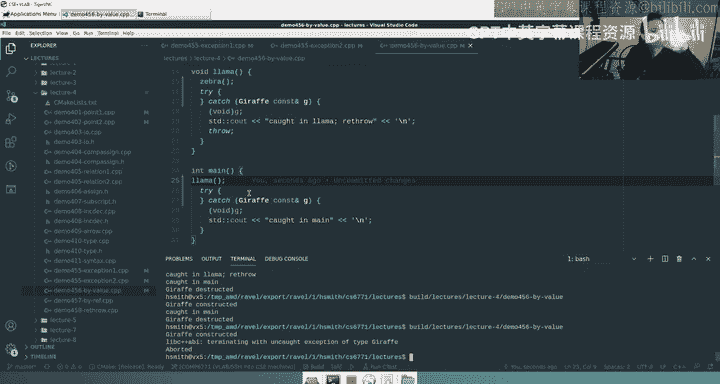

第二。That's the， that's， that's rethrow in a heartbeat， in a heartbeat。Yeah， I guess so。

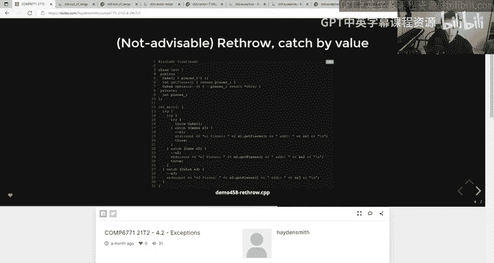

Generally speaking。You probably don't want， I mean。

 this is just a dumb example that you can play around with if you want to explore the limits of this thing。

But。Doing multiple like nested tri catches are not advisable。In reality。

 all programs are effectively nested tricatch blocks because when you have a tricatch that calls a function that has a tricach。

 they're essentially nested， but you will never have a reason for it in one function to have。

 I don't think you will。You shouldn't really have a reason for it in a single function to have multiple tricatches。

 though， just for demonstrative purposes， like you know this here shows you the kind of behaviour about how it bubbles up through the layers。

 some horrible things here， you can see we've got you know， things by reference again。

 this is not this is not like a oh， you should do this。 This is like a you know。

 if you really want to poke around with things you can。But yeah。

 the actual logic of exceptions is extremely straightforward。

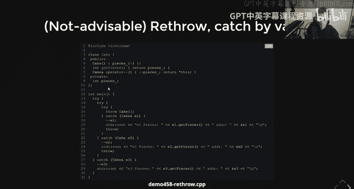

Particularly if you've already done it before now， most of that。Is barely known to you。

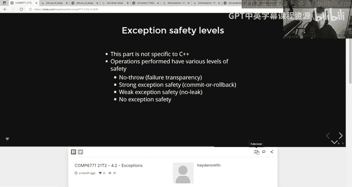

Where we want to get a bit more into the theory on this is a couple of things。

 The first one is exception safety levels。 So this is not a specific thing to see， plus plus。

 Other languages have safety levels of exceptions。And the idea is that any exception throwing function。

We'll have a certain。Safety level。And that safety level tells you what guarantees it provides。

And there are four key safety levels we're talking about The first one is a what you might call a no throw safety level。

 then there's a strong exception safety， weak exception safety and then after all of that there is the no exception safety and these are all decreasing in how safe they are so no throw is the safest and then no exception safety is the least safe。

😊，We're going to go through each of these four types。Firstly， no throw guarantee。

This is a no throw exception safety level， it's also known as failure transparency and what this is is that all operations are guaranteed to succeed even in exceptional circumstances and what this is saying is that exceptions may occur。

 but they're all handled internally。😊，So， for instance， if you have a。

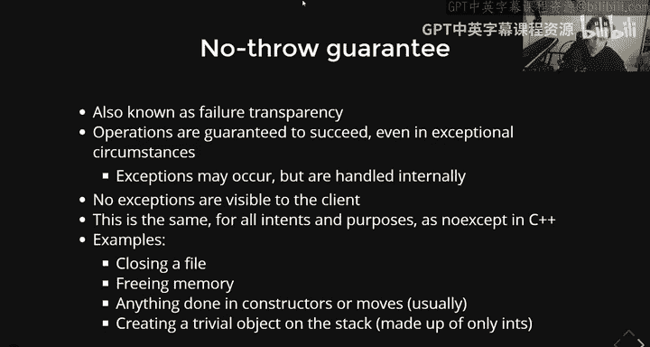

What's an example。Standard vector。And C plus plus， you might have a standard vector。

 and that might be a function you call such as。Dot empty。Now， Dot empty does not throw exceptions。

At all。But。😡，What that means。Is that the dot empty never allows an exception that's thrown to come up to you。

 Now， in reality， dot empty probably doesn't even throw an exception， right。

 But the point is that things like this， it's not so much saying that no exception ever occurs when you call it。

 What it's saying is that if an exception ever occurs。

 it will handle all cases and you will never hear about it and you will never know about it。

 So that's what a no throw guarantees。 It's saying that it guarantees you that it will not throw something to you。

 it might do something internally or whatever。 And essentially anything with the double dots is a no throw guarantee。

 So this example we had here together。

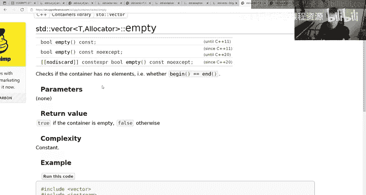

If you have， if you have a potentially throwing item like this。

 but you're catching every instance of it。You don't need the dot dot dot， right。

 Like items dot at only throws。One exception。But if you catch it and you never re throwrow it。

 then that essentially becomes a no throw guarantee because something bad might happen， right。

 some exceptional circumstance might happen， but you're dealing with it。And that's， yeah。

 that's the crux there。 So exceptions may occur， but they're handled internally。

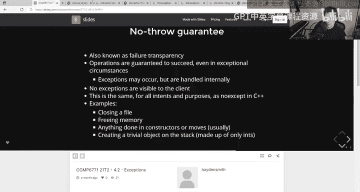

Examples of these are freeing memory。Anything done in constructors， closing a file。

Some of these things might actually have to deal with issues。

 but you get guarantees that they'll never be an exception throne， so they're the best kind。

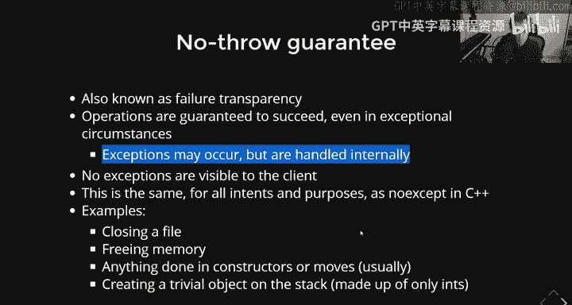

The next two are a bit more complicated， which is strong exception safety and weak exception safety。

😊，Strong exception safety。If you if you're familiar with databases。

 it's very similar to kind of know the rollbacks， but strong exception safety says that you call me。

 I might throw you an exception， right， I I might raise an exception。 However。

 I guarantee you that I will make sure nothing is corrupted。

 I will make sure that if Ive modified anything that I will unmodify it and I will roll it back。

So an example of this， for instance， might be and again。

I'm just speculating on these to something that's somewhat intuitive。

But let's say you have a particular。You know， you know， with a vector， you have this。Reserve。

Function that increases the capacity。This one actually Mal memory， right。

 It does like a resize for you。 It reserves more memory so that future。😊。

Dynamic reallocs aren't aren't as costly， but you can see that this one throws exceptions。

 It might throw a standard length error if。You just ask for too much。

 It might throw an error from the allocator。 So essentially， if it calls Malik。And Malik fails。

 It will， you know。Return to you。Like it'll return that exception to What。

 what a strong exception safety guarantees is that there will be， if it modifies your data structure。

As it's modifying it， if it fails。There will be no side effects。 Nothing strange that happens。

 Itll be is as if you never called it。Now this is a good thing that happens。

This happens in databases sometimes， so like in database design。You can。

 you can kind of do a thing where you say to a database you're like delete X。

 delete y and delete Z and you treat this as a single request。

 And what happens is if it deletes X and then it deletes y， but then it fails to delete Z。

 it'll unwind its changes。 It'll make sure that the state you called it in as the state that it finishes with。

 So it handles that unwinding or roll back internally So essentially it guarantees no side effects。

 that one's super really useful。

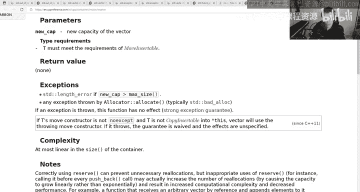

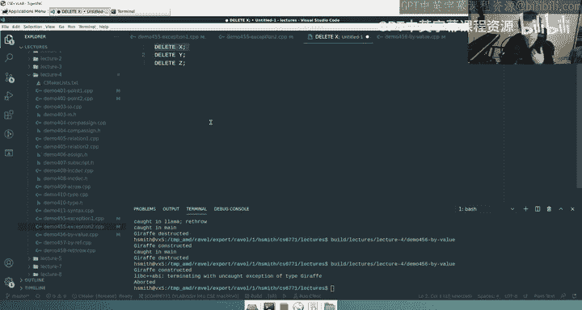

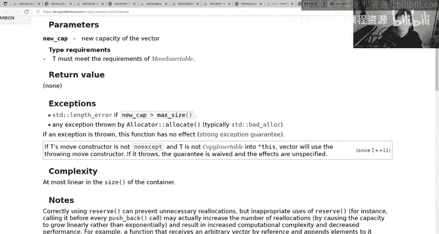

This happens for a whole bunch of things like well this should happen for a whole bunch of things like copy constructors。

Or anything that really mutates that that could potentially fail。Like if your pop back fails。

 if you do something that mutates your container and it fails halfway through。

 it should make sure that it's in the same state as when it started。

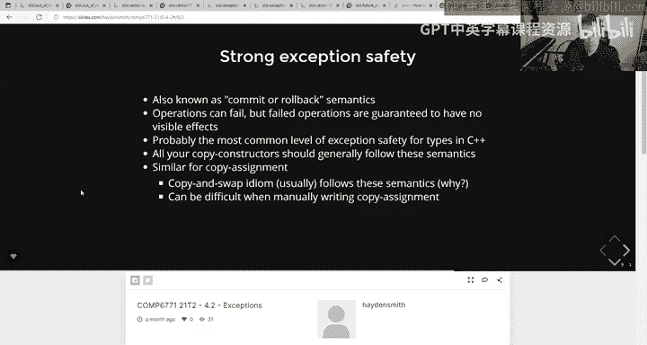

嗯。To ensure strong exception safety。We generally follow a fairly straightforward principle。

 which is that you do all of the operations that may throw。But don't do anything irreversible， first。

And then you perform all the operations that are irreversible， but don't throw。

So here you see there's this nice little diagram that's like if you are writing a function that should have a strong exception safety so it might throw exceptions but no side effects。

 then you want to do everything like allocating memory， copying things。

 things that are totally reversible， you can just delete the copy you can just free the memory that you tried to allocate。

Because these ones might throw， but they're all reversible。

 And then there's things that aren't reversible。That don't throw exceptions。 And you do them after。

 such as freeing memory， closing files and stuff。 So when you're trying to write。

A function that provides a strong exception safety。 that's the process you should follow。

Then we have weak exception safety or basic exception safety did I call it week before。

 that's the same thing basic week and this is also sometimes known as a no leak guarantee and essentially this is kind of like a basic version of the strong exception safety where it says you know what there might be side effects。

I might have created unnecessary copies。 I might have deleted something I shouldn't have。

 Your data structure might be corrupted， but it guarantees you that。TheThere's no resource leaking。

 Basically， it's like， I will not leak memory。So it's a very poor form of exception safety。

 but it at least guarantees you that if you call it and it throws in exceptions。

 it's not going to leak memory。嗯。Yes， there's some more detail to that that we can keep coming back to。

 And then the last one is， is no exception safety。 So this is saying that， oh。

 if you call me and I throw an exception， I might have malic something and won't clean it up。

Or I might there might be side effects。 so youd never want to write anything that has no exception safety or no exception guarantees because that's just bad code So you would avoid that。

 but that' that's definitely a level that you would consider that might exist。

I'm sure some of your code might end up like that。One of the， yeah， one of the。

A very kind of critical thing to you've probably seen around everywhere is this no except specifier。

Now， on a lot of function definitions， you might have seen this throughout CPP reference。

 You might have seen this in the spec or other places。 Sometimes you'll see this word no except。

 And this no except word comes after the function parentheses。

 It often comes near the for class members。 It comes near the conqu。

 So it's often like return type function name parentheses， no except。 And this is essentially a。

It's a form of like code documentation that specifies whether a function can throw or not。

 if you write no except next to a function。Then what it is saying is that it has a no throw guarantee。

Okay， so there's no chance it's going to throw。嗯。If you don't write it。

 then you're saying there's a chance it's going to throw。

What's really important here is that when you write no except。

 there is nothing about that that stops exceptions from being thrown。

 So if you're defining a function that's no except。That's just a signal to someone。

 It's not actually stopping a bad thing happening。So why do we do it。

 it's clearer a program is it helps us know what we don't ever have to wrap in a Tri block and there's some cases which I'm not super across where I know I've heard that some STL functions can operate more efficiently on no accept function so basically if your program is not having to put code in a Tri block than that's less work it has to do which is potentially more efficient。

 you can see no accept keywords everywhere。

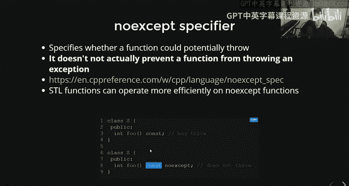

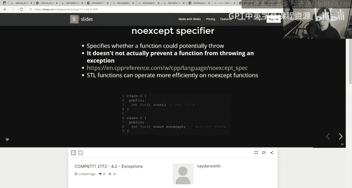

Look at this one here， standard reserve， sorry standard vector reserve。 There's no no except keyword。

 which means it might throw an exception。 But if I go to say size are empty here。

Size has a no except next to it。嗯。Bul has a no exception next to it， as well。So。

If you see these around， it's usually that there's no chances。🤧An exception。Thone。In your assignment。

 we expect you to put no except on functions that are no throw as well。

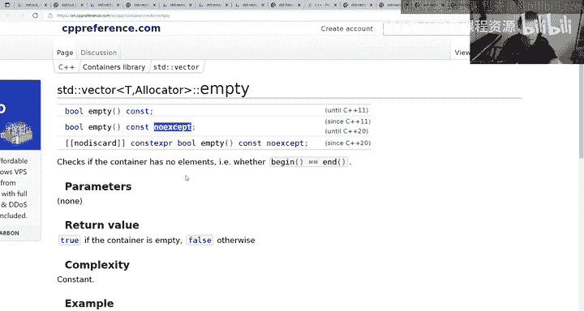

Speaking of your assignment。

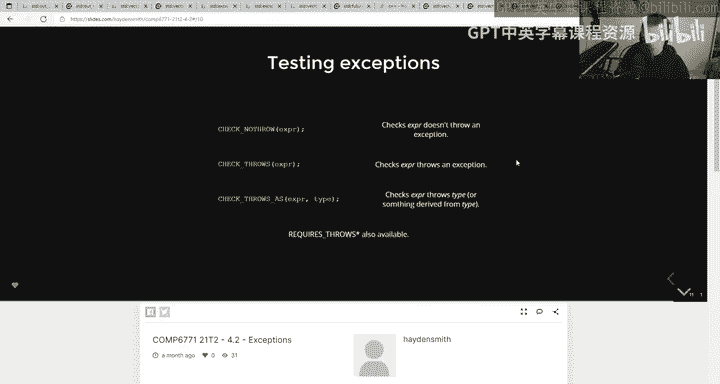

One of the last slides that have been added in here is。

A bit of info about testing exceptions in catch 2。嗯。As part of assignment。

 you will have to handle catching exceptions。 Okay， you don't have to do a。So catching no sorry。

 as part of assignment two， you'll have to deal with throwing exceptions， which is the easy part。😊。

um。You won't have to deal with catching it because you're not writing an implementation。

 You're not writing like。You're not using a Euclide vector， you're writing a Euclide vector， however。

You will need to test your code just like assignment 1 and one of the biggest differences with assignment 1 to2 is that in assignment 2 you're writing you're potentially throwing exceptions in your code。

 and we expect you to throw them correctly。 So for you to tell if you're throwing them correctly。

 you want to test your exceptions that they're throwing correctly。

 And there's a few new catch two functions， these are all just in the docks that you might find really useful So we have catch no throw。

 we have catch throws and catch throws as And what these functions are is you can essentially。

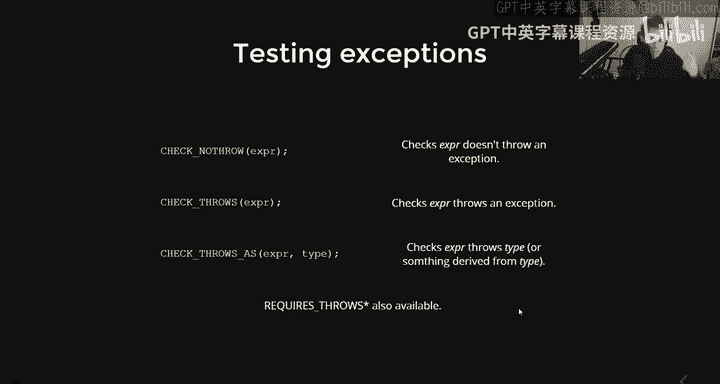

Like。Go back to week 1。You can essentially do something like in your section。

 you could say check no throw like and then call a function like vector。@ 10。

RightSo vectored at 10 is an expression。And if you give that expression to check no throw。

 it will pass if it doesn't throw。 And then similarly， if you give an expression to check throw。

 it will pass if it throws。And the other one we see here is check throws at。

If you try and check your V dot app 10， you can check if this throws。

 but you can be quite specific about the type so you could say standard out of range like that。

 you give it a type。So there are three really easy ways to actually write tests to check if the code you write throws an exception correctly in this case I've just used a vector and you can also use requires so any of these checks can be replaced with requires if you want。

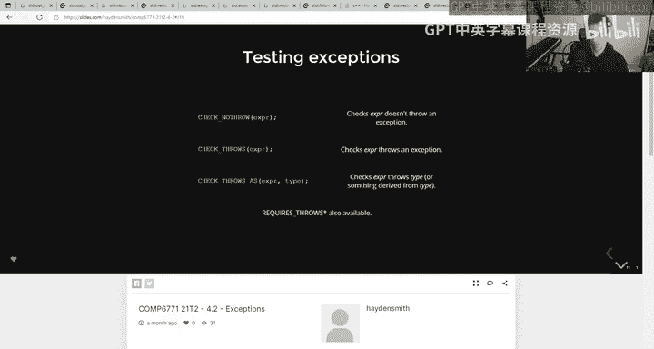

Yeah， and here's some， these are just some examples I've just written them in there。Same thing so。

Checking with catch 2 is really easy。 Of course， that'll never stop people from being like， oh。

 I'll just do in my test。 I'll just be like， well， I'll just try this and。

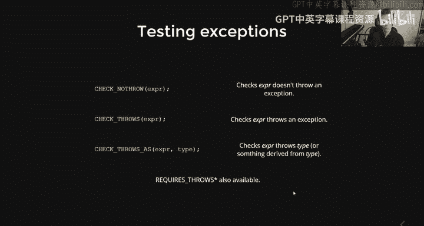

If it。Throws， I will。 Well， you'll just try this。And if it throws， like if you catch something like。

Catch everything。 then I will just。Check。False。Failed like some， some of you might try and do this。

 right， You might just try and catch it and crash the test。 but that's terrible。 That's。

 that did lose you mark。 So you really should be using the， the built in catch to。

Functions in this case。Speaking of that， let's take a really quick。

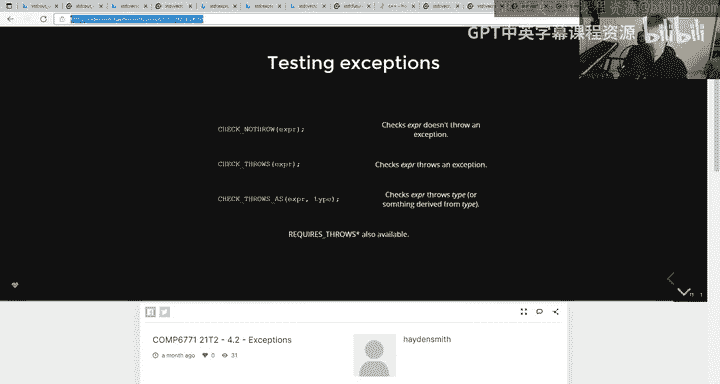

Lo at assignment2 again。So say we're not going to read through everything。 Pson says。

 what about constructors for。No except。 a lot of constructors would have a not。

 not a no except because constructors are always potential。

 A lot of constructors are potentially throwing。Especially if you're dealing with input that could be invalid。

 so。Yeah。But back on assignment too， so just because we have a tiny bit of time here。嗯。

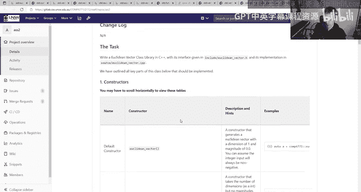

And maybe I'll just climb this quickly。Actually， let's。

 let's chat about assignment 2 for 1520 minutes。 That's pretty much it on exceptions。嗯。

I don't think I have anything else to add to that。 So hopefully that's enough。

 It's pretty straightforward。 And I know most of you have a background in that already， so。

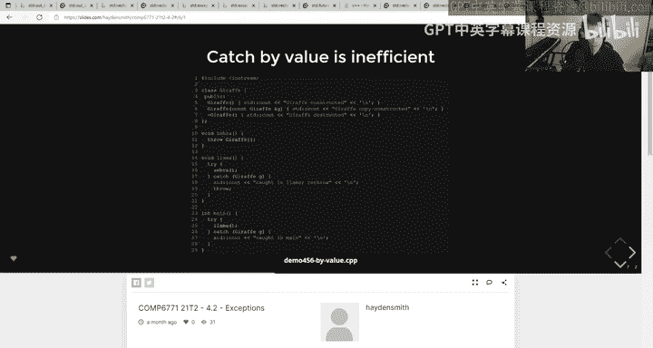