# 高级C++编程：5.1：资源管理 🧠

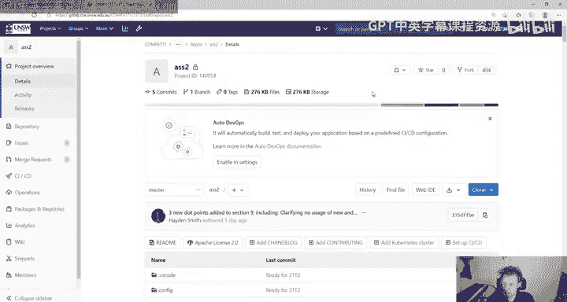

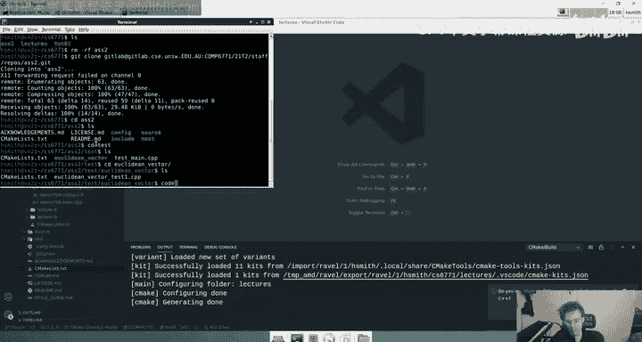

在本节课中，我们将要学习C++中的资源管理，特别是堆内存的管理。我们将探讨如何创建和销毁对象，理解拷贝与移动语义，并学习“三五法则”来确保资源被正确管理。

---

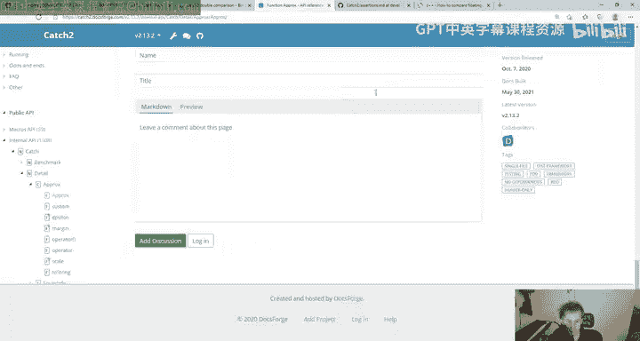

## 对象与内存区域

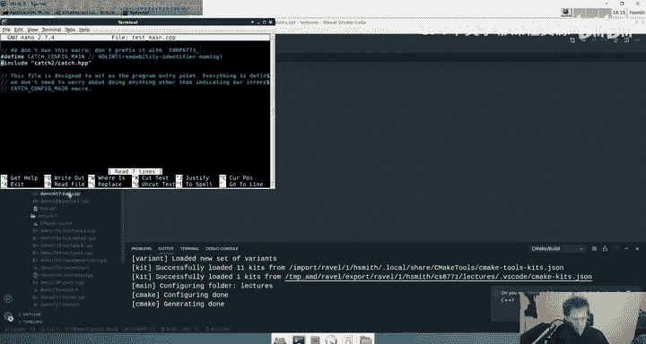

在C++中，对象是与特定类型相关联的一块内存区域。与Java等语言不同，C++将`int`、`bool`等基本类型也视为对象。对象可以被创建、销毁、拷贝或移动。

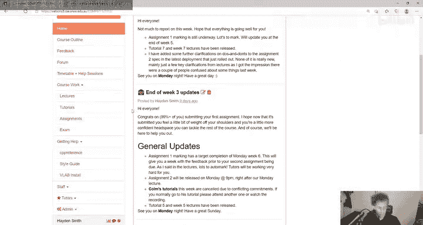

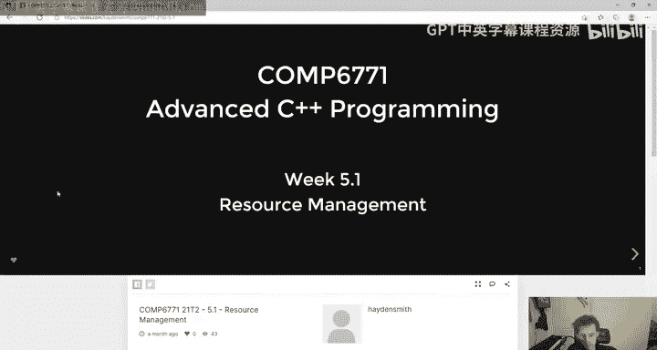

### 栈内存与堆内存

到目前为止，我们主要使用栈内存。栈资源（如局部变量）在其作用域结束时会被自动销毁。然而，栈内存大小有限，且对象的生命周期受限于其作用域。

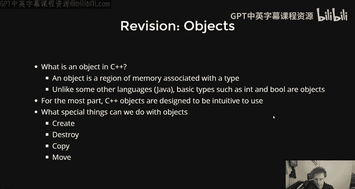

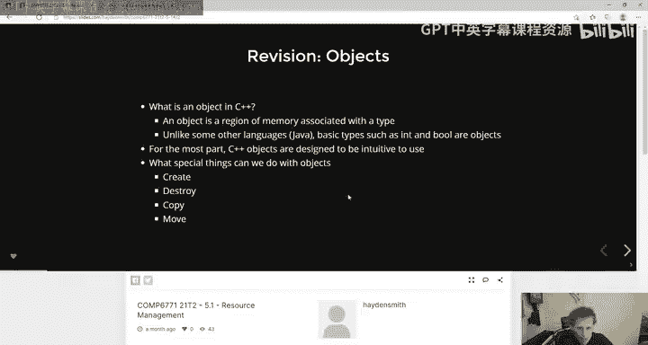

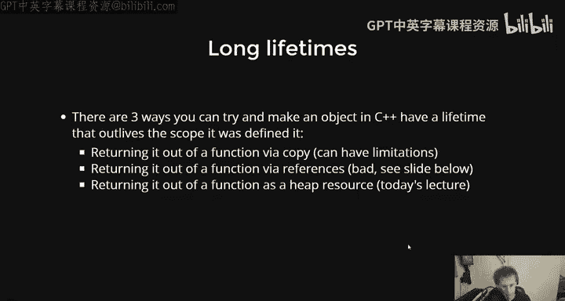

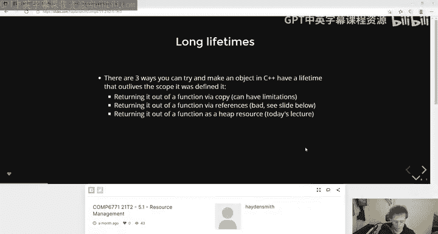

为了创建生命周期更长或大小动态变化的对象，我们需要使用堆内存。堆内存由程序员显式管理，使用`new`和`delete`关键字（类似于C中的`malloc`和`free`）。

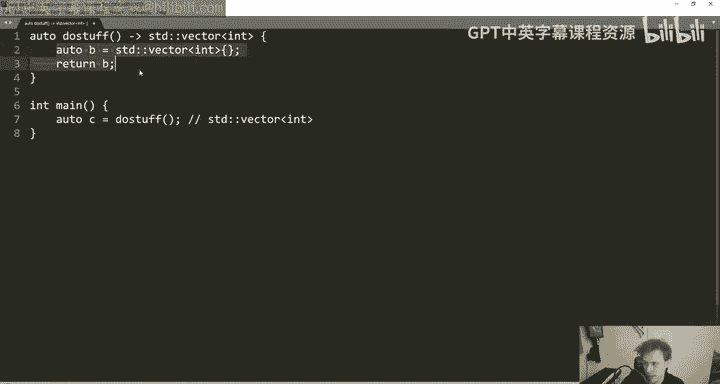

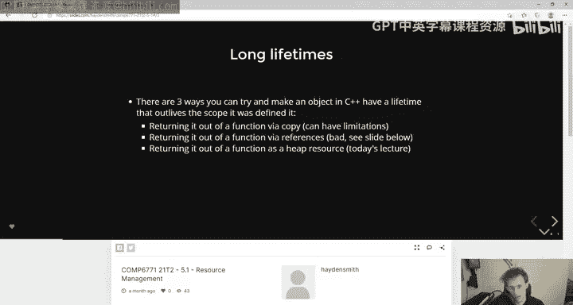

**示例：创建堆对象**
```cpp
int* a = new int(4); // 在堆上创建一个未命名的int对象，值为4
std::cout << *a << std::endl; // 输出 4
delete a; // 必须显式释放内存
```

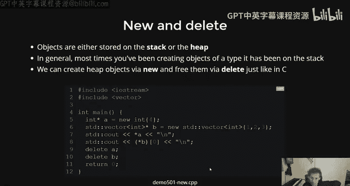

在上面的例子中：
*   `a`是一个**命名资源**（栈上的指针变量）。
*   `new int(4)`创建了一个**未命名资源**（堆上的`int`对象）。
*   当`a`离开作用域时，指针`a`本身（栈资源）会被销毁，但它指向的堆内存不会被自动释放，必须使用`delete`。

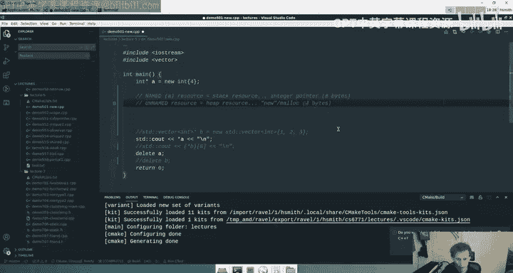

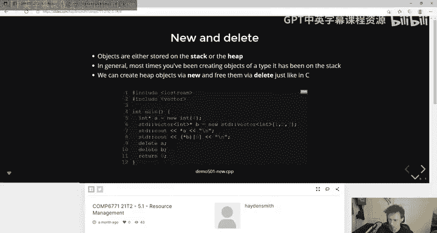

如果不使用`delete`，就会导致**内存泄漏**。

---

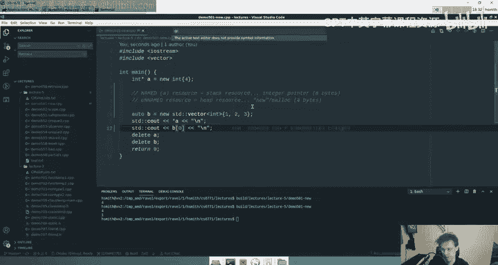

## 管理类中的堆资源

上一节我们介绍了基本的堆内存操作。本节中我们来看看当类自己管理堆资源（例如，实现一个简单的动态数组）时会发生什么。

考虑一个简化的`MyVec`类，它内部使用C风格数组在堆上存储数据：

```cpp
class MyVec {
private:
    int* data_;      // 指向堆上数组的指针
    std::size_t size_;
    std::size_t capacity_;
public:
    // 构造函数：分配堆内存
    MyVec(std::size_t size) : size_(size), capacity_(size) {
        data_ = new int[size];
    }
    // 析构函数：目前为空
    ~MyVec() {}
};
```

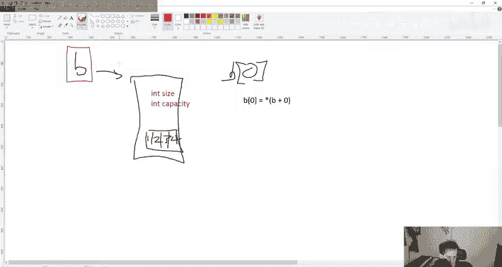

### 问题：默认析构函数不足

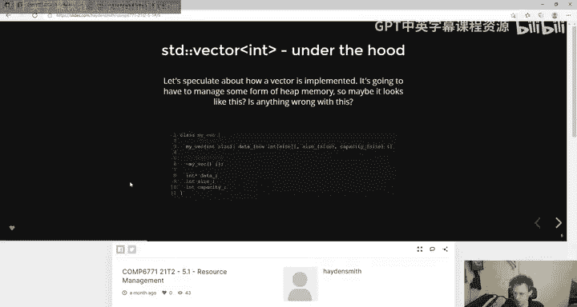

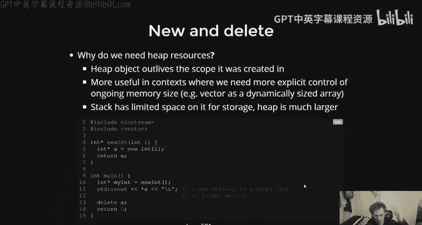


如果使用默认的析构函数，当`MyVec`对象离开作用域时，只会销毁`data_`、`size_`、`capacity_`这三个成员变量（它们都在栈上）。而`data_`指向的堆内存数组**不会被释放**，导致内存泄漏。

**解决方案**：我们需要在析构函数中显式释放堆内存。

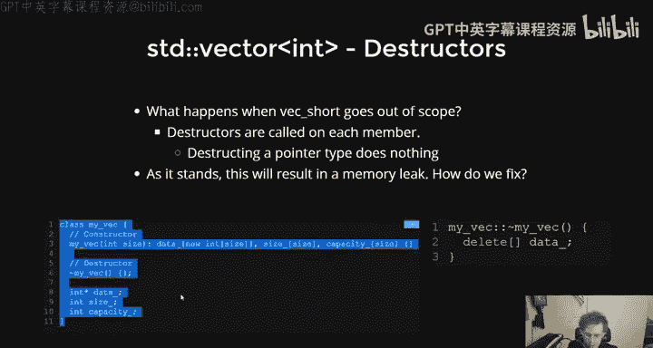

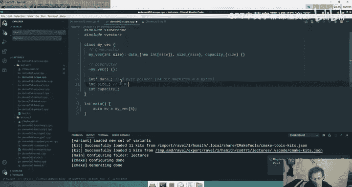

```cpp
~MyVec() {
    delete[] data_; // 释放整个数组
}
```

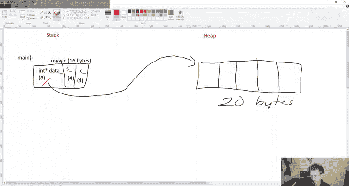

---

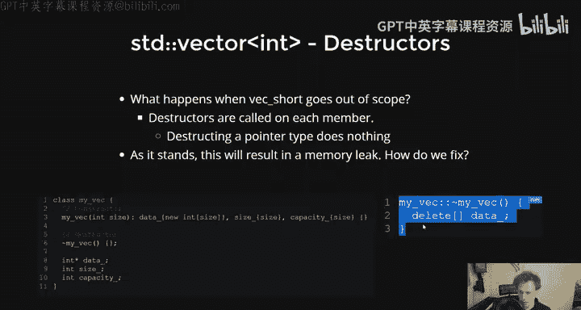

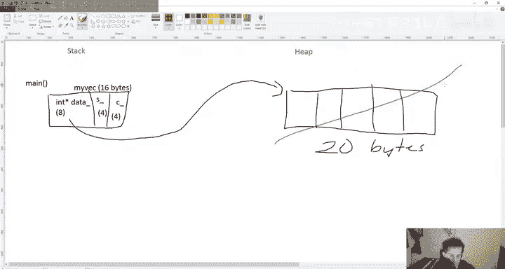

## 三五法则 (Rule of Five)

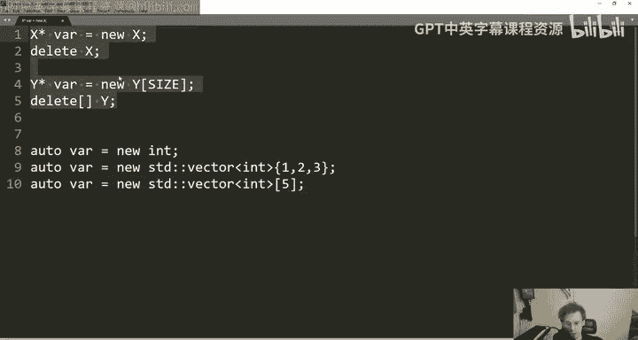

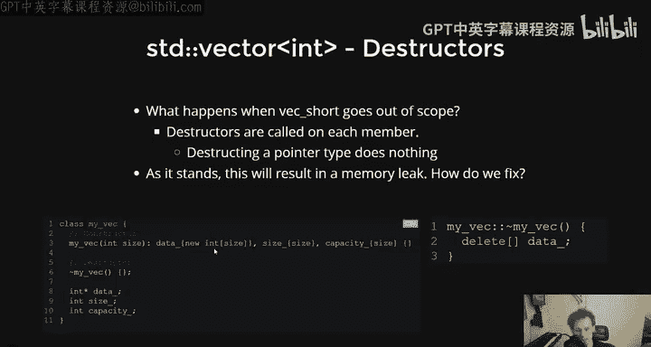

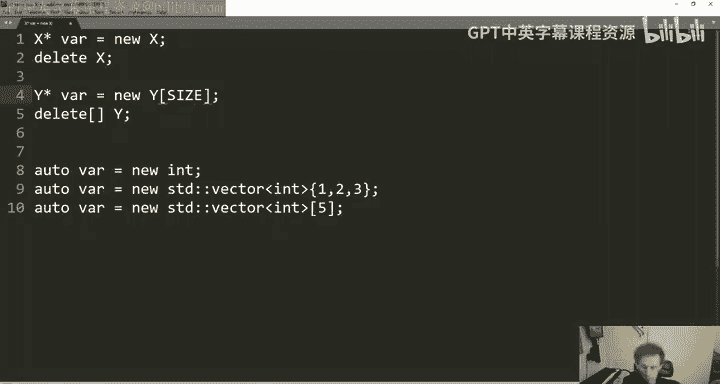

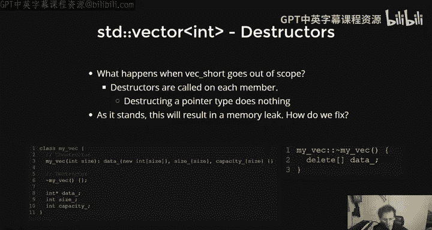

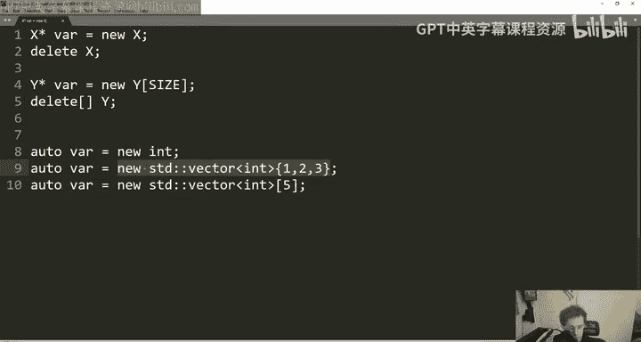

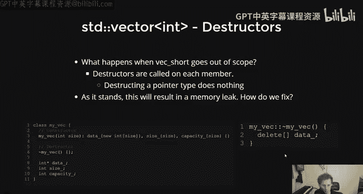

上一节我们解决了析构问题。然而，对于管理资源的类，仅仅处理析构是不够的。编译器会为类自动生成（合成）一些特殊的成员函数。如果我们自定义了其中任何一个，通常需要仔细考虑所有五个，这就是“三五法则”。

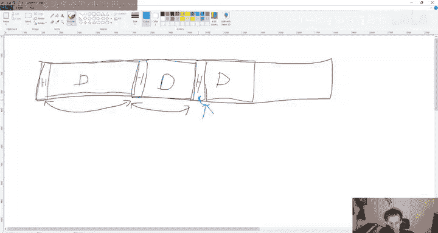

以下是需要关注的五个特殊成员函数：
1.  **析构函数 (Destructor)**
2.  **拷贝构造函数 (Copy Constructor)**
3.  **拷贝赋值运算符 (Copy Assignment Operator)**
4.  **移动构造函数 (Move Constructor)**
5.  **移动赋值运算符 (Move Assignment Operator)**

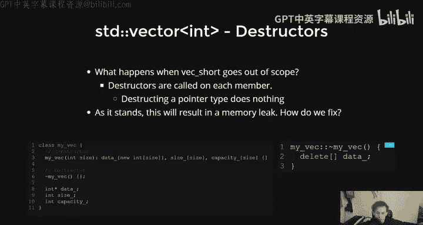

### 1. 拷贝语义的问题

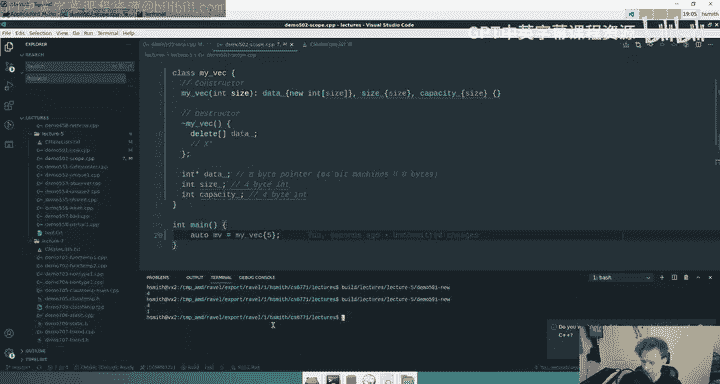

编译器合成的拷贝构造函数会进行“浅拷贝”——它只是简单地复制每个成员变量的值。对于指针`data_`，这意味着新旧两个`MyVec`对象的`data_`会指向**同一块堆内存**。

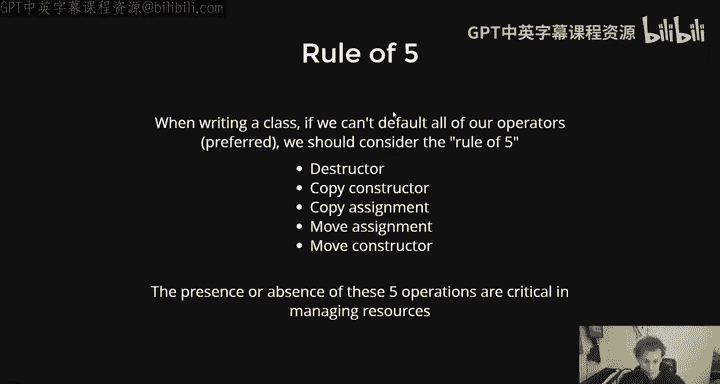

这会导致两个严重问题：
*   **双重释放**：当两个对象都被销毁时，它们的析构函数会对同一块内存调用`delete[]`，引发未定义行为（通常是程序崩溃）。
*   **意外修改**：通过一个对象修改数组内容，会影响到另一个对象。

**解决方案**：自定义拷贝构造函数，进行“深拷贝”。

```cpp
// 拷贝构造函数
MyVec(const MyVec& other) : size_(other.size_), capacity_(other.capacity_) {
    data_ = new int[other.size_]; // 1. 分配新的堆内存
    // 2. 复制数据
    std::copy(other.data_, other.data_ + other.size_, data_);
}
```

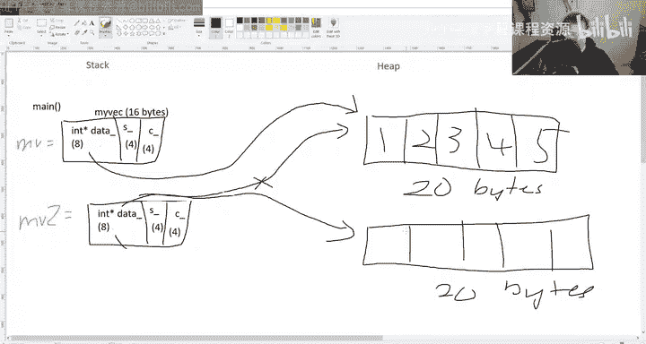

拷贝赋值运算符也需要类似的深拷贝逻辑。一种常见的实现是“拷贝并交换”惯用法：

```cpp
// 拷贝赋值运算符
MyVec& operator=(const MyVec& other) {
    MyVec temp(other); // 利用拷贝构造函数创建临时副本
    swap(*this, temp); // 交换当前对象和副本的内容
    return *this;      // 临时对象离开作用域，自动清理旧资源
}
```

---


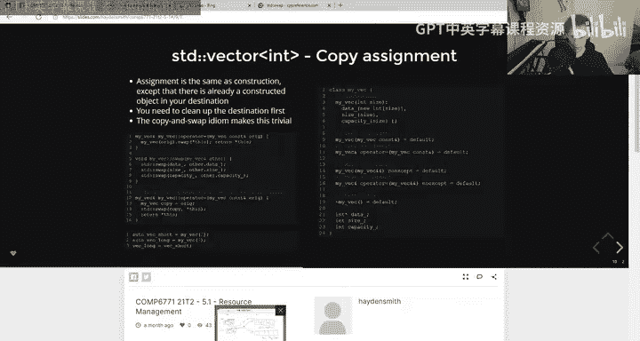

## 左值、右值与移动语义

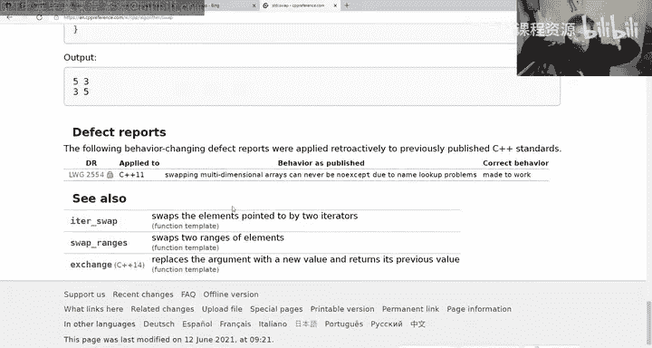

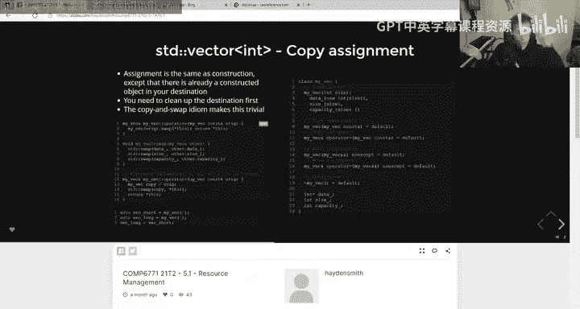

上一节我们处理了拷贝的问题。但有时我们不需要拷贝，而是想“转移”资源的所有权，这时就需要移动语义。要理解移动，首先需要了解左值(Lvalue)和右值(Rvalue)。

### 左值 vs. 右值

*   **左值 (Lvalue)**：指代一个具有存储空间（地址）的持久对象。通常是有名字的变量。例如：`int x = 5;`中的`x`。
*   **右值 (Rvalue)**：指代一个临时的、没有持久存储空间的表达式。通常是字面量、临时对象或表达式结果。例如：`5`、`x + 1`。

简单区分：**能取地址的是左值，不能取地址的是右值**。

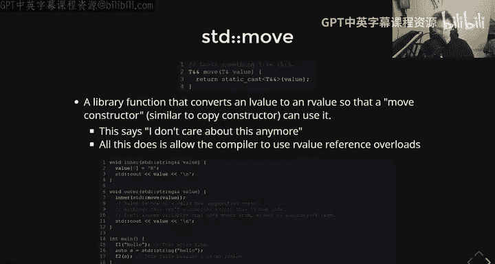

### 移动语义与 `std::move`

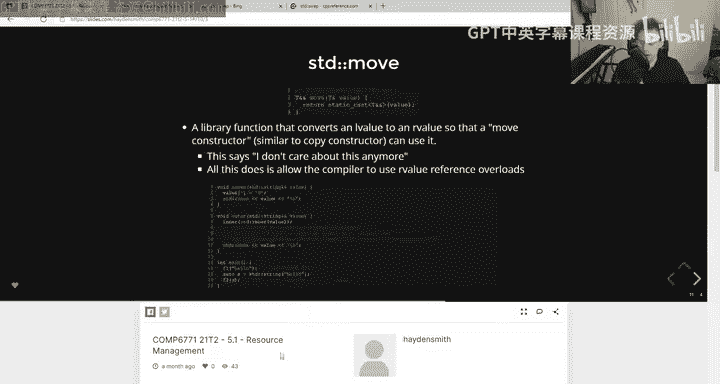

移动语义允许我们将资源（如堆内存）从一个对象“转移”到另一个对象，避免昂贵的深拷贝。它对于像`std::vector`这样持有大量数据的对象尤其高效。

移动构造函数和移动赋值运算符的参数类型是**右值引用** (`T&&`)。

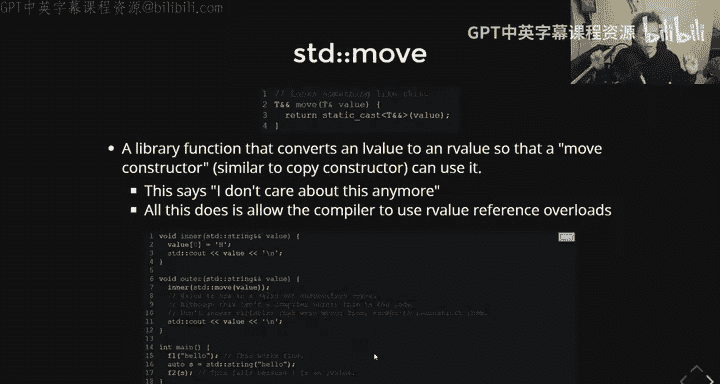

**示例：移动构造函数**
```cpp
// 移动构造函数
MyVec(MyVec&& other) noexcept
    : data_(std::exchange(other.data_, nullptr)) // 接管资源，并将原指针置空
    , size_(std::exchange(other.size_, 0))
    , capacity_(std::exchange(other.capacity_, 0)) {}
```

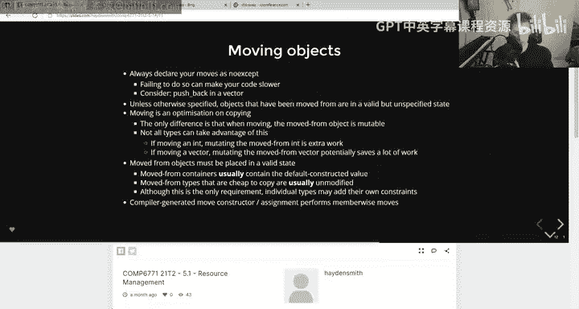

`std::exchange(a, b)`将`b`的值赋给`a`，并返回`a`的旧值。这完美地实现了所有权的转移。

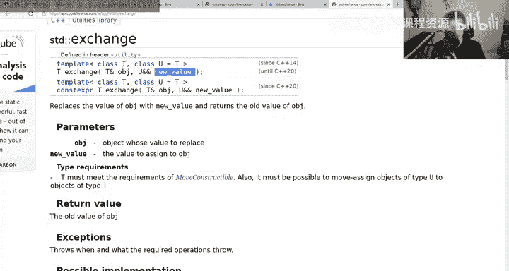

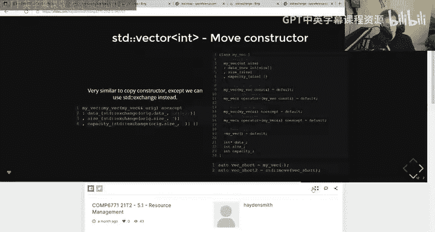

**如何触发移动？**
我们不能直接“移动”一个左值。`std::move()`的作用就是将左值**转换**为右值引用，从而允许调用移动构造函数或移动赋值运算符。

```cpp
MyVec v1(10);
MyVec v2 = std::move(v1); // 调用移动构造函数，v1的资源被转移到v2
```
移动后，源对象`v1`处于**有效但未指定状态**。它仍然是一个合法对象（不会崩溃），但其内容是不确定的，不应再被使用。通常其内部指针会被置为`nullptr`。

移动赋值运算符的实现与移动构造函数类似，但需要处理自赋值并释放当前对象持有的旧资源。

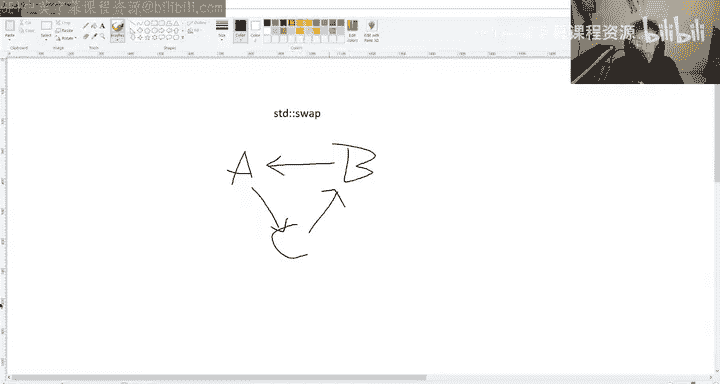

---

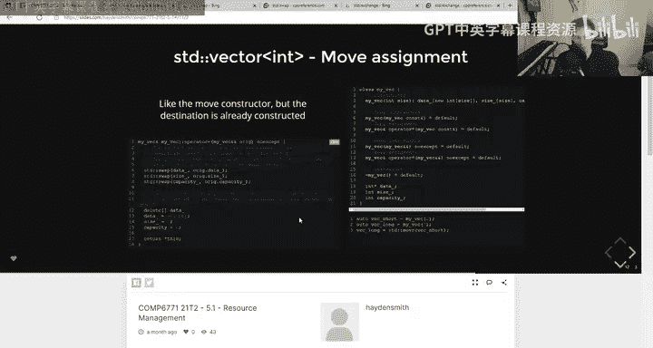

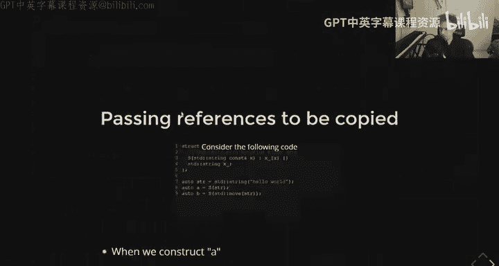

## RAII：资源获取即初始化

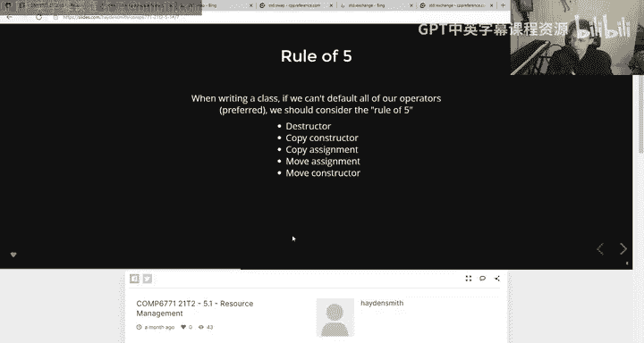

最后，我们来总结一个核心的C++最佳实践：RAII。


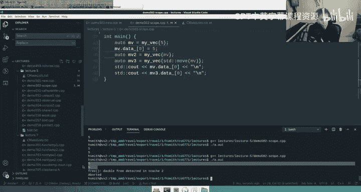

RAII（Resource Acquisition Is Initialization）是一种编程惯用法，其核心思想是：
*   **将资源的生命周期与对象的生命周期绑定**。
*   **在构造函数中获取资源**（如分配内存、打开文件）。
*   **在析构函数中释放资源**（如释放内存、关闭文件）。

我们之前实现的`MyVec`类，以及标准库中的`std::vector`、`std::fstream`都是RAII的典型例子。通过将堆内存封装在栈对象内部，我们利用了栈对象自动析构的特性，从而自动、安全地管理了资源，避免了内存泄漏。

---


本节课中我们一起学习了C++资源管理的基础。我们区分了栈内存和堆内存，理解了使用`new`/`delete`进行手动管理的必要性及其风险。我们深入探讨了“三五法则”，学习了当类管理堆资源时，为何以及如何自定义拷贝构造函数、移动构造函数、赋值运算符和析构函数。最后，我们介绍了RAII这一关键设计模式，它是编写安全、无泄漏C++代码的基石。在接下来的课程中，我们将看到如何用“智能指针”这一工具来简化资源管理。