# 高级C++编程：7.2：自定义迭代器 🧑‍💻


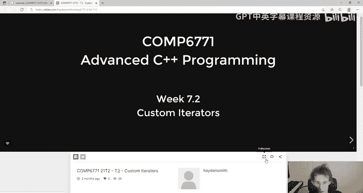

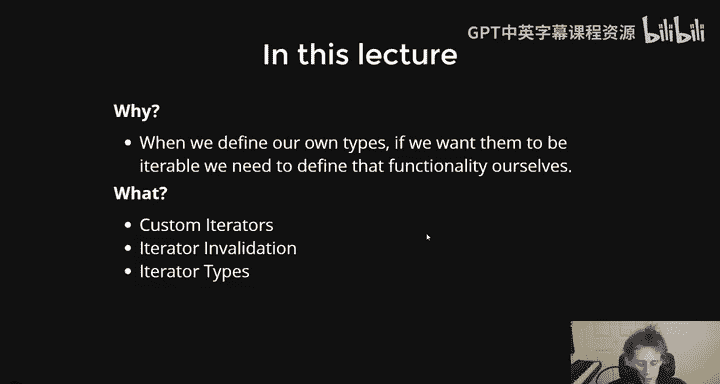

## 概述
在本节课中，我们将要学习如何为自定义容器类型创建自定义迭代器。我们将探讨迭代器的基本概念、迭代器失效问题，并通过一个具体的代码示例来理解如何实现一个功能完整的迭代器。

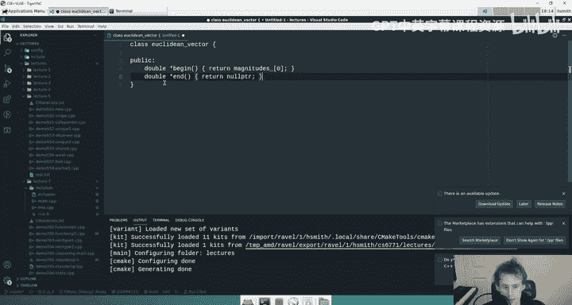

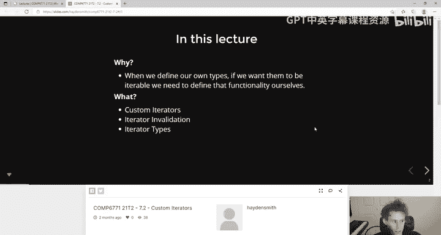

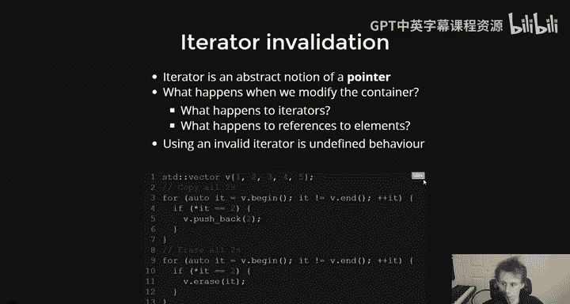

---

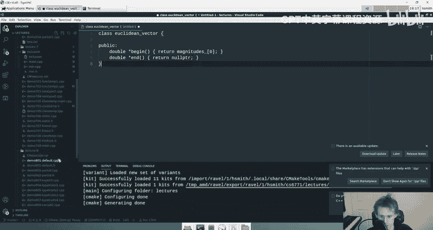


## 迭代器回顾与迭代器失效

上一节我们介绍了迭代器的基本概念，本节中我们来看看迭代器失效这个重要问题。

迭代器是C++中连接容器和算法的桥梁。它是一个抽象概念，类似于指针，用于线性地访问容器中的元素。然而，当我们在迭代过程中修改容器时，迭代器可能会失效，导致未定义行为。

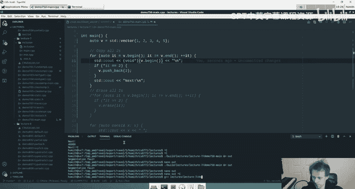

### 迭代器失效示例
以下是一个迭代器失效的典型例子。在遍历`std::vector`时向其中添加元素，可能会导致程序崩溃或进入无限循环。

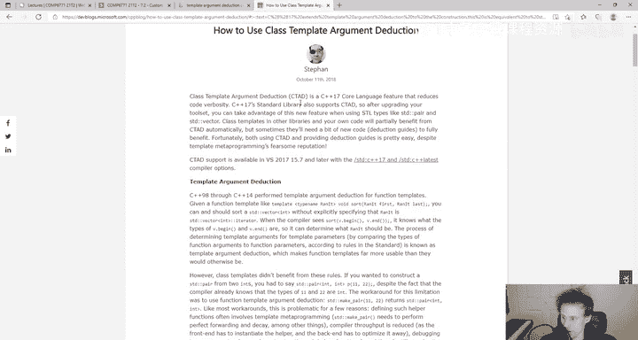

```cpp
std::vector<int> v = {1, 2, 3, 4, 5};
for (auto it = v.begin(); it != v.end(); ++it) {
    if (*it == 2) {
        v.push_back(2); // 修改容器，可能导致迭代器失效
    }
}
```

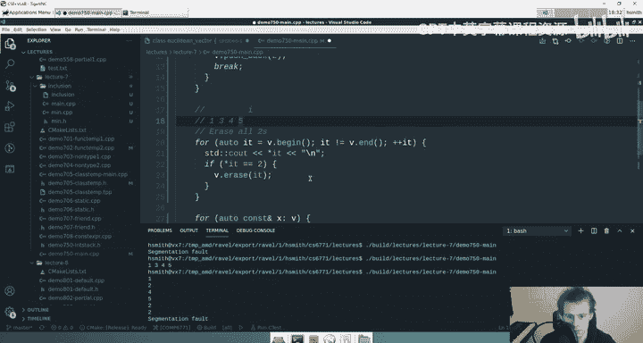

**核心原因**：当`push_back`导致容器重新分配内存（容量改变）时，所有现有的迭代器、指针和引用都会失效。即使没有重新分配，`end()`迭代器也会失效。

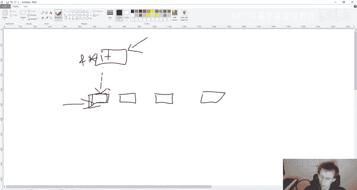

### 不同操作的失效规则
以下是`std::vector`部分操作的迭代器失效规则：

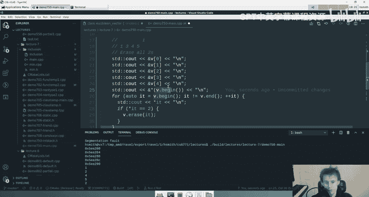

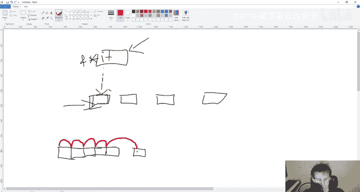

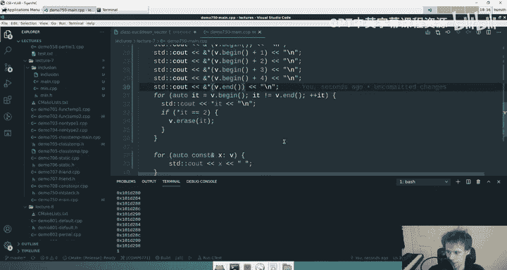

*   **`push_back`**：如果操作后`size() > capacity()`（即发生重分配），则**所有**迭代器失效。否则，仅**`end()`**迭代器失效。
*   **`erase`**：**被删除元素及其之后所有元素**的迭代器失效（包括`end()`）。

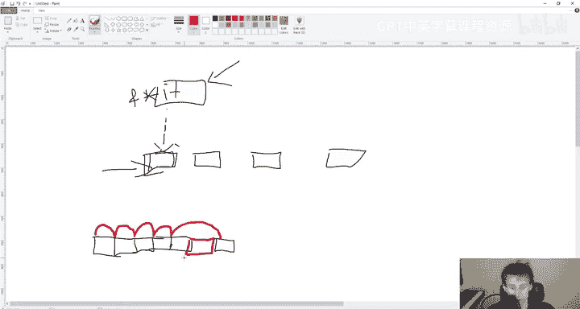

**重要原则**：在修改容器结构（增删元素）后，应假设所有现有的迭代器都可能失效，最安全的做法是停止使用它们或重新获取。

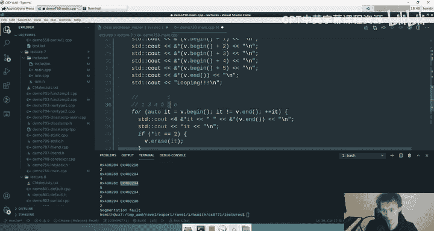

---

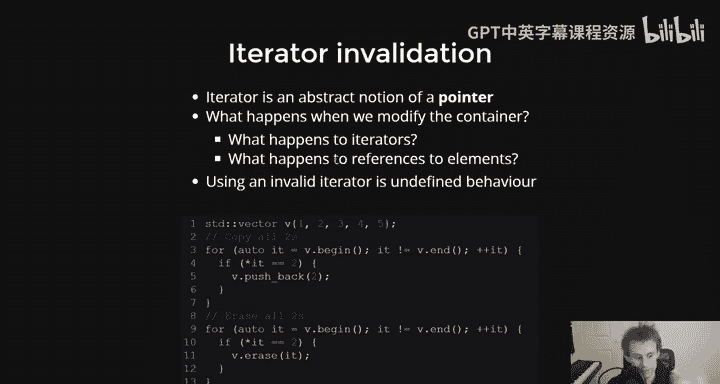

## 实现自定义迭代器

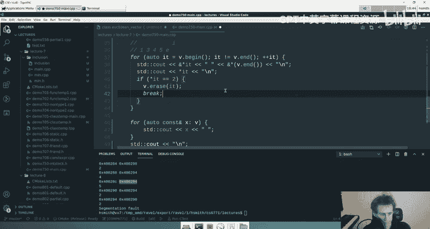

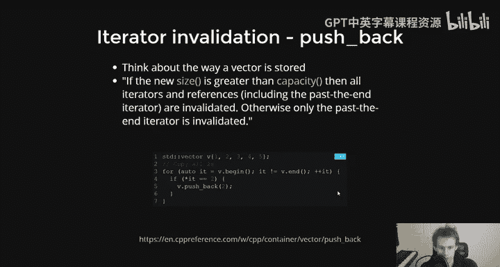

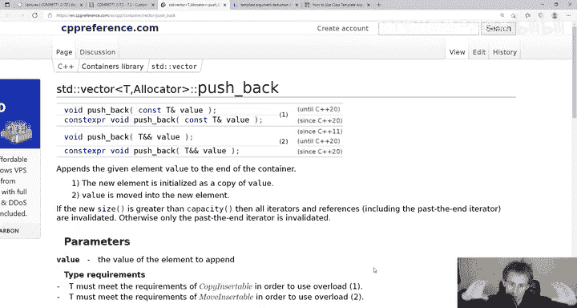

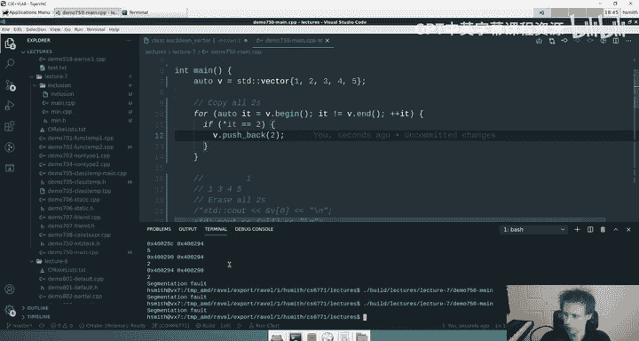

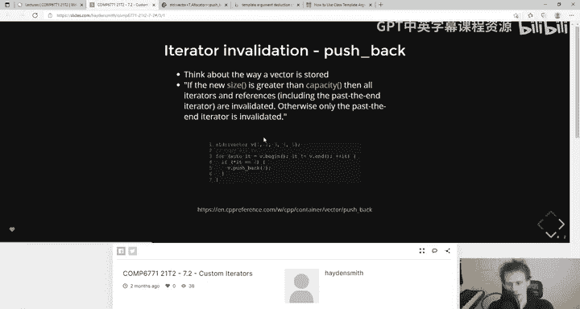

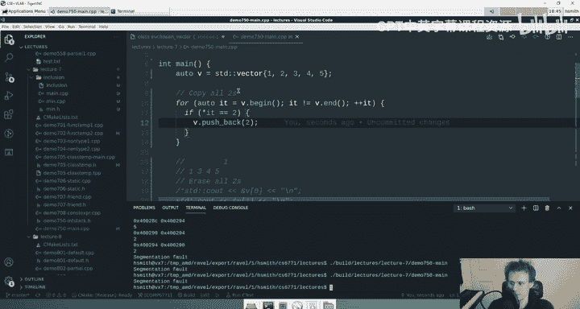

理解了迭代器的基本规则后，本节我们来看看如何为一个自定义容器实现迭代器。

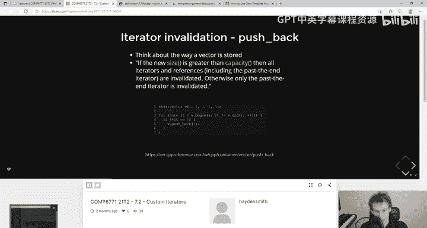

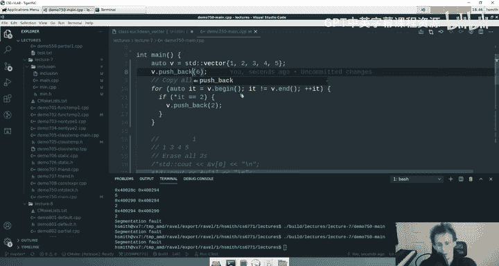

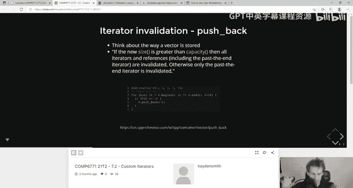

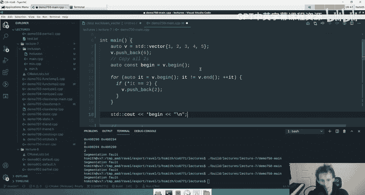

我们将以一个简单的整数栈`IntStack`为例，它使用单向链表实现。我们的目标是让`IntStack`支持`begin()`、`end()`方法以及基于范围的for循环。

### 容器结构定义
首先，我们定义容器本身及其内部节点。

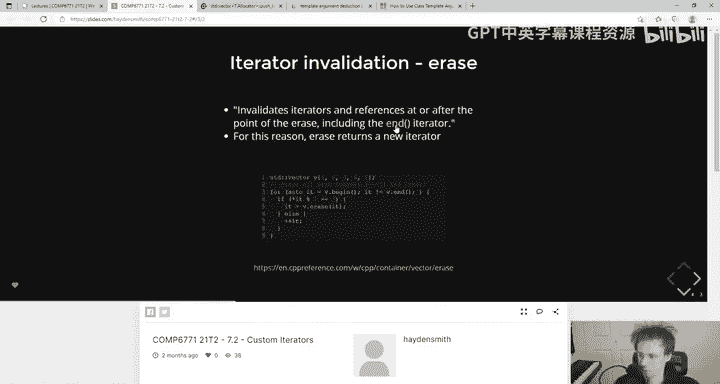

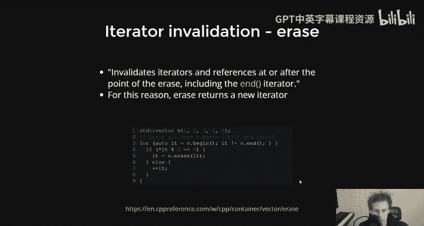

```cpp
class IntStack {
private:
    struct Node {
        int value;
        std::unique_ptr<Node> next;
        Node(int v, std::unique_ptr<Node> n) : value(v), next(std::move(n)) {}
    };
    std::unique_ptr<Node> head_;
public:
    // 栈的基本操作：push, pop, top 等
    void push(int value) {
        head_ = std::make_unique<Node>(value, std::move(head_));
    }
    // ... 其他成员函数
};
```

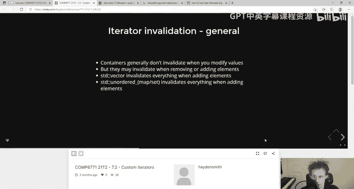

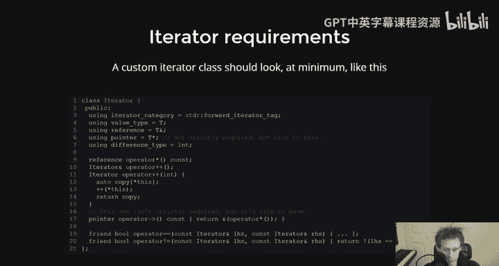

### 定义迭代器类
迭代器通常作为容器的一个嵌套类（`public`或`private`）来实现。它需要提供一组特定的操作符重载和类型定义。

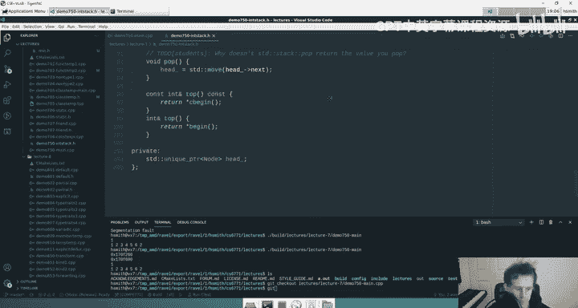

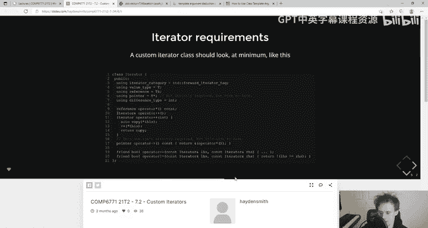

以下是`IntStack::iterator`的核心实现：

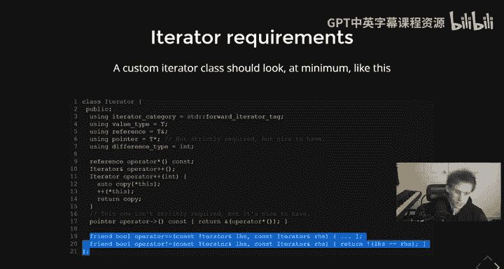

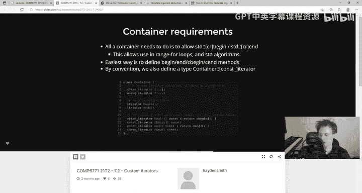

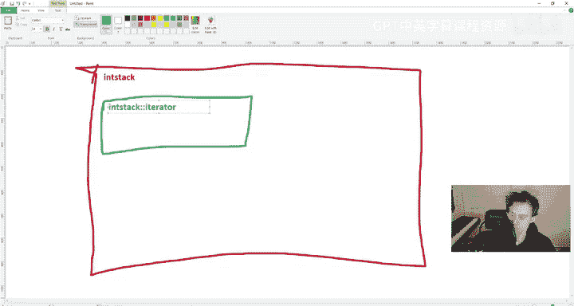

```cpp
class IntStack {
public:
    class iterator; // 前向声明
    using const_iterator = iterator; // 简化示例，实际const迭代器可能不同

    class iterator {
    private:
        Node* current_;
        // 构造函数设为私有，只允许IntStack创建迭代器
        explicit iterator(Node* n) : current_(n) {}
        friend class IntStack; // 声明友元

    public:
        // 1. 必需的迭代器类型定义 (Iterator Traits)
        using iterator_category = std::forward_iterator_tag;
        using value_type = int;
        using reference = int&;
        using pointer = int*;
        using difference_type = int;

        // 2. 核心操作符重载
        // 解引用，获取当前元素值
        reference operator*() const { return current_->value; }
        // 成员访问操作符
        pointer operator->() const { return &(current_->value); }

        // 前缀递增 (++it)
        iterator& operator++() {
            current_ = current_->next.get();
            return *this;
        }
        // 后缀递增 (it++)
        iterator operator++(int) {
            iterator old = *this;
            ++(*this);
            return old;
        }

        // 相等/不等比较
        friend bool operator==(const iterator& a, const iterator& b) {
            return a.current_ == b.current_;
        }
        friend bool operator!=(const iterator& a, const iterator& b) {
            return !(a == b);
        }
    };

    // 3. 容器提供获取迭代器的方法
    iterator begin() { return iterator(head_.get()); }
    iterator end() { return iterator(nullptr); } // 用nullptr表示末尾
    const_iterator begin() const { return iterator(head_.get()); }
    const_iterator end() const { return iterator(nullptr); }
    const_iterator cbegin() const { return begin(); }
    const_iterator cend() const { return end(); }
};
```

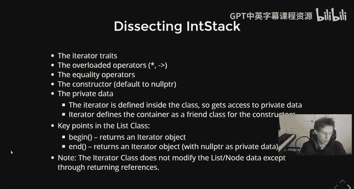

### 代码解析

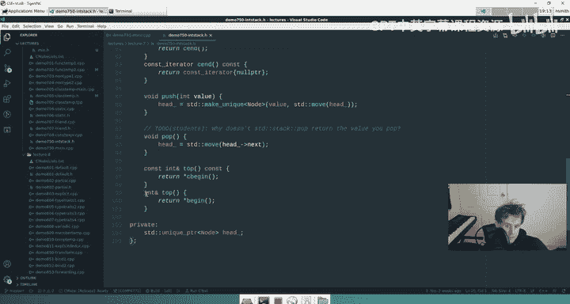

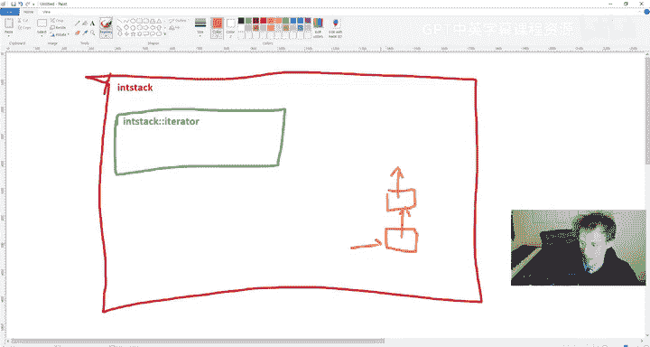

1.  **迭代器状态**：迭代器对象内部通常只保存一个指向容器内部元素的指针或引用（本例中是`Node* current_`）。
2.  **迭代器类别**：通过`iterator_category`等类型定义，告诉标准库算法这个迭代器的能力（如前向、双向、随机访问）。我们的链表迭代器是`forward_iterator_tag`。
3.  **必需的操作**：
    *   `operator*` 和 `operator->`：用于访问元素。
    *   `operator++`：用于移动到下一个元素。
    *   `operator==` 和 `operator!=`：用于比较迭代器（通常比较其内部指针）。
4.  **构造控制**：迭代器的构造函数通常是`private`的，并通过将容器类声明为`friend`，确保只有容器能创建有效的迭代器实例（通过`begin()`、`end()`）。
5.  **`end()`迭代器**：通常用一个特殊值（如`nullptr`）表示序列的“尾后”位置。

### 使用自定义迭代器
实现完成后，我们的`IntStack`就可以像标准库容器一样使用了：

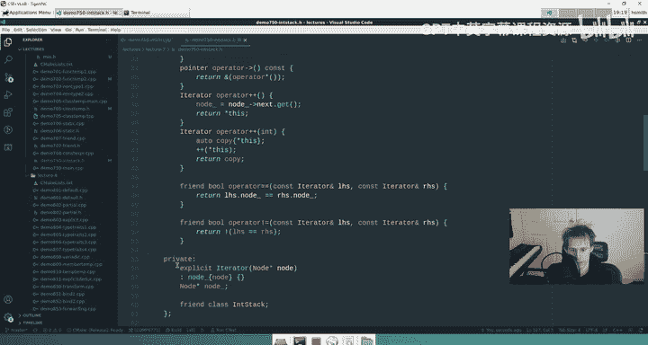

```cpp
IntStack s;
s.push(5);
s.push(4);
s.push(3);
s.push(2);
s.push(1);

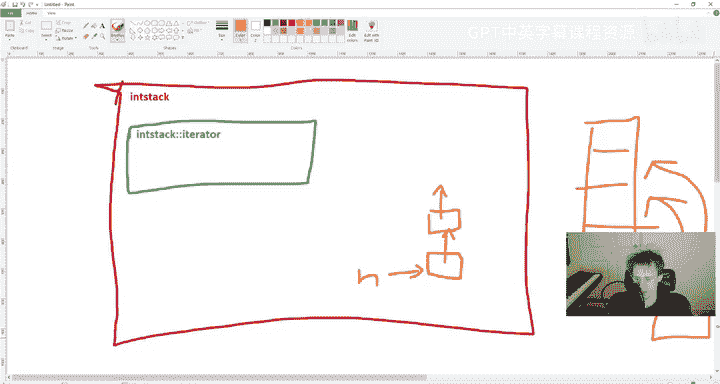

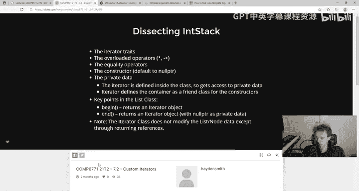

// 使用迭代器遍历
for (auto it = s.begin(); it != s.end(); ++it) {
    std::cout << *it << ' ';
}
// 输出: 1 2 3 4 5

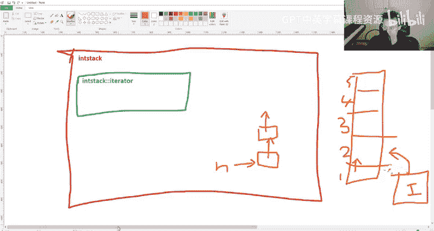

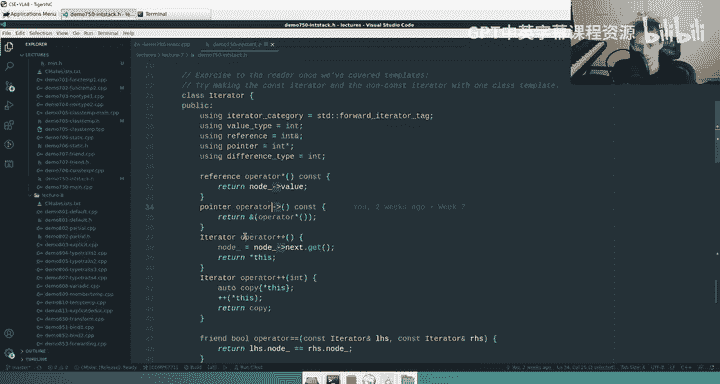

// 使用基于范围的for循环
for (int val : s) {
    std::cout << val << ' ';
}
// 输出: 1 2 3 4 5
```

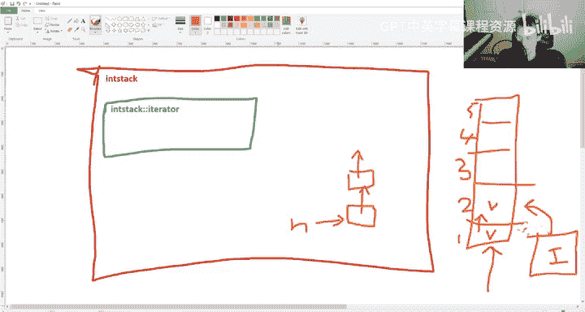


---

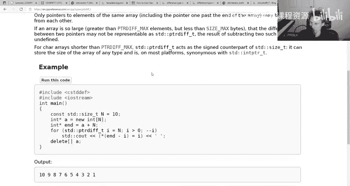

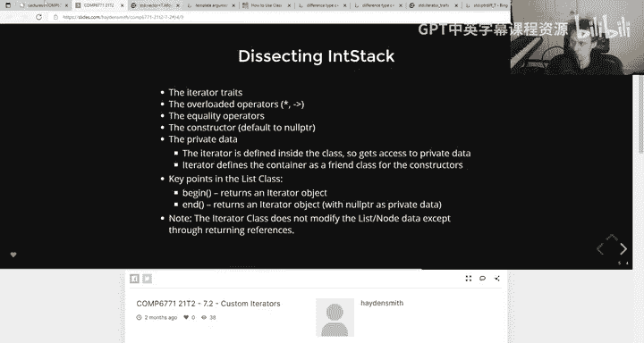

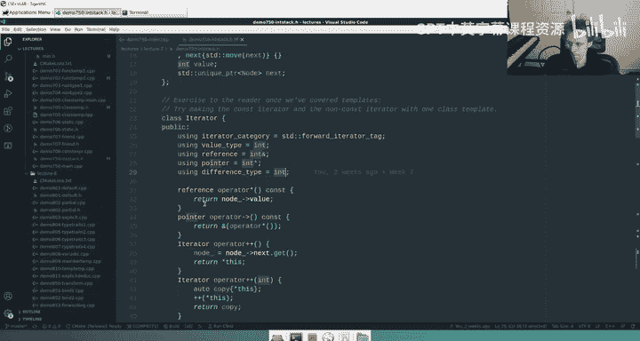

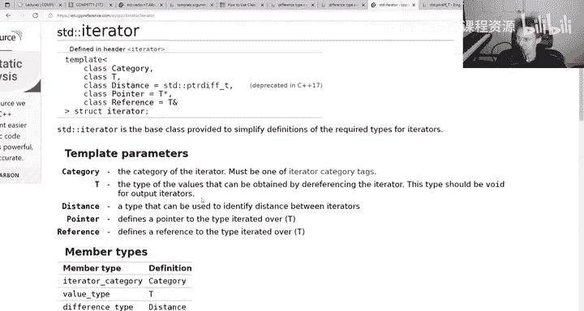

## 迭代器类别与能力

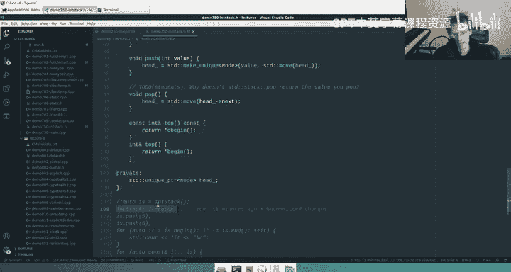

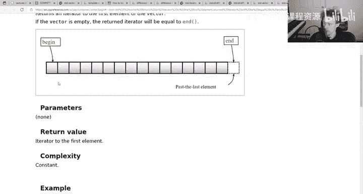

不同的迭代器提供不同的移动和访问能力，标准库算法会根据迭代器类别选择最高效的实现。

以下是主要的迭代器类别及其所需支持的操作：

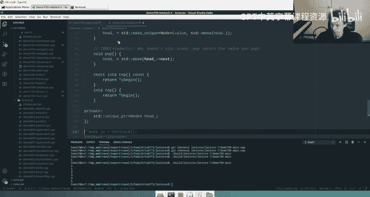

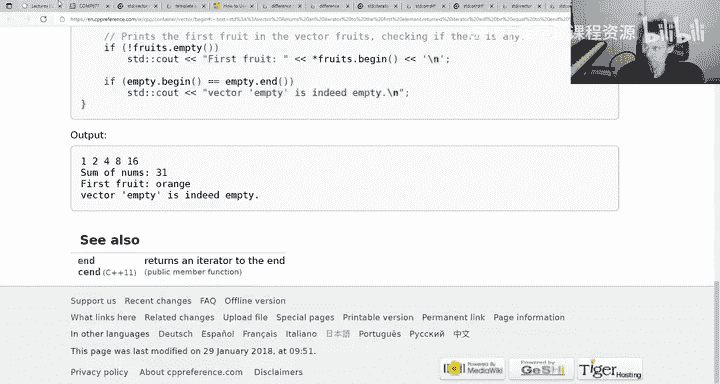

*   **输入迭代器**：只读，且只能单次遍历。需要：`==`, `!=`, `++`, `*`, `->`。
*   **输出迭代器**：只写，且只能单次遍历。需要：`++`, `*`（仅用于赋值）。
*   **前向迭代器**：可读写，可多次遍历。需要：包含输入/输出迭代器的所有操作。
*   **双向迭代器**：在前向迭代器基础上，增加反向移动能力。需要：额外支持 `--` 和 `--(int)`。
*   **随机访问迭代器**：提供像指针一样的随机访问能力。需要：额外支持 `+`, `-`, `+=`, `-=`, `<`, `>`, `<=`, `>=`, `[]`。

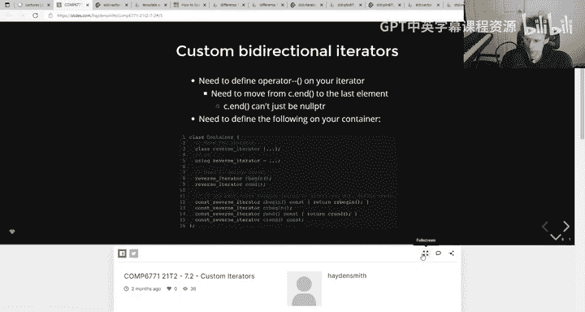

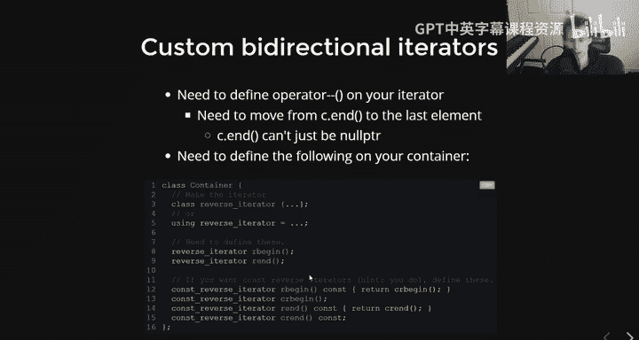

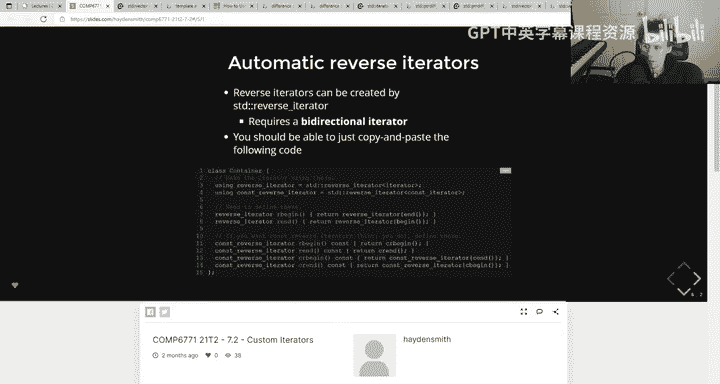


我们的`IntStack::iterator`是一个**前向迭代器**。如果要升级为**双向迭代器**，需要修改数据结构为双向链表，并为迭代器添加递减操作符。

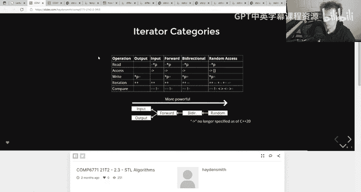

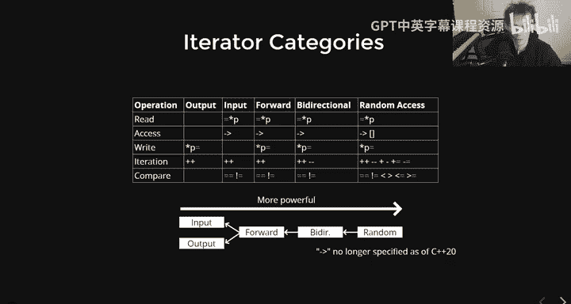

---

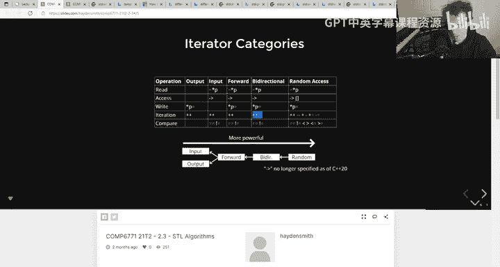

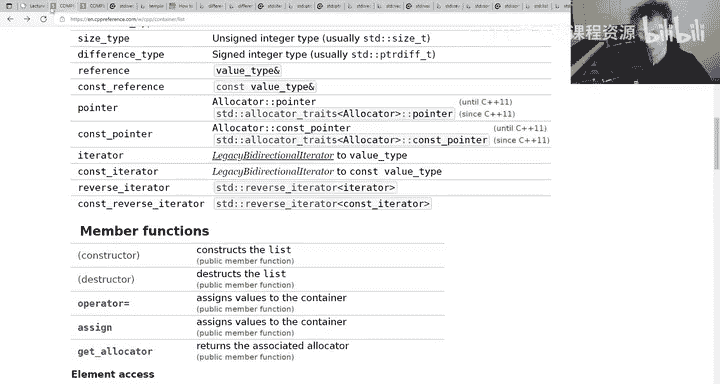

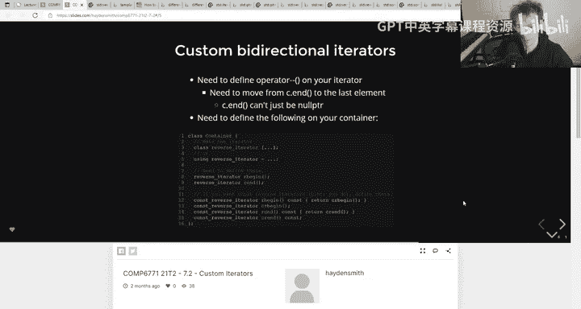

## 总结

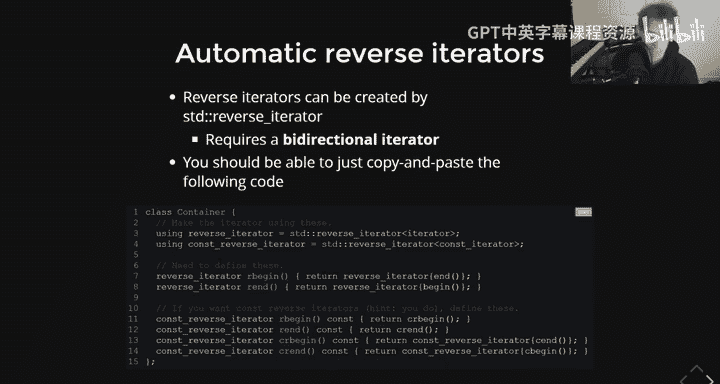

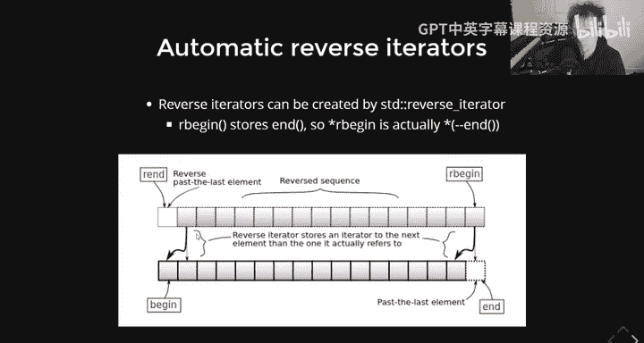

本节课中我们一起学习了C++自定义迭代器的核心知识。

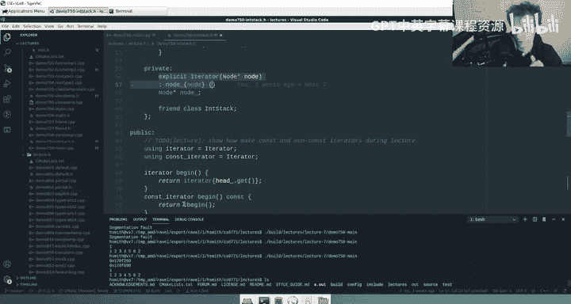


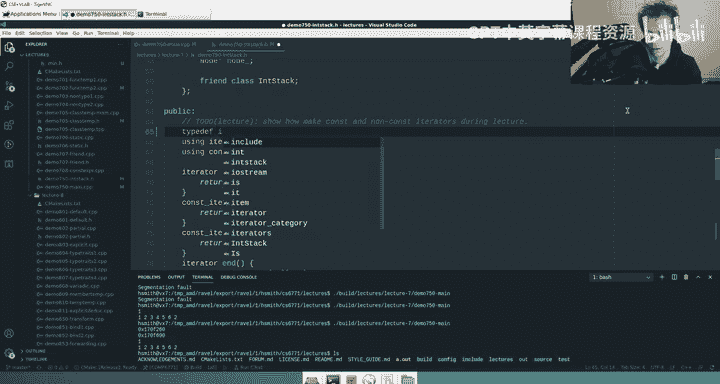

我们首先回顾了迭代器失效的概念，明白了在修改容器结构时使用迭代器的危险性。接着，我们深入探讨了如何为一个自定义的链表栈容器实现迭代器，包括定义迭代器嵌套类、实现必需的操作符重载（解引用、递增、比较）、声明迭代器类别特征，以及让容器提供`begin()`和`end()`方法。


实现自定义迭代器的关键点在于：
1.  迭代器是一个独立的类，封装了对容器内部元素的访问逻辑。
2.  必须提供一组标准的操作符重载和类型定义（Iterator Traits）。
3.  通过控制构造函数和友元关系，管理迭代器的创建权限。
4.  迭代器的能力（类别）决定了它能与哪些标准库算法兼容。


掌握自定义迭代器是理解C++标准库设计哲学和编写泛型代码的重要一步。