# 高级C++编程：8.1：高级模板 🧩

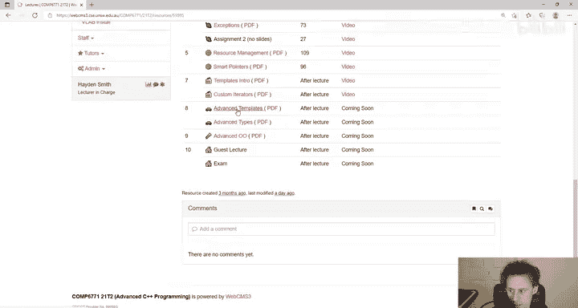

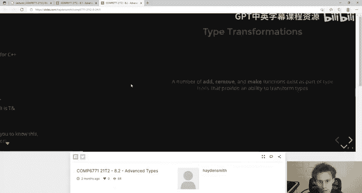

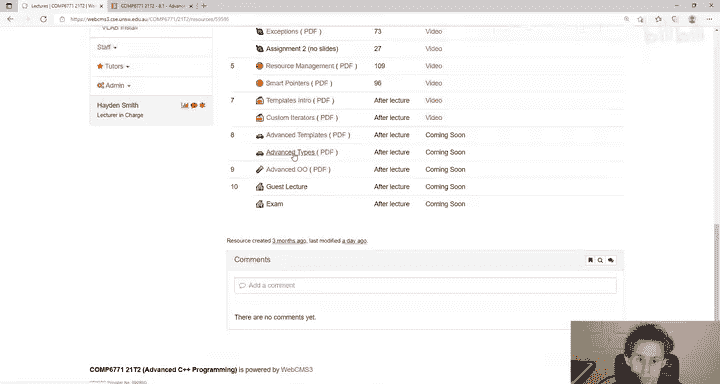

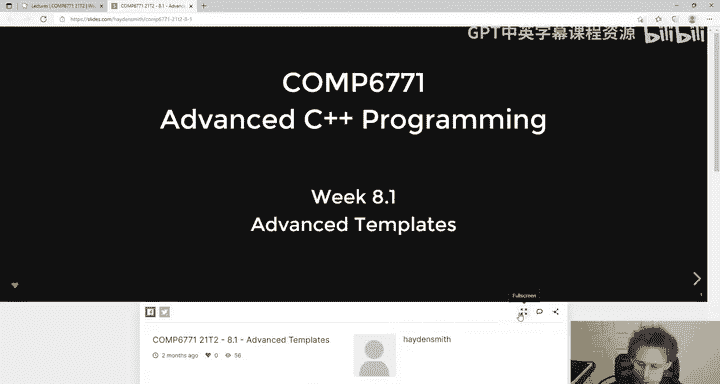

## 概述
在本节课中，我们将深入学习C++模板的高级特性。我们将从模板的基础知识出发，探索如何通过默认模板参数、特化、可变参数模板等技术，更灵活、更强大地使用模板进行泛型编程。

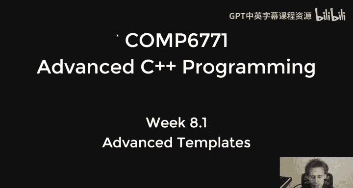

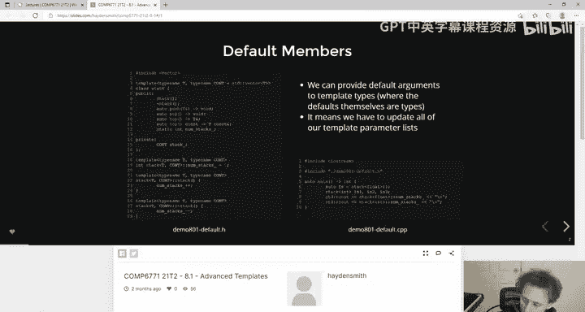

---

## 默认模板参数

上一节我们介绍了模板的基础知识，本节中我们来看看如何为模板参数设置默认值，这类似于为函数参数设置默认值。

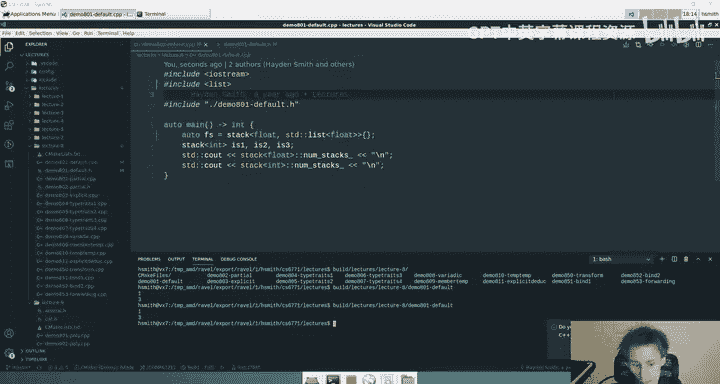

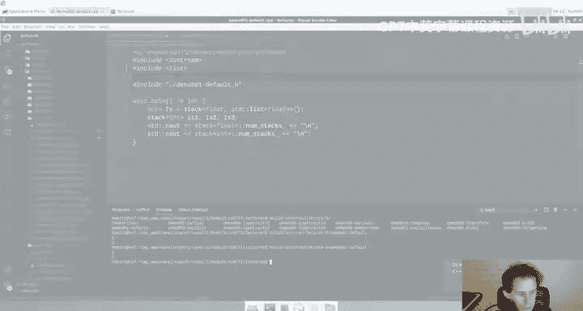

### 核心概念
在类模板中，可以为模板参数指定默认类型。语法如下：
```cpp
template <typename T, typename Container = std::vector<T>>
class Stack {
    // ...
};
```
这里，`Container` 的默认类型是 `std::vector<T>`。如果用户创建 `Stack<int>`，编译器会将其视为 `Stack<int, std::vector<int>>`。

### 示例解析
考虑一个栈类，它使用一个容器来存储元素。我们可以让容器类型成为一个模板参数，并为其设置默认值。

```cpp
#include <vector>
#include <list>
#include <iostream>

template <typename T, typename Container = std::vector<T>>
class Stack {
private:
    Container elements;
public:
    void push(const T& item) {
        elements.push_back(item); // 假设容器有 push_back
    }
    // ... 其他成员函数
};

int main() {
    Stack<int> s1; // 使用默认容器 std::vector<int>
    Stack<float, std::list<float>> s2; // 显式指定容器为 std::list<float>
    return 0;
}
```

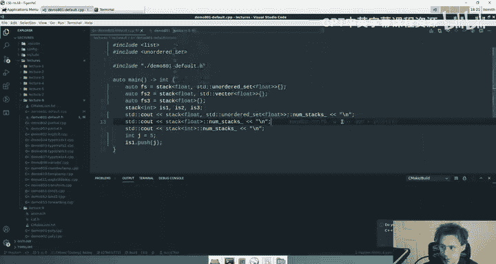

### 重要说明
*   模板的“有效性”是**惰性实例化**的。编译器只会在实际使用某个成员函数时，才检查其对于给定的模板参数是否有效。
*   例如，如果你为 `Stack` 指定了一个没有 `push_back` 方法的容器类型，但只要你不调用 `push` 函数，代码依然可以编译。只有在调用 `push` 时，编译器才会尝试实例化该函数并报错。

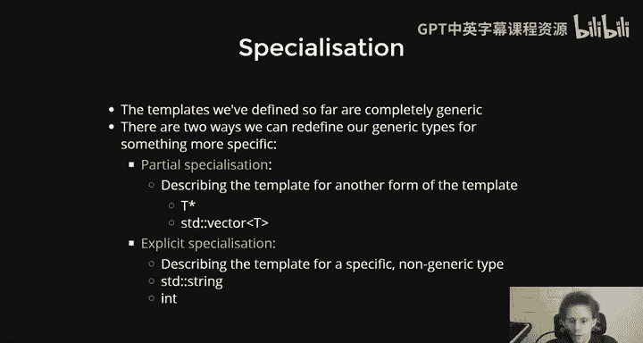

---

## 模板特化

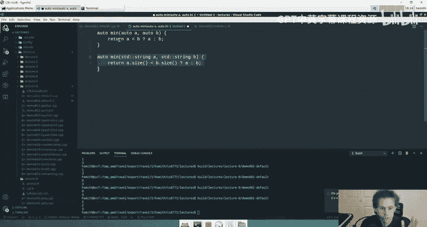

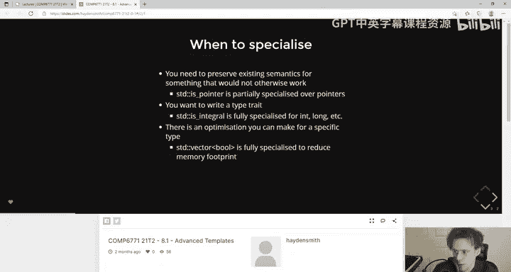

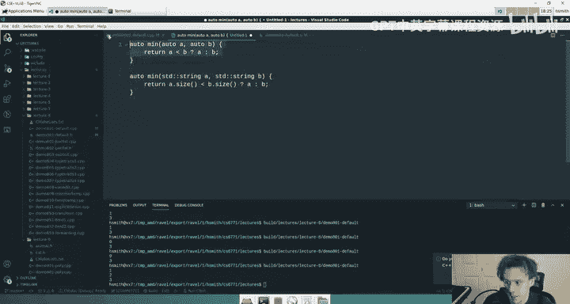

模板特化允许我们为特定的类型或类型模式提供定制化的实现，同时保持接口的一致性。其核心目的是**保持语义**，而不是改变含义。

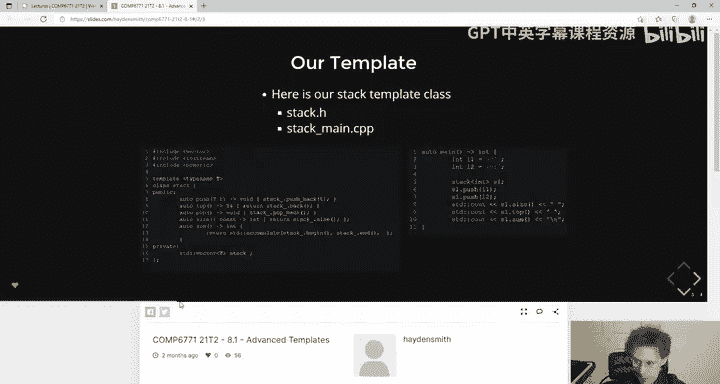

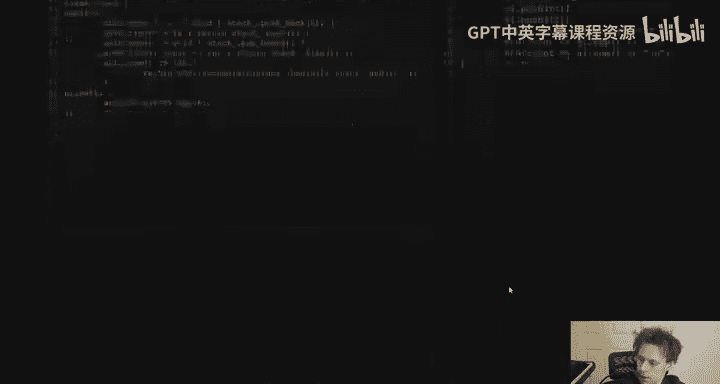


### 部分特化
部分特化是指为模板参数的一个子集（而非全部具体类型）提供特殊实现。最常见的例子是为指针类型提供特化。

以下是部分特化的一个典型场景：

假设我们有一个通用的 `Stack` 模板，它有一个 `sum` 函数用于计算栈中所有元素的和。对于指针类型的栈，直接对指针求和没有意义，我们希望对指针所指向的值求和。

```cpp
// 主模板
template <typename T>
class Stack {
private:
    std::vector<T> elements;
public:
    // ... push, pop, top 等函数
    T sum() const {
        return std::accumulate(elements.begin(), elements.end(), T{});
    }
};

// 针对 T* 的部分特化
template <typename T>
class Stack<T*> {
private:
    std::vector<T*> elements;
public:
    // ... push, pop, top 等函数（实现可能与主模板相同）
    T sum() const {
        // 特化的 sum：对指针解引用后求和
        return std::accumulate(elements.begin(), elements.end(), T{},
                               [](T acc, T* ptr) { return acc + *ptr; });
    }
};
```

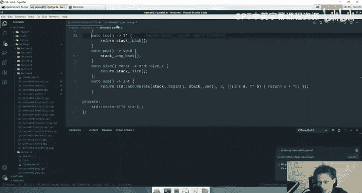

**关键点**：部分特化 `Stack<T*>` 仍然是一个模板，它适用于任何指针类型，而不仅仅是某个具体类型的指针。

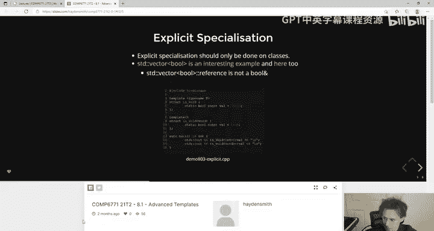

### 显式特化
显式特化是为模板参数指定一个完全具体的类型。此时，模板参数列表为空。

```cpp
// 主模板
template <typename T>
class Stack {
    // ... 通用实现
};

// 针对 std::string 的显式特化
template <>
class Stack<std::string> {
private:
    std::vector<std::string> elements;
public:
    // ... 可以为 std::string 提供特殊优化的实现
    // 例如，sum 函数对字符串可能没有意义，可以移除或改变其行为
    size_t total_length() const { // 提供一个新语义的函数
        return std::accumulate(elements.begin(), elements.end(), size_t{0},
                               [](size_t acc, const std::string& s) { return acc + s.size(); });
    }
};
```

### 何时使用特化？
*   **保持语义**：当通用模板对某种类型无法编译或行为不正确时，通过特化使其行为与其他类型一致。
*   **性能优化**：当对特定类型存在更高效的实现方式，且不改变其对外接口和语义时。例如，`std::vector<bool>` 进行了空间优化（位存储），这就是一个显式特化的经典案例。
*   **注意**：应避免使用特化来为一个类型提供完全不同的行为，这会让使用者感到困惑。如果行为不同，它应该是一个不同的类。

---

## 类型特征

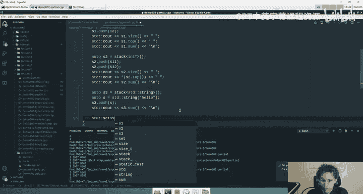

类型特征是一种在编译时查询或修改类型信息的模板技术。标准库 `<type_traits>` 中提供了大量类型特征。

### 基本原理
类型特征通常通过特化来实现。它们本质上是包含静态常量的类模板。

```cpp
// 主模板：默认不是 void
template <typename T>
struct is_void {
    static const bool value = false;
};

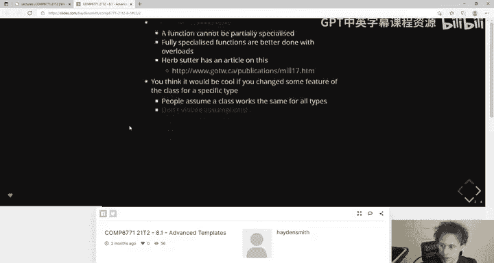

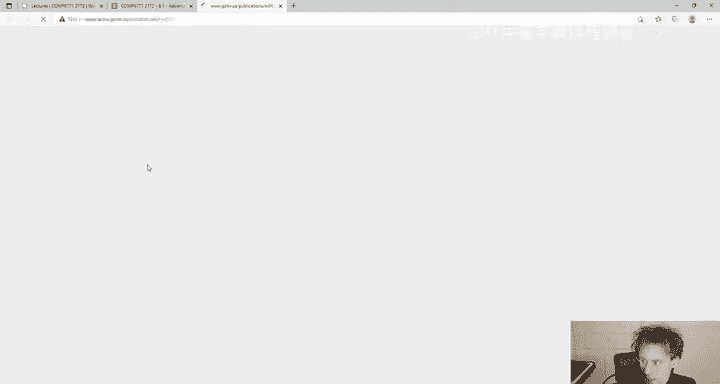

// 显式特化：针对 void 类型
template <>
struct is_void<void> {
    static const bool value = true;
};

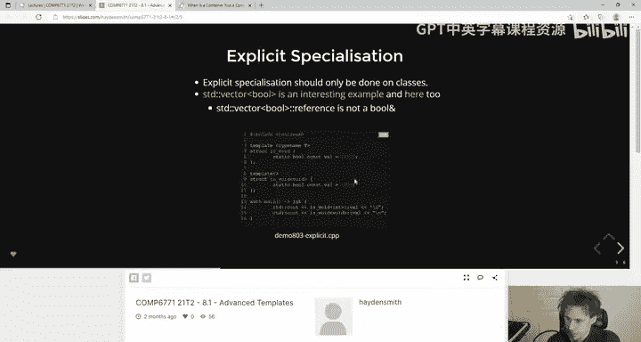

// 使用
std::cout << is_void<int>::value; // 输出 0 (false)
std::cout << is_void<void>::value; // 输出 1 (true)
```

### 实际应用
类型特征使得基于类型的条件编译和代码生成成为可能。

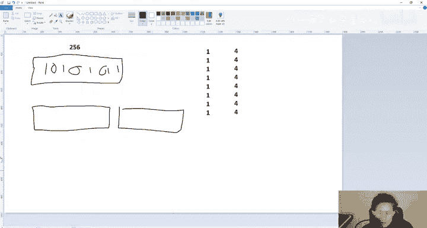

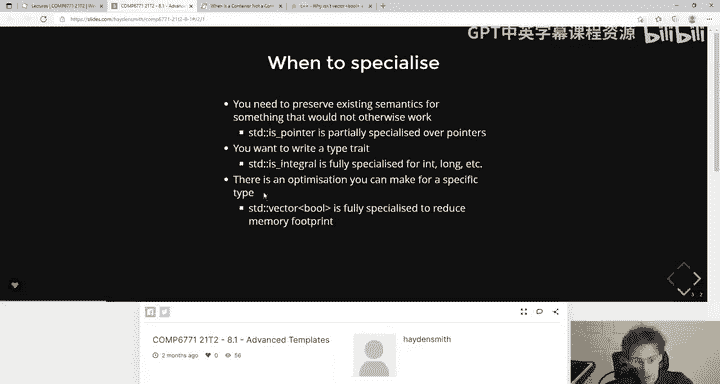

```cpp
#include <iostream>
#include <type_traits>

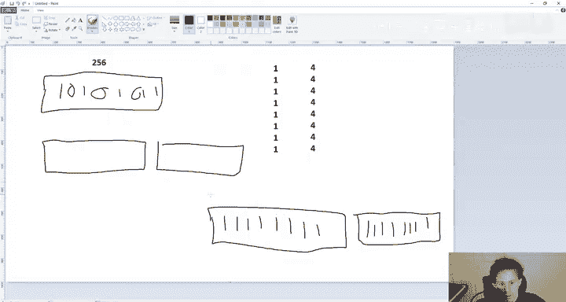

template <typename T>
void test_if_number_type(const T& value) {
    if constexpr (std::is_integral_v<T> || std::is_floating_point_v<T>) {
        std::cout << value << " is a number.\n";
    } else {
        std::cout << value << " is not a number.\n";
    }
}

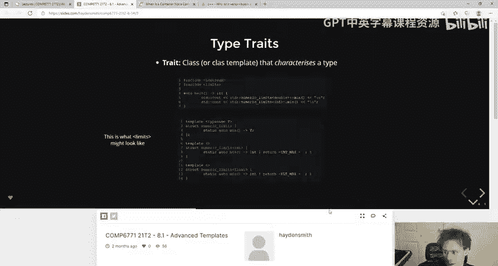

int main() {
    test_if_number_type(42);      // 输出: 42 is a number.
    test_if_number_type(3.14);    // 输出: 3.14 is a number.
    test_if_number_type("hello"); // 输出: hello is not a number.
    return 0;
}
```

另一个例子是 `std::numeric_limits`，它通过特化为各种算术类型提供了最大值、最小值等信息。

---

## 可变参数模板

可变参数模板允许模板接受任意数量的模板参数，是实现像 `printf` 这种可变参数函数的类型安全方式。

### 递归展开模式
可变参数模板通常通过递归进行实例化。

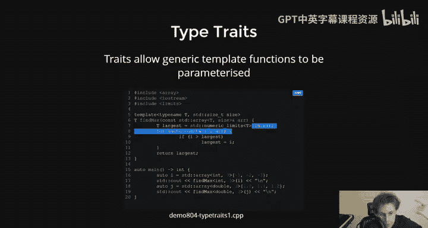

```cpp
#include <iostream>

// 基础情况：处理一个参数
template<typename T>
void print(const T& t) {
    std::cout << t << '\n';
}

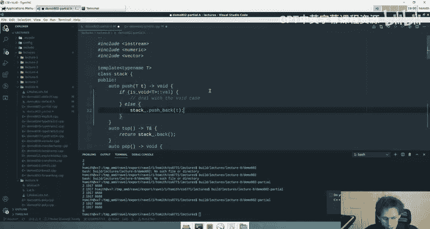

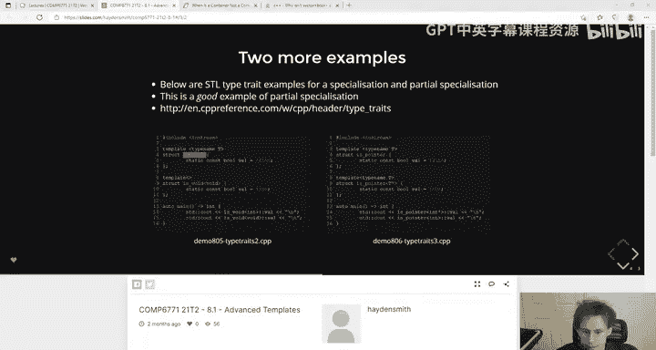

// 递归情况：处理一个参数和一包参数
template<typename T, typename... Args>
void print(const T& t, const Args&... args) {
    std::cout << t << ' ';
    print(args...); // 递归调用，处理剩余参数包
}

int main() {
    print(1, 2.0, "three"); // 输出: 1 2 three
    return 0;
}
```

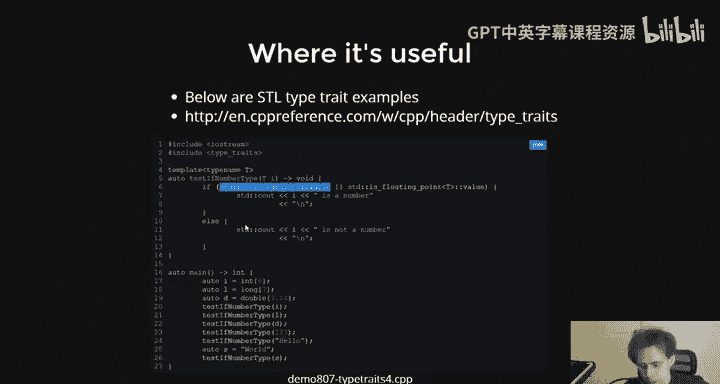

### 工作原理
调用 `print(1, 2.0, “three”)` 时：
1.  匹配可变参数版本 `print<int, double, const char*>`，输出 `1`，然后递归调用 `print(2.0, “three”)`。
2.  匹配可变参数版本 `print<double, const char*>`，输出 `2.0`，然后递归调用 `print(“three”)`。
3.  匹配基础版本 `print<const char*>`，输出 `three`。

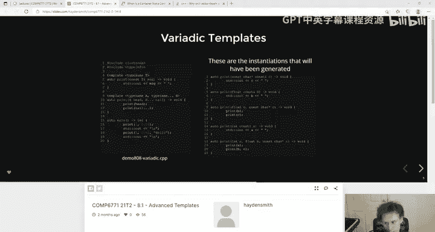

编译器在编译时会为每一次调用生成具体的函数实例，这虽然可能导致代码膨胀，但换来了运行时的高效。

---

## 成员模板

成员模板是指类（包括模板类）内部的模板。常见的用途是创建接受同类但模板参数不同的对象的构造函数或赋值运算符。

### 示例：异构栈的构造
我们希望一个 `Stack<double>` 可以从一个 `Stack<int>` 构造。

```cpp
template <typename T>
class Stack {
private:
    std::vector<T> elements;
public:
    // 普通的拷贝构造函数 (由编译器生成或自己定义)
    Stack(const Stack&) = default;

    // 成员模板构造函数：允许从另一种类型的 Stack 构造
    template <typename U>
    Stack(const Stack<U>& other) {
        // 遍历 other 的元素，转换类型后压入当前栈
        for (const auto& elem : other.elements_) { // 假设能访问 elements_
            elements.push_back(static_cast<T>(elem));
        }
    }
    // ... 其他成员
};
```

**注意**：在类外定义成员模板时，需要提供两套模板参数。

```cpp
template <typename T> // 类的模板参数
template <typename U> // 成员模板自己的模板参数
Stack<T>::Stack(const Stack<U>& other) {
    // ... 实现
}
```

---

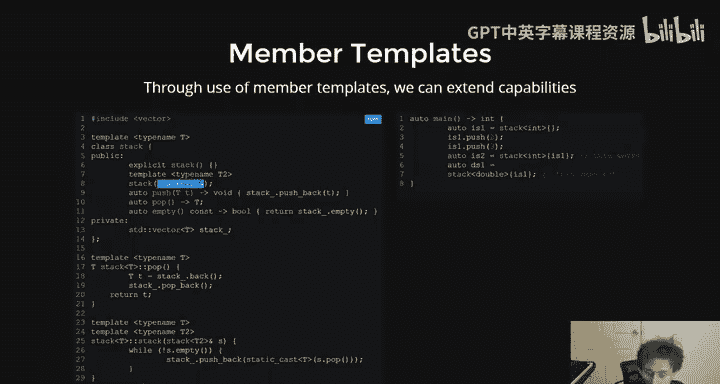

## 模板模板参数

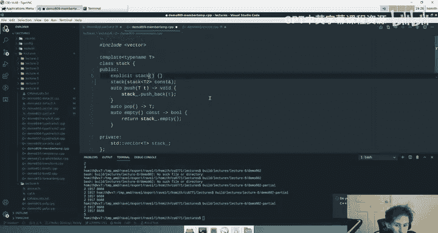

模板模板参数是指一个模板参数本身也是一个模板。这用于让用户只传递容器模板，而不需要重复指定元素类型。

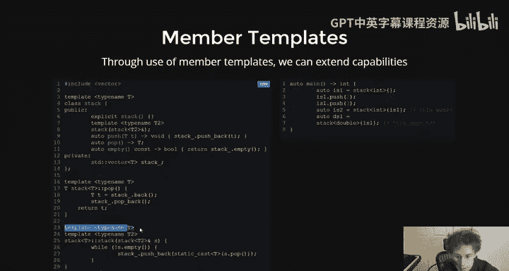

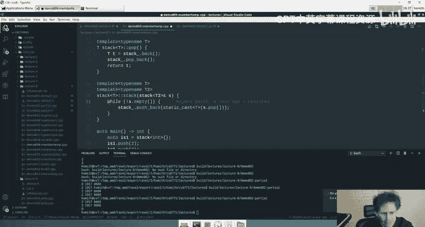

### 对比：非模板模板参数 vs 模板模板参数

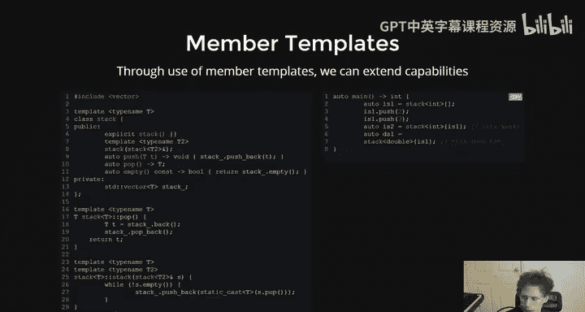

```cpp
// 方式1：普通模板参数，需要指定容器具体类型
template <typename T, typename Container> // Container 是具体类型，如 std::vector<int>
class Stack1 {
    Container elements; // Container 必须已经是完整类型
};

Stack1<int, std::vector<int>> s1; // 需要写两次 int

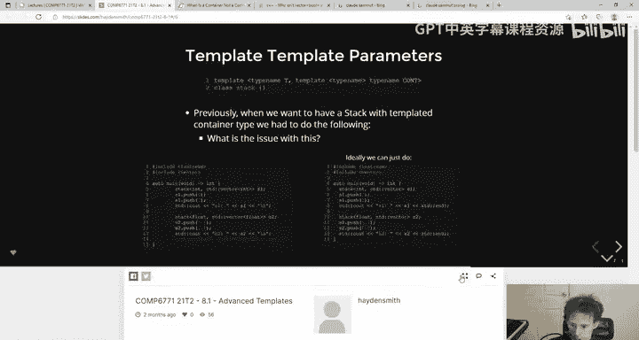

// 方式2：模板模板参数，只需传递容器模板
template <typename T,
          template <typename...> class Container = std::vector> // Container 是一个模板
class Stack2 {
    Container<T> elements; // 用 T 实例化容器模板
};

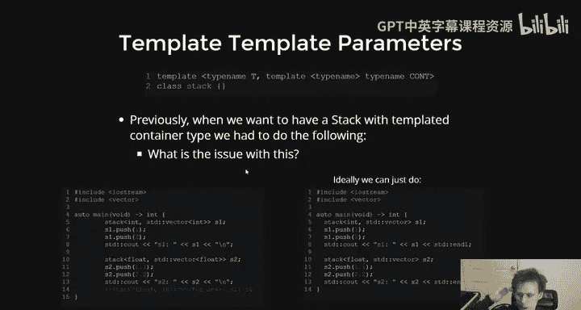

Stack2<int, std::vector> s2; // 更简洁：Stack2<int>
Stack2<double, std::list> s3;
```

### 语法细节
`template <typename...> class Container` 中的 `typename...` 表示容器模板可以接受任意数量的模板参数（例如 `std::vector` 有元素类型和分配器两个参数），这提高了通用性。

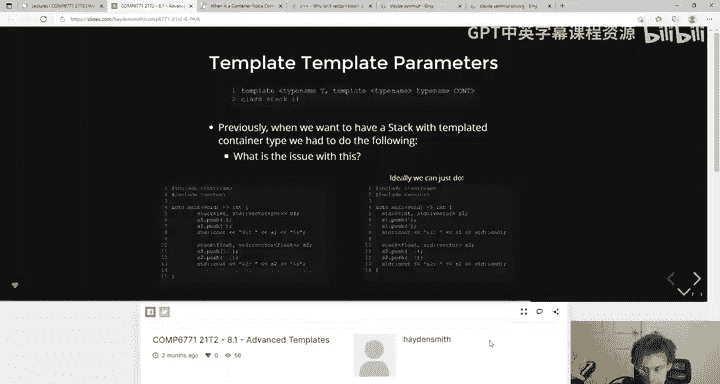

---

## 模板参数推导

在调用函数模板时，编译器通常可以根据函数实参自动推导出模板参数的类型，无需显式指定。

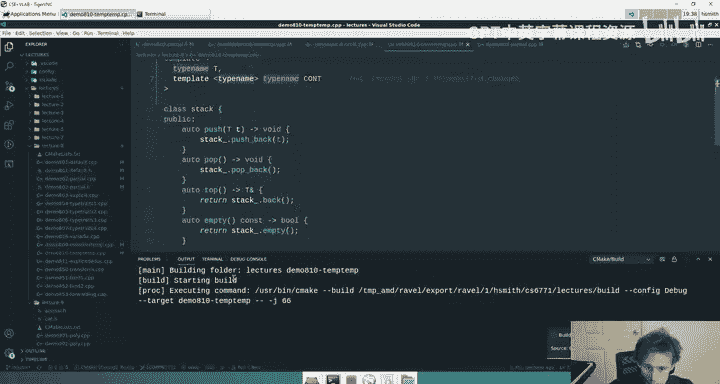

### 推导规则
```cpp
template <typename T>
void f(T* ptr) {}

int arr[10];
f(arr); // 推导出 T = int
```
编译器通过匹配实参 `int[10]`（会退化为 `int*`）与形参 `T*`，推导出 `T` 为 `int`。

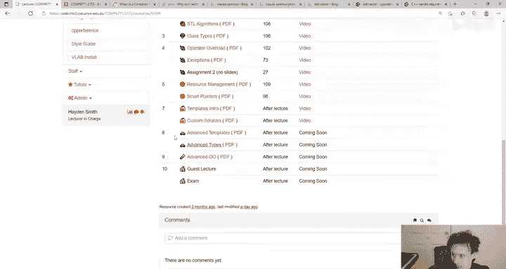

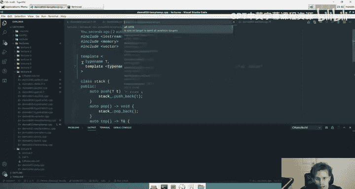

### 需要显式指定的情况
有时自动推导可能不准确或不是我们想要的，这时可以显式指定模板参数。

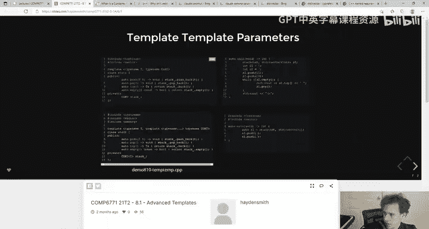

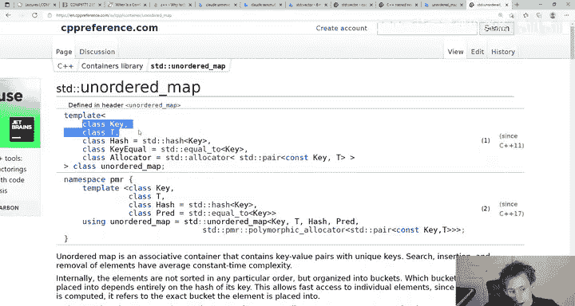

```cpp
template <typename T>
T min(T a, T b) { return (a < b) ? a : b; }

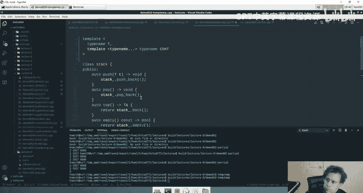

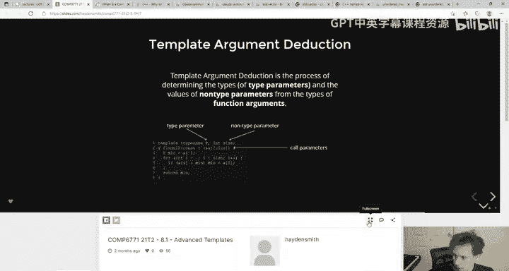

int i = 5;
double d = 3.14;

// auto result = min(i, d); // 错误：无法推导出唯一的 T (int 还是 double?)
auto result1 = min<double>(i, d); // 正确：显式指定 T 为 double，i 被转换为 double
auto result2 = min<int>(i, d);    // 正确：显式指定 T 为 int，d 被转换为 int（可能丢失精度）
```

C++17 的类模板参数推导（CTAD）进一步简化了操作，例如 `std::vector v{1, 2, 3};` 可以直接推导出 `v` 的类型为 `std::vector<int>`。

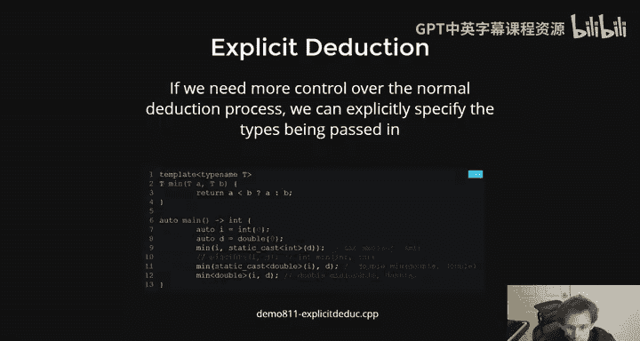

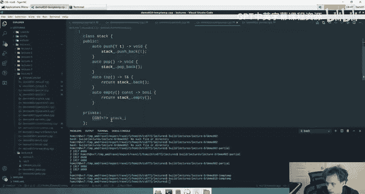

---

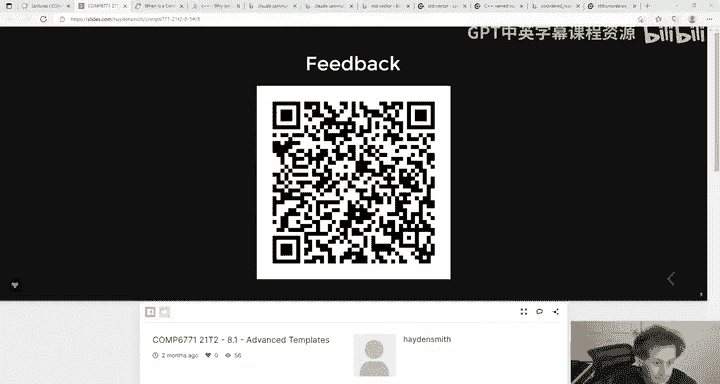

## 总结
本节课我们一起深入探讨了C++模板的高级主题。我们学习了如何为模板参数设置默认值，如何通过部分特化和显式特化为特定类型提供定制实现，以及如何利用类型特征在编译时获取类型信息。我们还了解了可变参数模板如何处理任意数量的参数，成员模板如何增强类的灵活性，以及模板模板参数如何简化代码。最后，我们回顾了模板参数推导的规则。掌握这些技术将帮助你编写出更通用、更高效且类型安全的C++代码。