# 高级C++编程：8.2：高级类型 - 第一部分

## 概述
在本节课中，我们将要学习C++中的一些高级类型特性。这些特性包括`decltype`、类型转换、绑定以及转发。虽然这些概念在日常编程中可能不常直接使用，但理解它们有助于我们更深入地理解C++语言的设计和编译时行为。


---

## `decltype`：从值到类型

上一节我们介绍了课程背景，本节中我们来看看`decltype`。`decltype`是C++内置的一个功能，它允许你获取一个变量或命名项的类型。本质上，它是一种将值转换为类型的方式。


例如，如果你有一个变量`i`，你可以使用`decltype(i)`来获取`i`的类型，而不是直接写出`int`或`auto`。这样，你可以声明一个变量`x`，使其类型与`i`相同。

**代码示例：**
```cpp
int i = 5;
decltype(i) x; // x 的类型是 int
```

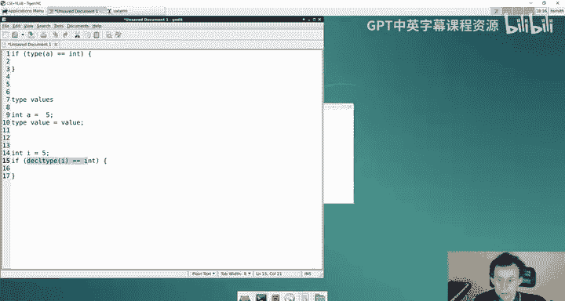

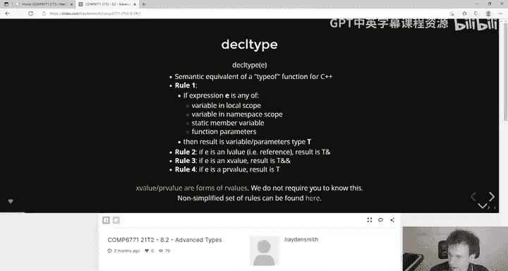

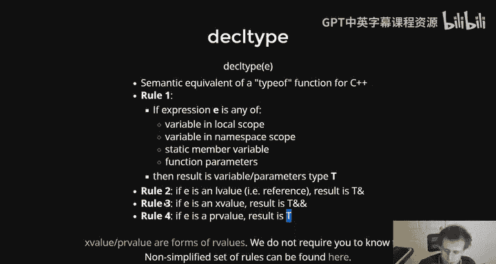

`decltype`与某些动态类型语言中的`typeof`不同。在Python中，`type(a)`返回一个可以用于`if`语句比较的值。而在C++中，`decltype`返回的是一个**类型**，而不是一个值。因此，你不能写`if (decltype(i) == int)`这样的代码，因为`==`操作符作用于值，而非类型。

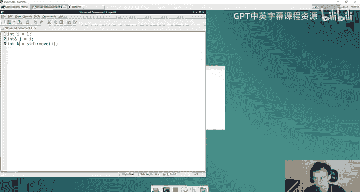

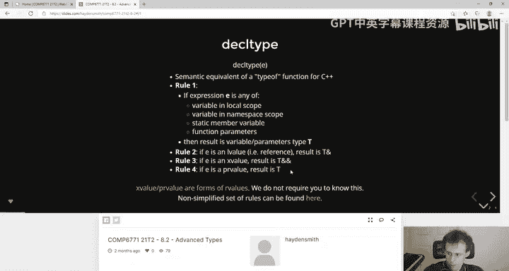

`decltype`的规则较为复杂，其结果取决于传入表达式的种类。以下是核心规则摘要：

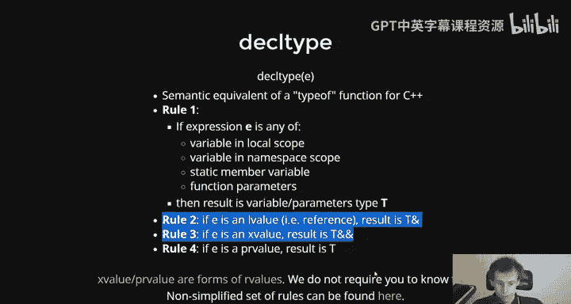

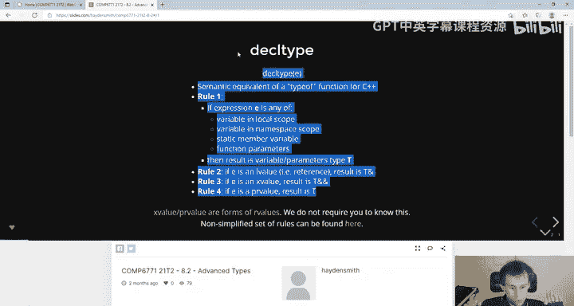


*   如果表达式`E`是一个变量、静态成员或函数参数，则`decltype(E)`的结果是`T`（即该变量本身的类型）。
*   如果表达式`E`是一个左值引用，则`decltype(E)`的结果是`T&`。
*   对于右值引用等其他情况，规则更为细致，但以上两条覆盖了大多数常见场景。

**代码示例：**
```cpp
int i = 1;
int& j = i;
int&& k = std::move(i);

decltype(i) a; // a 是 int
decltype(j) b = i; // b 是 int&，必须初始化
// decltype(k) c; // k 是 int&&，规则类似
```

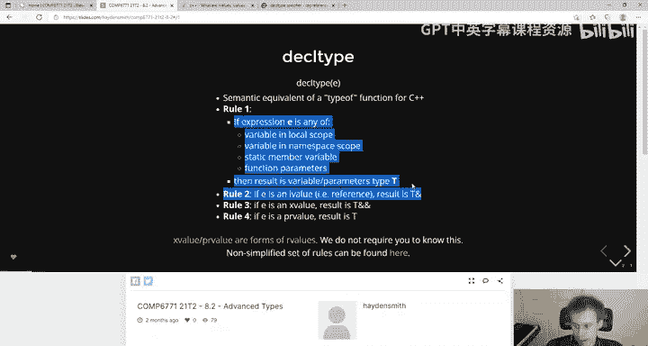

那么，`decltype`的实际用途是什么？一个典型的场景是在编写泛型函数时确定返回类型。

**代码示例：**
```cpp
// 旧的写法（在某些上下文中无效）
template <typename Iterator>
decltype(*begin) find(Iterator begin, Iterator end, int index) {
    // ... 查找逻辑
}

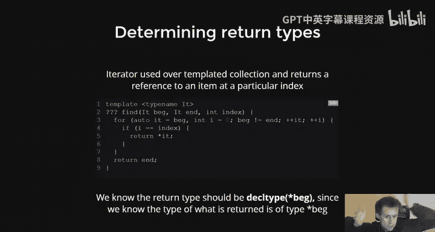

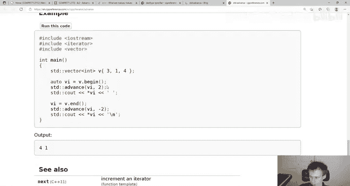

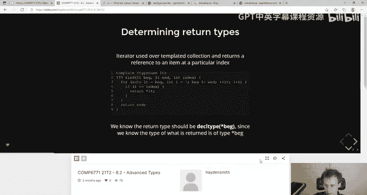

// 使用尾置返回类型的现代写法（有效）
template <typename Iterator>
auto find(Iterator begin, Iterator end, int index) -> decltype(*begin) {
    // ... 查找逻辑
    // 返回类型是迭代器解引用后的类型
}
```
在上面的例子中，我们无法预先知道解引用迭代器`*begin`的具体类型，但`decltype(*begin)`可以在编译时为我们推导出这个类型，从而指定函数的返回类型。

---

## 类型转换

上一节我们介绍了`decltype`，本节中我们来看看类型转换。类型转换与昨天学习的类型特征（type traits）原理相似，但侧重点不同。类型特征用于查询类型的属性（例如`is_void`, `is_pointer`），而类型转换则专注于**将一个类型转换为另一个相关的类型**。

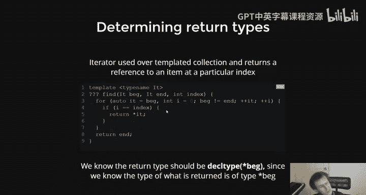

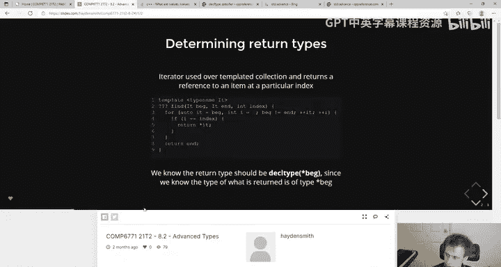

例如，标准库提供了`std::remove_reference`。给定一个类型`T`，`std::remove_reference<T>::type`会得到移除引用修饰后的类型`T`。

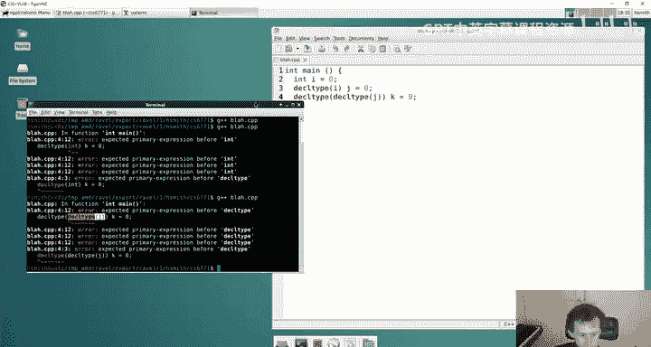

**代码示例：**
```cpp
#include <type_traits>

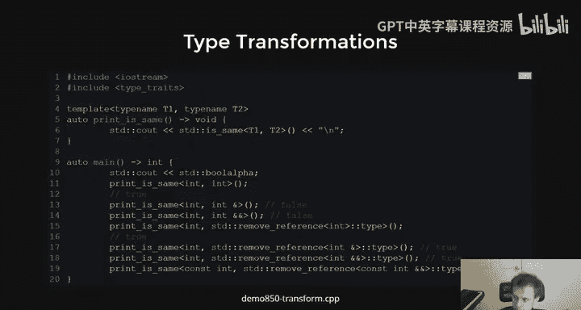

int main() {
    using std::is_same_v;
    // 类型特征：检查两个类型是否相同
    static_assert(is_same_v<int, int> == true);
    static_assert(is_same_v<int, int&> == false);

    // 类型转换：移除引用
    static_assert(is_same_v<int, std::remove_reference<int>::type> == true);
    static_assert(is_same_v<int, std::remove_reference<int&>::type> == true); // 移除左值引用
    static_assert(is_same_v<int, std::remove_reference<int&&>::type> == true); // 移除右值引用
}
```
除了`remove_reference`，还有`add_rvalue_reference`、`remove_const`、`add_const`等一系列类型转换工具。它们都是通过模板特化（包括全特化和偏特化）在编译时实现的。

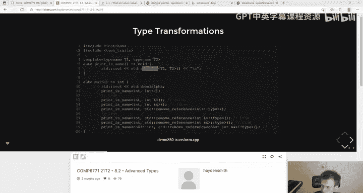

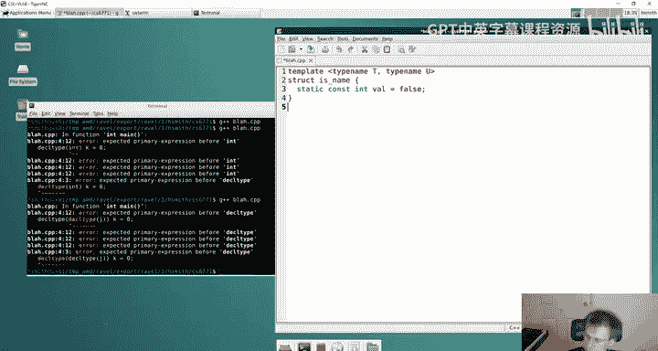

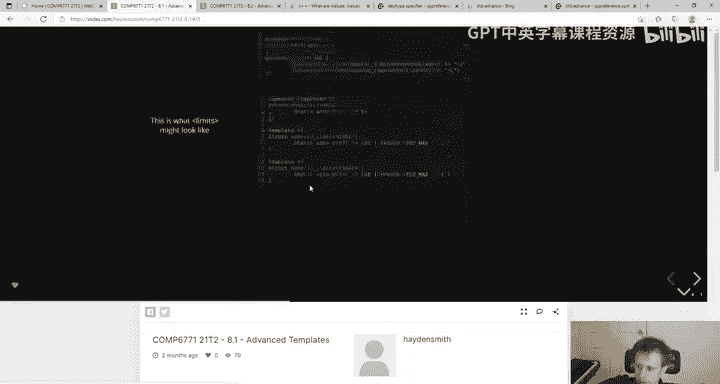

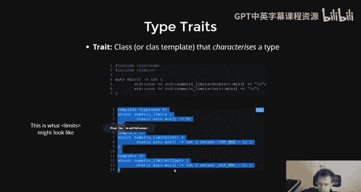

从C++14开始，访问这些类型的语法得到了简化，你可以直接使用`std::remove_reference_t<T>`来代替`std::remove_reference<T>::type`，代码更简洁。

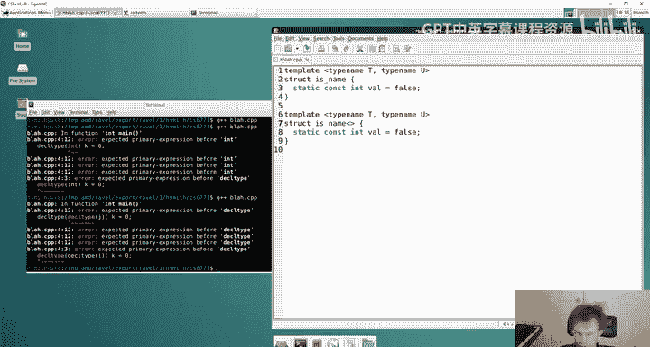

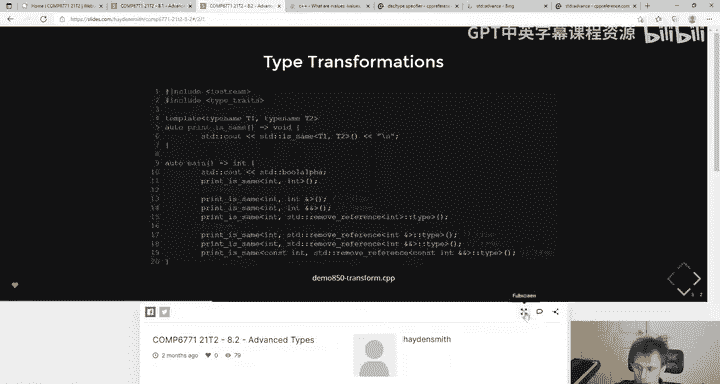

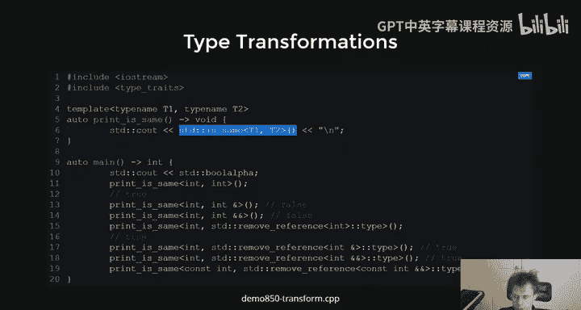

---

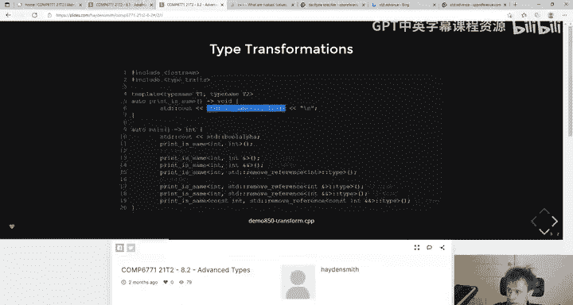

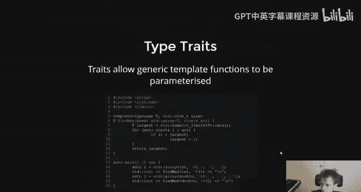


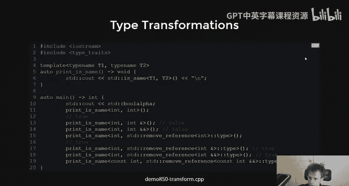

## 绑定

上一节我们介绍了类型转换，本节中我们来看看绑定。绑定讨论的是函数调用时，**实参（arguments）如何与形参（parameters）匹配**的规则。你已经对此有了一些直观理解，例如可以将`int`类型变量传递给接受`double`类型参数的函数。

绑定规则明确规定了不同类型的值（左值、常量左值、右值）可以绑定到哪些类型的引用参数上。

以下是核心绑定规则：

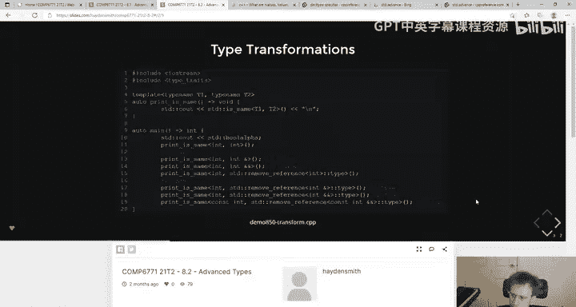

*   **左值引用 (`T&`)**：只能绑定到左值。
*   **常量左值引用 (`const T&`)**：可以绑定到左值、常量左值和右值。这是它非常实用的原因。
*   **右值引用 (`T&&`)**：只能绑定到右值。

**代码示例：**
```cpp
#include <iostream>

void print(int& a) { std::cout << "lvalue ref: " << a << std::endl; }
void print(const int& a) { std::cout << "const lvalue ref: " << a << std::endl; }
void print(int&& a) { std::cout << "rvalue ref: " << a << std::endl; }

int main() {
    int i = 1;
    const int ci = 2;

    print(i);   // OK， 绑定到 print(int&)
    print(ci);  // OK， 绑定到 print(const int&)
    print(3);   // OK， 绑定到 print(int&&) 或 print(const int&)
    // print(ci); // 错误：不能将常量左值绑定到非常量左值引用 print(int&)
}
```
理解这些规则有助于编写更通用和高效的函数。例如，使用`const T&`作为参数可以使函数接受更广泛的输入。

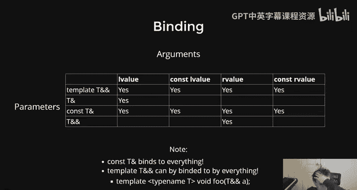

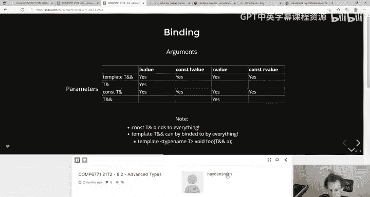

一个特殊的规则是：**模板化的右值引用（也称为转发引用或万能引用）**，即`template <typename T> void foo(T&& arg)`，它几乎可以绑定任何类型的实参（左值、右值、常量等）。这为接下来的“转发”话题奠定了基础。

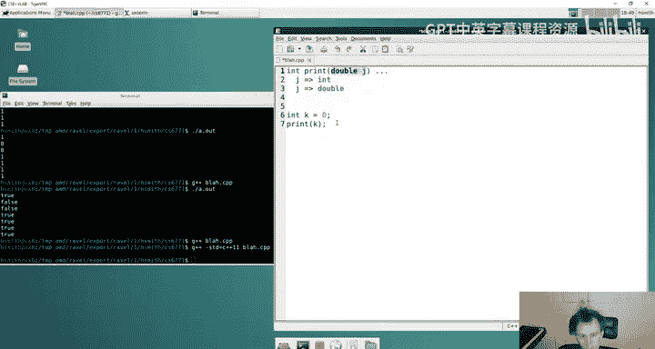

---

## 引用折叠

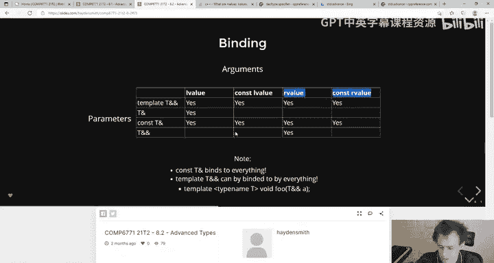

在深入讨论转发之前，我们需要了解**引用折叠**的规则。当我们通过模板或类型别名创建引用的引用时，编译器会使用这些规则来确定最终的类型。

引用折叠规则只有四条：

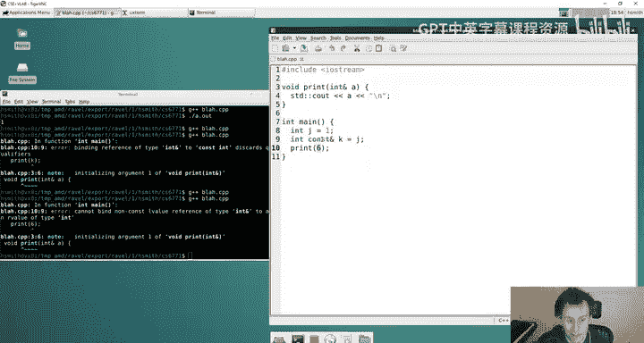


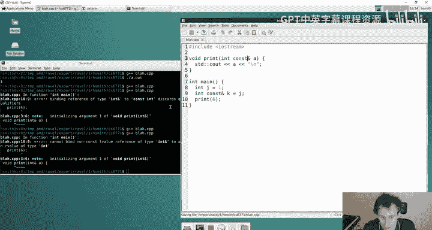

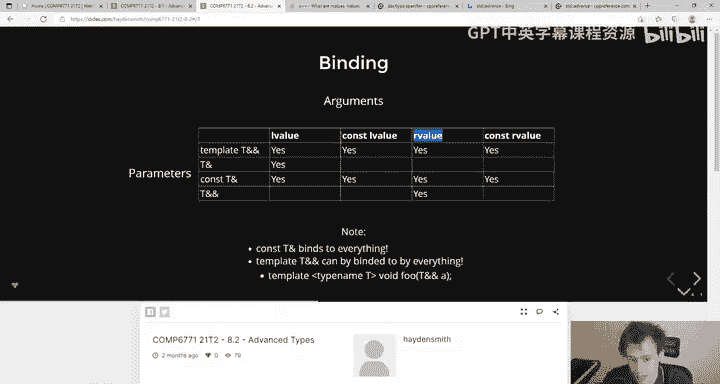

*   `T& &` 折叠为 `T&`
*   `T& &&` 折叠为 `T&`
*   `T&& &` 折叠为 `T&`
*   `T&& &&` 折叠为 `T&&`

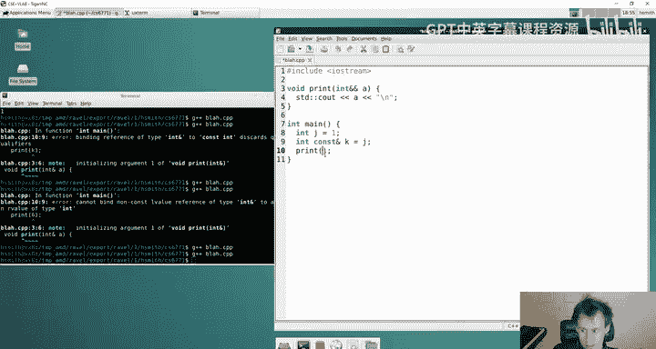


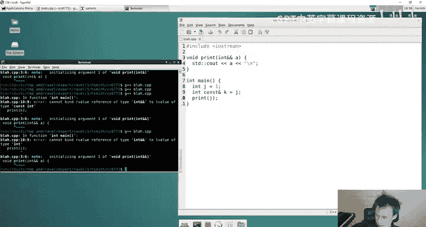

**简单来说：只要其中有一个是左值引用 (`&`)，结果就是左值引用 (`&`)；只有两者都是右值引用 (`&&`) 时，结果才是右值引用 (`&&`)。**

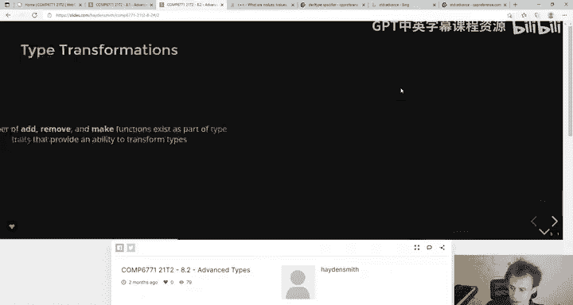

**代码示例：**
```cpp
using int_lref = int&;
using int_rref = int&&;

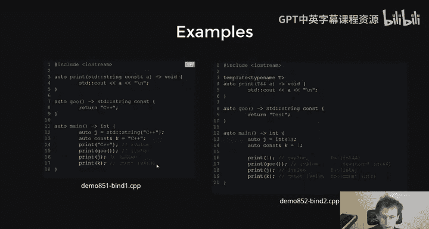

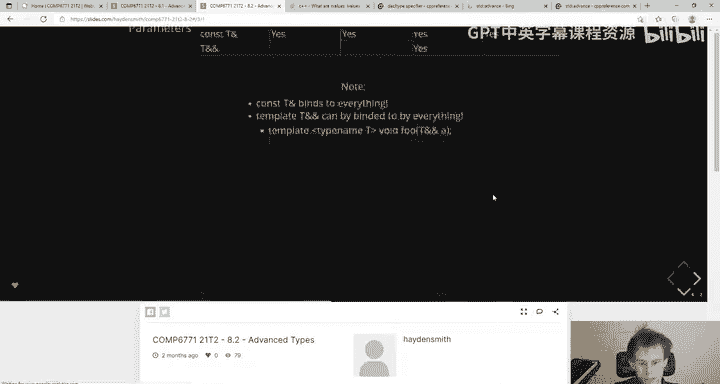

// 根据引用折叠规则：
int_lref&  a = ...; // 类型为 int&  (规则1)
int_lref&& b = ...; // 类型为 int&  (规则2)
int_rref&  c = ...; // 类型为 int&  (规则3)
int_rref&& d = ...; // 类型为 int&& (规则4)
```
这些规则在理解`std::forward`的机制时至关重要。

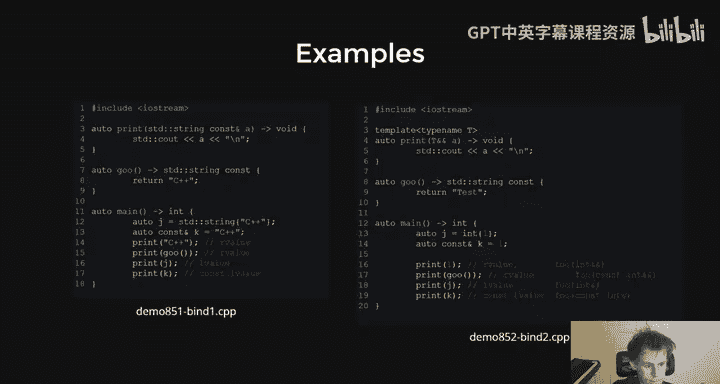

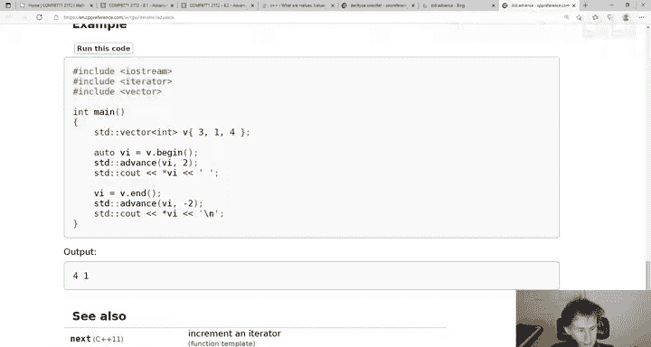

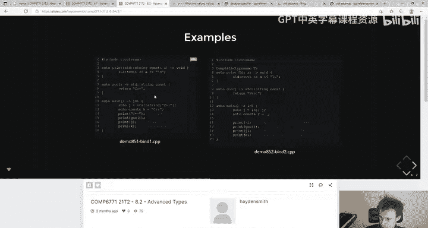

---


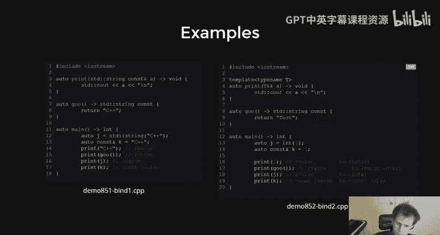

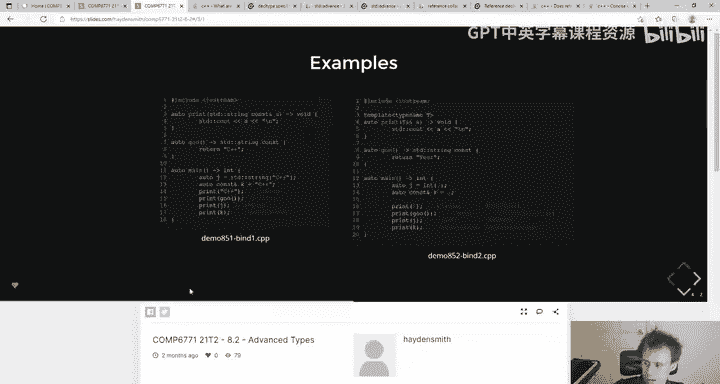

## 标准转发 (`std::forward`)

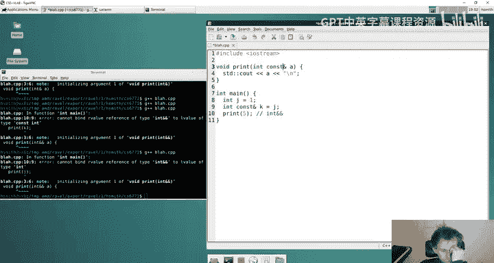


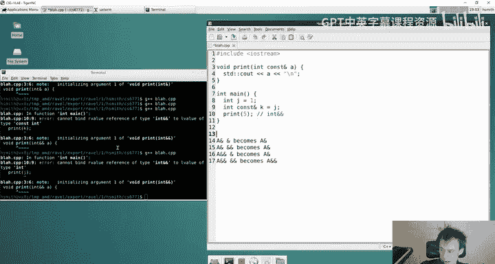

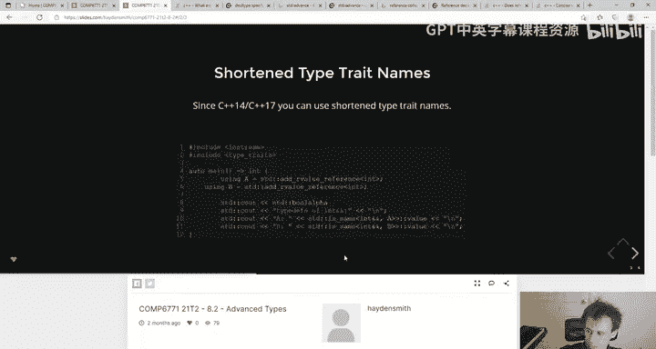

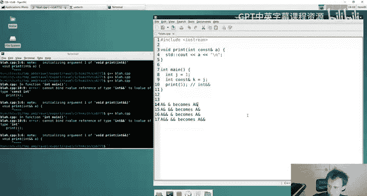

上一节我们介绍了引用折叠，本节中我们来看看标准转发。`std::forward`被称为**完美转发**，它的核心作用是：在泛型函数（尤其是模板函数）中，保持传入参数的原始值类别（左值或右值属性），并将其无损地传递给另一个函数。

考虑以下场景：你有一个模板函数，它接受一个万能引用参数，然后需要将这个参数原封不动地传给另一个函数。如果不使用`std::forward`，参数的值类别可能会在传递过程中丢失（例如，一个右值传入后，在函数内部有了名字，就变成了左值）。

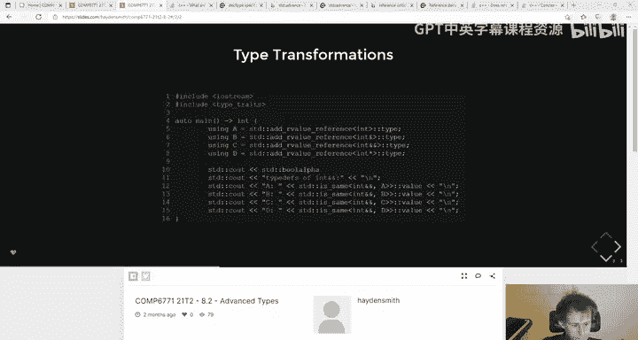

**代码示例：**
```cpp
#include <utility>
#include <iostream>

void process(int& x) { std::cout << "处理左值: " << x << std::endl; }
void process(int&& x) { std::cout << "处理右值: " << x << std::endl; }

// 转发函数
template <typename T>
void relay(T&& arg) {
    // 如果不使用 forward，arg 在函数内部总是左值
    // process(arg); // 总是调用 process(int&)

    // 使用 forward 保持 arg 的原始值类别
    process(std::forward<T>(arg));
}

int main() {
    int a = 1;
    relay(a);            // 传递左值， relay 中调用 process(int&)
    relay(std::move(a)); // 传递右值， relay 中调用 process(int&&)
    relay(2);            // 传递右值， relay 中调用 process(int&&)
}
```
`std::forward<T>(arg)`的实现利用了引用折叠规则。当`T`被推导为左值引用类型（如`int&`）时，`forward`返回左值引用；当`T`被推导为非引用类型（如`int`）或右值引用类型（如`int&&`）时，`forward`返回右值引用。这样就实现了参数的完美转发。

---

## 总结
本节课中我们一起学习了C++中几个高级的类型相关特性：
1.  **`decltype`**：用于在编译时获取表达式或变量的类型，常用于泛型编程中声明类型。
2.  **类型转换**：通过模板特化在编译时对类型进行变换（如添加/移除引用、常量性等）。
3.  **绑定规则**：明确了函数调用时不同值类别（左值、右值）与不同引用类型形参之间的匹配规则。
4.  **引用折叠**：定义了当出现“引用的引用”时，编译器如何确定最终类型的规则。
5.  **完美转发 (`std::forward`)**：结合万能引用和引用折叠，在泛型函数中保持参数原始值类别并传递给其他函数的关键技术。

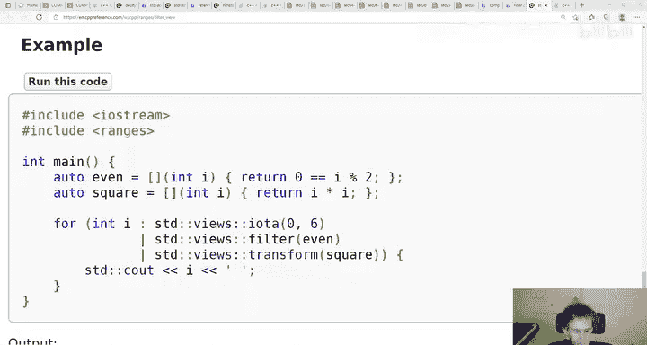

这些概念是理解现代C++模板和泛型编程深层机制的重要组成部分。虽然它们可能不会出现在每天的代码中，但掌握它们能让你更好地理解库的实现、编写更灵活的模板代码，并深入体会C++语言的设计哲学。