# UNSW《高级C++编程｜Advanced C++ Programming COMP6771 21T2》中英字幕（claude-3.7-s - P1：-01-COMP6771 21T2 - 1.1 - Course Overview.zh_en - GPT中英字幕课程资源 - BV1NGQcYLEiV

Hi everyone， nice to see you today。 I'm just fixing up my webcam to start， so give me a short moment。

Okay， hi。I hope everyone's had a great break， welcome to Monday of week one。

 I'm sure some of you are pretty thrilled to be back at university。

I think just a quick note to start is I， my headphone's broke。 so I've ordered very。

 very cheap microphone off of Kogan that you're seeing here and。Yeah。

 if there's any strange strange sound things， just give me a buzz， but anyway， let's get into it。

 so welcome to Com 6771。Most of you should be aware of what this course is generally since you're enrolled in it。

 right， you're here to learn C plus plus today we're going pretty much go through two key things。

 which is a bit of a course overview and then also。

A little bit of environment setup so not a ton of like language features today but a lot of like setup and then we'll dig into language features as much as we can but obviously all of you have been to the WebC3 page that's how you found the lecture in here。

Generally， I'll put the lecture link up like five or so minutes。

 I kind of have to start the stream to put the lecture link here。 So that's kind of why it's there。

 But let's let's go through it。 So on the lectures page， we have three week one lectures。

 And the first one here we have is an introduction to。

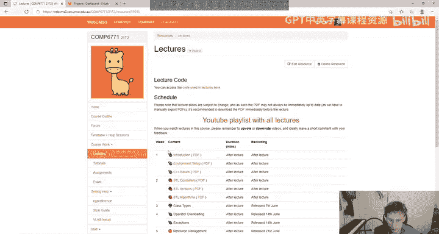

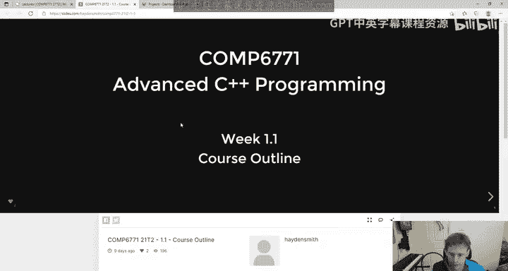

C plus plus course outline course overview， if you will。

 If you haven't already established my name's Hayden。

 I think you probably know that because you've been getting emails from me， but。

Let's start to cover the basics so。🤢，This course is essentially run by me and lectured by me it's small enough that I do most of the admin in the course so pretty much all of your queries will go to me we may get some tutors on the forum though to help out depending on how much you need us we might have some guest lecturers there's two previous C+ plus lecturers and tutors here and then Opteists sometimes like likes to do a guest lecture they basically email me like in week 8 and if they don't email me then。

Maybe we'll see what happens， but sometimes Ova does a little talk because Otva is obviously one of the bigger C+ plus focused grad opportunities for CSE students and then we have a bunch of tutors。

The top three there are previous tutors， Nathaniel has been tutoring Nathaniel and Simon have been tutoring for quite a while。

So it's a great group of tutors which is really good and there's less tutors in this course this course has 450 students and we've got six tutors。

The good news is that that probably means you'll have a higher quality of teaching because like when tutors teach more they generally do better at their job the downsiders assignment marking might be a touch slower but we'll see how we go in this course okay what are the course objectives these are super boring but we generally want you to be comfortable writing C++ 20 using libraries with those with C++20。

Giving you some。Testing frameworks and software to use and work with and also learn a little bit more about object oriented programming in the context of C++ as well as generic programming。

 basically like if you've done Java， that's like Java templates and stuff。

So that's kind of like the key point of what we're teaching in the course。

 but this begs the question， what even is C++ well I'm sure many of you know it's a programming language if you don't know that then I commend you for enrolling in a course randomly。

 but the key things about C++。That。It's a lightweight abstraction programming language。

 so essentially what that means is like a lot of higher level languages you've used like maybe Java。

 for instance， it's like that in a sense， but it's a lot more lightweight。

So it is an abstract programming language that does hide away some of the machine details。

 It can use elements of garbage collection like you're used to with Java， but you haven't seen in C。

 etc。 So it's a little more high level than C Now I'm going to talk about C a lot just because it's expected that you know C entering this course right because you might have come from like 1511 or an equivalent postgrad course。

 So we will base a lot of things off that， but in a lot of ways programming with C plus plus won't feel always like C if you've done Python and Java and C itll feel like a mix of all of those things in kind of strange ways。

 but C will at the start be the language you'll most likely want to relate it to The thing about C plus is it's a much more complex language than C。

 So C is a really simple programming language one of the easiest languages you can think of right you could teach it to someone in a day。

 C plus+ is a lot more complex there's a libraries as' a lot more。The language。

 it has the object oriented ability of it。 you can overload operators like these are all things we're going to go through。

 but C plus plus code itself is often more simple than C because of these abstractions， right。

 it's the same way that you'd say。Java is simpler than say， for instance。And。

While it has object oriented capabilities， like。Java， it's not required， right。

 So if you programmed in Java， you know that you kind of have to。

Start your Java program with a class， but C+ plus you can write things without a class。

 You do still need like a main function essentially。

 but besides that you really don't need to be object oriented if you don't want to。

 but we'll get into that so。C+ plus design pillars。

 so what are the key things what are the key things that the language focuses on well？

Probably the two biggest things are that C++ wants to leave no room for a language between itself and assembly。

 Now， if that doesn't make sense to you， it's kind of like you know how you might be programming in something like Java or Python right and then you say oh we need something lower level we need something faster for instance。

 Well in those cases you might jump to a programming language like C because of how few abstractions it has which makes it very fast because you have a lot more direct control over things the kind of design principle of C++ is such that it wants to be a language that's fast enough like C such that the only time you want to go lower is when you want to get into assembly like all that MIPS stuff if you've done 1521 So a focus is definitely on performance and similarly it's a big part of the C+ plus design culture that abstractions should have as little cost as possible。

And what I mean by that or what we mean by that is that you take a language like C again。

 which might have some arrays in it， right， If you have a Malicone array in C。

 and then you might have a language like。Java where you have like a Ray list or Python where you have list。

 but those things are heavier right there's all this stuff going on in the background， bounds。

 checks and other things， so these abstractions in those other languages have costs associated with them and C++ wants to try and provide you with the speed without necessarily the same extent of cost that you might experience in other programming languages。

🤢，Now I've been doing a lot of comparisons to C， but it's important to point out that C+ plus is not C C plus plus is backwards compatible with C And what that means is that every C program you've written。

 you can compile with a C plus plus compiler right so in a literal sense you can write C and then write C+ plus on top of it。

 you can include stao dot H and all these other things and that kind of tempts people to think it's just like C plus plus right like C with more but fundamentally it's important in this course and we're going to be giving you this and the marketing criteria to think that this is a different language and you're gonna have to approach things differently so。

In this course， we will expect that if you should expect that if you write programs that are basically C code or Cs code that you will lose marks for it because the older C++ gets the kind of further away it gets from C and like one thing for example that we're going to talk about in the course is that good C++ you pretty much don't interact with pointers at all right so in C++ you can use pointers just like C。

 but it's considered bad practice right because you all have used pointers before you'll make mistakes and you'll break your own code。

So we might touch on things like Malik and free and C style arrays and strings as char stars。

 but fundamentally we will be using better abstractions of that。 And in that sense。

 your C plus plus code won't look like your C code。 Now just as a reminder too。

 I am looking at the YouTube chat。 So anyone writes questions I usually glance that at every like5 to 30 seconds。

 So if you have questions you can just ask。And Ive already mentioned about pointers。

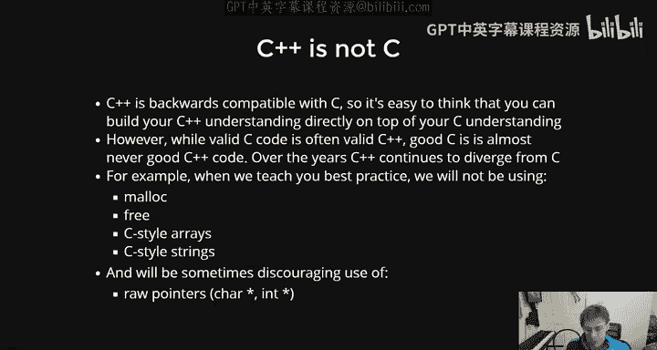

Okay， so what's C++ used for Now this may be a terrible example。

 but the way I think about C+ plus is it reminds me a lot of carbon fibre。

 which I know sounds like a bit of a weird thing but I've done a lot of work with like carbon fibre in during my time as a student and we all kind of you know like no carbon fibre。

 it's that like shiny looking thing that people like talk about and maybe they make bicycles out of and stuff you know。

Like carbon fiber bicycle。And the thing about carbon fibers is's really light and it's really strong。

 but that doesn't mean that it's the best thing all the time。

 So there's some people out there who kind of think C plus+ is like the greatest language on the planet and they use it everything。

 but that's not necessarily the right approach because。

What's unique about C plus plus is that it is both fast and it is powerful And when I say powerful。

 I mean it's like easy to write a lot of code in right And when you have something like C。

 which is kind of not very powerful， it's hard to write big things in C， but it's super quick。

 And then on the other end， you have something like C Python， which is quite slow。

 but you can do tons of stuff with it really easily。

 there's kind of a gap in the middle for things that require both。

 And the reason I mention carbon fibre， for instance。

 is that you know if you're trying to build something strong。嗯。You know。

 like like a chair or something or a seat bench， you can just build it out of steel or something that like is really cheap that can be heavy。

But it's quite strong， right And you have languages like Python， which you can do a lot with。

 but they're slow。 but sometimes it doesn't matter if they're slow。 like if you're writing a program。

 it's going to take two seconds to run in the worst case， Like who cares。

 you don't need to write it in something complex like C plus plus。

 you can write it in something simple like Python。 And then on the flip side， you know。

Sometimes you need things to run really， really fast， but you don't really like need it to do much。嗯。

And that's what C is great for。 So we， we like C++ because it's a good balance。

 It has this capability mixed with this performance。 And therefore。

 if you look at a lot of the applications that it tends to be used for。

 it's often on a lot of low level， complex stuff， right， Like， for instance。

 most web browsers are built with C plus plus， A lot of， you know。

 complex systems that interact directly with hardware are sometimes built on C plus plus。

 if they're trying to maintain more complex libraries， then。You know。

 what you can do is C in general， what I would say is a good rule is that if you look at a lot of modern software that's built。

 you basically have a massive camp of software that's built on the web right。

 like this and like everything else like Slack。

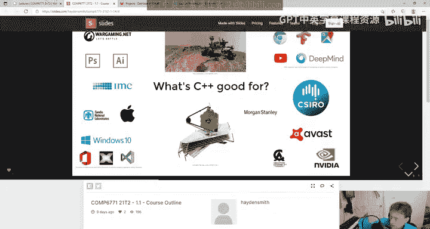

Disord Microsoft Teams， these are all builta's web apps and what you'll notice like you notice this right。

 they're a little bit slow。 They're a little bit chuggy if you've ever used these tools。

 they just don't feel as zippy as something like， you know Google Chrome or Photoshop。

 like if you've ever used Google presentations or Google Sheets as opposed to using Excel or something。

 there is a performance difference。 and a lot of that is because you know。🤢。

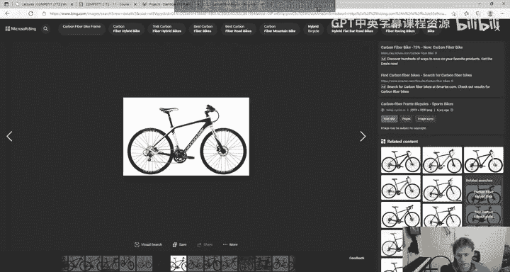

People will write a lot of native applications in C++， for instance。

 a lot of operating systems or other pieces of code might be written in C++ so it's really essentially like。

 do you need performance？And is this a non trivial piece of software。

 particularly something that's not interacting directly with hardware。

 because you'll probably still lean towards C for stuff that interacts directly with hardware。

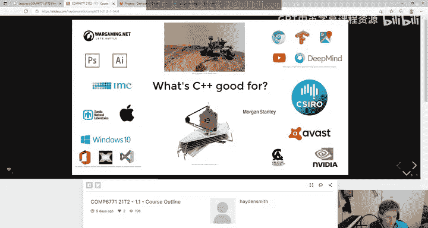

L the anything I missed here is。Games。A lot of games are written in C++ purely because games are some of the most performant demanding things out there。

 right， like they want to be fast， you need games to be fast because they just demand a lot from the computer。

There are two books that you can。Use to learn things in this course。

 I would say generally that you don't need textbooks at all to get your head around this course。

 but if you're one of those people who just really loves to learn more then that's probably the best place to look。

There's two links here， but the main one， the main place you're going to go to a lot during this course is CPPreference。

com is basically a website that is kind of like like the docs of the entire language it shows you kind of all the functions all the types that's like core to C++ an extremely helpful doc we're going to be talking about it lots in the course。

 so I'm not going to go through it now。

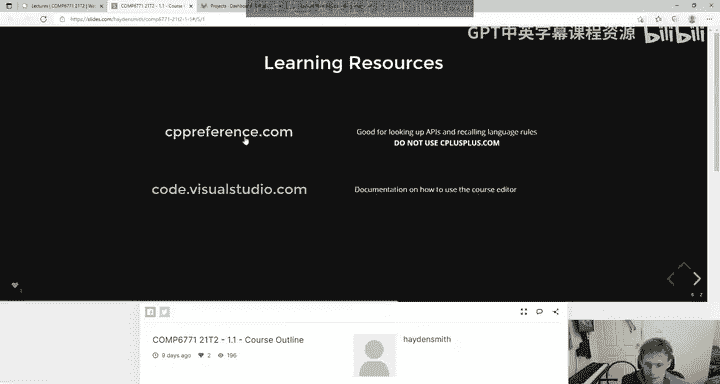

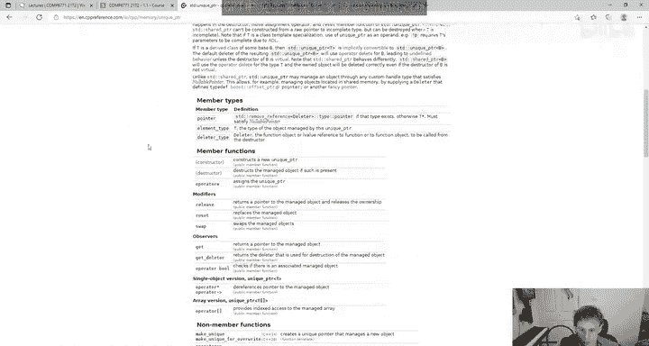

And then in terms of getting help， well， if you want， if you have questions to us。

 the first place you should always go is the farm。

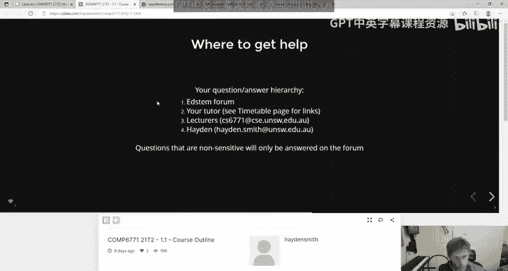

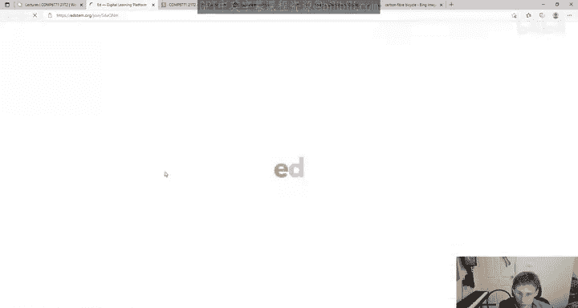

I have to sign in on this browser。I use a different browser for teaching no。That's al right。

 My password is long enough that I don't care if you know the first five letters。Thankfully。

 it's not like an eight letter long password。嗯。Oh， okay， I remember now。

You know you know UNSW makes you change your past whatever goddamn six months and then anyway So yeah。

 if you have questions， you pretty much just post them on the forum。 It's pretty sweet。

 that's where I kind of want you to post everything if you can the reason for that is because I find it easier to collate them I'm probably gonna get back to you quicker if you can't get answers from the forum。

 you can try and email your tutor generally speaking your tutor might not be able to get back to you super quick because like they only have so many hours they're paid to help outside of the course these are all of your tutors here。

 you can find their contact details down the bottom generally speaking though if you ask a question that could be posted on the forum。

 even if it's private， they're still going to send you to the forum So it's good practice to post on the forum and then the next two are just these to email addresses I would strongly encourage you to email CS6771 at CSC instead of me even though they both go to me because。

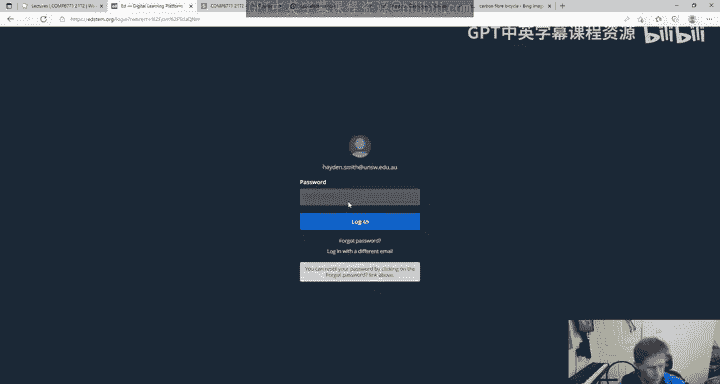

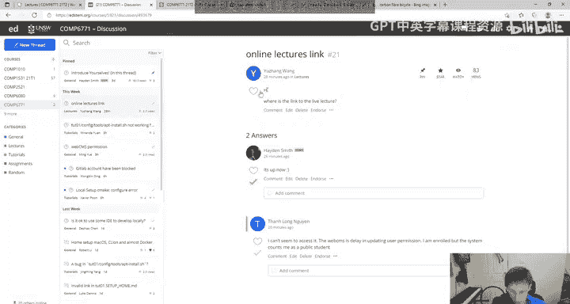

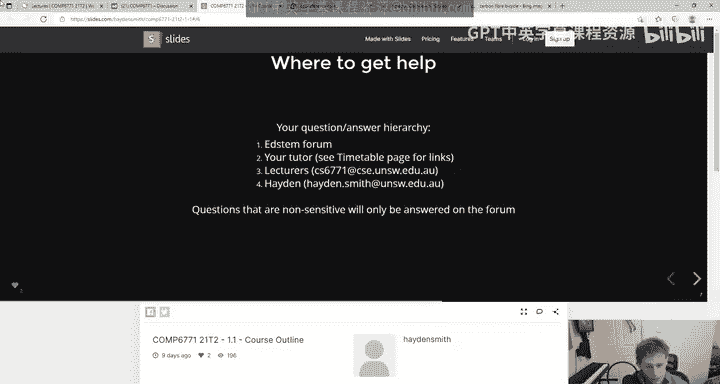

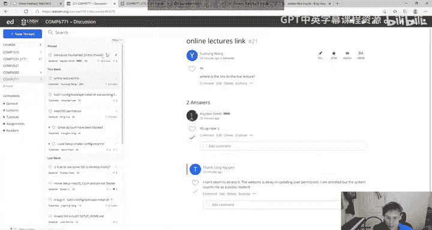

Here's， here's the thing。 A A lot of students forget that like， I teach other courses。

 So sometimes I'll just email me literally and be like help。 and they'll be like。

 I can't log into Web M S3。 And I'm like， who are you。

Where are you from if you at least email CS6771， I can immediately categorise what your problems are。

 so please email that instead of me directly。Thank you。

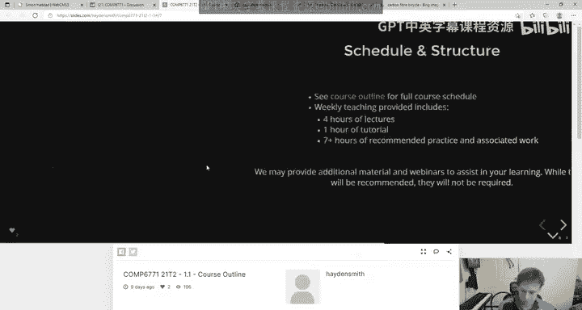

Okay， schedule and structure。There's a course outline。 Please read it。 if you haven't read it。 I。

 I try and make my course outlines nice and short and contain all the key information about assessments and。

Timelines， I think the only thing I want to clarify is that this here I don't think is in pairs。🤢。

I think this is individual。I have to triple check， but it's so its is like of the third assessment weeks away。

 So， yes， please。This this is probably individual。 but besides that。

 you can read the course outline it。 It's a very simple course Starlight says in the chat should ELS stuff be sent to me or the course email。

 the course email it all goes to me。 it's just like it's easier for me to categorize it So yeah through the course email standard course lectures to lots of work outside the class。

 There are three assessments。 This course is very assessment heavy，70% assessments，30% exam。

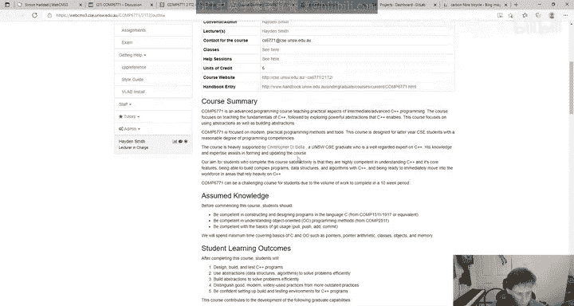

I。ELS doesn't concern you if you don't know what it is， it' yeah。With this course。

 the exams been dropped。 It used to be 50%。 now it's 30%， which is much smaller。

 I'm trying to move that way because of CoviId and like online exams are kind of crappy， so。Yeah。

There's that's about it。 The assessment ratings have definitely gone up。 If assignment 3 is in pairs。

 would we have the option to do it solo， Yes， but I'm pretty sure it'll be individual like I'm。

80% sure， but I'll figure that out in the next few weeks。Is this course D P。

 I don't know what D P is。 I'll double pass。 No， it's not。

 I don't think I've I explained this to everyone。 I don't think double passes make sense if you do an online exam。

 Like if someone does a double pass online exam， like just tell them。

 I think it doesn't make any sense， so。嗯。Yeah， assessment。

So last points on assessment here are that we may scale the final exam， there is no hurdle。

 as in there is no double pass on the final exam。And the assignments you will be required not just to write C plus plus。

 you'll also be required to do some testing， which is written in C++ And then we will also get you to be using doing the assignments in Git。

 which I know about two thirds of you are definitely familiar with and probably many more。

 I'm not sure what you mean by is this course still ADK。I don't know。 You'll have to。

 you'll have to give me the acronym on that one。 And please don't plagiarise。

 C plus plus has very sophisticated software to detect plagiarism。 I just gave。

12 students are zero for their final exam in another course， so I will find you。And。Don't do it。Yep。

Advanced disciplinary knowledge。I'm not sure what that means， but if you want to elaborate。

 I can help out。 Okay， so last couple of things， this course is taught on Gitlab。

 The actual links in web CMm3 will take you to Gitlab like if you go to tutorials and stuff and you click on this link it will take you to Gitlab anyone who's an undergrad should be familiar with this。

 anyone who's a postgrad might be familiar with it。 So generally speaking。

 it's like if you're a postgrad， what I'd recommend is if you go to。

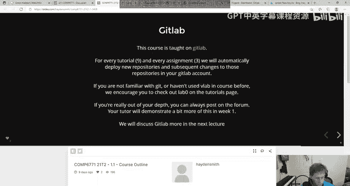

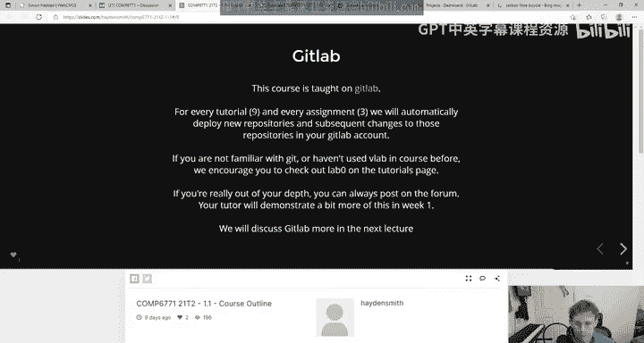

Lab zero here we've actually got a lab that's taken from an undergrad course which I can't really load because I'm not a student in the course。

 but I'll pull it up here for you now。So we've actually got this lab here which like gives you the basics of Git。

 it's not a course on Git， it's just a tool we would like you to use to manage your assignments。

So if you're not familiar with Git you can just go here and learn about it。

 if you're familiar with Git you can totally skip this。

Because it's just taken from an undergraduate course。嗯。

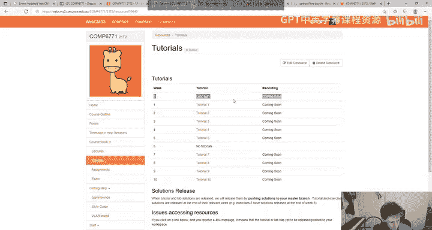

Yeah。That's pretty much it。 We'll talk a little bit about getting the environment setup up lecture。

 Also， feedback。 there is a， oh， I haven't got it in the sidebar。 That's really sad。

 There is going to be。

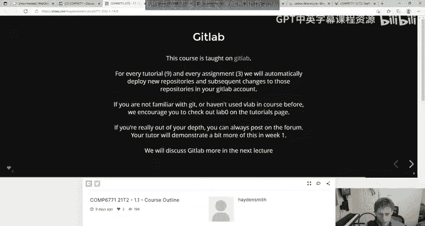

Oh， this is terrible。 I've actually got this， like page。Which is for feedback。

And it's basically a Google Form and it's anonymous， but you can optionally put your name in there。

 I'm just like literally adding it right now。嗯。Just because otherwise I forget and it takes all of three seconds。

Sa so there's a link in the sidebar here called Fe。

 which basically lets you like pick a lecture and then， oh， that's a different thing。Okay。

 I'll just fix this later。 Anyway， there's some anonymous feedback。

 That's not that that there'll be a link， therefore。

 where you can basically share your feedback throughout the course。 Now。

 I put that there so that everyone has a chance to give feedback。

 even if you want it to be anonymous。 I would encourage you， though， to always。

Share feedback with me telling me who you are because I don't get mad at things。

 And sometimes I like， I want to talk to you about it because like what happens is sometimes students give me feedback and they're like。

 oh the I found the lectures a bit boring。 And I'm like。Okay。

 I don't know what you want me to do with that。 Like， I have a follow up question。 And if you。

 if you don't， if you give me。Like half the time people give feedback that's anonymous。

 I have to throw it in the bin because there's nothing actionable from it right so I like when you can share your name。

 which is good Some other questions when will we have access to the first assignment That's a great question。

 I was gonna to touch on that at the end。 The first assignment is gonna be released on Wednesday It's a smaller assignment than the other two it is a bit like short timeframed。

 but the main purpose is so that you get a chance to like do something get into the course quickly and also hopefully like we want to have it。

Done as early as we can so we can help you understand how you're finding this course right because like it's important that you get a sense of how this course is going to be as soon as possible。

Is lab zero knowledge on Git enough for this course， Yes， absolutely。

 it's probably even a bit more than you need when just to make sure there's no weekly labs， Yeah。

 it's just three assignments and an exam， that's it。

 And assignment 3 is individual So for the assignments assignment1。

I'll just make this really clear will'll be released on Wednesday evening at 8 PMm right so that's when we're releasing it Wednesday evening at 8 PMm and then I'll be talking about it briefly in the lecture on Thursday so this will be released Wednesday at 8 PMm。

I'm having people asking me， are we getting marked on git usage like 1531。

 no for the undergrads there's nothing there's no git usage marks in this course。

 it's purely the tool we're using。It's like， you know。

 you might use G edit or VS code to write stuff because we've asked you to。

 but like we're not marking you on it， it's just how we want to structure the course。

So yeah Wednesday at PMm you'll see the assignment come out。

 that means that when you click on this link it'll actually take you to it because right now it's a bit du。

 I just need to check a couple things。And。Yeah， then we'll chat through it on Thursday。

 generally speaking， assignment one touches on content from week one and2。Yep。

Some other questions I have in the chat here are only assignment  three will be group I don't know how many times I have to say this。

😊，Assignment 3 will probably be individual。 And if it's not， I'll let you all know。 right？ Oh。

 there's no lecture on Thursday。 I， am I thinking Wednesday。Oh， Tuesday。Oh， okay， sorry。嗯。

I got my times wrong。 so what I'll do is I'll in that case， Sorry I'll think of another course。

 I will have the assignment one released tomorrow night and I'll send out a notice about it right。

 so we'll release it tomorrow night at 6 PM。 if if the lectures on Tuesday。

 my bad then we'll I'll get it released tomorrow night。 so tomorrow night at 6 PM。Bob。

 the answer to your question， yes， I don't really want to dwell on that topic。

Is knowledge of Java prere for this course， Yes， because 2，51，1 is。

 and people have asked lecture recordings， lecture recordings are just available on the lectures page。

 They'll be here。 So against each lecture， they'll be recorded。

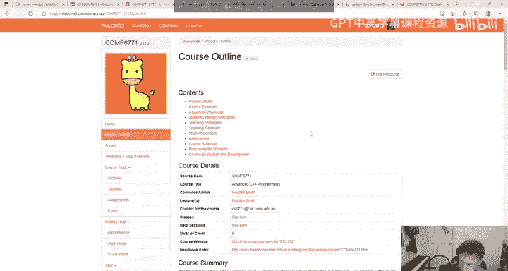

Yeah。Sorry about the lecture time mess up point is we'll have assignment1 to release for you tomorrow night that's the main point okay and then just last point in this introduction is that I would you know just want to remind everyone that it's important that we operate in as an inclusive environment as we can during this course and generally what that means is that you know if we find out that you're disrespecting students or breaching codes of conduct we won't take it lightly。

This。Computer science industry is kind of a bit of a our place compared to some other industries around the world。

 so hopefully you can all join me in trying to make our lives and each others as nice and friendly and loving a place as possible。

So that's just me reminding you so that if you do something stupid， I can tell you I told you not to。

Pink says shallll we use VLb for this course， You can。

 you can do stuff at home and that's actually what we're about to talk about next。

And that pretty much sums up the introduction of the course， so the only key takeaways here。

 like the only real key things， besides what I've said is that we'll be releasing assignment one tomorrow and we'll have a brief chat about it at the end of tomorrow's lecture。

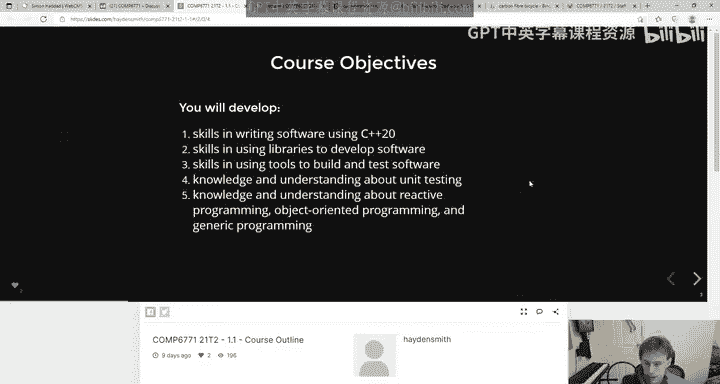

Yeah， that's about it。