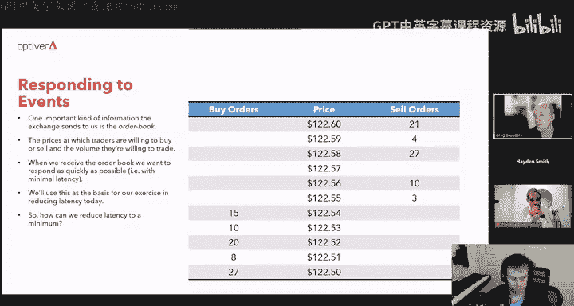
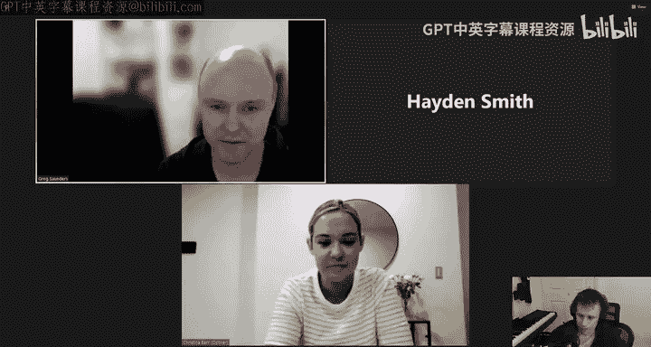
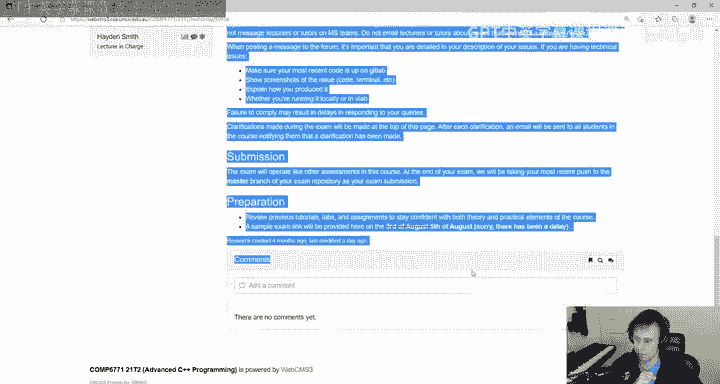

# 高级C++编程：P23：Optiver嘉宾讲座：低延迟开发实战

## 概述
在本节课中，我们将跟随Optiver的嘉宾Greg Saunders，学习在金融交易系统等高性能场景下进行低延迟C++开发的核心原则与实战技巧。我们将从一个具体的“订单簿”案例出发，逐步应用性能分析工具和数据结构优化策略，显著降低关键函数的执行时间。

## 什么是Optiver？
Optiver由两个荷兰单词组合而成：“Optie”（金融期权）和“Verhandelaar”（批发贸易商），意为期权交易商。Optiver是一家做市商，其核心业务是为市场提供流动性，帮助交易者以合理的价格在需要时进行交易。

做市的关键在于估算金融产品（如期权）的当前公允价值，并以此为基础，向买家提供比任何其他对手方更低的价格，向卖家提供比任何其他对手方更高的价格。通过这种方式，Optiver使市场更具流动性，并为市场参与者提供了更优的交易条件。

其工作流程简述如下：交易所（如ASX）将市场信息和交易者行为数据发送给Optiver。随后，Optiver的自动交易系统利用这些信息估算价格，并决定是否执行订单操作（如下单、修改或取消订单）。如果需要执行，则将操作指令发送回交易所，然后等待交易所的下一轮信息，并重复整个过程。

Optiver是UNSW高级C++编程课程的赞助商，并为该课程每年的最佳学员提供500澳元奖金。这是因为在Optiver，他们使用C++构建世界级的交易平台，开发者需要设计、开发和维护低延迟的C++系统，而这门课程所培养的技能与此高度契合。

## 低延迟开发实战
现在，让我们深入探讨低延迟开发。

交易所发送给我们的一个重要信息是“订单簿”。屏幕上显示了一个订单簿的示例。订单簿包含了交易者愿意交易的价格，以及在每个价格水平上交易者愿意交易的量（手数）。例如，在屏幕上的订单簿中，我们可以看到在122.56的价格上，有卖出10手该产品的意向。

当我们从交易所收到这个订单簿时，我们希望尽可能快地做出响应。也就是说，我们希望以最小的延迟来响应这个信息或事件。

在本讲座中，我们将以“订单簿”这个概念为基础，进行降低延迟的实战演练。那么，我们该如何做呢？

不幸的是，降低延迟没有“银弹”，没有快速简单的捷径，但有一些黄金法则：
1.  **先测量，后修复**：如果你在修复前不进行测量，很可能会改错地方，真正的问题反而被忽略。
2.  **避免过早优化**：不要在对系统的实际性能特征有深入了解之前就过早地进行优化。
3.  **深入理解你要解决的问题**：对问题的浅层理解无法产生最优解，必须深入理解才能找到最快、最好的解决方案。
4.  **了解可用的工具**：我们将在本讲座中介绍其中一些。
5.  **了解硬件的特性**：这样才能理解系统为何表现出特定的性能。

让我们尝试将这些规则应用到“以最小延迟响应交易所订单簿信息”这个问题上。

响应事件时，首先要做的是识别所谓的“热路径”，即事件发生时实际执行的代码。事件发生时未执行的代码无关紧要，只有热路径上的代码才是关键。

以下是一个可能用来表示订单簿的简单类。为了本次练习，我们假设 `get_volume` 方法是响应订单簿事件的热路径的一部分。因此，我们将尝试通过使其尽可能快，来降低 `get_volume` 方法的延迟。

以下是我实现 `get_volume` 方法的第一次尝试。可以看到，我使用了一个字典（`map`）来映射价格和该价格上的可用量。`get_volume` 方法接收一个价格，在该映射中搜索，如果找到则返回关联的量，否则返回零。这看起来是一个不错的初步解决方案。

你可能会想，为什么用字符串表示价格？原因是，目前仍有交易所在其协议中使用ASCII字段来表示价格，这是因为涉及小数位数精度等问题。使用浮点数表示可能无法保证所需的精度，因此我们使用字符串表示价格，并使用映射来查找任意给定价格水平上的量。

记住第一条黄金法则：修复前先测量。让我们开始测量，我将使用 Google Benchmark 进行测量。它可以在GitHub上获取，如果你用过 Google Test 进行单元测试，会发现它很类似。实际上它在底层使用了 Google Test。

屏幕上显示了一个使用 Google Benchmark 框架编写的基准测试示例。它反复调用 `get_volume` 方法（针对一个已知存在于映射中的价格），并测量其运行时间。`benchmark::DoNotOptimize` 这行代码是告诉编译器不要因为未使用返回值而优化掉对 `book->get_volume` 的调用。这样，基准测试会多次调用 `get_volume`，测量其耗时，并告诉我们结果。我们也可以编写一个类似的基准测试，来测试不存在于映射中的价格，以观察当价格不在订单簿中时的耗时。

让我们看看输出结果。Google Benchmark 的输出显示，针对“存在价格”的基准测试耗时约958纳秒，其中953纳秒是CPU时间，大约运行了70万次迭代。针对“不存在价格”的基准测试耗时略低。

很好，现在我们知道了 `get_volume` 方法的耗时，我们有了一个基线，可以用来判断后续的改进是否真的使其更快。

现在，我要介绍的第一个工具是 Valgrind（如果你还没用过的话）。Valgrind 最初是一个用于调试内存分配的工具，后来逐渐发展成为一个分析工具框架。其中一个工具叫 Callgrind，它能生成调用图的可视化。在屏幕右侧可以看到这个可视化。

Callgrind 工具会生成一个文件，然后可以用一个叫 KCachegrind 的图形用户界面工具加载这个文件，并提供这种直观的图形表示。

从右侧的调用图中我们能看出什么？我们可以看到，`get_volume` 85% 的运行时间都花在了 `map` 类的 `find` 方法上。如果我们进一步深入，会发现几乎所有这些时间都花在了一个名为 `_Rb_tree` 类的 `find` 方法上。这可能对你来说有点陌生，但你可能猜到了，它是一棵红黑树，这是 `std::map` 底层使用的自平衡树数据结构。

因此，我们的 `get_volume` 方法将其绝大部分时间都花在了遍历红黑树上。

接下来我们要做的是，问问自己：我们为当前问题选择了正确的数据结构吗？

这是红黑树的一个高层视图，以及它可能为我们的订单簿呈现的样子。你可以看到各个节点中的不同价格。

当你搜索红黑树时，它当然会从树的根节点开始，然后沿着树向左或向右移动，直到找到目标节点。正如你所知，这将花费对数时间。

这可能不是你所期望的，你可能期望 `std::map` 具有平均常数（O(1)）查找时间。但事实上，`std::map` 并没有平均常数查找时间，它是用树实现的，而不是哈希表。在这个用例中，我们真正需要的是哈希表，我们想要 O(1) 的查找时间。因此，我们应该使用的是 `std::unordered_map`。

在这里，我修改了 `get_volume` 方法……实际上我根本没有修改 `get_volume` 方法，我只是将 `OrderBook` 类从使用 `std::map` 改为使用 `std::unordered_map`。现在，我们来看看这是否会对 `get_volume` 方法的性能产生影响，以及会产生多大影响。

让我们再次运行基准测试。看，现在“存在价格”的测试耗时415纳秒，“不存在价格”的测试耗时约290纳秒。性能有了显著提升！这尤其是个好消息。让我们用图表来展示一下，仅仅通过将 `map` 改为 `unordered_map`，我们实际上将 `get_volume` 方法的运行时间减少了一半以上。这真是太好了，我们取得了实质性的改进。

那么，我们能否做得更好呢？

让我们再次使用 Valgrind 的 Callgrind 工具，为使用 `unordered_map` 的新版 `get_volume` 生成调用图。

这是新版本的调用图。现在我们可以看到，大约一半多的时间仍然花在搜索 `unordered_map` 上，我们稍后会优化这部分。但如果我们看调用图的左侧，实际上它大约花费了11%的时间在字符串析构函数上，大约15%的时间在字符串构造函数上。它在创建和销毁字符串上花费了大量时间。

为什么会这样？答案是，每次创建一个字符串，基本上都会进行一次内存分配。不幸的是，屏幕尺寸不够大，但如果你在调用图上向下滚动，实际上会看到它最终调用了 `malloc` 或 `free`。因此，花费在字符串构造函数和析构函数上的大量时间实际上只是在做内存管理，总计约占25%的时间。

我们能对此做些什么呢？我们想要避免这些内存分配。我们可以通过再次修改数据结构来实现。现在，你可以看到屏幕底部，我将 `unordered_map` 从映射 `string` 到 `long`，改为映射 `string_view` 到 `long`。

这意味着当我们搜索映射时，不需要创建一个字符串，只需要给它一个 `string_view`（这正是我们已经拥有的），它就能够搜索这个 `string_view`，而无需构造一个全新的字符串。

当然，为了拥有从 `string_view` 到 `long` 的映射，我们需要将字符串存储在某个地方。`string_view` 本身不存储底层字符串数据，它是一个非常轻量级的数据结构，底层数据必须存储在其他地方。因此，我在数据结构中添加了一个 `vector<string>` 来存储底层字符串。但映射现在是从 `string_view` 到 `long`。所以当我们调用 `find` 方法时，不需要构造字符串，从而避免了那些昂贵的字符串构造函数和析构函数调用。

让我们看看效果。通过这个更改，我们将时间减少到了243纳秒（针对存在价格）和191纳秒（针对不存在价格）。非常好！

用图表形式展示，我们现在大约只有原始运行时间的四分之一。这相当不错，我们甚至没有对 `get_volume` 方法本身做太多修改，只是改变了底层数据结构，并确保在查找数据结构时不做像创建字符串这样的傻事。

这是现在 `get_volume` 方法的调用图。如你所见，它消除了所有那些字符串构造和析构的麻烦。现在，它大约花费80%的时间搜索 `unordered_map`，大约8%的时间计算 `unordered_map` 的迭代器。

如果我们深入查看搜索映射的代码，可以看到它做了三件事：首先，对字符串进行哈希（这大约占搜索 `unordered_map` 时间的25%）；然后，在哈希表中找到目标条目所在的桶；最后，在该桶内搜索，以确定我们寻找的节点是否确实存在，并返回与该节点关联的值。这就是它做的三件事。

接下来我想讨论的是利用缓存。

以防你不知道（不过作为三年级高级C++程序员，你们可能知道），现代CPU使用缓存来缓解数据在内存和CPU之间传输的成本，这在CPU术语中是一个相对昂贵的操作。

当数据在计算机内存和缓存之间传输时，是以称为“缓存行”的块为单位传输的。通常，这些块的大小约为64字节。这意味着，如果你查找一个4字节的值，它实际上会从内存中获取64字节到缓存中，包括你真正感兴趣的4字节之前或之后（或两者）的许多字节。

这意味着，如果你有一个数据结构，其中所有信息都紧密地存储在内存中相邻的位置，那么你将更多地受益于缓存。反之，如果数据结构中的元素在内存中相距较远，则受益较少。

以 `vector` 这样的数据结构为例，`vector` 只是一个连续的字节流，所以其中的所有内容在内存中都是紧密相邻的。因此，如果你想利用缓存，`vector` 是一个很好的选择。不幸的是，如果你想利用缓存，`map` 就不是一个很好的选择。哈希表本身存储在连续内存中，所以哈希表能很好地利用缓存。但是，每个桶内的哈希表节点存储在内存中的不同位置，因此它们不能像我们希望的那样充分利用缓存。

所以，我们需要一个能很好利用缓存的数据结构，像 `vector` 这样的结构就很好。在这种情况下，我们可以使用一种叫做“循环缓冲区”的东西。循环缓冲区就像一个 `vector` 或数组，我们使用数组中的条目，如果需要“绕到”末尾，就回到循环缓冲区的开头。

如果我们使循环缓冲区的大小远大于我们需要的价格数量，那么我们就可以将这些价格存储在循环缓冲区中。它们将在内存中是连续的（或至少是紧密相邻的），这样我们就能利用缓存优势。

这在代码中是什么样子呢？现在，我不再使用 `map` 了，如屏幕底部所示，我有一个 `long` 类型的 `vector`，这些 `long` 值代表每个价格水平上的量。我使用这个缓冲区的方式是：首先将价格从字符串转换为整数；然后，用该价格除以缓冲区大小取模（余数），这告诉我该价格在缓冲区中的位置；然后，查找就会快得多。

然而，这种方式中，将字符串转换为整数的成本大约与哈希表中的哈希操作一样昂贵。在数量级上，它与哈希的成本差不多。所以它并没有节省哈希的成本，但它确实更好地利用了缓存。因此，我们应该能看到运行时间的减少，因为它更有效地利用了缓存。

让我们看看运行基准测试会发生什么。看，我们再次将运行时间减少到了136纳秒（存在价格）和132纳秒（不存在价格）。很好，利用缓存再次给了我们性能优势。

用图表展示，我们现在大约只有原始运行时间的15%。我们确实取得了显著的改进。

现在，我想看的最后一件事是优化CPU指令。这真的是在尝试优化算法时可能达到的最后一个层面。如果你到了这个层面，你真的是在谈论从运行时间中“刮”下微小的部分，但在像Optiver这样的公司，这可以带来巨大的差异。

让我们看看如何做到这一点。

为了理解像 `get_volume` 这样的方法的CPU指令运行时间，我们需要一个性能分析器。在Linux上，有一个叫做 `perf` 的工具，它是一个性能分析器，允许我们测量特定指令的运行时间。它通过使用现代CPU的一个叫做“硬件性能计数器”的功能来实现。CPU可以计数特定类型事件发生的次数，例如缓存未命中、缓存命中、CPU周期等。`perf` 工具利用这些性能计数器来帮助我们理解 `get_volume` 方法的机器码指令执行了多长时间。

屏幕上展示了一个如何使用 `perf` 工具的示例：首先在基准测试代码上运行 `perf record`，这会生成一个文件；然后可以使用像 `perf annotate` 这样的工具，它基本上会显示 `get_volume` 方法的每条指令以及执行该指令大约花费的时间。

让我们看看它的输出。我已经从输出中排除了关于调用 `strtod`（将字符串转换为浮点数）和计算字符串到整数转换的代码部分。所以我们在这里只看 `get_volume` 方法的第二行：`return volumes_[price % volumes_.size()]`。

我们可以看到，有一条特定的指令（地址 `b903`）占用了 `get_volume` 函数内CPU时间的39.48%。这排除了 `get_volume` 调用的其他函数。实际上，`get_volume` 的大部分时间花在了将字符串转换为整数上。但就其在 `get_volume` 函数内部花费的时间而言，大约40%是在那条 `mov` 指令（`b903`）上。

如果你像我一样，可能会挠头想：一条 `mov` 指令怎么可能花费这么长时间？答案是，这些性能分析工具的工作方式是，它们试图将函数内花费的时间归因于某条特定的指令。但由于现代CPU的工作方式，它们可以同时执行多条指令，并且不一定按照指令发出的顺序执行。因此，有时它实际上可能将性能问题错误地归因于某条指令。事实上，这里正是发生了这种情况。真正的问题在于地址 `b900` 的 `div` 指令。那才是真正导致问题的指令。当然，`div` 指令对于计算取模操作（`price % volumes_.size()`）是必需的，而 `get_volume` 函数内部的大部分时间就花在了这里。

如果我们需要的优化程度比现在已经达到的还要高，我们能对此做些什么呢？

如果我们对代码进行微调，确保向量（循环缓冲区）的大小始终是2的幂（例如16384、32768、65536等），那么我们就可以用简单的二进制“与”操作来替换那个取模表达式，正如屏幕上现在显示的那样：`price & (volumes_.size() - 1)`。这将给出除以缓冲区大小后的整数余数。但这仅在缓冲区大小是2的幂时才有效。

如果我们这样做，然后重新运行 `perf` 工具，你可以看到注释后的输出。现在重要的指令是地址 `b8f8` 的 `and` 指令，它现在只占 `get_volume` 函数内部时间的1%。因此，我们显著加快了 `get_volume` 代码本身。但不幸的是，在这个案例中，我们并没有加快将字符串转换为整数的代码，而这部分代码占据了该函数运行时间的大部分。所以，如果我们进行这个更改，实际上不会对 `get_volume` 的运行时间产生太大影响。这是一个“避免过早优化”的例子，因为我们会修复错误的地方。

以上就是我关于如何使用 Valgrind、Callgrind、Perf 和 Google Benchmark 等工具，以及选择正确的数据结构等方法来降低函数延迟的示例。

现在，在我结束并给你们提问机会之前，我想简要谈谈Optiver为像你们这样的软件开发者提供的一些机会。

基本上，我们招聘毕业生和实习生。对于毕业生，你可以是刚从大学毕业或拥有最多四年行业经验的人，来申请我们的毕业生职位。

对于2022年开始的毕业生，薪酬方案是每年20万澳元外加福利。目前可以申请的职位包括交易员毕业生、市场风险分析师和软件开发员。

对于实习生，职位主要面向倒数第二年的学生，但如果你是倒数第三年且简历出色，仍然可以申请。实习生的薪酬方案是每年10万澳元外加养老金，但这是一个为期12周的项目，所以大约能拿到其中的四分之一，当然还有福利。

关于资格，你必须是澳大利亚或新西兰公民、澳大利亚永久居民，或者能够通过临时毕业生或技术独立签证计划获得工作权利的人。如果你是符合条件的人，我鼓励你访问我们的网站并申请。

看看我们现有的职位，业务大致分为两部分：交易员，他们实际控制我们的交易系统并促使它们进行交易；以及技术部门。

在交易部门，我们有实际使用交易平台进行交易的交易员；有研究人员，他们的工作是改进我们的系统，识别市场机会；还有风险经理，帮助我们管理风险，这对像Optiver这样的做市商至关重要。

对于这些职位的要求：交易员需要量化技能、数学、科学、工程背景，需要能够跳出框框思考，有成功的动力，并且通常对交易和金融市场有兴趣。编码经验不那么重要，但有的话肯定有益。

研究人员需要积极主动，善于沟通，能够解决问题，量化技能很重要，不需要编码技能但有的话是加分项。

风险经理需要良好的沟通能力，一些编程经验（但不一定是C++），以及对金融市场的兴趣。

对于技术职位（可能更适合本课程的听众），当然有软件开发员角色，他们设计、开发和维护我们的交易系统，主要使用C++，但也用一些C#和Python。

我们还有生产工程师角色，他们的工作是优化和维护交易平台，确保我们能够安全部署软件，进行适当的监控和控制。

我们还有FPGA开发员角色。FPGA是现场可编程门阵列，它有点像计算机中的CPU，但你不是用指令序列来编程它，而是用逻辑电路（与、或、非门的组合）来编程。使用FPGA，它们能够以比计算机快得多的速度执行非常简单的程序。我们在工作中也使用FPGA。

对于这些职位的要求：显然，对低延迟开发和高性能系统的兴趣对软件开发员角色至关重要；能够展示你做过工作的个人项目总是有帮助的；与他人协作的能力；当然，有C++、C#或Java经验（本课程的听众已经具备C++经验）。对于生产工程师角色，他们确实进行编程，所以编程技能很重要，但他们需要能够与我们的开发员和交易员合作，因此良好的沟通技巧、协作能力、使用不同操作系统的能力等都很重要。对于FPGA开发员，有VHDL或Verilog经验非常重要，了解网络协议和网络底层工作原理也很有用。

我之前提到过会给你们网站。如果你对我们的任何职位感兴趣，我强烈鼓励你访问这个网站。从那里你可以了解更多关于Optiver的信息，底部有链接可以直接跳转到我们目前可用的职位，你可以在网站上直接申请这些职位。

## 总结
本节课中，我们一起学习了低延迟C++开发的核心思想与实战方法。我们从识别热路径和测量性能基线开始，逐步应用了更换数据结构（从 `std::map` 到 `std::unordered_map`）、避免不必要的内存分配（使用 `std::string_view`）、利用CPU缓存（使用循环缓冲区）等优化策略，并介绍了 Valgrind、Google Benchmark 和 `perf` 等强大的性能分析工具。最后，我们还了解了像Optiver这样的高性能交易公司对人才的需求和提供的职业机会。希望这些知识能帮助你在构建高性能系统时做出更明智的决策。