# UNSW《高级C++编程｜Advanced C++ Programming COMP6771 21T2》中英字幕（claude-3.7-s - P2：-02-COMP6771 21T2 - 1.2 - Environment Setup.zh_en - GPT中英字幕课程资源 - BV1NGQcYLEiV

All right， hi everyone， for some reason， oh there we go， I'm back。嗯。Yes。

 people are speculating on what I have for dinner。 No I it's actually just a bunch of chicken and vegetables and rice in a giant pot。

In the oven。So it's super boring， but it's better than last time's dinner，We I going to get into。

Environment set up now。 environmentronment setups a lecture that we kind of didn't used to have previously。

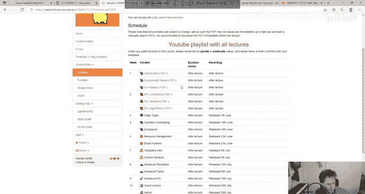

But。I wanted to add it because。The biggest struggle students usually have at the start of the course is that they kind of don't know how to get set up。

嗯。So we're going to help you get。Set up， basically。 now the C plus plus environment。

 This isn't referring to like something universal。 This is referring to like how to get set up in this course。

 if that makes sense。

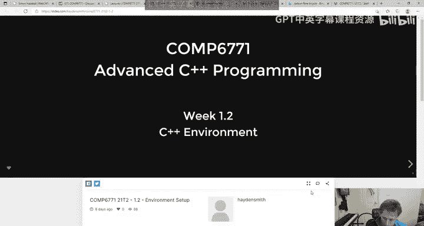

So it'll be three， you know， six， seven， seven， one specific。We want to get you familiar with Gitlab。

 We want to get you familiar with C++ compiling。🤧We want to build。

The first program and then test the first program basically。So Gitlab。

 I just referred to Gitlab in the previous lecture and you know just reminding you here that if you're not familiar with it。

 you can get familiar with it through La zero。Most of your work will appear in Gitlab already。

 we've already released Cheute1 and Cheute 2 and are releasing assignment one tomorrow so you can check up on that。

But we're going to compile our first program and you can actually do this on the CSE machine。

 you can do this on most Linux machine so if you have an Ubutu VM or Windows subsystem for Linux you can actually just do this straight away and we're going to do it on VLb together right so I'm just going to open up。

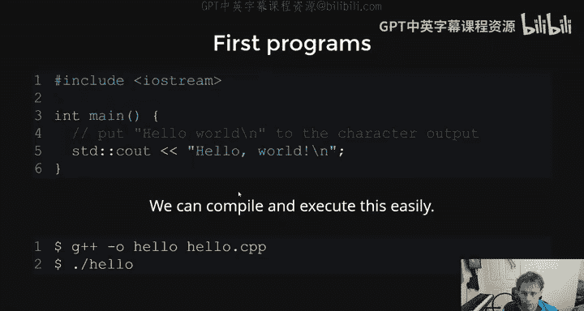

Two terminals here in。Vab。And then the first one I'm just going to make a file called file。

 cP and I'm literally going to take this and I'm going to paste it in here right Now I know we haven't talked about C plus plus yet。

 but as you can see immediately it looks very similar to C what are the two differences you notice compared to C well the first one is that instead of doing something like include Studo。

 H we're including IOstream So IOstream is input output stream and it's effectively the same thing as Studo dot H and that it's like you know it's about input and output it's just a C plus plus library of it。

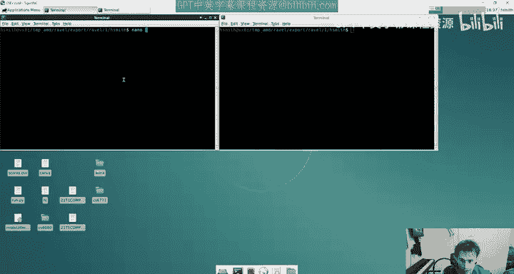

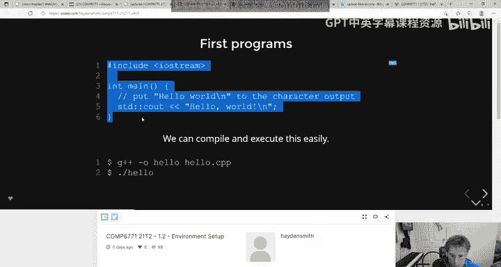

The other thing you'll notice is that instead of printf here， like maybe we'd say， you know。

 hello world。We actually have this STD colon Col， see out double arrow kind of thing， right？

And we're going to get more into this later， but the short answer is for now that when you print stuff in C plus+ you actually do it like this。

 Now again， I'm not demonstrating the language to you just yet。

 I'm just trying to show you how to compile something really basic。嗯。And。Yeah。

 that's really about it。 So like standard Sea art and then these two arrows are kind of saying print it there。

 So if you want to print out more things， I could like print out another thing like hello。嗯。

But again， we're not talking about printing right now。

 There's been a few questions in the chat about can you install stuff on Mac， You can do this on Mac。

 Yes， you can do it on Windows。 You can do it in lots of different systems。The thing about C++。

Is that it's a hardware specific language。 And that means that。Unlike Java and these other languages。

 which are run in a virtual machine essentially， or the Java virtual environment。

Can't remember what it's called JVM。 So is Java virtual machine。 I can't remember。

 I don't haven't touched Java for a long time。 C plus plus runs on the hardware。

 And that means that like different systems will have different compilers and they'll behave differently and blah blah。

 bla， bla bla。 so there's no short answer， but basically you can do this on different systems。

 I was just saying that you can do it on CSc and you can do it on Linux usually But let's let's look at our first program here。

 Now if I want to compile that。If I was to compile a C program。

 I would say Gcc dash out and then I would give it like file。c。W says take fileile。c。

 compile it to a binary that says out that's called out。With C+ plus it's actually really similar。

 I go a G++ and then I say dash O out to say that's the name of the output binary。

 I1 is called out and then I give it the file name file。cppP。Then it compiles。

 and then when I do dot slash out。It runs my program and you can see in this case it printed Ho world new line and then hello on the new line and then the terminal' is kind of funny here because there's no new line so I could go and add a new line there。

And then compile it again。And then run it again。And that's like the basics of compiling and running a C++ program。

Super simple and remember how I said that C plus bus is backwards compatible with C。Well。

I can show you this right here。 really quick。 Print that， hello。

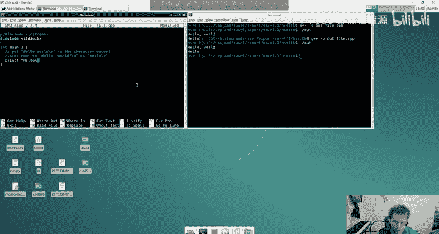

The G plus plus compiler will just compile that and run it。 So it's all backwards compatible with C。

Charlie says，Can I do this course by using VS code and SSH into the CSE system？Yes。I guess so。

In general， though， I'd probably just try and set it up。I don't know。 You can。 There's。

 there's a whole different ways you can do things。 It's just。

 it's really hard to support lots of different methods。

 So we generally support a abutu install where it's done locally on abutu， and we support a。

Like a V lab install and wool might help with other ones， but generally speaking like， you know。

 try and just dig on that on your own。And I'm sure students are post in the farm like we already had。

 we already had one kind student， I think it was Matthew。I can't even remember。Posted it somewhere。

I app pinned it。 No， I didn't thought I pinned it。

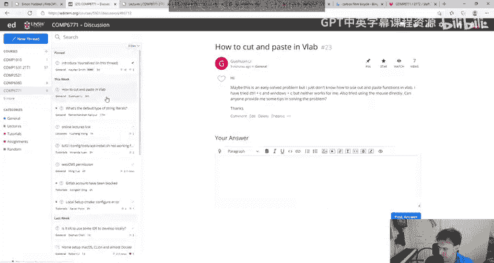

I'm so confused。Anyway， some posted a very nice。Helping hand for Mac stuff。Maybe I dreamt it。Oh。

 yeah， Robert。 I thought I pinned it。 Yeah， Robert posted some stuff about getting it on Mac O S X O S with a C line。

 which is a different editor of V S code。 I wouldn't touch that unless you're really confident with what you're doing。

嗯。Cool， so basic that's how you can policy+ plus program。😊，And。嗯。You can。

Do things with dot H files just like you're probably used to like I can take this program here I can make a file called age。

cppP I know the slides say doc file extensions don't really matter but it should be dot cP where I include i stream which helps me print something I include age。

 H just like in 1511 and then I have a main file and then I have my get age function which it calls like this is very C like right and I could add another one which is age。

h which just consists of this line here。

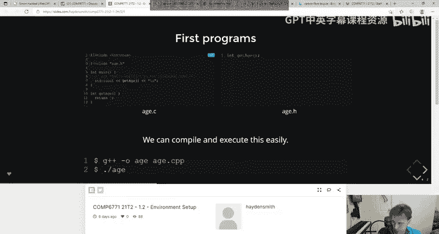

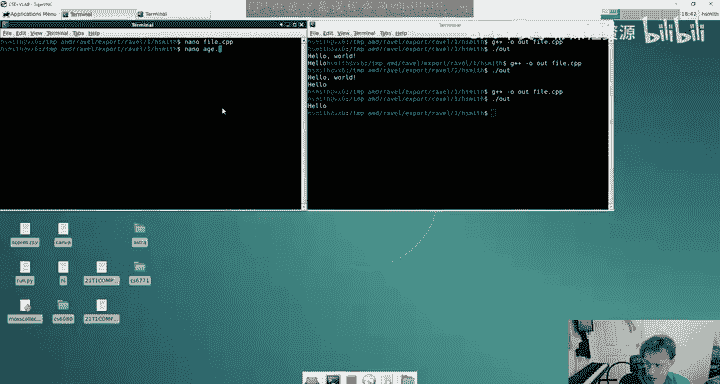

Right this is like my function header or prototype and then I can compile them same way dasho out age dot CPP done and then dot run out and there's my program right。

 it just prints out the return value of get age。So yeah， it's just very。

 very similar to see at the basic level。Now。嗯。You know this from courses like 2521。

If you want to make your code more complicated。In terms of compiling you know multiple files。

 it gets messy pretty quickly right So if instead of for instance having get age in this file。

 I wanted to include it in another file， say I call just one like age Lib， like age library。

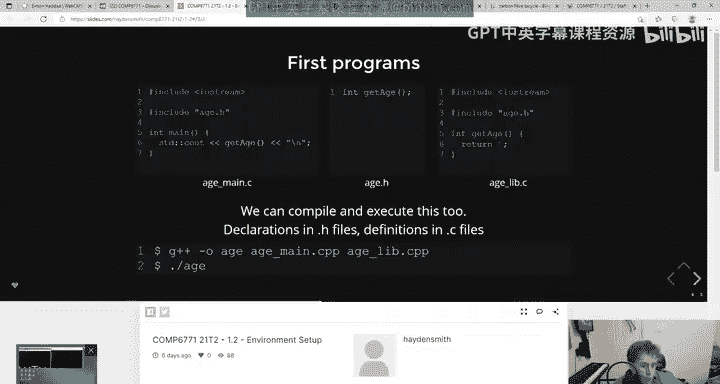

And this one just has this。 And it also includes the header。 Now， again。

 I'm not explaining this because you should be totally familiar with this based on the prereqs that you're required to do for this course。

 Now， I need to like， compile my age dot C， P P。With my agedlib dot CPP。

 and I'm using that dot H file。 So now when I compile it。

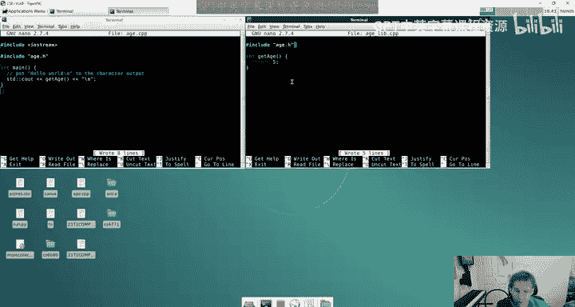

I have to give it two files age live like this。Now， this works。

 but suddenly you can see that the nature of compilation gets pretty。Intense， right。

 because we're adding two more things。 And then you can imagine very quickly。

 this kind of gets out of hand。So the problem with kind of like the classic method of compiling that youre probably used to is that the second you have thousands of headerophiles and CPP files or hundreds or dozens because you're working on a real world project that's super big。

 It gets really challenging because。There's a lot of dependencies to link。

 You have to make sure that they're linked in the right order。 You could use make files， which again。

 a bunch of you have used before， but problem is make files don't really scale too well。

 Like it's a pretty archaic way to。Improve things。 So like if you ever done an internship or you've worked at a lot of places。

 Well， most places， you would have seen that they use some kind of build system， right。

 Like if you've used Java， they'll use something like maven。C plus plus use a C make。

 which is what we're using。 And basically we're trying to find an automated way to combine lots of different files。

 Now you might be thinking， oh， well in this course。

 I'm only going to write a few files so like it doesn't really matter， right， Well。

 sort of but one of the key differences is that in a course like this。

 when we ask you to write tests， we're not going to get you to write them using asserts like you might have done in you know。

2，5，2 on or something。 We're going to ask you to essentially write them using a proper test framework。

 like an industry level test framework。 And those frameworks aren't built into C plus plus right。

 You actually have to like install them。You know， if you're using。

If you use like Python or JavaScriptscript before you have to add libraries right and then that gets complicated because with a language like C+ plus you have to add those libraries and then when you compile pile with it you have to it just gets crazy so that's why we use simple build systems and to manage this build systems for 67。

71 we're using CMake there are other build systems but CMakeake is just the one we've chosen。

Now this isn't a course on build systems， we're exposing you to it。

 but we're basically doing most of the work for you。

 but we're just explaining essentially like what this weird environment is you're working with。Now。

I mentioned this about。Build systems and using C make here and B， S code。

 But now what we're going to do is we'。Essentially going to I'm going to do a quick dry run setup of the environment for you if you've already done this then like props to you there's probably like 40 or 50 students that have done it but this course has like hundreds so I'm sorry for those who might be a bit bored for the next 10 minutes and we'll probably take a break after that。

Because I think we're at the end of the slides basically。 yeah， so this little bitll take a sec。

 So to get set up with this course。 And this is like for anyone watching this。

 this is like the one thing you should do this week even if you're even if you're a drop kick student who doesn't give a damn this is like the one thing you should be doing this week because like you need to get this set up to make sense of everything that's happening you go to tutorials。

 you open tutorial one I can't click on it because I'm staff， but it's basically this here。

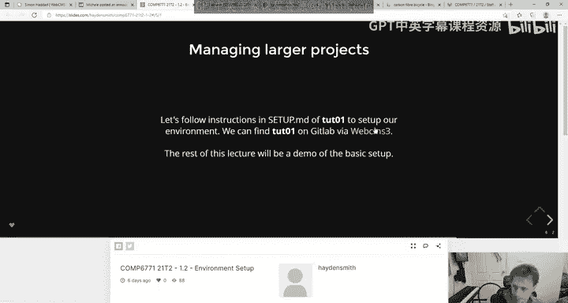

And then this is what you do。 I go to the Gitlab page。 I'm going to do this in Vlab。

 Now I understand some of you don't like using Vlab totally fine， I dig it。

 go set it up on an abutu VM or a Deian or something we have given you in the instructions here and。

Set up home。The thing， though， is。We expect everyone too have set it up on VLb anyway because that's why we're gonna be running it so like it's important that you check that your code works on VLab because C++ doesn't run in a virtual machine it runs directly on your hardware so you never know if something weird has happened but also like if you can't set it up at home you' got to just do it on VL like like。

I couldn't work on my home computer is not grounds for like special consideration， right。

 because you can always use VLB。Vyd says how important is the debug feature that's not very important。

 I wouldn't worry too much about it。Okay， so you open shootot one and you go to set dot M D。 Now。

 everything you need is in here to complete this tutorial， we recommend you use UnSW's Vla。

 which I've already got up here。 blah， bla b bla bla b bla， bla b。

 Now it shows you the first thing which is to clone it。 So if I'm on Vlab here。

 I'm just gonna close one of these。 I'm going make a new folder called CS S 6771， which I've made。

And then inside that folder， I'm going to。嗯。Go back here on the Cho one page。

 I'm going to click clone， I'm going to copy this URL。And then I'm going to go to VLB。

Why can't I go to VLB？I'ming to go to VLB and I'm going to go get to clone and then I'm going to paste that URL。

Now， if you haven't added your SSH key to Gitlab or if you don't know what that means。

 you're going to have to go back to La0 and have a look at it right because that's kind of part of lab zero we're assuming that you're kind of set up on Gitb at this case。

 which is something most undergrads should be。Yeah。

 pretty familiar Ram says as a font size set to 20 and every tutorials VS code dot VS code on purpose。

 I don't know。 I didn't actually make that config， but I'll take a look at it。

 So now we've done that first part。 we've downloaded the tutorial repository onto like our system Now it says in your terminal navigate to the directory you've coin your repository to Now what that means is that I have to now go inside the ch1 folder which has all the ch one。

 You notice all the files here are the same as。All the files here。

 because we've copied what's on Gitlab to our machine。 and then it says run， bash this。

 So I'm just going copy and paste it。

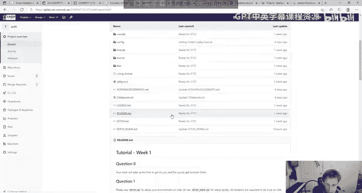

Go to put it here， paste。Go to run that。It's going to go do stuff。

My kind of heads in the way I'm going to make my head smaller so you can see I'll just move my head over here or something。

Now I've already kind of done this little bit， so like it'll be a little bit quicker for me。

But essentially that it's going to do a whole bunch of stuff。

 Sometimes it like might wait a little while， like it may take a few minutes。

 you'll see a whole bunch of notifications appear down the bottom here and they'll eventually disappear once they disappear。

We ask you to close VS code you sometimes don't need to do this。

 but it's just safer if we tell everyone to do it， so you close VS code then the next step is to run code dot Now code is the terminal command to run VS code and dot means this folder you're basically saying hi VS code can you open your program with all the files in this current folder。

 so I do code dot。

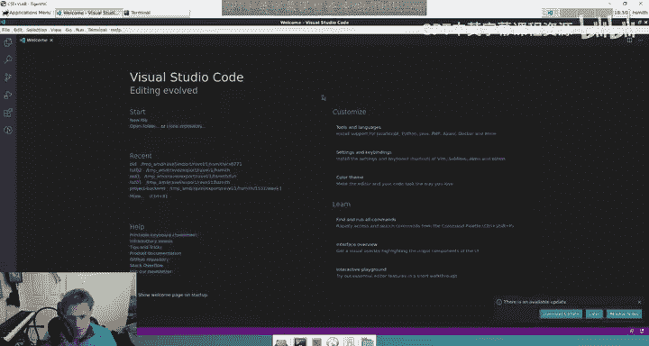

Now that all comes up。Now。We say press control shift P。And then you select a kit， right， type。

 you start typing in C make or C make， select a kit。 So I could do that。 I could do that here， right。

 I go control shift P。I just like select a kit and then that comes up I click enter and then you'll see there's a whole bunch of things here and I just choose the one that says comp 6771 because that's the one that was kind of installed in the previous step。

So I do that。 and then， you know it did a little loady thing and updates。 I just click later。

 ignore those。Yeah， blah blah， blah the contents of the dropdown。 like 6，7，7，1。

 And then we do C make configure， and we press enter。 So we do control Shi P， C make and。

 press enter。Now you only have to do this these steps here once per lab shoot basically or assignment so it's like you don't have to like set this up every time you load it up。

 it's like for ch one， you do this once for assignment one you do it once。

You can skip some steps sometimes again。 but like we're just keeping the instructions quite simple。

 it says generating done。 So I go great。 That's good。

 An output window should appear detailing the configuration process blah bh， bh， bh。

 bh Now that we've configured the project， we need to restart our editor and have our extensions pick up the new directory。

 So basically because we've configured some stuff， we need to like reload VS codes。

 I go control shift P and type in reload and hit enter。😊，refreshfrees everything。

And then we're good to go。

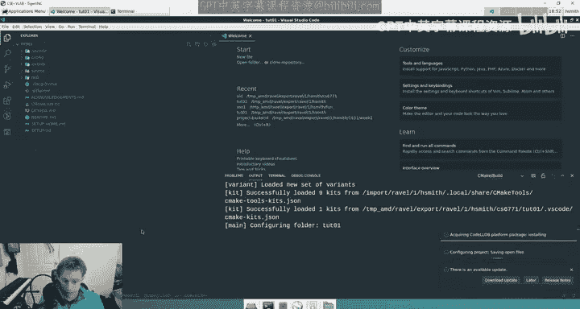

Super good to go。 That was really easy。嗯。Now。We're going to try and build。

A basic C plus plus program。 Before we do that， let's have a little a little bit of a look at the folder structure。

 So inside of here， you can see that all of the code is sitting inside a source folder So this is all shoot one and inside the source folder。

 you'll see that there's a whole bunch of little files Now if I open hello do cP here you'll actually see there's a really simple C plus program Now for this first lecture I've decided to do the environment before we learn about the language because I think with your C knowledge even if you don't fully understand like this syntax。

 this program makes sense right， like it's a main function。 It's got two numbers。

 you sum them together and you get an output The question is how do we build this because like sure you can go to the terminal here and I can navigate to the folder and I can do what we did before where I say G plus plus dash out hello do cP and then I can run it Great but this won't work for lots of other cases。

 So we need we need to learn how to work inside this environment that we've provided to you。

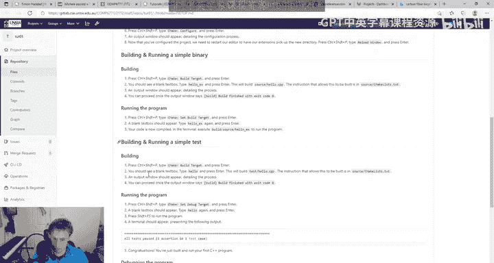

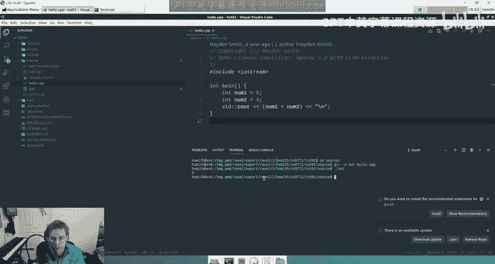

And to do that， we're going to follow the instructions。And it says。

Press control shiftP type CMake build target and press enter， and then it says you'll see a text box。

 type in hellello X， which is executable and press enter this will build source/hello。cPP。

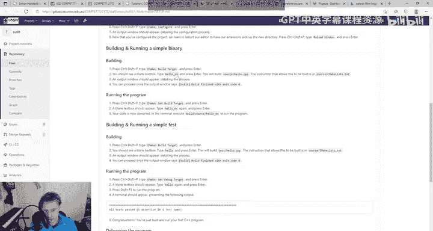

Okay， let's try that。Control shift P， build， target and。Hello。It does a bunch of stuff here。

 it executes some command， it's building， and it says build finish with Exo code0。

 which you know means success。How do we run it。 Well， that's the next step。

 The first question that I want to answer is how the hell did it know that that compiles that right Like where is that configured and that's configured inside of source slash CMake list。

 So in most folders in these projects you'll see that there's a CMake list file。

 and this is basically metadata or instructions for CMake so it knows how to compile your stuff。

 Now there's a whole bunch of detail here that you don't need to worry about。

 But essentially every time we make a new C plus plus file we have to add an entry here。

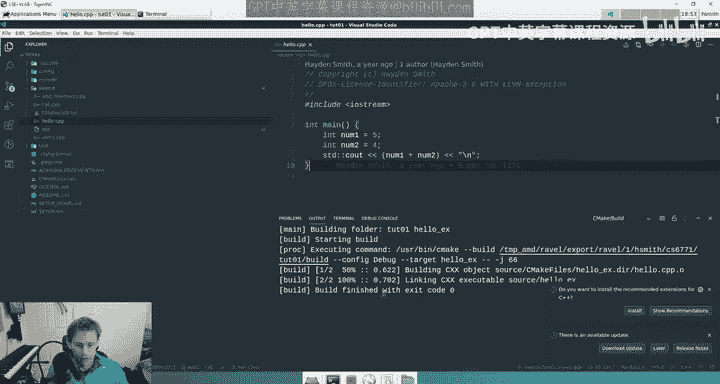

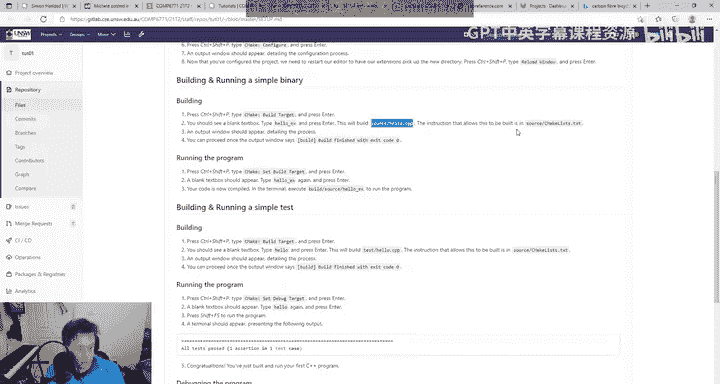

Now in a lot of the early labs and stuff you don't need to touch these files。

 but I think it's important you understand them， So what happens is when we try and compile Ho underscore X it knows to try and compile this file for us。

 So for instance， if I make another file。

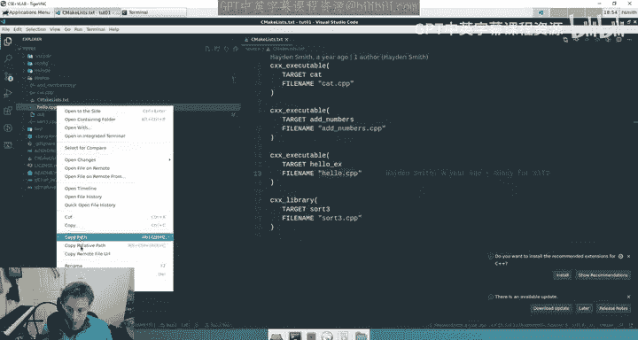

I'm going to open this one， make another file called Hello2。

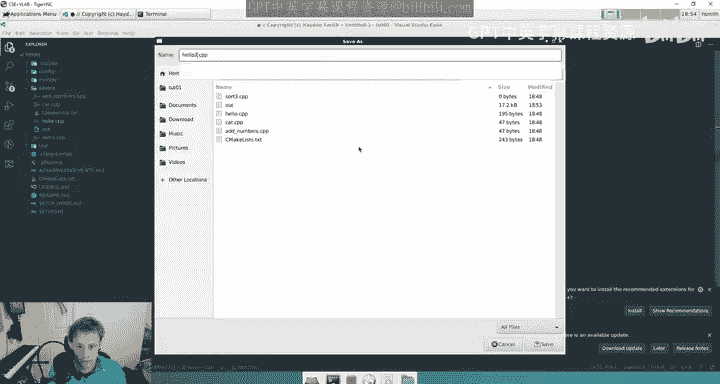

In that same folder。And this one's going to be the sum of， 11 and 15。I can't just compile that。

 I have to actually add an entry so that CMake knows how that's compiled。

 And I just want to stress you don't have to do this part right away。

 I'm just giving you a demonstration。 So I would copy and paste that。

 I might call that hello X2 and it will compile Ho X2。

 And then every time I update my C make list file， I need to do a control shift P and reload。

 If this is a little bit fast for people。 That's okay。 I'm aware that this is being recorded。

 So I'm aware people can pause and stuff。 That's why I kind of just move through things like clearly but not like taking huge breaks。

I need to reload it because until you reload it， the actual VS code does not pick up what's in the C Makelist file and now I can do control shift P。

 build target， and then I can type in Hello X2。

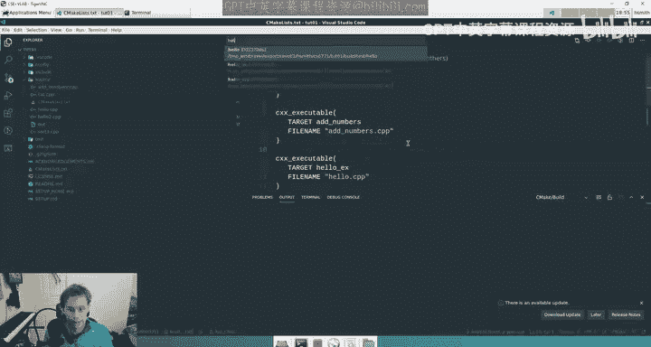

And now that will build the other file。Now the question is I've built it， but how do I run it right。

 because buildings one thing， you know how to compile that you have to run your compiled code。

And the next step here。Is。去。啊。I nowm wondering if I've got a mistake here。

I actually think these two steps are kind of redundant。

 I'm sorry I might have accidentally left them in。 I added more instructions to this whole thing this time。

I don't think you have to do this step。 It's not gonna to cause you harm。

 but it's kind of like doing the yeah， don't worry about these two。 I'll remove them from the tube。

 But the next thing to do to run the program is you basically navigate to where the binary is。

 So what happens is this file here， hello2 is in the folder source s hello2 do cP but I can run that by going to the terminal and simply running build slash source slash hello like this。

 So all the time every time you build a c plus plus file it basically builds it to like the same folder structure just with build in front of it。

 So that's where all the binaries go。 So when I run that I get。

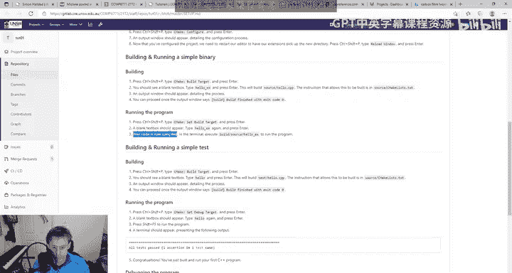

No。There's a hello X， sorry。Yeah。Hello X because that was the name of the the thing here。

 the target name。 And then if I want to do the other one， I do Hello X2， which we also built， right。

 So like we compiled those。 and that's where C make put them and put them in that build folder there。

That's the basics of like combining like we make it pretty easy just。You know。

 if I want to compile like and you'll do this for the lab like the ch， sorry with your tutor。

 if I want to compile cat， I just like to， you know build cat and then a builds and then to run it。

 I just go to the terminal and I just type in like build slash slash cat and then it runs the cat program。

 Like's it's very similar There's just a structure to it。

 Kai says where's the build folder though I can't see it in your file Explorr Now I will first preface my answer by saying I don't code in VS code outside of the uni because I'm a dinosaur。

 but I'm pretty sure。That it might just be hidden because V S code is aware that it's a build folder。

 which often people don't want to like play around with。Maybe it's because it's in the getig。

I don't know。 It'll be something like that， but basically like BS code is somehow aware。

 I think that it's not。Or maybe just not refreshed， that could be the other answer。Not， can't say it。

What variable naming convention do we use in the course Cheel case or underscores I'm pretty sure our style guide says underscores there's a style guide on Web CMm3。

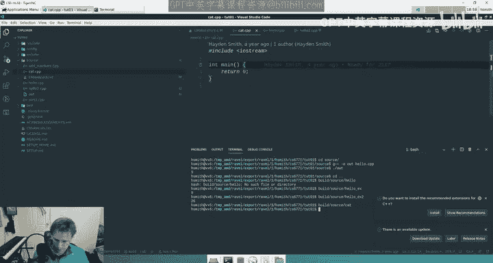

Its pretty light， God， to be honest。We don't really mark convention in this course like it's not like a first year course where like we expect you to follow like all these specific conventions like there's some things here you know like。

😊，はい。Like I wouldn't read this too extensively。 It's like like the the kind of like， okay。

 when we mark your assignment。嗯。We。What we do is we mark， we auto market it。

 we mark the quality of your tests。And then we do two pieces of manual marking。

 The first one is for your style。 and I'll talk about this more tomorrow。

 But like the first one is the quality of your style and the second ones like your C plus plus conventions。

 Now， your C plus plus conventions are basically us expecting you to use like modern C plus plus methods。

 not something that would have been written in the 90s and not something that looks like C right。

 that's like using the right function and we'll explain that to you as we go。 The style stuff。

 though， is basically like， were there comments。Did you apply consistency to your style。

 It's not going to be things like， oh， they use the wrong type indenting or give them 0。

 But there's more to say on that style topic。It's a lot easier than it sounds。

 but I want to save that till tomorrow okay？Richard says if we have problems using the editor environment。

 is it safe to just redo the installation and configuration steps， yes。

 and if you run into problems with that you can usually just torch everything like you can usually just like start deleting。

😊。

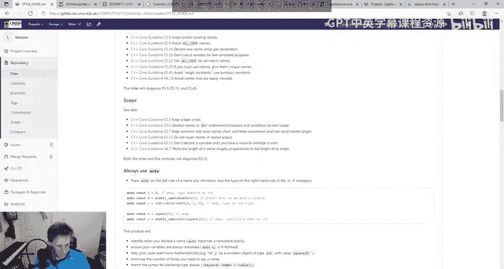

Tons of files like you can just start deleting like dot Vs code and。

DotYou can just start deleting everything really。If you have your actual assignment work backed up somewhere。

 it's all in Gitlab anyway， then you can usually safely delete your home folder。

 I usually delete everything in my home folder about once a year。But back to Ka's question。

 why don't you need dot build。 I think that's an interesting question。

 I don't think that's a C plus plus specific question， but it's like。Why can I run this？ Now。

 the reason， the reason that。In earlier courses， we expect students to do like hello this like this is。

If you don't have that， standard terminal expects it to be an executable in in a number of predetermined folders。

 But when you put this here， you're basically telling the computer No， no， no， no。

 it's not executable in one of the magic folders。 It is。Like in this folder right here， the thing。

 though， is when you start a command with build slash something。

There are no like executables on Linux that have slashes in them。 So basically。

 just by virtue of the fact that I've written like a folder structure here， Linux is like， oh， okay。

 this is not a command。 Like this is not a system command in in in the path somewhere。 Yeah， Also。

 you can safely ignore a lot of these things。 I just closed them。 There was another question。

 style guides hidden。

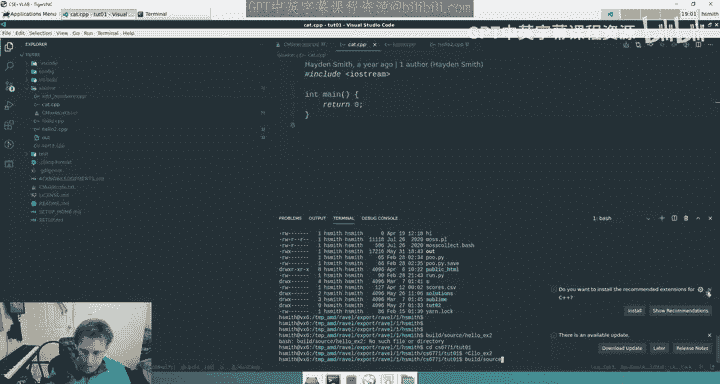

Is it。Did I， did I make the page hidden， I'm sorry if I did。Oh why can't you see it？

Is the lectures repo or hidden。Oh， no， I'm a bad person。

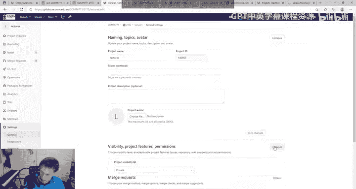

Sorry， sorry， yeah， sorry。

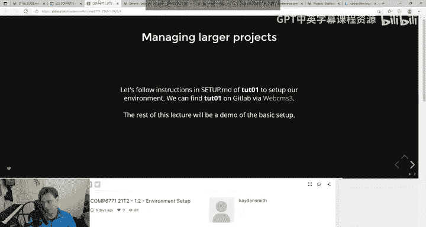

O。嗯。Sweet， let's keep looking at the instructions。 We'll take a break soon。

 and then we'll get into some C plus plus stuff。We have a lot to get through tomorrow。

 We probably won't。 We' probably have to go under next week， but it'll be fine。

 The last thing I want to show show you。😊，That is just testing。

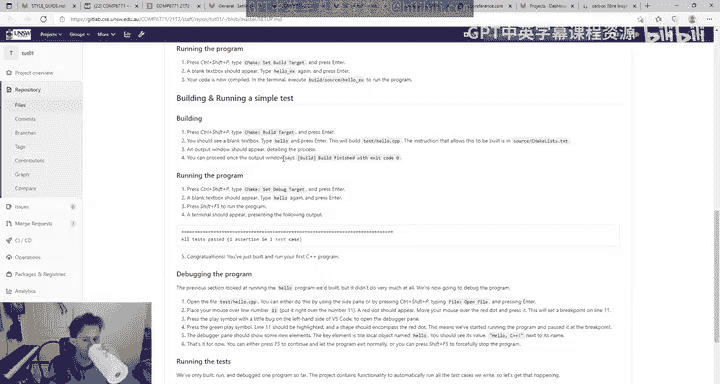

嗯。InC++。We don't just have all these like C plus plus files like you're used to in C。

We also have some test files。 So， for instance， I have this Ho test file where we're using a test framework called catch2。

 And this is the framework we'll use in the course。 Now。

 you don't need to know everything about this framework。

We will handhold you through some elements of it， but generally speaking。

This framework allows you to kind of write C+ plus ask things and do things like assertts。🤢。

To check if things work in your program so。Here is a very， very simple。

See plus plus program and this string here isn't needed， sorry。I have a test case。

 This is the name of the test case。 And then what I'm doing is I'm making two"s。

 and then I'm checking。If sum of those two in is equal than9。Now how do I run that test case Well。

 as you can see here in the CMMake list in that folder， I have a file here called Hello。cP。Now。

I actually just realized that I think this is the one part of all the lectures I didn't sendche and it's kind of good because I can actually show you what's wrong here。

 But if I want to run that and make it work， I could do my standard know build I could do hello and you'll see here have a look these have a look at these entries here。

 We have hello X。 we have hello X2 and then we have this one up here hello and it's in build tests s hello So VS code is aware of all of the targets。

 all of the potential compiled pieces of work that。You know， might be named Ho， when I click on that。

What happens is it will try and compile it and it's probably going to fail。

You can say it's like doing some stuff here。Sometimes it's though， oh， it worked。 Why did it work？

Didn't think it would work。Oh， I kind of know why it worked okay。Anyway， okay， I did check this one。

 there's one thing I didn't check。'll， It'll find me。 Fson says。

 where is catch2 slash catch do H T H H PP stored。 So we're including catch2 slash catch dot H P P。

 Now， what I want to kind of explain to you is that。In C， you've done things like include St do H。

 Where is St H stored。 It's stored somewhere in a library。 Do you know where it is。 No， you don't。

 Could you look it up， Probably， Does it matter， Not really catch2 slash catch do H P the same thing。

 The difference is we had to download that library。 It's not core to C plus plus。

 It's like a Pip3 install or something， right It's， it's something extra。 Now。

 the reason we use programs like C make or sorry， build systems like C make is that C make is able to like download this for us。

And compile with it for us。 Like， we don't need to do a ton of work。 Now。

 you don't need to understand how that works。 There's all this stuff here that makes it work that you don't need to touch。

 But the point is catch 2 is not part of like， like if you took this code。

 like just to show you and you tried to just like compile this on CSE's machine。 Like you were like。

 hello， like you you know， sad dot CP and you just like pasted this in。

And then you just like did G plus plus sad cP。 It would just be like what the hell is that。

 I have no idea what that is。 So that's why we use build systems because it allows us to make more complex code and do it in an easy way。

 this is how you write a test file。 Now test files are just normal executable files right they're built and then you can run them。

 And they're a lot like what you would have done with asserterts。

 It's just this is a bit more advanced。 So we have things here like you know this is a test case and then we do checks。

 and we might do other checks， right Like we can check that it's not equal to5。

 That's a stupid check。 But you know we could do that。 And then we could build it。

 And then how do you run it。 Well， you can run it a similar way to what we did before where you go build s test s hello。

Like that， and it'll say all tests passed。Running asserts essentially in the background。

And that's kind of how you do a basic test file。 Now， someone's asked in the chat。

What's the difference between the H PP and a dot H file， Nothing。

 I think dot H is the general convention。 I think most dots。

 I think it's dot CPP for C plus plus files and dot H for。Did dot H files and C plus plus。

 though I think you'll see dot HPP somewhere。 I don't think like one is terrible。

 I think dot H is more。Generally accepted， I think， from what I understand。U。

We can also actually run all of our tests。I think I'm not going to get more into this bottom part you can play around with that yourself and we can maybe chat about it later。

 but there's a shorthand where you can also do control shift P anytime you see this men you come up I've typed in control shift P and you can actually do run tests。

 which I think will compile all the tests and run them。Not sure， yeah。

 I think it compiles all of the tests in the folder。Like you can see here。

 it's compiling the sort  three test and the the hello test。 These are the two main tests。

 and you can see that it。R them all and they all passed So if you want to you can just write run tests and it will compile all the tests。

 How does it know that they tests well if you actually go look at the CMMake list file。

 notice how all of the dot cP files we had that were just int means they were Cxxs in C++ executable whereas if you go to the test folder notice that in here the two tests are written Cxx test So if I change one of these executable it wouldn't work。

嗯。Your tutor will hopefully talk more in the tutor about linking files and stuff。

Essentially like the last comment I make before we take a break is like you're familiar that。

When you。Like remember how we did that install before where we had to like compile two programs it was like like Carcpp and carlib。

cppP or something That's a process called linking where you take two files and two compiled pieces of code and you link them together you actually have to do a similar thing in the CMake list file here where like if you have like a test file that is compiled with another CppP file you have to link them in the CMake list again。

 you don't have to do any of this。Becauseuse we've done it for you。

 I'm just explaining it because I think it's a common headache we have for students as they're like。

 I don't understand what's happening。 since there's no kind of backlog of questions。

 Let's take a fiveish minute break till like7。16 or something like that。

 And then we'll get into the C+ plus basics， which will keep us busy tonight and tomorrow night。

 but that's yeah， that's pretty much it on the environment setup so thanks everyone。

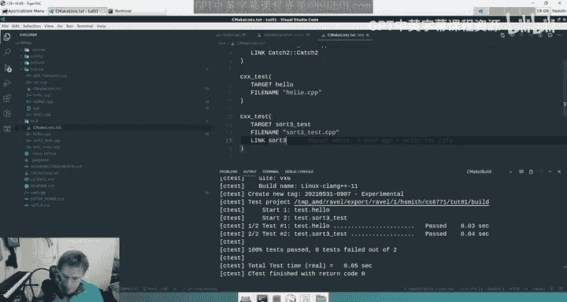