# UNSW《高级C++编程｜Advanced C++ Programming COMP6771 21T2》中英字幕（claude-3.7-s - P3：-03-COMP6771 21T2 - 1.3.1 - C++ Basics (Part 1).zh_en - GPT中英字幕课程资源 - BV1NGQcYLEiV

Cool， hi everyone。Notice my webcam， sometimes。Nes a moment。

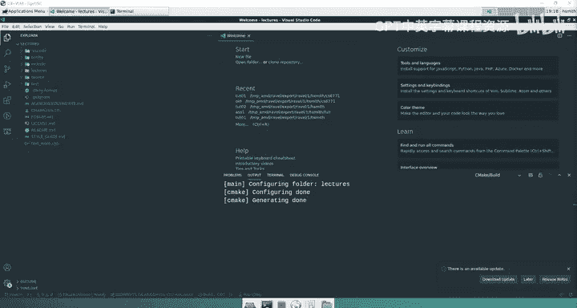

So。Lots of stuff。 I might not， I might not run all of this code Now just to be clear。

 all of this code has actually run the bull I've actually opened up the lectures repo here。

 You can find the lectures repo by going to this link here and cloning this link and I'm literally going through all the lectures in lecture dash1 today。

 You can go and find all of these。 These are all the the things we're going through。

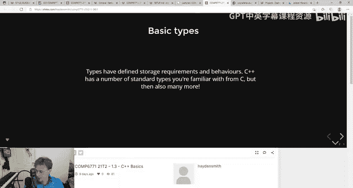

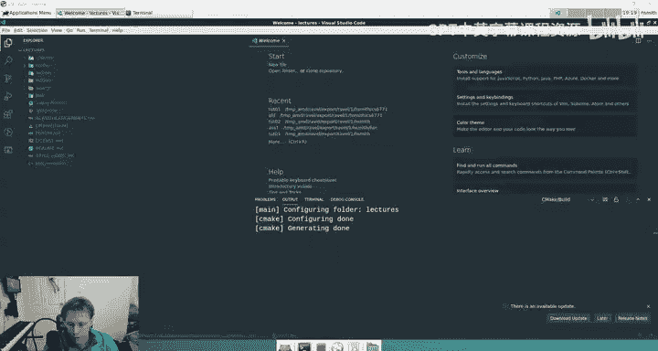

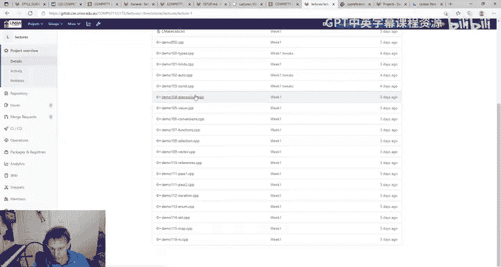

But， you know， yes， they're all on the slide so。

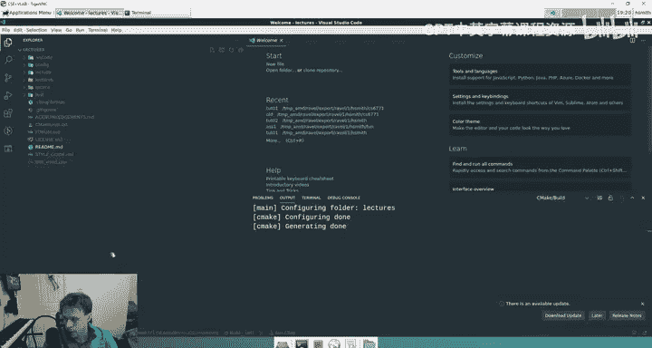

Firstly， basic types， what types are there in C++？You're probably familiar with types from a language like C like int and double and cha。

 you know that there's not types like there's no bulls， for instance， in C。

 you use like ins for that。嗯。But in C plus plus。These are kind of some of the basic types we're dealing with。

 So firstly we have ins we have doubles just like you'd expect this right here is basically just writing some testing code。

 So like you don't need to worry about this like this is if you were writing a test we also have strings So in C plus plus is actually a notion of a string so C plus plus strings are。

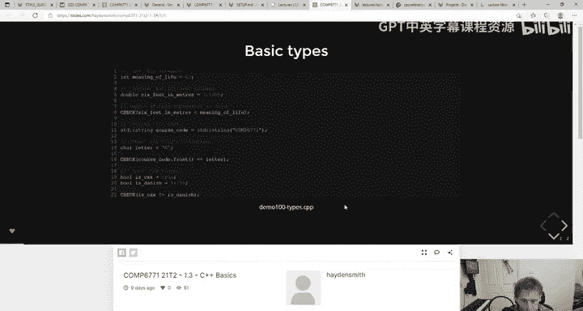

In terms of usage a lot closer to what you might be familiar with with Java， for instance。

 rather than rather than like C So it still is obviously going to be an array of characters under the hood just like I think that's true for pretty much all languages but you deal with it a little bit more like a Java string right so this probably looks like a Java string We have like the string type and C plus plus is STD colon and colon string we'll keep talking about what that STD means and then you just make a new object So one thing that like。

One thing that's also important to understand about C plus plus types is that it is also a little bit like Java in the sense that you do have a handful of primitive types like int and double and ball and stuff like you see here in char but all the other types are essentially objects。

 and you're familiar with objects because of a course like 2511 or the prere and that means that when I say standard string here。

 I'm actually instantiating a new object of some kind of class type that's written in a library So same as kind of Java stuff。

 And that's also why you see here that for our type like course code。

 I can do things like called dot front on it because it's just like Python。

 it's just like Java a string is an object whereas in C when we deal with strings。

 they're actually just char arrays。 They're not an object they're just an array。

 It's a primitive type， but here they're actual objects。

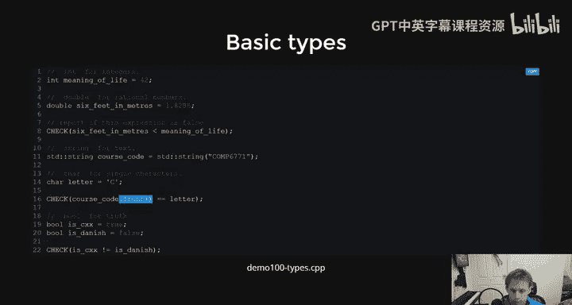

So this code here is written inside of。Lecture one types。

So this one's actually written as a test case， so a lot of the first week lectures we've opted to write the sample code like the lecture code as tests to kind of just get you familiar with like what writing test looks like because it's going to be in the first assignment you know so。

knowTo run something like this， for instance， you would just say， you know build， target。

 demo demo 10，0， you'd run it， it would compile。It's still compiling here。 See there。

 it's like still compiling。 I'd have to wait for that to be done。

Sometimes first compilations can take a while because it's probably because it's like having to compile it with catch2。

 the testing framework I think I kind of skipped over this in the last lecture too。

 but you can kind of look up the catch2 framework on the internet if you want to get like more familiar with the syntax。

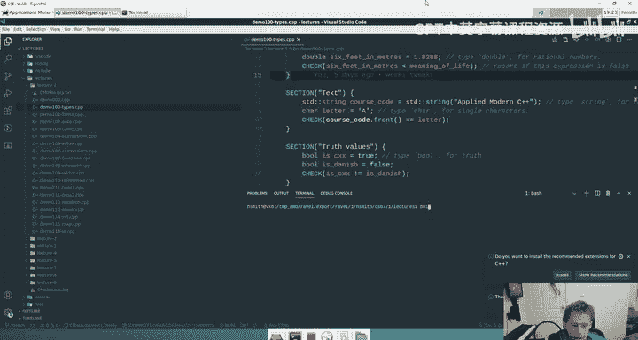

But generally speaking， like the samples that we have in the lectures will be like a good place to start。

 And only once you start writing a lot of a lot of code。

 will you want to actually go and like try and have a look at the， the references。 Yeah。

 I think there's like this is the whole doc that。Most of this you won't need。

 so I'm just letting you know now， generally speaking， you can just follow the patterns we've got。

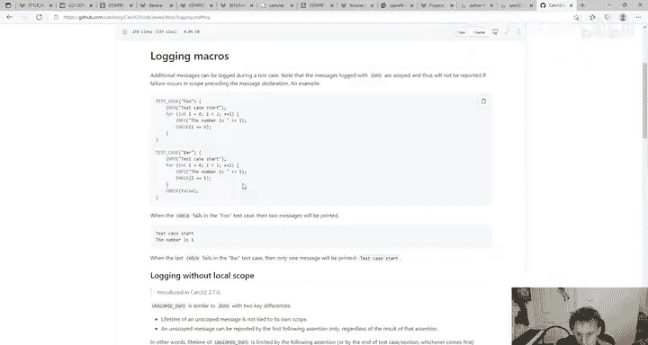

嗯。

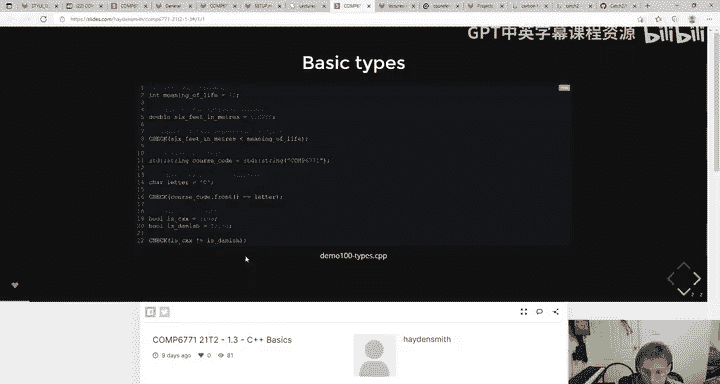

Sorry I was compiling and running code， right， so build slash test slash test 100。What is it， De 100。

 sorry。嗯。

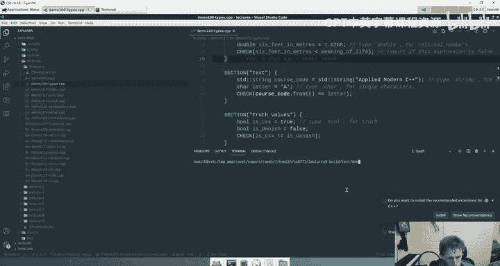

What's wrong， What am I doing， Oh， I need to。No I confused builds build slash lectures slash lecture 1 slash demo 100。

 So notice this here as well， is that。In the previous tu we had all of our files inside of the test folder。

 whereas here we have our files inside of lecture/ lecture1 so when I want to run that binary directly I have to go build/lash lecture/ lecture one and then the name of the file and then it says all test pass。

嗯。FIyn says so it's cache to actually stored it locally like other Lib files or does CMake like download it will CMake downloads it and then compiles it like if it doesn't have it。

 CMake will download it， I believe。嗯。Could be wrong， I don't know， but I'm pretty sure it does。

I'm sorry that I'm not 100% certain， I just haven't bothered to ever ask that question either。

So there's some basic types， really simple now we'll be able to breeze through some of these other bits more。

One thing I do want to point out， which I think is an interesting little you know。

 knit of C plus plus is again， it's a。Hardware specific language， right， And what that means is that。

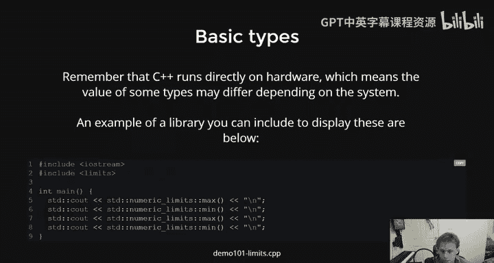

Unlike Java， as we've talked about， things like ints will be different sizes。 So， for instance。

 if I like。

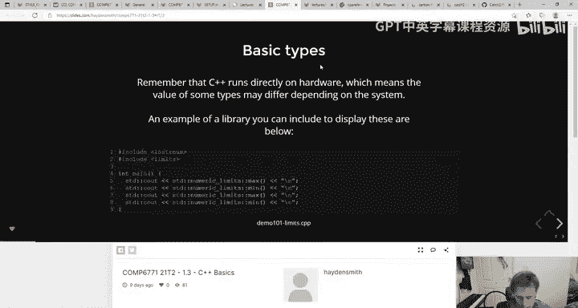

Google like like inside C plus plus， let me go to Google here。嗯。I。

 I don't know what specific link I'm looking for。But。There's like。

This is why you don't do impromptu stuff during lectures。 but。

 you can Google this stuff and you'll find that like basically like。On some machines。

 I think it's a long， I think it's like C++ integer types。Nummeric type， sorry。Like。

 so on 64 B machines， I'm pretty sure that there's a different size。

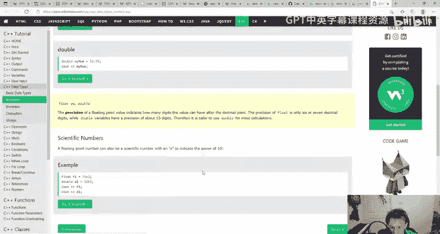

For an int than on other machine， like a 32 B machine where it's like 4 bys。 And I think it's a long。

So I think like insro is4 bytes， but like longs can be 8 bytes on 64 bit machines and it can be like 4 bys on a 32 B machine or something like that。

 So it's just important to understand that because unlike a different language that is wrapped in a VM C++ will actually have specific limits so there's these little pieces of code you can run which I know don't make a lot of sense to you right now but if I was to run this one here demo 101。

This will actually print out what the maximum and minimum size of an antenna double is on your machine so I could actually you know here。

 for instance， run up to get rid of this。Demo 101 and it'll actually show you the maximum int you can get is that and the minimum you can get is that and the maximum w you can get is 1。

797 to the power know times 10 to the power of 308 and that's the minimum right？😊。

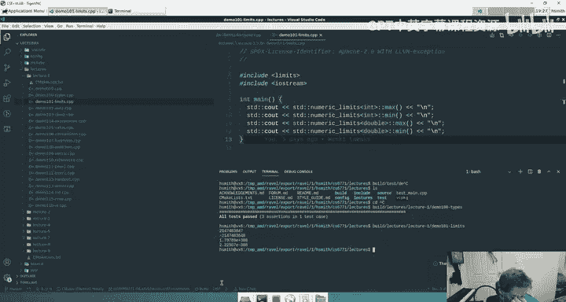

嗯。That will vary on different machines。 and that's why languages like this are both faster and harder to programming in sometimes in something like Java。

 Now Kays asked a question here which is what's the difference between dot and colon Now that's a great question because I know some of you are familiar with languages like Python or like Java。

 which will use dots。Generally speaking。The double colon is。

Not so much like a dot because like the behavior of dots is pretty similar in C+ plus right like a dot is how you have an object and you invoke a property or a method of that object。

 So like something like this here like course code dot front。Makes sense， right it's just like， okay。

 the course code is a string object。 And then it has a dot front method。 Now， again， you know。

 in Java， if you were to do something I again， haven't written Java in like five years。

 but I think it's like if youre like string string equals a new string。 hello。

 I think that's Java right， You're creating a string object。 And there's the Java doc。

 which shows you that in C plus plus and I'll just show you this here while we're keeping to the really basic example。

 oops， that's the wrong thing。 So just by the way， every time you Google something with C plus plus。

 you're gonna get two links， you're gonna get this C plus plus do com link and you're gonna get the cP reference do com link generally speaking。

 the course staff don't like this website， don't think it's very good。

 So always look for the cP reference site。 you're probably gonna get the same information on both。

 So don't stress out too much。 but you know。We， we have our preferences。

 and it's gonna to be a whole lot of garbage here and stuff that doesn't even fully make sense to me。

 Like I don't even know what the hell this is trying to explain。

 I could probably figure it out if I thought about it。

 It's all a bit confusing and we're going keep coming back to this the entire course， but。

You'll see things here that are very Java doc like， for instance， member functions。

 There's the front function。 So like for a string， you can get the front of a string。

 You can get the back of a string。 You can get the。

You can get a pointer to the first character of a string。 You can get the size of the string。

 like there's tons of stuff you can do。 It's like an object。I can get。The front。

 and when I click on that， it'll tell me， you know， this is how you invoke it。

 It returns you a cha tea， whatever that is。A character， I'm not really sure the subtleties of that。

Yeah， it gives you some behavior of it。 So it's a pretty good library compared to some other languages now。

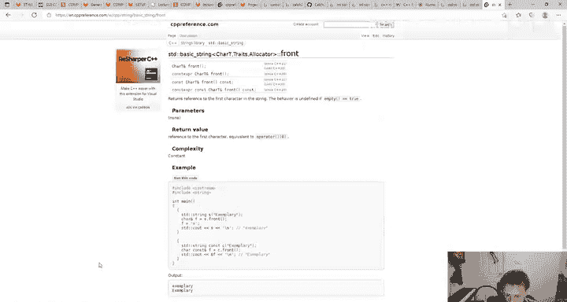

The double colon is essentially a scoping mechanism。And what that means is that。🤢，And again。

 you might be familiar with this from Java。 like if you。

 if you have Java and you have a string and you have a， a static member of a string， you know。

 like maybe string dot like max length or something， right。

Max length is essentially a property that's part of the string class in Java。

 which makes it a variable in the scope of a string。

 the class scope of a string right in C++ we use double coal on a lot to say scopepe essentially what we're saying here then is that we have a name called string but it exists inside of the STD scope。

We're going to be talking more about this next week。

 but basically all of the standard main C+ plus things you use will be inside of STD。

 so a lot of like the core functions and data structures you will write STD。

 colon and colon and in the name of it。🤢，That'll make more sense as time goes on in the meantime just ride it。

Yeah， most objects you work with will have that STD。Okay。Moving on。Next part。Aut。

 so we talked about some basic types。 I'm sure that you could write some really simple things in C++。

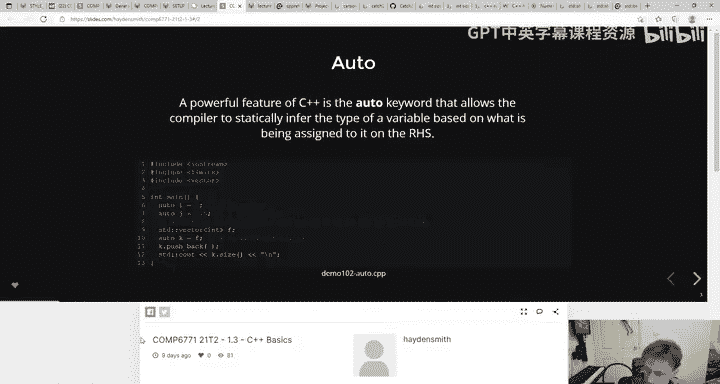

嗯。Like， you know， some two numbers or print out a string or do something like this， get a string。

 get the first character， check if it's the same right。

 we're getting the first character of this string but。To get into some new features of C++。

 one of the most important and relevant ones is the use of auto。 Now， as you know。

 C++ is a statically type language。 I mean， maybe you didn't know that， but like it's like C right。

 C is statically typed it It's as strict typing。 you need to the compiler needs to know the type of all like variables and。

Things being operated on at compile time。That's sometimes annoying to write things out。 Now， again。

 you might be thinking。That isn't too annoying。 I don't mind writing int， but again。

 if you think back to Java justca it's an easy example， it's all fine in Java until you're like。

 you know， I have an array list of an array list of a string。Called cat。

 which is equal to a new array list of array list of string like right until you start doing something like this。

 And it becomes quite cumber in then because you're like the left hand side should be totally determined by the right hand side。

 Like if you know the right hand side is this object。

 Then when you're assigning this object to the left hand side。

 you should know it's a goddamn array list of array list。 Like we know that。

 So I don't need to tell you that。 I just want to say like， you know， figure it out。

 And that's essentially what auto is in C plus plus。It。

 it allows the compiler to make a decision on the type of the left hand side variable。

Based on the value of the right hand side。And it always happens during declaration。

 So if you remember from C， right， if you do this， this is what we would typically call declaration。

 and then we would call this initialization。 The rules surrounding auto are quite simple。

Auto can only happen at declaration， right Because once you declare a type of a variable。

 it stays that way。 I can't now say auto I equals 5。

5 or something because it's already been declared。 right， It's a red declarationlar error。

 The other thing about auto is that。When you replace this with auto。

 you can no longer declare without an initialization or what we call a definition immediately after that。

 So I can't just say auto I the same way I can say In because with Inti。

 I knows it's an int with auto eye， it's wanting to make sense of it based on what's on the right hand side。

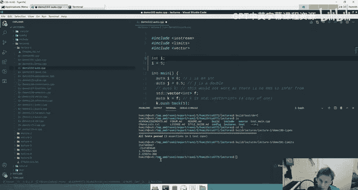

But there is no right hand side so it freaks out。 that's like， oh， I don't know。嗯。

So you'll see some examples here， we have auto i equals0 because zero is an in it will set I in in。

 J equals 8。5 8。5 is going to be a double。I think it's a double。 I mean， I guess it might be a float。

 I think C plus plus might just default to double because it has a higher precision than float。

You can also see here that if I create a standard vector of ins。

 which is something we're going to chat about later， but this is basically an array。

 like if if you just think about it like this is really the equivalent of array list。

But we'll be talking about that in later examples。If we create like a list or an array of integers called F。

 and then I say auto k equals F。like K will be a vector events。

 it' will be a list of events right because it uses the right hand side to deduce the left hand side。

嗯。So that's kind of the gist of auto。 Ifan has said。

 do we get performance penalty if we use a lot of auto， No， you don't。

 auto is considered good practice。 We actually give you we'll give you a oh sorry performance penalty gotcha。

 Well let me let me first say Auto is an expected convention of how we want you to code。

 So if you don't use auto when you could have used it， you'll get in trouble。

Because it makes code cleaner， it makes you less likely to make mistakes。

 just it's generally well accepted。 It doesn't totally eradicate the need to use types anywhere。

 Of course， like everything is still typed or is just helping you say to the compiler。

 I've really given you enough information， I don't need to write this out for you again。嗯。

Arthur says does auto work if the variable is assigned to something that can't be determined at compile time EG user input？

Well， sort of， but。Like user input is always going to be a type right like if you're reading in user input。

 it's going to come in the form of a string or a char。

 so the way you receive user input is still known at compile time。

 even though the input itself is not known。嗯。B Eon says do we get a performance penalty if we could use a lot of auto。

 So it's important to remember that auto is used at compile time， right， not at run time。

 So it's not going to make your program run slower at all because all it's doing is like asking the compiler to think a little harder at compile time。

 It probably I don't know。 it probably makes your compile time finitely slower， irrelevantly slower。

 Like I'm sure if you benchmarked it， it would be like touch slower， I don't know。

 maybe maybe not even。 but now it doesn't make your actual code run any slower because， again。

 it is compile time。While we're here on this example。

 I'm also going to take the opportunity just to show you a vector and how C plus+ has objects as well。

 So we know that we have an I and a J here right pretty simple I could like print them out standard C。

 we print out things like this The other thing you'll notice about printing with C plus plus is that I can join like strings and not strings like this if I want to and it will just like print them out it actually behaves a little bit like concatenation if you're familiar with like concatenating strings when you print them out so I could actually do things like。

Or maybe I can't。It's tried out。I honestly program in too many different languages these days and my brain melts。

So I'm going to compile this code and I've just got auto I equals 0 auto j equals 8。

5 and then when I go to my terminal here and I run build lectures lecture 1 slash demo 102 it prints 0 and 8。

5 right so prints them out what happens actually do you notice here how I can kind of like concatenate strings and nonstrs like that very powerful way of printing and C+ plus but what we're essentially saying here is like if you imagine this is just where we're printing it's like print that and then print that and then print that and then print that。

嗯。But if I want to add those together， what's it going to print， right？Well， you know this from。

C languages。I and J， when you add them together， they'll both turn into doubles because J has the higher precision and it will turn it into 8。

5 because we just added 0 to 8。5。嗯。Those question is in the chat。

 but I think we're going to answer them all。So。Great。You can't do auto K because again。

 there's no right hand side。 We've established that。

 The next thing we're going to do is we're going to make a new vector， a new variable called F。

 which is a standard vector events。 Now， again， the STD is just what we put in front of most of our。

Data structures and algorithms。 We won't get into that too much， but a vector， which is a funny name。

 is basically an array。 It's basically a dynamically sized array。

 And we talk a lot more about this next week。 But again。

 you need to lean on your Java knowledge here to make sense of this。 It's an array list of ints。

 It could be an array list of doubles。 It could be an array list of chas。

 but in this case it's an array list of ints。And I can do things with that just like I would otherwise。

 right， this this is an empty array at this point， but if I want to push something to it。

 I can use push back。Now， how do I know that I can push something to it？ Well， I can go to。All right。

Standard vector， C plus plus， I'll go to the library right here， Standard vector。

And I'll go down and I'll see there's a whole bunch of functions on it， like I can push back。

 adds an element to the end so I can add an element to the end of the array。

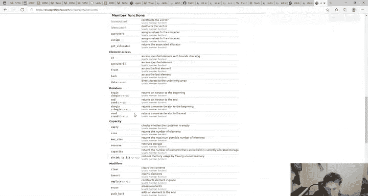

Great， now I also might want to print out the size of the array so I can do F dot size like this。

So this program will。Creative vector events called F。 It will push 5 to the back of it。

 and then it will print out the size of that array。

 And I might print out the size of the array before I push to it as well。

 So what I'm trying to demonstrate to you here is that。C++ really does。Effectively。

I knew this would happen。C plus plus really。The controll sea shift sea， I can't remember。

I can't remember how to do the new line。It effectively feels a lot like an O language where everything's objects。

So if I run this now， terminal print0 and1， great。 Okay， so the0， I add an element there's one。

 You get that。 Now， the next line is interesting。 Auto K equals F。

Now someone has asked in the chat about this and Luke's already answered it for us， which is helpful。

 which is when I do this， when I say autoK equals F。

 the compiler will know that what I'm actually saying here。Is order that K equals F。

 It knows that it's that tight because it can tell from F。But the question is。

 is it a copy or is it a reference Now， if you are working with Java。

 which treats all object assignments like reference sharing， it would be a reference。

 but the way C plus+ works is the other way around in Java。

 whenever you say like object A equals object B。Both of those variables are kind of now references to a heap item。

 right， something on the heap， but with C plus plus it's actually a copy。 And to make it a reference。

 you actually have to do an extra step。 So it's copy by default。

 That's what we call value semantics or copy semantics but。This is now a copy。

 so we actually have two arrays and can you can see this here if I now push something to K。

And then I try and print out the size of k and the size of J as well。

so I'll just try and print out sorry the size of F。So I push something to F。I copied F to k。

So they both have one element， copies， and then I push another one to。

 So therefore it should it should not be adjusted， so。Let's try that， so build 102。Perfect terminal。

Yeah，1，2，2，1。 So 2 is the size of K，1 is the size of F。

 So we've just demonstrated that doing a standard assignment actually does a copy。

 and we'll come back to that a lot more later as well。

Why is there a return zero at the end of the main function that actually happens anyway。

 Like if you don't actually write return0， C will just return C plus plus will just return0 for you。

 actually it's the same in C。 I think I think it's just generally taught as good convention for younger students。

😊，嗯。What if we do like a shallow copy， Would there be a way to get that behaviour if we need it。

 I don't want to go into this too much in this basics lecture。 But the short answer is that。嗯。

It doesn't do a shallow copy， and we'll deal with those cases more in assignment， too。

Psin says so does a large vector require some time to be assigned， Yes。

 it does if you have like if you have like a million items in a vector and you say auto K equals F it's going to copy a million items right。

 it'll happen so。You got to think about what you're doing。Great， there's auto。

 We really talked about that for a little while， but it's interesting。The next thing is cons。😡。

These are all compile time things。Constant is a key word that exists in C plus plus that after。

Declaration。It says it can't be modified right now we're kind of familiar with this concept。

 I think from Java， I don't think it exists in many other languages。But essentially。

 we use the word const and。Can't touch it anymore so for instance。

If we say autoCon's meaning of life equals 42， now let me just pull up this code example，ops see。

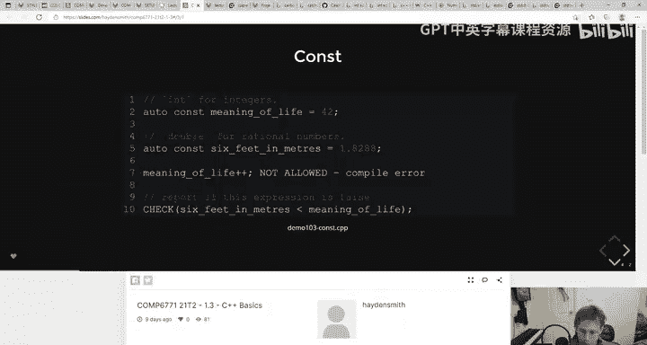

Let pull up this code example here， cont。U。AutoCons is the equivalent of saying InCons right。

 because auto will determine it that it's an end。😊，This means that after this point of declaration。

 it can't be changed。 So if I was to try and like， and I'll show you this， right， if I like。

This is a simple program。 Let's actually run it first， right we declare two constants。

 meaning a life in six feet in meters， 42 and 1。8288。 I go to compile it， build 103。

It should build quickly， notice the catch two ones sometimes take a bit longer。

 Well just do 103 I know my faces in the way， but you know what I'm writing。All tests passed right。

 So it passes it。 But now watch what happens if I go meaning of life plus plus right。

 I try and mutate it。 I try and modify it after it's declared as cons。

 It is picked up at compile time， the compiler says absolutely not。

 C plus plus compile errors are not really the most friendly Sometimes， but。

Usually they're a lot better than C。 And you see right here， line 17， column 24。

Cannot assign to variable meaning of life with con qualified type， cons int。Basically。

 it's like this variable。 you have told me that it's cons， so I cannot assign to it。

Like it cannot touch it。So it's a couple things。 Now why do we like Kt a bunch of reasons。

 one is it makes it clear to developers that it shouldn't be touched。2 is， in some cases。

This is not so much true anymore， but。Comprs might optimize for it if a compiler knows something。

Isn't going to get modified It might。Do things more efficiently。

 And the third reason is that it helps you pick up on mistakes while you're programming right if you try and modify something that's constant。

 it won't even let you compile。So lots of benefits to it。In general。

2 principles that we follow in this course。Everything should be costed by default。

 and you should have a reason for it not to be cost Ie that you would like to change it。And secondly。

 whenever you write comps it always sits on the right hand side of the type。

 so it always sits on the right hand side of the auto。

 it sits on the right hand side of the end because you can actually valid compile it like this and that's probably actually where you'll see a lot of。

Examples online。嗯。Sorry， let me just get rid of the。The line that's preventing it from compiling。

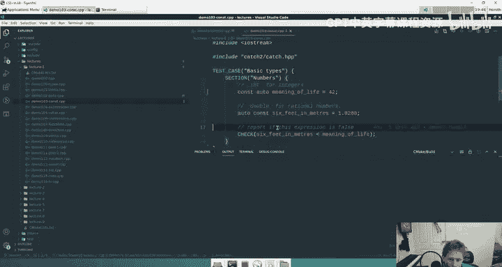

嗯。This will work right， but just for convention we like it on the right。

 I can't remember off the top of my head why that is that was the thing that came from Christstaella。

I'm not sure if there's a lot of depth to it or if it's just one of those things that like the echelons of the community just decided。

Let's do it。Yeah， I'm not sure I'll dig into that one。

 but' that's the convention we're going to ask you to follow in the course for consistency。Socon。

 pretty simple。Don't think there's a ton of questions about that。Oh more code。

 I just kind of answered this stuff。Oh， this last point's interesting。 I forgot about that。

 So you know C++ might be used in situations where you're dealing with multiple threads like multithreaded programs。

 We don't do any of that in this course。 it's just like kind of beyond the cusp of what we're doing。

 but if you think about like if you've done a course like OS or dealt with any kind of concurrency，😊。

Concurency is only a problem when you're dealing with shared， mutable memory， right。

 Like when you have three different threads randomly operating on some shared data that might change。

 So if you know， it doesn't change。Then it makes things a lot easier to deal with in a multi threaded sense。

Okay， I've probably got time for it。Coup more slides。Expressions。

So an expression in a programming language sense is a combination of values and functions that are interpreted by the compiler to produce a new value。

Basically like a lot of the time an expression is the right hand side of a。In an assignment， right。

 Like when you say auto I equals 4 plus 3， It's the4 plus 3。 That's the expression。

 It's a collection of values and functions that。They're interpreted to producing new value。

And we're going to explore some basic expressions in C++。😊，Dm，'m not sure to pronounce your name。

 Sorry， said are there downsides using cons， not really。 I mean。

 the only downside is that you can't change the variable。That you made const， but。

You wouldn't make it constant if you need to change it right。

 so it's kind it's kind of a very easy thing to apply。 That's what I mean。

 it's like everything is constants unless you need to change it， then it's not constant。Oh sorry yes。

 Cl Cla I didn't see that question Yeah in the previous slides we say Eastconst East is to the right generally like if just wherever your right hand is is generally where Easter is on a map kind of thing So we call it Eastcons' because it's on the right hand side I believe that's the term that's kind of the lingo in the community。

But we can look at some basic C plus plus expressions。

 What you notice here is that it's all pretty similar to C， right。

 you've got plus minus times divide。Moode。And。Yeah， like it's all pretty。Straight forward。

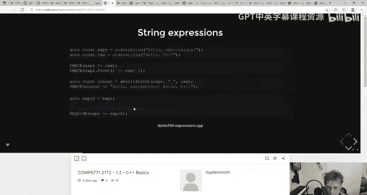

There's a whole bunch of like really useful parts of the C++ library as well and like I think like we just try and trickle these towards you but you notice here in this expression sample in the floating point arithmetic right this one's all about like all the integers which is very similar in the floating point arithmetic which is exactly what you'd expect online 48 here。

😊，We're actually doing a Delta check， which like。I hope I don't have to explain it。

 I hope CSE teaches you this somewhere else， but you know floating point errors right。

 the idea that when you sum to floating point numbers that aren't in approximately the same magnitude。

 you get errors and a loss of precision。hich means that when you actually like with languages like C++ when you check if two floating point numbers are the same。

 like doubles and floats， you actually can't check if they're totally equal。If they're very。

 sometimes you can't check if they're totally equal， it's not always safe。

So instead you check if the difference between them。

 you basically subtract one from the other and it's going to give you a number that's really close to zero like super tiny which we call a delta。

 So when we compare those two instead of checking if they're equal we actually sometimes will subtract the two ones we're comparing and check if it size is like near zero but to do that we need to get the absolute number of something so in C plus plus here you can see that we're using standard abs which I don't。

It's in CM math。To use， yeah， Epsilon， sorry， it's， it's an epsilon， right， Delta， Epsilon。

 same thing。 I think it is。 I'm not a math major， but。Pretty sure it's epsilon as well。

 but you'll see here we're actually using standard abs so like in C you might use like P or some other function that does the math。

 but here we're using standard a which is absolute value but to use that function we've had to import this library which has C math and if I don't import that library and I tried to build this we get an error。

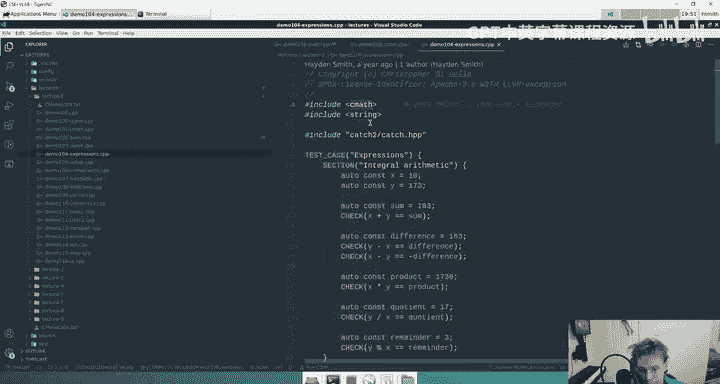

Oh， we don't。What's CM math being used for then？Advers might be built into the actual compiler。

 I'm not sure if it dump my head。

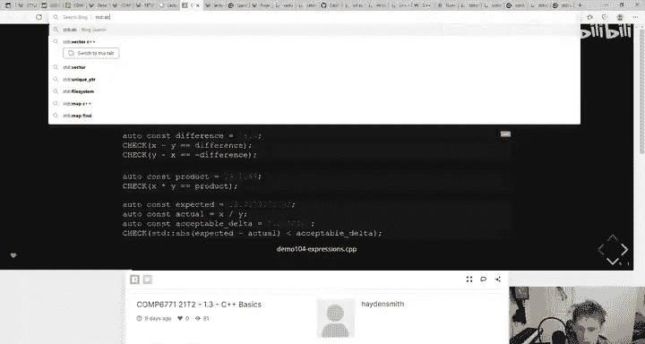

is just to be clear， this is a massive language。 Like I tell people。

 I tell people all the time that like。Getting your head around C plus plus nearly requires more brain space than like getting your head around C。

 Java and Python at the same time。 So like I will make no apologies for the fact that there are a lot of things that I both don't know and that I don't keep at the top of my head。

 For instance， what abs is used for so。

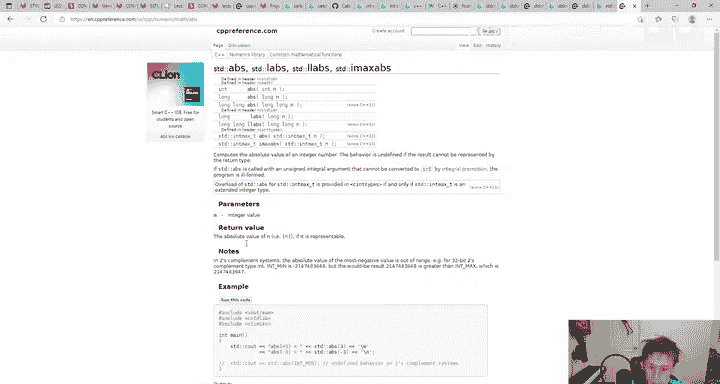

You can see here that when you Google it， when you Google it， when you go to the reference。

 it actually says that standard absolute value is actually defined in C standard Lib or C math。

 A lot of the time， there's C plus plus equivalentvalence for these libraries where instead of like including。

Like hash includes the Iodeite you actually include。C stood I， which is like the。

The C++ equivalent of the C library thinks it's the same library， so CMM is basically saying mathth。

h from C。嗯。The thing is， though， when I don't include it， it still compiles。 Why is that Now。

 it could be because I've made a mistake， which is certainly possible， but。

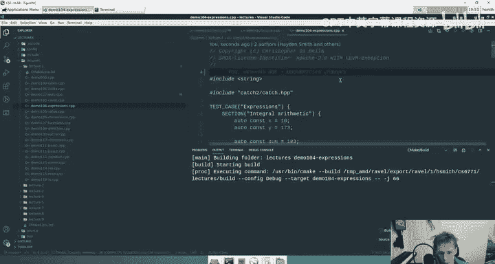

More likely， you actually see this happen sometimes because the string library itself or catch2 will actually include。

C math is part of its library right So therefore， when we go to compile it because remember hash includes copy and paste like entire headers into your file。

 And if that header includes and includes Cm， then you don't need to actually include it。

 we do want you to include it， though， because it's good practice。

 So one of the other rules about C plus plus design that we are enforcing is that we expect you to always include the libraries that you use even if it's not required for compilation。

 like if you're using a function that's from the C math library。

 you include C math in your code because it makes your code less fragile because if you just rely on other libraries to import it for you then。

It's not going to work。嗯。It's not multiple libraries that， oh， I don't know。

 I don't know why there's multiple libraries that define the same thing。I have no idea。To be honest。

That's， that's actually a C question。 you could actually ask someone who knows C as well， like。

 why does standard Lib dot H and math dot H include。Has。🤧嗯。

Ser says can we call the main function inside our test file No your main function is a replacement of sorry your test file is a replacement of your main function so typically you'll write code that does stuff and then you'll either call it from your main function or you'll call it from your test file that's kind of the two main the main ways you'll do it but coming up towards the end of the lecture here and I'm just going bash through the last couple of things because they're pretty intuitive。

Stringing expressions， we really kind of talked about strings so。You know， you create strings。

 that are objects。嗯。This line is actually something I wanted to remove， but forgot。

 I'm sorry so you can ignore， you can ignore that line there and we talked about them being copies of each other as well。

 right。And that's why like， if you compare， if they're the same。

 you actually get that true because like。We're going talk more about that in week three。 but yeah。

 essentially， you can copy strings and they're going be the same。 And then lastly。

 you have boolean values， which are exactly what you'd expect。 One of the only， I guess。

 subtle things here is that as part of C plus plus 20。

 you can actually use like Python end and or and not as opposed to like the standard double ampersand double P or like exclamation mark both of those replicable。

 though in general， we encourage you in this course to use and or or not because it's more readable right like like。

auto is more readable than two dashes or whatever symbol they might want to use。

 so generally speaking try and use and or and not in your code instead。嗯。So that's。

 that's demo 104 when we do。This video will be in two parts when we when we continue this tomorrow night we will keep going from value semantics just the last couple of questions here Bob says so each test case will be a main function essentially like each test file acts like a main function that will run that's' a simple explanation。

Queeny says how about import function into test file， Yeah， you can import functions into test file。

 It's really no different to like a C file that you have a main function with a bunch of asserts in。

 it's the same thing。 It's just a structured library as opposed to asserts。嗯。And Kai says。

 when we call a class constructor like standard string， we don't need new like Java。

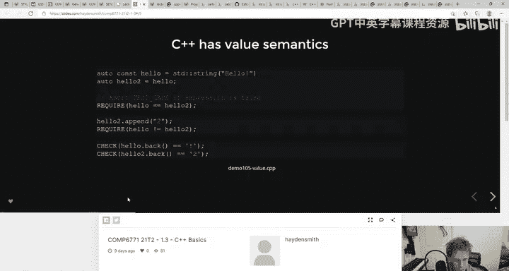

That's correct。With C plus plus it's just kind of obvious like it's like what else you're doing like you don't need to say new because there's like nothing else you would be doing there。

 you know because standard string with that is basically a constructor call which will return in your object。

 So yeah， you don't need you。 That's just a different syntax for the language。Anyway， it's 757。

 so made a bit of progress into that。 We might actually finish this lecture tomorrow。

 I don't want to say that。 I'll probably regret it。😊，But yeah， so I'll see you all tomorrow night。

It'sGood to see so many people here。 We have a third of the course here tonight。

 which is pretty good for CoVd days。 It's really nice to see everyone。

 It's been a while since I've taught like a month first lecture of the term。

 maybe for some of you as well。 So I hope you have a great night。

 Some of you will start shoots tomorrow， including my shoot。😊。

I actually think my tu's the most boring tu， because I'm most likely to tell you the same thing that you've been told in the lectures。

 So if you're enrolled in my tu， I'd actually nearly encourage you to go to someone else's tu to get a different perspective。

 but I will still record my tus for those who missed the tus。

 I'm dead serious about go to someone else's tu because I will just like tell you the same things。

 I know。We'll talk about O a little bit。 But anyway， I'll see you all tomorrow。

 And thanks for coming along to。First lecture。 See you， everyone。

