# 高级C++编程：2.1：STL容器 🗃️

在本节课中，我们将要学习C++标准模板库（STL）中的容器。STL是C++编程的核心部分，它提供了一系列预构建的数据结构和算法，使我们无需从零开始编写。我们将了解不同类型的容器、它们的设计哲学以及如何有效地使用它们。

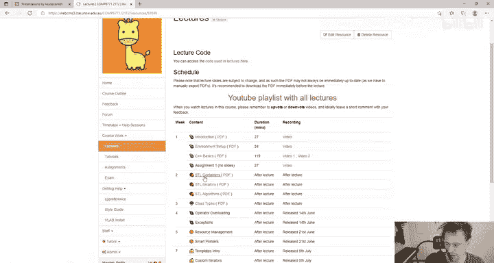

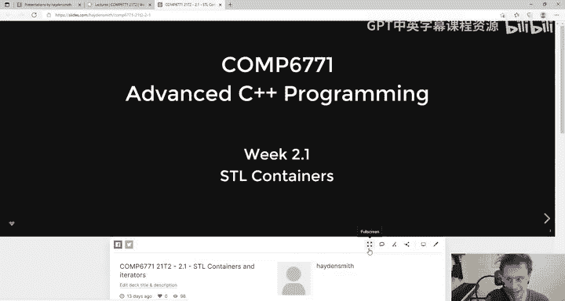

## 概述

STL是一个库集合，其设计哲学是：容器应存储数据，但无需理解算法如何操作它们；算法应能操作数据，但无需知道容器如何实现。这种抽象通过“迭代器”这一概念连接起来，它充当了容器和算法之间的通用接口。

上一节我们介绍了STL的基本概念，本节中我们来看看具体的容器类型及其使用方法。

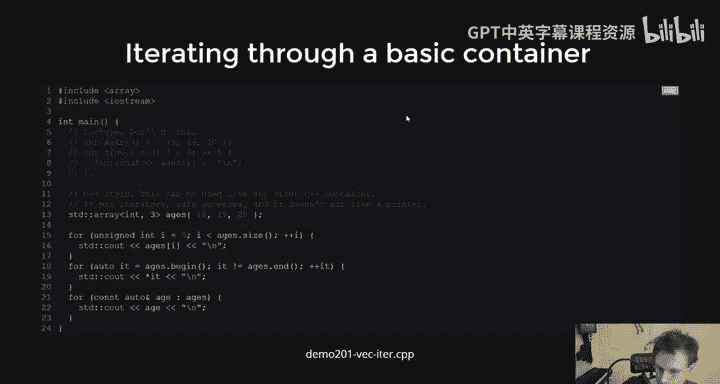

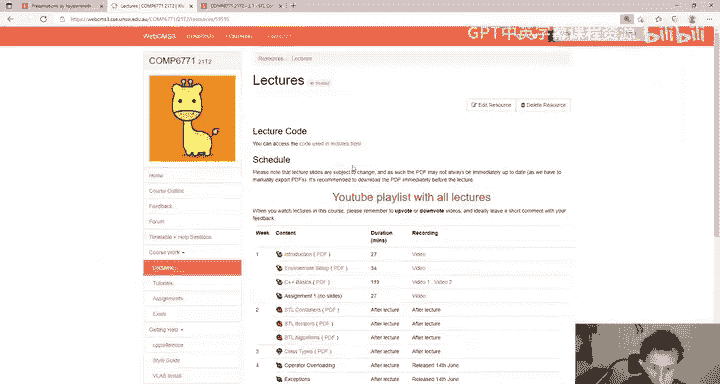

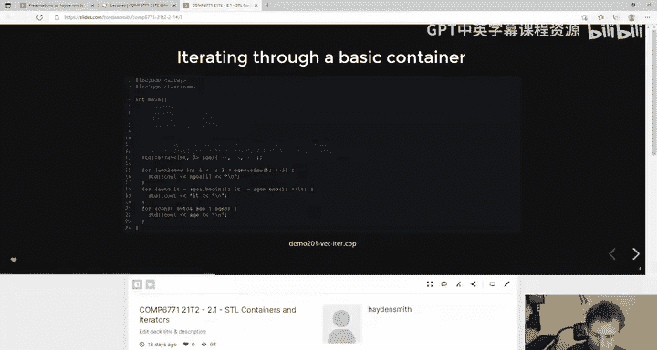

## 迭代器简介

在深入容器之前，我们先简要了解迭代器。迭代器是抽象指针，指向容器中的某个位置。它允许我们遍历容器中的元素，而无需关心容器的底层实现。

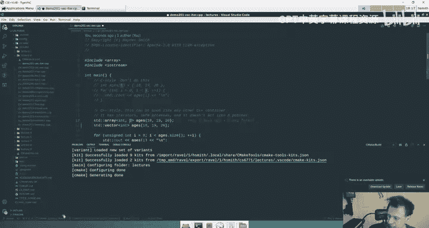

以下是遍历数组的三种方法：

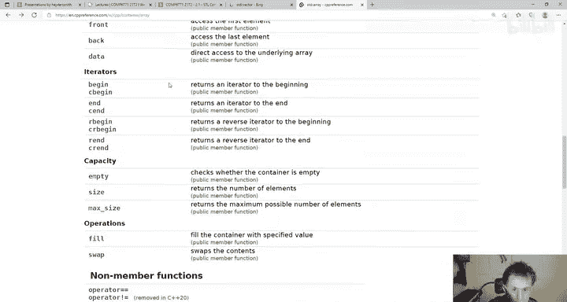

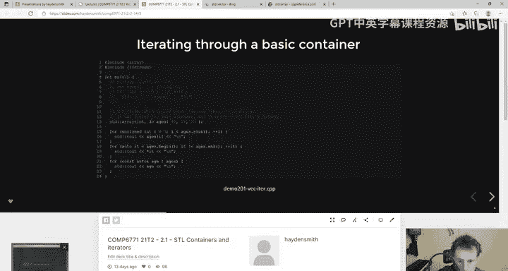

```cpp
#include <array>
#include <iostream>

int main() {
    std::array<int, 3> ages = {18, 19, 20};

    // 方法1：C风格循环
    for (unsigned int i = 0; i < ages.size(); ++i) {
        std::cout << ages[i];
    }

    // 方法2：基于范围的for循环（推荐）
    for (int age : ages) {
        std::cout << age;
    }

    // 方法3：使用迭代器
    for (auto it = ages.begin(); it != ages.end(); ++it) {
        std::cout << *it;
    }
}
```

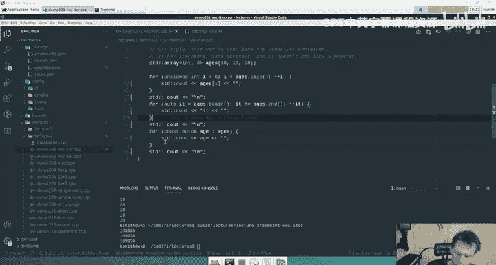

在上面的代码中，`ages.begin()` 返回指向第一个元素的迭代器，`ages.end()` 返回指向最后一个元素之后位置的迭代器。循环持续进行，直到迭代器 `it` 等于 `end()`。

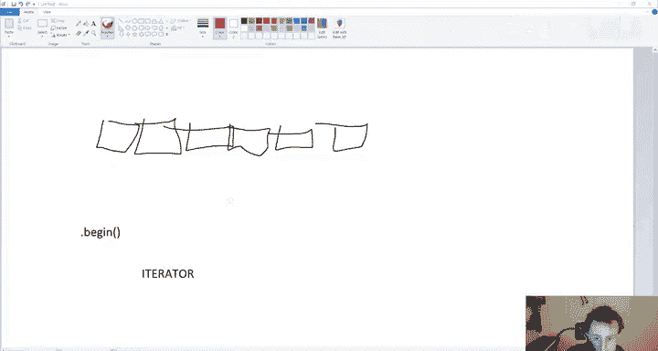

## 顺序容器

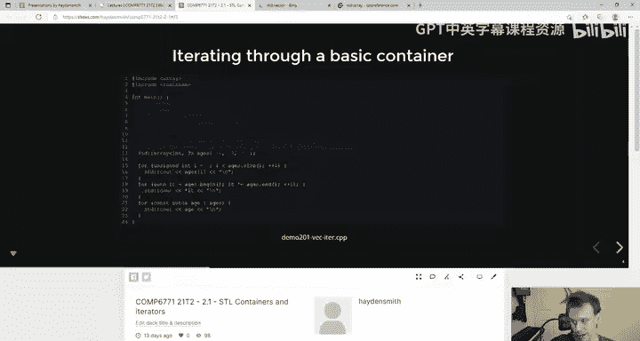

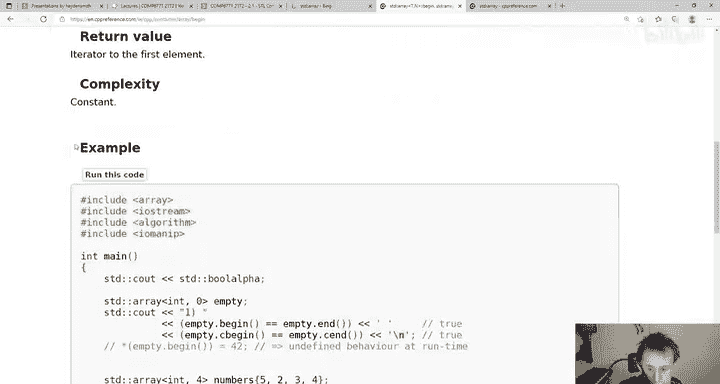

顺序容器以严格的线性排列方式组织对象。以下是STL中五种主要的顺序容器：

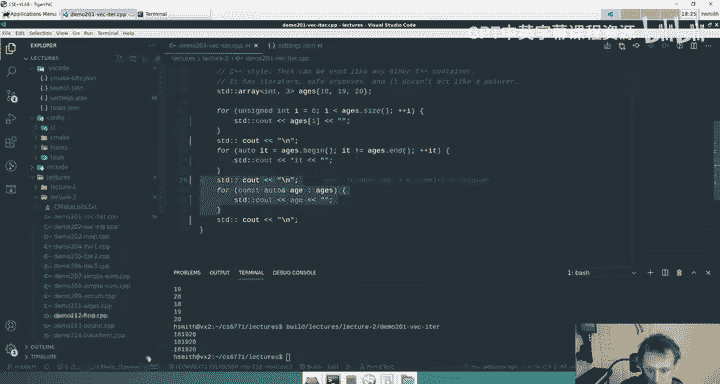

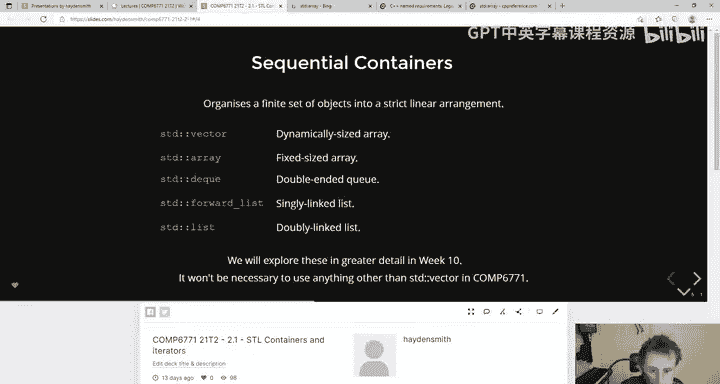

1.  **`std::vector`**：动态大小的数组。元素在内存中连续存储，支持快速随机访问。当空间不足时，它会自动重新分配更大的内存块。
    *   **公式/代码**：`std::vector<T> v;`
2.  **`std::array`**：固定大小的数组。它是C风格数组的轻量级封装，大小在编译时已知。
    *   **公式/代码**：`std::array<T, N> arr;`
3.  **`std::deque`**：双端队列。支持在头部和尾部进行高效的插入和删除。其实现通常使用一系列固定大小的数组，并非严格连续存储。
    *   **公式/代码**：`std::deque<T> dq;`
4.  **`std::list`**：双向链表。支持在任何位置进行高效的插入和删除，但不支持快速随机访问。
    *   **公式/代码**：`std::list<T> lst;`
5.  **`std::forward_list`**：单向链表。比 `list` 更节省空间，但只支持单向遍历。
    *   **公式/代码**：`std::forward_list<T> flst;`

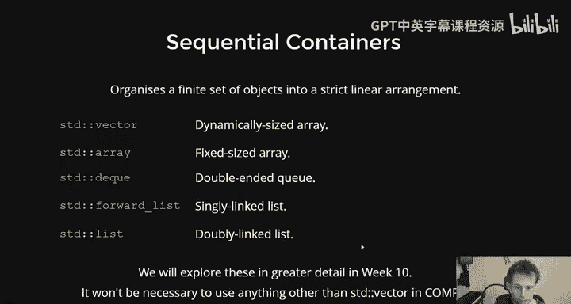

### 向量 (`std::vector`) 深入

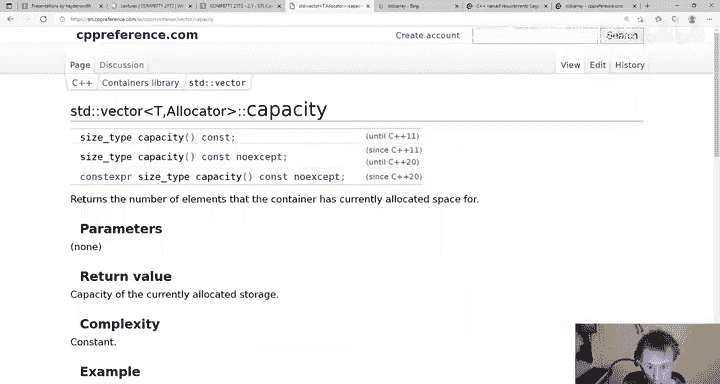

向量是最常用的顺序容器。让我们看看它的一些特性：

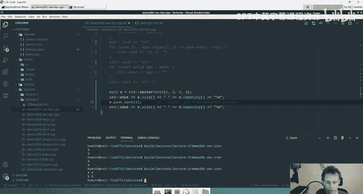

```cpp
#include <vector>
#include <iostream>

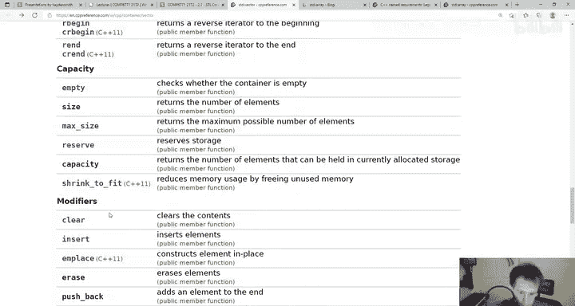

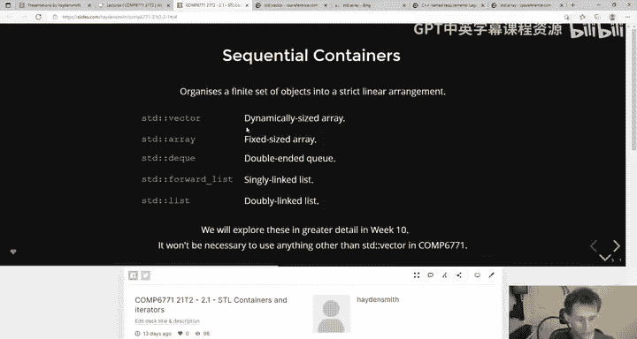

int main() {
    std::vector<int> v = {1, 2, 3};
    std::cout << "大小: " << v.size() << "\n";
    std::cout << "容量: " << v.capacity() << "\n"; // 已分配的内存空间

    v.push_back(5); // 添加元素，可能导致容量增加
    std::cout << "添加后容量: " << v.capacity() << "\n";

    // 访问元素：两种方式
    std::cout << "v[0]: " << v[0] << "\n";          // 无边界检查，访问越界导致未定义行为
    std::cout << "v.at(0): " << v.at(0) << "\n";    // 有边界检查，越界抛出 std::out_of_range 异常

    // 预分配空间以提高效率
    v.reserve(100);
    std::cout << "预留后容量: " << v.capacity() << "\n";
}
```

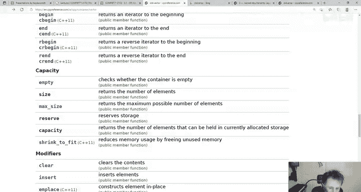

关键点：
*   `size()`：当前元素数量。
*   `capacity()`：已分配的内存可容纳的元素数量，通常 >= `size()`。
*   `push_back()`：在末尾添加元素，**摊还常数时间复杂度**。
*   `operator[]`：快速访问，无检查。
*   `at()`：安全访问，有检查。
*   `reserve(n)`：预分配空间，避免多次重新分配。

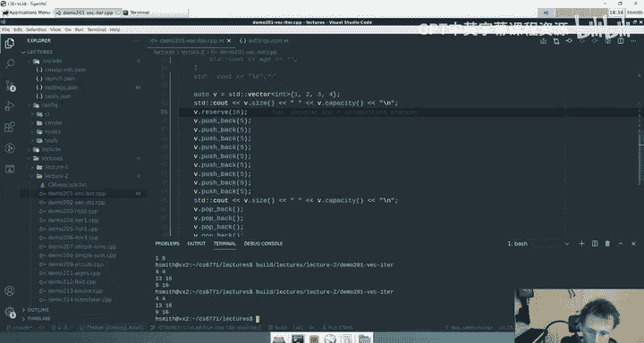

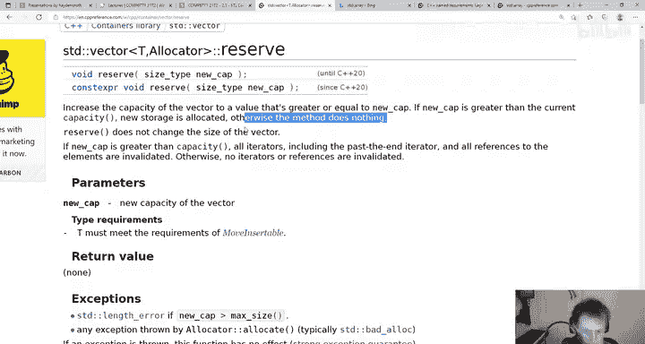

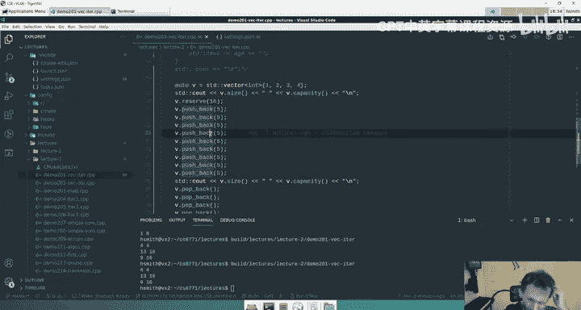

## 有序关联容器

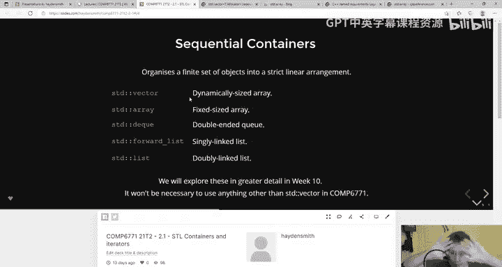

关联容器基于键来存储元素。有序关联容器中的元素按键排序。

以下是主要的有序关联容器：

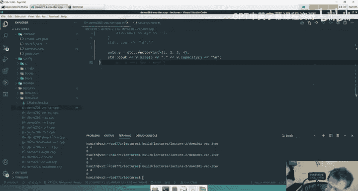

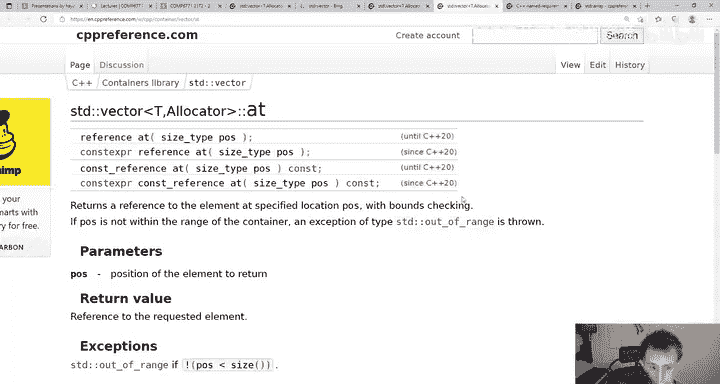

1.  **`std::set`**：唯一键的集合，即每个键只出现一次。
    *   **公式/代码**：`std::set<Key> s;`
2.  **`std::map`**：键值对集合，键唯一。
    *   **公式/代码**：`std::map<Key, T> m;`
3.  **`std::multiset`**：键集合，允许重复键。
4.  **`std::multimap`**：键值对集合，允许重复键。

### 映射 (`std::map`) 示例

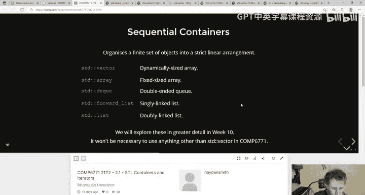

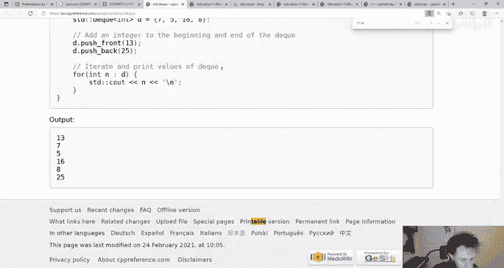

```cpp
#include <map>
#include <string>
#include <iostream>

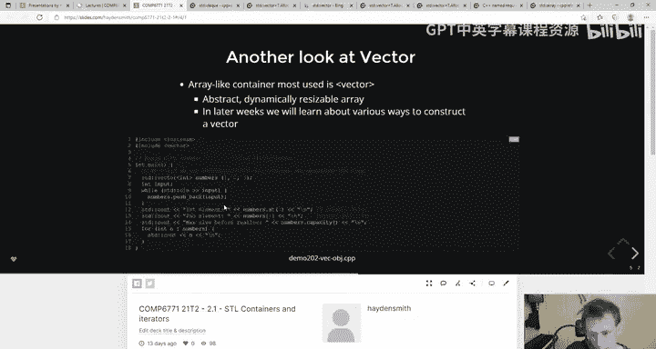

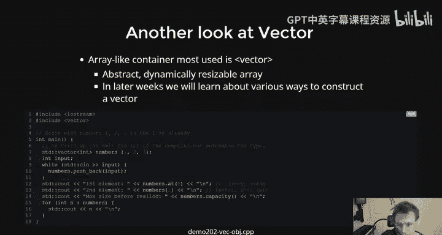

int main() {
    // 现代C++风格声明
    auto m = std::map<std::string, int>{};

    // 插入元素的几种方法
    // 1. 使用 std::pair
    m.insert(std::pair<std::string, int>{"bat", 1});

    // 2. 使用初始化列表（编译器自动转换为 pair）
    m.insert({"cat", 2});

    // 3. 使用 emplace（推荐，直接在容器内构造，避免拷贝）
    m.emplace("dot", 3);

    // 危险：使用 operator[] 访问不存在的键会插入该键（值为0）
    // std::cout << m["elephant"] << "\n";

    // 更安全：使用 find 或 C++20 的 contains
    auto it = m.find("cat");
    if (it != m.end()) {
        std::cout << "找到 cat: " << it->second << "\n";
    }

    // 遍历（按键排序输出）
    for (const auto& [key, value] : m) { // C++17 结构化绑定
        std::cout << key << ": " << value << "\n";
    }
}
```

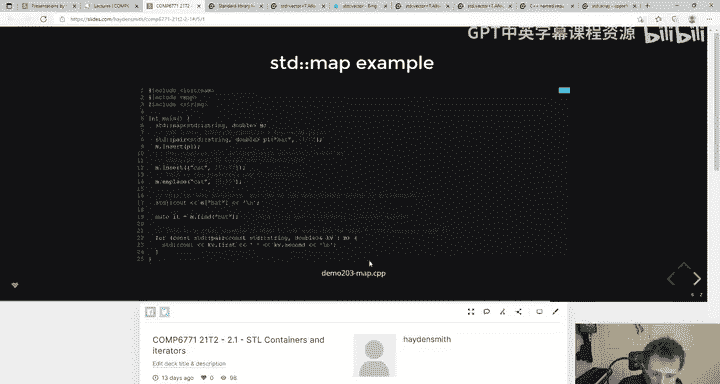

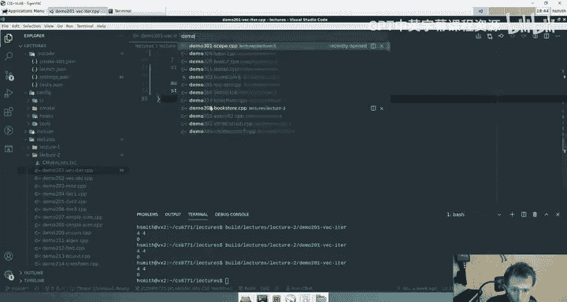

注意：`std::map` 通常基于平衡二叉搜索树（如红黑树）实现，因此查找、插入和删除操作的时间复杂度为 **O(log n)**。

## 无序关联容器

无序关联容器使用哈希表实现，不维护元素的顺序，但提供平均常数时间复杂度的查找。

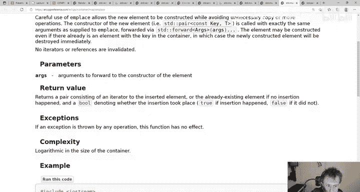

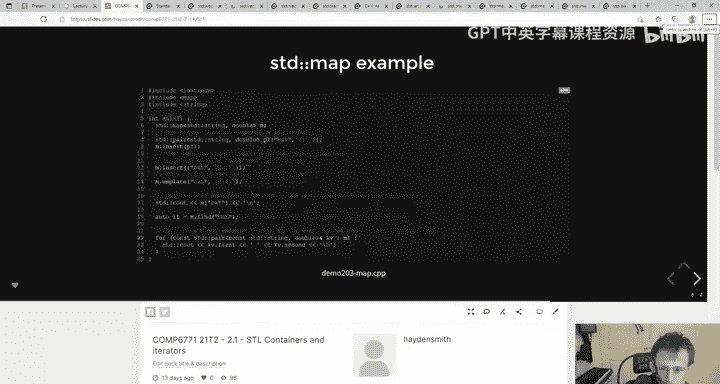

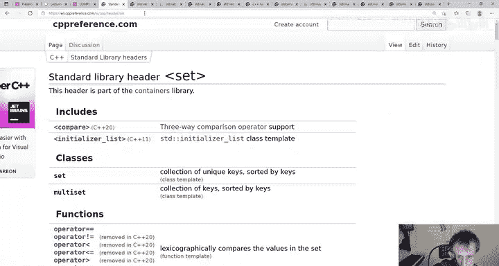

以下是主要的无序关联容器：

1.  **`std::unordered_set`**：唯一键的哈希集合。
    *   **公式/代码**：`std::unordered_set<Key> us;`
2.  **`std::unordered_map`**：键值对的哈希映射。
    *   **公式/代码**：`std::unordered_map<Key, T> um;`
3.  **`std::unordered_multiset`**：允许重复键的哈希集合。
4.  **`std::unordered_multimap`**：允许重复键的哈希映射。

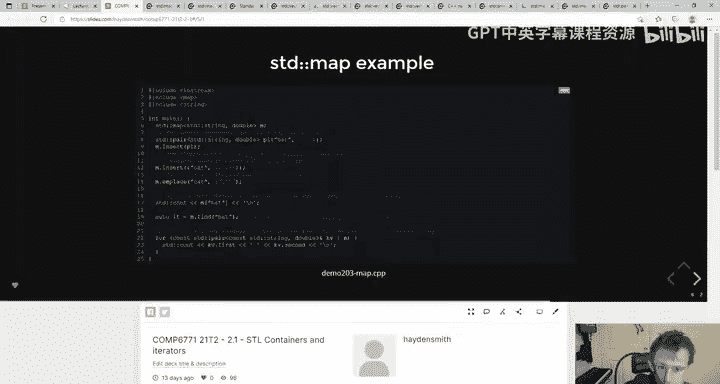

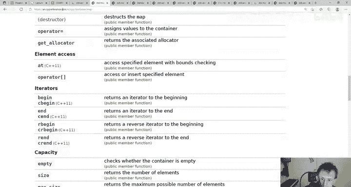

### 无序映射 (`std::unordered_map`) 的优势

当不需要元素顺序，但需要极快的查找速度时，应使用无序容器。

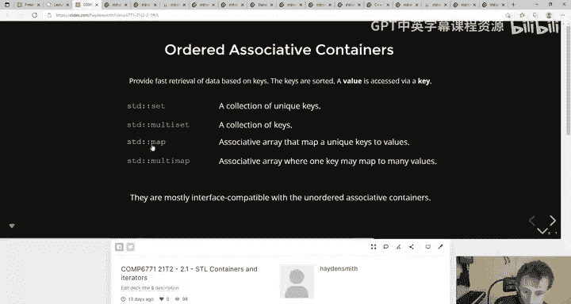

```cpp
#include <unordered_map>
#include <string>
#include <iostream>

int main() {
    std::unordered_map<std::string, int> um = {{"apple", 5}, {"banana", 3}};

    // C++20 前，检查键是否存在
    if (um.find("apple") != um.end()) {
        std::cout << "苹果数量: " << um.at("apple") << "\n";
    }

    // C++20 起，可以使用 contains
    if (um.contains("banana")) {
        std::cout << "香蕉存在\n";
    }

    // 平均 O(1) 的查找速度
    um.emplace("orange", 10);
    std::cout << "橘子数量: " << um["orange"] << "\n"; // 注意：operator[] 若键不存在则会插入
}
```

## 容器性能考量

选择容器时，需要根据操作频率（如插入、删除、查找、随机访问）权衡性能。以下是一些通用指南：

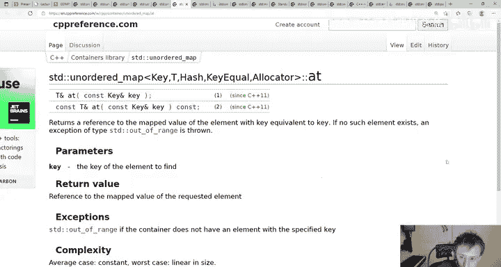

*   **需要快速随机访问和尾部操作**：使用 `std::vector`。
*   **需要频繁在头部和尾部插入/删除**：使用 `std::deque`。
*   **需要频繁在任意位置插入/删除，且不需要随机访问**：使用 `std::list`。
*   **需要维护唯一键的排序集合**：使用 `std::set` 或 `std::map`。
*   **需要极快的查找速度，且不关心顺序**：使用 `std::unordered_set` 或 `std::unordered_map`。

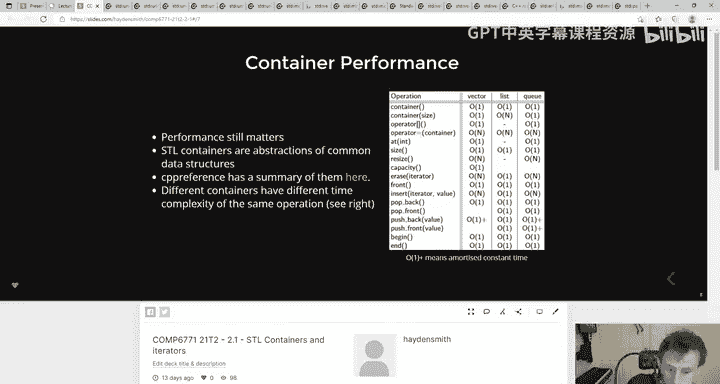

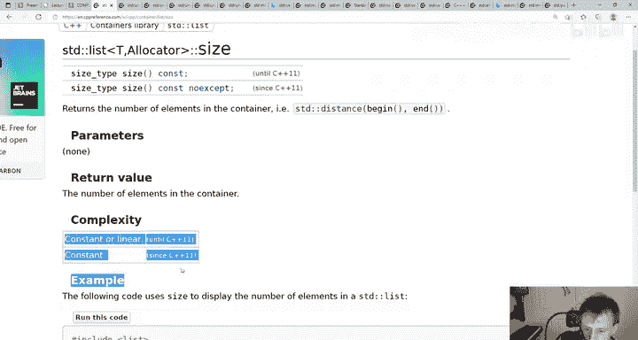

实践中，`std::vector` 和 `std::unordered_map` 可以解决大部分问题。

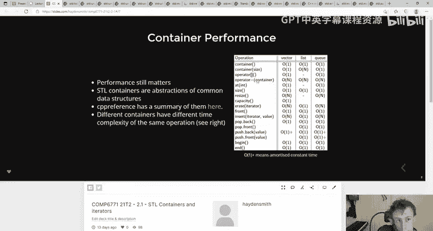

## 总结


本节课中我们一起学习了C++ STL的核心组成部分——容器。我们介绍了顺序容器（如 `vector`, `list`）、有序关联容器（如 `map`, `set`）和无序关联容器（如 `unordered_map`）。我们了解了它们的基本用法、性能特性以及如何根据具体需求选择合适的容器。记住，理解这些容器的底层原理和复杂度对于编写高效的C++程序至关重要。在接下来的课程中，我们将更深入地探讨连接容器和算法的关键——迭代器。