# UNSW《高级C++编程｜Advanced C++ Programming COMP6771 21T2》中英字幕（claude-3.7-s - P9：-09-COMP6771 21T2 - 3.1 - Class Types.zh_en - GPT中英字幕课程资源 - BV1NGQcYLEiV

🎼，Good evening， everyone。Let's get into it。Let's wait for this countdown to start the official timer of 67。

71。Oh。Hi， good evening and welcome to Com 6，7，7，1，4 week3。

 I hope that you all enjoyed your long weekend day yesterday and one last lecture to put up with this week。

😊，嗯。Today we have just like this week， we only have two hours of lectures。

One thing that's really helpful about this course is that when it was originally like when me and another person rewroded in 2019。

 the uni screwed up and only gave us a。3 lecture hours a week。

 so the course was actually originally written for only three hours of lectures a week。

 so that takes a little bit of pressure office， but we've used that time to fill it with other things that we didn't have there before。

 I think before we get started， I don't really have any broad updates。

I think probably just the only thing is that essentially what will happen is that you know。

 we will take your assignments on Sunday evening， which is when the last people can submit we will automark them and I think just as a heads up auto marking will take a while to automark all of you will probably take。

So like， so here's the thing。 you know， we've got， say， like we can。

 we can all do this really quick just'ca it's interesting。

Let's say we've got 450 students and we're going to have say about I know 50 tests I can't remember and each test will take up to 15 seconds。

 but let's just say an average of 5 seconds or something or whatever because you know not all of you will need 15 seconds in every。

On everything， so that's， you know。That's every student。 We need 5 whole seconds， and then。You know。

 that's that many seconds。 And I' probably， oh，50 tests。 I probably screwed something anyway。

 the main point。The main point is that it will take approximately a day or two to mark。

 I think I've done the math wrong So this wasn't very exciting。

 but it will take quite a while because some of you have really slow tests。 Oh， that's per minute。

 Oh， I see。 I thought that was per second so。Yeah，37 hours sounds about right。 I did it right。

 It's due on Friday， but like we， we can't mark it till everyone's submitted because there's late submissions。

 That's why I say Sunday。 So I' I'm just managing your expectations early that I can't start auto marketinging until Sunday night。

 And then once we auto market， it'll take us two or three days just for the auto market to finish because of the amount of time it takes and then we'll get your tutors marking in and I'll ask them to try and mark quickly but。

 they'll do a good job， but you know。We'll see how we go。

 But that's just some context on what' will happen after you submit。

 So the earliest anyone can even look at your code will be Tuesday or Wednesday next week。

 So please be understanding of that。 today， we're going to be talking about。

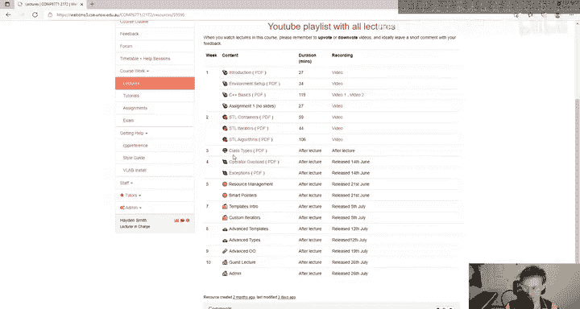

C plus plus class types。 Now， C plus plus class types are。Not。

Like part of your assignment in terms of like， you can do your assignment without understanding these things。

Which is good， but it's still a really important topic for the rest of the course Pg and Sam say just is it just pushing it to master。

 Yeah， we we just basically take your latest master。

 That's what we do we do the kind of we kind of submit it for you。

 So yeah just you log into Gitlab you look at your repo is what's there what you want it to be and yes。

 then we then we mark it， please make sure you push to Git none of you watching this lecture will probably make this mistake。

 but every term there's always one or two students who don't push anything to the Internet and they get zero for an assignment。

 So。Yeah， don't be one of those people， that's the point。嗯。

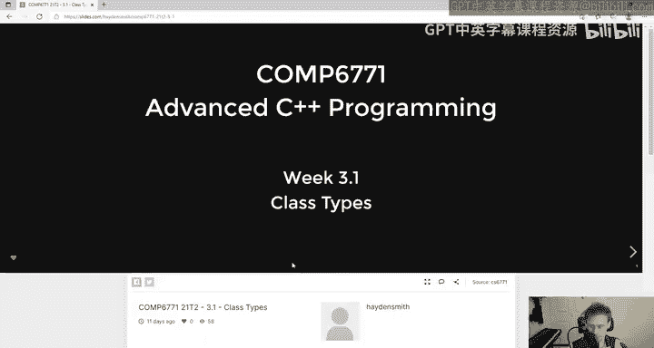

Cllaass types， let's load a list， okay。So today in this lecture。

 we're going to be going around a couple of things we're going to be talking about the rules that surround scope and we're going to talk about how class and object types。

Are fundamental to understanding how your C plus plus code works。

Now this C++ as you know from assignment1 does not really require you to write your own classes like a language like Java Mo。

 but everything you've been working with so far in C++ is an object of a class type。

 every string unordered set STL container。You know。Other things， not everything。

 but a ton of stuff actually relies on classes。 So we will。I don't know why switches there。 Sorry。

 maybe I left that。 So we'll be talking mainly about scope and class types today。

Now the first thing we want to talk about is scope and scope is kind of relevant because until we really look at class types。

 you can't actually learn a ton about scope。Because。Classes are a pretty essential part of scope。

 so it's really useful to understand them。 And this is also where we're going to touch on namespaces slightly so。

First thing， what like you all probably are familiar with the word scope in terms of like， oh。

 a variable has a scope。🤢，And if if you try and use it outside of that scope， you can't use it。

 or you know， you might know about a global scope or something， but like let's get a bit more formal。

 So when you declare a variable or any kind of named type， maybe a lambda。Object like a string。

 a primitive type， like an endt。 The scope of that variable right。

 is usually from the moment that it is defined。 That's where it starts。 And then typically。

 the simplest rule is that it exists until the very next closed brace。In your code。

 and this generally applies pretty well for。Like functions， if statements， while statements。

 four statements， anonymous braces and all of this kind of stuff。And。

There's a couple of couple of key points to this。 One is that where this differs from C is that we encourage you to therefore define your variables as close to first usage as possible as opposed to a kind of。

C style approach where you meant to declare everything up the top and then initialize them later or something like that。

 So everything you end up initializing， always declare at the top。

 And the reason for that is because we don't want things to have a scope longer than they're needed for。

 right， Like a name， a particular name。 When I say name I'm referring to a variable。

 The reason the reason I use the word variable is name is just because。You know I equals one here。

 you're declaring a variable I is equal to one， but it's actually like the name means something right like when you try and print that you're actually trying to look up a name and the name is I or the variable name So we like to we like to declare things close to where we define it because it stops as having things in scope that don't need to be right It keeps the program a little bit tighter。

And I think that's the main stuff about。 we'll look at this example。

 I don't think there's any kind of other key things。嗯。

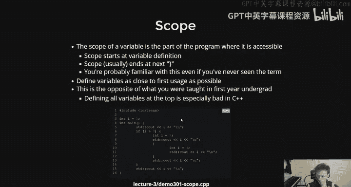

Is it possible to give a scope a name， That's a great question。

 That's actually what a name space is Funnily enough。

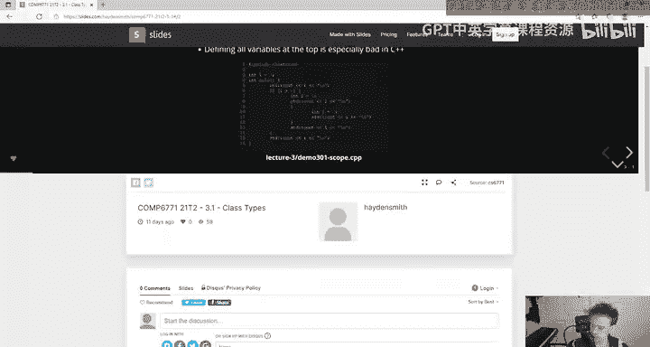

So let's have a look at a couple of。ACo of things here。 just zoom in slightly。

So when we pull up our build。Did I forget to select a kit。 Now， I selected a kit。Licectures。

 lecture 3。Scope。Great， so let's look at this piece of code together now。

You might not have thought about this too much， but this eye here。Doesn't actually。

Like this exists in many different places。 And and I think another key rule of scope that I don didn't include on the slides is that。

 you know， when we like we like kind of teach you that you can't use a variable name twice。

 like we're like， oh well you've used it so you can't use it and sometimes you get like a redefinition error or you know。

 already used or something。 it's actually more complicated than that because the rules formally or often that you can't。

You can't use the same variable name。In the same scope。

 But you can use the same variable name in a different scope。

 So if we actually look at this program here and this might be 1 I can't compile with our。

SMake because it's a bit of a， you know， those programs I try and show you all that are a bit like。

Yeah， so like the， the warnings integrated into our。

Compilr for this course with Kang are just a little bit like this is a dumb program。

 so I'm just going to compile this one straight with G plus plus because I'm just trying to demonstrate the behavior。

呃。301。So this is what this program prints out if we try and do。Just a standard print。

 And you'll see that we have a few standard outs here。 We have the first one。 We have the second one。

 And， in fact， maybe I will just quickly name them as well， so。You know， we have our one here。

 our2 here。 I know you can all kind of visually count， but。Let's just do this。Yep。

 and then we'll compile and run it again。Sorry。So there you go so these are the five instances that we're printing out and you can see that this first one prints out I1。

 the next one is I2， the next one I 3， what I is on the fourth and then the fifth instance Now what you'll notice about this is that we actually have three different definitions of I here we have an eye in the global scope we have an eye inside of just a particular like subcope in our function and then we have another one here and in all these cases you'll notice that theyre all kind of inside different braces。

In the sense that if we tried to declare I up here， I equals 4。

 we would get a compile error because it's in the same scope redefinition of int I。

 but in the other scopes it's actually separate。A name。

Is is valid in a particular is based on a name and a scope product。

 so you can have the same name in a different scope。 Pin says if I declared a variable I in the mean。

 that is a different scope than a global right， Yes。

 so there's actually another place we could even declare the eye， which would be here。

And generally what really makes the difference with a lot of this is braces。

 That's a very fast and loose rule it might be a bit more complicated than that。

 but essentially every time there's an open brace， it's typically a new chance for you to scope something and every time there's a closed brace。

 pretty much everything that was defined。Since that open brace is automatically like freed off the stack essentially and then Charlie's asked here we can use braces without loops。

 Yeah， you can actually， if you just randomly put braces in your code。

 you're essentially just making a new scope And if I just， if I commented out these braces。

 it wouldn't compile because now this eye hear is actually trying to be redefined in this。You know。

 it's kind of think of it like an unnamed name space or something like that。

 But that's kinda not super useful。 I haven't really found many instances for that to be particularly useful。

 but。

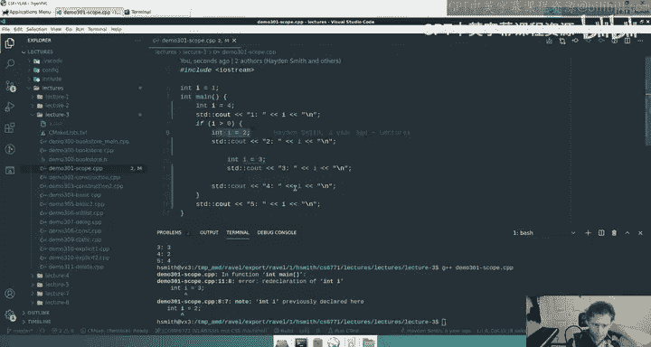

The point is， pretty much every time there's an open brace。

There's going to be a new scope that ends at the closed brace。

 and you can redefine the same name there。That's often why。It's a bit more subtle than that。

 And in fact， that's also why you see things like if you ever do a full loop where you're like。

 you know，4 and equals 0。That's why that eye can't be accessed after the closed brace。U。

Is a bad style for us to put braces for scope。 I mean， I don't know if it's a bad style。

 I just I would more probably just question what value it would bring you if there was a reason for it to be fine。

 but yeah， like what value would it bring you。 So that's some really basic stuff on scope。

 talked about that for a while。

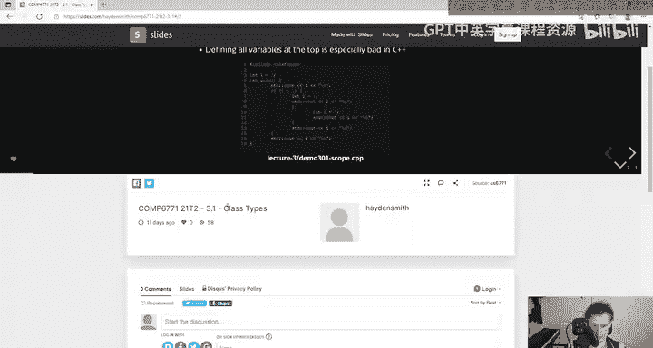

What different ways can we create scopes Well， we've talked about some functions， global scope。

 random braces。The two that we haven't talked about much that you might have seen though is classco and namespace scope。

 so classco is a big part of what we will be talking about in this lecture and namespace scopepe well talk about a little bit sometime in it。

But most of what this lecture is about is about object lifetimes and what objects even are。Firstly。

 N C plus plus essentially everything is an object， like even primitive types and other stuff。

 you can kind of treat them like objects， so we try and treat everything like an object。

 and formerly speaking， an object is a piece of memory that has a specific type and that specific type might be an int It might be a string it might be an unorddered set and that specific type holds some data。

RightSo anytime you declare a variable that's equal to some kind of data type， it is an object。

And unlike certain languages， this has a very low overhead。 So some other languages。I don't know。

 Like Java have a little bit of runtime polymorphism and some other things that can cause their wrapping ints and objects to have overhead。

 you know， in Java， you have like you have like an int and an integer type and one of them is an object and one of them is a primitive type be everything in C plus+ is essentially an object So object lifetime is this notion of scope essentially right Like there's the start of an object scope and the end of an object scope or a name or a variable and a lifetime is all the stuff that happens in between it an object lifetime start when it comes into scope。

And it ends when it goes out of scope。 Now， one thing we've kind of glossed over to this point is the idea that all objects in C plus plus have some notion of construction and destruction。

 So you know from classes that you have constructors and destructors。

 essentially something that's called when you create an object over a certain class type and a destruct is a function that's called when you。

When you get rid of a certain object of a certain class type。

But all of this is actually happening in C plus+ for you all the time。

 Like when an int comes into life throughout its lifetime。

 it actually gets constructed at the start in a lot of instances and then destroyed at the end。

 Sometimes that's just taking it off the stack。 Sometimes a basic construction for a string might be that you default constructed to be an empty string。

 P of things like that， so。

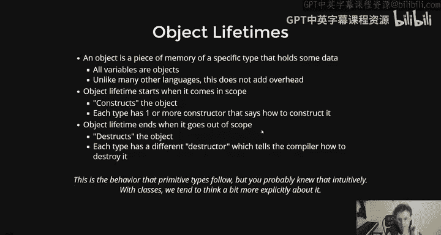

And Gourt says， are objects automatically freed at the end of their scope。Sort of。Yes。

 is the short answer Some objects would be automatically freed on the stack as just part of how these C based languages work so for instance when you declare when you define an integer。

 it would get maybe default constructed in some contexts and then when it goes out of scope it simply disappears off the stack。

 whereas then there are other types like a vector or a linkedless type which is probably mallaching some stuff which is probably actually doing some explicit heat memory allocation and that would actually have have a destructed defined by the class to free it at the end right。

So construction is a big topic in C plus plus and。

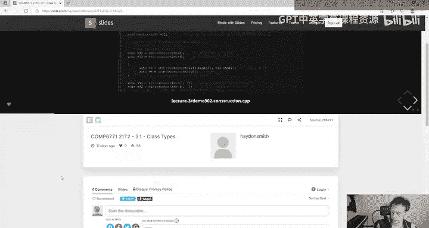

It's like pretty much everything in C plus plus just has a little more like info around it。

 So here's a whole bunch of ways that we can construct things。 And in particular。

 in this example here， we picked a。A standard vector to show you the different ways we can construct it。

 So the first thing is， if you ever just define a type like this， you just say， you know。

 standard vector in V 11 like this， what that will do is that will call the default 0 argument constructor。

 right， So essentially there's a constructor that has no parameters。 if you define a type。

 or if there's a type that expects more than one parameter， more than0 parameters。

 this will fail to compile because it won't be able to match it。 And you might think， well， you know。

 how do I know this。 Well， you can have a look at all the different constructors that a vector has。

 there's all these different methods of construction。 And in fact， here。

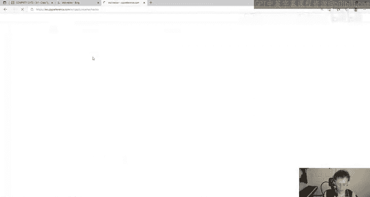

You go down to constructor。Then it'll show you， so you have a vector with no arguments。

A vector with no arguments here， lots of vectors with no arguments。

 And then it just kind of ripples on from that。 So these are all the different ways that you can construct a vector。

 Its quite a， quite a dynamic list of things。Now。We then have our kind of more modern way that we like to。

Create variables in C++ which is your auto name equals type however， with this one。

 let me first try and compile this just to make sure we know it's working。However。

 if we try and just do this without the braces， I think it won't work。Yeah so。

When you try and just construct it this way without any braces。

 it will kind of chuck a tantrumman as like， that doesn't make any sense。

 and that kind of makes sense， why it doesn't make sense because you're saying that this particular name is this type。

 right， because this is just a type here。It's not a value because a constructor returns as a value。

 So we have two ways that we could default， construct a particular。Object， right。

 And that is either using the braces or using parentheses。 Now。

 both of those methods are totally valid。 and we're going to keep chatting about this。

 But essentially in， in a large sense。When it comes to。Construction。For。Classes。

 you can pretty much treat braces and parentheses largely the same in terms of use braces。

 it will just treat it like its parentheses under。Quite a lot of conditions。So。

These are both two default constructed zero parameter vectors， braces or parentheses。

 we generally prefer parentheses， which we'll keep chatting about。

We then have a couple of other types of construction and both of these you can actually see inside the CPP reference。

If I go back here， you'll see that。Oops， sorry。Why does it do that。

That's really weird think I've noticed I'm alting， I think the edge browser alt tab alt tabs tabs。

 which is really strange。😊，What's happening here is that we're creating a vector and we're actually giving it the begin and the end pointer of another vector。

 So what this one is and we can see this right if we look through all these different definitions。

 we'll probably see one down here， which is here which is that you can construct a vector by giving it an input iterator to the first element and an input iterator to the last element So in this one we're actually using the STL kind of framework to create a new data structure that's being given an iterator of another data structure which just happens to be a vector So that's actually how we would that's one way we could copy items from one vector to another vector or more specifically often a nonve to a vector。

We also have this other way we can construct which is creating a copy。

 we're going to come back to copies a lot more next week。

 where the argument we give a vector when we construct it is actually another vector itself and you can see there's a definition for this one too。

 where a vector can take in a constant vector reference to another vector。Like this。

 So there's tons of different construction methods here。 And my point is that all these braces。

 you can treat them like parentheses like this。So generally we prefer using braces when it comes to constructing types。

We then have the last two very interesting ones。Which。Initialize a list， and。嗯。

These this function call here。There's this notion of initializeer list。

 which it comes up a bit where when you construct certain types。

 there are certain types in C plus plus that have this particular constructor here。

 And what it does is it takes in a parameter that is just a standard initialized list of a certain type and what an initialer list is with like I don't even know how you would define it formally。

 but it's basically a list of data right， It's kind of like a。You know。

Primitive array or like a python list。 It's just some kind of collection of data that's typically wrapped in in braces。

 And what these data structures are able to do is to take that data structure and then just kind of populate it like knock。

 knock， knock， knock them all in。 So in this one here， we're basically saying。

 I want to create a vector given these numbers。 And you just give it a list of numbers。

 This is like a really quick way to create a vector。 Richard says by constructing types。

 do you mean there is something to be put in the braces。Well， by constructing types。

 I essentially mean if you want to create a new object of a class type。

 then essentially you're going to put braces next to it。There is one really interesting。Example。

 though， that really drives home the point between braces and parentheses。

 And that is when we're trying to use some kind of construction that involves multiple numbers that might be mistaken for this。

 So what's really interesting is that。This is me trying to create a vector。

With the number 5 and the number  two in it。 So it's vector with two items in it at the end。

 Whereas what this one here is， is this one's actually me trying to call。Where is it。This one。

It's actually me trying to call this particular constructor and what this constructor does right if we have a look here number three。

 we can go down， and it says three constructs the container with count copies of elements of value。

So the two key things it takes here are count and value。 So what it says is I will create x of y。

 So when we go back to our code here， this one is saying I will create a vector with five2s in it。

So this one is really equivalent to like if you just did like 22222 as an initialr list like this。

So one of the reasons we do like to use these braces as well is because。It。

Bracces pretty much work in all circumstances whereas parentheses don't work with initializer lists and also it kind of makes us a little bit clearer that you're actually explicitly calling a function。

 but again we'll keep talking about initialer list because the braces sorry because there's more examples where you'll be like。

 oh okay， that makes sense。Ko says if there's three or above numbers then the parentheses won't work right well based on this definition probably not because I don't think there's anything that takes in three numeric looking things。

But different data structures are the same。 So quite a lot of。

 quite a lot of interesting nuance there with the different types of construction that can happen。

This this was really easy because this was a class type right， and most of you can。

Kind of picture vector being a class。 And then， you know， it has to be constructed。

 And there's multiple constructors， which hopefully you've seen before。

 But a more interesting one is for basic types。 So C plus plus is super。

 super kind of interesting on the basic types where。

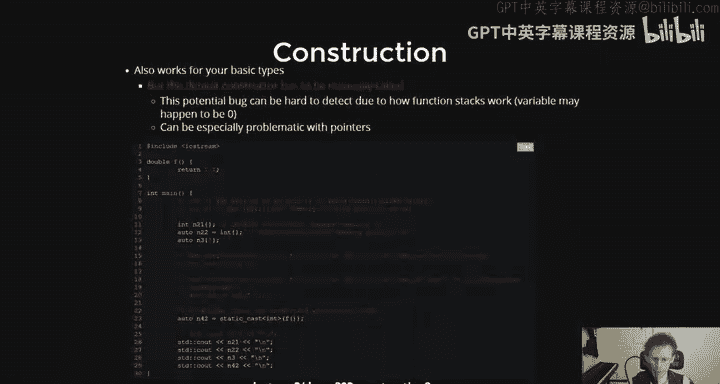

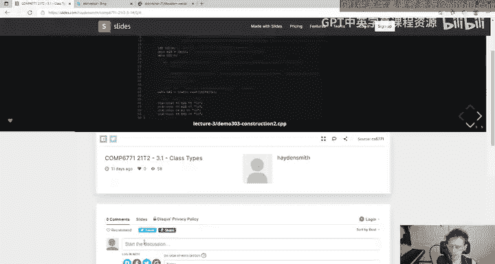

This is three different ways to default， construct a a number。 Now， I'm going to uncom this one。

 so it compiles。Because this won't compile otherwise but。

Have a look at these three different types of construction。

The first one is your C style construction with an int Now general practice is that you should never declare an int without initializing it because otherwise it's pointing to potentially like unknown memory。

 like uninitialized values， whatever was left there in memory before。

 so that is an uninitialized definition of an int。Right。If you want the int to default construct， I。

e set it to0 because an integer type when constructed will set a default value of0。

 you can do something like this， where you're actually treating the int like it's a class。

You're basically treating it like that's an object just like a vector just like everything else。

 you can also do this thing， right if I replace this with standard vector events。

 it would look really similar to what we had before。Right that's what we did on the last slide。

 except this time it's just ins。嗯。And you can also construct it to be a certain number。

 or you could also construct it to be a certain number like this。 So this is。

 this here is kind of generally。You know， another way you could write the equivalent of into n equals 5 or something like that。

Now， do we have a preferred way of doing that kind of stuff， Not really， I mean， in ors。

 they're pretty simple。 It's more just trying to demonstrate the fact that。Inster objects as well。

 as you can see here， we're essentially default， constructing them and doing a few other things。嗯。

Not obvious。 Okay， So we have some other things here。 and N 43 equals F， Third return of F。

 Not obvious。 You know what。Not obvious。 You know that F is not an imp but the compiler that's it through anyway。

 Then we have this fund here where we say N 41 equals the end of that so。What's happening here。

 and we we kind of chatted about this a little bit is。This is an implicit conversion。

Right whereasas this here is not an implicit conversion。

 This is one of the reasons why we try and do the auto on the left for everything。

 because if you force the auto on the left of everything， then when it comes to object construction。

 you don't do any implicit implicit assigning because essentially the kind of quirky thing about a C++ compiler is that when it tries and resolve the value of calling F。

 this will be a double but then when we assign the value of a double to this int。

 it will try and implicitly convert it， it'll floor it for us that's just like C star behavior but in this case here。

 because we're explicitly trying to construct an int with a double。

 the actual constructor of the int will throw an error here。

So I think if I try and run this and I'll get rid of that。You see。Build demo 303。Oh。

 we got some unused variables， great。I'm not sure let's just try G plus。

 There's a lot of things I'm doing here that we just don't want you to do ever。 Yeah。

 so you can see here that it says warning narrowing conversion of F from double to int。

 So this is actually the this is the constructor of the int throwing the error right。

 So that's kind of you're shifting the responsibility of it to something that's a little bit more。

You know， kind of clear。 And if you really needed to do that， you would do something like this。

 You would static cast it。 Now， static casting it in this case is going to be the same same one as this。

 It's just that。It's just clearer what's happening。

So I think these three examples are really good to kind of contrast the different ways you could tackle some of these things because yeah。

 basic types are a little bit more subtle than like our object types。

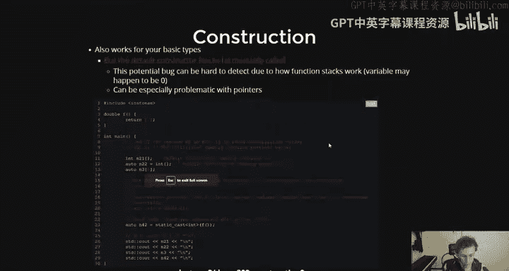

Now why are object lifetimes useful， why do we care about object lifetimes the short answer is because when you can rely on object lifetimes。

 you don't really have to worry about freeing stuff and closing stuff as much as before。

Because typically， right when you are doing something like mallaching or freeing or opening a file or closing a file。

The problem is， is that they're often just kind of stored in， in variables， and you often forget to。

Finish something up Now if again， the first time any of you would have done some object oriented programming。

 you know that the cool thing is that you can essentially bake into the class itself a set of instructions to follow when the object itself is deleted or it goes out of scope right so and you've probably done this and we're going do more of this in C phoOSphospher it's like you could have an object like a vector。

😊，Where what happens with the vector， is this vector might mal something。Right。

 or like let's say this one here， This might Malic something。

 I don't know the implementation of a vector， but let's just pretend it probably has to mal something because it's a dynamically sized array right。

 So the vector itself is probably using Malic under the hood to create memory。

And we don't want to use Malic at this point in the course。 So please don't use it。

 There's no need to use it。 It might Malic something， but there isn't free it， right。

 We don't call V2 dot3。 If this was a comp 1，5，1，1 course， we'd have to say， like standard vector。あ。

Int free or some random thing like this to actually free it。

 But what's happening here is that when we， when we。You know， assign when we define V2。

 V2 goes out of scope right here， and therefore the destructors。

 the destructors of V2 and V3 are called。 and as part of the destructor。It frees it for us。

 So that's why object lifetimes are really useful， because we can rely on them to say。

 once this object goes out of scope， call the destructor and handle all the messy stuff for us。

 And in fact， that's why things like this are also useful。

 because if you open a file as part of an input file stream， you can do stuff with it。

 And if you didn't have this F doc。

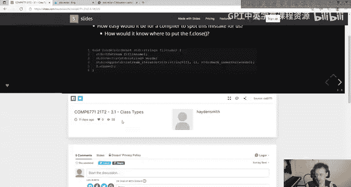

If you didn't have this F dot close here， then it probably wouldn't matter。

 I don't think in this case because。Or it would。I mean， I think it'd be fine。Just re it。Yeah。

 this one'd be fine。 So it's like the point is because the F was the name was defined inside that function scope。

 Once the function ends， it would free or unallocate or do whatever any of the the underlying resources here。

 So I'm not familiar with input file streams too much。 but I'm pretty sure in this case。

 if an input file stream that opened a file goes out of scope as part of its destructor it closes the file for us。

 So this is really good from a programmers perspective。

 because library riders are probably much better and making sure that。You know。

 things clean up after themselves properly the novice programmers like all of us。嗯。

So George says it has a great thing here which is that so for most types， C+ process。

 automatic garbage collection。So。I don't know what the official definition is。

 but what I would probably explain is that in a language like C。Everything you put onto the stack。

Is automatically taken off the stack and deleted as it goes out of scope， right？In C also。

 whenever you mal something， it stays there until you free it。

Those two principles are still true in C++。The difference is that because C++ has objects。

 because it has classes， we can essentially have an object。That acquires a resource。嗯。

Manage it on the stack。 And when that that object is taken off the stack。

 and instruction is sent to free it for us。 So it's kind of like these things manage themselves。

 So I wouldn't say so much that C plus plus has automatic garbage collection。 It's more that。

The nature of having objects in C plus plus allows you。

 allows library riders to manage their resources really efficiently and， and without issue。

 we're going touch very briefly on namespaces because I don't want to spend a lot of time here。

 You've kind of seen these in your assignment。 Namespaces are essentially ways where you can just。

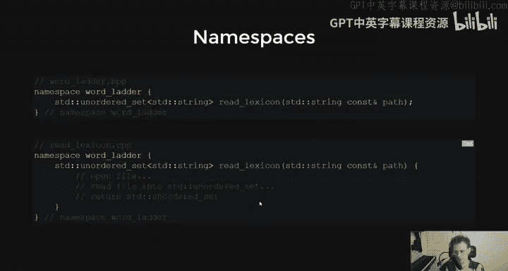

Scope things arbitrarily。 you can just add arbitrary scopes to things。You know， we've kind。

 we've got these examples here where， you know， if， and I'll just dump this in quickly if you had a。

If you add something like this where you were like。

 here's a namespace and then here's a name space or I created like a variable here called In。嗯。Then。

 essentially。What happens is that if I want to， if I want to print that I， if I want to do that。

 I can't just do this。Right， this won't work。If I try and do it， it should break。Yeah， it's like。

 I don't know what eye is and there's no ios stream。Yep。

 it's like use of underclared identifier I because this is actually in the comp 6，7，7。

1 word ladder scope like this。 So those two colons we actually use are essentially just referring to scope。

 So this will work now because I is not a name by itself。 It's not a global variable。

 This is actually a variable inside of the namespace word ladder scope inside of the comp 67，7。

1 namespace scope。 So the reason we use namespaces is so that we don't have to complicate。

Variable names。 So like， if you want to create your own vector， right。

 If we want to create a C plus plus vector for ourselves， we could just make a vector here。

And then if you want to use it， we would never get this confused with the STL vector because we wouldn't be using。

The STl vector we'd be using the 677，1 vector。 So it's a really a great way to try and organize types。

 And yes， so STD is a namespace。 So in every single one of your libraries。

 like when you hash include like if you were to look at what vector dot H looks like it would look something like this。

 It would be like namespace STD and then it would say like class vector So the actual class itself is defined inside the STD namespace and that's why like for your word ladder。

😊，It's in like， you know， it's， it's， you know。Com 6，7，7，1。

 call and word ladder or something like that。 Namespaces can be declared anywhere。 They can。

 I'm pretty sure they can be declared literally anywhere。

 Like you could just say like namespace hidden here and then say like， you know。

J equals6 auto J equals 6。 And then here you would have to say Hayden J like that。嗯。No， you can't。

 Maybe。 Namespaces can end be defined in global or namespace。 Oh Yeah， of course， don't， Sorry。

 I was getting them mixed up with functions for some reason， Like， you can do do functions anywhere。

 so essentially。Name spaces in the global scope or in their own scope so that you can nest name spaces as much as you want this makes sense because otherwise your code would be unnecessarily unruly and just all over the place。

But so， no， they can't be declared inside functions。 I was thinking about other functions。

 for some reason。 My brain got messed up。 voidyd says， can you touch on the using keyword， so。In C+。

 you might have something like this。Where you go， okay， we're gonna compile that and then we'll run。

 oops， Yeah， where you run it， It'll， it'll run fine。 It compiles it's a simple program。

 But there's a bunch of people that are kind of sick of scoping everything。

 So they do something like this。 They say either like the worst thing you can do is using namespace。

 Hayden。And then they'll do something like this。 Now what using namespace Hayden does is the easiest way to explain it is that it takes everything in the namespace Hayden and it puts it in the global scope because in C++ if something is defined globally right like out here。

You can just access it。Right。You can just access it any time。 I can just build， I can run。

 and this will work。 And I don't know what the。Yeah， I I could run and it would print out five。

 right。嗯。Yeah， what do we got，302？You know， print out five。

 but if I try and say using namespace hiddener now。

 the problem here is that we're polluting the namespace。Right？

And what's happening here is now it's going to say reference to Js ambiguous。

 So the compilers that are okay hey， this is kind of confusing。 Now。

 often the compiler will pick up on this for you。 Sure， but like from a readability standpoint。

 this makes it harder because now suddenly something that is in a particular scope。

Is no longer like clear what's happening with it。So that's kind of why we often we won't ever use using namespace something because all this does is takes everything in the namespace Hayden brings it into the global scope that I can use that as if everything in here was just magically already defined globally Now some people to get around that by saying。

 oh， instead of using this I'll actually just do this。Right， this is a shorter hand。

 I think this is how you do it。 I never really do this。Yeah。

 this is like a shorterhand way of saying that just to avoid having to write Hayden Col and colon J all the time。

Right， I would just say using Hay and J， so just in particular the J。That's it， not everything。

 right， not everything else in the name space。

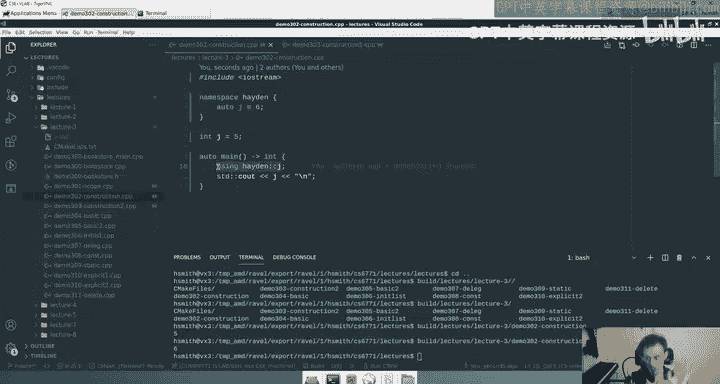

And some people do this by saying things like you know using standard vector so that you don't take everything in the STD namespace and bring it in。

 but you're just bringing the vector in。 this is marginally better though for the sake simplicity in this course we just still say it's bad because it just does create more ambiguity in the real world you're probably more likely to use that sometimes I don't think using namespace something is ever a good idea though because namespaces are often quite large that's all these slides really get to Chrisrateite these ones so typically they're extremely detailed。

 which is excellent So you can go read through them in your own time。

 I think the only other note I wanted to make is that I think there's some anonymous namespaces but I don't remember where it was。

Maybe I got rid of them。 I might have got rid of them'cause I'm like， that was， that made no sense。

Anyway， that's kind of the quick thing on namespaces。 right。

 this this whole lecture is not about namespaces。 What this lecture is about is about object oriented programming or。

 you know， classes and stuff。

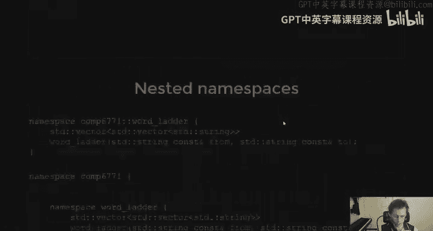

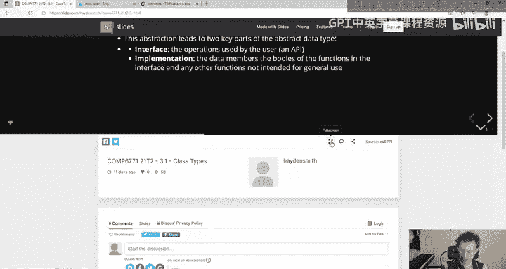

So fairly straightforward principles of object orient to programming， why do we have classes。

 we have classes because they allow us to abstract complicated pieces of code。

 and they allow us to write a nice clean interface like vector， which is a very complex。

 dynamically sized templated data structure。With a really friendly interface。Where， you know。

 you can。I don't get back。Ha all these really friendly things。

 like push back and front and back and begin and end in size。Blah， blah。嗯。Ohoh。

 that's a really handy function， I never saw that one。Shrink to fit。啊。飞个。

We were talking about that last week， weren't we about， does it reduce the size， And I said no。

'ca that's just useless time， but looks like you can call it explicitly Some of you probably already saw that。

 And that's very cool。嗯。

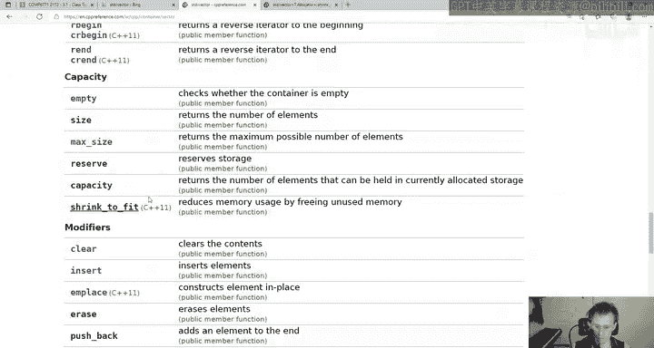

Yeah， so。We like it because it's a nice abstract， right， It helps to separate the interface。

 which is what you read on CPP reference from the implementation。

 which is what the people who wrote the library actually had to do， which is a lot more complicated。

 So we like that now。

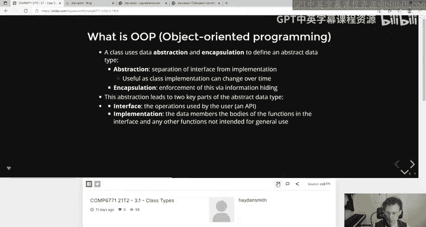

With C++ classes， we're not going to get。Too much into the whole。

 you know what is a private or public thing because we assume that you know it and if you don't。

 it was a prere。It's very， very confuses me。 how some of that stuff happens。 But essentially。

 a class is a new type。 It's like an int。 It's like a double。 It's just a type。

 We create it using keywords， class orstruct。 typicallyyp， classes are made off of。嗯。

At the most basic level variables are data and functions on methods。

 so it's a collection of know functions and data and there needs to be at least one private or public section right a class can't be like totally empty。

And so I mentioned that classes are made up of。Functions and。

Member functions and data members is what we call them in this course。 But， you know。

 class functions， object functions， members， member functions， data members fields。

 like there's a whole bunch of different names for it。 but essentially all。

You typically will define member functions and data members inside the class itself and you can define them in the class or you can define them outside of the class。

 but still in the scope So we're going to have a look at a really simple example here and we're going to build out our knowledge as classes slowly I don't think I had this as an example okay so here is a really simple class N C plus plus now。

What you'll notice about this firstly is that it looks pretty similar to what you would do in a language like Java or something。

Probably a couple of the key differences to point out that one。In C++ for my memory。

 I haven't written Java in light。For years now。 So one is that you can declare things in C plus plus without implementing them yet。

 right， So this is a， this is a function。 This is a private function。That is being declared。

 We haven't defined it。 We haven't actually explained what it does yet， but we have declared it。

 so you can declare things without implementing them in terms of functions。

 The other thing is that in languages like Java or possibly even see I don't know what C sharps like but typically you put public protected or private in front of each declaration or definition So if you have like a field or three fields or like five functions youll put like you private void private member function。

 private into private data member like that whereas in C+ plus we actually just use these public colon things and essentially when you write public protected or private like this with a colon at the end。

 it will apply this particular private setting to everything underneath it until it either reaches the end of the class definition or until it reaches another kind of privacy keyword So in this case it's saying okay everything here is public everything here is protected everything here as private and you can do it multiple times you can define public multiple times generally speaking you don't though。

And very little in this course， will you ever do protected stuff。 So for the short term。

 it's pretty much public at the top private at the bottom。

 And we like to keep public at the top because that's what people read when they're reading the the the file。

 right， It's like a， it's a data type。 Like if you haven't actually written a web page for it。

 they're gonna have to look at your。Your dot H file。 and in particular。

 I think something I've kind of glossed over here is that I I called this b dot CPP just because I wanted the syntax highlighting。

 but in reality。All of these class definitions are in dot H files。So this is like a class definition。

 this actually would be in a dot H file， so that's where you would find something like that。

Not an adult CPP file。呃。I don't really know what the convention is with Java。

 but generally you'd put public at the top because someone would actually be like reading it。

Now let's have a really basic look at an example of class usage so here I've defined a class it's called my class and it's got two sections it's got a public section that's got a private section a couple of things that you'll notice here are that in the private section I've got an integer called I and all of my class fields right my class variables that is they're not quite global and they're not quite local function scope these are kind of like global to the class I can use them in any of my class functions I put an underscore at the end of it because in all of our。

Classcope data members， I put the underscore so that we can understand that it's a class that it's a data member of a class and not mistake it for like a local function variable and it kind of saves us needing to use this operator because you know this sort of self operator kind of just takes up a lot of space So we put this underscore at the end。

The other thing that's kind of。Clear here is we have a public。function called get valve。

 there returns an int。And it returns the I so this is basic encapsulation and then we have a constructor here that takes in an int and it sets the private data member I underscore to be equal to the value of that int。

 so it sets it to be equal to I。So fairly fairly basic class and then underneath here we have our main function。

 which all it does is creates a variable called MC。

 which is equal to class type my class and we construct it by using the braces because we try and use braces to construct everything unless we really need the parentheses and we give it a one so this is essentially saying create an object on the stack。

Called my class。And we're going give it a argument of an argument of one when we pass it in and then that will create a new object of that class type。

 and then on the next line we can standard see out the my class dot getval So my class dot getb will call the public function and we can only call public things if you try and access something that's private C plus plus won't allow it。

 So if I say MCc do I underscore what'll happen here。

 it's gonna complain it's gonna see sorry that's a private something。

I underscore as a private member of my class brewreer。

 so that won't work so you can only access the public things like that。

 so fairly straightforward usage of classes there's maybe some slight syntax differences but generally pretty much the same。

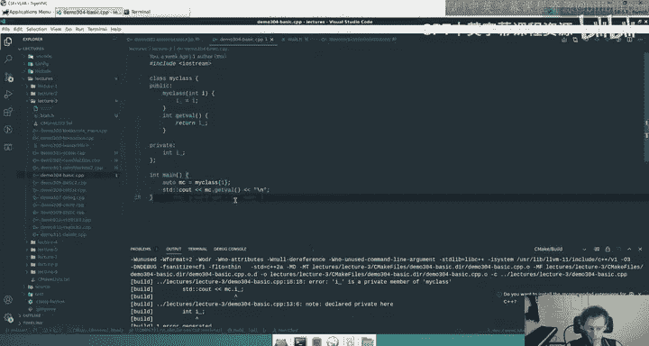

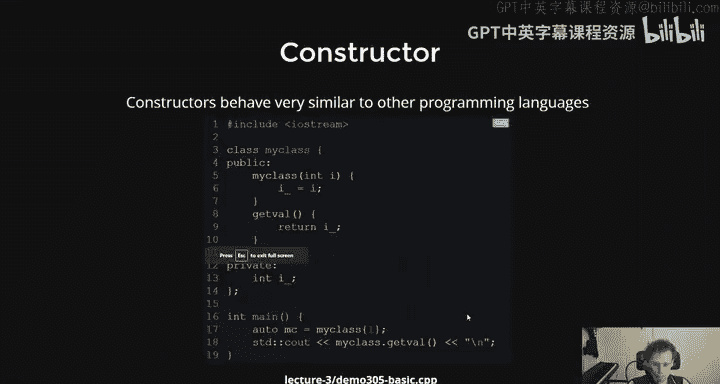

嗯。Some of you who are familiar with the this pointer。Might be wondering why we're not using that， so。

Similar to other languages， we have this notion of this where we can set in this one。 No， it's not。

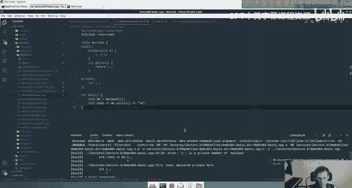

Instead of saying this， we could use this。So this is a pointer to the actual object inside the。Like。

So if a function uses the this pointer， then this refers to the a pointer to the object that called that function。

 So in this case MC is the object that called the get Valel function。

 so this is a pointer to MC and therefore we dereence it and we get the class。

We get the class member that's it's relevant there。 It can't be null， I think。

 by the very nature of what it is。 So I don't think there's much de referencing risk there。

But basically， we just don't use it because the underscore is like this point or the main benefit of it is that you're able to more clearly distinguish variables that are just exist in the function from variables that are based on the class。

 So that's why we use the underscore as a convention to essentially avoid us having to litter our code with the this statement。

Okay， now。Where things get a bit more interesting when we're defining creative classes is that we don't always write all of the class in a dot H file。

 so so far I' have said that the class definitions we have are written in a dot H file。

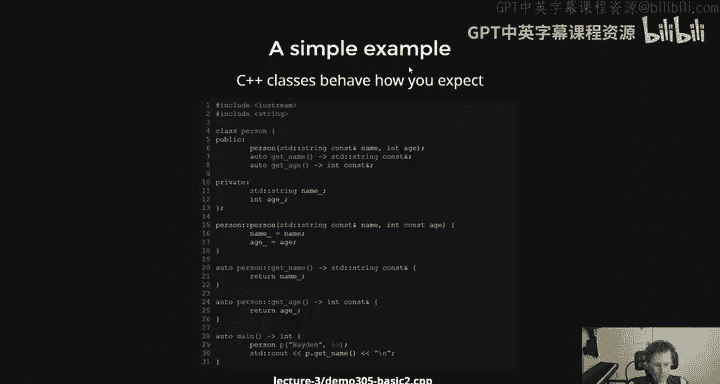

Like this one here。 Now， naturally， this one wasn't。 It was written in a CPP file。

 but what you would typically do here is you would like create a dot H file called basic。Dot H。

 And you would put this in here called this basic dot H。And then that's how you would use it。

 you would compile it like that， so when I do 304， I feel like this won't compile。Oh dude。

 that's kind of what you do。嗯。

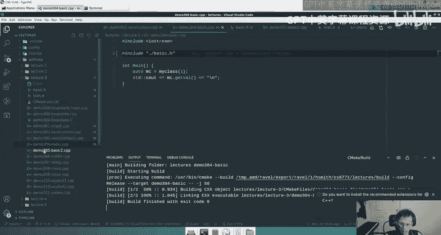

Though， in reality。You will tend to actually break these up right all of the information about what your class is and how it works is not always captured inside of your immediate class block and in this program here。

Sorry。嗯。I think I might have forgot to update this specific example because I changed this to simplify it。

So let me just update this really quick。Cool， let just make a note of that， sorry。

I changed some things around to simplify some things this term。

 So what you have here is a class called person。 It has three functions here。

 The first one's a construct。 You can tell it's a constructor because its name is the same as the class。

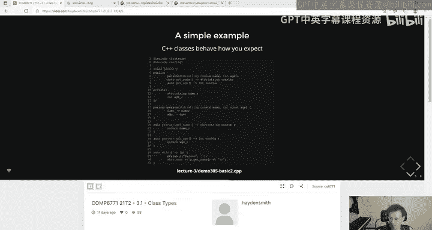

And that constructor takes in a reference to a con standard string。

 it takes in an integer age and then we have two functions here we're using the new function syntax just for fun called get name and get age and both of these return a they don't take in anything and they return a reference to a con string and a reference to a constant respectively and there's our private data members with the underscores under them Now what you notice here is that these three functions are declared here but they're not defined I could define them in this class like we did back in basic 304 before I pulled this out。

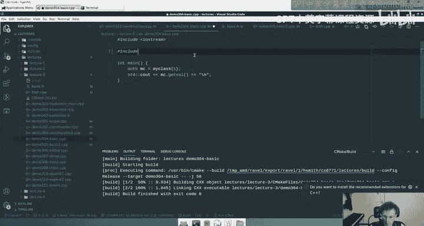

Right we could do this where we simply we create the constructor and we define it right there。

 we declare the constructor and we define it right there。

 or alternatively we can just declare it here and define it somewhere else。So。

Defining it somewhere else I can just do below the class in this case， frankly， one sec。嗯。

And I can do that by writing it just like I would in the class。

 except the one difference is because I'm doing it outside of the class。

 I need to scope it with the name of the class。So if you notice this would be exactly what the definition would be if I had this inside the class。

 it would just be that right so when it's outside of the class。

 everything's the same except I have to scope the actual function name or the constructor name or the destruct a name or anything really with the class here。

 So that's why it's person call and call in person and then I can actually implement it So it's declared in the class and then it's implemented here and I've got my you know reference to constanting。

 my reference to constant I specify what happens， name and age get assigned to name and age here。

 we don't have to scope these variables We don't have to do anything with this because this whole function is defined inside the scope of person class。

So this everything inside of it kind of assumes as if it's being like it's inside the class， right。

 so we don't need to do anything more than that。 and then for the other functions。

 get name and get age。We can just write those as if we were doing it too。

So we we have our scope here， the scopes on the name， doesn't have to be at the start of the line。

 the return types at the start of the line， it's just on the name。

And this makes sense because without that， all that's going to happen here is that C++ will think it's just another global function just like all the other functions you write。

 and then it's going to not compile because it's going to be like what the heller's name。

 I've never seen that before， it's not in my scope。

 it's not in the function scope it's not in the global scope and it's just going to be like no。😊，嗯。

Whereas here now that it knows that I'm actually defining the get name name。Inside the persons scope。

 it's like， oh， it's this one， inside the class person scope。Kai says， why is age constant outside。

 but constant inside the class？That's just a typo。That's fine there， yeah， that's just a small typo。

Yep。Cool， and then we can use it the same like we create a person。 This is another way of doing。

 and I'm just showing you some different examples。 generally we prefer this way。

 Autop equals person Haden 99。 That's how you should do it。

 but you will see lots of code written like this。 So auto on the left We use braces to pass in the parameters。

 and then this code should compile and run totally fine。 So that's 305 right y。😊，Cool， now。

 one of the only kind of。Like relevant distinctions here is that typically。

Let C++ how you would do this is that you would take your person class。

 you would put that in another file called person。h because your class declaration and some of the definitions go in the dot H file。

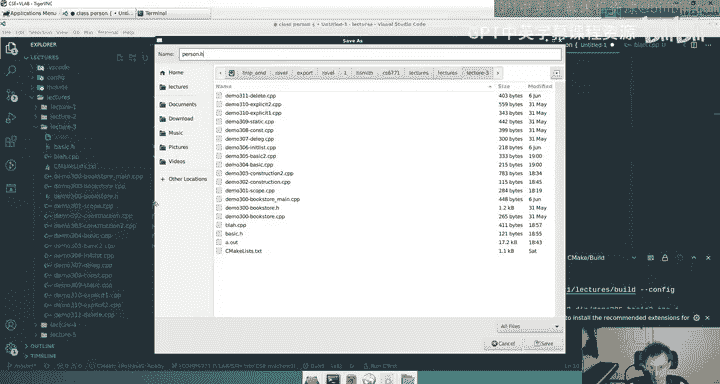

We'd have to include standard string here。Right， you take your。

Class definitions that didn't make it in like these。 And you put those in a library file。

 which I might just call。

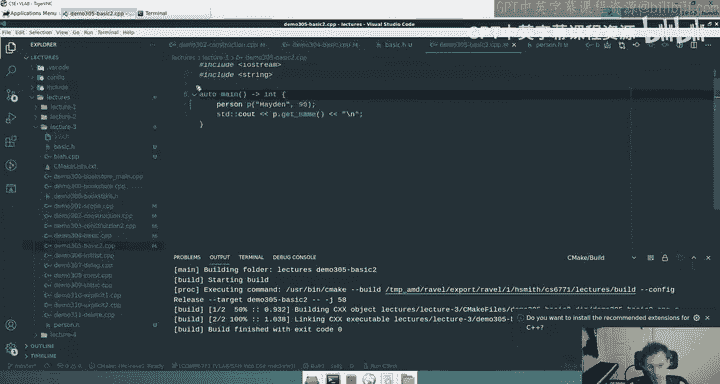

I don't know why I called it。 What did I call the other one basic dot age？

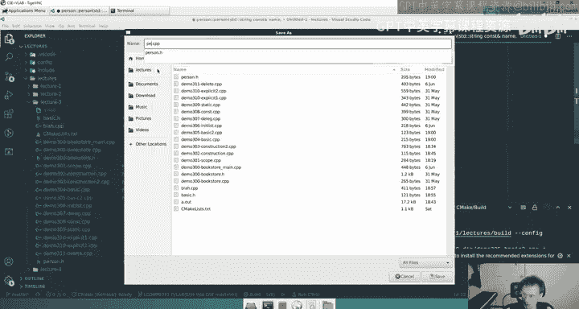

What stupid name did I give it。 No， it wasn't basic。 Oh， person dot age。 Oh， it was called person。

 Sorry， I thought it was a different name。 Sorry， we create one called person dot CP P P。

 And then just like your， your old C files， you have your dot H file。

 you have your library file that you compile pile with。

And you have your main function that actually runs it。

 And then if we wanted to run all those together， we'd have to update our Cmaker list。

Because we would have a。C+ plus library that I've defined， which is my person。Dot cppP。

So I would have to do something like that and then because my main function includes the dot H。

 but it also relies on this other CPP file， I have to link my other CPP file。

 So now we're compiling two CPP files with a common header into the same executable and if I reload the window here because I've updated the Cmakerlist we should be able to build this one successfully now but I will need to hash include。

The headers。So I need hashing clear down。Person dot H。And theta includes string as well。

And I probably need to do the same thing here。Up， now you can just include hashing include。Persont H。

 right， so this is fairly standard。Stuff that you would have done in other courses from what I've been told。

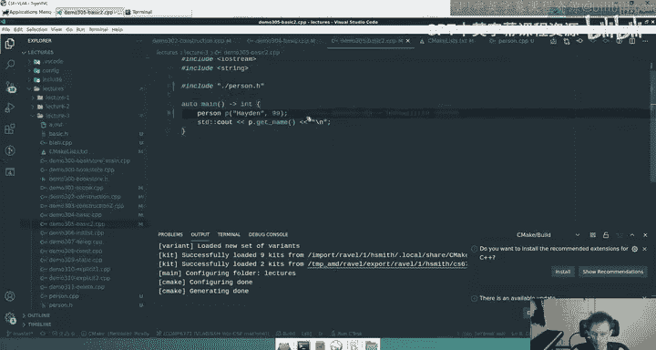

嗯。And。I'm got it worked。And yeah， and then this should just work now。 So if I just do 305。

 it says Hayden， it does， does what I asked it to。 And that's kind of a standard thing you would deal with。

 P it says， do I need to hash include string if personal age already includes it， Yes， because。

How do you know person that H includes it， You know， like you might not。

 So you're making your code less robust here because person at H might not have that might have it。

 It doesn't really matter generally。 It's like if you use a particular library in your code。

 then you hash include it there。 The compiler will handle the duplicate imports for you。

 But it makes you just generally is considered a。You know， better readable code。Cool。

 and then I think just the， the obvious question that comes from this。Is why would you do this。

 Why would you not would you not just include everything in the dot H file。Like。

 you just put it all there。 Like nothing， nothing forced us to put it here。And。

The reason is because two reasons one is。Dot H files are also code documentation， right？

So it's really good to keep this simple because it means that someone who's just trying to read what your type does can just read it without seeing all the implementation because this is still like a C is language and the second reason is because remember that the way that C works it goes and compiles all of the files separately So if you have like five files or using a vector and the entire vector implementation is actually defined in the vector then that's going to be massive compilation times because every single file that includes the dot H is going to have all that copied into it。

Um，Whereas like if we just like， if we justum compilely with the prototypes and the headers。

And then we link it together at the end， it actually speeds up our compilation time。Kai says。

 do we need the dot H， That's a good question。So。The reason that。

I've been including it that way is because an old environment that we had set up required us to。

Do it because。ItIt only looked if you didn't have a relative path that only included it from the include folder。

🤧。Zins do we need to separate the class in assignment one though there's nothing to do with classes in assignment1。

When you hash include the path is it always relative， yeah， I believe it is。

 it's just that's a relic from a previous environment。 I think we've changed it since then。

 So typically like if you just did this， it normally only includes it from the include folder。

But I think we turned off some checks and things since then。 So that's that's why I still have it。

 Anyway， let's take a five minute break just'ca it's been an hour and then we'll come back to it and finish off the rest of classes。

 So thanks， He， welcome back from the break。It's been fun so far， you guys are also tame tonight。

 everyone's so quiet。Which is good。cause I have to read the chat list， but the questions are good。

 keeps keeps me focused。 Let's keep going through more about classes。

 This is a fun little lectureca it's just lots of little things。 Next one。

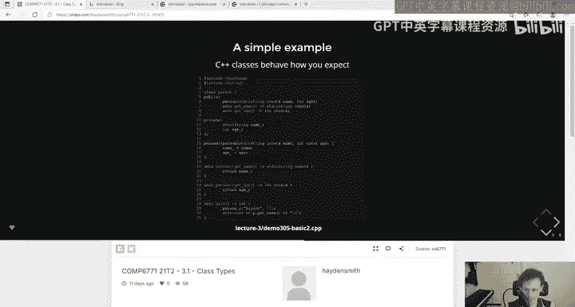

In C++ you'll actually see a lot of the timestructs written down somewhere。 Now again。

 you should probably knowstructs from C andstructs you know， they're just data members right。

 it's just like a it's kind of like a class with no functions。But in C++。

Classes andstructs are exactly the same。And what we mean by that is if you go and writestruct instead of class or class instead ofstruct。

 they will be the same thing。嗯。So just be wary of that because they're not quite as different as you might expect now on top of that。

Or I guess you know given that fact， though， there there is one tiny difference that's really important to note。

 and that's that if you create a class where you don't actually give it this like privacy settings and you create a struct in the class。

By default。Everything will be private and it a struct by default， everything will be public。

 but that's that's the only difference。 Everything else is like the same。 So that being said。

 we will generally use classes always in this course。

 the only times you would really want to usestructs or if you're ever defining some kind of object type that only has data members and you have direct access to those data members and yeah。

 you can have a structure are exactly the same as classes。 So you know they do construction。

 they do destruction。They they have lifetimes， they get put on the stack， they can have functions。

 they can have data members it's all totally the same it's just the default nature of that and the meaning itself right like using astruct when you should be using a class would naturally confuse someone so that's why we want to be careful with it。

嗯。So I kind of touched on this already。5。8 so I'm just making some notes for myself。😔，嗯。

Where anything that's declared inside the class needs to be accessed through the scope of the class。

 So we did this in the previous example where we created a class like F。

 but then when we wanted to actually go and define some of these three functions that we declared。

 we have to scope everything with food colon So this is standard pretty much any time you do something outside of the class you need to give it the appropriate scope so that the compiler knows what you're referring to because food doesn't mean anything as a function。

 it only means something as a global function， it only means something in the context of a class。嗯。

Now。In。See as well。And C plus plus。You also know that you can sometimes declare incomplete types。

 Incomplete types are where you essentially。Use a type that I would just say incomplete type。

Its it's where you user type that the compiler does not yet know really what it is and an example of doing this is。

If you try to do something like this， the compiler would not know what it means because it actually evaluates the。

The elements of of the struct。Prior to。啊。How would you put it。

 It writes the elements of the struct prior to actually resolving the name here。

 So like it looks at this before it actually gives the structure name and a meaning。

 So in this case it'd be like what the hells node， whereas you can kind of do this。

 And what I said before is pretty much a grossover simplification。

 The main point here is not so much the compiler timing。

 It's it's more just around how does that even make sense for a node to consist of a node right。

 That's kind of why we use pointers instructs a lot of the time。But Kai says。

 I don't think that's C compatible， Yeah I。Sea would still comply with C+。

 but not the other way around this site you don't need to worry too much about it's more just like a here's an important fact about it。

What we're going to do though now is we're going to get into constructors in more detail。

 in the sense back here， we talked about constructors in the or is it we talked about。

Constructor here， but this was like how to use a constructor and define it。

Like what do you do now we're going to talk a little bit about more about how it works because constructors are a little bit non trivial in C++。

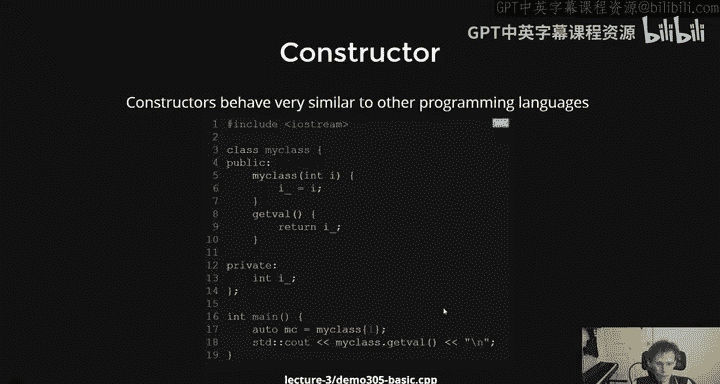

The job of a constructor is to set up an object right。

 so you create an object of a certain class type and a constructor sets it up ready for use。

The way a constructor works， though， is that it goes through three distinct methods of setup and two of them you should be already kind of aware of and the third one we're going to talk about。

So firstly， a constructor tries to initialize data members via an initialized list。

 then it tries to use。呃。Let me take a step back， I've probably stepped over myself here。Firstly。

A constructor will try and use the initialized list， which we're about to talk about。

Then if it's a built in type， it will just leave it。嗯。And if it's a non primitive type。

 like a string or something， it will default， construct that string。

 and then it will execute the function body。So that's kind of the flow that constructors work with and as an example here。

 we're going to talk firstly about initialer lifts and then we're going to talk about the flow of things So we have this little sample piece of code here called My class it's exactly the same as it was before。

 the difference is you'll notice that unlike the previous example。

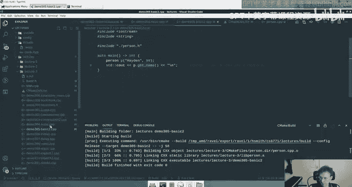

Where we did this， where we took in the eye as a parameter。

 and then we set the eye underscore to be equal to I。

 What we did this time was we had this little colon followed by the eye underscore and then brace's eye。

 So we've actually got nothing in the funk in the constructed body anymore。

 It's all in the initial list。So。This what I've highlighted here is what you call you know of what you call uniform initialization。

 but it's an initializer list using the construction and this particular phase occurs before the body of the constructor is called so if we have a more complicated class。

 like let's open demo 306， if we have a more complicated class with' say like an int J。

A couple of things have to happen here。第。First one is if we want to use uniform initialization or default initialize I then you actually have to put these here after the colon and in the same order that they're declared in the class so if I want to initialize you know the I parameter that I'm given in when someone constructs into the I_ variable I do it like this I say that the I underscore variable is going to be constructed as this and then if I want to do it for J I do a similar thing where I say the J_ class data member is constructed as J and then I also have to give it another parameter there that's kind of how I do that。

And then this will work like I could sum these together。

 like let's just say get valveels the sum of these two things。 And when I constructed it。

 I have to do， I have to do that。 So when I run this and I run306。Then we compile three of six。

We get 9， right， So it sums those two things together。 Now， you might be thinking。

Why don't we just do this， Like， sure it looks a little bit cleaner。

 But why do we invent a whole other pque of syntax， Right？ Like， I mean， that seems very。Extra。

 you know， like， why don't we just do this。 This worked fine。 There was no major problems with it。

 And the answer to that question is it all comes down to how C plus plus goes about initializing things。

 So if we go back to our previous slide。Where we had。Dear。

 sir I'm just taking more notes from myself。We have this。

 Have a look at the order that things happen here。 so it does。

 it does the initializerr list for a variable， and then it'll default， construct things。

 What's kind of missing from this slide is that it's not making clear that all of these things happen prior to your actual constructor body being called。

That's really important because what that means is in this case。

 what happens is it like let's say I got rid of this。And I put J here。

 So I said J underscore square equals J。 Let me trace through for you what happens here。

 So first thing， it goes through all the initialr list stuff。

 So it populates the I data member to be the value of I that's passed in number one。

The second thing it does is it goes in default constructs if applicable all of the remaining data members that weren't initialized list。

 so because JI didn't put in my initialized list， it now comes here。Then a default constructs that。

Now， in the case of I。Because it's a built in type like ins and stuff。

 I'm pretty sure it just leaves it as it is， just like a normal variable declaration。

 I think I might have said something different in my tu today。 I'm sorry if I did。

So it actually just leaves that alone right， that was step two is default， construct if applicable。

 the rest of the data members， and then step three is execute the body。

Right so having the initializer list doesn't just make your code look a little cleaner。

 The other kind of update the other kind of improvement it has is that it actually prevents things from being unnecessarily default constructed。

 So what I mean by that is let's imagine that intj here was like this class or object with like it had a big construction overhead。

 so to construct it required a lot of memory or processing like a standard vector maybe as an example。

 let's say we had a standard vector of ins here。And we pass in a standard vector of ints that's like by reference here。

 cons reference。And then we say J equals J like this。 We kind of copy， we copy， copy， sign it。

What happens now？Is that the the I by the initializer list gets initialized。

 then the J default constructs。 So like that means that the entire vector does its whole setup thing。

 It literally creates the object like a default construction like an empty vector and then the function body gets executed and then you assigned over it。

 So you've essentially just default constructed a vector and then you've assigned over the top of it。

 whereas if you do something like this。it skips that whole default construction stage because in the order of things we actually look at the initialr list before we default construct things。

 so that's the other benefit of putting it there And to go back to the previous example because Phi S had a question which was like so I could do like J equals I plus5 Yeah I could and it would be9 because that's how it works is the initialr list popular thought it could pretty sure I can。

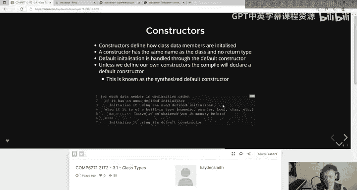

Yeah， can。 I just can't write。We， everyone。Okay。那儿。Her。Unused parameter J。Plus J， right， properly。

This should work。14。What。Does that make sense。5 plus J， which is 4。Oh， yeah， it does， wait。

 what does it？Oh， yeah，cause wait， yeah， yeah does。 Sorry， The math checks out。

 My brain doesn't check out。Yeah， so that's all good。Great。Really， really interesting stuff。

 So that's a constructor initialized list。 You should always do that when you can。嗯。

The synthesized default constructor。3。What happens with C plus plus is there are these notions of synthesized methods。

 which is basically， if C plus plus notices that you aren't doing something manually。

 it will automatically create one for you。 So what I mean by that is that in C plus plus。

 if you don't。Create a constructor。 It will figure out what to do for you。

 It'll actually create this， like。Kind of hidden constructor。

 So if we have a look at an example here， we have this class A， which just has an internet。 Now。

 because there is no constructor defined here。C+ possible actually。Generate a constructive force。

In this case here， because we have a constructor we've defined。

 C++ will not generate a constructor for us。So then when we have this main function here。

 we do into I underscore with the braces 0。And this is just a standard object construction of an int。

So it actually will set the default value to that。 We have in JI。

 which is just untouched memory C style， and then we have a A here。

 which we'll call the default constructor of a， right。

Which in this case will still leave a unassigned because it's just a normal variable。

 but when we call B without any parameters it will call in this one it will actually fail to compile。

 I think， because。Like I'll， I'll show you this。So I'm just going to override this file we have here。

um。BL freezes when I try and copy and paste things。Okay。Class a。Oh。

Should have put this one as a specific example。He， okay， great copy。Oh， no。 What's the problem。

What in the。The F is happening。 Okay， sure。Great， and we're nearly there just one more random chunk of code to copy。

😊，Nearly。Just so close， I can feel it。

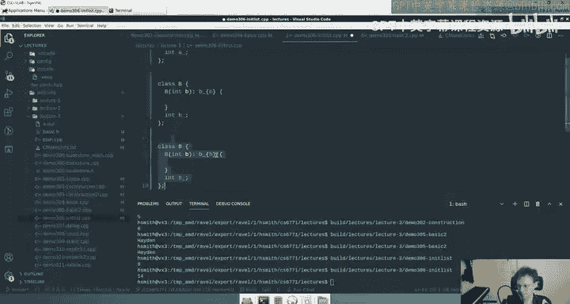

Sir。There we go。 So what's going to happen here。Which is a little bit subtle， is that。

Even though we don't define a constructor here， the compiler will synthesize one for us。

With this one， because we defined a constructor， check out what happens。 I go to build this。

And we get a compile error and it says no matching constructor for initialization of B。

 So what this is basically saying， right is that。I don't know how to construct B with no parameters。

The compiles like， there's no function to do it。You gave me a function for the single parameter。

 but there's no function for no parameters。 But the thing is， that's also true for a。

It's just that because we didn't define any constructors for a。

 the compiler generated one for us a default one。 So the kind of golden rule here is the second that you define a constructor。

 This is true for other things like destructors。 the compiler will not generate one for you if it can。

RightSo once you define one constructor， you need to kind of be aware that you might need to define them for different use cases。

 particularly the default case， so that's just something to keep in mind so the synthesized default constructor will happen。

Whenever you don't like start defining constructors。Another really cool thing is。Delegating deors。

Which is constructors can call other constructors inside the initializer list。 This is kind of cool。

 I can show you this here。 Actually， we can solve this problem is if you say actually I would like a B that takes in nothing。

 you can actually call B again with a particular value like this。😊。

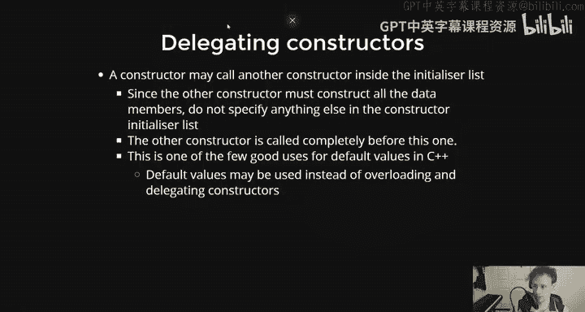

So it's kind of like。Instead of going。B equals B。Beeicles 5， like instead of doing this。

 which is what a default constructor is， right， Like we've got a constructor with no parameters and we just set vehicle to 5。

 we can actually go。 We can use like the initialr list。 But instead of using a data member。

 we can just use the the other constructor， and we can just say B 5 like that。

 So it kind of bootstraps itself。 It calls itself here。 And then this will make this compile now。

 I believe。Or not， calling a private。Oh yeah， because everything in classes is private by default。

Really simple， 306。

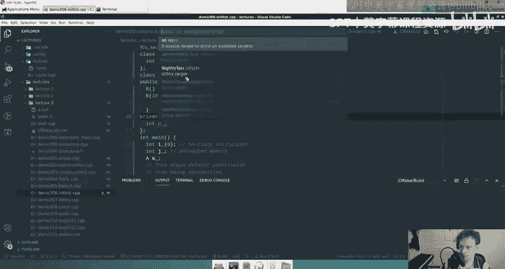

Un use variable I。Who cares， they're going to complain about everything because the compiler is trying to stop us writing a aboutcode。

But I used a that I not save it in time。Oh， private fields not used。What do you want for me anyway。

 you get the point。 This will work now if it wasn't trash， kind of simple code。Oh。

 I had an example for you。 That's great。 This is another example。

 If you want to develop your knowledge further。 This is pretty much what I just did there except it works。

 And it's a little bit more elaborate， but's the same principle。 It's 7，30。

 So I'm not gonna spend too much time there。😊，And then we have destructors。So de structuresors are。

Functions that are called。On the object at the end of its lifetime， basically。My headers。

 basically when it goes out of scope。Pretty much the only time constructors exist because they don't really exist that often。

If if you're freeing pointers， A things you've malled。

 you're closing files or closing network connections or sockets that you've opened or connections to databases or other things。

 or if you're unlocking Mutexes like particular shared resources you've got to lock on as part of multithreadtic code but besides that you don't really deal with it and in fact modern C plus+ has very little de structuress in it because nowadays you can do a lot more on the stack。

 so generally like there's not much really of any reason to。Use raw pointers anymore。

 which we're going to talk about more next week。The week after next week。

And the only other thing is that we put this no except。Stment at the end of our destructor。

 Decations and definitions we're going to talk about what this means at the end of next week。

 but for now， which I don't think you'll do too much of anytime you define a class a define a class can destructor。

 you put a no except out the end all no except really says is that no exceptions will be thrown。

And this is important。Because your destructor can't throw exceptions。The terrible things happen。

 Again， that's next week's topic。 but that's the just。Justist of it for now。

I don't have anything to show you with this because honestly without doing file opening。😊，Maaching。

You don't really have destructors。 So like a destructor for B might be like oops， tilde。

 tilde B like that。 That's a destructor。 And then you define it there in today's， my tu。

 which was recorder or other tus or this week's tu， we， we actually have an example where we use。

Destructors and constructors to keep track of a static variable that tells you how many instances that class exist。

 that's pretty much one of the only trivial examples we can show you。Really。

 without kind of it being a bit tripe。But we will talk more about where you need destructors later on。

 I think。哦。嗯。You'll probably yeah， you'll be writing these structures for your assignment。I think。Oh。

 I don't know， actually。We used to， maybe not anymore。YouReally。

 you don't need destructors unless you are reference counting or。Dealing with role pointers。

 Ro pointers， I mean。Yeah， I don't know， probably not。That's why we don't talk about it much。

It's generally bad style。I I， what do I do。 Okay， yeah we go， okay。

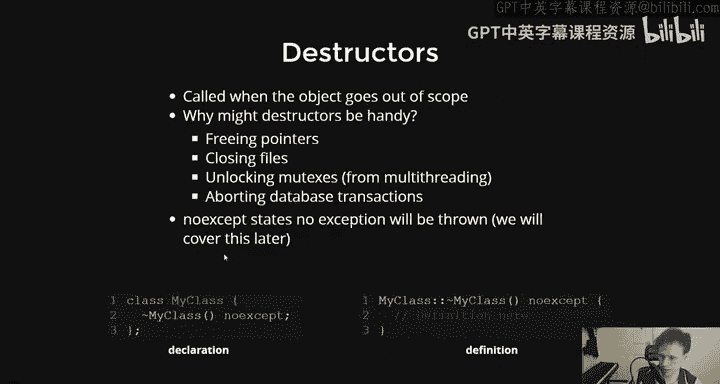

A couple of other really important things about constructors is that。It's crazy。

If a constructor has one parameter， just one parameter， right？

The compiler will create an implicit type conversion from the parameter。To the class。

Now this is a behavior that happens by default and you have to opt out of it and what I mean by that is if we have a look at this piece of code here。

 310 explicit。Jumped ahead a bit。You can see here。That if we have this class called age and a constructor has one parameter。

 that's the key thing here。 The constructor has one parameter， not not0， not2， but has one。

 What will happen is is that you can always construct it like this by saying you know age a1 equals 20 or you can construct it like this by saying a2 equals age of 20 right they're the two standard ways we've talked about and we prefer this one。

 but if there's just one parameter you can actually also do this。

This is what we call an implicit construction， and the key thing to understand here is that the right hand side。

Is。Nm。Not the type。😡，Right， so in this case here， auto A2 equals age 20。

 When the right hand side of the equation gets a s to the left hand side。

 the right hand side is the as an age type， whereas here， the right hand side is a 20。

 and it gets converted to this automatically。 You can actually do this。When can you do it。

 I I'm trying to think about。I think vectors will let you do it。 I think with vectors。

 you can say standard vector int a equals 1，2，3。 I think you can do that as well because it basically will pick up on that。

 you've passed it a single parameter initialiseer list， and then it will implicitly construct it。

 So that's what we call implicit construction。 So this code should work here。 if I do 310。

Unused variable A3。 alright， I'm gonna I'm gonna do it。 Let's do it。哎。Demo 310。Okay。

 so that one works fine。 but if I put an explicit out the front of my single parameter constructors。

Then when I go to compile it， the compiler will complain。

 It'll say conversion from int to non scalar type age requested here。

 So basically the compilers like， I'm sorry， I don't really know what that is。

 I don't know how to convert an int to a goddam age。 That doesn't make any sense。

And this is actually another reason， another reason that we like to put auto on the left。

 because what do you notice about this？I can't say this， this doesn't work。Right。

 like Fcon are trying to implicitly construct an age class。

 This doesn't work because it'll think it's an int A3 will be an in， not an age。

 So that's the other reason why we like to use auto on the left because it forces us。

To actually construct this on the right hand side。Which will stop us kind of writing all these ugly implicit constructions and stuff like that。

 so that's just another reason we ask you to do that。U。

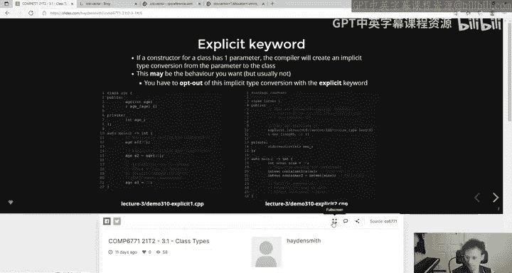

This is another example you can look through to do with a vector。Yeah。

 that one's a little bit more interesting， but again， just for the sake of time。

 I don't want to get caught on it。Okay。Next little bit， constant objects。So。

So I was just thinking about it'd be cool if I cared enough to spend all that time to like annotate my YouTube bids to like。

 you know， there's like YouTube bids now where there's like the little the bar down the bottom has like the little sections and they have like little titles。

 So you could be like， oh， cant objects。 That's where that isn't the lectures。 That'd be cool。But。

 you know， I don't know。 I don't know if I wanna sit down and do that for every lecture。

 maybe if I prered them to reuse them， But anyway， thanks for listening。 So we're。

 we're familiar with Cont。 We're familiar with Cons。Variables， that's like what we did in week one。

 But one thing we haven't talked much about is constant member functions。

 So constant member functions。Are。Member functions that are only possible to do。On， oh， sorry。

 let me， let me read the slides becauseuse I'll probably， it'll probably make more sense。

 Member functions that by default。I think be possible。后来。Okay。Let me just articulate this。

All the member functions that we've defined so far are what you call non constant member functions and a non constant member function。

Can be called from a cons object and a non constants object。But you can make con member functions。

That can only be called on constant objects。 Now I know that sounds like a whole bunch of constant not constant like word magic。

 so we're actually going to look at an example here which will make it a little bit clearer for you。

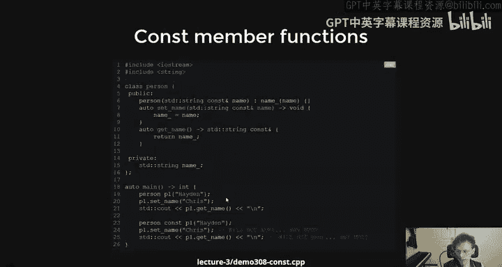

If we have a look at example 308。You can see， for example， 308， we have a person class。嗯。

It has a single parametermeter constructor that we've marked as explicit。Which。

Kind of initializes the user' uniform initialization to initialize the member name。

 which is a string。 And then you can see we have a set name function that takes in a name。

 and it sets the name to that。 And we have a get name function that。呃。

Returns a string and which is the actual string stored。

 And then our main function has an autocon P1 of the person called Hayden。

 and then prints out the person's name。 So that's a pretty straightforward program。

 should be able to build and run that。 F oops， that's the wrong thing。 sorry， build。308。

Explits generally consider good practice because most of the time you want things to be explicit。

It's better for everyone。So I just I don't want to compile it that way。

 sorry I' meant to like build lectures， lecture 3， demo 308。And then Prince Hayden， right。

 so this is exactly what we expected to do。 Now， I don't think this slide is going to take me any further。

 so I'll have to do the rest。 Oh， it did。Is that missing stuff。

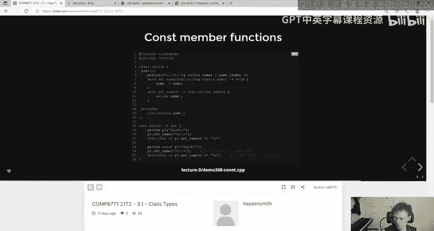

Oh， it isn't missing something， okay。嗯。This is so weird。

Thiss like one this is like one of the slides I haven't changed since last year。 So I don't know。

 maybe I'm crazy， but。I'll just show you on this and then we'll copy it in。

 which is that in our main function we're actually doing two things here。

 which is we're creating a non-cons version of a person called P1， which is Hayden。

 We're setting the name of that person and then we're printing it out and then we're creating a cons version of that person。

 Now you're familiar with using con stuff because you've been doing that in your assignments right。

 You can create a con object or you can create a non-cons object。

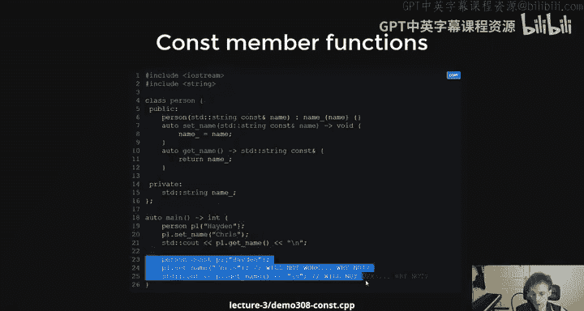

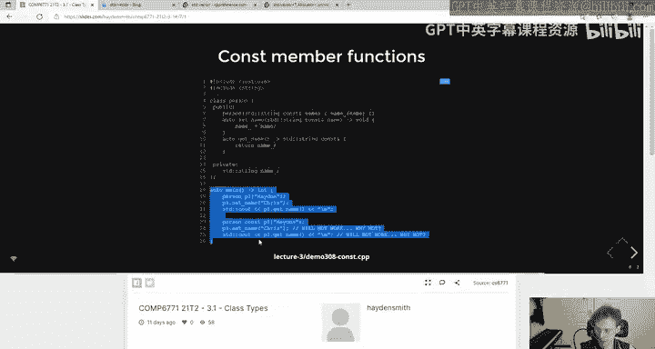

So。Here we kind of have these。These two examples， right， auto P1 equals person。

 And then we have here， auto constanttapy。2， let's make this one。 P2 equals person as well。Now。

 the main point that we're trying to make here is that。These are what you call。😡，Member functions。

 And this one here is what you call a non cons member function。Right， now a non con member function。

Which I think might have been the opposite way I said before。嗯。

Can be called by a constants or nonconing。 So you notice down here， P1 and P2 are both persons。

 right， They're both persons。 It's just that P1 is a noncons person， because it's not con。

You can modify it， right， You can change P1 to be equal to something else。P2， though。

 is a cons person， which means you can't modify it to be equal to something else。 Now。

 that's really critical because cons objects cannot call non cons member functions。

How do I tell whether a member function is cons or non cons， It's actually really simple。

If there is a constant written at the end of the parameter list， it's a constant member function。

 That's it。嗯。So you can see here that this get name is a constant member function。

And the set name here is a non constant member function because there's no constants in here。

 if there was a cons in here， it would be a non constant member function。

Now what are the properties of a cons member function？It can only be called by a constants object。

 and it can't mutate anything inside of its function。So let's first just like look at this。

 so you can see here that our non cons objects， a person， our modifiable P1。

Can call both set name and get name because non cons can call non cons。

Noncons objects can call non constant member functions。

 and noncon objects can also call constant member functions， so this will compile fine。

308 and this will run fine for us。It'll print out Chris because we set the name to Chris。

 and we we printed out the name of that object。 Watch what try， Watch what happens， though。

 if I try to in my get name， do something like。Change name， like stink it to。嗯。Map。Like this。

If I try and set it to be map， what you'll notice is because this is a con member function。

 we'll get this error。Now this error is a bit。Bit tricky to read。

 It says no viable overload for equals。 And then it says candidate function， not viable。

 This argument has typed conant standard string， but method is not marked cont。

 So what this is saying here is that。The this argument。In this case， is expecting it to be。Yeah。

 these compilers are really confusing。It's basically just saying like it has no idea how to deal with this because you're modifying something right。

 And you can kind of pick up on these pretty quick'cause the compiler will like highlight it for you and give you like a roundabout error。

 If I'd remove the constant on this， though。 let's see what happens now， Maybe it still won't work。

Okay， so this one worked and the reason for that is because without the cont。

 this function is allowed to modify things with the cont， it's not allowed to modify things。

Const functions can be called by anyone。 They can be called by consperss。

 They can be called by non consperss。 is totally fine。 No con functions， though。

 don't like being called on。Const objects。 So here I have a constant person。

Who I set the name is Chris。 And then I try and get the name of that person。 Now。

 set name here is the one that's not constant。Right。

 it makes sense we modify we need to modify the name。 It actually is going to mutate something。

 The function needs to be not cons。 there's no way around that。But this won't compile。

Con functions are only for classes， yes。嗯。And this is， well'll get a similar thing here。

 This argument to member function set name has type con person。

So basically what it's saying is this refers to the object。 So it's kind of like the object。

Of member function set name has type cons person。 It's like it's a constant thing。

 I can't call this because it's not cons。 So the implication of this is when you're creating member functions in your classes。

All of your member functions should be marked as constant always。

Unless they can't be because they're mutating something。

 And the reason for that is because if they're not marked as const， our cons objects can't use them。

Right， like if you just didn't have this here， If you got rid of that cont and you weren't even trying to set the name。

 you were just trying to print it out Something fairly harmless。

 This wouldn't work because the compiler would say， sorry， I'm a con object。

 and this is a non con member function。 So we always define our member functions as cons unless we can't。

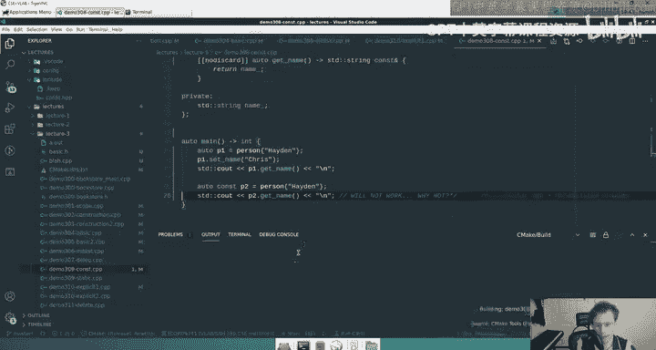

That's the kind of rule here。Where things get more complicated。

As we'll see in assignment one is sometimes you need a con and a non constant version。

We'll talk about this more next week with operator overloading。

 but sometimes you actually need two copies of the same function， one for constant。

 one for not constant。But that's kind of enough to start Constoff now。What are we your left。Okay，2。

 two more， two more rows， static members and deleting unused members。 Okay， this is fine。

 We'll probably finish up really close 8。Maybe a few minutes after we'll see how we go。

Next thing is this idea of static members。

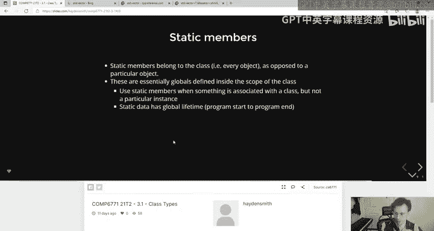

And。I'm assuming that you're familiar with what static is from previous courses that you would have done or anything to do with OO Sta members belong to a class or they belong to every object。

 whichever way you like to think about it， right， every object or the class and then not they don't belong to a particular object because normally every single object is created with its own data members and then those data members belong to the object。

A more functional way to think about statics though。

 for a given class is they're essentially just global variables that are inside the scope of the class and you treat them like global variables and you kind of define them like global variables as well。

 static data members or static functions， but I guess more so data members they also have a global lifetime so they exist from the beginning of the program to the end because they're not attached to a particular class they don't have an object lifetime so they just exist as long as the program runs。

嗯。Soir。What we have here。Trying to remember why there's two of them。Why is there two of these things？

Oh my God， it's like playing spot the difference with myself。I see an extra lion， but I oh yeah。

 the sorry， dirt。 I'm really silly， so。嗯。Yeah， static。

 Maybe I should have looked for the static keyword。 So here on the left here， this is without static。

 So let's say you were making a class for a user， right， You had a user class that defined a user。

 and you wanted to have the ability to check if that username is valid。😊。

So what you might do is you might create a function called valid name that takes in a name。

 and it tells you whether it's valid。 right now， there's better ways to do that。

 But let's say you wanted to do that。 You thought you put it in the class because it's related to the user。

 right， You could make it a global function， but then it's not organized as well。

 So you put it inside your class。 You made it a public member function now。With that。

 this is how you'd call it， right， You construct yourself a string called Santa Claus。

 You construct yourself a user。 Sorry about the indentation here。

And then you say if the user objects， then you call the valid name。

 so valid name is a member function of the user object。If the name here。

 Santa Claus the string is not valid， if it is valid， then we construct a user。On this side though。

 what we've done is we've used a static type Now the reason you should use a static type here is any time。

That your function。Does not。Rely on a data member of the object or process than it doesn't need to be。

A member function can just be a static function。So while we're checking if the names valid。

 we're not actually using the name inside the class here。So in this case， it's static。 Now。

 what does that mean， that means it's not tied to the object， It just means it's tied to the class。

 So the actual definition is pretty similar。 But what's less similar here is that。

When you call it instead of doing U dot， because you're doing an object dot property。

Here we do use a Col colon。Remember how I said before that static functions are essentially like global functions that are scoped inside the class so you call it as if it's a global function but it's inside the class scope and the class is called user so that's how we use static member functions you can define static member functions inside the class or outside the class but what's a lot more common to interact with a static member fields or like data members you might call them so static member fields are usually declared I should say they're usually defined。

probably like update that language。 Theyre usually defined outside of the class scope。

 and we explore this more in your tutorial。 I remember why I left that now because we did that in the tube。

 So how do you create a static Like what do you do if you want your string to be static here。

 Like if you want your string name to be static， Well， you put static out the front of it。

How do you define it， how do you use it Well that's covered in the tutorial this week if you're going to skip your tutorial mine's recorded halfway through uploading it before this lecture so it'll be up tonight really quick and yeah。

I think just another thing。 this just randomly occurred to me， but。

Sometimes you'll be you'll hear me be like， oh， that word should be something。 to be honest with you。

 a lot of that actually comes from like the more you spend time with a language like C plus plus。

 the more you realize how。Powerful languages and communicating stuff。

 like talking about constant on non constant objects or classes。 Like you'll hear a lot of students。

 right， You know， they'll use classes and objects。interterchangeably， they'll be like， oh， you know。

 I created a class here and it's like。You didn't create a class。Right。So。Yeah。嗯。Anyway。

 my point is like that's why you'll see some random updates because sometimes it'll just click for me that like I've done the same thing we all do where we say declare when we mean define or objects and。

 objects instances classes。 And I think language is really awesome。

 And I think that's one thing that actually helps separate like a good software engineer from a great one。

😊，嗯。So the last thing we'll go through today， remember but this is in the。

 you can go look at the ch for this。 It's question4， the solutions are released on Friday night。

 It's not related to assignment one at all， so don't stress The last one is unused and deleting unused default member functions。

嗯。And this is kind of a really interesting one because we said before about。Synthesized constructors。

呃。Where。If we have a class like this， like an inf。

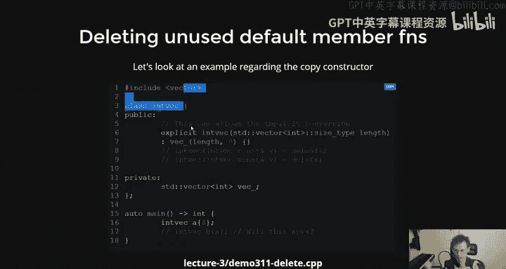

Okay， and I think I have an example of this that we can talk to。Yeah。

 so if we have a class like this inf and you can see that we've created ourselves a。

An explicit invec constructor where it takes in a length， which is of standard vector in size type。

 And then it。呃。Yep， it initializes a list， constructs that。Dck。Using that constructor we saw before。

 where you give it the length and the0， were using。

We're using the parentheses here instead of the braces because otherwise it would mistake this for constructing a vector with two values as initial。

As an initialr list， whereas here we're trying to say no， no， no。

 I want to call the function that takes in a size and then the type so this will create length of zeros。

😊，Now， because I created this constructor。The compiler， if you remember before。

 will not synthesize another constructor for me。Okay， it will。呃。Yeah， it will essentially。

Not remember how we said that if you don't define any constructors。

 the compiler will synthesize one for you here it won't do that because we've actually created one。

 So what that means is that for this code here， this will compile because I create a vector and then I create an infect which gives the size of that vector and when I go to actually compile this one demo 311。

Oops。It will do nothing because I did nothing， but it will compile because it's valid。

 But if I try and do infect B A。Here。Which is a little bit on the copy constructor side from last week。

 In fact， I might even just try inve B like this like a default constructor， right， Oh。

 I've already got that above。 Sorry， here it is。 That's where it is。

So if I try and just create an infect with no parameters， what happens here doesn't compile right。

 because the compiler does not automatically generate for me a constructor because I defined one。

 but we can actually fix that funnily enough by doing this。

 we can say infect brackets equals default。 Now， if you say a constructor is equal to default。Right。

Then。What happens is the compiler will essentially synthesize one for you。

 So it's kind of like reversing their decision where you're like the compilers like， oh。

What's it doing Oh redefin of a where the compiler is like， oh， I see you made a constructor。

 I won't create one for you and you're kind of like， oh actually no， no， I want you to create one。

 please do it。 So this will actually force the compiler to create a synthesized constructor。

That's kind of what that does。And then similarly， just to I guess， really to really ring this out。

Sometimes the compiler will create other types of constructors for you。

Like this one is a copy constructor， so you haven't talked about this and this is very much a week five topic。

But essentially， for most classes you create。If you give it one parameter that is the exact same class type。

 it will often just immediately be like， well， I'm literally just going to take that。

 I'm going to take all your members and I'm going to copy everything。 That's what it'll try and do。

But in this case， it's like， sorry， I am not going to exist because I think because we made a construct too。

 I think that's how this works。 I'm not a huge， not hugely across this one。

No matching constructive or inf。A is a vector。 Oh， it needs to be C。 It needs to be another inveect。

 sorry， it can't be a vector。 It needs to be an inve。 That's the problem。

 I tried to pass a vector into it instead of my custom class。

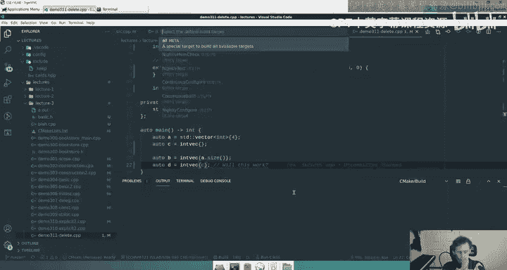

But then here， when I run this， this now works。 And in fact， I wonder if I needed that。

 Let's try that out。 So let's see if I needed that extra line here。

So what you can see is that's how I thought it would happen。

 I was confused is that when I said before that when you define a constructor。

 the compiler doesn't create any other default constructors。

It it actually just doesn't create the literal default constructor with no parameters。

 but what it still does do automatically is it will actually create other constructors like the copy constructor。

 So without ever specifying this， your object is able to be constructed by an object of the same type。

Without you having to write anything， it is synthesized for you。

If you want to tell the compiler to not allow that to happen。

 which there are some cases which we'll talk about in week five where that's the case。

 you can actually instead of saying default， you can kind of say delete so default and delete are the keyword that allow you to kind of instruct the compiler how to tweak its manual like it automatic behavior here so delete saying no no no don't let anyone do this don't let anyone copy constructors and therefore the compiler will fail this because it says call to delete a constructor so the compiler is sayingHey。

 this constructor was deleted you're not allowed to do this anymore。Yeah， and that's pretty much it。

😊，7，57， pretty much wrap up there。 There's some。There's a demo 300 you can play around with。

 It's also some more class stuff。 You can try and implement some things if you want。

 but we're not gonna go through it in lectures。 It's an older example。 So the style is all different。

 We just threw it here because it was around， like。It's not like core teaching。

 it's just if you want some extra stuff。Yeah， and that's it so。

You don't you shouldn't use classes for assignment one that they would be grossly overcomplicating it。

 assignment one is just a function， classes would be overkill。嗯。

Is there a difference between copying with auto A equals in Vex C and auto A equals C？

So， really quick。If I just did。If I just did。This。Then without getting into the specifics。

I think this is Nathaniel knows Nathaniel's a genius if you haven't seen him on the farm。

This is either copy construction， this is either implicit copy construction or it's no。

 it it's copy construction。 Yeah， I think it's just implicit。

 I think if you put explicit out the front， it might not work。

I'm not sure you could play around with it， though。 but that's， that's the generalist of what it is。

 Anyway， cool。 Thank you， everyone。 I hope you have a good night。 And I'll see you on Monday。

 It's really short week， isn't it， But I'm good luck with your assignment。

 and I'll send you an update on the weekend and go to your toos'ca it's interesting。

 So have a good night。 Thank you， everyone。😊。