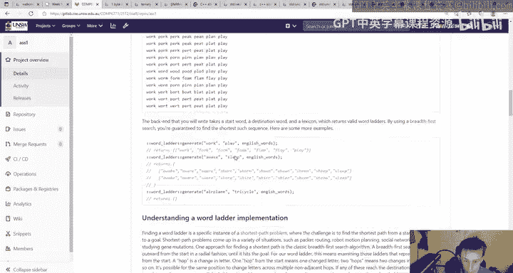
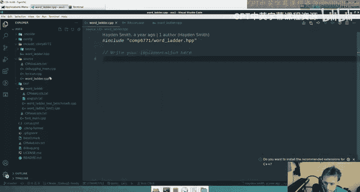
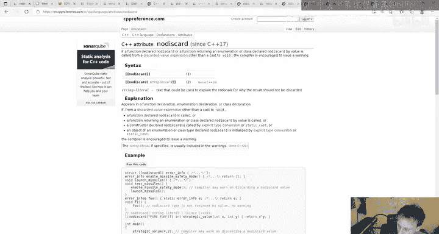
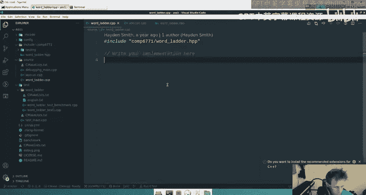

# 005：作业1 - 单词梯详解 🪜

在本节课中，我们将要学习COMP6771课程的第一个作业：构建一个“单词梯”（Word Ladder）程序。这是一个旨在帮助你熟悉C++标准库和基本算法的入门项目。

## 概述

作业1要求你使用C++构建一个单词梯查找程序。单词梯是一种文字游戏，你需要通过每次只改变一个字母的方式，将一个起始单词转换为一个目标单词，并且转换过程中的每一个中间单词都必须是有效的英文单词。例如，从 `code` 到 `data` 的一个可能路径是：`code` -> `cade` -> `cate` -> `date` -> `data`。本作业的核心是编写一个函数，在给定的词典中，找出两个单词之间所有最短的转换路径。

## 核心概念与算法



上一节我们介绍了单词梯的基本概念，本节中我们来看看其背后的核心算法。

从本质上讲，寻找单词梯是一个**图搜索问题**。我们可以将每个单词视为图中的一个**节点**。如果两个单词之间仅有一个字母不同，我们就在它们之间建立一条**边**。这样，整个词典就构成了一张巨大的图。

因此，寻找从单词A到单词B的单词梯，就等价于在这张图中寻找从节点A到节点B的**最短路径**。由于所有边的权重相同（即每次只改变一个字母），我们可以使用**广度优先搜索（BFS）** 算法来高效地解决这个问题。BFS能够保证我们找到的路径是最短的。

以下是该问题的一个抽象描述：
```cpp
// 核心函数签名
std::vector<std::vector<std::string>> generate(
    const std::string& start,
    const std::string& end,
    const std::unordered_set<std::string>& lexicon
);
```
该函数接收起始单词、结束单词和一个包含所有有效单词的词典（`lexicon`），返回所有最短的单词梯路径。

## 作业要求详解

理解了算法基础后，我们来看看完成作业需要满足的具体要求。

### 功能要求
*   必须实现 `generate` 函数，进行广度优先搜索。
*   必须进行**环路检查**，避免搜索陷入无限循环（例如 `dog` -> `cog` -> `dog` ...）。
*   如果存在多条最短路径，必须返回**所有**解决方案。
*   返回的解决方案必须按**字典序**排序。例如，所有路径应首先按第一个不同的单词排序，以此类推。

### 评分构成
作业占总成绩的15%，评分细则如下：
*   **50% - 正确性：** 通过自动化测试评估你的代码输出是否正确。
*   **25% - 测试：** 你需要使用 Catch2 框架编写测试用例。评分依据包括：
    *   **测试正确性：** 测试是否有效验证了代码功能。
    *   **测试覆盖率：** 是否涵盖了关键和边缘情况。
    *   **黑盒测试：** 测试应只通过 `generate` 等公共接口进行，不应依赖内部实现细节。
    *   **清晰度：** 代码注释和逻辑布局是否清晰。
*   **20% - C++最佳实践：** 评估代码质量，例如正确使用 `const`、`auto`、引用、避免C风格数组和裸指针、使用范围for循环等。
*   **5% - 代码风格：** 使用 `clang-format-11` 工具自动格式化代码。只要代码能通过 `clang-format` 的检查，即可获得这部分的分数。

### 性能与提交
*   **时间限制：** 每个 `generate` 函数调用必须在 **15秒** 内完成（在CSE机器上运行）。单词梯搜索是一个**NP完全问题**，对于某些困难的单词对，你需要优化算法（例如使用更高效的数据结构）来满足时间要求。
*   **内存：** 虽然没有严格的硬性限制，但你的程序应合理使用内存（通常应远低于1GB）。
*   **截止日期：** 第3周星期五晚上8点。迟交每小时扣总分的2%。
*   **学术诚信：** 严禁抄袭，我们将使用查重软件进行检查。

## 项目结构与起步

现在我们对任务有了清晰的认识，接下来看看如何开始动手编码。



项目已经提供了基础结构，你需要关注以下关键文件：
*   `src/word_ladder.cpp`: 这是你需要主要实现 `generate` 函数的地方。
*   `src/lexicon.cpp`: 已提供辅助函数 `read_lexicon`，它负责从文件（如 `english.txt`）中读取词典并返回一个 `std::unordered_set<std::string>`，你可以直接使用。
*   `src/debugging_main.cpp`: 提供了一个简单的 `main` 函数，方便你在不运行完整测试套件的情况下快速测试和调试你的代码。
*   `test/`: 目录下存放你的 Catch2 测试文件。我们已经提供了一个示例测试 `sample_test.cpp` 和一个高难度的性能测试 `benchmark.cpp`。
*   `include/comp6771/word_ladder.hpp`: 头文件，包含了函数的声明。





以下是起步建议：
1.  仔细阅读 `word_ladder.hpp` 中的函数声明。
2.  在 `word_ladder.cpp` 中实现 `generate` 函数。
3.  利用 `debugging_main.cpp` 进行初步的功能验证。
4.  在 `test/` 目录下编写全面的测试用例，覆盖正常情况、边界情况和可能的错误。

## 总结

本节课中我们一起学习了COMP6771的第一次作业。我们了解了**单词梯**的概念，其本质是一个**图的最短路径搜索问题**，可以通过**广度优先搜索（BFS）** 算法解决。作业要求我们实现核心的 `generate` 函数，并关注正确性、测试覆盖、代码风格和性能。项目提供了良好的起始框架，包括词典读取和调试入口。请务必尽早开始，利用好提供的测试工具，并注意遵守C++的最佳实践。祝你编程愉快！