# 007：STL迭代器

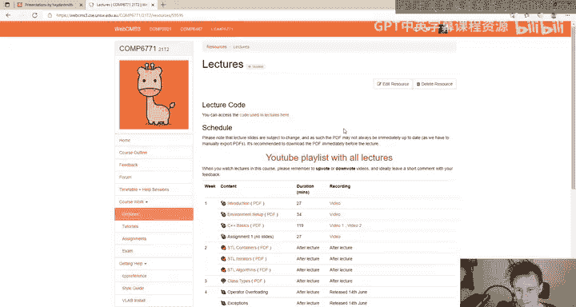

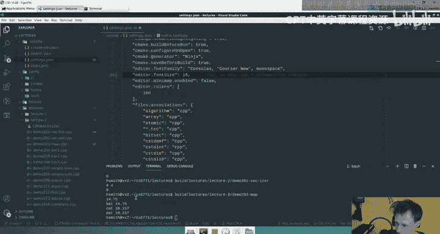

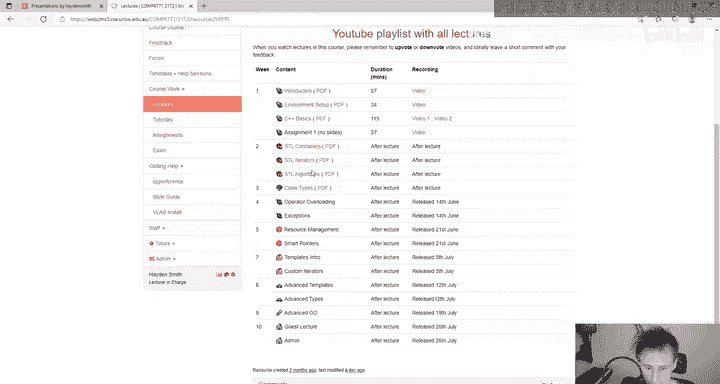

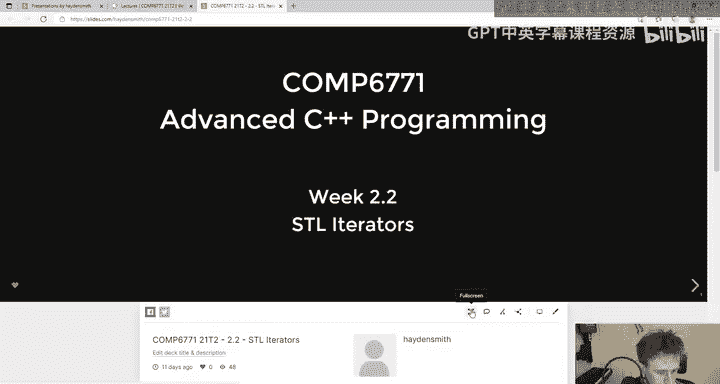

在本节课中，我们将要学习C++标准模板库（STL）中的一个核心概念：迭代器。迭代器是连接容器与算法的桥梁，它提供了一种统一的方式来访问和遍历各种容器中的元素，无论这些容器在内存中是如何组织的。

上一节我们介绍了STL容器，本节中我们来看看如何以一种通用的方式访问这些容器中的元素。

## 迭代器的基本概念

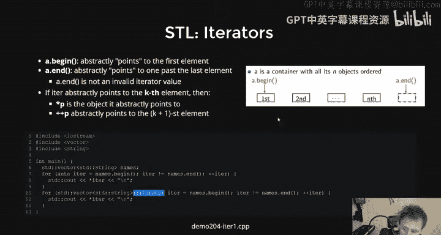


迭代器是一个抽象的概念，它**模拟了指针的行为**。你可以将迭代器想象成一个“智能指针”，它知道如何在特定的容器中移动到下一个（或上一个）元素。

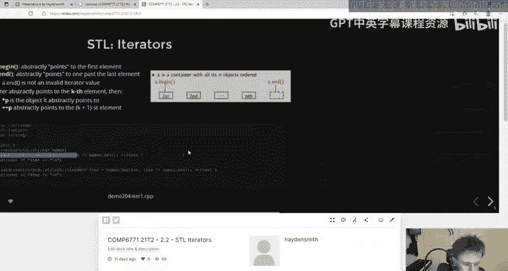

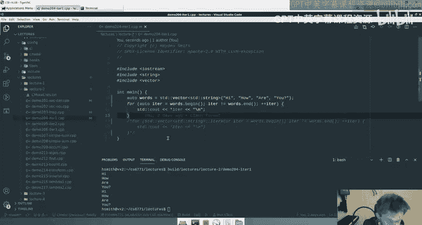

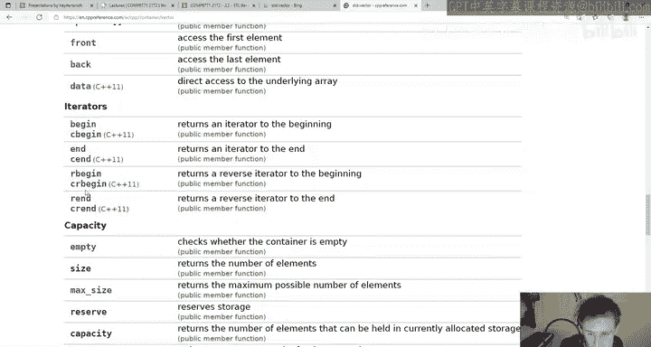

一个迭代器类型通常由容器提供。当你调用容器的 `.begin()` 方法时，你会得到一个指向容器第一个元素的迭代器。当你调用 `.end()` 方法时，你会得到一个指向容器“末尾之后”位置的迭代器（注意，它不指向最后一个元素，而是指向最后一个元素之后的位置）。

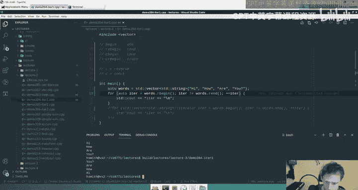

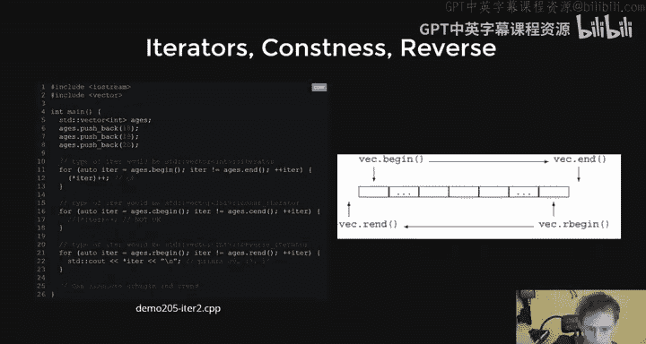

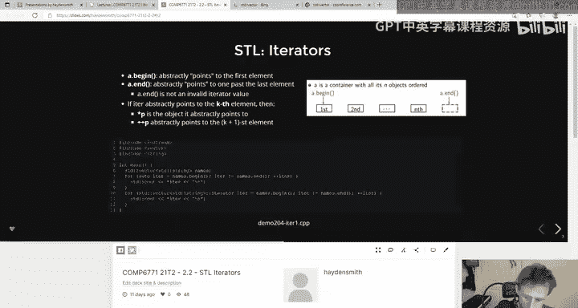

以下是一个使用迭代器遍历 `std::vector` 的基本示例：
```cpp
std::vector<std::string> words = {"Hi", "how", "are", "you"};
for (auto it = words.begin(); it != words.end(); ++it) {
    std::cout << *it << std::endl; // 使用 * 操作符解引用迭代器，获取元素值
}
```
在这段代码中，`it` 是一个迭代器。`++it` 操作将其移动到下一个元素，`*it` 解引用它以获取当前元素的值。这个循环的逻辑与使用指针遍历数组完全相同。

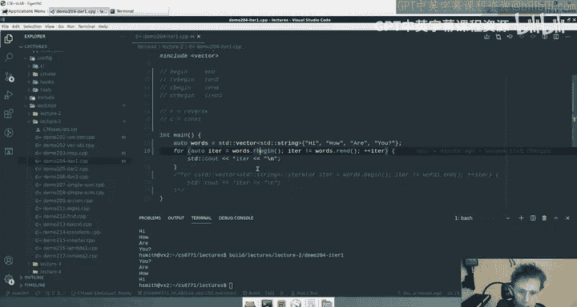

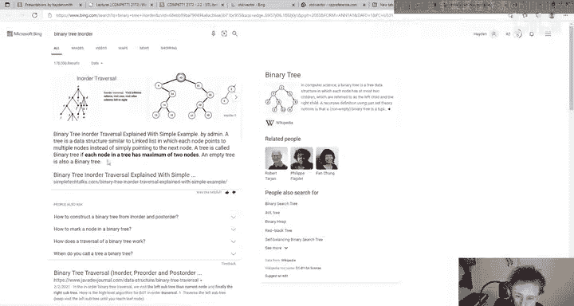

## 迭代器的类型与操作

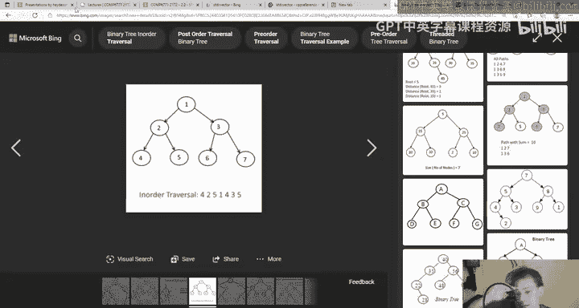

STL提供了多种类型的迭代器以适应不同的遍历需求。

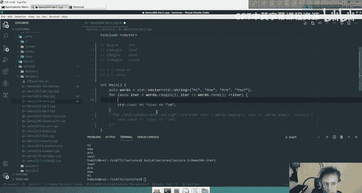

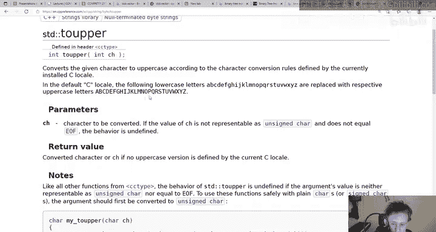


以下是几种常见的迭代器获取方法：
*   **`.begin()` / `.end()`**：获取指向容器起始和末尾之后的正向迭代器。
*   **`.rbegin()` / `.rend()`**：获取反向迭代器。`.rbegin()` 指向最后一个元素，`.rend()` 指向第一个元素之前的位置。递增反向迭代器（`++`）会向容器的前端移动。
*   **`.cbegin()` / `.cend()`**：获取常量迭代器。通过常量迭代器解引用得到的是 `const` 引用，**不能用于修改容器中的元素**。这有助于表达代码的意图并防止误操作。


尝试通过常量迭代器修改元素会导致编译错误：
```cpp
std::vector<std::string> words = {"a", "b"};
for (auto it = words.cbegin(); it != words.cend(); ++it) {
    *it = "hello"; // 编译错误！不能给常量赋值
}
```

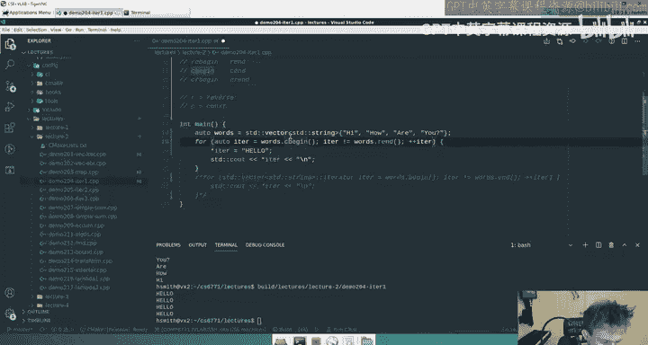

## 迭代器的优势与抽象

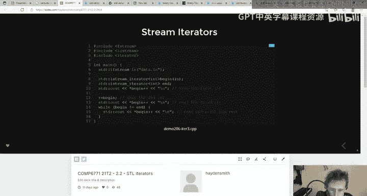

迭代器的核心优势在于其提供的**抽象层**。对于算法而言，它不需要知道底层是数组、链表还是树；它只需要一个能线性移动并访问元素的迭代器。

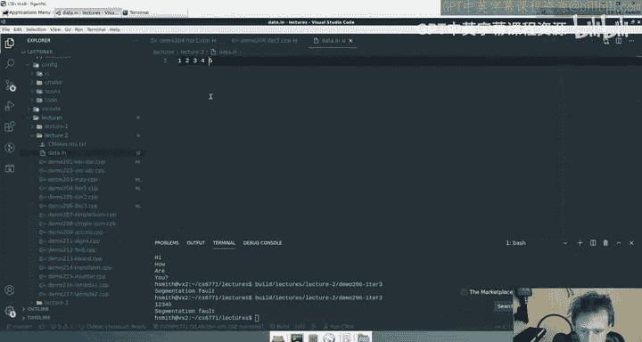

例如，无论是对 `std::vector`（连续内存）、`std::list`（链表）还是 `std::map`（平衡树），一个通用的查找算法都可以通过它们的迭代器工作。容器负责实现自己的迭代器，使其能够以线性的方式“走遍”所有元素（例如，`std::map` 的迭代器可能实现了中序遍历）。

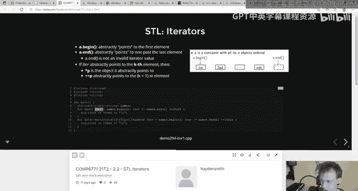

## 迭代器在查找中的实际应用

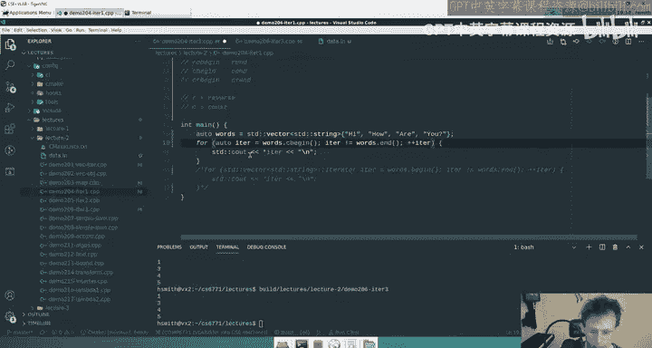

迭代器的一个常见用途是与容器的 `.find()` 方法结合，进行高效的查找。

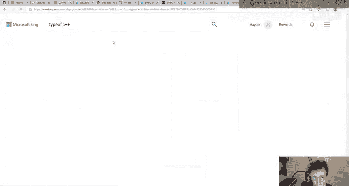

以下是几种在 `std::map` 中检查元素是否存在并获取其值的方法比较：
```cpp
std::map<std::string, int> m = {{"cat", 10}, {"dog", 20}};
std::string key = "cat";

// 方法1：使用迭代器和 .find()
auto it = m.find(key); // 一次查找
if (it != m.end()) {
    // it 是一个指向 std::pair<const std::string, int> 的迭代器
    std::cout << "Value found via iterator: " << it->second << std::endl;
}

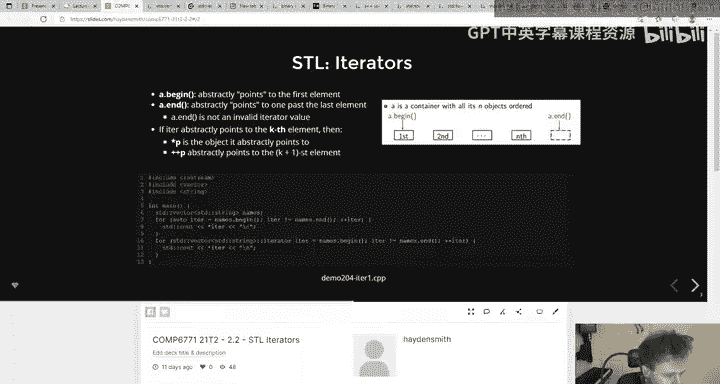

// 方法2：使用 .contains() (C++20) 和 .at()
if (m.contains(key)) { // 第一次查找
    std::cout << "Value found via contains/at: " << m.at(key) << std::endl; // 第二次查找
}

// 方法3（旧式）：直接使用 .at() 并捕获异常
try {
    std::cout << "Value found via at (with exception): " << m.at(key) << std::endl;
} catch (const std::out_of_range& e) {
    std::cout << "Key not found." << std::endl;
}
```
使用 `.find()` 并返回迭代器通常是高效且灵活的做法，因为它**只进行一次查找**。如果找到了元素，迭代器可以直接用来访问或修改它，也可以用来进行后续的遍历（例如，找到该元素后面的所有元素）。而 `.contains()` 配合 `.at()` 需要进行两次独立的查找，在性能敏感的场合可能效率较低。直接使用 `.at()` 则依赖于异常处理，可能会影响程序的控制流。

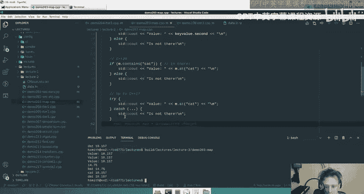

## 流迭代器

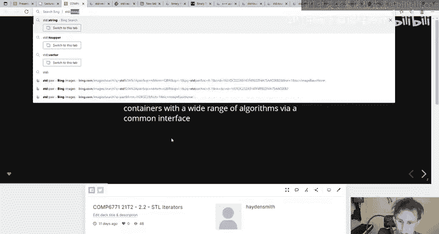

迭代器的概念甚至扩展到了输入/输出流。你可以创建 `std::istream_iterator` 来从输入流（如文件或标准输入）中读取数据，就像遍历容器一样。
```cpp
#include <iterator>
#include <fstream>

std::ifstream file("data.txt");
std::istream_iterator<int> input_begin(file);
std::istream_iterator<int> input_end; // 默认构造的迭代器代表“流结束”

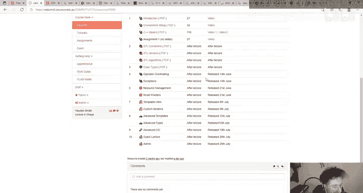

for (auto it = input_begin; it != input_end; ++it) {
    std::cout << *it << " "; // 从文件中读取并打印整数
}
```

本节课中我们一起学习了STL迭代器。我们了解了迭代器如何作为抽象指针，为各种容器提供统一的遍历接口。我们探讨了正向、反向和常量迭代器的区别，并通过实例看到了迭代器在查找操作中的实际应用和性能考量。最后，我们简要了解了迭代器概念如何扩展到I/O流。理解迭代器是有效使用STL算法（我们将在下一节讨论）的关键。