# 010：运算符重载 🧮

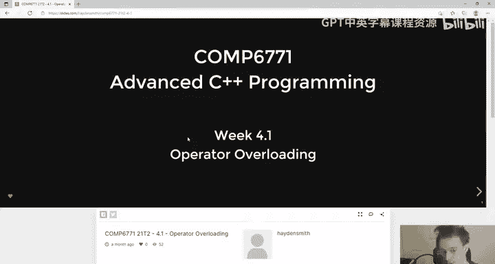

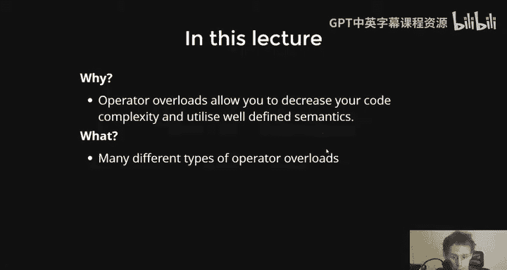

在本节课中，我们将要学习C++中一个非常强大且核心的特性：运算符重载。运算符重载允许我们为自定义类型（如类）定义运算符（如 `+`、`-`、`<<`）的行为，从而复用已有的、语义清晰的运算符，使代码更简洁、更易读。

## 为什么需要运算符重载？

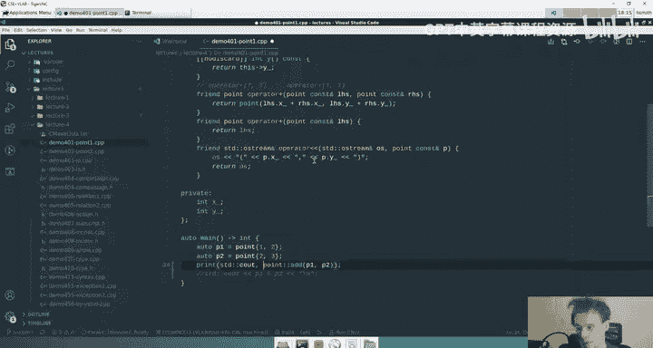

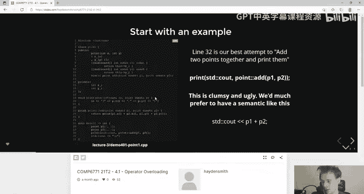

上一节我们介绍了运算符重载的基本概念，本节中我们来看看它如何简化代码。考虑一个简单的 `Point` 类，它表示一个二维点，包含 `x` 和 `y` 坐标。

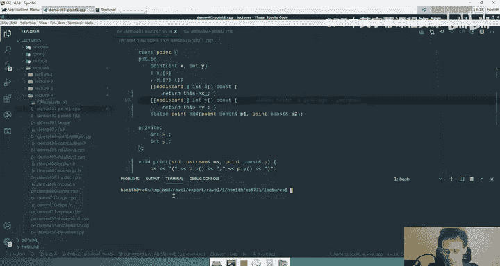

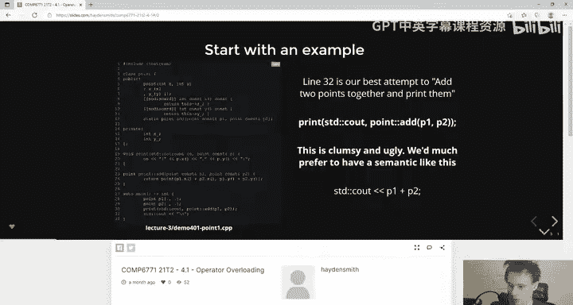

如果没有运算符重载，我们可能需要定义一个静态函数来执行加法，并定义一个独立的函数来打印点：

```cpp
class Point {
public:
    Point(int x, int y) : x_{x}, y_{y} {}
    int get_x() const { return x_; }
    int get_y() const { return y_; }
    static Point add(const Point& p1, const Point& p2) {
        return Point{p1.get_x() + p2.get_x(), p1.get_y() + p2.get_y()};
    }
private:
    int x_;
    int y_;
};

void print(std::ostream& os, const Point& p) {
    os << "(" << p.get_x() << ", " << p.get_y() << ")";
}

int main() {
    Point p1{1, 2};
    Point p2{3, 4};
    print(std::cout, Point::add(p1, p2)); // 输出 (4, 6)
}
```

这种方式虽然可行，但语法繁琐且不直观。用户需要知道 `add` 这个特定函数名，并且打印操作也显得冗长。

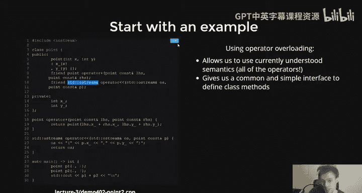

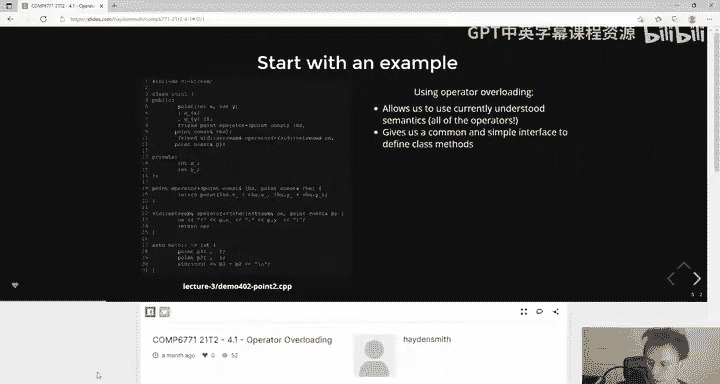

通过运算符重载，我们可以将代码简化为更自然的形式：

```cpp
std::cout << p1 + p2 << std::endl;
```

这行代码的含义一目了然：打印 `p1` 和 `p2` 的和。接下来，我们将学习如何实现这种简洁的语法。

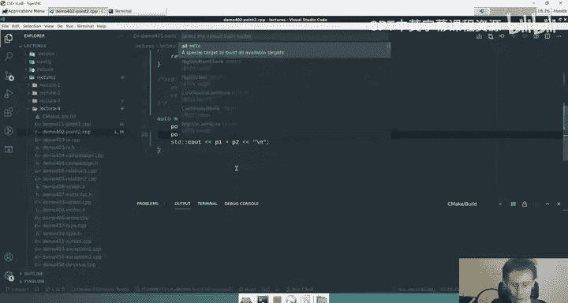

## 运算符重载的基本原理

运算符重载本质上就是定义了一个特殊命名的函数。当编译器遇到像 `p1 + p2` 这样的表达式时，它会去寻找一个名为 `operator+` 的函数，该函数接受两个 `Point` 类型的参数。

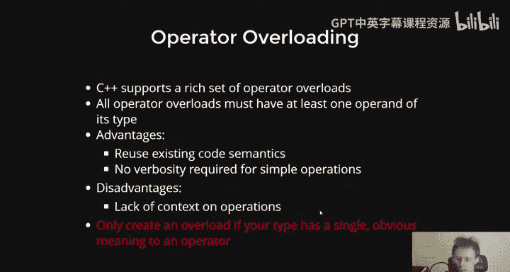

以下是实现上述简洁语法的 `Point` 类：

```cpp
class Point {
public:
    Point(int x, int y) : x_{x}, y_{y} {}
    // 声明运算符重载函数
    friend Point operator+(const Point& lhs, const Point& rhs);
    friend std::ostream& operator<<(std::ostream& os, const Point& p);
private:
    int x_;
    int y_;
};

// 定义运算符重载函数
Point operator+(const Point& lhs, const Point& rhs) {
    return Point{lhs.x_ + rhs.x_, lhs.y_ + rhs.y_};
}

std::ostream& operator<<(std::ostream& os, const Point& p) {
    os << "(" << p.x_ << ", " << p.y_ << ")";
    return os; // 返回输出流以支持链式调用
}

int main() {
    Point p1{1, 2};
    Point p2{3, 4};
    std::cout << p1 + p2 << std::endl; // 输出 (4, 6)
}
```

现在，`p1 + p2` 会调用我们定义的 `operator+` 函数，而 `std::cout << ...` 会调用我们定义的 `operator<<` 函数。代码的语义变得非常清晰。

## `friend` 关键字与访问控制

在上面的例子中，我们使用了 `friend` 关键字。这是因为 `operator+` 和 `operator<<` 是**全局函数**，而不是类的成员函数。它们需要访问 `Point` 类的私有成员 `x_` 和 `y_`。

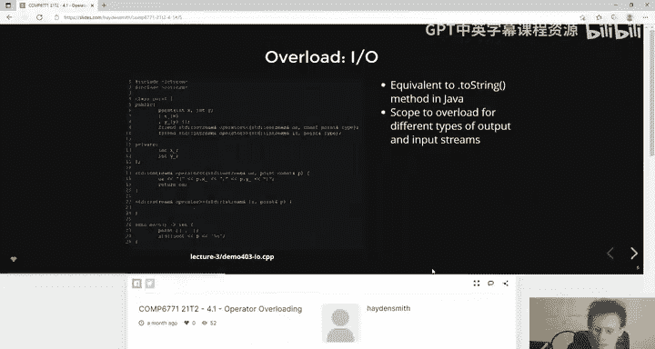

`friend` 关键字的作用是：它允许一个全局函数（或另一个类）访问当前类的私有和保护成员。你可以将其理解为“授予朋友访问私人部分的权限”。

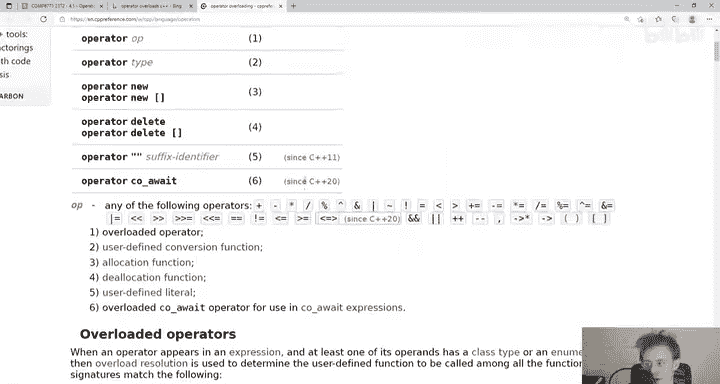

*   **何时需要 `friend`？** 当运算符重载函数是全局函数，并且需要直接访问类的私有数据成员时（例如，当类没有提供相应的公共接口时）。
*   **何时不需要 `friend`？** 当运算符重载函数是类的成员函数时（例如 `+=`），或者当它可以通过类的公共接口（如 `get_x()`）完成工作时。

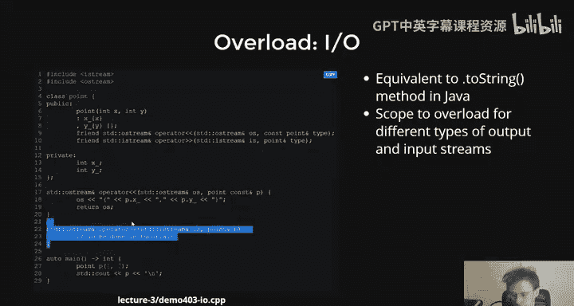

## 成员运算符 vs. 友元运算符

并非所有运算符重载都必须是友元函数。根据运算符的性质，它们可以分为成员运算符和友元（全局）运算符。

以下是常见的分类：

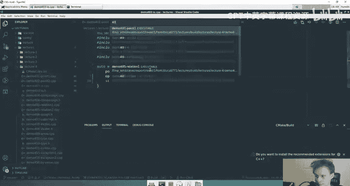

*   **成员运算符**：这些运算符通常作用于对象自身，并可能修改对象的状态。
    *   赋值运算符：`=`, `+=`, `-=`, `*=`, `/=`
    *   下标运算符：`[]`
    *   递增/递减：`++`, `--`
    *   成员访问运算符：`->`, `*`（解引用）
    *   函数调用运算符：`()`

*   **友元（全局）运算符**：这些运算符通常不修改参数，而是基于参数产生一个新值。它们通常需要访问私有成员。
    *   算术运算符：`+`, `-`, `*`, `/`
    *   关系与相等运算符：`==`, `!=`, `<`, `>`, `<=`, `>=`
    *   输入/输出流运算符：`<<`, `>>`

### 成员运算符示例：`+=`

`+=` 运算符修改左侧操作数，因此它非常适合作为成员函数。

```cpp
class Point {
public:
    // ... 其他成员 ...
    Point& operator+=(const Point& rhs) { // 返回引用以支持链式赋值
        x_ += rhs.x_;
        y_ += rhs.y_;
        return *this; // 返回当前对象的引用
    }
private:
    int x_;
    int y_;
};

int main() {
    Point p1{1, 2};
    Point p2{3, 4};
    p1 += p2; // p1 现在变为 (4, 6)
    (p1 += p2) += p2; // 链式调用，p1 最终为 (7, 8)
}
```

注意 `operator+=` 返回 `Point&`（引用），并返回 `*this`。这模仿了内置类型的行为，允许链式赋值（如 `a += b += c`）。

### 利用已有运算符实现新运算符

我们可以利用已经定义好的成员运算符（如 `+=`）来实现对应的友元运算符（如 `+`），避免代码重复。

```cpp
class Point {
public:
    // ... 其他成员和 operator+= ...
    friend Point operator+(const Point& lhs, const Point& rhs);
};

Point operator+(const Point& lhs, const Point& rhs) {
    Point result = lhs; // 拷贝构造 lhs
    result += rhs;      // 使用已定义的 operator+=
    return result;      // 返回新对象（不是引用）
}
```

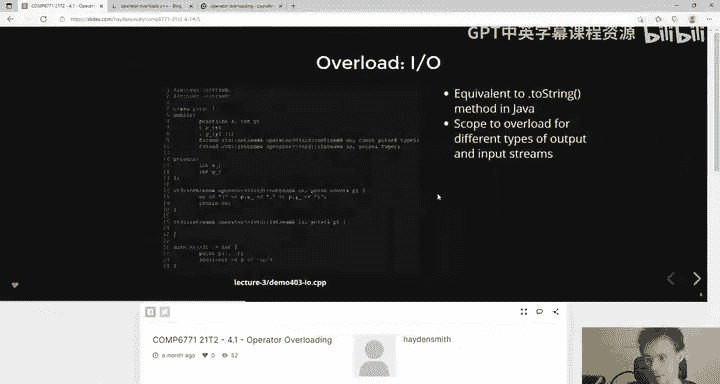

这样，`operator+` 的实现就简洁地复用了 `operator+=` 的逻辑。

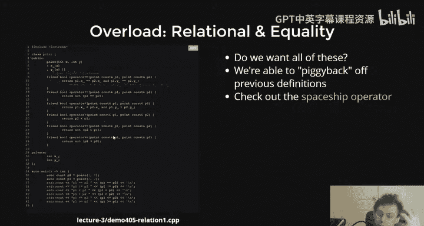

## 关系与相等运算符

关系运算符（`<`, `>`, `<=`, `>=`）和相等运算符（`==`, `!=`）也通常是友元函数。一个常见的技巧是只定义最基本的运算符（如 `==` 和 `<`），然后基于它们定义其他运算符。

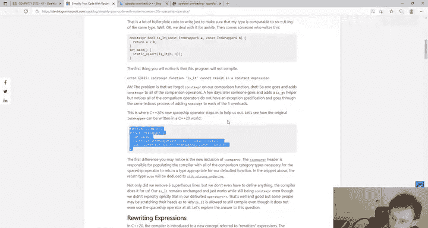

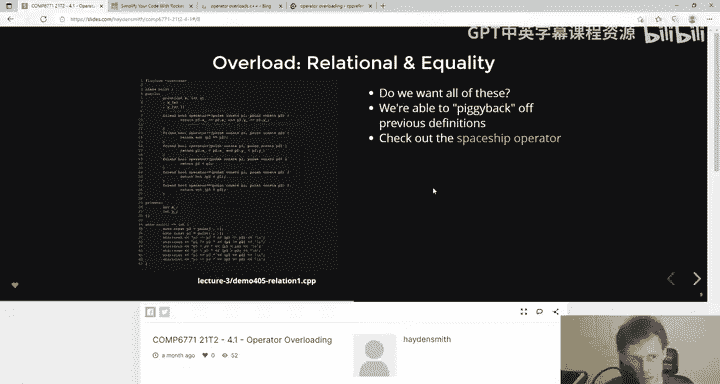

```cpp
class Point {
public:
    // ... 其他成员 ...
    friend bool operator==(const Point& lhs, const Point& rhs);
    friend bool operator<(const Point& lhs, const Point& rhs);
};

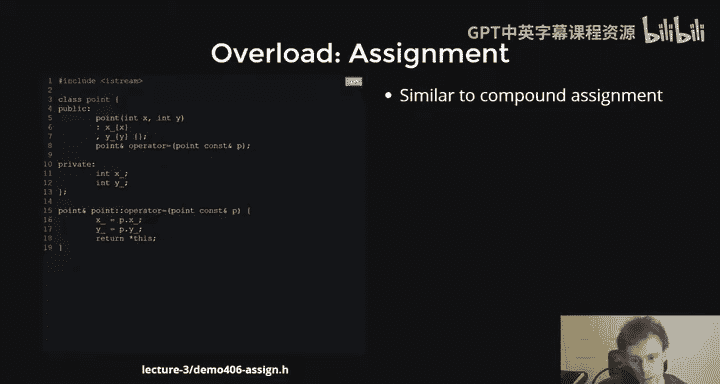

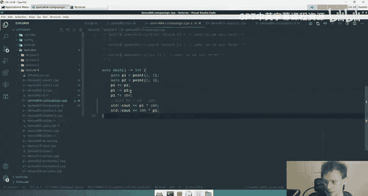

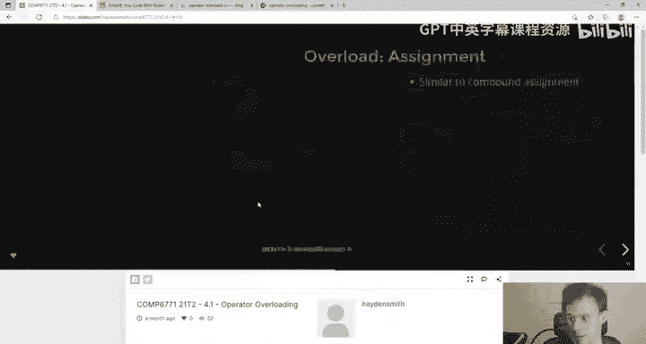

bool operator==(const Point& lhs, const Point& rhs) {
    return lhs.x_ == rhs.x_ && lhs.y_ == rhs.y_;
}

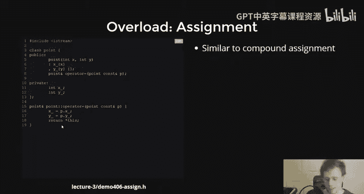

bool operator!=(const Point& lhs, const Point& rhs) {
    return !(lhs == rhs); // 基于 operator==
}

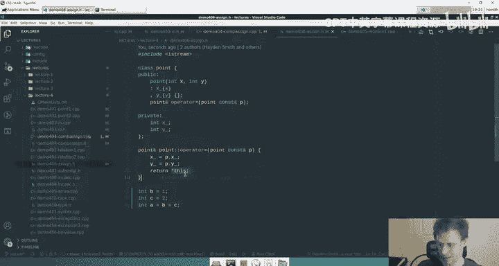

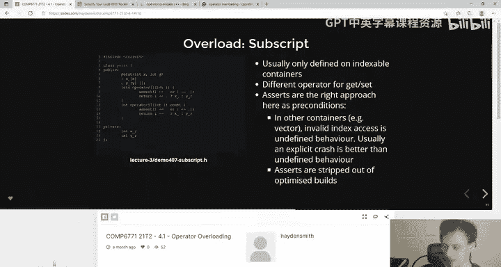

bool operator<(const Point& lhs, const Point& rhs) {
    // 定义一种排序规则，例如先比较 x，再比较 y
    if (lhs.x_ != rhs.x_) return lhs.x_ < rhs.x_;
    return lhs.y_ < rhs.y_;
}

bool operator>(const Point& lhs, const Point& rhs) {
    return rhs < lhs; // 基于 operator<
}

bool operator<=(const Point& lhs, const Point& rhs) {
    return !(rhs < lhs); // 基于 operator<
}

bool operator>=(const Point& lhs, const Point& rhs) {
    return !(lhs < rhs); // 基于 operator<
}
```

## 需要特别注意的运算符

### 下标运算符 `[]`

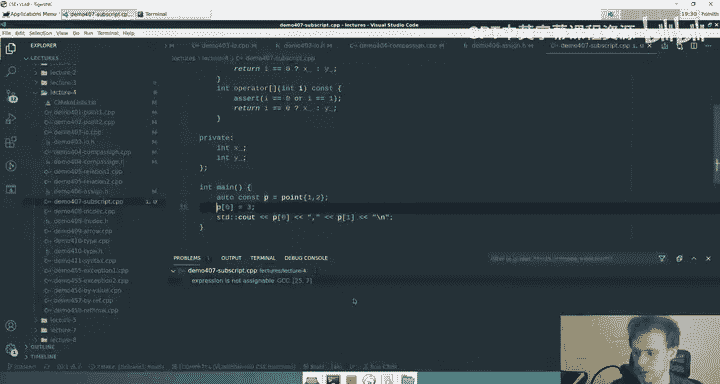

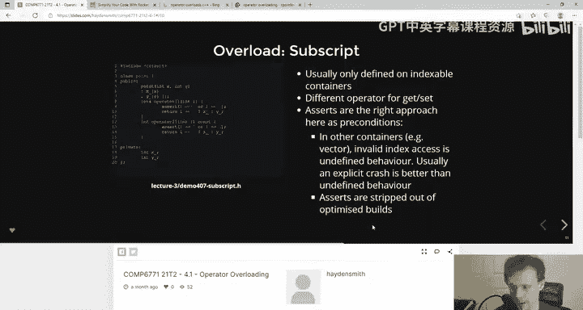

下标运算符必须是成员函数。一个关键点是，为了同时支持常量对象和非常量对象，我们通常需要提供两个版本。

```cpp
class Point {
public:
    // ... 其他成员 ...
    int& operator[](int index) { // 非常量版本，返回引用，允许修改
        if (index == 0) return x_;
        if (index == 1) return y_;
        // 错误处理（简单示例）
        throw std::out_of_range("Index out of range");
    }
    const int& operator[](int index) const { // 常量版本，返回常量引用
        if (index == 0) return x_;
        if (index == 1) return y_;
        throw std::out_of_range("Index out of range");
    }
private:
    int x_;
    int y_;
};

int main() {
    Point p{1, 2};
    p[0] = 10; // 调用非常量版本，可以修改
    std::cout << p[0]; // 调用非常量版本

    const Point cp{3, 4};
    // cp[0] = 5; // 错误！调用常量版本，不能修改
    std::cout << cp[0]; // 正确，调用常量版本
}
```

### 递增和递减运算符 `++` 和 `--`

递增和递减运算符有前缀（`++i`）和后缀（`i++`）之分，它们必须被重载为成员函数。

*   **前缀版本**：`operator++()`，先递增，然后返回对象的引用。
*   **后缀版本**：`operator++(int)`，接受一个哑元 `int` 参数以区分，先保存原值，然后递增，最后返回保存的原值（副本）。

```cpp
class Counter {
public:
    Counter(int v = 0) : value_{v} {}
    // 前缀 ++
    Counter& operator++() {
        ++value_;
        return *this;
    }
    // 后缀 ++
    Counter operator++(int) {
        Counter old = *this; // 保存原值
        ++(*this);           // 使用前缀 ++ 递增
        return old;          // 返回原值（副本）
    }
    int get_value() const { return value_; }
private:
    int value_;
};

int main() {
    Counter c{5};
    Counter d = ++c; // d = 6, c = 6
    Counter e = c++; // e = 6, c = 7
}
```

后缀版本返回的是值（副本），而不是引用，因为返回的是局部对象 `old` 的副本。

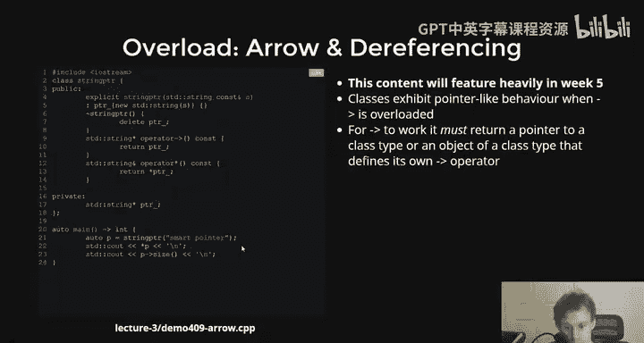

### 类型转换运算符

类型转换运算符允许将类的对象隐式或显式地转换为其他类型。它被声明为成员函数，没有返回类型（返回类型就是转换的目标类型）。

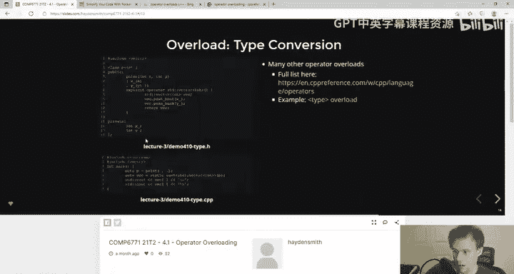

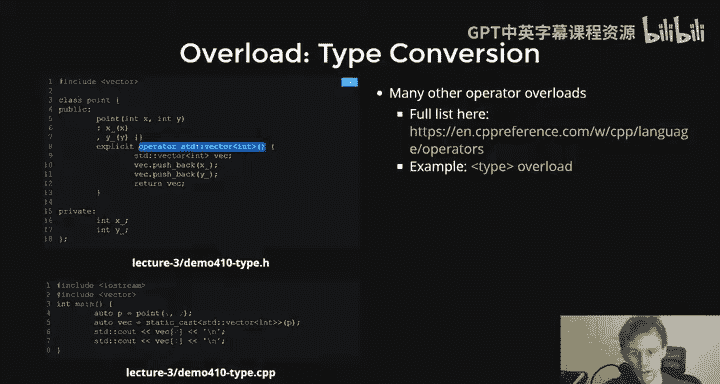

```cpp
class Point {
public:
    // ... 其他成员 ...
    // 将 Point 转换为 double（例如，计算到原点的距离）
    explicit operator double() const {
        return std::sqrt(x_ * x_ + y_ * y_);
    }
};

int main() {
    Point p{3, 4};
    // double dist = p; // 错误！因为转换运算符是 explicit 的
    double dist = static_cast<double>(p); // 正确，显式转换，dist = 5.0
}
```

使用 `explicit` 关键字可以防止隐式转换，避免意外的类型转换，使代码更安全。

## 运算符重载的设计准则

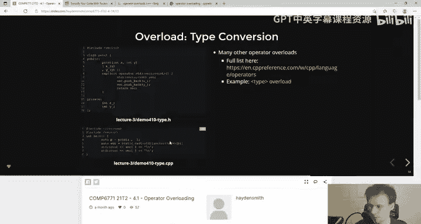

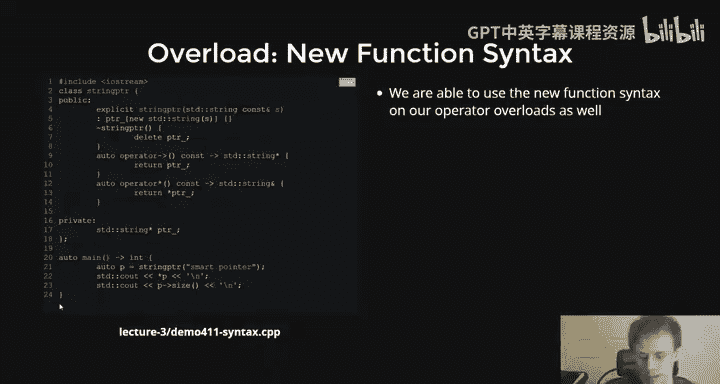

在结束之前，让我们回顾一些重要的设计准则：

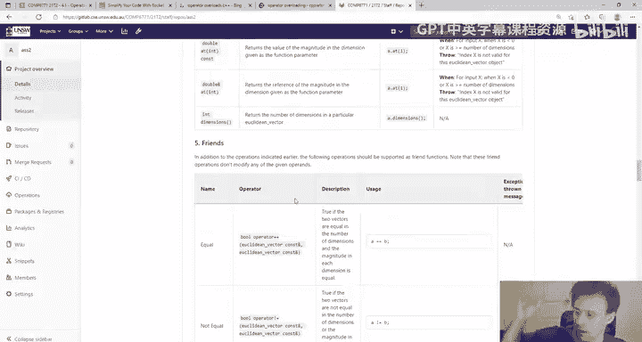

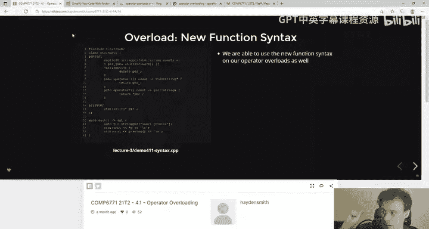

1.  **保持直观性**：只重载那些对自定义类型有明确、直观意义的运算符。如果 `+` 对你的类型意味着某种“连接”或“组合”，并且用户能轻易理解，那就重载它。否则，使用一个命名清晰的普通函数。
2.  **遵循惯例**：尽量让重载的运算符行为与内置类型和标准库类型的行为一致。例如，`operator+` 不应该修改其操作数，而应返回一个新值。
3.  **成对重载**：某些运算符通常是成对出现的。如果你重载了 `==`，通常也应该重载 `!=`。如果你重载了 `<`，可能也需要重载 `>`、`<=`、`>=`。利用已有运算符来实现它们可以减少错误。
4.  **注意返回值**：赋值类运算符（`=`, `+=`）通常返回左侧操作数的引用（`*this`）以支持链式调用。算术运算符（`+`, `-`）通常返回一个新对象（值）。

## 总结

本节课中我们一起学习了C++运算符重载的核心概念。我们了解到：

*   运算符重载通过定义名为 `operator@` 的函数来实现，它能让自定义类型使用内置运算符，极大提升代码的可读性和简洁性。
*   运算符重载函数可以是类的**成员函数**（如 `+=`, `[]`），也可以是**友元全局函数**（如 `+`, `<<`, `==`）。选择取决于运算符是否需要访问私有成员以及是否修改左侧操作数。
*   我们探讨了多种运算符的重载方法，包括算术运算符、复合赋值运算符、关系运算符、下标运算符、递增/递减运算符以及类型转换运算符，并学习了如何利用已有运算符来简化新运算符的实现（如用 `+=` 实现 `+`）。
*   最后，我们强调了运算符重载的设计准则：保持语义直观、遵循语言惯例、注意返回值类型，并且只重载那些对类型有明确意义的运算符。

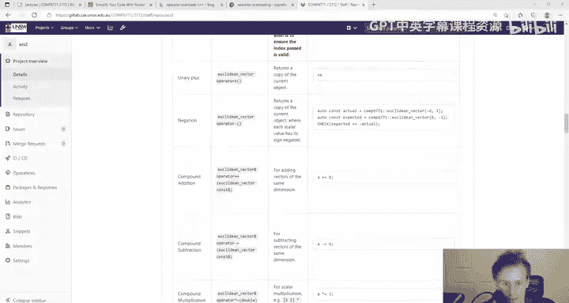

运算符重载是C++中实现抽象和编写优雅接口的强大工具，正确使用它能让你设计的类像内置类型一样自然易用。