# 012：Assignment 2 概述与核心概念解析 🧮

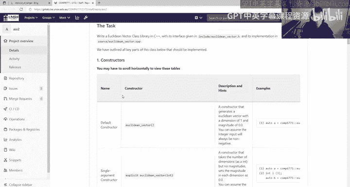

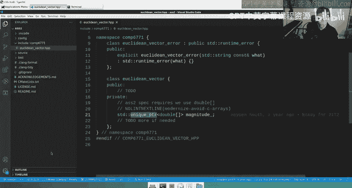

在本节课中，我们将详细解析COMP6771课程Assignment 2的核心要求与实现思路。本次作业的核心任务是实现一个名为 `EuclideanVector` 的类，它模拟了一个数学中的欧几里得向量。我们将学习如何编写各种构造函数、操作符重载以及成员函数，并理解底层如何使用智能指针管理动态数组。

## 作业概览与类定义

上一节我们介绍了课程背景，本节中我们来看看Assignment 2的具体内容。你需要花费大量时间编写一个名为 `EuclideanVector` 的类。

这个类被定义在一个命名空间中，其基本结构如下：
```cpp
namespace comp6771 {
    class EuclideanVectorError : public std::runtime_error {
        // 自定义异常类
    };
    class EuclideanVector {
        // 你需要实现的主类
    private:
        std::unique_ptr<double[]> magnitudes_; // 核心数据成员
    };
}
```
整个类框架已经提供给你。其中包含一个自定义的异常类 `EuclideanVectorError`，它继承自 `std::runtime_error`。这个异常类主要目的是为你的异常提供一个具体的名称。主类 `EuclideanVector` 的私有部分目前只包含一个 `std::unique_ptr<double[]>` 类型的数据成员 `magnitudes_`。虽然智能指针是下一周的主题，但它不会阻碍你开始本次作业。

## 需要实现的构造函数

以下是本次作业中你需要实现的一系列构造函数。

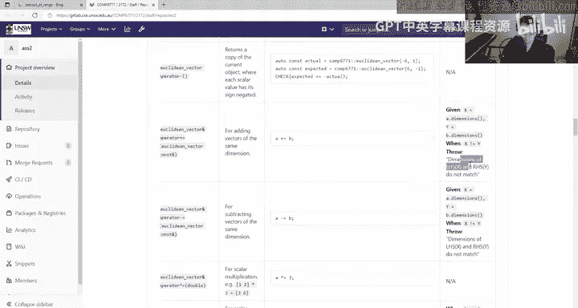

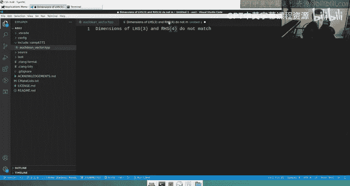

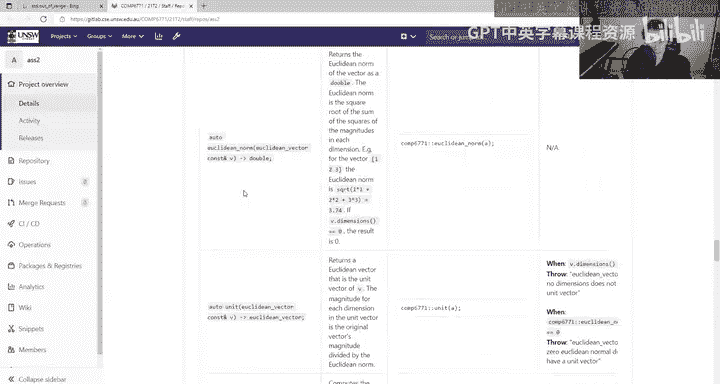

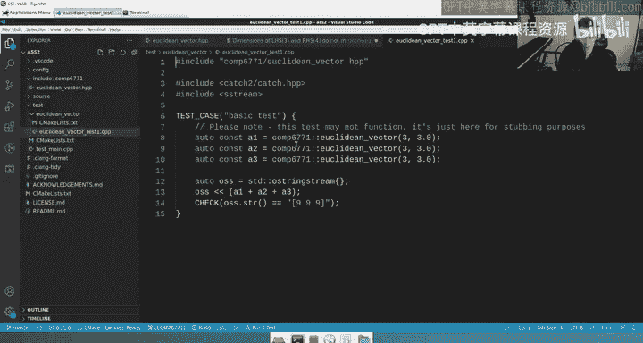

1.  **默认构造函数**：无参数，构造一个空的欧几里得向量。
2.  **维度构造函数**：接受一个 `int` 参数，构造一个指定维度且所有元素为0的向量。例如 `EuclideanVector(10)` 生成一个包含10个0的向量。
3.  **维度与初值构造函数**：接受一个 `int`（维度）和一个 `double`（初始值），构造一个所有元素均为该初始值的向量。例如 `EuclideanVector(10, 1.1)` 生成一个包含10个1.1的向量。
4.  **迭代器范围构造函数**：接受两个迭代器（起始和结束），根据该范围的内容构造向量。这允许你从其他容器（如 `std::vector`, `std::list` 等）构造 `EuclideanVector`。
5.  **初始化列表构造函数**：接受一个 `std::initializer_list<double>` 来初始化向量，类似于 `std::vector` 的用法。
6.  **拷贝构造函数与移动构造函数**：这两个是下一周会深入讨论的主题，但你现在就可以实现它们。

## 操作符重载与成员函数

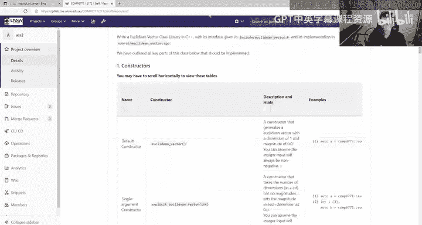

除了构造函数，你还需要实现大量的操作符重载和成员函数。

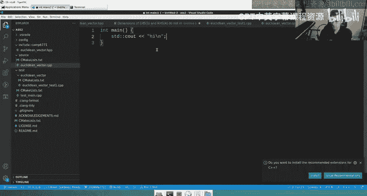

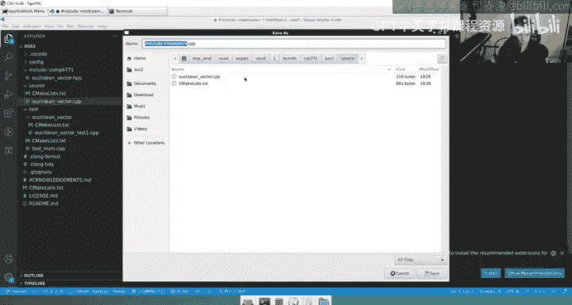

*   **赋值操作符**：包括拷贝赋值和移动赋值操作符。
*   **下标操作符**：`operator[]`，用于访问向量元素。
*   **算术操作符**：包括一元正号、一元负号、复合加法等。
*   **类型转换操作符**：实现到 `std::vector<double>` 和 `std::list<double>` 的转换。
*   **成员函数**：包括获取向量维度的 `dimensions()`，以及用于常量对象和非常量对象的下标访问成员函数。
*   **友元函数**：包括向量的加法、减法、数乘以及输出流操作符 `operator<<`。

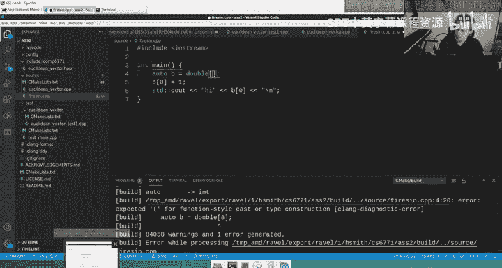

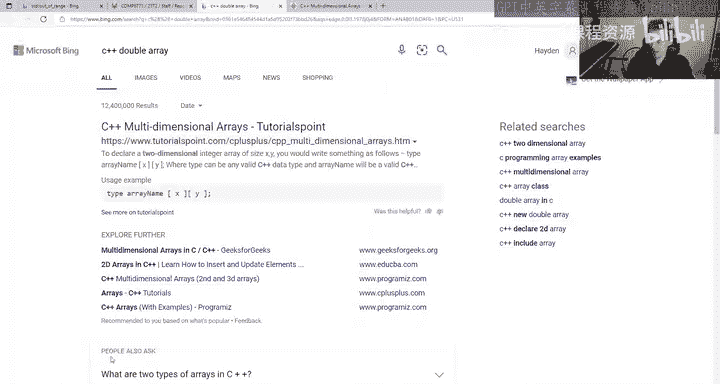

## 工具函数与异常处理

我们还有一些工具函数需要实现，它们位于相同的命名空间内，但不属于 `EuclideanVector` 类本身。

这些函数包括计算欧几里得范数（Euclidean norm）、单位向量（unit vector）和点积（dot product）。如果你不熟悉这些数学概念，可以通过快速搜索来回顾。

关于异常处理，作业要求你在特定情况下抛出提供的 `EuclideanVectorError` 异常。在作业说明的表格中，“Exception”一栏描述了何时需要抛出异常以及异常信息的具体格式。

**核心要求是：异常信息中的占位符（如 X, Y）必须替换为实际的具体数值。**
例如，当两个维度不同的向量相加时，应抛出的异常信息格式为：`"Dimensions of LHS X and RHS Y do not match"`，其中 `X` 和 `Y` 应替换为实际的维度值（如3和4）。

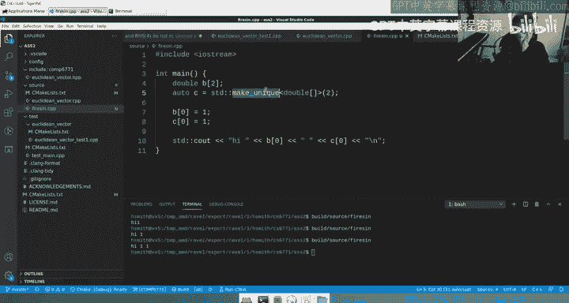

## 关于 `std::unique_ptr` 和数据成员的说明

现在我们来快速了解一下底层数据成员 `magnitudes_`。它是一个 `std::unique_ptr<double[]>`，你可以将其视为一个动态分配的、原始的 `double` 数组。

虽然我们在Assignment 1中禁止使用原始的C风格数组，但这次不同。因为你现在是库的编写者，就像 `std::vector` 和 `std::string` 在底层也使用原始数组以获得最佳性能一样。`EuclideanVector` 类就是这个“原始数组”的一个安全、高级的封装。

关键点在于：**你可以像使用普通 `double` 数组一样使用 `magnitudes_`**。你可以通过下标索引访问元素、赋值、用循环遍历它。关于拷贝和移动语义的特殊处理，我们会在下周详细讨论，但这并不妨碍你开始实现其他大部分功能。

## 其他重要规则与答疑

以下是作业中其他一些重要的规则和常见问题解答。

*   **`const` 正确性**：所有不应修改对象状态的成员函数都应声明为 `const`。
*   **`noexcept`**：所有提供不抛出异常保证的函数都应使用 `noexcept` 修饰。
*   **性能要求**：虽然没有严格的算法复杂度要求，但所有测试应在合理时间内（如1秒内）完成。避免低效的实现（如不必要的内存分配或嵌套循环）。
*   **禁止使用的工具**：**你不能在实现中使用任何STL容器（如 `std::vector`, `std::array`, `std::list`）**。但是，你可以使用STL算法（如 `std::for_each`, `std::distance`）和其他工具。
*   **关于循环**：使用传统的 `for` 循环是可以接受的，不会因此扣分。当然，如果能有更优雅的写法（例如使用基于范围的for循环或STL算法）会更好。
*   **问题反馈**：如有关于作业要求的澄清性问题，请在课程论坛的指定主题下提问。

## 总结


本节课中我们一起学习了COMP6771 Assignment 2的核心内容。我们了解了需要实现的 `EuclideanVector` 类的整体结构，包括多种构造函数、操作符重载、成员函数和工具函数。我们明确了异常处理的具体要求，特别是异常信息的格式。最重要的是，我们理解了底层使用 `std::unique_ptr<double[]>` 来管理动态数组，并且可以像使用普通数组一样操作它，同时我们也知道了本次作业中禁止使用STL容器的关键限制。现在，你可以基于这些理解开始着手实现你的向量类了。