# 014：智能指针 🧠

## 概述
在本节课中，我们将学习C++中的智能指针。智能指针是管理动态分配内存（堆内存）的强大工具，它们遵循RAII（资源获取即初始化）原则，能自动管理对象的生命周期，从而避免内存泄漏和其他资源管理错误。我们将重点介绍两种主要的智能指针：`std::unique_ptr` 和 `std::shared_ptr`，并探讨为何使用智能指针是编写健壮C++代码的最佳实践。

---

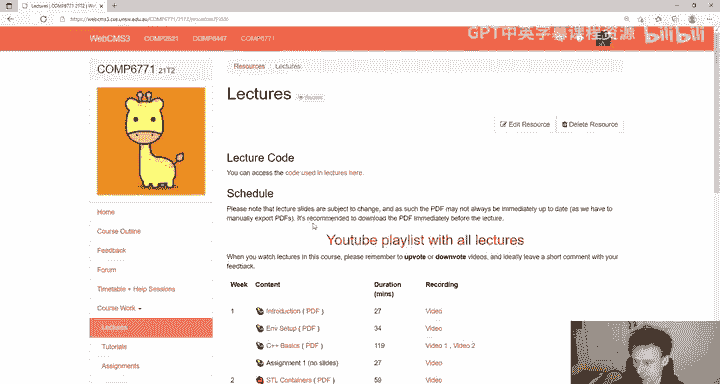

## 智能指针简介
上一节我们介绍了RAII原则和手动管理资源的挑战。本节中，我们来看看如何利用C++标准库提供的智能指针来简化资源管理。

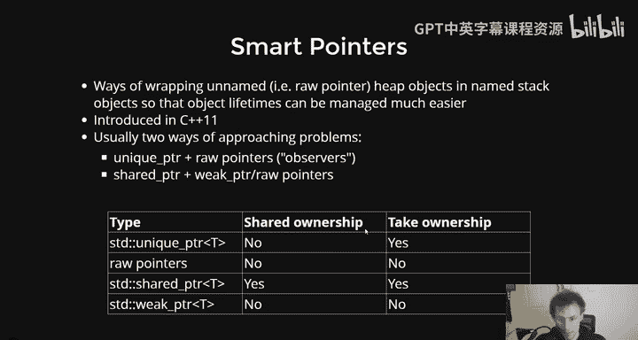

智能指针是封装了原始（“哑”）指针的类模板，其核心职责是拥有（own）所指向的堆对象，并确保在适当时机自动释放该对象。它们位于 `<memory>` 头文件中。

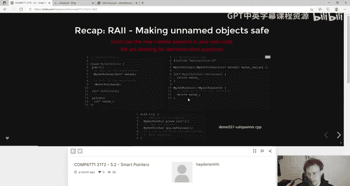

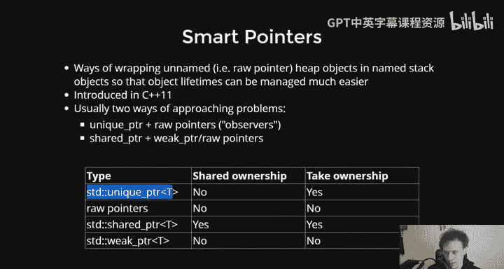

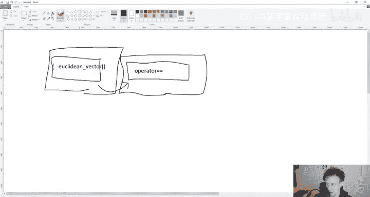

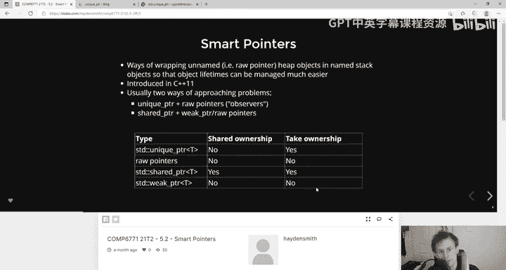

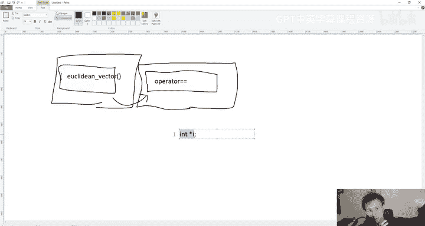

主要有两种智能指针：
*   **`std::unique_ptr`**：独占所有权。一个资源在同一时刻只能被一个 `unique_ptr` 拥有。
*   **`std::shared_ptr`**：共享所有权。多个 `shared_ptr` 可以共享同一个资源的所有权。

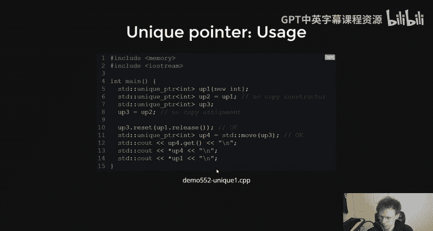

此外，还有与 `shared_ptr` 配套使用的 **`std::weak_ptr`**，它是一种不增加引用计数的观察者指针。

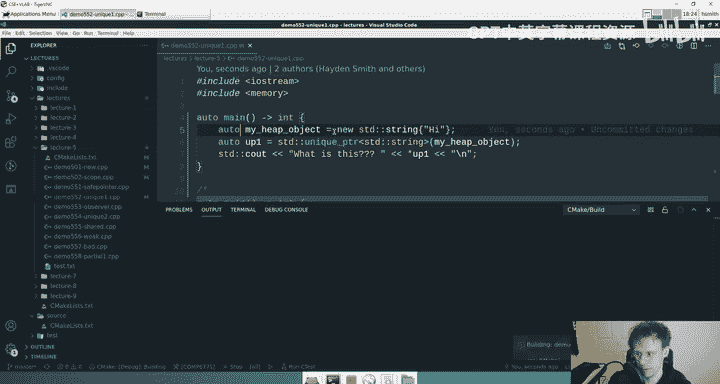

---

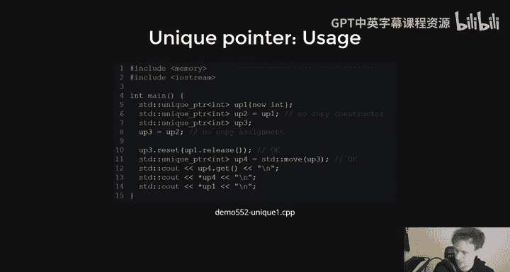

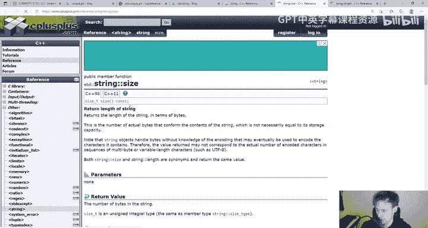

## 独占指针：`std::unique_ptr`
`std::unique_ptr` 是最常用、最简单的智能指针。它独占所指向对象的所有权，意味着当 `unique_ptr` 被销毁（例如离开作用域）时，它所管理的堆对象也会被自动删除。

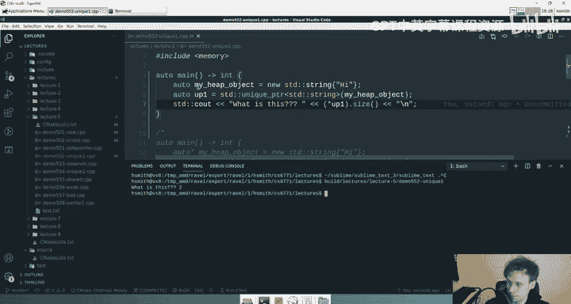

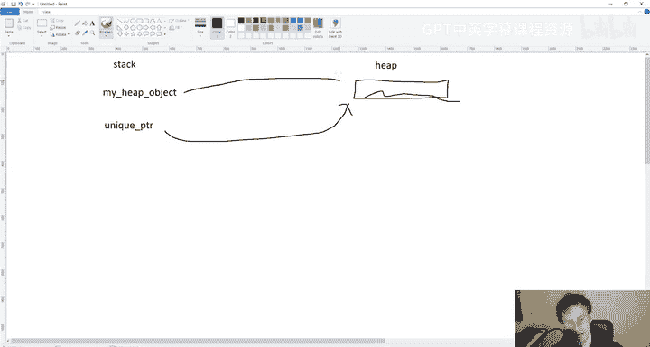

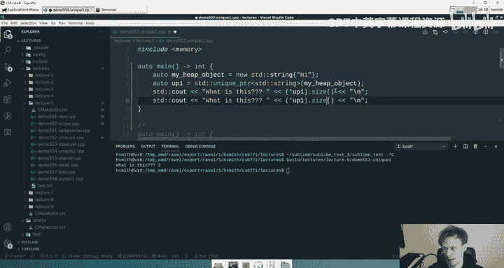

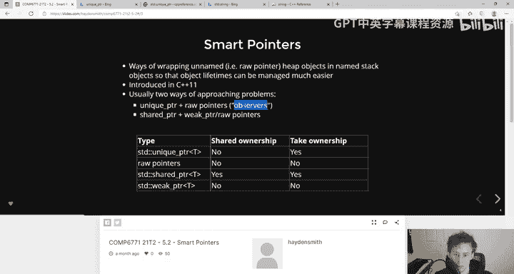

### 基本用法
你可以像使用原始指针一样使用 `unique_ptr`，例如解引用、访问成员等。

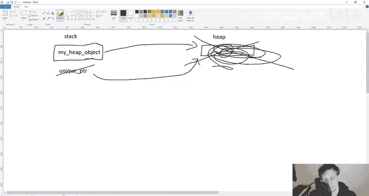

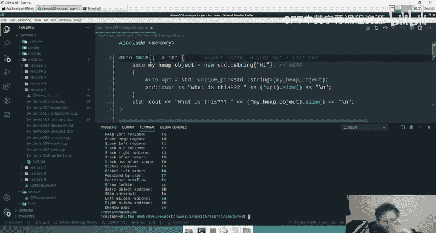

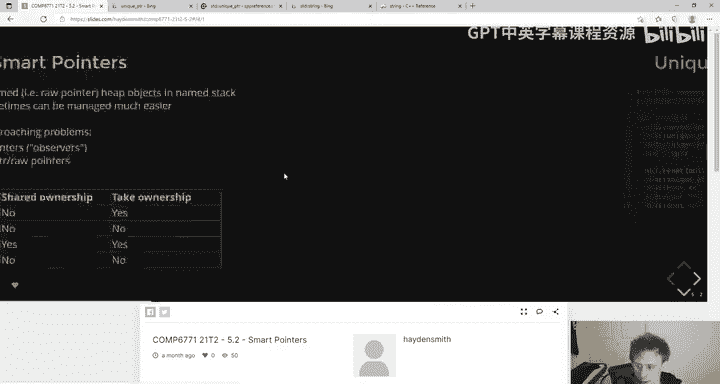

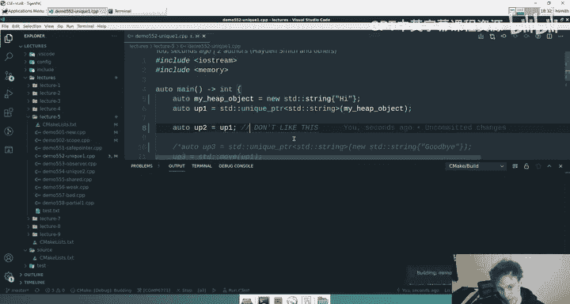

```cpp
#include <memory>
#include <iostream>

int main() {
    // 创建一个 unique_ptr，管理一个在堆上分配的 int
    std::unique_ptr<int> up1(new int(10));
    std::cout << *up1 << std::endl; // 输出: 10

    // 访问成员（如果指向的是类对象）
    // auto up2 = std::make_unique<std::string>("Hello");
    // std::cout << up2->size() << std::endl;

    // up1 离开作用域时，其管理的 int 会被自动删除
}
```

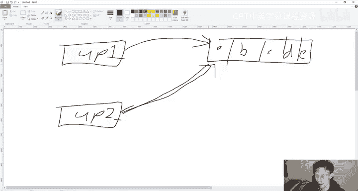

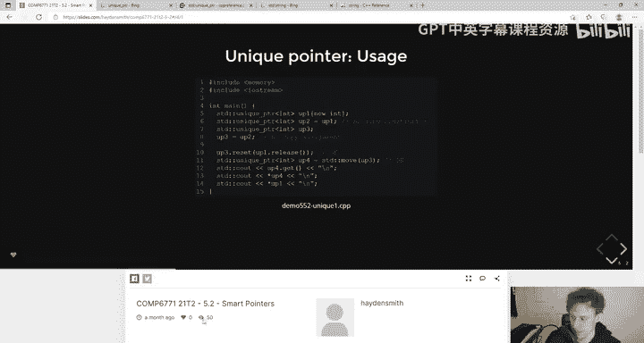

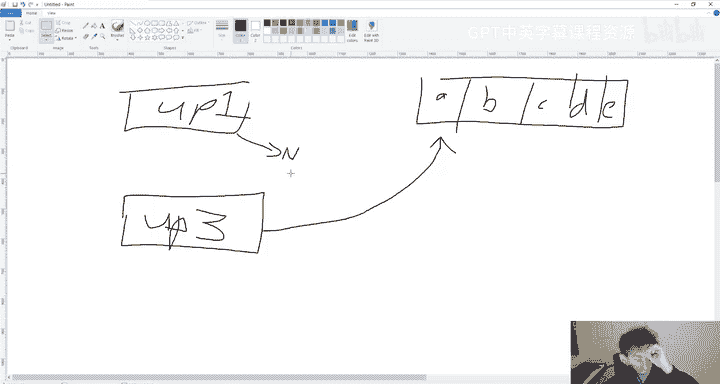

### 关键特性
*   **不可拷贝**：`unique_ptr` 删除了拷贝构造函数和拷贝赋值运算符，这是为了防止多个 `unique_ptr` 拥有同一资源而导致重复释放。
*   **可移动**：所有权可以通过移动语义进行转移。移动后，源 `unique_ptr` 变为空（指向 `nullptr`）。
    ```cpp
    std::unique_ptr<int> up1(new int(5));
    std::unique_ptr<int> up2 = std::move(up1); // 所有权转移
    // 此时 up1 为空，*up2 为 5
    ```
*   **释放资源**：`reset()` 方法会释放当前管理的对象（并可选地接管一个新对象）。`release()` 方法会放弃所有权，返回原始指针而不删除对象。
*   **获取原始指针**：`get()` 方法返回其管理的原始指针，但不放弃所有权。这常用于需要传递原始指针的API。

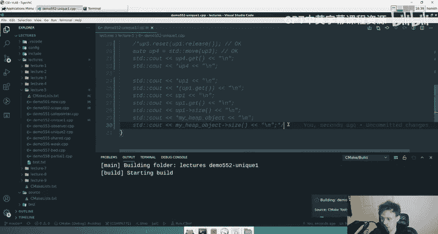

### 最佳实践：使用 `std::make_unique`
为了避免直接使用 `new` 关键字，并确保异常安全，C++14引入了 `std::make_unique`。它是创建 `unique_ptr` 的推荐方式。

```cpp
// 更安全、更简洁的创建方式
auto up3 = std::make_unique<int>(42);
auto up4 = std::make_unique<std::string>("Hello World");
auto up5 = std::make_unique<std::vector<int>>(5, 1); // 向量包含5个1
```
使用 `make_unique` 几乎可以完全避免在代码中显式使用 `new` 和 `delete`。

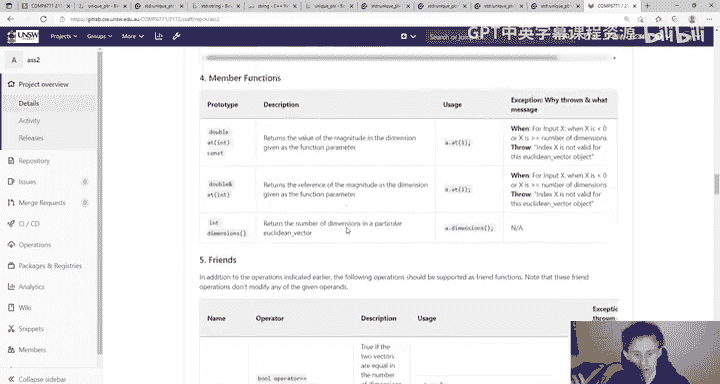

---

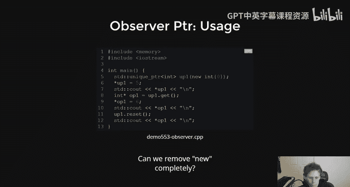

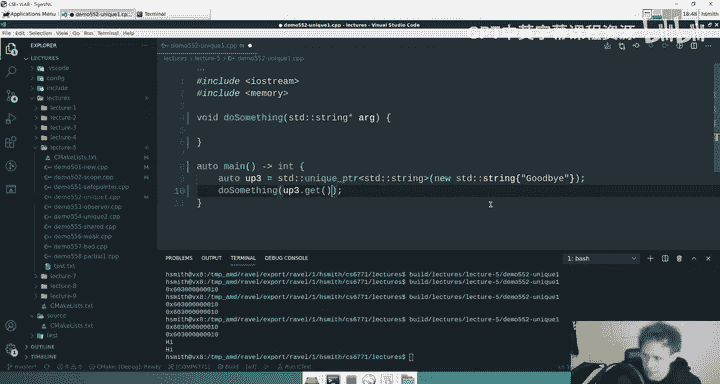

## 共享指针：`std::shared_ptr`
上一节我们学习了独占所有权的 `unique_ptr`。本节中我们来看看允许共享所有权的 `std::shared_ptr`。

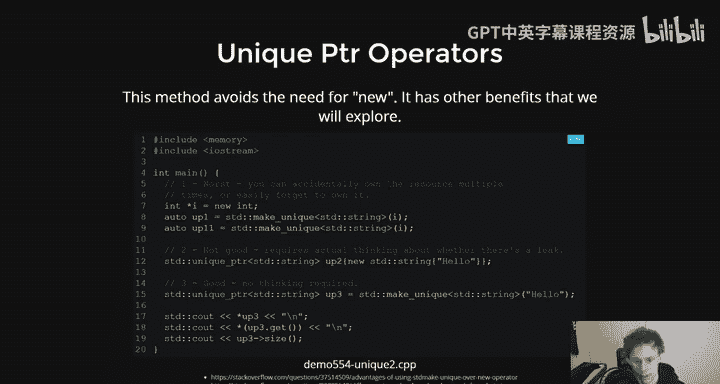

`std::shared_ptr` 通过引用计数机制实现共享所有权。多个 `shared_ptr` 可以指向同一个对象。每当一个新的 `shared_ptr` 被创建来指向该对象（通过拷贝构造、赋值等），引用计数就会增加。当一个 `shared_ptr` 被销毁时，引用计数减少。只有当引用计数变为零时，所管理的对象才会被删除。

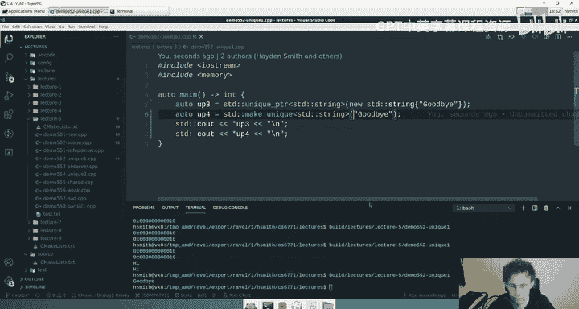

### 基本用法
```cpp
#include <memory>
#include <iostream>

int main() {
    // 创建 shared_ptr (推荐使用 make_shared)
    auto sp1 = std::make_shared<int>(100);
    {
        auto sp2 = sp1; // 拷贝构造，引用计数+1，现在为2
        std::cout << “引用计数: ” << sp1.use_count() << std::endl; // 输出: 2
    } // sp2 离开作用域，引用计数-1，现在为1
    // sp1 离开作用域，引用计数变为0，对象被删除
}
```


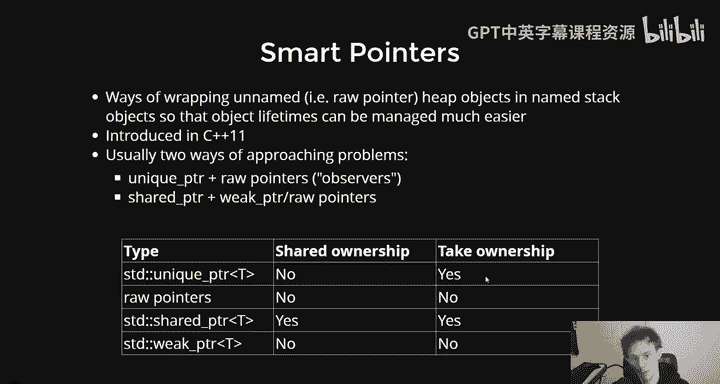

### 弱指针：`std::weak_ptr`
`std::weak_ptr` 是一种不控制对象生命周期的智能指针，它指向一个由 `shared_ptr` 管理的对象。`weak_ptr` 不会增加引用计数。

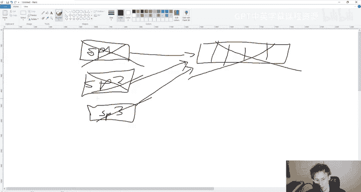

它的主要用途是打破 `shared_ptr` 的循环引用（例如在双向链表或父-子结构中），以及作为观察者，安全地访问可能已被释放的资源。

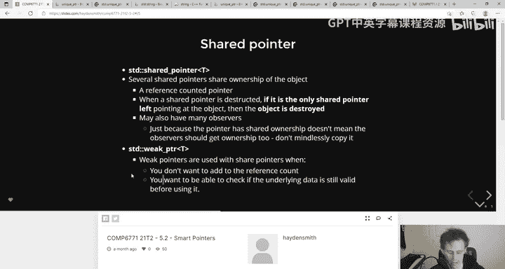

```cpp
auto shared = std::make_shared<int>(10);
std::weak_ptr<int> weak = shared; // 创建弱指针，引用计数仍为1

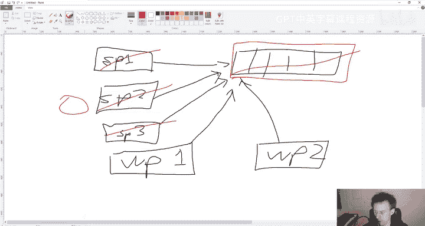

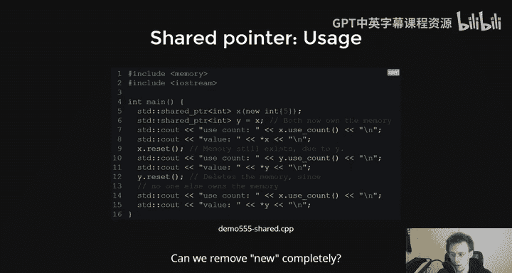

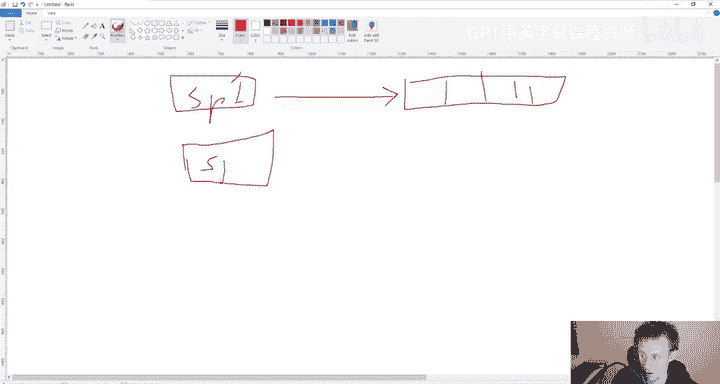

// 要使用 weak_ptr，必须先将其“锁定”为一个 shared_ptr
if (auto temp = weak.lock()) { // 如果对象还存在，lock() 返回一个有效的 shared_ptr
    std::cout << *temp << std::endl;
} else {
    std::cout << “对象已被释放” << std::endl;
}
```

### 何时使用 `shared_ptr`？
**基本原则：优先使用 `unique_ptr`。**
仅在以下情况考虑使用 `shared_ptr`：
1.  一个对象需要有多个所有者。
2.  你无法预知哪个所有者会存活得最久（例如，在复杂的图结构或某些并发场景中）。

滥用 `shared_ptr` 会导致代码复杂度增加和潜在的循环引用问题。

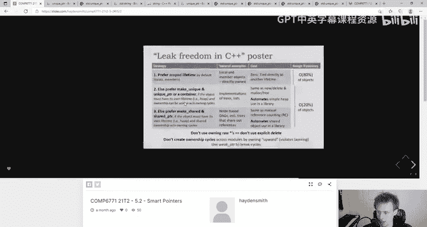

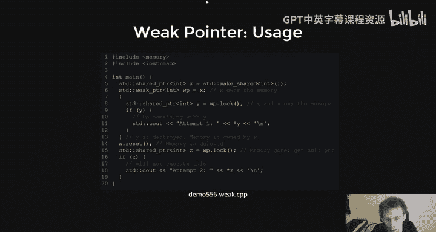


---

## 智能指针与异常安全
智能指针的一个巨大优势是提供强大的异常安全保证。考虑以下手动管理资源的危险情况：

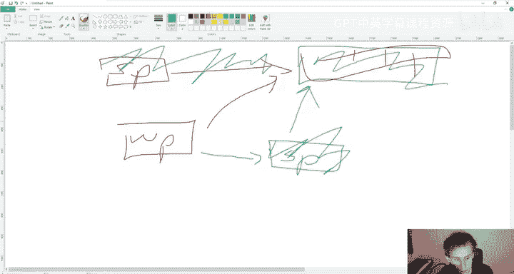

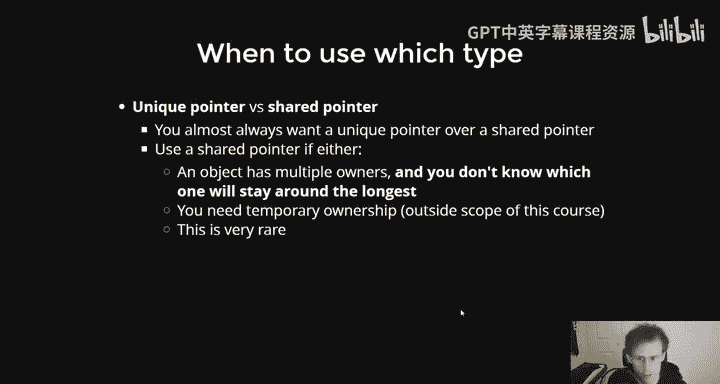

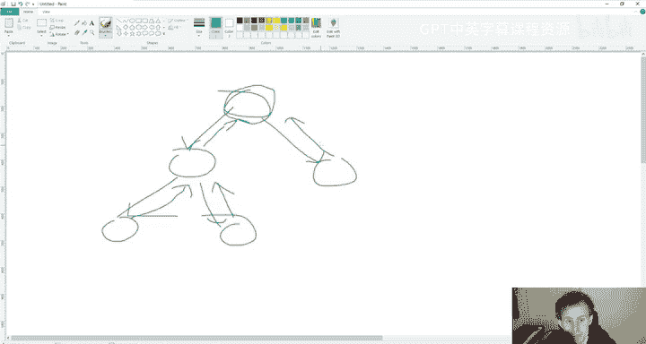

```cpp
void riskyFunction() {
    int* raw_ptr = new int(5);
    someFunctionThatMightThrow(); // 如果这里抛出异常...
    delete raw_ptr; // ...这行永远不会执行，导致内存泄漏！
}
```

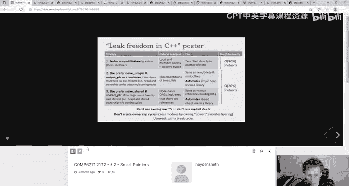

使用 `unique_ptr`，即使发生异常，资源也能被正确释放：

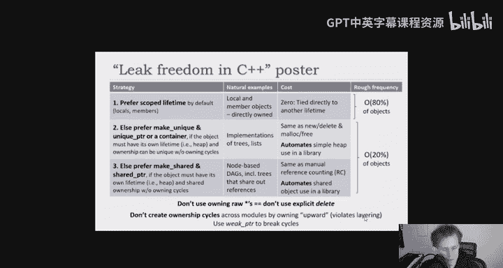

```cpp
void safeFunction() {
    auto smart_ptr = std::make_unique<int>(5);
    someFunctionThatMightThrow(); // 即使抛出异常...
    // ...当 stack unwinding 发生时，smart_ptr 的析构函数会被调用，从而释放内存。
}
```

### 部分构造问题
智能指针还能解决构造函数中的资源泄漏问题。如果一个类的构造函数在初始化多个成员时抛出异常，那么对于已经成功构造的成员（尤其是原始指针成员），其指向的堆内存可能无法被正确释放，因为该类的析构函数不会被调用。

使用 `unique_ptr` 作为成员变量可以完美解决这个问题。因为即使外部类的构造函数失败，对于已完全构造的 `unique_ptr` 成员，其析构函数仍会被调用，从而确保其管理的资源被释放。

```cpp
class SafeClass {
    std::unique_ptr<MyType> a_;
    std::unique_ptr<MyType> b_;
public:
    SafeClass(int a, int b) : a_(std::make_unique<MyType>(a)), // 如果这里成功
                              b_(std::make_unique<MyType>(b)) { // 但这里构造失败抛出异常
        // 构造函数体
    }
    // 无需显式定义析构函数
};
// 即使 b_ 构造失败，a_ 的析构函数也会被调用，释放其资源。
```

---

## 总结
本节课我们一起学习了C++智能指针的核心概念：

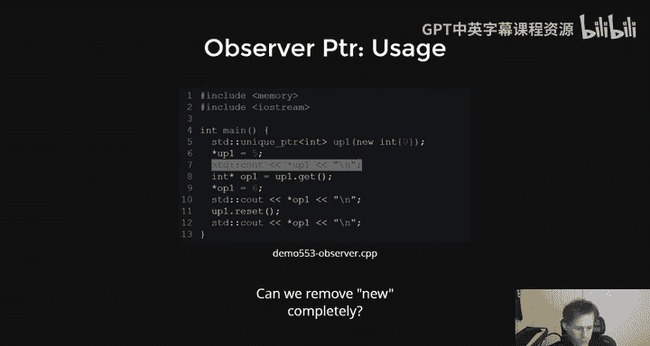

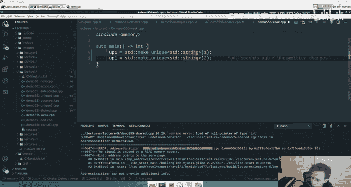

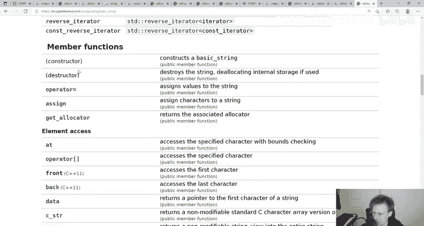

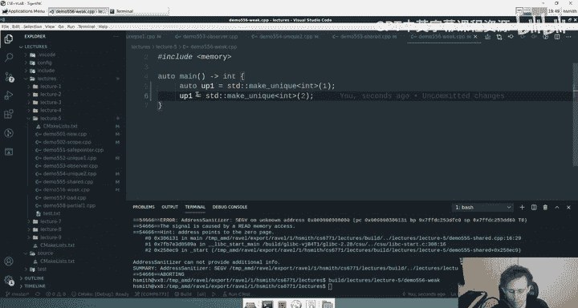

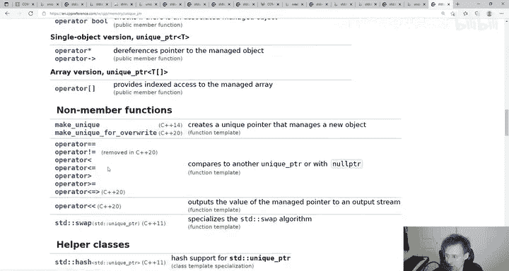

1.  **`std::unique_ptr`**：用于独占所有权场景。使用 `std::make_unique` 创建。不可拷贝，但可移动。是默认的首选智能指针。
2.  **`std::shared_ptr` 与 `std::weak_ptr`**：用于共享所有权场景。使用 `std::make_shared` 创建。通过引用计数管理生命周期。`weak_ptr` 用于观察和打破循环引用。
3.  **核心优势**：智能指针自动管理资源生命周期，**极大地减少了内存泄漏的风险**，并提供了强大的**异常安全**保证。
4.  **设计哲学**：优先使用栈对象和值语义，必要时使用 `unique_ptr`，仅在确需共享所有权时才使用 `shared_ptr`。

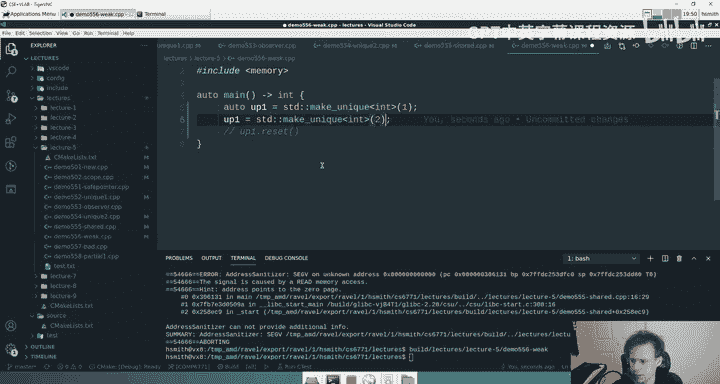


掌握智能指针是编写现代、安全、高效C++代码的关键一步。在后续的作业和项目中，请积极应用这些知识。