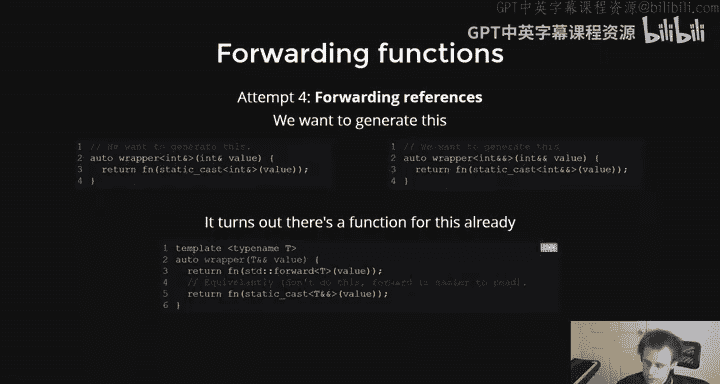
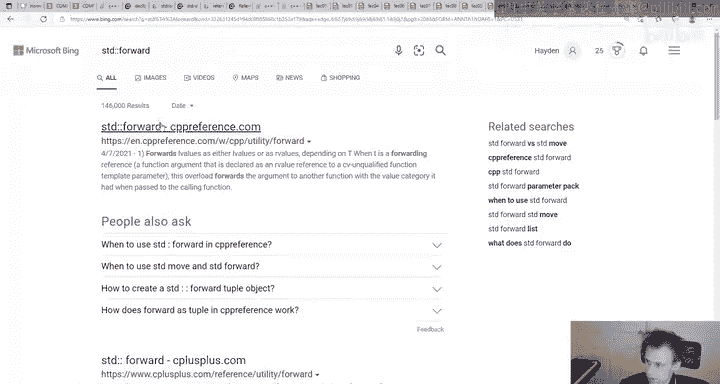
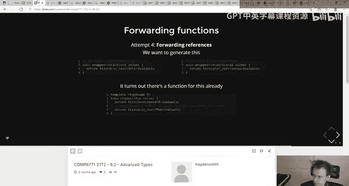
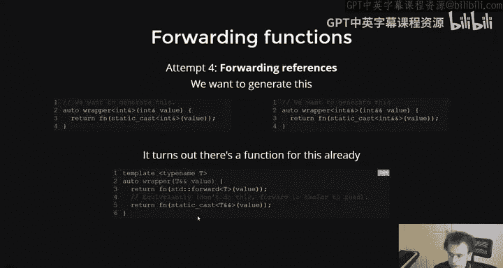
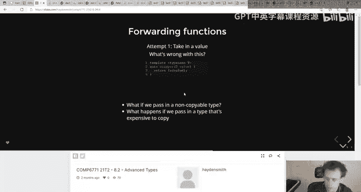
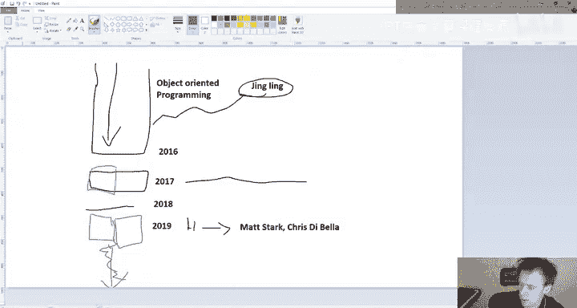

# 019：高级类型 - 第二部分 🧩


在本节课中，我们将要学习一个高级主题：**完美转发**。我们将探讨为什么需要它，它是如何工作的，以及它在实际编程中的具体应用。虽然这个概念可能有些“学术性”，但理解它有助于我们更深入地掌握C++的类型系统和模板机制。

上一节我们介绍了引用折叠和模板参数推导，本节中我们来看看如何利用这些知识来实现一个能“完美”传递参数类型的函数。

---

## 概述：为什么需要完美转发？ 🤔

在编写通用函数（如包装器或工厂函数）时，我们常常会遇到一个问题：当我们把一个参数传递给另一个函数时，该参数的原始“值类别”（是左值还是右值）和“常量性”可能会丢失。

考虑以下简单的包装函数：
```cpp
template <typename T>
void wrapper(T value) {
    function(value); // 调用另一个函数
}
```
如果我们传入一个右值引用，在 `wrapper` 函数内部，`value` 会被当作一个普通的左值来处理，其“右值性”就丢失了。这可能导致无法调用那些只接受右值引用的函数（例如移动构造函数）。

我们的目标是创建一个能**保留传入参数所有类型属性**的转发机制。

---

## 回顾：参数传递的几种方式 🔄

在深入 `std::forward` 之前，我们先快速回顾几种传递参数的方式及其局限性。

以下是几种常见的函数签名及其问题：

1.  **按值传递**：
    ```cpp
    template <typename T>
    void wrapper(T value) { ... }
    ```
    *   **问题**：总是会发生拷贝（或移动），无法保留原始引用类型。对于不可拷贝的类型会失败。

2.  **常量左值引用**：
    ```cpp
    template <typename T>
    void wrapper(const T& value) { ... }
    ```
    *   **优点**：可以绑定到几乎所有类型（左值、右值、常量）。
    *   **缺点**：参数在函数内部始终是 `const` 的，我们无法修改它。这不符合“转发”的初衷。

3.  **非常量左值引用**：
    ```cpp
    template <typename T>
    void wrapper(T& value) { ... }
    ```
    *   **优点**：参数可修改。
    *   **缺点**：无法绑定到右值或常量对象，适用范围太窄。

显然，我们需要一种更强大的方法。

---

## 核心机制：转发引用与引用折叠 🧠

解决方案的关键在于使用一种特殊的引用——**转发引用**（也称为万能引用），并结合我们之前学过的**引用折叠**规则。

转发引用的形式是 `T&&`，其中 `T` 是一个模板类型参数。它的神奇之处在于，根据传入实参的类型，编译器会进行不同的模板实例化和引用折叠。

让我们看一个例子：
```cpp
template <typename T>
void wrapper(T&& arg) { // arg 是一个转发引用
    function(arg);
}
```
*   当我们传入一个**左值**（例如 `int x; wrapper(x);`）时：
    *   `T` 被推导为 `int&`。
    *   参数 `arg` 的类型变为 `int& &&`。
    *   根据引用折叠规则（`& &&` 折叠为 `&`），`arg` 最终是一个 `int&`（左值引用）。
*   当我们传入一个**右值**（例如 `wrapper(42);` 或 `wrapper(std::move(x));`）时：
    *   `T` 被推导为 `int`。
    *   参数 `arg` 的类型是 `int&&`（右值引用）。







这样，`wrapper` 函数内部就“知道”了 `arg` 原本是左值还是右值。**但是**，这里还有一个陷阱：在函数体内，无论 `arg` 是左值引用还是右值引用，它**本身都是一个有名字的变量，因此是一个左值表达式**。如果我们直接把它传给 `function`，它仍然会被当作左值处理。

所以，我们需要一个方法，在传递 `arg` 时，根据其**被推导出的类型**，将其“还原”为正确的值类别。这就是 `std::forward` 的使命。

---



## 解决方案：`std::forward` 的魔法 ✨

`std::forward` 是一个条件性的转换工具，它通常与转发引用一起使用。其核心作用是：**如果传入的参数是一个右值引用，那么 `std::forward` 会将其转换为右值（即 `static_cast<T&&>`）；否则，它什么也不做，保持其为左值**。

它的典型用法如下：
```cpp
template <typename T>
void wrapper(T&& arg) {
    // 使用 std::forward 来“完美转发” arg 的值类别
    function(std::forward<T>(arg));
}
```
现在，整个转发链条就完整了：
*   如果 `wrapper` 被一个左值调用，`arg` 是左值引用，`std::forward<T>(arg)` 返回一个左值引用。
*   如果 `wrapper` 被一个右值调用，`arg` 是右值引用，`std::forward<T>(arg)` 返回一个右值引用（具体来说是 `static_cast<T&&>(arg)`，这会触发移动语义）。

这样，`function` 接收到的参数就完全保留了它在 `wrapper` 调用点的原始值类别和类型。

---

## 实际应用：`make_unique` 案例分析 🛠️

`std::forward` 的一个经典应用是在工厂函数中，例如 `std::make_unique`。让我们看一个简化版的实现思路：

```cpp
template <typename T, typename... Args>
std::unique_ptr<T> make_unique(Args&&... args) {
    return std::unique_ptr<T>(new T(std::forward<Args>(args)...));
}
```
以下是关键点解析：
1.  `Args&&... args`：这是一个**可变参数模板**和转发引用的组合。它可以接受任意数量、任意类型（左值/右值）的参数包。
2.  `std::forward<Args>(args)...`：这里对参数包中的**每一个**参数应用 `std::forward`。这确保了在构造 `T` 类型的对象时，每个参数都能以其原始的值类别被传递。
    *   如果用户传入了一个右值（例如临时对象），它会被移动给 `T` 的构造函数。
    *   如果用户传入了一个左值，它会被以引用的方式传递（避免拷贝）。

这种模式使得 `make_unique` 成为一个高效且通用的工厂函数。



---

## 总结与建议 📝



本节课中我们一起学习了C++中一个高级但重要的概念——完美转发。

*   **核心问题**：在通用代码中传递参数时，容易丢失其原始的值类别（左值/右值）和常量性。
*   **核心工具**：`std::forward`。
*   **配合机制**：必须与**转发引用** (`T&&`) 和**引用折叠**规则一起使用。
*   **主要用途**：编写通用的包装函数、工厂函数（如 `make_unique`）或任何需要将参数透明地传递给其他函数的场景。


最后，给初学者的一个实用建议：**如果你不确定是否需要使用 `std::forward`，那么很可能你暂时不需要它**。完美转发是库作者和高级框架开发者更常接触的工具。对于日常应用开发，你可能会更频繁地使用像 `std::move` 这样更直观的工具。然而，理解其原理能让你更好地理解标准库的行为，并在需要时能够自己构建同样强大的抽象。