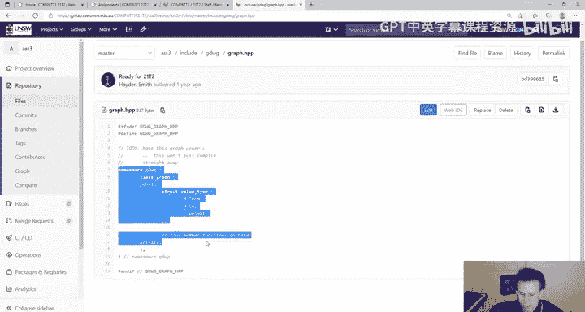
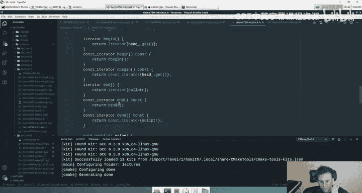
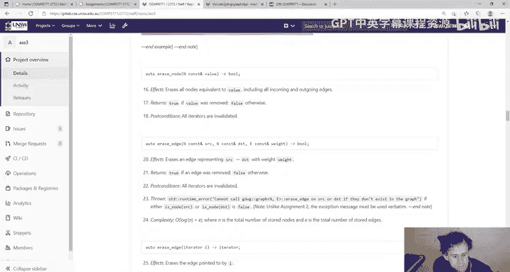

# 020：Assignment 3 作业详解 🧠

在本节课中，我们将详细解析COMP6771课程的第三次作业。本次作业的核心目标是创建一个通用的、有向的、带权重的图数据结构。我们将重点学习如何运用模板和自定义迭代器，这是对前两次作业知识的深化和综合应用。

## 作业概述 📋

本次作业要求你实现一个名为 `gdwg::graph` 的模板类，它代表一个有向加权图。与Assignment 2类似，你需要自己实现一个类库，但这次的数据结构更为复杂。图是通用的，这意味着节点类型 `N` 和边权重类型 `E` 可以是任何可比较的类型。



## 核心结构与要求



### 图的基本特性
*   **有向性**：边具有方向。从节点 `A` 到节点 `B` 的边，并不意味着存在从 `B` 到 `A` 的边。
*   **带权重**：每条边都有一个关联的权重值。
*   **允许自环**：边的源节点和目的节点可以是同一个节点。
*   **允许多重边**：图中可以存在多条从同一源节点指向同一目的节点的边（即使权重不同）。

### 类的定义与实现
由于 `graph` 是一个模板类，其所有定义（包括成员函数）都必须放在头文件 `graph.hpp` 中。你可以选择将定义直接写在类体内，或写在类体下方。

**建议**：虽然有些同学可能倾向于先实现一个特定类型（如 `int`）的图，然后再将其模板化，但这可能会带来大量繁琐的修改工作。我们更推荐从一开始就使用模板进行开发。

### 迭代器设计 🔄
迭代器是本次作业的关键挑战之一。你需要实现一个**双向迭代器**，用于遍历图中的所有边。

上一节我们介绍了图的基本特性，本节中我们来看看迭代器的具体设计。

*   **迭代含义**：对图进行迭代，意味着按特定顺序遍历其所有边。
*   **排序规则**：边的顺序首先按源节点排序，然后按目的节点排序，最后按权重排序。
*   **迭代值**：每次解引用迭代器，应返回一个 `value_type` 结构体。该结构体在类中已预先定义：
    ```cpp
    struct value_type {
        N from;
        N to;
        E weight;
    };
    ```

为了降低难度，作业说明中已经提供了迭代器类的大致框架。你可以参考课程中 `IntStack` 或 `Rope` 的例子来理解如何构建自定义迭代器，但请注意你的迭代器需要是**双向的**并且是**模板化的**。

### 内部表示与内存管理 💾
作业对图的内部存储结构没有硬性规定，你可以自由选择 `std::vector`、`std::set` 等STL容器。但有一个关键约束：**节点必须在堆内存上存储**。

以下是需要遵循的核心原则：
1.  当外部数据（如一个局部字符串）被插入图中时，图必须在堆上创建该数据的一份拷贝，并自行管理其生命周期。这意味着即使原始数据离开作用域被销毁，图中的数据依然有效。
2.  对于图中的任何一个节点，在内存中只应存在**一份**底层资源。所有对该节点的引用（例如在不同边的记录中）都应指向这同一份资源。
3.  为了实现上述目标，你必须使用**智能指针**（如 `std::unique_ptr` 或 `std::shared_ptr`）来管理节点的内存。对于边，则没有此严格限制，但也不应无意义地创建多个副本。

**建议**：先设计好你的数据存储结构（例如，是用一个节点列表加一个边列表，还是使用邻接表等），再根据结构决定使用哪种智能指针更为合适。

## 需要实现的主要功能

以下是作业要求你实现的主要成员函数类别：

*   **构造函数与赋值操作**：包括默认构造、初始化列表构造、迭代器范围构造、拷贝/移动构造与赋值等。
*   **修改器**：
    *   `insert_node`：插入节点。
    *   `insert_edge`：插入边。
    *   `replace_node`：替换节点。
    *   `merge_replace_node`：合并并替换节点（具体行为参见作业说明中的图示）。
    *   `erase_node` / `erase_edge`：删除节点或边。
    *   `clear`：清空图。
*   **访问器与迭代器**：
    *   `is_node` / `empty` / `is_connected` 等查询函数。
    *   `begin()` / `end()` 及其常量版本，用于获取迭代器。
*   **其他**：比较操作符、输出操作符等。

## 开发与测试建议 🛠️

1.  **循序渐进**：从一个简单的、非模板的版本开始实现核心图结构（如插入/删除节点、边），确保逻辑正确后再引入模板和迭代器。
2.  **优先编写测试**：强烈建议在深入编码前或编码早期就开始编写测试用例。这能帮助你更好地理解需求，并在后续重构时快速验证正确性。测试应覆盖各种边界情况，如空图、自环、多重边等。
3.  **善用资源**：对于作业说明不清晰的地方，请查阅课程论坛的置顶帖“Assignment 3 Spec Questions”。助教Nathaniel已经解答了大量疑问。
4.  **关于复杂度**：在实现时，请参考作业说明中的“复杂度要求”。但评分时不会进行极其严苛的算法复杂度分析，这更多是为你提供一个实现指南。请将主要精力放在功能的正确实现上。
5.  **迭代器的重要性**：迭代器部分占有相当比例的分数。如果完全无法实现迭代器，可能会损失约15%的总分。因此，在完成基础功能后，务必投入时间攻克迭代器。

## 总结 📝

本节课中我们一起学习了COMP6771 Assignment 3的核心要求。本次作业是对C++高级特性的综合实践，重点在于：
*   设计并实现一个通用的、有向加权图模板类。
*   深入理解并实现一个自定义的**双向迭代器**。
*   运用**智能指针**进行安全的堆内存生命周期管理。
*   遵循良好的C++工程实践，包括编写全面的测试用例。



请合理安排时间，从基础功能做起，逐步构建复杂的迭代器和模板逻辑。遇到问题时，积极查阅课程资料和论坛。相信通过完成这个作业，你对C++模板和自定义类型的理解将迈上一个新台阶。祝你好运！