# 021：动态多态性（第一部分）🚀

## 概述

在本节课中，我们将要学习C++中的动态多态性。这是面向对象编程的核心概念之一，允许我们编写能够处理多种类型的通用代码。我们将重点探讨继承、虚函数以及它们在运行时如何工作。


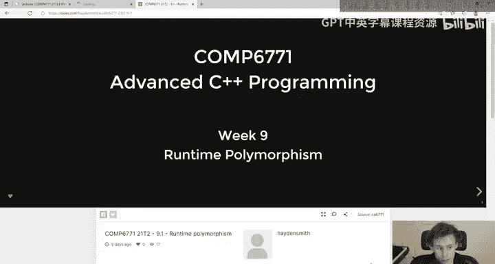

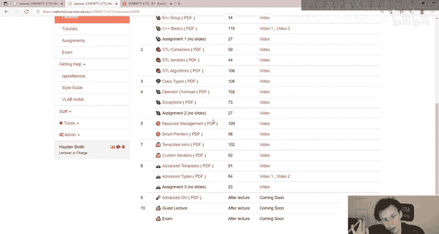

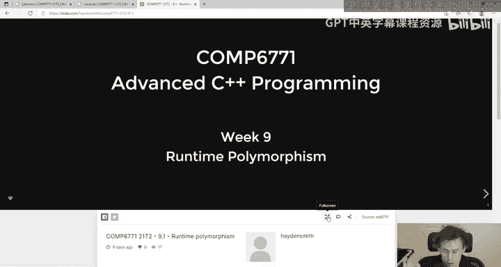

---

## 课程背景与安排


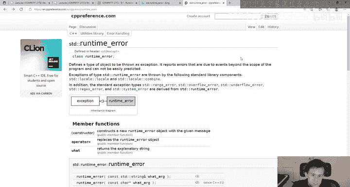

大家好，欢迎来到第九周。根据出勤率，我能感觉到大家既对学期感到疲惫，也正全力投入第三个作业。我知道这对每个人来说都是一个压力很大的时期，希望大家一切顺利。

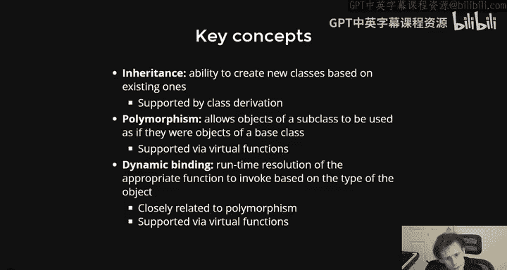

关于作业二的成绩，我们计划在本周五发布。目前我们已经完成了大约三分之二的批改工作。

关于作业三的截止日期，目前没有延期的计划。虽然这个问题让我听起来有点不近人情，但延长期限有时对那些合理安排时间的同学并不公平，并且可能会打乱大家其他作业的计划。

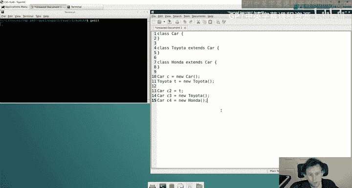

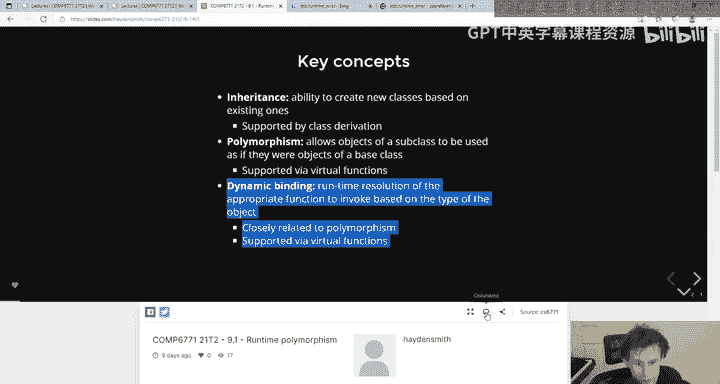

本周我们将完成课程的最后一个主要主题：运行时多态性。这是我第一次讲授这部分内容，所以对我而言也是新的尝试。

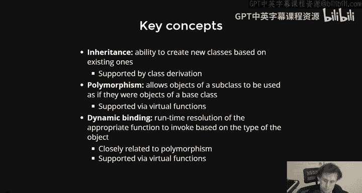

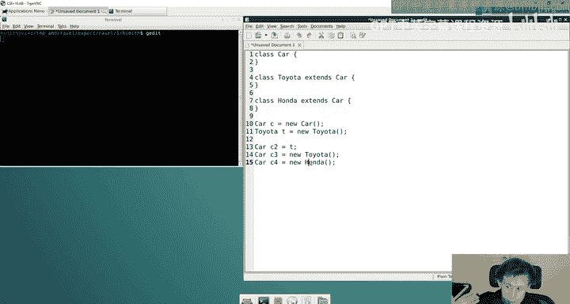

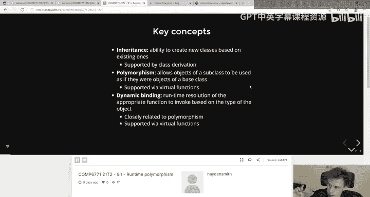

---

## 核心概念回顾

在深入动态多态性之前，我们先快速回顾几个核心的面向对象编程概念。

### 继承

继承是指基于现有类创建新类的思想。新类（称为派生类或子类）继承了基类（父类）的成员，并可以添加自己的新成员。例如，标准库中的 `std::runtime_error` 类就继承自 `std::exception` 类。

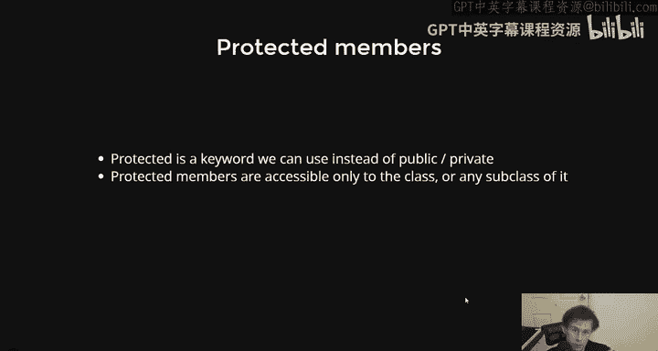


**代码示例：**
```cpp
class BaseClass {
    // ... 基类成员
};

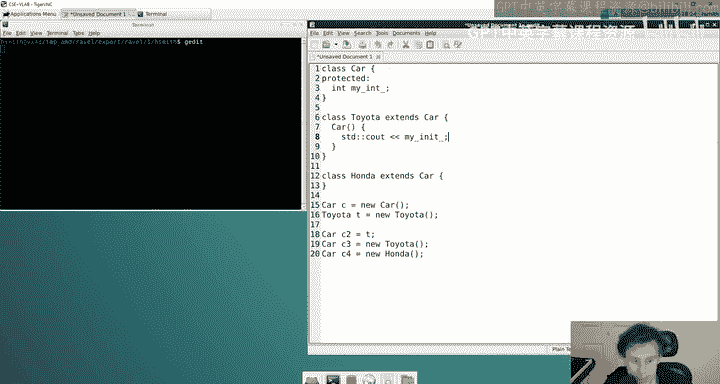


class DerivedClass : public BaseClass {
    // ... 派生类成员，继承了 BaseClass 的成员
};
```

### 多态性

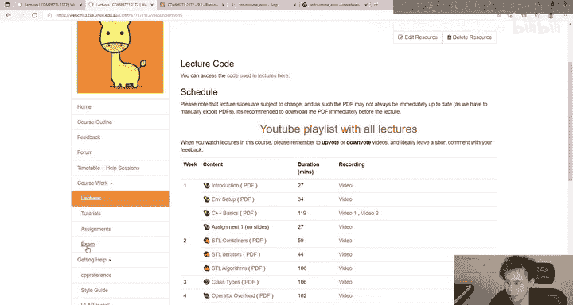

多态性允许我们将子类对象当作其基类类型来使用。这是一种运行时泛化类型的方式。例如，你可以有一个 `Car` 类型的指针或引用，它实际上可以指向 `Toyota` 或 `Honda` 对象。

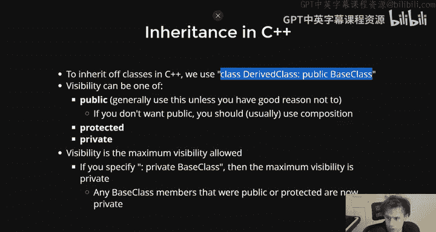

### 动态绑定

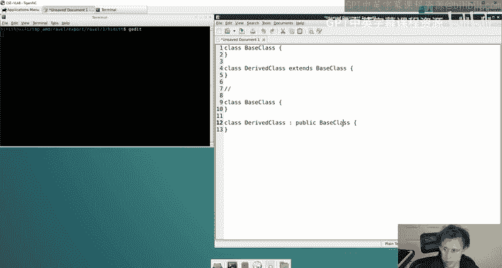

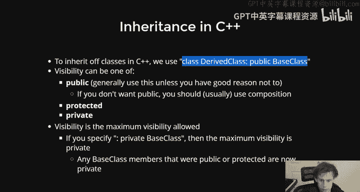

动态绑定是描述多态行为实际发生机制的术语。在运行时（动态），我们将一个对象绑定到另一个类型（如基类引用或指针）。我们之前讨论过绑定，例如将非常量实参绑定到常量形参。

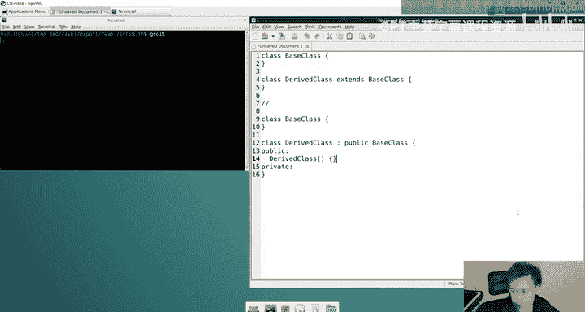

---

## 继承在C++中的语法

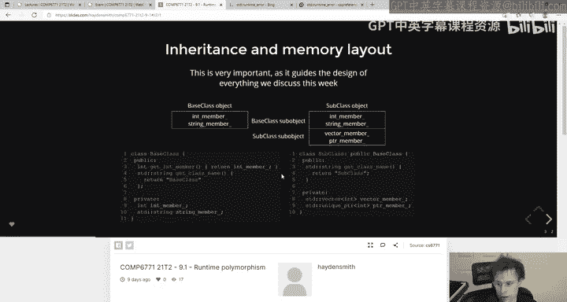

在C++中，继承的语法与Java等语言类似，但有关键区别。我们使用冒号 `:` 来表示派生关系。

**代码示例：**
```cpp
class Base {
    // 基类定义
};

class Derived : public Base { // 使用 'public' 和冒号
    // 派生类定义
};
```

关键字 `public` 表示基类的公有成员在派生类中保持公有。在几乎所有合理的情况下，你都会使用 `public` 继承。

关于访问控制：
*   **public**： 可从类外部访问。
*   **private**： 只能在类自身的范围内访问。
*   **protected**： 只能在类自身及其派生类的范围内访问。

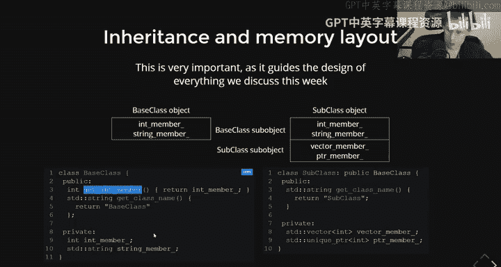

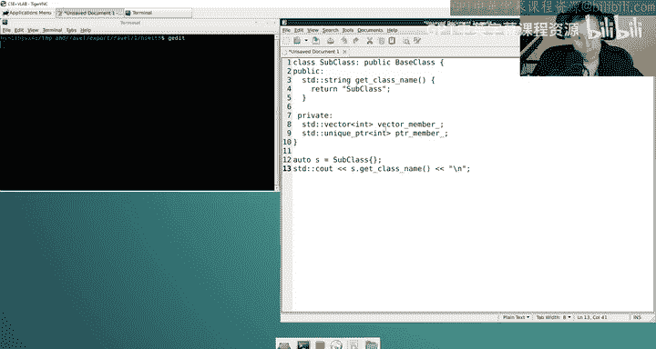

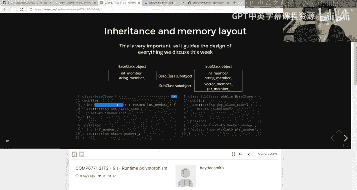

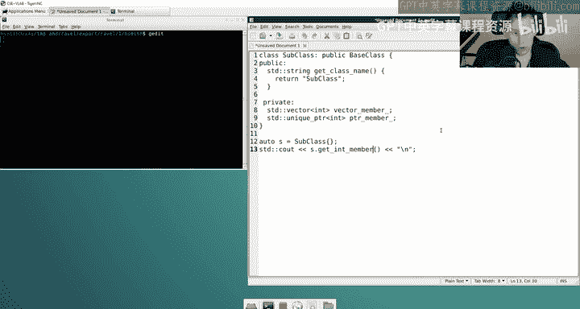

虽然 `protected` 在某些情况下有用，但许多软件设计观点认为应谨慎使用，因为需要被子类访问的成员通常也应该对公有接口开放。

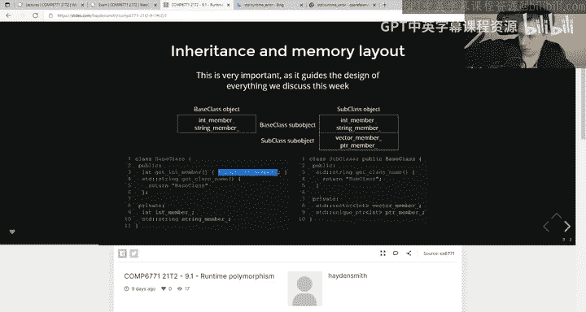

---

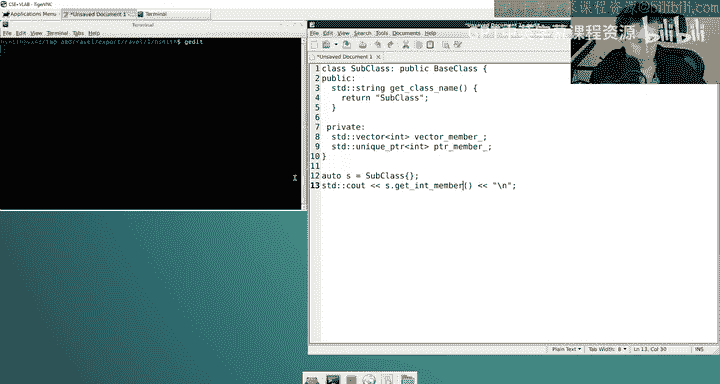

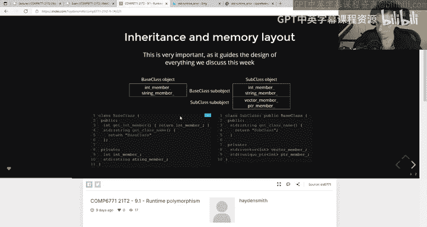

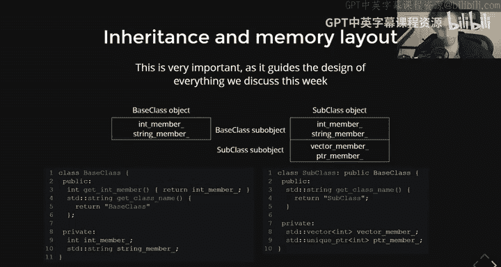

## 对象的内存布局与切片问题

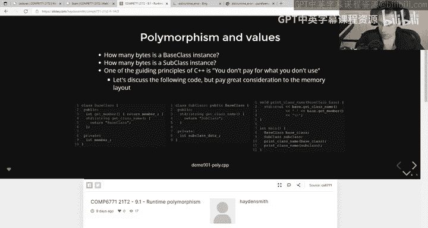

理解对象在内存中的布局对于掌握多态性至关重要。

### 基类与派生类的内存布局

考虑以下类：

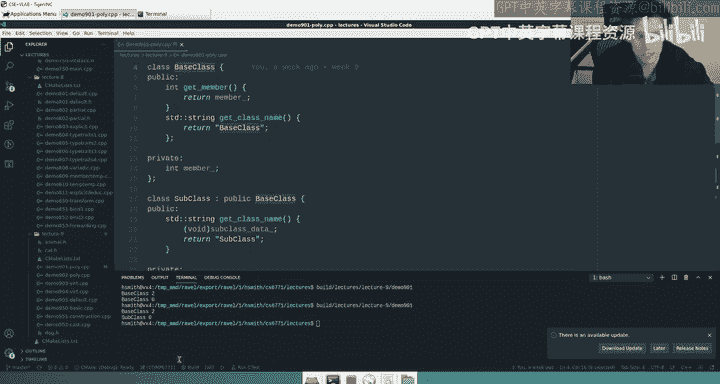

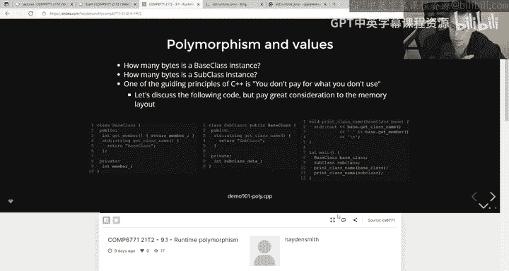

**代码示例：**
```cpp
class Base {
private:
    int member_;
    std::string name_;
public:
    int get_member() const { return member_; }
    std::string get_class_name() const { return "Base"; }
};

class Derived : public Base {
private:
    std::vector<int> vec_member_;
    std::unique_ptr<int> ptr_member_;
public:
    std::string get_class_name() const { return "Derived"; } // 重写函数
};
```

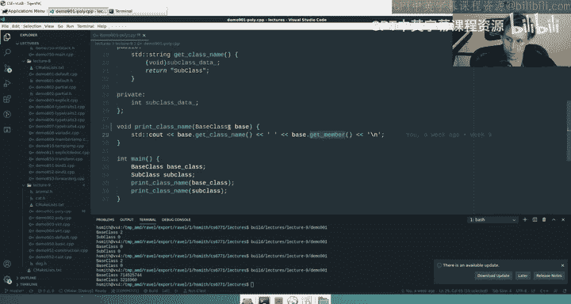

*   `Base` 对象在内存中包含两个数据成员：`int member_` 和 `std::string name_`。
*   `Derived` 对象则包含四个数据成员：从 `Base` 继承的两个，以及它自己的 `vec_member_` 和 `ptr_member_`。
*   成员函数（如 `get_member`）的代码并不存储在每个对象中，而是存储在程序的代码段。

### 对象切片问题

当我们尝试通过值传递来处理多态时，会遇到“对象切片”问题。

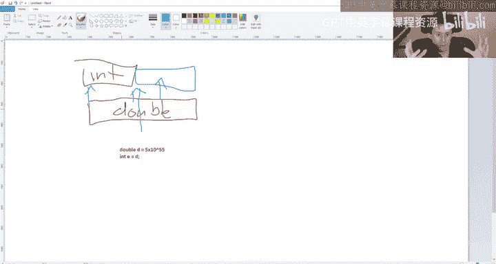

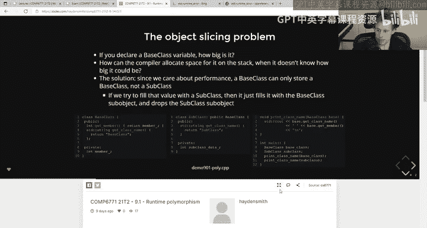

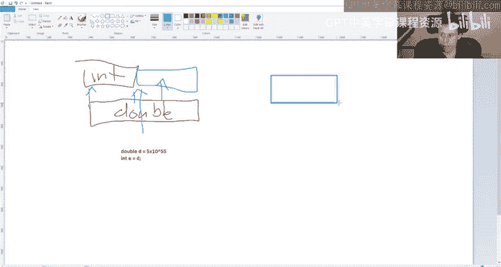

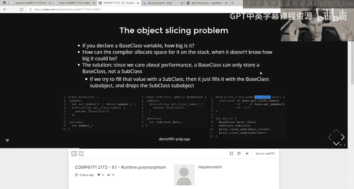

**问题示例：**
```cpp
void print_name(Base b) { // 按值传递
    std::cout << b.get_class_name() << std::endl;
}

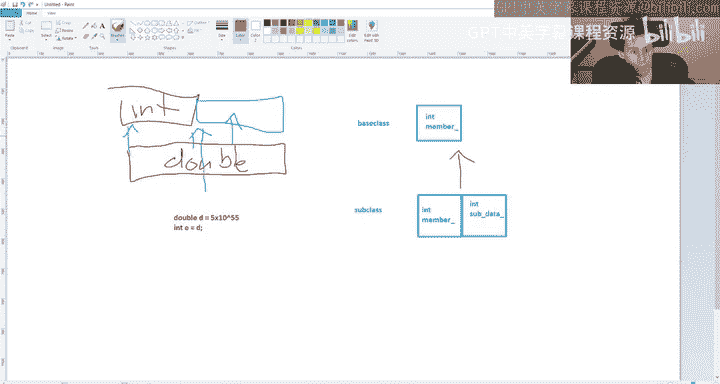

int main() {
    Base b;
    Derived d;
    print_name(b); // 输出 "Base"
    print_name(d); // 输出 "Base" (但我们期望 "Derived")
}
```


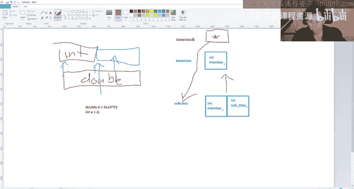

**原因分析：**
`Base` 对象在内存中有一个固定的大小。当 `Derived` 对象通过值传递给期望 `Base` 类型的函数时，编译器会创建一个新的 `Base` 对象并进行复制。由于 `Base` 类型的内存空间不足以容纳 `Derived` 的所有额外数据成员，这些额外的数据就被“切掉”了。因此，函数内部处理的是一个纯粹的 `Base` 对象，调用它的 `get_class_name` 自然返回 `"Base"`。

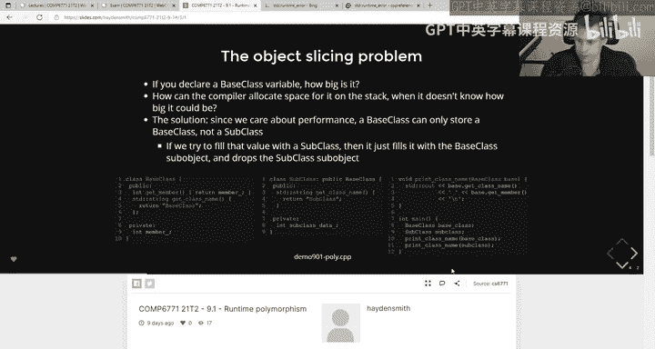

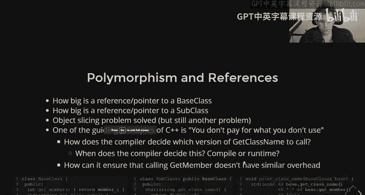

**解决方案：**
要避免切片并实现真正的多态行为，应始终通过**指针**或**引用**来传递对象。

```cpp
void print_name(const Base& b) { // 按常量引用传递
    std::cout << b.get_class_name() << std::endl;
}
// 或者
void print_name(const Base* b) { // 按指针传递
    if (b) std::cout << b->get_class_name() << std::endl;
}
```

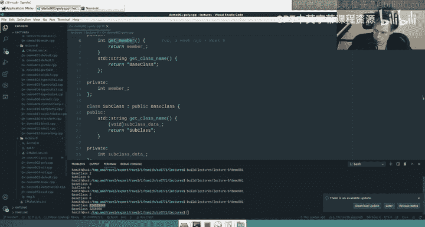

引用和指针本身的大小是固定的（通常是一个机器字长），它们只是指向实际对象，因此不会发生切片。

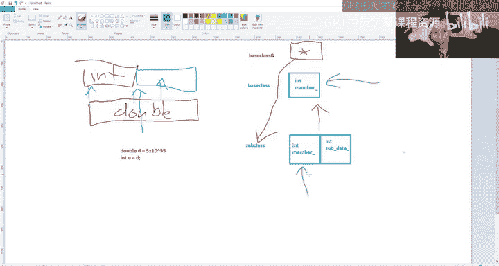

---

## 虚函数与覆盖

即使我们通过引用传递，上面的例子仍然可能输出两个 `"Base"`。这是因为编译器在编译时需要决定调用哪个版本的 `get_class_name`。默认情况下，它根据变量的**静态类型**（即声明时的类型）来决定，而不是根据它实际指向的对象的**动态类型**。

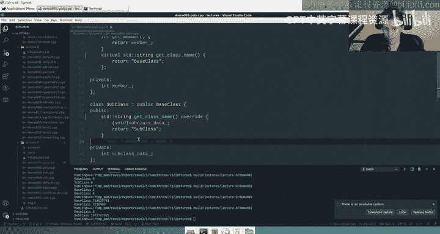

为了让编译器在运行时根据对象的实际类型来调用正确的函数，我们需要使用**虚函数**。

### 使用 `virtual` 和 `override`

*   在基类中，将可能被派生类重新定义的函数声明为 `virtual`。
*   在派生类中，使用 `override` 关键字来显式表明你正在覆盖基类的虚函数。

**修正后的代码示例：**
```cpp
class Base {
public:
    virtual ~Base() = default; // 虚析构函数，稍后解释
    virtual std::string get_class_name() const { return "Base"; }
    int get_member() const { return member_; } // 非虚函数
private:
    int member_;
};

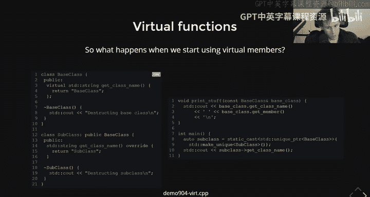

class Derived : public Base {
public:
    std::string get_class_name() const override { return "Derived"; }
};
```

现在，当我们通过基类引用调用 `get_class_name` 时，程序会输出：
*   `Base` -> `"Base"`
*   `Derived` -> `"Derived"`

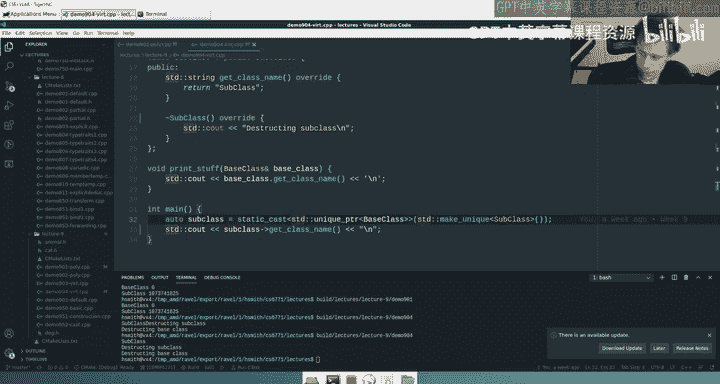

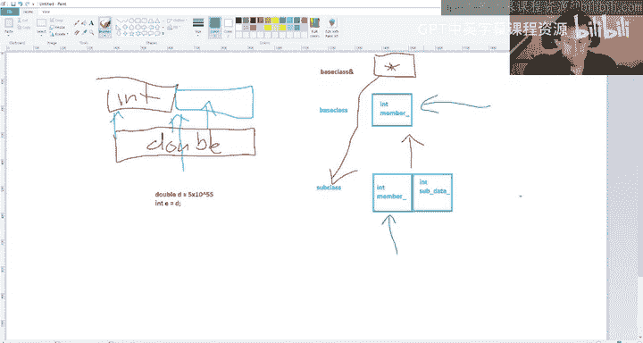

### 为什么需要虚函数？

C++的设计哲学是“不为未使用的功能付出代价”。如果不将函数标记为 `virtual`，编译器可以进行优化，直接进行静态绑定（在编译时确定调用哪个函数），速度更快，占用内存更少。而标记为 `virtual` 则意味着需要支持动态绑定，这会引入一些运行时开销（我们接下来会看到），但换来了多态的灵活性。

`override` 关键字不是编译器必需的，但强烈建议使用。它可以防止因拼写错误、参数列表不匹配或 const 限定符不同而意外创建新函数，而不是覆盖虚函数。

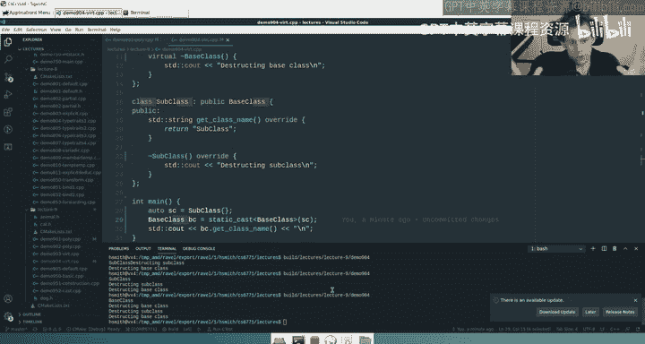

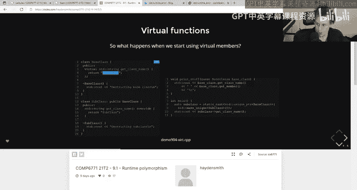

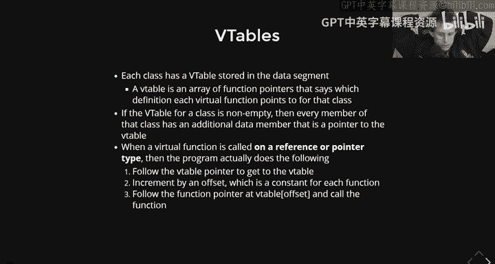

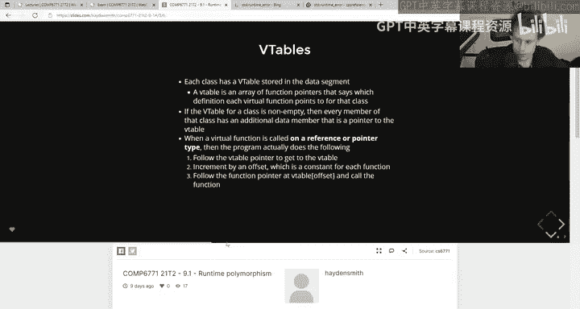

---

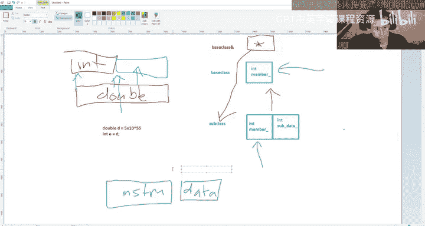

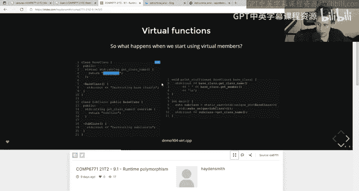

## 虚函数表（vtable）机制


虚函数是如何在运行时实现动态绑定的呢？答案是**虚函数表**。

### 什么是虚函数表？

*   每个包含虚函数的类都有一个对应的虚函数表（vtable）。
*   vtable 是一个函数指针数组，存储在程序的数据段中（编译时确定）。
*   表中的每一项指向该类的一个虚函数的具体实现。
*   如果一个类继承了带有虚函数的基类，它会有自己的 vtable。对于它覆盖的虚函数，表中指向其自己的实现；对于未覆盖的虚函数，表中指向基类的实现。

### 对象与vtable的关联


*   当一个类拥有虚函数时，这个类的**每个对象**在内存中都会包含一个额外的隐藏成员——一个指向该类 vtable 的指针（通常称为 `vptr`）。
*   因此，带有虚函数的对象会比没有虚函数的同类对象稍大一些（多一个指针的大小）。

### 动态调用的过程


当我们通过基类指针或引用调用一个虚函数时（例如 `basePtr->get_class_name()`），程序会执行以下步骤：
1.  通过对象的 `vptr` 找到该对象所属类的 vtable。
2.  在 vtable 中查找要调用的虚函数对应的条目（偏移量在编译时已知）。
3.  跟随该条目中的函数指针，调用正确的函数实现。


这个过程就是**动态绑定**，它发生在运行时。

---


## 静态绑定 vs. 动态绑定


*   **静态绑定（早期绑定）**： 在编译时就能确定调用哪个函数。非虚函数的调用、通过对象本身（而不是指针/引用）进行的调用都是静态绑定。它关联的是名字的**静态类型**（变量声明时的类型）。
*   **动态绑定（晚期绑定）**： 在运行时才能确定调用哪个函数。通过基类指针或引用调用虚函数时发生。它关联的是指针/引用所指向对象的**动态类型**（实际对象的类型）。

**示例：**
```cpp
Derived d;
Base& b_ref = d; // b_ref 是 Base 的引用，但指向 Derived 对象


// 静态类型：Base&
// 动态类型：Derived
std::cout << b_ref.get_class_name(); // 动态绑定，输出 "Derived"
```


---


## 纯虚函数与抽象类


### 纯虚函数

有时，基类中的某个虚函数无法提供有意义的默认实现，它只是为派生类定义一个必须实现的接口。这时我们可以将其声明为**纯虚函数**。

**语法：** 在函数声明的末尾加上 `= 0`。

```cpp
class Shape { // 形状基类
public:
    virtual ~Shape() = default;
    virtual double area() const = 0; // 纯虚函数，计算面积
    virtual int sides() const = 0;   // 纯虚函数，获取边数
};
```


### 抽象类


包含至少一个纯虚函数的类称为**抽象类**。
*   抽象类不能被实例化（不能创建该类的对象）。
*   它的作用是为派生类定义一个公共接口和可能的部分实现。
*   派生类必须覆盖（实现）所有的纯虚函数，否则派生类也会成为抽象类。


抽象类代表了一种过于抽象、无法独立存在的概念（如“形状”），而它的派生类（如“圆形”、“矩形”）才是具体可用的。


使用纯虚函数和抽象类是一种编译时强制接口约定的好方法。


---

## `final` 关键字


`final` 关键字可以用于类或虚函数。
*   用于类：表示该类不能被继承。
    ```cpp
    class NoFurtherDerivation final : public Base { ... };
    ```
*   用于虚函数：表示该虚函数在派生类中不能再被覆盖。
    ```cpp
    class Base {
    public:
        virtual void do_something() final; // 这是最终的实现
    };
    ```
使用 `final` 可以让编译器进行更多优化，因为它知道该函数的实现不会再改变。


---


## 总结


本节课我们一起学习了C++动态多态性的基础知识：

1.  **继承**是构建类层次结构的基础。
2.  必须通过**指针或引用**来传递多态对象，以避免**对象切片**问题。
3.  **虚函数**（`virtual`）是实现运行时多态的关键，它允许根据对象的实际类型来调用函数。
4.  使用 `override` 关键字可以明确意图并让编译器检查错误。
5.  虚函数通过**虚函数表（vtable）** 机制实现，每个对象有一个指向vtable的指针，用于在运行时查找正确的函数地址。
6.  **静态绑定**发生在编译时，关联静态类型；**动态绑定**发生在运行时，关联动态类型。
7.  **纯虚函数**（`= 0`）定义了接口而没有实现，包含纯虚函数的类是**抽象类**，不能实例化。
8.  `final` 关键字可以阻止进一步的继承或覆盖。


理解这些概念对于编写灵活、可扩展的面向对象C++程序至关重要。在下一部分，我们将继续探讨更多关于多态性的高级主题。