# 022：动态多态性（第二部分）🚀

在本节课中，我们将继续学习C++中的动态多态性，深入探讨对象存储、类型转换、构造函数与析构函数的行为，以及一些高级概念如协变与逆变。我们将通过具体的代码示例和概念解释，帮助你理解这些复杂但核心的主题。


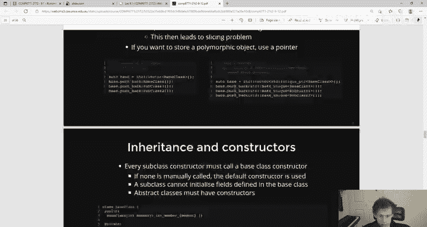

---

## 对象存储与切片问题

上一节我们介绍了虚函数和动态绑定的基础。本节中我们来看看如何存储多态对象，以及需要注意的“对象切片”问题。

在像Java这样的语言中，你可以轻松地将子类对象放入父类类型的容器中。但在C++中，如果你尝试通过值来存储多态对象，就会遇到问题。

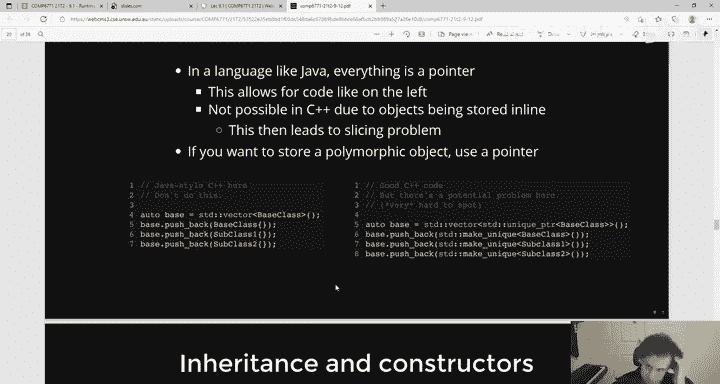

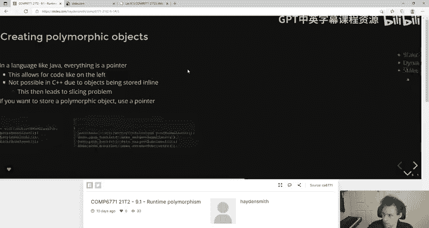

以下是存储多态对象时需要注意的关键点：

*   **向量存储问题**：`std::vector<BaseClass>` 存储的是对象的值。当你向其中推入一个 `SubClass` 对象时，会发生对象切片，`SubClass` 特有的部分会被“切掉”，容器中只剩下一个 `BaseClass` 对象。
*   **引用限制**：你不能创建 `std::vector<BaseClass&>`，因为C++标准库容器不能直接存储引用。
*   **解决方案**：因此，存储多态对象集合的**唯一安全方式**是使用指针，最好是智能指针。例如：`std::vector<std::unique_ptr<BaseClass>>`。

```cpp
// 正确做法：使用智能指针存储多态对象
std::vector<std::unique_ptr<BaseClass>> vec;
vec.push_back(std::make_unique<BaseClass>());
vec.push_back(std::make_unique<SubClass1>());
vec.push_back(std::make_unique<SubClass2>());
```

---

## 构造函数、析构函数与继承链

现在，让我们探讨在继承体系中，构造函数和析构函数的调用顺序及其影响。

### 构造函数调用顺序

当创建一个派生类对象时，构造过程是从最顶层的基类开始，逐层向下到最具体的派生类。

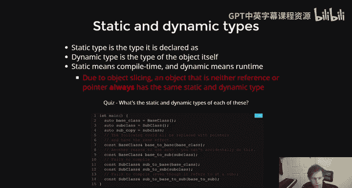

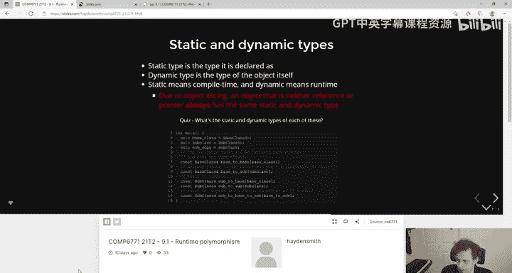

**规则**：每个派生类的构造函数**必须**首先调用其直接基类的构造函数。这是为了确保基类的私有成员能被正确初始化。

```cpp
class Base {
private:
    int member;
public:
    Base(int m) : member{m} {}
};

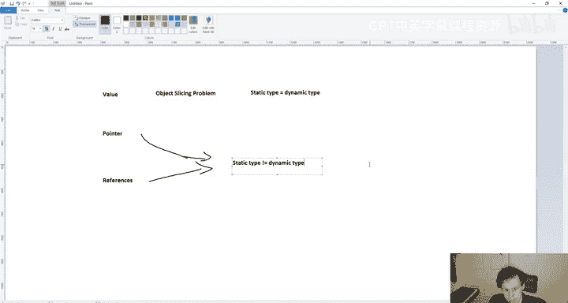

class Derived : public Base {
private:
    std::unique_ptr<int> ptr;
public:
    // 必须首先调用基类构造函数
    Derived(int m, std::unique_ptr<int> p)
        : Base{m}, // 调用基类构造函数
          ptr{std::move(p)} // 然后初始化自身成员
    {}
};
```

### 析构函数调用顺序

析构函数的调用顺序与构造函数**相反**：先调用派生类的析构函数，然后沿着继承链向上调用基类的析构函数。

**重要建议**：如果一个类可能被继承（即用作多态基类），应将其析构函数声明为 `virtual`。这确保了通过基类指针删除派生类对象时，派生类的析构函数能被正确调用，避免资源泄漏。

```cpp
class PolymorphicBase {
public:
    virtual ~PolymorphicBase() = default; // 虚析构函数
};
```

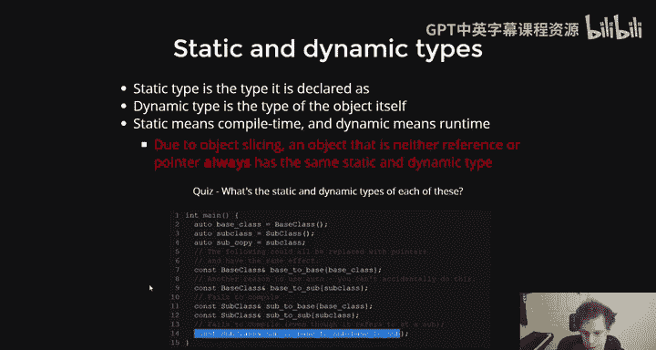

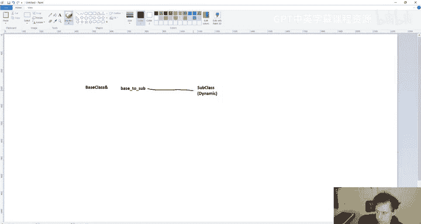

---

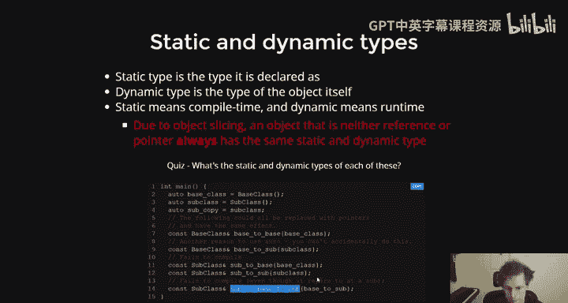

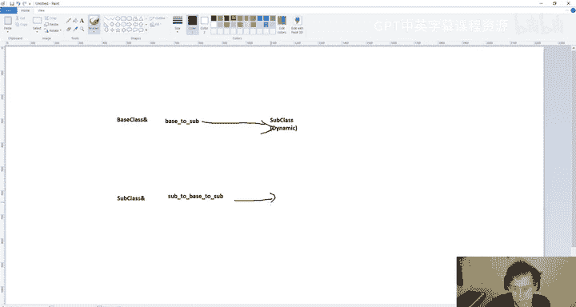

## 静态类型 vs. 动态类型

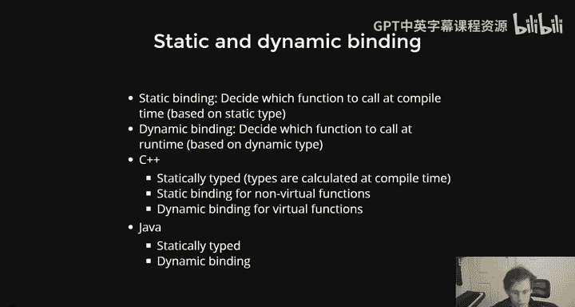

理解静态类型和动态类型的区别对于掌握多态至关重要。

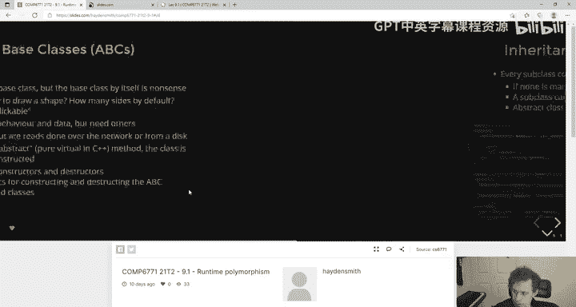

*   **静态类型**：变量在**编译时**被声明的类型。看赋值语句的左侧即可知。
*   **动态类型**：变量在**运行时**实际指向或引用的对象的类型。

以下是不同类型变量组合的示例：

```cpp
Base base; // 静态类型：Base， 动态类型：Base
SubClass sub; // 静态类型：SubClass， 动态类型：SubClass

Base& baseRefToSub = sub; // 静态类型：Base&， 动态类型：SubClass
// SubClass& subRefToBase = base; // 错误！不能将基类引用绑定到派生类对象
```

**关键点**：
*   对于**值类型**，由于对象切片，静态类型总是等于动态类型。
*   对于**指针或引用**，静态类型和动态类型可能不同，这正是多态工作的基础。
*   `auto` 关键字会让变量的静态类型等于其初始化表达式的类型，从而避免隐式的向上转型。

---

## 向上转型与向下转型

在处理类层次结构时，类型转换是常见的操作。主要有两种转换方向。

### 向上转型

向上转型是从派生类转换到基类（在继承树上向上移动）。这总是安全的，并且经常隐式发生。

```cpp
Dog dog;
Animal& animalRef = dog; // 向上转型，安全
Animal* animalPtr = &dog; // 向上转型，安全
```

### 向下转型

向下转型是从基类转换到派生类（在继承树上向下移动）。这**不安全**，因为基类对象可能不是那个派生类的实例。C++提供了两种方式进行向下转型。

以下是进行向下转型的方法：

*   **`static_cast`**：在**编译时**进行转换，不进行运行时类型检查。仅当你**100%确定**对象的动态类型时使用，否则是未定义行为。
*   **`dynamic_cast`**：在**运行时**进行转换，会检查对象的实际类型。对于指针，失败时返回 `nullptr`；对于引用，失败时抛出 `std::bad_cast` 异常。

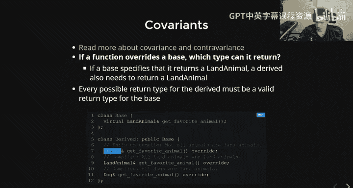

```cpp
Animal* animalPtr = new Dog;

// 向下转型
Dog* dogPtrStatic = static_cast<Dog*>(animalPtr); // 危险，假设你知道它是Dog
Dog* dogPtrDynamic = dynamic_cast<Dog*>(animalPtr); // 安全，会检查
if (dogPtrDynamic) {
    // 转换成功
}
```

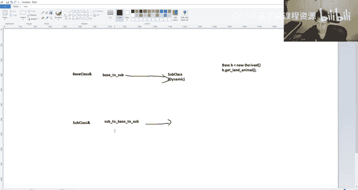

---

## 协变与逆变

当覆盖虚函数时，返回类型和参数类型需要遵循特定的规则，分别是协变和逆变。

### 协变

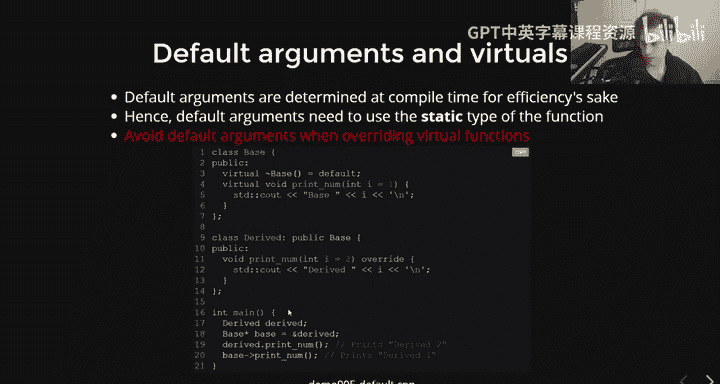

协变适用于虚函数的**返回类型**。覆盖函数可以返回基类函数返回类型的**派生类型**。

```cpp
class Animal {};
class LandAnimal : public Animal {};
class Dog : public LandAnimal {};

class Base {
public:
    virtual LandAnimal& getFavoriteAnimal();
};
class Derived : public Base {
public:
    Dog& getFavoriteAnimal() override; // 允许：Dog 是 LandAnimal 的派生类
    // Animal& getFavoriteAnimal() override; // 错误：Animal 是 LandAnimal 的基类
};
```

### 逆变

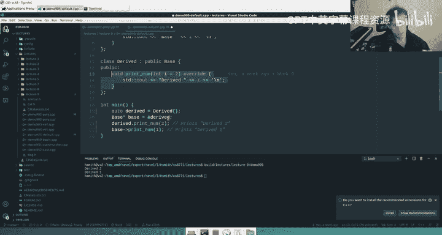

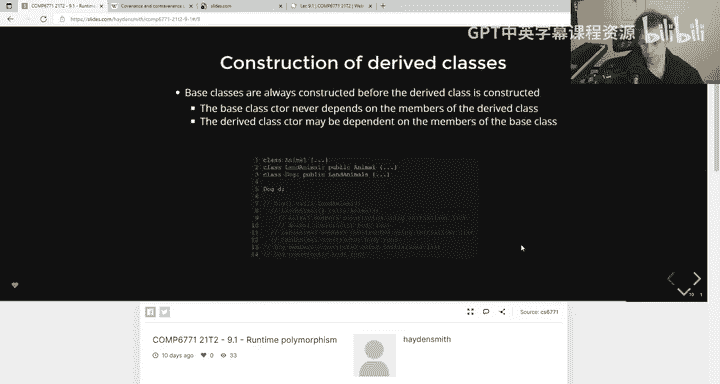

逆变适用于虚函数的**参数类型**。覆盖函数可以使用基类函数参数类型的**基类型**作为参数。

```cpp
class Base {
public:
    virtual void useAnimal(LandAnimal& a);
};
class Derived : public Base {
public:
    void useAnimal(Animal& a) override; // 允许：Animal 是 LandAnimal 的基类
    // void useAnimal(Dog& a) override; // 错误：Dog 是 LandAnimal 的派生类
};
```

---

## 虚函数与默认参数

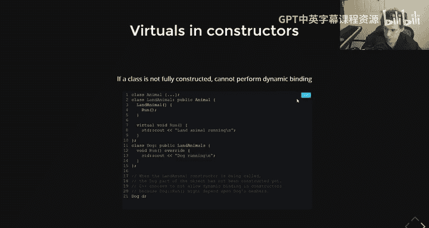

这是一个需要特别注意的细节：虚函数的默认参数是**静态绑定**的。

这意味着默认参数的值在编译时根据调用该函数的**静态类型**确定，而不是运行时根据动态类型确定。这可能导致违反直觉的结果。

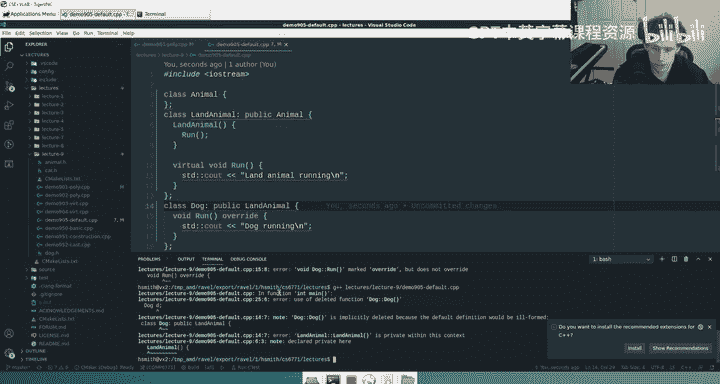

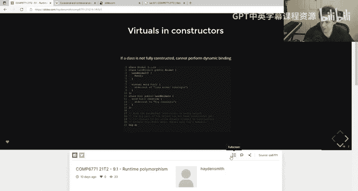

**核心建议**：避免在虚函数中使用默认参数。如果需要默认行为，可以考虑使用重载或其他设计模式。

```cpp
class Base {
public:
    virtual void printNum(int x = 1) { cout << “Base: “ << x; }
};
class Derived : public Base {
public:
    void printNum(int x = 2) override { cout << “Derived: “ << x; }
};

Derived d;
Base& b = d;
d.printNum(); // 输出：Derived: 2 (静态类型Derived，使用默认参数2)
b.printNum(); // 输出：Derived: 1 (静态类型Base，使用默认参数1，但调用Derived的函数体)
```

---

## 构造与析构期间的动态绑定

在对象的构造和析构过程中，动态多态性（即通过虚函数表查找）的行为是特殊的。

**重要规则**：
1.  在构造函数中，对象正在构建中，其动态类型被视为当前正在构造的类类型。因此，在基类构造函数中调用虚函数，不会下降到派生类的覆盖版本。
2.  在析构函数中，对象正在销毁中，其动态类型也被视为当前正在析构的类类型。在基类析构函数中调用虚函数，同样不会调用派生类的覆盖版本。

**最佳实践**：避免在构造函数和析构函数中调用虚函数。如果需要，可以考虑使用非虚函数或传递参数来初始化。

---

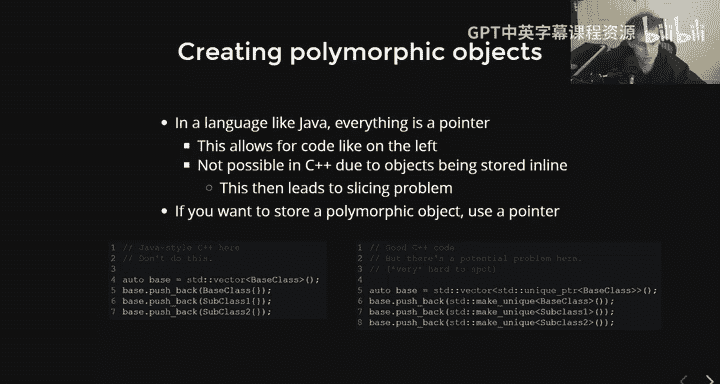

本节课中我们一起学习了C++动态多态性的高级主题。我们探讨了如何安全地存储多态对象，理解了静态与动态类型的区别，掌握了向上转型和向下转型的安全用法，认识了协变与逆变的规则，并注意到了虚函数中默认参数以及构造/析构期间动态绑定的特殊行为。这些知识对于编写正确、高效且安全的面向对象C++程序至关重要。