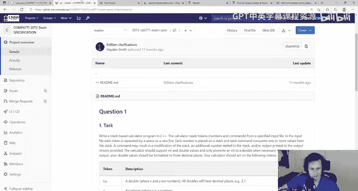
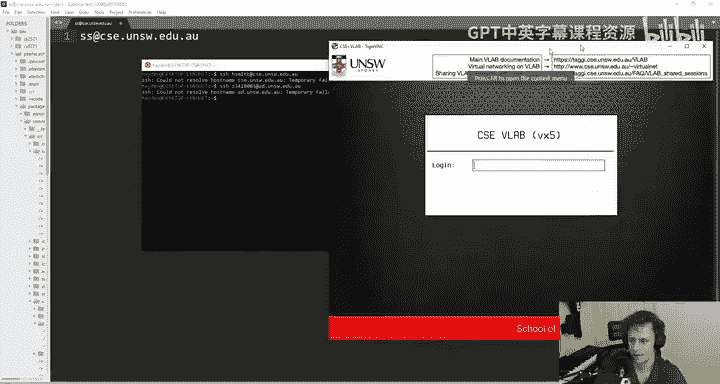
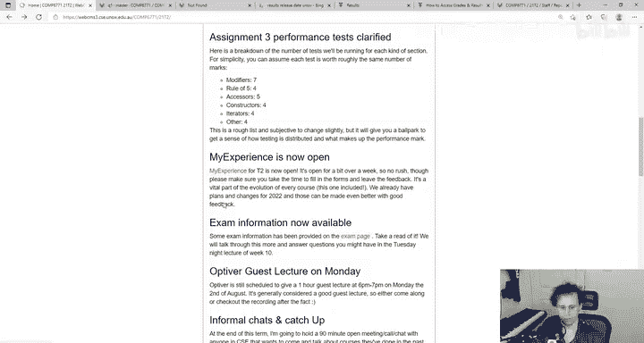

# 024：考试说明与复习指南

## 概述

在本节课中，我们将详细介绍COMP6771课程的期末考试安排、结构、备考策略以及考试期间的重要注意事项。我们将涵盖考试形式、评分方式、技术准备以及如何应对可能出现的突发情况。

## 考试基本信息

考试将于**8月23日（星期一）下午2点至5点**进行。这是一场开卷考试，总分为30分，占课程总成绩的30%。

考试将包含**两道小型“作业风格”的编程题**，每道题15分。题目设计旨在评估你对C++核心概念的理解和应用能力，而非测试记忆或理论细节。

## 考试结构与题目类型

上一节我们介绍了考试的基本信息，本节中我们来看看考试的具体结构和题目类型。

考试包含两种主要类型的题目：

1.  **第一题：问题解决型（类似Assignment 1风格）**
    *   重点在于算法和逻辑实现。
    *   不要求深入掌握复杂的C++语法细节（如智能指针、运算符重载）。
    *   示例：实现一个基于栈的计算器，处理输入命令并输出结果。
    *   目标是让擅长解决问题但觉得C++细节复杂的学生能够展示能力。

2.  **第二题：C++接口实现型（介于Assignment 2和3风格之间）**
    *   重点在于实现一个类或接口，展示对C++特性的运用。
    *   可能涉及类设计、模板、运算符重载、迭代器等。
    *   允许使用STL容器，因此实现可能比Assignment 2更直接。
    *   目标是评估你对C++语言特性的实际应用能力。

**核心设计理念**：题目不能太小（易导致抄袭），也不能是单一的“全有或全无”式大题（评分困难）。两道中等规模的题目能在有限时间内提供合理的区分度。

## 考试环境与技术准备

了解了题目类型后，我们需要确保有一个稳定的考试环境。以下是关于技术准备的重要事项。

### 网络与连接要求

考试期间，你必须拥有稳定的网络连接，用于向GitLab推送代码和接收邮件。

*   **网络不稳定怎么办？**
    *   尝试优化现有环境：将电脑靠近路由器、调整手机热点位置。
    *   如果因疫情限制无法前往他处，且网络问题确实无法解决，请**尽早**通过邮件联系讲师，商讨可能的解决方案（如延迟参加补考）。
*   **VLAB或CSE系统问题？**
    *   如果是CSE系统大规模故障，学校会酌情处理（如延长考试时间）。
    *   个人连接VLAB的问题通常与本地网络有关。

### 开发环境选择

你可以选择在CSE的VLAB上或本地进行开发。

*   **在VLAB上使用VS Code SSH**：推荐方式。相关设置指南已在课程论坛置顶。
*   **在本地开发**：允许。但**必须注意**：最终自动评分将在CSE机器上进行。
    *   **关键步骤**：在提交前，务必在CSE机器上测试你的代码是否能正确编译和运行。
    *   **风险**：在本地开发三小时，最后五分钟提交时发现代码在CSE上不工作，将无法获得特殊考虑。

### 代码提交与验证

考试结束时，你需要将代码提交到指定的GitLab仓库。

*   **提交依据**：我们将以你GitLab仓库`master`分支在截止时间点的内容为准进行评分。
*   **时间戳注意**：GitLab显示的是**提交（commit）**的时间，而非**推送（push）**的时间。只要在截止时间前完成推送即可。
*   **自动检查脚本**：考试期间，我们会提供一个在CSE机器上运行的脚本命令（例如 `6771-exam-q1`）。
    *   **作用**：该脚本会克隆你的仓库，尝试编译你的代码，并运行一个简单的测试用例。
    *   **目的**：这不是为了验证代码完全正确，而是提供一个“完整性检查”，确保你的代码能够编译，没有致命的语法错误。**最终评分将基于更全面的自动化测试集**。

## 考试规则与特殊情况处理

准备好了环境，我们还需要清楚考试的规则以及遇到问题该如何应对。

### 健康状况与特殊考虑

*   **开始考试即视为状态良好**：根据学校政策，一旦你开始考试，即表示你自认身体健康，可以完成考试。
*   **考试前不适**：如果考试当天早上感到不适（如头痛、生病），**请不要开始考试**。应立即申请特殊考虑（Special Consideration）以获得补考资格。
*   **考试中突发状况**：如果在考试期间突发严重健康问题或其他极端情况（如紧急医疗事件），请：
    1.  立即停止考试。
    2.  尽快给讲师发送邮件说明情况。
    3.  在当天或次日提交特殊考虑申请及相关证明。
    学校通常会批准此类情况下的补考。

### 学术诚信与沟通

*   **允许使用的内容**：你可以使用**自己**的笔记、讲义、以及**自己完成的**作业代码。禁止使用他人的代码或进行任何形式的协作。
*   **沟通至关重要**：考试期间遇到任何技术或突发问题，**请立即在课程论坛（Ed）上发帖说明**（除非是涉及需要停止考试的严重健康问题，则应直接邮件联系讲师）。过度沟通好过沟通不足。
    *   **反面案例**：曾有学生在考试结束后8小时才邮件告知未能成功提交，因“考试压力大先去睡觉了”。由于无法核实期间发生什么，很难提供帮助。

## 评分标准与备考建议

最后，我们来明确一下考试的评分标准，并给出备考方向。

### 评分与审查

*   **自动评分**：考试将主要采用自动化评分。
*   **无特定格式或风格要求**：在时间压力下，不要求代码格式（clang-format）、linting或完美的编程风格。重点是让代码正确运行。
*   **无测试要求**：不要求你编写Catch2测试。当然，你可以自己写测试来验证代码，但这并非评分项。
*   **代码编译失败**：如果代码无法编译，通常该题得分会很低或为零。在特定情况下（如课程总分在及格线边缘），讲师会人工复查试卷，判断是否因小错误导致，但这不是常规流程。
*   **分数分配明确**：考试题目会明确标出每部分的分数，帮助你合理分配时间。

### 复习范围与策略

考试内容涵盖整个学期所学的核心C++主题。

*   **明确会涉及的主题**：
    *   STL容器、迭代器、算法
    *   类类型（构造、析构、静态成员等）
    *   运算符重载
    *   异常处理
    *   模板（第二题很可能是一个模板类）
    *   动态多态与继承的基本概念
*   **可能涉及或作为拔高的主题**：
    *   自定义迭代器（如果出现，可能只占少量分数，用于区分高分学生）
    *   高级模板特性（类型特征、特化等）
*   **资源管理（如智能指针）**：可能需要了解，但题目设计可能允许你避免使用它们。
*   **最佳备考资料**：**你完成的三个作业**。如果你有任何作业没有完成或理解不透彻，现在是回顾和完成它们的最佳时机。通过作业，你已经为考试进行了最直接的准备。

## 总结

本节课中我们一起学习了COMP6771期末考试的完整指南。我们明确了考试时间是8月23日14:00-17:00，形式是两道编程题。我们讨论了应选择稳定的考试环境，并提前熟悉在CSE机器上的操作流程。我们强调了考试规则，特别是健康状况的申报和遇到问题要及时沟通的重要性。最后，我们回顾了评分方式，并指出以本学期的作业为核心进行复习是最有效的备考策略。

请关注课程页面，本周内将发布**模拟考试（Sample Exam）**，其形式和环境设置与真实考试完全相同，是熟悉流程的最佳工具。祝大家复习顺利，考试成功！