# 025：考试复习指南 🎯

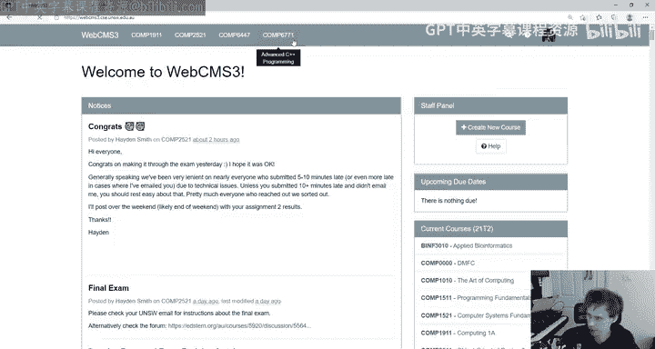

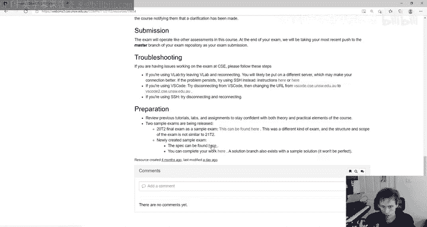

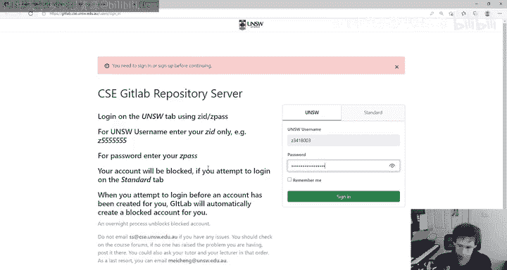

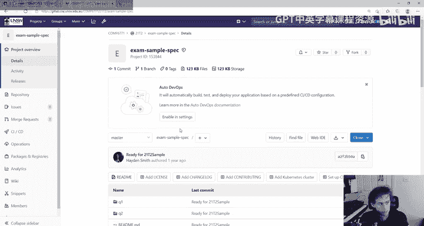

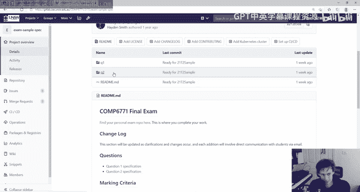

在本节课中，我们将一起回顾COMP6771课程的考试要点、结构以及备考策略。本次复习讲座旨在帮助你理解考试形式、明确复习重点，并提供实用的应试建议。

## 考试结构与形式 📝

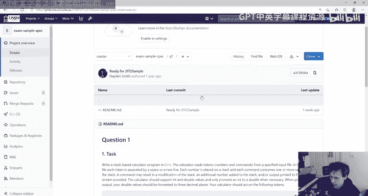

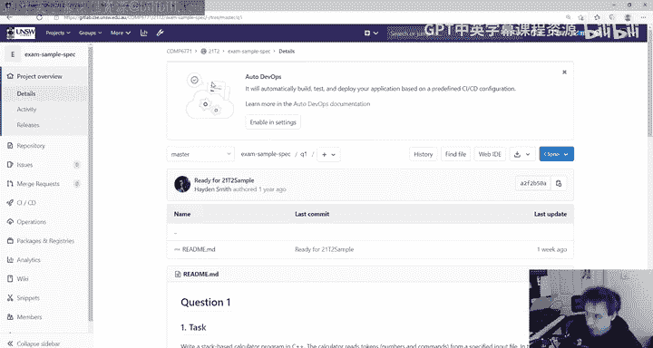

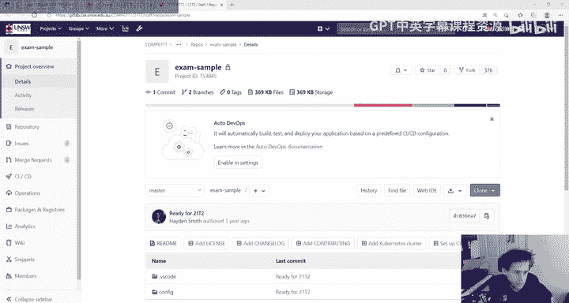

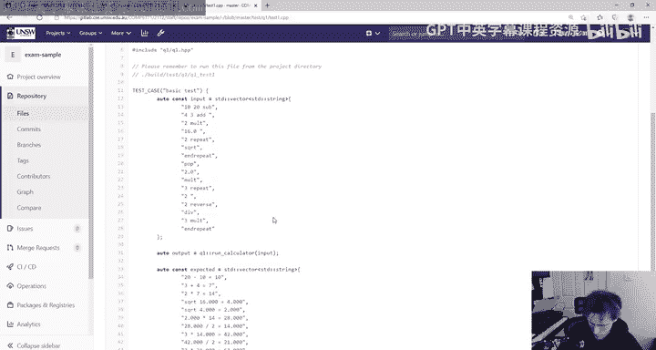

上一节我们介绍了课程的整体情况，本节中我们来看看考试的具体安排。

考试包含两个主要问题，它们的设计思路与样卷非常相似。

*   **问题一：深度问题**
    *   这类问题类似于“单词阶梯”或“栈计算器”风格的编程任务。
    *   核心是**实现一个函数**，该函数接收输入并执行特定操作。
    *   你不需要使用过于复杂的C++特性，主要依靠前几周学到的知识即可解决。当然，熟练使用STL容器和算法会让编码更轻松。
    *   评分方式类似于作业一：我们会用一系列难度递增的测试用例来评估你的实现。通过更多测试意味着获得更高分数。

*   **问题二：广度问题**
    *   这类问题类似于作业二的风格，侧重于**正确使用C++语言特性**。
    *   你可能很快就能理解题目要求，但挑战在于如何用C++正确地实现，例如处理模板、异常、继承、运算符重载、构造/析构函数等。
    *   我们会提供一个基础的测试用例，帮助你理解类的预期行为。

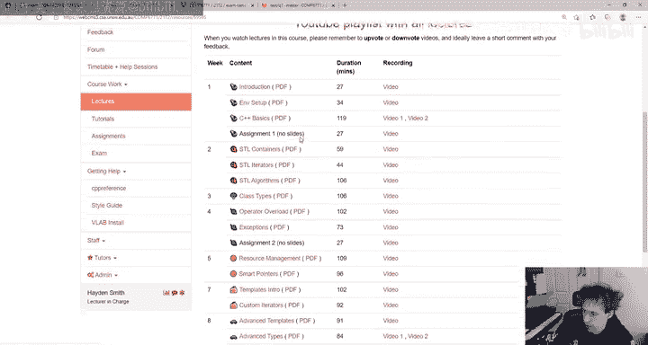

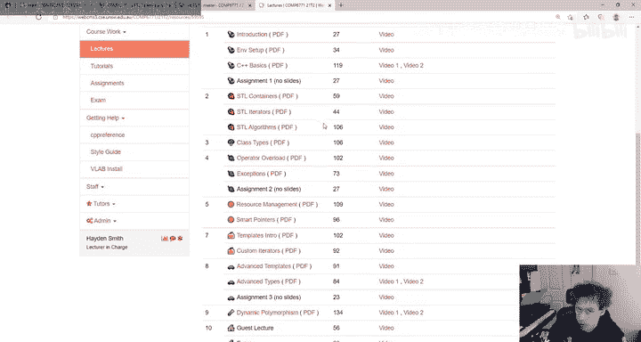

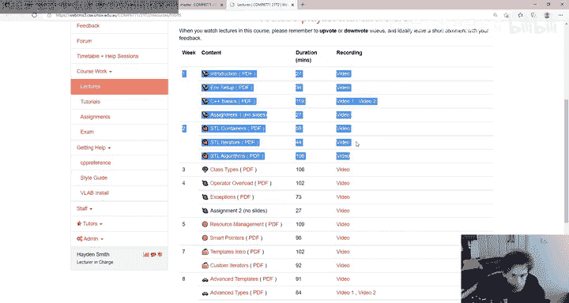

两个问题在分数上**权重相等**。考试旨在让擅长深度算法问题或广度语言特性的学生都能有机会展示自己的能力。

## 考试环境与流程 💻

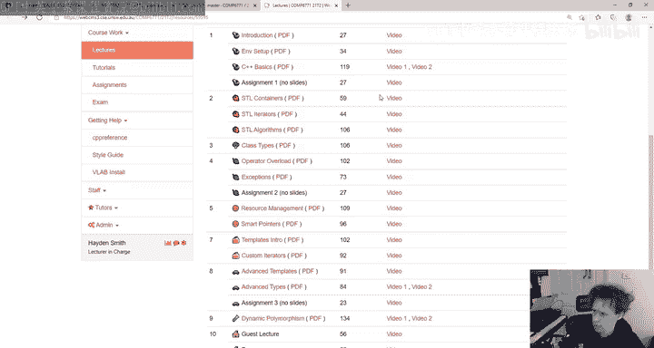

了解了考试内容后，我们来看看具体的考试环境和操作流程。

考试将在与样卷**完全相同的环境**中进行。如果你能成功设置并运行样卷，那么正式考试的环境配置将不会有任何问题。

以下是关于考试流程的一些关键信息：

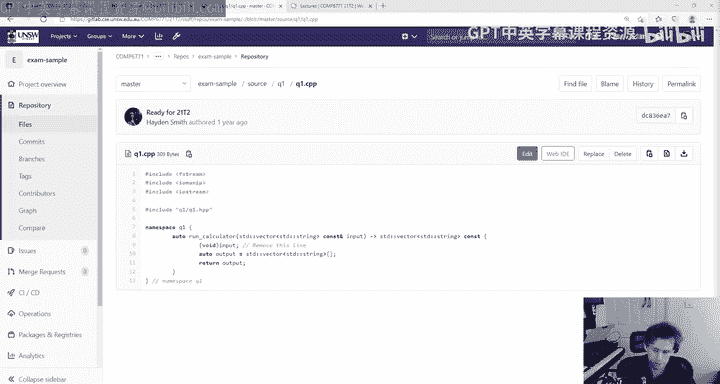

*   **代码仓库**：考试开始前（不少于15分钟），你将获得访问考试代码仓库的权限。该仓库基于样卷仓库创建，结构一致。
*   **测试命令**：你可以使用 `COMP6771 exam check` 命令在CSE机器上编译和运行测试。建议在考试开始约一小时后再使用此命令进行全面检查。
*   **提交时间**：最终评分将以你在GitLab上的**提交（commit）时间**为准，而非推送（push）时间。请务必在考试结束前完成提交。
*   **遇到问题**：如果遇到技术问题（如无法推送），请立即在考试论坛上发帖说明情况，并附上截图等证据。我们会根据实际情况进行合理处理。

**重要提醒**：考试为开卷，你可以参考自己的作业、讲义和实验解决方案代码。但是，**严禁从互联网复制代码**。抄袭检测系统非常灵敏，一旦发现将导致严重后果。

## 课程内容复习重点 📚

现在我们已经清楚了考试的形式，接下来梳理一下各周讲义内容的复习重点。

以下是各主题在考试中的相关性评估：

*   **第1-2周（C++基础、STL、迭代器）**：这些知识不是解决考试问题的**强制要求**，但掌握它们会**非常有帮助**，能让你更高效地解决问题。
*   **第3周（类类型）**：理解类的基本工作原理是重要的基础。
*   **第4周（运算符重载）与第5周（异常）**：这两个主题**非常重要**，你需要非常熟悉。
*   **第6周（资源管理与智能指针）**：理解资源管理是关键。虽然使用智能指针是良好实践，但在考试中并非强制。
*   **第7周（模板）与第8周（自定义迭代器）**：你需要对模板感到舒适。对于自定义迭代器，应理解其概念，但**不需要**从头实现一个完整的迭代器。
*   **第9周（高级模板）与第10周（高级类型）**：这部分内容可能只有少量知识点对考试有用。
*   **第11周（动态多态）**：你应该对此感到熟悉。

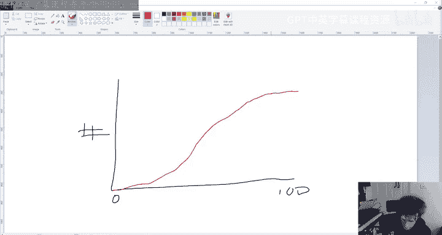

**核心建议**：对于标为“非常重要”和“应该熟悉”的主题，需要确保理论理解清晰。对于其他主题，在时间允许的情况下尽可能掌握，它们可能成为解决问题的有用工具。

## 备考策略与常见问题 ❓

在明确了复习重点后，我们来看看一些具体的备考策略和常见问题的解答。

**备考策略建议：**
1.  **起点选择**：可以考虑从**问题二**开始，因为这类问题可能需要更多时间编译和调试。在编译间隙，可以思考问题一的解法。
2.  **聚焦重点**：优先解决容易的部分，不要在某一个难点上耗费过多时间。考试评分不鼓励“英雄主义”的复杂解法。
3.  **练习巩固**：如果你对“单词阶梯”这类算法问题感到生疏，可以在一些编程练习网站上做些简单题目热身。

**常见问题解答：**
*   **需要自己编写测试吗？** 不需要。我们不会根据你编写的测试评分。
*   **代码风格会被评分吗？** 不会。我们主要通过自动化测试来评分。
*   **如果考试中代码编译不通过怎么办？** 对于非琐碎错误导致的编译失败，通常无法获得部分分数。请务必确保代码能通过 `exam check` 命令。
*   **遇到系统崩溃等极端情况怎么办？** 密切关注课程邮箱，我们会通过邮件发布紧急通知和解决方案。

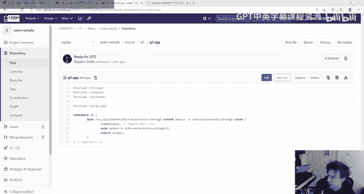

## 总结与祝福 ✨

本节课中我们一起学习了COMP6771期末考试的复习要点。

我们回顾了考试的两个核心问题类型：侧重于算法实现的**深度问题**和侧重于语言特性应用的**广度问题**。我们明确了考试的环境、流程以及重要的行为准则（特别是严禁抄袭）。接着，我们梳理了各周课程内容的复习优先级，帮助你高效分配时间。最后，我们分享了一些实用的备考策略并解答了常见疑问。

如果你已经较好地完成了前三项作业，那么你已经为这次考试做好了相当充分的准备。请保持自信，合理安排最后的复习时间。

祝大家在考试中一切顺利，取得理想的成绩！也请大家在疫情期间保重身体。期待未来在LinkedIn或其他场合与大家保持联系。再见！👋