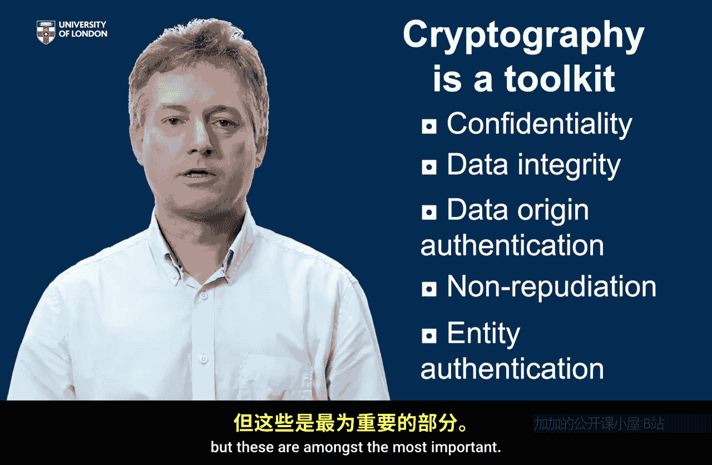
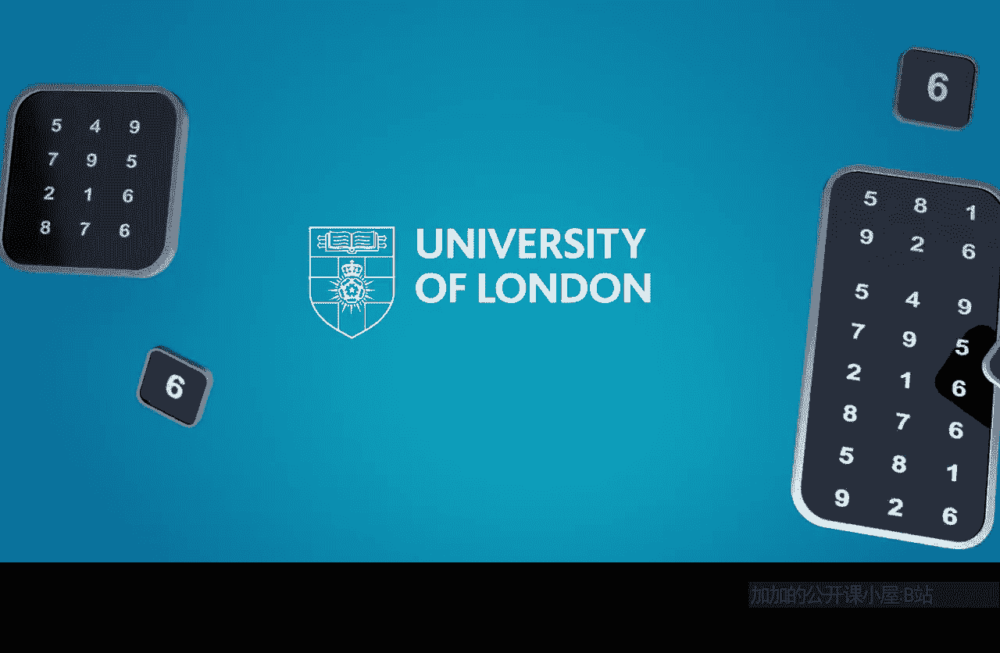

# 伦敦大学【中英⚡应用密码学入门｜Introduction to Applied Cryptography】 p05 P5 02_核心服务 -BV1dnbKzPE9R_p5-

So in lesson1， we saw that in the physical world， there are a range of physical security mechanisms and that we need to replace these in the digital world。

So in lesson two， we're going to consider cryptography as a toolkit of tools of mechanisms that can provide different types of security in the digital world。

 and we're going to look at some of these tools。At the end of this lesson。

 you will be able to discuss some of the core security services that are provided using cryptography。

And you'll be able to name several cryptographic mechanisms that provide these services。

Now it's important to recognize that cryptography is not going to provide a one to one replacement of security mechanisms in the physical world。

 but it is going to try and replace the things that are missing in this digital world and the first and again most obvious property we want to consider about information in the digital world is secrecy。

The need to make sure that only designated recipients can learn the contents of information。

We saw in the physical world that was provided often by physical proximity。

or by boxes and locks and things like that。 So this is the security service we refer to as confidentiality。

 the need to make sure that information is restricted only to intended participants。

And the cryptographic mechanism we use to implement confidentiality is encryption。

We have a range of tools for providing that stream ciphers， block cphers， public key encryption。

 they all fall under the heading encryption， that's our first tool。

So a very different but equally important security service that we need in the digital world is what I'm going to call data integrity。

And data integrity is really an assurance that data has not been altered or changed either accidentally or deliberately before someone actually reads it or relies on it。

Now there are a range of cryptographic tools for providing data integrity。

And these actually vary in the strength of integrity that they provide。

So we have tools such as hash functions， message authentication codes and digital signatures that are all used to provide data integrity A hash function。

 for example， is a tool that can only detect accidental changes to data。

If we want stronger data integrity， we need stronger tools。

A stronger property than data integrity is what we call data origin authentication。

 so data origin authentication not only make sure that data has not been changed but actually provide some kind of assurance as to who sent the data。

😊，This is sometimes called message authentication， so a data origin authentication mechanism will provide us with the ability to check the data hasn't been changed and give us some assurance as to where it came from an even stronger mechanism than that is the security service of nonreudiation。

So non repudiation actually gives us a guarantee that the data not only has not been changed and that we know where it came from。

But that whoever sent us that data cannot later deny that they sent us that data if you think about it。

 a handwritten signature in some sense is an analog of this。

 it's something we present in court as a sort of on a contract to suggest that data must have come from somebody because they signed the document。

But if you think about that handwritten signature it's somewhat easy to modify a contract after somebody has signed it。

 and this shows us that these cryptographic tools we're building can actually be stronger than this because a digital signature which we use for non-reudiation will also give us assurance that data has not been altered in any way because the signature will be different on a different kind of document。

 so data integrity， data origin authentication and nonreudiation are all important tools that help us detect whether information has altered。

Now there is another security service we might often want in the digital world。

 a different kind of authentication。And that's not authentication of data and messages。

 it's really the answer to the simple question who's out there？😊。

So if you consider when you log on to a device， a computer， or an iPad。

 the device immediatelyly says who's out there， who is using this device， who are you？

And we have a range of security mechanisms for doing this， including things like passwords。

 passcodes。Biometrics， fingerprints。Now these are not inherently cryptographic。

 although cryptography can be used to implement these。But cryptography also provides very。

 very strong ways of identifying yourself， so for example， in online banking。People often use tokens。

To present themselves to the bank and give some information across to the banking server。

 and these are relying inherently on a type of cryptography。

And we call this service entity authentication because you're trying to authenticate an entity a thing different to the message authentication we talked about earlier so cryptography is a toolkit。

 is a toolkit of different mechanisms。And we've talked about it the main security services that cryptography provides。

Confidentiality， data integrity， data origin authentication。

 non repudiation and entity authentication。 In fact。

 cryptography provides many more services than these。

But these are amongst the most important。

